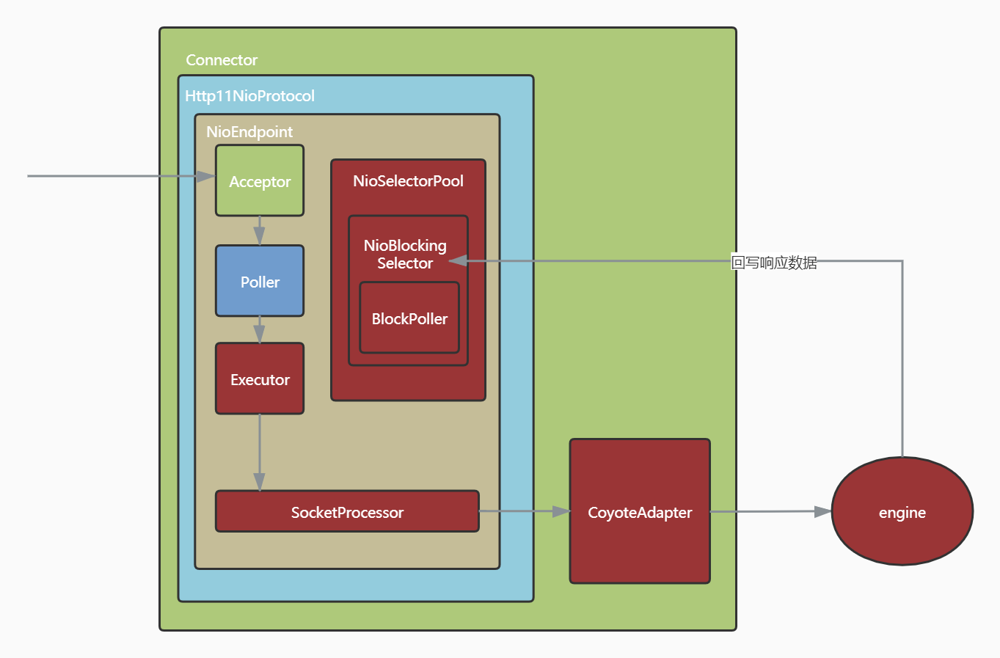
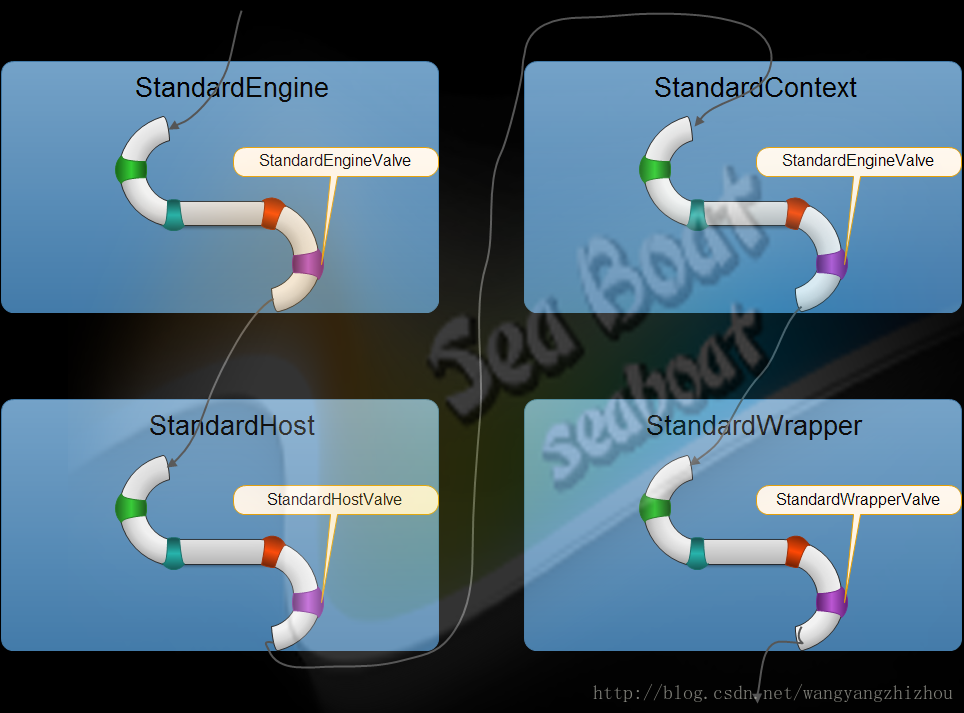
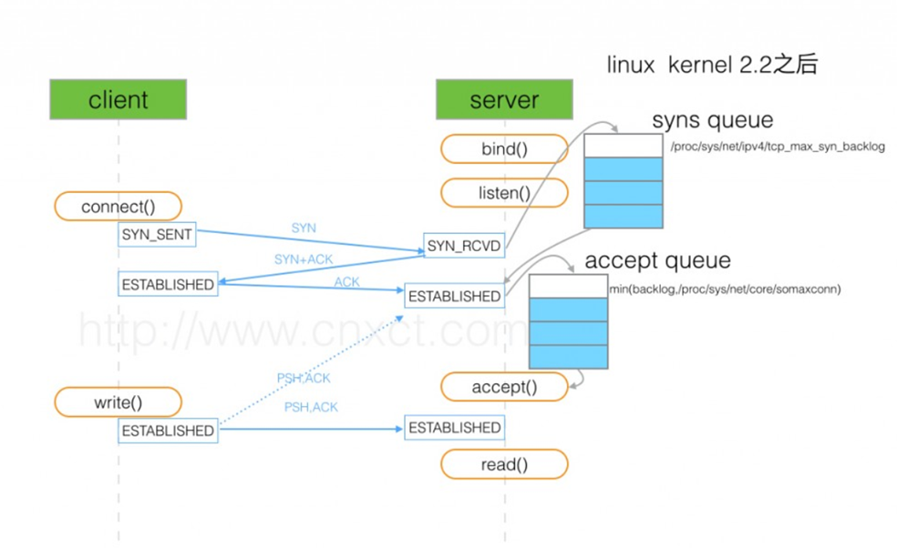
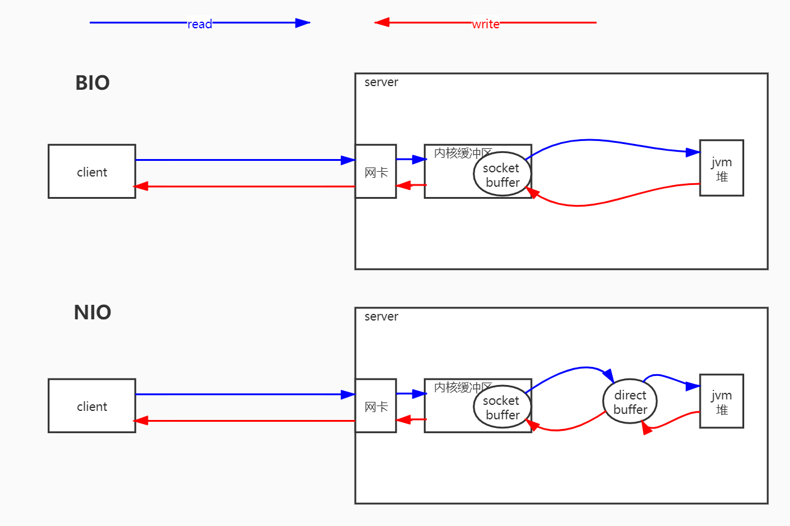
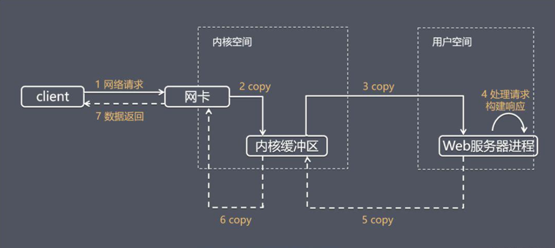
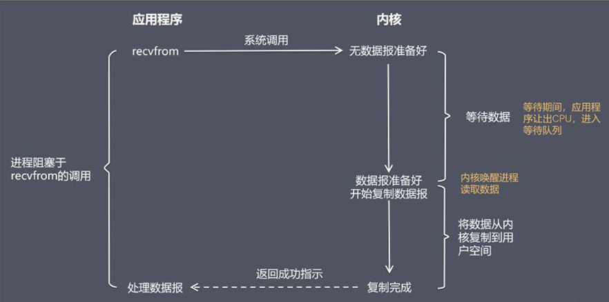
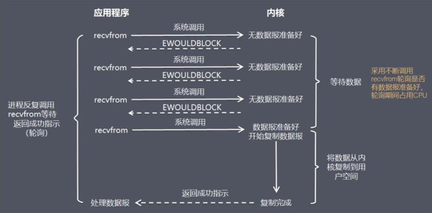
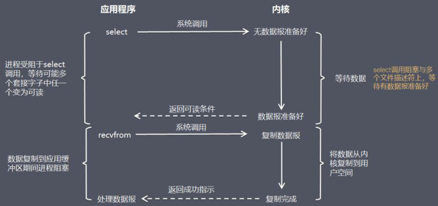
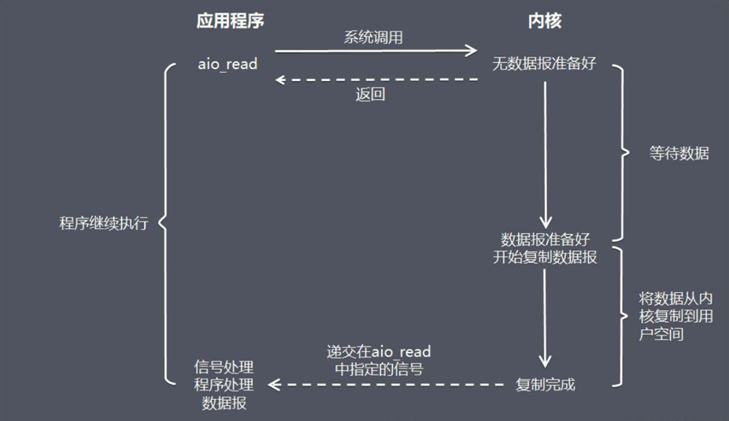

# 3 Tomcat线程模型HTTP请求处理与管道线模型

## 3.1 Connector

蓝色框包裹的是nio的线程模型

红色标识的组件是工作线程完成io和业务处理的过程，CoyoteAdapter这个是tomcat唯一的一个适配器负责把请求从Connector发送到Engine进行业务处理

**使用指定IO模型的配置方式:** 配置 server.xml 文件当中的    修改即可。 默认配置 8.0  protocol=“HTTP/1.1” 8.0 之前是 BIO，8.0 之后是NIO 

**BIO** protocol="org.apache.coyote.http11.Http11Protocol"

**NIO** protocol="org.apache.coyote.http11.Http11NioProtocol"

**AIO** protocol="org.apache.coyote.http11.Http11Nio2Protocol"

**APR** protocol="org.apache.coyote.http11.Http11AprProtocol"

## 3.2 Tomcat connector 并发参数解读

| 名称 | 描述 |
|:----|:----|
| acceptCount | 等待最大队列 |
| address | 绑定客户端特定地址，127.0.0.1 |
| bufferSize | 每个请求的缓冲区大小。bufferSize * maxThreads |
| compression | 是否启用文档压缩 |
| compressableMimeTypes | text/html,text/xml,text/plain |
| connectionTimeout | 客户发起链接 到 服务端接收为止，中间最大的等待时间 |
| connectionUploadTimeout | upload 情况下连接超时时间 |
| disableUploadTimeout | true 则使用connectionTimeout |
| enableLookups | 禁用DNS查询 true |
| keepAliveTimeout | 当长链接闲置 指定时间主动关闭 链接 ，前提是客户端请求头 带上这个 head"connection" " keep-alive" |
| maxKeepAliveRequests | 最大的 长连接数 |
| maxHttpHeaderSize |
| maxThreads（执行线程） | 最大执行线程数 |
| minSpareThreads(初始线业务线程 10) |最小线闲置线程数 |

## 3.3 容器

只有容器才有管道线，其他组件没有

Tomcat中有四个容器，分别是Engine,Host,context,Wrapper。级别是从大到小的。context表示一个Web应用程序，Wrapper表示一个Servlet。一个Web应用程序中可能会有多个Servlet。Host代表的是一个虚拟主机，就好比你的一个Tomcat下面可能有多个Web应用程序。同时Engine是Host的父类，Host是Context的父类,Context是Wrapper父类。每层的容器都有自己的管道线。

## 3.4 TCP三次握手

## 3.5 BIO & NIO

## 3.6 网络请求响应

## 3.7 阻塞式 I/O 模型(blocking I/O）

## 3.8 非阻塞式 I/O 模型(non-blocking I/O）

## 3.9 I/O模型3：I/O 复用模型(I/O multiplexing）

## 3.10 I/O模型5：异步 I/O 模型（即AIO，全称asynchronous I/O）

