# 2 Explain详解与索引最佳实践

## 2.1 Explain

使用EXPLAIN关键字可以模拟优化器执行SQL语句，分析你的查询语句或是结构的性能瓶颈 在 select 语句之前增加 explain 关键字，MySQL 会在查询上设置一个标记，执行查询会返回执行计划的信息，而不是 执行这条SQL 注意：如果 from 中包含子查询，仍会执行该子查询，将结果放入临时表中。

#### Explain分析示例

参考官方文档：https://dev.mysql.com/doc/refman/5.7/en/explain-output.html

```sql
示例表：
DROP TABLE IF EXISTS `actor`;
CREATE TABLE `actor` (
  `id` int(11) NOT NULL,
  `name` varchar(45) DEFAULT NULL,
  `update_time` datetime DEFAULT NULL,
  PRIMARY KEY (`id`)
) ENGINE=InnoDB DEFAULT CHARSET=utf8;

INSERT INTO `actor` (`id`, `name`, `update_time`) VALUES (1,'a','2017-12-22 15:27:18'), (2,'b','2017-12-22 15:27:18'), (3,'c','2017-12-22 15:27:18');

DROP TABLE IF EXISTS `film`;
CREATE TABLE `film` (
  `id` int(11) NOT NULL AUTO_INCREMENT,
  `name` varchar(10) DEFAULT NULL,
  PRIMARY KEY (`id`),
  KEY `idx_name` (`name`)
) ENGINE=InnoDB DEFAULT CHARSET=utf8;

INSERT INTO `film` (`id`, `name`) VALUES (3,'film0'),(1,'film1'),(2,'film2');

DROP TABLE IF EXISTS `film_actor`;
CREATE TABLE `film_actor` (
  `id` int(11) NOT NULL,
  `film_id` int(11) NOT NULL,
  `actor_id` int(11) NOT NULL,
  `remark` varchar(255) DEFAULT NULL,
  PRIMARY KEY (`id`),
  KEY `idx_film_actor_id` (`film_id`,`actor_id`)
) ENGINE=InnoDB DEFAULT CHARSET=utf8;

INSERT INTO `film_actor` (`id`, `film_id`, `actor_id`) VALUES (1,1,1),(2,1,2),(3,2,1);
```

```sql
explain select * from actor;
```

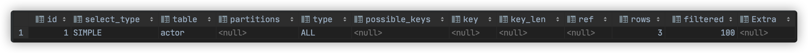

在查询中的每个表会输出一行，如果有两个表通过 join 连接查询，那么会输出两行。

### explain 两个变种 

- explain extended

会在 explain 的基础上额外提供一些查询优化的信息。紧随其后通过 `show warnings` 命令可 以得到优化后的查询语句，从而看出优化器优化了什么。额外还有 filtered 列，是一个半分比的值，`rows * filtered / 100` 可以估算出将要和 explain 中前一个表进行连接的行数（前一个表指 explain 中的id值比当前表id值小的 表）。

```sql
explain extended select * from film where id=1;
show warnings;
```

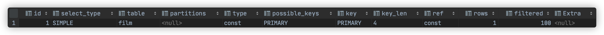

- explain partitions

相比 explain 多了个 partitions 字段，如果查询是基于分区表的话，会显示查询将访问的分区。

### explain中的列

接下来我们将展示 explain 中每个列的信息。 

#### 1. id列

 id列的编号是 select 的序列号，有几个 select 就有几个id，并且id的顺序是按 select 出现的顺序增长的。 id列越大执行优先级越高，id相同则从上往下执行，id为NULL最后执行。

#### 2. select_type列

select_type 表示对应行是简单还是复杂的查询。 

- simple：简单查询。查询不包含子查询和union

```sql
explain select * from film where id=2;
```

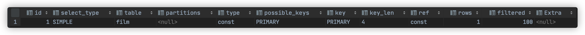

- primary：复杂查询中最外层的 select 

- subquery：包含在 select 中的子查询（不在 from 子句中） 

- derived：包含在 from 子句中的子查询。MySQL会将结果存放在一个临时表中，也称为派生表（derived的英文含 义） 

用这个例子来了解 primary、subquery 和 derived 类型

```sql
#关闭mysql5.7新特性对衍生表的合并优化
set session optimizer_switch='derived_merge=off';
explain select (select 1 from actor where id=1) from (select * from film where id=1) der
```

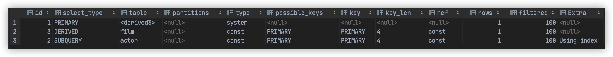

- union：在 union 中的第二个和随后的 select

```sql
explain select 1 union all select 1;
```

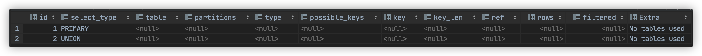

#### 3. table列

这一列表示 explain 的一行正在访问哪个表。 当 from 子句中有子查询时，table列是 <derivenN> 格式，表示当前查询依赖 id=N 的查询，于是先执行 id=N 的查 询。 当有 union 时，UNION RESULT 的 table 列的值为<union1,2>，1和2表示参与 union 的 select 行id。

 ##### 4. type列

这一列表示关联类型或访问类型，即MySQL决定如何查找表中的行，查找数据行记录的大概范围。 依次从最优到最差分别为：system > const > eq_ref > ref > range > index > ALL 一般来说，得保证查询达到range级别，最好达到ref 

##### NULL

mysql能够在优化阶段分解查询语句，在执行阶段用不着再访问表或索引。例如：在索引列中选取最小值，可 以单独查找索引来完成，不需要在执行时访问表

```sql
explain select min(id) from film;
```

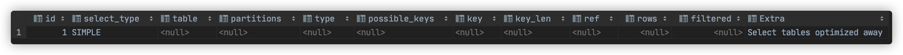

##### const, system

mysql能对查询的某部分进行优化并将其转化成一个常量（可以看show warnings 的结果）。用于 primary key 或 unique key 的所有列与常数比较时，所以表最多有一个匹配行，读取1次，速度比较快。system是 const的特例，表里只有一条元组匹配时为system

```sql
explain extended select * from (select * from film where id=1) tmp;
show warnings;
```

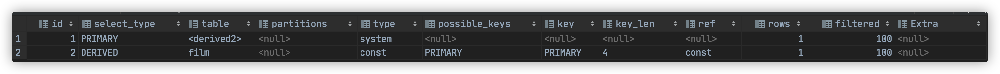

##### eq_ref

primary key 或 unique key 索引的所有部分被连接使用 ，最多只会返回一条符合条件的记录。这可能是在 const 之外最好的联接类型了，简单的 select 查询不会出现这种 type。

```sql
explain select * from film_actor left join film on film_actor.film_id= film.id;
```

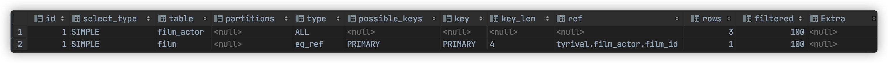

##### ref

相比 eq_ref，不使用唯一索引，而是使用普通索引或者唯一性索引的部分前缀，索引要和某个值相比较，可能会 找到多个符合条件的行。 

1. 简单 select 查询，name是普通索引（非唯一索引）

```sql
explain select * from film where name='film1';
```

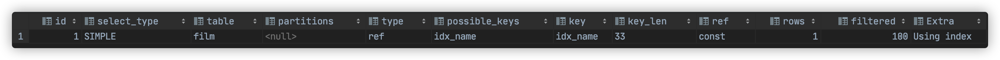

2. 关联表查询，idx_film_actor_id是film_id和actor_id的联合索引，这里使用到了film_actor的左边前缀film_id部分。

```sql
explain select film_id from film left join film_actor on film.id=film_actor.film_id;
```

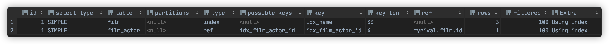

##### range

范围扫描通常出现在 in(), between ,> ,<, >= 等操作中。使用一个索引来检索给定范围的行。

```sql
explain select * from actor where id>1;
```

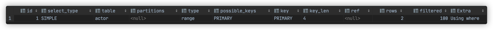

##### index

扫描全索引就能拿到结果，一般是扫描某个二级索引，这种扫描不会从索引树根节点开始快速查找，而是直接 对二级索引的叶子节点遍历和扫描，速度还是比较慢的，这种查询一般为使用覆盖索引，二级索引一般比较小，所以这 种通常比ALL快一些。

```sql
explain select * from film;
```

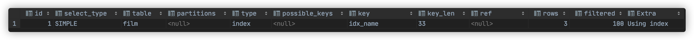

#####  ALL

即全表扫描，扫描你的聚簇索引的所有叶子节点。通常情况下这需要增加索引来进行优化了。 

```sql
explain select * from actor;
```

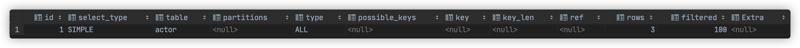

#### 5. possible_keys列

这一列显示查询可能使用哪些索引来查找。 explain 时可能出现 possible_keys 有列，而 key 显示 NULL 的情况，这种情况是因为表中数据不多，mysql认为索引 对此查询帮助不大，选择了全表查询。 如果该列是NULL，则没有相关的索引。在这种情况下，可以通过检查 where 子句看是否可以创造一个适当的索引来提 高查询性能，然后用 explain 查看效果。

#### 6. key列

这一列显示mysql实际采用哪个索引来优化对该表的访问。 如果没有使用索引，则该列是 NULL。如果想强制mysql使用或忽视possible_keys列中的索引，在查询中使用 force index、ignore index。

#### 7. key_len列

这一列显示了mysql在索引里使用的字节数，通过这个值可以算出具体使用了索引中的哪些列。 举例来说，film_actor的联合索引 idx_film_actor_id 由 film_id 和 actor_id 两个int列组成，并且每个int是4字节。通 过结果中的key_len=4可推断出查询使用了第一个列：film_id列来执行索引查找。

```sql
explain select * from film_actor where film_id=2;
```


key_len计算规则如下： 

- 字符串
  - char(n)：n字节长度 
  - varchar(n)：如果是utf-8，则长度 3n + 2 字节，加的2字节用来存储字符串长度

- 数值类型
  - tinyint：1字节 
  - smallint：2字节 
  - int：4字节 
  - bigint：8字节　　

- 时间类型　
  - date：3字节 
  - timestamp：4字节 
  - datetime：8字节

- 如果字段允许为 NULL，需要1字节记录是否为 NULL 

索引最大长度是768字节，当字符串过长时，mysql会做一个类似左前缀索引的处理，将前半部分的字符提取出来做索 引。

#### 8. ref列

这一列显示了在key列记录的索引中，表查找值所用到的列或常量，常见的有：const（常量），字段名（例：film.id）

#### 9. rows列

这一列是mysql估计要读取并检测的行数，注意这个不是结果集里的行数。

#### 10. Extra列

这一列展示的是额外信息。常见的重要值如下：

##### Using index：使用覆盖索引

覆盖索引定义：mysql执行计划explain结果里的key有使用索引，如果select后面查询的字段都可以从这个索引的树中 获取，这种情况一般可以说是用到了覆盖索引，extra里一般都有using index；覆盖索引一般针对的是辅助索引，整个 查询结果只通过辅助索引就能拿到结果，不需要通过辅助索引树找到主键，再通过主键去主键索引树里获取其它字段值

```sql
explain select film_id from film_actor where film_id=1;
```

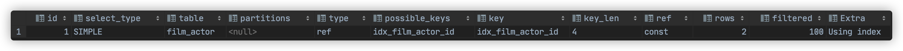

##### Using where

使用 where 语句来处理结果，并且查询的列未被索引覆盖

```sql
explain select * from actor where name='a';
```

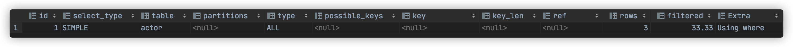

##### Using index condition

查询的列不完全被索引覆盖，where条件中是一个前导列的范围；

```sql
explain select * from film_actor where film_id>1;
```

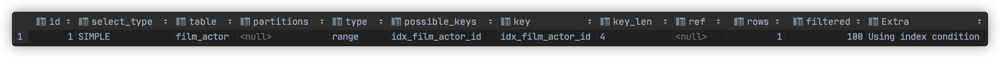

##### Using temporary

mysql需要创建一张临时表来处理查询。出现这种情况一般是要进行优化的，首先是想到用索 引来优化。 

- actor.name没有索引，此时创建了张临时表来distinct

```sql
explain select distinct name from actor;
```


- film.name建立了idx_name索引，此时查询时extra是using index,没有用临时表

```sql
explain select distinct name from film;
```


##### Select tables optimized away

使用某些聚合函数（比如 max、min）来访问存在索引的某个字段是

```sql
explain select min(id) from film;
```


## 2.2 Mysql索引实践

```sql
示例表：
CREATE TABLE `employees` (
  `id` int(11) NOT NULL AUTO_INCREMENT,
  `name` varchar(24) NOT NULL DEFAULT '' COMMENT '姓名',
  `age` int(11) NOT NULL DEFAULT '0' COMMENT '年龄',
  `position` varchar(20) NOT NULL DEFAULT '' COMMENT '职位',
  `hire_time` timestamp NOT NULL DEFAULT CURRENT_TIMESTAMP COMMENT '入职时间',
  PRIMARY KEY (`id`),
  KEY `idx_name_age_position` (`name`,`age`,`position`) USING BTREE
) ENGINE=InnoDB AUTO_INCREMENT=4 DEFAULT CHARSET=utf8 COMMENT='员工记录表';

INSERT INTO employees(name,age,position,hire_time) VALUES('LiLei',22,'manager',NOW());
INSERT INTO employees(name,age,position,hire_time) VALUES('HanMeimei', 23,'dev',NOW());
INSERT INTO employees(name,age,position,hire_time) VALUES('Lucy',23,'dev',NOW());
```

#### 1. 全值匹配

```sql
EXPLAIN SELECT * FROM employees WHERE name='LiLei';
```


```sql
EXPLAIN SELECT * FROM employees WHERE name='LiLei' AND age=22;
```

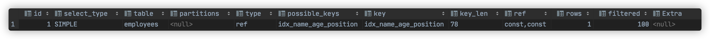

```sql
EXPLAIN SELECT * FROM employees WHERE name='LiLei' AND age=22 AND position='manager';
```

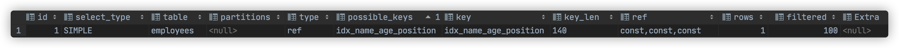

#### 2. 最左前缀法则

如果索引了多列，要遵守最左前缀法则。指的是查询从索引的最左前列开始并且不跳过索引中的列。

```sql
EXPLAIN SELECT * FROM employees WHERE name='Bill' and age=31;
EXPLAIN SELECT * FROM employees WHERE age=30 AND position='dev';
EXPLAIN SELECT * FROM employees WHERE position='manager';
```

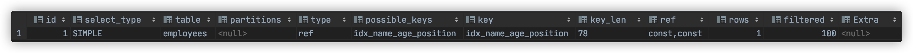

#### 3. 不在索引列上做任何操作（计算、函数、（自动or手动）类型转换），会导致索引失效而转向全表扫描

```sql
EXPLAIN SELECT * FROM employees WHERE name='LiLei';
EXPLAIN SELECT * FROM employees WHERE left(name,3)='LiLei';
```


给hire_time增加一个普通索引：

```sql
ALTER TABLE `employees` ADD INDEX `idx_hire_time` (`hire_time`) USING BTREE ;
EXPLAIN select * from employees where date(hire_time)='2018‐09‐30';
```

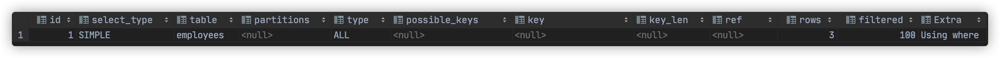

转化为日期范围查询，有可能会走索引：

```sql
EXPLAIN select * from employees where hire_time >= '2018-09-30 00:00:00' and hire_time<='2030-09-30 23:59:59';
```

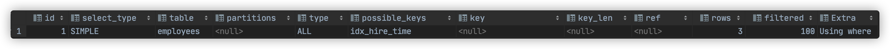

还原最初索引状态

```sql
ALTER TABLE `employees` DROP INDEX `idx_hire_time`;
```

#### 4. 存储引擎不能使用索引中范围条件右边的列

```sql
EXPLAIN SELECT * FROM employees WHERE name='LiLei' AND age=22 AND position='manager';
EXPLAIN SELECT * FROM employees WHERE name='LiLei' AND age>22 AND position='manager';
```

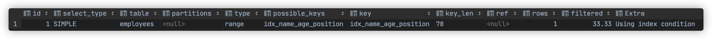

#### 5. 尽量使用覆盖索引（只访问索引的查询（索引列包含查询列）），减少 select * 语句

```sql
EXPLAIN SELECT name,age FROM employees WHERE name='LiLei' AND age=23 AND position='manager';
```

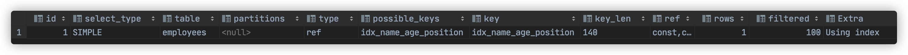

```sql
EXPLAIN SELECT * FROM employees WHERE name='LiLei' AND age=23 AND position='manager';
```

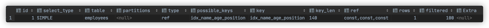

#### 6. mysql在使用不等于（！=或者<>）的时候无法使用索引会导致全表扫描

```sql
EXPLAIN SELECT * FROM employees WHERE name!='LiLei';
```


#### 7. is null,is not null 一般情况下也无法使用索引

```sql
EXPLAIN SELECT * FROM employees WHERE name is null
```


#### 8. like以通配符开头（'%abc...'）mysql索引失效会变成全表扫描操作

```sql
EXPLAIN SELECT * FROM employees WHERE name like '%Lei'
```

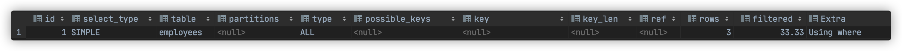

```sql
-- 以下查询可以使用索引
EXPLAIN SELECT * FROM employees WHERE name like 'Lei%'
```

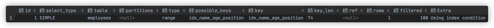

问题：解决like'%字符串%'索引不被使用的方法？

a）使用覆盖索引，查询字段必须是建立覆盖索引字段

```sql
EXPLAIN SELECT name,age,position FROM employees WHERE name like '%Lei%';
```


b）如果不能使用覆盖索引则可能需要借助搜索引擎

#### 9. 字符串不加单引号索引失效

```sql
EXPLAIN SELECT * FROM employees WHERE name='1000';
EXPLAIN SELECT * FROM employees WHERE name=1000;
```

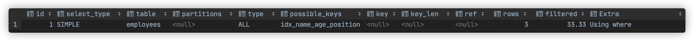

#### 10. 少用or或in，用它查询时，mysql不一定使用索引，mysql内部优化器会根据检索比例、表大小等多个因素整体评 估是否使用索引，详见范围查询优化

```sql
EXPLAIN SELECT * FROM employees WHERE name='LiLei' or name='HanMeimei';
```


#### 11. 范围查询优化

给年龄添加单值索引

```sql
ALTER TABLE `employees` ADD INDEX `idx_age` (`age`) USING BTREE ;
explain select * from employees where age>=1 and age<=2000;
```


没走索引原因：mysql内部优化器会根据检索比例、表大小等多个因素整体评估是否使用索引。比如这个例子，可能是 由于单次数据量查询过大导致优化器最终选择不走索引 

优化方法：可以将大的范围拆分成多个小范围

```sql
explain select * from employees where age>=1 and age<=1000;
explain select * from employees where age>=1001 and age <=2000;
```

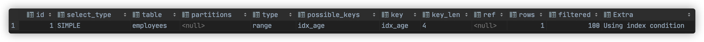

还原最初索引状态

```sql
ALTER TABLE `employees` DROP INDEX `idx_age`;
```

## 索引使用总结

假设 index(a,b,c)

| Where语句                                               | 索引是否被使用                       |
| ------------------------------------------------------- | ------------------------------------ |
| where a = 3                                             | Y，使用到a                           |
| where a = 3 and b = 5                                   | Y，使用a,b                           |
| where a = 3 and b = 5 and c = 4                         | Y，使用a,b,c                         |
| where b = 3 或者 where b = 3 and c = 4 或者 where c = 4 | N                                    |
| where a = 3 and c = 5                                   | 使用到a，但是c不可以，b中间断了      |
| where a = 3 and b > 4 and c = 5                         | 使用到a和b，c不能用在范围之后，b断了 |
| where a = 3 and b like 'kk%' and c = 4                  | Y，使用到a,b,c                       |
| where a = 3 and b like '%kk' and c = 4                  | Y，只用到a                           |
| where a = 3 and b like '%kk%' and c = 4                 | Y，只用到a                           |
| where a = 3 and b like 'k%kk%' and c = 4                | Y，使用到a,b,c                       |

like KK%相当于=常量，%KK和%KK% 相当于范围