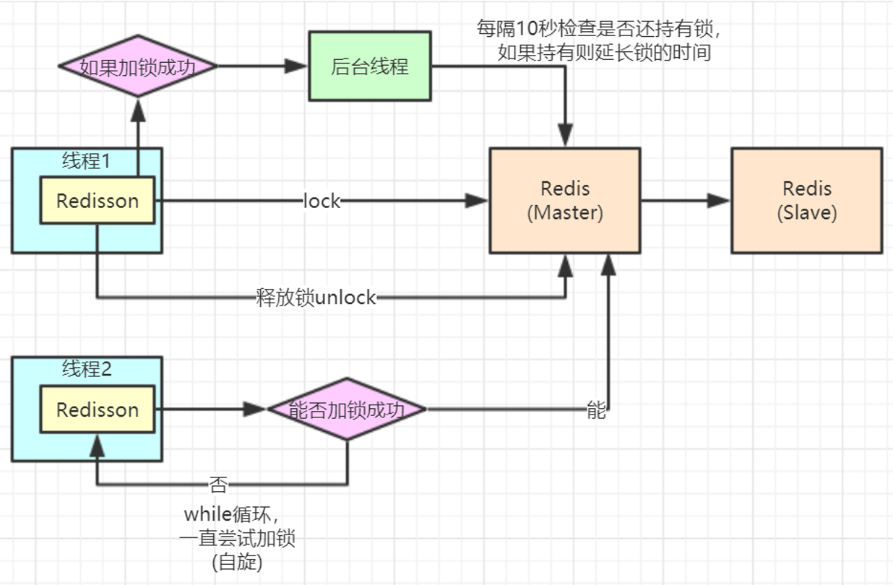

# Redis高并发分布式锁实战

## 1. 分布式锁的实现

分布式锁经常被用于互联网商品抢购、接口幂等性校验等场景。下面以商品秒杀活动中，扣减库存的接口实现为例，详细讲解分布式锁的实现方式。

###### 示例1

这种情况下，容易出现超卖，因为多线程情况下，可能有多个线程同时取到同一个值，然后看起来库存-1，实际生成了多个订单。

```java
@RequestMapping("/deduct_stock_1")
public String deductStock1() {
    int stock = Integer.parseInt(stringRedisTemplate.opsForValue().get("stock"));
    if (stock > 0) {
    		int realStock = stock - 1;
    		stringRedisTemplate.opsForValue().set("stock", realStock + "");
    		logger.info("扣减成功，剩余库存：" + realStock);
    } else {
    		logger.info("扣减失败，库存不足。");
    }
    return "end";
}
```

###### 示例2

通过synchronized来为IndexController加锁，当代码执行到synchronized时，执行串行操作，每次只执行一个线程的操作，一个线程执行完成后，才执行下一个线程。

```java
@RequestMapping("/deduct_stock_2")
public String deductStock2() {
    synchronized (this) {
        int stock = Integer.parseInt(stringRedisTemplate.opsForValue().get("stock"));
        if (stock > 0) {
        int realStock = stock - 1;
        stringRedisTemplate.opsForValue().set("stock", realStock + "");
        logger.info("扣减成功，剩余库存：" + realStock);
    } else {
    		logger.info("扣减失败，库存不足。");
    }
    return "end";
    }
}
```

> **问题**
>
> 这种写法只适合单机架构，在分布式架构的情况下，无法跨服务器对整个集群的该接口加锁。

###### 示例3

通过redis的setnx进行加锁，利用redis的单线程机制，实现分布式架构中的锁。
- 为避免程序在中间环节抛异常，在finally中执行解锁操作；

- 为避免程序在中间环节挂掉，导致锁无法释放，给这把锁设置一个超时时间；

```java
@RequestMapping("/deduct_stock_3")
public String deductStock3() {
    String lockKey = "product_001";
    try {
        Boolean result = stringRedisTemplate.opsForValue().setIfAbsent(lockKey, "tyrival", 10, TimeUnit.SECONDS);
        if (!result) {
        		return "error";
        }
        int stock = Integer.parseInt(stringRedisTemplate.opsForValue().get("stock"));
        if (stock > 0) {
            int realStock = stock - 1;
            stringRedisTemplate.opsForValue().set("stock", realStock + "");
            logger.info("扣减成功，剩余库存：" + realStock);
        } else {
        		logger.info("扣减失败，库存不足。");
        }
    } finally {
    		stringRedisTemplate.delete(lockKey);
    }
    return "end";
}
```

> **问题**
>
> 高并发场景下，可能出现锁失效的问题。
>
> 例如，线程A执行时间超过了超时时间的10s，当到达第10s时，redis使锁失效，此时有另一个线程B抢到这把锁，而此时线程A还未执行完，假设再过了5s，线程A完成后，执行finally代码块，会对线程B的锁进行删除操作。同理线程B可能删除线程C的锁，于是在高并发场景下，这把锁就一直处于失效的状态下，并没有起到应有的作用。

###### 示例4

增加了唯一的clientId，避免出现锁被其他线程删除的问题。

```java
@RequestMapping("/deduct_stock_4")
public String deductStock4() {
    String lockKey = "product_001";
    String clientId = UUID.randomUUID().toString();
    try {
        Boolean result = stringRedisTemplate.opsForValue()
        				.setIfAbsent(lockKey, clientId, 30, TimeUnit.SECONDS);
        if (!result) {
            return "error";
        }
        int stock = Integer.parseInt(stringRedisTemplate.opsForValue().get("stock"));
        if (stock > 0) {
            int realStock = stock - 1;
            stringRedisTemplate.opsForValue().set("stock", realStock + "");
            logger.info("扣减成功，剩余库存：" + realStock);
        } else {
            logger.info("扣减失败，库存不足。");
        }
        } finally {
            if (clientId.equals(stringRedisTemplate.opsForValue().get(lockKey))) {
            stringRedisTemplate.delete(lockKey);
        }
    }
    return "end";
}
```

> **问题**
>
> 解决了锁被其他线程删除的问题，但仍旧没有解决当前线程执行时间超长，导致锁失效的问题。


## 2. Redisson

Redisson针对redis在分布式场景下的操作，进行了大量的实现，通过引入redisson，可以很方便的实现分布式锁。

- 引入redisson，在pom.xml增加依赖

```xml
<dependency>
    <groupId>org.redisson</groupId>
    <artifactId>redisson</artifactId>
    <version>3.6.5</version>
</dependency>
```

- 声明bean

```java
@Bean
public Redisson redisson() {
		// 单机模式
		Config config = new Config();
		config.useSingleServer().setAddress("redis://localhost:6379")
														.setDatabase(0)
      											.setPassword("123");
//        config.useClusterServers()
//                .addNodeAddress("redis://10.211.55.9:8001")
//                .addNodeAddress("redis://10.211.55.10:8002")
//                .addNodeAddress("redis://10.211.55.11:8003")
//                .addNodeAddress("redis://10.211.55.9:8004")
//                .addNodeAddress("redis://10.211.55.10:8005")
//                .addNodeAddress("redis://10.211.55.11:8006")
//                .setPassword("tyrival");
		return (Redisson) Redisson.create(config);
}
```

- redisson实现分布式锁，以及锁的续命功能

```java
@Autowired
private Redisson redisson;

@RequestMapping("/deduct_stock")
public String deductStock() throws InterruptedException {
    String lockKey = "product_001";
    RLock redissonLock = redisson.getLock(lockKey);
    try {
        // 加锁，并实现锁续命功能，默认30s超时时间，并且10s续命一次
        redissonLock.lock();
        int stock = Integer.parseInt(stringRedisTemplate.opsForValue().get("stock"));
        if (stock > 0) {
            int realStock = stock - 1;
            stringRedisTemplate.opsForValue().set("stock", realStock + "");
            System.out.println("扣减成功，剩余库存:" + realStock + "");
        } else {
            System.out.println("扣减失败，库存不足");
        }
    } finally {
    		redissonLock.unlock();
    }
    return "end";
}
```

##### Redisson架构流程



> **问题**
>
> 使用Redis集群加锁时，如果线程1刚刚加完锁，Redis Master节点还没来得及将锁同步到Slave节点，Master就挂了，然后Slave节点被选举为新的Master，此时线程1还未执行完，但是锁失效了，线程2发现新的Master没有锁，就可以顺利加锁，然后执行业务代码，这个问题怎么解决？
>
> Redis集群的锁是**AP锁**，一定程度上牺牲了一致性，而追求可用性；如果需要追求一致性，可以使用Zookeeper锁，Zookeeper锁是**CP锁**，通过牺牲一定可用性换取一致性。

#### Redlock

Redlock一定程度上能解决一致性的问题，是**CP锁**，与Zookeeper原理类似，当加锁时，需要向集群所有的节点发送请求，当得到半数以上的节点确认后，才能加锁成功。所以，Redlock与Zookeeper一样是牺牲了可用性的。

示例代码如下：

```java
@RequestMapping("/redlock")
public String redlock() throws InterruptedException {
  
    String lockKey = "product_001";
  
    // 这里需要自己实例化不同redis实例的redisson客户端连接，这里只是伪代码用一个redisson客户端简化了
    RLock lock1 = redisson.getLock(lockKey);
    RLock lock2 = redisson.getLock(lockKey);
    RLock lock3 = redisson.getLock(lockKey);

    // 根据多个 RLock 对象构建 RedissonRedLock （最核心的差别就在这里）
    RedissonRedLock redLock = new RedissonRedLock(lock1, lock2, lock3);
    try {
        /**
         * 尝试获取锁
         * waitTimeout 尝试获取锁的最大等待时间，超过这个值，则认为获取锁失败
         * leaseTime   锁的持有时间,超过这个时间锁会自动失效（值应设置为大于业务处理的时间，确保在锁有效期内业务能处理完）
         */
        boolean res = redLock.tryLock(10, 30, TimeUnit.SECONDS);
        if (res) {
            // 成功获得锁，在这里处理业务
        }
    } catch (Exception e) {
        throw new RuntimeException("lock fail");
    } finally {
        // 最后解锁
        redLock.unlock();
    }
    return "end";
}
```

> **注意**
>
> Redlock非常不建议使用。


## 3. 高并发分布式锁的实现

高并发场景下，例如出现抢购同一个商品的情况，因为同一个商品的锁根据redis集群的slots分配原则，一定是保存在单个master节点上，此时所有并发压力都在这个节点，而集群的其他master节点无法起作用。

#### 分段锁

可以将这种商品的库存分成多个段，分别存储到redis集群的各节点。

例如：有1000个商品，分成10段，分别使用 {商品ID}_1 ... {商品ID}\_10，然后通过一定的hash手段，使锁分布到redis集群的各节点上。

参考concurrent hashmap的实现。

