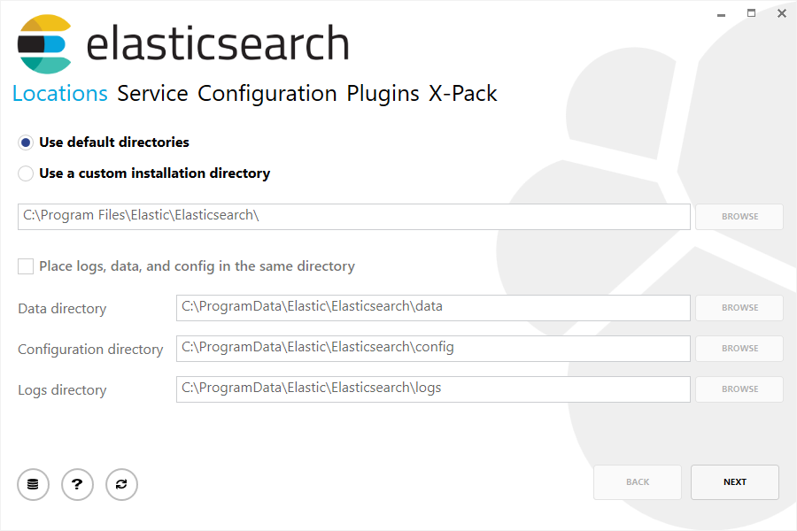
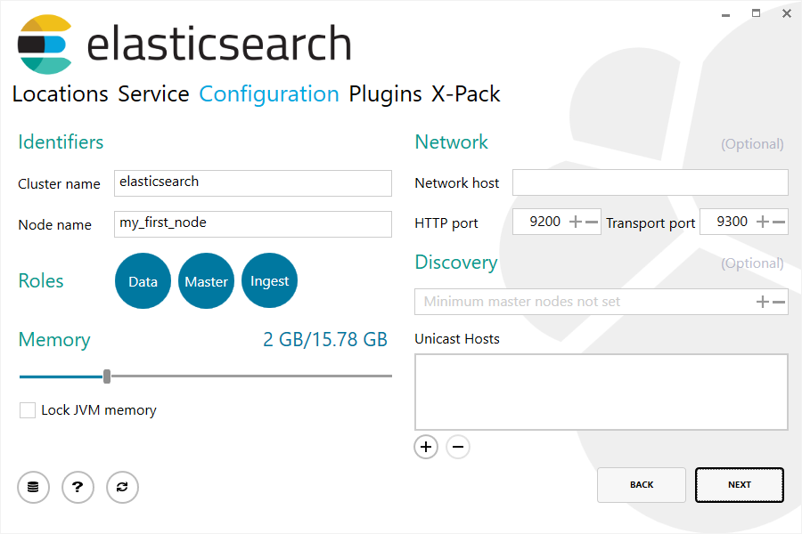

## 安装

> **提醒**
>
> 您可以在Elastic Cloud上使用我们托管的Elasticsearch Service跳过安装，[Elastic Cloud](https://www.elastic.co/cloud) 可在AWS和GCP上使用。您可以 [免费试用托管服务](https://www.elastic.co/cloud/elasticsearch-service/signup)。

Elasticsearch至少需要Java 8。建议您使用Oracle JDK版本1.8.0_131。 Java安装因平台而异，因此我们不会在此处详细介绍。可以在 [Oracle网站](https://docs.oracle.com/javase/8/docs/technotes/guides/install/install_overview.html) 上找到Oracle推荐的安装文档。可以说，在安装Elasticsearch之前，请先使用如下命令检查Java版本，然后根据需要进行相应的安装/升级：

```sh
java -version
echo $JAVA_HOME
```

当我们安装了Java，我们就可以下载并运行Elasticsearch。可以从 www.elastic.co/downloads 获得所有发行版本的二进制文件。对于每个版本，您都可以选择`zip`或`tar`，`DEB`或`RPM`包或Windows `MSI`安装包。

### tar安装示例

为简单起见，我们使用 [tar](../02-Set-up-Elasticsearch/Installing-Elasticsearch/Install-Elasticsearch-with-.zip-or-.tar.gz.md) 文件。

我们按如下方式下载Elasticsearch 6.7.1 tar：

```sh
curl -L -O https://artifacts.elastic.co/downloads/elasticsearch/elasticsearch-6.7.1.tar.gz
```

然后提取：

```sh
tar -xvf elasticsearch-6.7.1.tar.gz
```

然后它会在当前目录中创建一堆文件和文件夹。然后我们进入bin目录，如下所示：

```sh
cd elasticsearch-6.7.1/bin
```

现在我们准备启动我们的节点和单个集群：

```sh
./elasticsearch
```

### Homebrew安装

在macOS上，Elasticsearch也可以通过 [Homebrew](https://brew.sh) 安装：

```sh
brew install elasticsearch
```

如果安装成功，Homebrew将提示你可以通过输入`elasticsearch`来启动Elasticsearch。现在就这样做。[成功运行节点](#成功运行节点) 的响应在后文进行了阐述。

### Windows MSI安装示例

对于Windows用户，我们建议使用 [Windows MSI安装](../02-Set-up-Elasticsearch/Installing-Elasticsearch/Install-Elasticsearch-with-Windows-MSI-Installer.md)。该软件包有图形用户界面（GUI），可指导您完成安装过程。

首先，[下载Elasticsearch 6.7.1 MSI](https://artifacts.elastic.co/downloads/elasticsearch/elasticsearch-6.7.1.msi)。

然后双击下载的文件以启动GUI界面。在第一个屏幕中，选择安装目录：



然后选择是作为服务安装，还是根据需要手动启动Elasticsearch。 为了与tar示例对应，请选择不安装为服务：


对于配置，只需使用默认值：



然后，与tar示例一致，请取消选中所有插件以不安装任何插件：


单击安装按钮后，将安装Elasticsearch：


默认情况下，Elasticsearch将安装在 `%PROGRAMFILES%\Elastic\Elasticsearch` 中。 在此处导航并进入bin目录，如下所示：

**使用命令提示符：**

```sh
cd %PROGRAMFILES%\Elastic\Elasticsearch\bin
```

**使用PowerShell：**

```powershell
cd $env:PROGRAMFILES\Elastic\Elasticsearch\bin
```

现在我们准备启动我们的节点和单个集群：

```sh
.\elasticsearch.exe
```

### 成功运行节点

如果一切顺利安装，你应该看到一堆如下所示的消息：

```sh
[2016-09-16T14:17:51,251][INFO ][o.e.n.Node               ] [] initializing ...
[2016-09-16T14:17:51,329][INFO ][o.e.e.NodeEnvironment    ] [6-bjhwl] using [1] data paths, mounts [[/ (/dev/sda1)]], net usable_space [317.7gb], net total_space [453.6gb], spins? [no], types [ext4]
[2016-09-16T14:17:51,330][INFO ][o.e.e.NodeEnvironment    ] [6-bjhwl] heap size [1.9gb], compressed ordinary object pointers [true]
[2016-09-16T14:17:51,333][INFO ][o.e.n.Node               ] [6-bjhwl] node name [6-bjhwl] derived from node ID; set [node.name] to override
[2016-09-16T14:17:51,334][INFO ][o.e.n.Node               ] [6-bjhwl] version[6.7.1], pid[21261], build[f5daa16/2016-09-16T09:12:24.346Z], OS[Linux/4.4.0-36-generic/amd64], JVM[Oracle Corporation/Java HotSpot(TM) 64-Bit Server VM/1.8.0_60/25.60-b23]
[2016-09-16T14:17:51,967][INFO ][o.e.p.PluginsService     ] [6-bjhwl] loaded module [aggs-matrix-stats]
[2016-09-16T14:17:51,967][INFO ][o.e.p.PluginsService     ] [6-bjhwl] loaded module [ingest-common]
[2016-09-16T14:17:51,967][INFO ][o.e.p.PluginsService     ] [6-bjhwl] loaded module [lang-expression]
[2016-09-16T14:17:51,967][INFO ][o.e.p.PluginsService     ] [6-bjhwl] loaded module [lang-mustache]
[2016-09-16T14:17:51,967][INFO ][o.e.p.PluginsService     ] [6-bjhwl] loaded module [lang-painless]
[2016-09-16T14:17:51,967][INFO ][o.e.p.PluginsService     ] [6-bjhwl] loaded module [percolator]
[2016-09-16T14:17:51,968][INFO ][o.e.p.PluginsService     ] [6-bjhwl] loaded module [reindex]
[2016-09-16T14:17:51,968][INFO ][o.e.p.PluginsService     ] [6-bjhwl] loaded module [transport-netty3]
[2016-09-16T14:17:51,968][INFO ][o.e.p.PluginsService     ] [6-bjhwl] loaded module [transport-netty4]
[2016-09-16T14:17:51,968][INFO ][o.e.p.PluginsService     ] [6-bjhwl] loaded plugin [mapper-murmur3]
[2016-09-16T14:17:53,521][INFO ][o.e.n.Node               ] [6-bjhwl] initialized
[2016-09-16T14:17:53,521][INFO ][o.e.n.Node               ] [6-bjhwl] starting ...
[2016-09-16T14:17:53,671][INFO ][o.e.t.TransportService   ] [6-bjhwl] publish_address {192.168.8.112:9300}, bound_addresses {{192.168.8.112:9300}
[2016-09-16T14:17:53,676][WARN ][o.e.b.BootstrapCheck     ] [6-bjhwl] max virtual memory areas vm.max_map_count [65530] likely too low, increase to at least [262144]
[2016-09-16T14:17:56,731][INFO ][o.e.h.HttpServer         ] [6-bjhwl] publish_address {192.168.8.112:9200}, bound_addresses {[::1]:9200}, {192.168.8.112:9200}
[2016-09-16T14:17:56,732][INFO ][o.e.g.GatewayService     ] [6-bjhwl] recovered [0] indices into cluster_state
[2016-09-16T14:17:56,748][INFO ][o.e.n.Node               ] [6-bjhwl] started
```

在不详细讨论的情况下，我们可以看到名为“6-bjhwl”的节点（在您的情况下将是一组不同的字符）已经启动，并在单节点集群中选择自己作为主节点。 现在不要纠结主节点是什么意思，最重要的是我们在一个集群中启动了一个节点。

如前文所述，我们可以覆盖集群或节点名称。 这可以在启动Elasticsearch时从命令行完成，如下所示：

```sh
./elasticsearch -Ecluster.name=my_cluster_name -Enode.name=my_node_name
```

注意标有http的行，其中包含有关我们的节点地址（`192.168.8.112`）和端口（`9200`）的信息。 默认情况下，Elasticsearch使用端口`9200`来提供对其REST API。 如有必要，可以配置此端口。