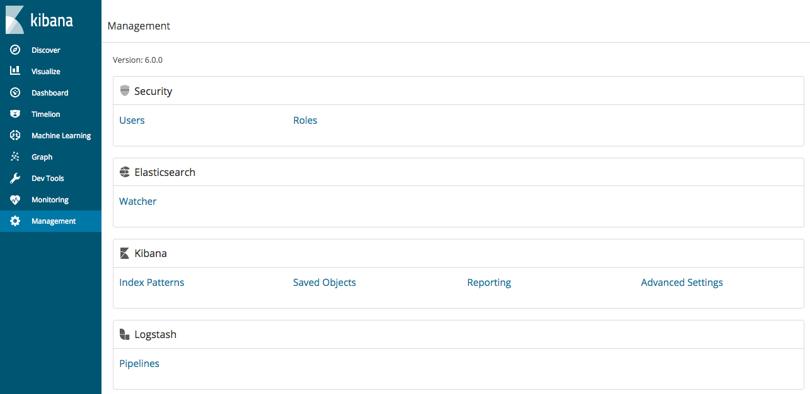

## 集中管道管理

管道管理功能集中了Kibana中Logstash管道配置的创建和管理。

> **注意：**
> 集中管道管理是X-Pack功能，不包含在基本许可证中。如果您想尝试所有功能，可以开始为期30天的试用。在试用期结束时，您可以购买订阅以继续使用X-Pack组件的全部功能。有关更多信息，请参阅 https://www.elastic.co/subscriptions 和 [许可证管理](https://www.elastic.co/guide/en/elastic-stack-overview/6.7/license-management.html)。

您可以从Kibana中的管道管理界面控制多个Logstash实例。您可以增加、编辑和删除管道配置。在Logstash端，您只需启用配置管理并注册Logstash，即可使用集中管理的管道配置。

> **重要：**
> 配置Logstash为启用集中管道管理后，您将无法再配置本地的管道。启用集中管道管理后，`pipelines.yml` 和诸如 `path.config` 和 `config.string` 之类的设置处于非活动状态。

### 管道管理
在使用管道管理UI之前，您必须：

- [配置集中管理管道](../06-Configuring-Logstash/Configuring-Centralized-Pipeline-Management.md)。
- 如果Kibana受到基本身份验证保护，请确保您的Kibana用户具有 `logstash_admin` 角色以及您在配置Logstash的 [配置基础验证](../06-Configuring-Logstash/X-Pack-security.md#配置基础验证) 创建的 `logstash_writer`角色。此外，为了在管道管理UI中查看（只读）非集中管理的管道，请确保您的Kibana用户也具有 `monitoring_user` 角色。

要管理Kibana中的Logstash管道：

1. 在浏览器中打开Kibana，然后转到 "Management" 选项卡。如果您正确地完成了配置，您将在页面上看到管理Logstash的区域。

2. 单击 "**Pipelines**" 链接。

3. 要添加新管道，请单击 "**Create pipeline**"。

| 属性                    | 说明                                                         |
| ----------------------- | ------------------------------------------------------------ |
| Pipeline ID             | 管道的唯一ID标识。这就是您在 [配置集中管理管道](../06-Configuring-Logstash/Configuring-Centralized-Pipeline-Management.md) 时，在 `xpack.management.pipeline.id` 中指定管道ID列表。 |
| Description             | 管道配置的描述，仅是个说明性字段。                           |
| Pipeline                | 管道配置。您可以像管理其他任何编辑器一样，操作管道管理UI中的编辑器，并且不必担心空格或缩进。 |
| Pipeline workers        | 用于运行管道的过滤器和输出阶段的并发工作者数。               |
| Pipeline batch size     | 单个工作线程在执行过滤器和输出之前，接收的最大事件数。       |
| Pipeline batch delay    | 在将小型批处理发送给管道工作者之前等待每个事件的时间（以毫秒为单位）。 |
| Queue type              | 事件缓冲的内部排队模型。**memory** 是内存队列，**persisted** 是基于硬盘的持久化队列。 |
| Queue max bytes         | 队列的总容量。                                               |
| Queue checkpoint writes | 启用持久队列时，强制检查点之前写入的最大事件数。             |

#### 管道行为

- 管道配置和元数据存储在Elasticsearch中。您对管道定义所做的任何更改，都会被使用该管道的所有Logstash实例自动获取，并立刻加载生效。所以如果Logstash注册使用了该管道，不必重新启动Logstash来获取更改。
- 管道在所有注册到该管道的Logstash实例上运行。 Kibana保存新配置，Logstash将尝试加载它。在UI层面不会对此进行校验。
- 您需要检查本地Logstash日志中的配置错误。如果您正在使用X-Pack中的Logstash监视功能，请使用 "Monitoring" 页面检查Logstash节点的状态。
- 您可以指定在同一Logstash节点上并发运行的多个管道配置。
- 如果编辑并保存管道配置，Logstash将在后台重新加载配置，并继续处理事件。
- 如果您尝试在Kibana中删除正在运行的管道（例如，apache），Logstash将尝试停止管道，当然，Logstash会等待直到管道完全处理完所有事件。在删除管道之前，请确保您了解数据源，因为停止管道可能会导致数据丢失。
