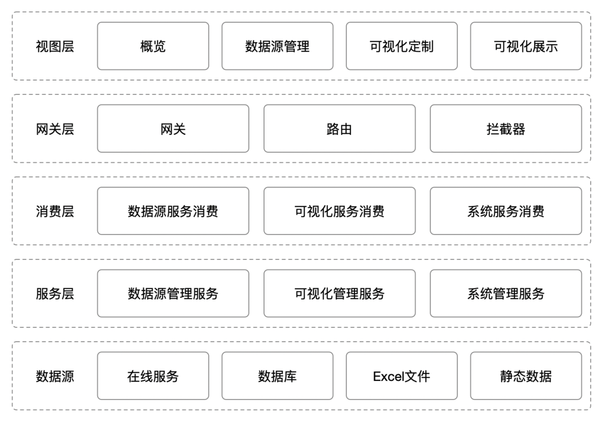

# 第2章 软件架构

平台的基本架构如图所示，整体分为数据源、服务层、消费层、网关层、视图层。

**数据源**：负责存储平台运行所需的元数据，以及可视化所需的业务数据，数据源类型包含在线http、https服务，oracle、mysql、postgresql、sqlserver等常见数据库类型，xls、xlsx、csv等excel文件类型，以及json格式的静态数据。

**服务层**：以微服务的形式对外提供各平台功能模块，支持分布式集群部署，可根据并发压力部署多个相同服务，从而实现高可用，避免单个服务的阻塞导致平台的崩溃。

**消费层**：负责将请求分发给服务层，根据服务层的微服务数量进行平均分发，以达到负载均衡的效果，并对超时请求实行熔断，避免请求的阻塞。

**网关层**：负责统一接收外部请求，对请求进行权限验证、跨域授权后，通过路由将请求转发给消费层的消费者，同样会对超时请求进行熔断，从而避免阻塞。

**视图层**：前端视图，通过GUI界面，使平台与用户进行对话。