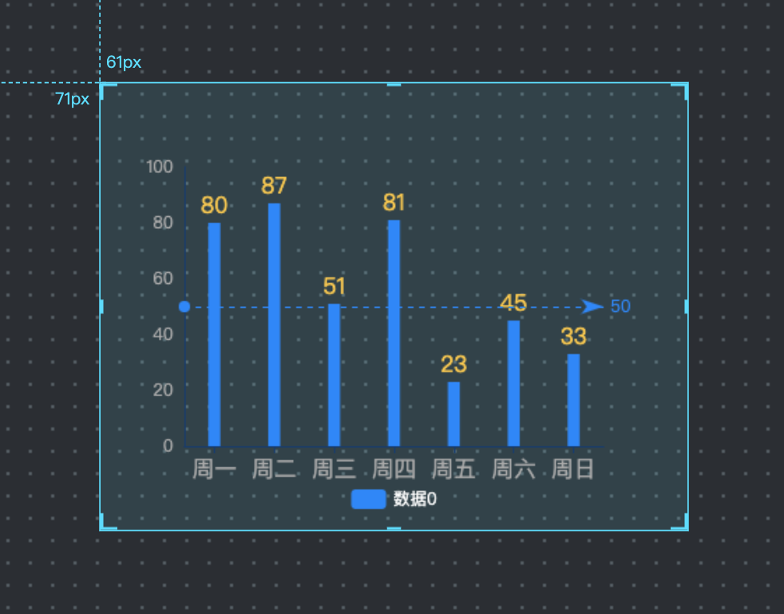
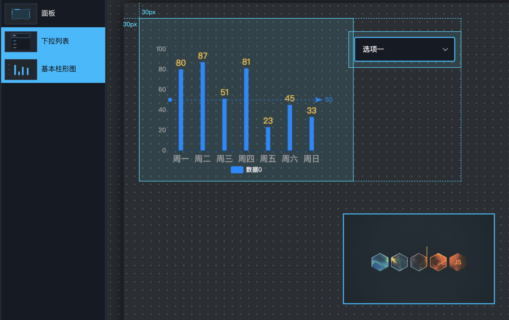
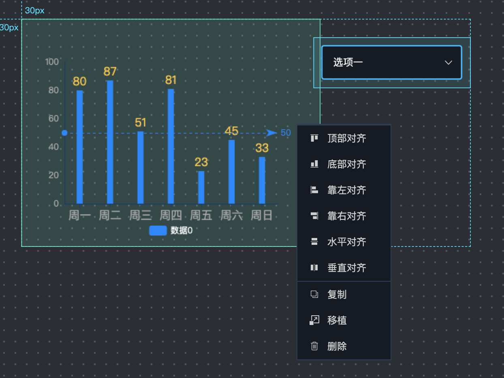
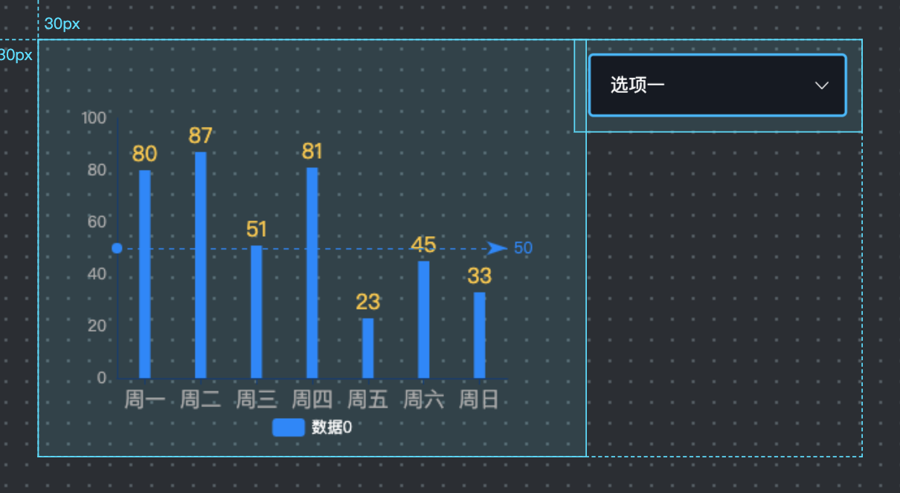

### 画布区

画布区上对所有组件进行可视化，实现所见即所得的效果。

画布上的组件选中后，可进行拖拽和缩放。组件左上角有标尺线可作拖拽时的坐标参考，组件的4条边的中央位置和4个角有加粗线条，通过点击这些区域并拖拽，可以调整组件的大小。

#### 右键菜单

选中组件后，右键点击该组件，可以弹出菜单对组件进行操作。

###### 层级操作

可以对组件进行置顶、上移一层、下移一层、置底操作，从而修改组件在图层区的排序。

###### 移植

移植功能可将组件的配置文件复制到系统剪贴板，然后在另一个可视化配置界面进行[导入](./Section-Menu.md#导入)，从而实现组件的跨页面复制粘贴。

#### 多选组件

画布上的组件进行多选，按住的ctrl键（Mac上为Command）后，鼠标点击多个组件，或直接在画布上用鼠标框选，即可多选组件。

多选组件后，可以对组件进行批量拖动，或者在右键菜单中进行对齐、复制、移植、删除等操作

###### 对齐

当选择了多个组件后，右键菜单中会出现6种对齐功能，对齐的基准线取决于弹出右键菜单的组件。例如：图中选择了柱形图和下拉列表后，右键点击柱形图弹出了右键菜单，那么所有的对齐功能都以柱形图为准，即柱形图不动，其他组件根据柱形图的坐标进行对齐。

当选择"顶部对齐后"，出现如下效果：
    

