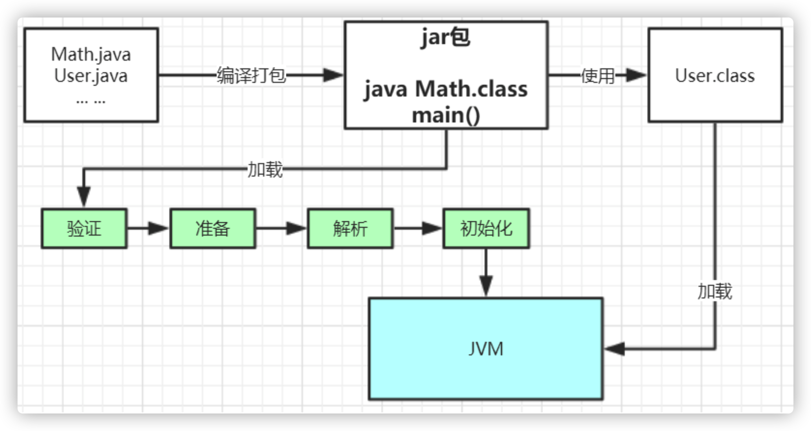

## 1.1 类加载机制

### 1.1.1 类加载器

#### 类加载过程

示例代码：

```java
package com.tyrival.jvm.lession01;

public class Math {

    public static final int initData = 666;
    public static User user = new User();

    public int compute() {
        int a = 1;
        int b = 2;
        int c = (a + b) * 10;
        return c;
    }

    public static void main(String[] args) {
        Math math = new Math();
        math.compute();
    }
}
```


通过Java命令执行代码的大体流程如下：


其中 `classLoader.loadClass()` 主要包含如下步骤：

**加载 >> 验证 >> 准备 >> 解析 >> 初始化 >> 使用 >> 卸载**

- **加载**：在硬盘上查找并通过IO读入字节码文件，使用到类时才会加载，例如调用类的 `main()` 方法，new对象等等，在加载阶段，会在内存中生成一个代表这个类的 `java.lang.Class` 对象，作为方法区这个类的各种数据的访问入口

- **验证**：校验字节码文件的正确性

- **准备**：给类的静态变量分配内存，并赋予默认值

- **解析**：将符号引用替换为直接引用，该阶段会把一些静态方法（符号引用，比如 `main()` 方法）替换为指向数据所存内存的指针或句柄等（直接引用），这是所谓的静态链接过过程（类加载期间完成），动态链接是在程序运行期间完成的将符号引用替换为直接引用

- **初始化**：对类的静态变量初始化为指定的值，执行静态代码块 `static {}`



类被加载到方法区中后，主要包含**运行时常量池、类型信息、字段信息、方法信息、类加载器的引用、对应class实例的引用**等信息。 

**类加载器的引用**：这个类到类加载器实例的引用 

**对应class实例的引用**：类加载器在加载类信息放到方法区中后，会创建一个对应的Class 类型的对象实例放到堆(Heap)中，作为开发人员访问方法区中类定义的入口和切入点。

*注意：主类在运行过程中如果使用到其它类，会逐步加载这些类，类似图中的 `User.class`。jar包或war包里的类不是一次性全部加载的，是使用到时才加载。*

示例中，通过运行结果可以看到，首先加载了类 `TestDynamicLoad` ，执行了静态代码块，然后加载类 `A` ，依次执行静态代码块和构造方法。类 `B` 由于未实例化，并未加载。

```java
package com.tyrival.jvm.lession01;

public class TestDynamicLoad {
    static {
        System.out.println("*************load TestDynamicLoad************");
    }

    public static void main(String[] args) {
        new A();
        System.out.println("*************load test************");
      	//B不会加载，除非这里执行 new B()
        B b = null;
    }
}

class A {
    static {
        System.out.println("*************load A************");
    }

    public A() {
        System.out.println("*************initial A************");
    }
}

class B {
    static {
        System.out.println("*************load B************");
    }

    public B() {
        System.out.println("*************initial B************");
    }
}

运行结果为：
*************load TestDynamicLoad************
*************load A************
*************initial A************
*************load test************
```


#### 类加载器

上述类加载过程主要通过类加载器来实现，Java中有以下几种类加载器：

- **引导类加载器**：负责加载支撑JVM运行的位于JRE的lib目录下的核心类库，比如 rt.jar、charsets.jar等 
- **扩展类加载器**：负责加载支撑JVM运行的位于JRE的lib目录下的ext扩展目录中的JAR类包 
- **应用程序类加载器**：负责加载ClassPath路径下的类包，主要就是加载开发人员写的类 
- **自定义加载器**：负责加载用户自定义路径下的类包


##### 示例代码

```java
package com.tyrival.jvm.lession01;

import sun.misc.Launcher;

import java.net.URL;

public class TestJDKClassLoader {

  public static void main(String[] args) {

    // String类为Java的核心类，使用的是引导类加载器，
    // 由于采用C++生成的对象，所以它的类加载器在Java中显示为null
    System.out.println(String.class.getClassLoader());
    
    // com.sun.crypto.provider.DESKeyFactory位于$JRE$/lib/ext中，
    // 所以使用ExtClassLoader进行加载
    System.out.println(com.sun.crypto.provider.DESKeyFactory.class
                          .getClassLoader().getClass().getName());
    
    // 用户自己写的类，使用AppClassLoader进行加载
    System.out.println(TestJDKClassLoader.class.getClassLoader().getClass().getName());

    System.out.println();

    ClassLoader appClassLoader = ClassLoader.getSystemClassLoader();
    ClassLoader extClassloader = appClassLoader.getParent();
    ClassLoader bootstrapLoader = extClassloader.getParent();
    System.out.println("the bootstrapLoader : " + bootstrapLoader);
    System.out.println("the extClassloader : " + extClassloader);
    System.out.println("the appClassLoader : " + appClassLoader);

    System.out.println();

    System.out.println("bootstrapLoader加载以下文件：");
    URL[] urls = Launcher.getBootstrapClassPath().getURLs();
    for (int i = 0; i < urls.length; i++) {
    	System.out.println(urls[i]);
    }

    System.out.println();

    System.out.println("extClassloader加载以下文件：");
    System.out.println(System.getProperty("java.ext.dirs"));

    System.out.println();

    System.out.println("appClassLoader加载以下文件：");
    System.out.println(System.getProperty("java.class.path"));
	}
}

运行结果：
null
sun.misc.Launcher$ExtClassLoader
sun.misc.Launcher$AppClassLoader

the bootstrapLoader : null
the extClassloader : sun.misc.Launcher$ExtClassLoader@d716361
the appClassLoader : sun.misc.Launcher$AppClassLoader@18b4aac2

bootstrapLoader加载以下文件：
file:/Library/Java/JavaVirtualMachines/jdk1.8.0_231.jdk/Contents/Home/jre/lib/resources.jar
file:/Library/Java/JavaVirtualMachines/jdk1.8.0_231.jdk/Contents/Home/jre/lib/rt.jar
file:/Library/Java/JavaVirtualMachines/jdk1.8.0_231.jdk/Contents/Home/jre/lib/sunrsasign.jar
file:/Library/Java/JavaVirtualMachines/jdk1.8.0_231.jdk/Contents/Home/jre/lib/jsse.jar
file:/Library/Java/JavaVirtualMachines/jdk1.8.0_231.jdk/Contents/Home/jre/lib/jce.jar
file:/Library/Java/JavaVirtualMachines/jdk1.8.0_231.jdk/Contents/Home/jre/lib/charsets.jar
file:/Library/Java/JavaVirtualMachines/jdk1.8.0_231.jdk/Contents/Home/jre/lib/jfr.jar
file:/Library/Java/JavaVirtualMachines/jdk1.8.0_231.jdk/Contents/Home/jre/classes

extClassloader加载以下文件：
/Users/tyrival/Library/Java/Extensions:/Library/Java/JavaVirtualMachines/jdk1.8.0_231.jdk/Contents/Home/jre/lib/ext:/Library/Java/Extensions:/Network/Library/Java/Extensions:/System/Library/Java/Extensions:/usr/lib/java

appClassLoader加载以下文件：
/Library/Java/JavaVirtualMachines/jdk1.8.0_231.jdk/Contents/Home/jre/lib/charsets.jar:/Library/Java/JavaVirtualMachines/jdk1.8.0_231.jdk/Contents/Home/jre/lib/deploy.jar:/Library/Java/JavaVirtualMachines/jdk1.8.0_231.jdk/Contents/Home/jre/lib/ext/cldrdata.jar:/Library/Java/JavaVirtualMachines/jdk1.8.0_231.jdk/Contents/Home/jre/lib/ext/dnsns.jar:/Library/Java/JavaVirtualMachines/jdk1.8.0_231.jdk/Contents/Home/jre/lib/ext/jaccess.jar:/Library/Java/JavaVirtualMachines/jdk1.8.0_231.jdk/Contents/Home/jre/lib/ext/jfxrt.jar:/Library/Java/JavaVirtualMachines/jdk1.8.0_231.jdk/Contents/Home/jre/lib/ext/localedata.jar:/Library/Java/JavaVirtualMachines/jdk1.8.0_231.jdk/Contents/Home/jre/lib/ext/nashorn.jar:/Library/Java/JavaVirtualMachines/jdk1.8.0_231.jdk/Contents/Home/jre/lib/ext/sunec.jar:/Library/Java/JavaVirtualMachines/jdk1.8.0_231.jdk/Contents/Home/jre/lib/ext/sunjce_provider.jar:/Library/Java/JavaVirtualMachines/jdk1.8.0_231.jdk/Contents/Home/jre/lib/ext/sunpkcs11.jar:/Library/Java/JavaVirtualMachines/jdk1.8.0_231.jdk/Contents/Home/jre/lib/ext/zipfs.jar:/Library/Java/JavaVirtualMachines/jdk1.8.0_231.jdk/Contents/Home/jre/lib/javaws.jar:/Library/Java/JavaVirtualMachines/jdk1.8.0_231.jdk/Contents/Home/jre/lib/jce.jar:/Library/Java/JavaVirtualMachines/jdk1.8.0_231.jdk/Contents/Home/jre/lib/jfr.jar:/Library/Java/JavaVirtualMachines/jdk1.8.0_231.jdk/Contents/Home/jre/lib/jfxswt.jar:/Library/Java/JavaVirtualMachines/jdk1.8.0_231.jdk/Contents/Home/jre/lib/jsse.jar:/Library/Java/JavaVirtualMachines/jdk1.8.0_231.jdk/Contents/Home/jre/lib/management-agent.jar:/Library/Java/JavaVirtualMachines/jdk1.8.0_231.jdk/Contents/Home/jre/lib/plugin.jar:/Library/Java/JavaVirtualMachines/jdk1.8.0_231.jdk/Contents/Home/jre/lib/resources.jar:/Library/Java/JavaVirtualMachines/jdk1.8.0_231.jdk/Contents/Home/jre/lib/rt.jar:/Library/Java/JavaVirtualMachines/jdk1.8.0_231.jdk/Contents/Home/lib/ant-javafx.jar:/Library/Java/JavaVirtualMachines/jdk1.8.0_231.jdk/Contents/Home/lib/dt.jar:/Library/Java/JavaVirtualMachines/jdk1.8.0_231.jdk/Contents/Home/lib/javafx-mx.jar:/Library/Java/JavaVirtualMachines/jdk1.8.0_231.jdk/Contents/Home/lib/jconsole.jar:/Library/Java/JavaVirtualMachines/jdk1.8.0_231.jdk/Contents/Home/lib/packager.jar:/Library/Java/JavaVirtualMachines/jdk1.8.0_231.jdk/Contents/Home/lib/sa-jdi.jar:/Library/Java/JavaVirtualMachines/jdk1.8.0_231.jdk/Contents/Home/lib/tools.jar:/Users/tyrival/Workspace/architect-knowledge/01-jvm/target/classes:/Applications/IntelliJ IDEA.app/Contents/lib/idea_rt.jar

```


##### 初始化过程

类加载过程图中可以看到，首先创建JVM启动器实例 `sun.misc.Launcher` ，这个类采用了单例模式，保证一个JVM虚拟机内只有一个Launcher实例。

在Launcher构造方法内部，创建了两个类加载器，分别是扩展类加载器 `sun.misc.Launcher.ExtClassLoader` 和应用类加载器 `sun.misc.Launcher.AppClassLoader`

JVM默认使用 `Launcher.getClassLoader()` 返回的类加载器AppClassLoader的实例加载我们的应用程序。

```java
// $JRE$/lib/rt.jar!/sun/misc/Launcher.class
package sun.misc;

public Launcher() {
  Launcher.ExtClassLoader var1;
  try {
    // 构造扩展类加载器，执行 ①
  	var1 = Launcher.ExtClassLoader.getExtClassLoader();
  } catch (IOException var10) {
  	throw new InternalError("Could not create extension class loader", var10);
  }

  try {
    // 构造应用类加载器，执行 ④
  	this.loader = Launcher.AppClassLoader.getAppClassLoader(var1);
  } catch (IOException var9) {
  	throw new InternalError("Could not create application class loader", var9);
  }

  Thread.currentThread().setContextClassLoader(this.loader);
  String var2 = System.getProperty("java.security.manager");
  
  /* ExtClassLoader，实例化时，设置父加载器为null */
  static class ExtClassLoader extends URLClassLoader {
    // ①
		public static Launcher.ExtClassLoader getExtClassLoader() throws IOException {
      if (instance == null) {
        Class var0 = Launcher.ExtClassLoader.class;
        synchronized(Launcher.ExtClassLoader.class) {
          if (instance == null) {
            // 执行 ②
            instance = createExtClassLoader();
          }
        }
      }
      return instance;
    }
    
    // ②
    private static Launcher.ExtClassLoader createExtClassLoader() throws IOException {
      try {
        return (Launcher.ExtClassLoader)AccessController.doPrivileged(new PrivilegedExceptionAction<Launcher.ExtClassLoader>() {
          public Launcher.ExtClassLoader run() throws IOException {
            File[] var1 = Launcher.ExtClassLoader.getExtDirs();
            int var2 = var1.length;

            for(int var3 = 0; var3 < var2; ++var3) {
                MetaIndex.registerDirectory(var1[var3]);
            }

            // 执行 ③
            return new Launcher.ExtClassLoader(var1);
          }
        });
      } catch (PrivilegedActionException var1) {
          throw (IOException)var1.getException();
      }
    }
    
    // ③
    public ExtClassLoader(File[] var1) throws IOException {
      // 调用父类构造方法
      // 父类为URLClassLoader，作用是根据路径加载类
      // 第二个参数为null，即将其父加载器设置为null
      super(getExtURLs(var1), (ClassLoader)null, Launcher.factory);
      SharedSecrets.getJavaNetAccess().getURLClassPath(this).initLookupCache(this);
    }
  }
  
  /* AppClassLoader，实例化时，将ExtClassLoader实例设置为父加载器 */
  static class AppClassLoader extends URLClassLoader {
		// ④
    public static ClassLoader getAppClassLoader(final ClassLoader var0) throws IOException {
      final String var1 = System.getProperty("java.class.path");
      final File[] var2 = var1 == null ? new File[0] : Launcher.getClassPath(var1);
      return (ClassLoader)AccessController.doPrivileged(new PrivilegedAction<Launcher.AppClassLoader>() {
        public Launcher.AppClassLoader run() {
          URL[] var1x = var1 == null ? new URL[0] : Launcher.pathToURLs(var2);
          // 执行 ⑤
          return new Launcher.AppClassLoader(var1x, var0);
        }
      });
    }
    
    // ⑤
    AppClassLoader(URL[] var1, ClassLoader var2) {
      // 调用父类构造方法
      // 父类为URLClassLoader，作用是根据路径加载类
      // 第二个参数为ExtClassLoader，即将其父加载器设置为扩展类加载器
      super(var1, var2, Launcher.factory);
      this.ucp.initLookupCache(this);
    }
  }
}
```


### 1.1.2 双亲委派机制


类加载使用的是**双亲委派机制**。加载某个类时，会先委托父加载器寻找目标类，找不到时，委托上层父加载器加载，如果所有父加载器在自己的加载类路径下都找不到目标类，则在自己的 类加载路径中查找并载入目标类。

比如我们的 `Math` 类，基本流程如下：

1. 先找应用程序类加载器加载；
2. 应用程序类加载器会先委托扩展类加载器加载；
3. 扩展类加载器再委托引导类加载器，
4. 顶层引导类加载器在自己的类加载路径里没找到 `Math` 类,向下退回  `Math` 类的加载请求给扩展类加载器；
5. 扩展类加载器在自己的类加载路径里没找到 `Math` 类，向下退回 `Math` 类的加载请求给应用类加载器；
6. 应用类加载器在自己的类加载路径里找 `Math` 类，找到了就自己进行加载。

双亲委派机制说简单点就是，先找父亲加载，不行再由儿子自己加载。

应用类加载器 `AppClassLoader` 加载类的双亲委派机制源码，`AppClassLoader` 的 `loadClass()` 方法最终会调用其父类 `ClassLoader` 的 `loadClass()` 方法，该方法的大体逻辑如下：

1. 首先检查指定名称的类是否已经加载过，如果加载过了，就不需要再加载，直接返回；
2. 如果此类没有加载过，再判断一下是否有父加载器；如果有父加载器，则由父加载器加载（即调用 `parent.loadClass(name, false)` ，或者是调用 `bootstrap` 类加载器来加载；
3. 如果父加载器及 `bootstrap` 类加载器都没有找到指定的类，那么调用当前类加载器的 `findClass()` 方法来完成类加载。

以下为双亲委派机制的代码示例：

```java
package java.lang;

public abstract class ClassLoader {
  
  // ①
  protected Class<?> loadClass(String name, boolean resolve) throws ClassNotFoundException {
    
    synchronized (getClassLoadingLock(name)) {
      // 在当前加载器中检查是否已加载该类
      Class<?> c = findLoadedClass(name);
      if (c == null) {
        long t0 = System.nanoTime();
        try {
          if (parent != null) {
            // 当前加载器的父加载器不为空，则委托父加载器加载该类
            // 父加载器也是ClassLoader，跳转到父类执行 ①
            c = parent.loadClass(name, false);
          } else {
            // 父加载器为空，则委托引导类加载器加载该类
            c = findBootstrapClassOrNull(name);
          }
        } catch (ClassNotFoundException e) {
          // ClassNotFoundException thrown if class not found
          // from the non-null parent class loader
        }

        if (c == null) {
          // If still not found, then invoke findClass in order
          // to find the class.
          long t1 = System.nanoTime();
          
          // 在当前加载器的类路径里查找并加载该类，执行 ②，
          // 在此处findClass是protected类型，实际执行的是URLClassLoader.findClass()
          c = findClass(name);

          // this is the defining class loader; record the stats
          sun.misc.PerfCounter.getParentDelegationTime().addTime(t1 - t0);
          sun.misc.PerfCounter.getFindClassTime().addElapsedTimeFrom(t1);
          sun.misc.PerfCounter.getFindClasses().increment();
        }
      }
      if (resolve) {
        resolveClass(c);
      }
      return c;
    }
    
    // ②
    protected Class<?> findClass(String name) throws ClassNotFoundException {
      throw new ClassNotFoundException(name);
    }
  }
}
```


##### 双亲委派机制的作用

- 沙箱安全机制：自己写的 `java.lang.String.class` 类不会被加载，这样便可以防止核心API库被随意篡改；
- 避免类的重复加载：当父亲已经加载了该类时，就没有必要子加载器再加载一次，保证被加载类的唯一性。


##### 全盘负责委托机制

**全盘负责**是指当一个ClassLoader装载一个类时，除非显示的使用另外一个ClassLoader，该类所依赖及引用的类也由这个ClassLoader载入，而不会实例化另一个ClassLoader。例如本章节第一个示例中的 `Math` 类中引用了 `User` 类，`User` 类和 `Math` 类使用同一个AppClassLoader。当然，加载 `User` 类时，也需要由AppClassLoader通过双亲委派机制，按照先向上委托，再向下逐级查找后进行加载。


### 1.1.3 自定义类加载器

自定义类加载器只需要继承 `java.lang.ClassLoader` 类。该类有两个核心方法，一个是 `loadClass(String, boolean)`，实现了双亲委派机制，另一个方法是 `findClass`，默认实现是空方法，所以我们自定义类加载器主要是重写 `findClass` 方法。

```java
package com.tyrival.jvm.lession01;

import java.io.FileInputStream;
import java.lang.reflect.Method;

public class MyClassLoaderTest {
    
  static class MyClassLoader extends ClassLoader {
    private String classPath;

    public MyClassLoader(String classPath) {
      this.classPath = classPath;
    }

    private byte[] loadByte(String name) throws Exception {
      name = name.replaceAll("\\.", "/");
      FileInputStream fis = new FileInputStream(classPath + "/" + name + ".class");
      int len = fis.available();
      byte[] data = new byte[len];
      fis.read(data);
      fis.close();
      return data;
    }

    protected Class<?> findClass(String name) throws ClassNotFoundException {
      try {
        byte[] data = loadByte(name);
        //defineClass将一个字节数组转为Class对象，这个字节数组是class文件读取后最终的字节 数组。
        return defineClass(name, data, 0, data.length);
      } catch (Exception e) {
        e.printStackTrace();
        throw new ClassNotFoundException();
      }
    }
  }

  public static void main(String args[]) throws Exception {

    // 初始化自定义类加载器，会先初始化父类ClassLoader，
    // 自定义类加载器的父加载器设置为应用程序类加载器AppClassLoader
    MyClassLoader classLoader = new MyClassLoader("/Users/tyrival/");

    // 将User类的字节码文件User.class放入/Users/tyrival/
    // 用自定义类加载器加载User类
    Class clazz = classLoader.loadClass("com.tyrival.jvm.lession01.User");
    
    // 实例化User类
    Object obj = clazz.newInstance();
    
    // 获取User.sout()方法
    Method method = clazz.getDeclaredMethod("sout", null);
    
    // 执行方法
    method.invoke(obj, null);
    
    // 打印加载User类的加载器名，此处打印出的是AppClassLoader，而不是MyClassLoader，
    // 因为在工程中存在一个User类，所以当向上委托到AppClassLoader时，
    // AppClassLoader在其classpath下可以找到User类，此时加载的User类实际上为工程中的User类，
    // 而不是/Users/tyrival/User.class
    System.out.println(clazz.getClassLoader().getClass().getName());
    
    // 当我们把User类复制一份为User1，将User1编译为User1.class，然后放到/Users/tyrival/下
    // 并将工程中的User1类删除，然后执行如下代码，打印出的加载器为MyClassLoader
    MyClassLoader classLoader = new MyClassLoader("/Users/tyrival/");
    Class clazz = classLoader.loadClass("com.tyrival.jvm.lession01.User1");
    Object obj = clazz.newInstance();
    Method method = clazz.getDeclaredMethod("sout", null);
    method.invoke(obj, null);
    System.out.println(clazz.getClassLoader().getClass().getName());
  }
}

运行结果：
=======自己的加载器加载类调用方法=======
sun.misc.Launcher$AppClassLoader

=======自己的加载器加载类调用方法=======
com.tyrival.jvm.lession01.MyClassLoader$MyClassLoader
```


