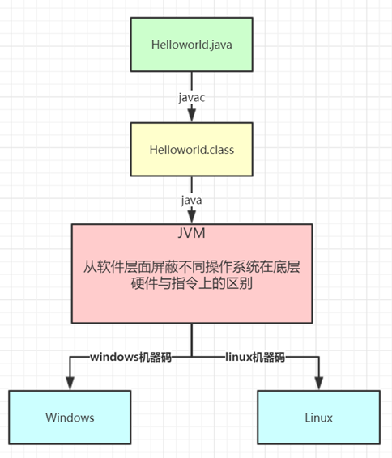
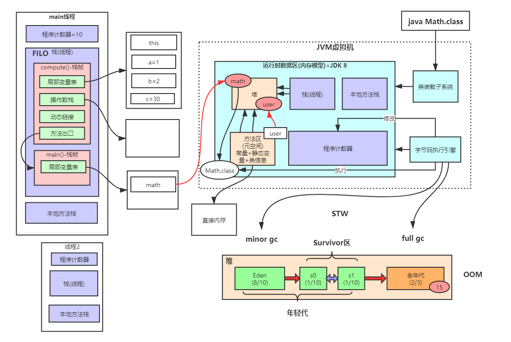

## 1.2 JVM整体结构

### 1.2.1 JDK体系结构


### 1.2.2 Java语言的跨平台特性




### 1.2.3 JVM整体结构及内存模型



#### 类装载子系统

将类装载到内存中。

#### 字节码执行引擎

负责对内存中的代码调度执行。

#### 内存模型

##### 堆

堆是所有线程公用的。

##### 方法区

方法区是所有线程公用的，运行时常量池就在方法区。使用的是物理内存，默认初始值为21M。在早期版本的JVM中，被称为持久代PermGen。

##### 栈（线程）

线程隔离。每个线程创建时，都会分配一块内存空间作为线程栈。在每个方法执行时，都会在栈内分配一块区域作为**栈帧**，栈帧的顺序按照先进后出（FILO）的顺序进行创建和销毁。每个栈帧包含以下内容：

> 通过 `javap -c ABC.class` 可以将字节码反编译为指令码，从而更好的理解栈帧的内容。
>
> 参考 [附1 JVM指令手册](./JVM-Command.md)

###### 局部变量表

用于存储这个方法调用时生成的局部变量。

###### 操作数栈

当指令中需要用到某些局部变量的值时，储存这些值，例如：`int a = b + c;` 时，会将b和c的值压入操作数栈，然后在计算开始时取出，计算完成后再次压入操作数栈。

##### 程序计数器

线程隔离。因为线程运行时，在CPU上可能需要排队，程序计数器就是用来记录当前线程执行到哪一步，从而保证代码的正确执行。


### 1.2.4 JVM内存参数设置


Spring Boot程序的JVM参数设置格式(Tomcat启动直接加在bin目录下catalina.sh文件里)：

```bash
java -Xms2048M -Xmx2048M -Xmn1024M -Xss512K -XX:MetaspaceSize=256M -XX:MaxMetaspaceSize=256M -jar eureka-server.jar
```

-Xss：每个线程的栈大小

-Xms：初始堆大小，默认物理内存的1/64

-Xmx：最大堆大小，默认物理内存的1/4

-Xmn：新生代大小

-XX:NewSize：设置新生代初始大小

-XX:NewRatio：默认2表示新生代占年老代的1/2，占整个堆内存的1/3。

-XX:SurvivorRatio：默认8表示一个survivor区占用1/8的Eden内存，即1/10的新生代内存。

关于元空间的JVM参数有两个：-XX:MetaspaceSize=N和 -XX:MaxMetaspaceSize=N

**-XX：MaxMetaspaceSize**：设置元空间最大值， 默认是-1， 即不限制， 或者说只受限于本地内存大小。

**-XX：MetaspaceSize**：指定元空间触发Fullgc的初始阈值(元空间无固定初始大小)， 以字节为单位，默认是21M，达到该值就会触发full gc进行类型卸载， 同时收集器会对该值进行调整： 如果释放了大量的空间， 就适当降低该值； 如果释放了很少的空间， 那么在不超过-XX：MaxMetaspaceSize（如果设置了的话） 的情况下， 适当提高该值。这个跟早期jdk版本的**-XX:PermSize**参数意思不一样，-**XX:PermSize**代表永久代的初始容量。

由于调整元空间的大小需要Full GC，这是非常昂贵的操作，如果应用在启动的时候发生大量Full GC，通常都是由于永久代或元空间发生了大小调整，基于这种情况，一般建议在JVM参数中将MetaspaceSize和MaxMetaspaceSize设置成一样的值，并设置得比初始值要大，对于8G物理内存的机器来说，一般我会将这两个值都设置为256M。

**StackOverflowError**示例：

```java
// JVM设置  -Xss128k(默认1M)
public class StackOverflowTest {
    
    static int count = 0;
    
    static void redo() {
        count++;
        redo();
    }

    public static void main(String[] args) {
        try {
            redo();
        } catch (Throwable t) {
            t.printStackTrace();
            System.out.println(count);
        }
    }
}

运行结果：
java.lang.StackOverflowError
	at com.tuling.jvm.StackOverflowTest.redo(StackOverflowTest.java:12)
	at com.tuling.jvm.StackOverflowTest.redo(StackOverflowTest.java:13)
	at com.tuling.jvm.StackOverflowTest.redo(StackOverflowTest.java:13)
   ......
```

> **结论**
>
> -Xss设置越小，count值越小，说明一个线程栈里能分配的栈帧就越少，但是对JVM整体来说能开启的线程数会更多。


#### JVM参数设置示例


每秒产生60MB对象，14秒后占满eden，此时触发minor gc，并进行STW，此时前13秒的垃圾对象被回收，第14秒的60MB对象无法回收，会从eden中移除，但是根据 **[对象动态年龄判断](./03-Memory-Allocation-Mechanism.md#对象动态年龄判断)** 机制，这60MB对象超过S0剩余空间（100MB）的一半，所以这60MB对象将被移入old。接下来每14秒就会有60MB对象进入old，8分钟左右old被填满后就会触发full GC。

这样的full GC频率过高，所以考虑设置 `-Xmn2048M`，将年轻代堆内存设置为2G，这样eden约为1600M，S0和S1约为200M，按照上面的流程，触发minor gc时，第14秒的60MB对象不超过S0剩余空间（200M）的一半，将被放入S0，而不是old，接下来可以循环利用年轻代堆内存，从而实现垃圾对象基本在年轻代里进行回收。

**结论：尽可能让对象都在新生代里分配和回收，尽量别让太多对象频繁进入老年代，避免频繁对老年代进行垃圾回收，同时给系统充足的内存大小，避免新生代频繁的进行垃圾回收。**