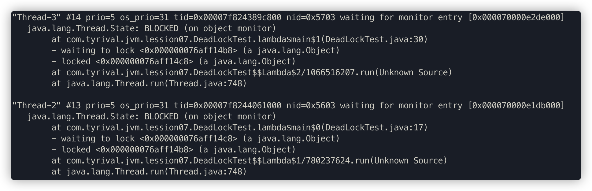
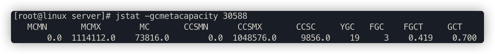

# 1.7 GC调优（一）

事先启动一个web应用程序，用jps查看其进程id，接着用各种jdk自带命令优化应用

## 1.7.1 Jmap

此命令可以用来查看内存信息，实例个数以及占用内存大小


```bash
# 查看历史生成的实例
# 使用 jmap -histo 30680 > ./log.txt 可将日志输出到文件
jmap -histo 30680
# 查看当前存活的实例，执行过程中可能会触发一次full gc
jmap -histo:live 30680
```

打开log.txt，文件内容如下：


- num：序号
- instances：实例数量
- bytes：占用空间大小
- class name：类名称，[C is a char[]，[S is a short[]，[I is a int[]，[B is a byte[]，[[I is a int[][]

##### 堆信息

```bash
jmap -heap 30588
```


##### 堆内存dump

```bash
jmap -dump:format=b,file=eureka.hprof 30588
```


在启动jvm时加入如下参数，可在内存溢出自动导出dump文件(内存很大的时候，可能会导不出来)

```bash
-XX:+HeapDumpOnOutOfMemoryError
-XX:HeapDumpPath=./ （路径）
```

示例代码：

```java
public class OOMTest {

   public static List<Object> list = new ArrayList<>();

   // JVM设置    
   // -Xms10M -Xmx10M -XX:+PrintGCDetails -XX:+HeapDumpOnOutOfMemoryError -XX:HeapDumpPath=/Users/tyrival/jvm.dump 
   public static void main(String[] args) {
      List<Object> list = new ArrayList<>();
      int i = 0;
      int j = 0;
      while (true) {
         list.add(new User(i++, UUID.randomUUID().toString()));
         new User(j--, UUID.randomUUID().toString());
      }
   }
}
```

可以用jvisualvm命令工具导入该dump文件分析，如果用JProfiler，需要将 `.dump` 后缀改为 `.hprof`


## 1.7.2 Jstack

用jstack加进程id查找死锁，见如下示例

```java
public class DeadLockTest {

   private static Object lock1 = new Object();
   private static Object lock2 = new Object();

   public static void main(String[] args) {
      new Thread(() -> {
         synchronized (lock1) {
            try {
               System.out.println("thread1 begin");
               Thread.sleep(5000);
            } catch (InterruptedException e) {
            }
            synchronized (lock2) {
               System.out.println("thread1 end");
            }
         }
      }).start();

      new Thread(() -> {
         synchronized (lock2) {
            try {
               System.out.println("thread2 begin");
               Thread.sleep(5000);
            } catch (InterruptedException e) {
            }
            synchronized (lock1) {
               System.out.println("thread2 end");
            }
         }
      }).start();

      System.out.println("main thread end");
   }
}
```

```bash
jstack 进程ID
```



"Thread-3" 线程名 

prio=5 优先级=5

tid=0x00007f824389c800 线程id

nid=0x5703 线程对应的本地线程标识nid

java.lang.Thread.State: BLOCKED 线程状态


还可以用JProfiler或jvisualvm自动检测死锁，并生成dump信息。


 

### 远程连接jvisualvm

##### jar程序JMX配置

在生产环境因为安全性的考虑，通常不允许开放这类远程端口。

```bash
# -Dcom.sun.management.jmxremote.port 为远程机器的JMX端口
# -Djava.rmi.server.hostname 为远程机器IP
java -Dcom.sun.management.jmxremote.port=8888 -Djava.rmi.server.hostname=192.168.65.60 -Dcom.sun.management.jmxremote.ssl=false -Dcom.sun.management.jmxremote.authenticate=false -jar eureka-server.jar
```

##### tomcat的JMX配置

在catalina.sh文件里的最后一个JAVA_OPTS的赋值语句下一行增加如下配置行

```bash
JAVA_OPTS="$JAVA_OPTS -Dcom.sun.management.jmxremote.port=8888 -Djava.rmi.server.hostname=192.168.50.60 -Dcom.sun.management.jmxremote.ssl=false -Dcom.sun.management.jmxremote.authenticate=false"
```

连接时确认下端口是否通畅，可以临时关闭下防火墙

```bash
# 临时关闭防火墙
systemctl stop firewalld
```

### jstack找出占用cpu最高的线程堆栈信息

```java
package com.tuling.jvm;

/**
 * 运行此代码，cpu会飙高
 */
public class Math {

    public static final int initData = 666;
    public static User user = new User();

  	// 一个方法对应一块栈帧内存区域
    public int compute() {
        int a = 1;
        int b = 2;
        int c = (a + b) * 10;
        return c;
    }

    public static void main(String[] args) {
        Math math = new Math();
        while (true){
            math.compute();
        }
    }
}
```

1. 使用命令top -p <pid> ，显示你的java进程的内存情况，pid是你的java进程号，比如19663


2. 按H（大写H，shift+h），获取每个线程的内存情况 


3. 找到内存和cpu占用最高的线程tid，比如19664

4. 转为十六进制得到 0x4cd0，此为线程id的十六进制表示

5. 执行 `jstack 19663|grep -A 10 4cd0`，得到线程堆栈信息中 4cd0 这个线程所在行的后面10行，从堆栈中可以发现导致cpu飙高的调用方法


6. 查看对应的堆栈信息找出可能存在问题的代码


## 1.7.4 jinfo

查看正在运行的Java应用程序的扩展参数 

查看jvm的参数


查看java系统参数


## 1.7.5 jstat

jstat命令可以查看堆内存各部分的使用量，以及加载类的数量。命令的格式如下：

```bash
jstat [-命令选项] [vmid] [间隔时间(毫秒)] [查询次数]
```

注意：使用的jdk版本是jdk8

#### 垃圾回收统计

**jstat -gc pid 最常用**，可以评估程序内存使用及GC压力整体情况


- S0C：第一个幸存区的大小，单位KB
- S1C：第二个幸存区的大小
- S0U：第一个幸存区的使用大小
- S1U：第二个幸存区的使用大小
- EC：伊甸园区的大小
- EU：伊甸园区的使用大小
- OC：老年代大小
- OU：老年代使用大小
- MC：方法区大小(元空间)
- MU：方法区使用大小
- CCSC:压缩类空间大小
- CCSU:压缩类空间使用大小
- YGC：年轻代垃圾回收次数
- YGCT：年轻代垃圾回收消耗时间，单位s
- FGC：老年代垃圾回收次数 
- FGCT：老年代垃圾回收消耗时间，单位s
- GCT：垃圾回收消耗总时间，单位s

#### 堆内存统计


- NGCMN：新生代最小容量
- NGCMX：新生代最大容量
- NGC：当前新生代容量
- S0C：第一个幸存区大小
- S1C：第二个幸存区的大小
- EC：伊甸园区的大小
- OGCMN：老年代最小容量
- OGCMX：老年代最大容量
- OGC：当前老年代大小
- OC:当前老年代大小
- MCMN:最小元数据容量
- MCMX：最大元数据容量
- MC：当前元数据空间大小
- CCSMN：最小压缩类空间大小
- CCSMX：最大压缩类空间大小
- CCSC：当前压缩类空间大小
- YGC：年轻代gc次数
- FGC：老年代GC次数

#### 新生代垃圾回收统计


- S0C：第一个幸存区的大小
- S1C：第二个幸存区的大小
- S0U：第一个幸存区的使用大小
- S1U：第二个幸存区的使用大小
- TT:对象在新生代存活的次数
- MTT:对象在新生代存活的最大次数
- DSS:期望的幸存区大小
- EC：伊甸园区的大小
- EU：伊甸园区的使用大小
- YGC：年轻代垃圾回收次数
- YGCT：年轻代垃圾回收消耗时间

#### 新生代内存统计


- NGCMN：新生代最小容量
- NGCMX：新生代最大容量
- NGC：当前新生代容量
- S0CMX：最大幸存1区大小
- S0C：当前幸存1区大小
- S1CMX：最大幸存2区大小
- S1C：当前幸存2区大小
- ECMX：最大伊甸园区大小
- EC：当前伊甸园区大小
- YGC：年轻代垃圾回收次数
- FGC：老年代回收次数

#### 老年代垃圾回收统计


- MC：方法区大小
- MU：方法区使用大小
- CCSC:压缩类空间大小
- CCSU:压缩类空间使用大小
- OC：老年代大小
- OU：老年代使用大小
- YGC：年轻代垃圾回收次数
- FGC：老年代垃圾回收次数
- FGCT：老年代垃圾回收消耗时间
- GCT：垃圾回收消耗总时间

#### 老年代内存统计


- OGCMN：老年代最小容量
- OGCMX：老年代最大容量
- OGC：当前老年代大小
- OC：老年代大小
- YGC：年轻代垃圾回收次数
- FGC：老年代垃圾回收次数
- FGCT：老年代垃圾回收消耗时间
- GCT：垃圾回收消耗总时间

#### 元数据空间统计



- MCMN:最小元数据容量
- MCMX：最大元数据容量
- MC：当前元数据空间大小 
- CCSMN：最小压缩类空间大小
- CCSMX：最大压缩类空间大小
- CCSC：当前压缩类空间大小
- YGC：年轻代垃圾回收次数
- FGC：老年代垃圾回收次数
- FGCT：老年代垃圾回收消耗时间
- GCT：垃圾回收消耗总时间


- S0：幸存1区当前使用比例
- S1：幸存2区当前使用比例
- E：伊甸园区使用比例
- O：老年代使用比例
- M：元数据区使用比例
- CCS：压缩使用比例
- YGC：年轻代垃圾回收次数
- FGC：老年代垃圾回收次数
- FGCT：老年代垃圾回收消耗时间
- GCT：垃圾回收消耗总时间


## 1.7.6 JVM运行情况预估

用 `jstat gc -pid` 命令可以计算出如下一些关键数据，有了这些数据就可以采用之前介绍过的优化思路，先给自己的系统设置一些初始性的JVM参数，比如堆内存大小，年轻代大小，Eden和Survivor的比例，老年代的大小，大对象的阈值，大龄对象进入老年代的阈值等。

#### 年轻代对象增长的速率

可以执行命令 jstat -gc pid 1000 10 (每隔1秒执行1次命令，共执行10次)，通过观察EU(eden区的使用)来估算每秒eden大概新增多少对象，如果系统负载不高，可以把频率1秒换成1分钟，甚至10分钟来观察整体情况。注意，一般系统可能有高峰期和日常期，所以需要在不同的时间分别估算不同情况下对象增长速率。

#### Young GC的触发频率和每次耗时

知道年轻代对象增长速率我们就能推根据eden区的大小推算出Young GC大概多久触发一次，Young GC的平均耗时可以通过 YGCT/YGC 公式算出，根据结果我们大概就能知道**系统大概多久会因为Young GC的执行而卡顿多久。**

#### 每次Young GC后有多少对象存活和进入老年代

这个因为之前已经大概知道Young GC的频率，假设是每5分钟一次，那么可以执行命令 jstat -gc pid 300000 10 ，观察每次结果eden，survivor和老年代使用的变化情况，在每次gc后eden区使用一般会大幅减少，survivor和老年代都有可能增长，这些增长的对象就是每次Young GC后存活的对象，同时还可以看出每次Young GC后进去老年代大概多少对象，从而可以推算出**老年代对象增长速率。**

#### Full GC的触发频率和每次耗时

知道了老年代对象的增长速率就可以推算出Full GC的触发频率了，Full GC的每次耗时可以用公式 FGCT/FGC 计算得出。

**优化思路**其实简单来说就是尽量让每次Young GC后的存活对象小于Survivor区域的50%，都留存在年轻代里。尽量别让对象进入老年代。尽量减少Full GC的频率，避免频繁Full GC对JVM性能的影响。


## 1.7.7 系统频繁Full GC导致系统卡顿是怎么回事

- 机器配置：2核4G
- JVM内存大小：2G
- 系统运行时间：7天
- 期间发生的Full GC次数和耗时：500多次，200多秒
- 期间发生的Young GC次数和耗时：1万多次，500多秒

大致算下来每天会发生70多次Full GC，平均每小时3次，每次Full GC在400毫秒左右；

每天会发生1000多次Young GC，每分钟会发生1次，每次Young GC在50毫秒左右。

JVM参数设置如下：

```bash
-Xms1536M -Xmx1536M -Xmn512M -Xss256K -XX:SurvivorRatio=6 -XX:MetaspaceSize=256M 
-XX:MaxMetaspaceSize=256M -XX:+UseParNewGC -XX:+UseConcMarkSweepGC 
-XX:CMSInitiatingOccupancyFraction=75 -XX:+UseCMSInitiatingOccupancyOnly
```


可以结合 [大对象直接进入老年代](./03-Memory-Allocation-Mechanism.md#大对象直接进入老年代) 推理下我们这个程序可能存在的一些问题

经过分析感觉可能会由于对象动态年龄判断机制导致full gc较为频繁

模拟了一个示例程序，打印了jstat的结果如下：

```bash
# 2000ms执行一次，执行10000次
jstat -gc 12345 2000 10000
```


对于对象动态年龄判断机制导致的full gc较为频繁可以先试着优化下JVM参数，把年轻代适当调大点：

```bash
-Xms1536M -Xmx1536M -Xmn1024M -Xss256K -XX:SurvivorRatio=6 -XX:MetaspaceSize=256M 
-XX:MaxMetaspaceSize=256M -XX:+UseParNewGC -XX:+UseConcMarkSweepGC
-XX:CMSInitiatingOccupancyFraction=92 -XX:+UseCMSInitiatingOccupancyOnly 
```


优化完发现没什么变化，**full gc的次数比minor gc的次数还多了**


我们可以推测下full gc比minor gc还多的原因有哪些？

1. 元空间不够导致的多余full gc

2. 显示调用System.gc()造成多余的full gc，这种一般线上尽量通过 `-XX:+DisableExplicitGC` 参数禁用，如果加上了这个JVM启动参数，那么代码中调用System.gc()没有任何效果

3. 老年代空间分配担保机制

最快速度分析完这些我们推测的原因以及优化后，我们发现young gc和full gc依然很频繁了，而且看到有大量的对象频繁的被挪动到老年代，这种情况我们可以借助jmap命令大概看下是什么对象


查到了有大量User对象产生，这个可能是问题所在，但不确定，还必须找到对应的代码确认，如何去找对应的代码了？

1. 代码里全文搜索生成User对象的地方(适合只有少数几处地方的情况)

2. 如果生成User对象的地方太多，无法定位具体代码，我们可以同时分析下占用cpu较高的线程，一般有大量对象不断产生，对应的方法代码肯定会被频繁调用，占用的cpu必然较高

可以用上面说的jstack、JProfiler或jvisualvm来定位cpu使用较高的代码，可以看到其中 `byte[]` 对象所占内存空间高达516MB，并且发现 `com.tyrival.lession07.User` 实例多达5000个。


最终定位到的代码如下：

```java
import java.util.ArrayList;

@RestController
public class IndexController {

    @RequestMapping("/user/process")
    public String processUserData() throws InterruptedException {
        ArrayList<User> users = queryUsers();

        for (User user: users) {
            //TODO 业务处理
            System.out.println("user:" + user.toString());
        }
        return "end";
    }

    /**
     * 模拟批量查询用户场景
     * @return
     */
    private ArrayList<User> queryUsers() {
        ArrayList<User> users = new ArrayList<>();
        for (int i = 0; i < 5000; i++) {
            users.add(new User(i,"tyrival"));
        }
        return users;
    }
}
```

同时，java的代码也是需要优化的，一次查询出5000条对象出来，明显不合适，要根据之前说的各种原则尽量优化到合适的值，尽量消除这种朝生夕死的对象导致的full gc

### 内存泄露

一般电商架构可能会使用多级缓存架构，就是redis加上JVM级缓存。但有些情况下，为了方便对于JVM级缓存就简单使用一个hashmap，于是不断往里面放缓存数据，但是很少考虑这个map的容量问题，结果这个缓存map越来越大，一直占用着老年代的很多空间，时间长了就会导致full gc非常频繁，这就是一种内存泄漏，对于一些老旧数据没有及时清理导致一直占用着宝贵的内存资源，时间长了除了导致full gc，还有可能导致OOM。

这种情况完全可以考虑采用一些成熟的JVM级缓存框架来解决，比如ehcache等自带一些LRU数据淘汰算法的框架来作为JVM级的缓存。

> 对于缓存来说，失效策略是非常重要的。

