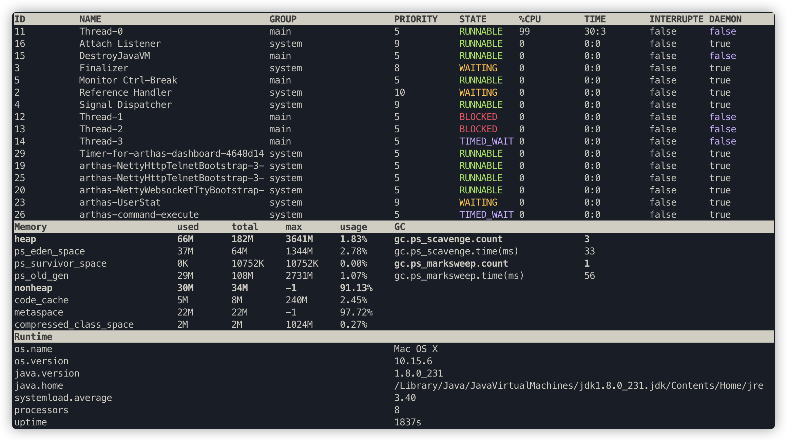
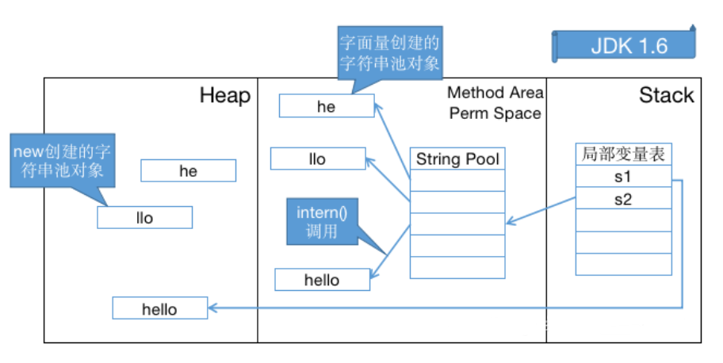
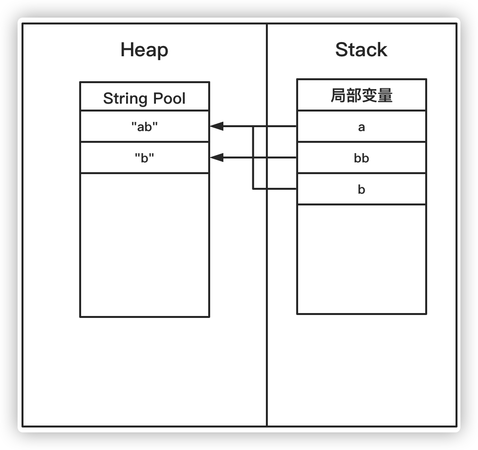

# 8 GC调优（二）

## 8.1 Arthas

[Arthas Github](https://github.com/alibaba/arthas)

### Arthas使用

```bash
# github下载arthas
wget https://alibaba.github.io/arthas/arthas-boot.jar
# 或者 Gitee 下载
wget https://arthas.gitee.io/arthas-boot.jar
```

用java -jar运行即可，可以识别机器上所有Java进程(我们这里之前已经运行了一个Arthas测试程序，代码见下方)


```java
package com.tyrival.jvm.lession08;

import java.util.HashSet;

public class Arthas {
    private static HashSet hashSet = new HashSet();

    public static void main(String[] args) {
        // 模拟 CPU 过高
        cpuHigh();
        // 模拟线程死锁
        deadThread();
        // 不断的向 hashSet 集合增加数据
        addHashSetThread();
    }

    /**
     * 不断的向 hashSet 集合添加数据
     */
    public static void addHashSetThread() {
        // 初始化常量
        new Thread(() -> {
            int count = 0;
            while (true) {
                try {
                    hashSet.add("count" + count);
                    Thread.sleep(1000);
                    count++;
                } catch (InterruptedException e) {
                    e.printStackTrace();
                }
            }
        }).start();
    }

    public static void cpuHigh() {
        new Thread(() -> {
            while (true) {

            }
        }).start();
    }

    /**
     * 死锁
     */
    private static void deadThread() {
        /** 创建资源 */
        Object resourceA = new Object();
        Object resourceB = new Object();
        // 创建线程
        Thread threadA = new Thread(() -> {
            synchronized (resourceA) {
                System.out.println(Thread.currentThread() + " get ResourceA");
                try {
                    Thread.sleep(1000);
                } catch (InterruptedException e) {
                    e.printStackTrace();
                }
                System.out.println(Thread.currentThread() + "waiting get resourceB");
                synchronized (resourceB) {
                    System.out.println(Thread.currentThread() + " get resourceB");
                }
            }
        });

        Thread threadB = new Thread(() -> {
            synchronized (resourceB) {
                System.out.println(Thread.currentThread() + " get ResourceB");
                try {
                    Thread.sleep(1000);
                } catch (InterruptedException e) {
                    e.printStackTrace();
                }
                System.out.println(Thread.currentThread() + "waiting get resourceA");
                synchronized (resourceA) {
                    System.out.println(Thread.currentThread() + " get resourceA");
                }
            }
        });
        threadA.start();
        threadB.start();
    }
}
```

#### 进入进程

选择进程序号4，进入进程信息操作


#### dashboard

输入 `dashboard`，然后按回车，可以查看整个进程的运行情况，线程、内存、GC、运行环境信息：



#### thread

输入**thread**可以查看线程详细情况


输入 **thread加上线程ID** 可以查看线程堆栈


输入 **thread -b** 可以查看线程死锁


#### jad

输入 **jad加类的全名** 可以反编译，这样可以方便我们查看线上代码是否是正确的版本


#### ognl

使用 **ognl** 命令可以查看线上系统变量的值


甚至可以修改变量的值


更多命令使用可以用help命令查看，或查看 [文档](https://alibaba.github.io/arthas/commands.html#arthas)


## 8.2 GC日志详解

对于java应用，我们可以通过一些配置，把程序运行过程中的gc日志全部打印出来，然后分析gc日志得到关键性指标，分析GC原因，调优JVM参数。

打印GC日志方法，在JVM参数里增加参数，%t 代表时间

```bash
-Xloggc:./gc-%t.log -XX:+PrintGCDetails -XX:+PrintGCDateStamps -XX:+PrintGCTimeStamps -XX:+PrintGCCause -XX:+UseGCLogFileRotation -XX:NumberOfGCLogFiles=10 -XX:GCLogFileSize=100M
```

Tomcat则直接加在JAVA_OPTS变量里。

### 如何分析GC日志

运行程序加上对应gc日志

```bash
java -jar -Xloggc:./gc-%t.log -XX:+PrintGCDetails -XX:+PrintGCDateStamps -XX:+PrintGCTimeStamps -XX:+PrintGCCause -XX:+UseGCLogFileRotation -XX:NumberOfGCLogFiles=10 -XX:GCLogFileSize=100M eureka-server.jar
```

下图中是JVM刚启动eureka-server.jar的一部分GC日志 


##### 配置参数

第一行红框是项目的配置参数。这里不仅配置了打印GC日志，还有相关的VM内存参数。 

##### Minor GC

图中最常见的是如下内容，即Minor GC日志

```
2020-07-26T14:10:06.785-0800: 1.223: [GC (Allocation Failure) [PSYoungGen: 65536K->5869K(76288K)] 65536K->5885K(251392K), 0.0061165 secs] [Times: user=0.02 sys=0.00, real=0.01 secs]
```

- `[PSYoungGen: 65536K->5869K(76288K)]` 表示 `年轻代：回收前内存用量->回收后内存用量（年轻代总内存）`

- `65536K->5885K(251392K)` 表示 `回收前堆内存用量->回收后堆内存用量（堆总内存）`
- `0.0061165 secs` 表示此次GC耗费时间

##### Full GC

第二行红框中的是在这个GC时间点发生GC之后相关GC情况。 

```
2020-07-26T14:10:07.353-0800: 1.791: [Full GC (Metadata GC Threshold) [PSYoungGen: 6754K->0K(141824K)] [ParOldGen: 40K->6600K(92672K)] 6794K->6600K(234496K), [Metaspace: 20583K->20583K(1067008K)], 0.0263121 secs] [Times: user=0.11 sys=0.01, real=0.02 secs]
```

- `1.791`：  这是从jvm启动开始计算到这次GC经过的时间，前面还有具体的发生时间日期。 

- `Full GC(Metadata GC Threshold)` 指这是一次full gc，括号里是gc的原因， PSYoungGen是年轻代的GC，ParOldGen是老年代的GC，Metaspace是元空间的GC

- `[PSYoungGen: 6754K->0K(141824K)]`，这三个数字分别对应GC之前占用年轻代的大小，GC之后年轻代占用，以及整个年轻代的大小。 

- `[ParOldGen: 40K->6600K(92672K)]`，这三个数字分别对应GC之前占用老年代的大小，GC之后老年代占用，以及整个老年代的大小。 

- `6794K->6600K(234496K)`，这三个数字分别对应GC之前占用堆内存的大小，GC之后堆内存占用，以及整个堆内存的大小。 

- `[Metaspace: 20583K->20583K(1067008K)]`，这三个数字分别对应GC之前占用元空间内存的大小，GC之后元空间内存占用，以及整个元空间内存的大小。 

- 0.0209707是该时间点GC总耗费时间。 

#### 优化方案

从日志可以发现几次fullgc都是由于元空间不够导致的，所以我们可以将元空间调大点

```bash
java -jar -Xloggc:./gc-adjust-%t.log -XX:MetaspaceSize=256M -XX:MaxMetaspaceSize=256M -XX:+PrintGCDetails -XX:+PrintGCDateStamps -XX:+PrintGCTimeStamps -XX:+PrintGCCause -XX:+UseGCLogFileRotation -XX:NumberOfGCLogFiles=10 -XX:GCLogFileSize=100M eureka-server.jar
```

> MetaSpaceSize默认为21M，表示触发full gc的阈值。
>
> 可以看到gc日志中，第一次full gc触发时，Metaspace为20583K，约为20.1M。然而由于元空间中储存的基本是一些类信息，很难被回收，所以元空间的内存几乎没被回收。
>
> 第二次触发full gc时，Metaspace大小为34030K，这是因为第一次触发full gc后，元空间的阈值会被自动调高。

调整完后重新启动工程，发现没有因为元空间不够导致的full gc了。


### CMS & G1日志

对于CMS和G1收集器的日志会有一点不一样，也可以试着打印下对应的gc日志分析下，可以发现gc日志里面的gc步骤跟之前的步骤是类似的

```java
public class HeapTest {

    byte[] a = new byte[1024 * 100];  //100KB

    public static void main(String[] args) throws InterruptedException {
        ArrayList<HeapTest> heapTests = new ArrayList<>();
        while (true) {
            heapTests.add(new HeapTest());
            Thread.sleep(10);
        }
    }
}
```

#### CMS

```bash
-Xloggc:./gc-cms-%t.log -Xms50M -Xmx50M -XX:MetaspaceSize=256M -XX:MaxMetaspaceSize=256M -XX:+PrintGCDetails -XX:+PrintGCDateStamps -XX:+PrintGCTimeStamps -XX:+PrintGCCause -XX:+UseGCLogFileRotation -XX:NumberOfGCLogFiles=10 -XX:GCLogFileSize=100M -XX:+UseParNewGC -XX:+UseConcMarkSweepGC
```

通过查看日志，可以看到首先进行的是CMS正常的full gc，其中的 `[CMS-concurrent-mark-start]` 等对应的是CMS垃圾收集的各个阶段。


在CMS垃圾收集过程中，出现了 [concurrent mode failure](./05-GC-ParNew-CMS.md#CMS收集器(`-XX:+UseConcMarkSweepGC`(仅用于老年代))，此时会启动Serial old单线程垃圾收集。


#### G1

```bash
-Xloggc:./gc-g1-%t.log -Xms50M -Xmx50M -XX:MetaspaceSize=256M -XX:MaxMetaspaceSize=256M -XX:+PrintGCDetails -XX:+PrintGCDateStamps -XX:+PrintGCTimeStamps -XX:+PrintGCCause -XX:+UseGCLogFileRotation -XX:NumberOfGCLogFiles=10 -XX:GCLogFileSize=100M -XX:+UseG1GC
```

### gceasy

上面的这些参数，能够帮我们查看分析GC的垃圾收集情况。但是如果GC日志很多很多，成千上万行。推荐使用 **[gceasy](https://gceasy.io/)**，可以上传gc文件，然后他会利用可视化的界面来展现GC情况。具体下图所示，可以看到年轻代、老年代、元空间的内存分配和最大使用情况。 


下图我们可以看到堆内存在GC之前和之后的变化，以及其他信息。


还可以看到GC的原因。


这个工具还提供基于机器学习的JVM智能优化建议，这个功能需要付费

#### JVM参数汇总查看命令

`java -XX:+PrintFlagsInitial` 表示打印出所有参数选项的默认值

`java -XX:+PrintFlagsFinal` 表示打印出所有参数选项在运行程序时生效的值


## 8.3 常量池

### Class常量池与运行时常量池

Class常量池可以理解为是Class文件中的资源仓库。 Class文件中除了包含类的版本、字段、方法、接口等描述信息外，还有一项信息就是**常量池(constant pool table)**，用于存放编译期生成的各种**字面量(Literal)和符号引用(Symbolic References)**。

一个class文件的16进制大体结构如下图：


对应的含义如下，细节可以查下oracle官方文档


当然我们一般不会去人工解析这种16进制的字节码文件，我们一般可以通过javap命令生成更可读的JVM字节码指令文件：

```bash
javap -v Math.class
```


其中的 `Constant pool` 是class常量池信息，常量池中主要存放两大类常量：**字面量和符号引用**。

#### 字面量

**字面量就是指由字母、数字等构成的字符串或者数值常量**

字面量只可以右值出现，所谓右值是指等号右边的值，如：int a=1 这里的a为左值，1为右值。在这个例子中1就是字面量。

```java
int a = 1;
int b = 2;
int c = "abcdefg";
int d = "abcdefg";
```

#### 符号引用

符号引用是编译原理中的概念，是相对于直接引用来说的。主要包括了以下三类常量：

- 类和接口的全限定名 
- 字段的名称和描述符 
- 方法的名称和描述符

上面的a，b就是字段名称，就是一种符号引用，还有Math类常量池里的 `Lcom/tyrival/jvm/lession01/Math` 是类的全限定名，main和compute是方法名称，()是一种UTF8格式的描述符，这些都是符号引用。

这些常量池现在是静态信息，只有到运行时被加载到内存后，这些符号才有对应的内存地址信息，这些常量池一旦被装入内存就变成**运行时常量池**，对应的符号引用在程序加载或运行时会被转变为被加载到内存区域的代码的直接引用，也就是我们说的**动态链接了。例如，compute()这个符号引用在运行时就会被转变为compute()方法具体代码在内存中的地址，主要通过对象头里的类型指针去转换直接引用。**

### 字符串常量池

#### 字符串常量池的设计思想

- 字符串的分配，和其他的对象分配一样，耗费高昂的时间与空间代价，作为最基础的数据类型，大量频繁的创建字符串，极大程度地影响程序的性能

- JVM为了提高性能和减少内存开销，在实例化字符串常量的时候进行了一些优化
  - 为字符串开辟一个字符串常量池，类似于缓存区
  - 创建字符串常量时，首先查询字符串常量池是否存在该字符串
  - 存在该字符串，返回引用实例，不存在，实例化该字符串并放入池中

#### 三种字符串操作(Jdk1.7 及以上版本)

- 直接赋值字符串

```java
String s = "tyrival";  // s指向常量池中的引用
```

这种方式创建的字符串对象，只会在常量池中。

因为有"tyrival"这个字面量，创建对象s的时候，JVM会先去常量池中通过 equals(key) 方法，判断是否有相同的对象

如果有，则直接返回该对象在常量池中的引用；

如果没有，则会在常量池中创建一个新对象，再返回引用。

- new String();

```java
String s1 = new String("tyrival");  // s1指向内存中的对象引用
```

这种方式会保证字符串常量池和堆中都有这个对象，没有就创建，最后返回堆内存中的对象引用。

步骤大致如下：

因为有"tyrival"这个字面量，所以会先检查字符串常量池中是否存在字符串"tyrival"

不存在，先在字符串常量池里创建一个字符串对象；再去内存中创建一个字符串对象"tyrival"；

存在的话，就直接去堆内存中创建一个字符串对象"tyrival"；

最后，将内存中的引用返回。

- intern方法

```java
String s1 = new String("tyrival");   
String s2 = s1.intern();

// 因为s2指向的是常量池中的"tyrival"字符串，而s1引用的是堆内的String对象，所以返回false
System.out.println(s1 == s2);
```

String中的intern方法是一个 native 的方法，当调用 intern方法时，如果池已经包含一个等于此String对象的字符串（用 `equals(object)` 方法确定），则返回池中的字符串。**否则，将intern返回的引用指向当前字符串 s1**(**jdk1.6版本需要将 s1 复制到字符串常量池里**)。

#### 字符串常量池位置

- Jdk1.6及之前： 有永久代, 运行时常量池在永久代，运行时常量池包含字符串常量池

- Jdk1.7：有永久代，但已经逐步“去永久代”，字符串常量池从永久代里的运行时常量池分离到堆里

- Jdk1.8及之后： 无永久代，运行时常量池在元空间，字符串常量池里依然在堆里

用一个程序证明下字符串常量池在哪里：

```java
/**
 * jdk6：-Xms6M -Xmx6M -XX:PermSize=6M -XX:MaxPermSize=6M  
 * jdk8：-Xms6M -Xmx6M -XX:MetaspaceSize=6M -XX:MaxMetaspaceSize=6M
 */
public class RuntimeConstantPoolOOM {
    public static void main(String[] args) {
        ArrayList<String> list = new ArrayList<String>();
        for (int i = 0; i < 10000000; i++) {
            String str = String.valueOf(i).intern();
            list.add(str);
        }
    }
}

运行结果：
jdk7及以上：Exception in thread "main" java.lang.OutOfMemoryError: Java heap space
jdk6：Exception in thread "main" java.lang.OutOfMemoryError: PermGen space
```

#### 字符串常量池设计原理

字符串常量池底层是hotspot的C++实现的，底层类似一个 HashTable， 保存的本质上是字符串对象的引用。

看一道比较常见的面试题，下面的代码创建了多少个 String 对象？

```java
String s1 = new String("he") + new String("llo");
String s2 = s1.intern();
 
System.out.println(s1 == s2);
// 在 JDK 1.6 下输出是 false，创建了 6 个对象
// 在 JDK 1.7 及以上的版本输出是 true，创建了 5 个对象
// 当然我们这里没有考虑GC，但这些对象确实存在或存在过　　
```

为什么输出会有这些变化呢？主要还是字符串池从永久代中脱离、移入堆区的原因， intern() 方法也相应发生了变化：

1. 在 JDK 1.6 中，调用 intern() 首先会在字符串池中寻找 equal() 相等的字符串。
   - 假如字符串存在就返回该字符串在字符串池中的引用；
   - 假如字符串不存在，虚拟机会重新在永久代上创建一个实例，将 StringTable 的一个表项指向这个新创建的实例。

 

2. 在 JDK 1.7 及以上版本中，由于字符串池不在永久代了，当执行 `intern()` 方法时，如果String Pool中存在这个字符串字面量，则直接使用，如果不存在（例如上面的 `String s1 = new String("he") + new String("llo");`，String Pool中没有"hello"这个字面量），不会重新创建一个实例，而是在**堆内找到这个变量指向的字符串对象，然后在String Pool中维护一个映射关系，映射的key为这个字符串，value为这个字符串对象的内存地址**。

   > s1指向的是堆内的**"hello"对象**，执行 `intern()` 时，String Pool会建立一个引用，指向堆内的**"hello"对象**，这个引用的key是"hello"，value是**"hello"对象**的内存地址。当intern()方法给s2赋值时，取String Pool中的值时，实际取到的是**"hello"对象**的内存地址，于是s2也会指向堆内的**"hello"对象**，所以 `s1 == s2` 返回 `true`。

 

由上面两个图，也不难理解为什么 JDK 1.6 字符串池溢出会抛出 `OutOfMemoryError: PermGen space`，而在 JDK 1.7 及以上版本抛出 `OutOfMemoryError: Java heap space`。

#### String常量池问题的几个例子

##### 示例1

```java
String s0 = "tyrival";
String s1 = "tyrival";
String s2 = "tyri" + "val";
System.out.println( s0 == s1 ); //true
System.out.println( s0 == s2 ); //true，s2在编译阶段会被优化为tyrival
```


> 因为例子中的 s0和s1中的"tyrival"都是字符串常量，它们在编译期就被确定了，所以s0==s1为true；而"tyri"和"val"也都是字符串常量，当一个字 符串由多个字符串常量连接而成时，它自己肯定也是字符串常量，所以s2也同样在编译期就被优化为一个字符串常量"tyrival"，所以s2也是常量池中"tyrival"的一个引用。所以我们得出s0==s1==s2；

##### 示例2

```java
// s0是常量池里的字符串
String s0 = "tyrival";
// s1是堆内的对象
String s1 = new String("tyrival");
// s2不能在编译阶段进行优化，需要额外在堆内创建一个对象
String s2 = "tyri" + new String("val");
System.out.println( s0 == s1 );　　// false，
System.out.println( s0 == s2 )；　 // false
System.out.println( s1 == s2 );　　// false
```


> 用new String() 创建的字符串不是常量，不能在编译期就确定，所以new String() 创建的字符串不放入常量池中，它们有自己的地址空间。
>
> s0还是常量池 中"tyrival"的引用，s1因为无法在编译期确定，所以是运行时创建的新对象"tyrival"的引用，s2因为有后半部分 new String("val")所以也无法在编译期确定，所以也是一个新创建对象"tyrival"的引用;明白了这些也就知道为何得出此结果了。

##### 示例3

```java
  String a = "a1";
  String b = "a" + 1;
  System.out.println(a == b); // true 
  
  String a = "atrue";
  String b = "a" + "true";
  System.out.println(a == b); // true 
  
  String a = "a3.4";
  String b = "a" + 3.4;
  System.out.println(a == b); // true
```

> JVM对于字符串常量的"+"号连接，将在程序编译期，JVM就将常量字符串的"+"连接优化为连接后的值，拿"a" + 1来说，经编译器优化后在class中就已经是a1。在编译期其字符串常量的值就确定下来，故上面程序最终的结果都为true。

##### 示例4

```java
String a = "ab";
String bb = "b";
String b = "a" + bb;

System.out.println(a == b); // false
```


> JVM对于字符串引用，由于在字符串的"+"连接中，有字符串引用存在，而引用的值在程序编译期是无法确定的，即"a" + bb无法被编译器优化，只有在程序运行期来动态分配并将连接后的新地址赋给b。所以上面程序的结果也就为false。

##### 示例5

```java
String a = "ab";
final String bb = "b";
String b = "a" + bb;

System.out.println(a == b); // true
```



> 和示例4中唯一不同的是bb字符串加了final修饰，对于final修饰的变量，它在编译时被解析为常量值的一个本地拷贝存储到自己的常量池中或嵌入到它的字节码流中。所以此时的"a" + bb和"a" + "b"效果是一样的。故上面程序的结果为true。

##### 示例6

```java
String a = "ab";
final String bb = getBB();
String b = "a" + bb;

System.out.println(a == b); // false

private static String getBB() {  
		return "b";  
}
```


> JVM对于字符串引用bb，它的值在编译期无法确定，只有在程序运行期调用方法后，将方法的返回值和"a"来动态连接并分配地址为b，故上面 程序的结果为false。

#### 关于String是不可变的

通过上面例子可以得出得知：

```java
String s = "a" + "b" + "c";  // 就等价于String s = "abc";
String a = "a";
String b = "b";
String c = "c";
String s1 = a + b + c;
```

s1 这个就不一样了，可以通过观察其**JVM指令码**现s1的"+"操作会变成如下操作：

```java
StringBuilder temp = new StringBuilder();
temp.append(a).append(b).append(c);
String s = temp.toString();
```


#### 最后再看一个例子

```java
// 没有出现"计算机技术"字面量，所以不会在常量池里生成"计算机技术"对象
String str2 = new StringBuilder("计算机").append("技术").toString();
String str1 = str2.intern();
// "计算机技术" 在池中没有，但是在heap中存在，则intern时，会直接返回该heap中的引用
System.out.println(str2 == str1);  //true
```


> 字符串常量池："计算机"和"技术"；堆内存：str1引用的对象"计算机技术"  
>
> 堆内存中还有个StringBuilder的对象，但是会被gc回收，StringBuilder的toString方法会new String()，这个String才是真正返回的对象引用

```java
// 没有出现"java"字面量，所以不会在常量池里生成"java"对象
String str1 = new StringBuilder("ja").append("va").toString();
// java是关键字，在JVM初始化的相关类里肯定早就放进字符串常量池了，所以在字符串常量池中寻找时，只会找到JVM启动时初始化的"java"字符串，而不会指向堆内的"java"字符串对象
String str2 = str1.intern();
System.out.println(str1 == str2);  //false
```


> 字符串常量池："ja"和"va"；堆内存：str1引用的对象"java"
>
> 堆内存中还有个StringBuilder的对象，但是会被gc回收，StringBuilder的toString方法会new String()，这个String才是真正返回的对象引用
>
> **这里的str2指向的字符串常量池中"java"，不一定是字面量，也有可能是其他地方生成的"java"字符串对象。**

```java
//"test"作为字面量，放入了池中，而new时s1指向的是heap中新生成的string对象，s1.intern()指向的是"test"字面量之前在池中生成的字符串对象
String s1 = new String("test");  
String s2 = s1.intern();
System.out.println(s1 == s2);   //false

//同上
String s2 = new StringBuilder("abc").toString();
System.out.println(s2 == s2.intern());  //false
```


#### 八种基本类型的包装类和对象池

java中基本类型的包装类的大部分都实现了常量池技术(严格来说应该叫**对象池，**在堆上)，这些类是Byte,Short,Integer,Long,Character,Boolean,另外两种浮点数类型的包装类则没有实现。另外Byte,Short,Integer,Long,Character这5种整型的包装类也只是在对应值小于等于127时才可使用对象池，也即对象不负责创建和管理大于127的这些类的对象。因为一般这种比较小的数用到的概率相对较大。

```java
public class Test {

    public static void main(String[] args) {
        //5种整形的包装类Byte,Short,Integer,Long,Character的对象，  
        //在值小于127时可以使用对象池
      	//这种调用底层实际是执行的Integer.valueOf(127)，里面用到了IntegerCache对象池
        Integer i1 = 127;
        Integer i2 = 127;
        System.out.println(i1 == i2);//输出true  

        //值大于127时，不会从对象池中取对象  
        Integer i3 = 128;
        Integer i4 = 128;
        System.out.println(i3 == i4);//输出false  
        
        //用new关键词新生成对象不会使用对象池
        Integer i5 = new Integer(127);  
        Integer i6 = new Integer(127);
        System.out.println(i5 == i6);//输出false 

        //Boolean类也实现了对象池技术  
        Boolean bool1 = true;
        Boolean bool2 = true;
        System.out.println(bool1 == bool2);//输出true  

        //浮点类型的包装类没有实现对象池技术  
        Double d1 = 1.0;
        Double d2 = 1.0;
        System.out.println(d1 == d2);//输出false  
    }
} 
```