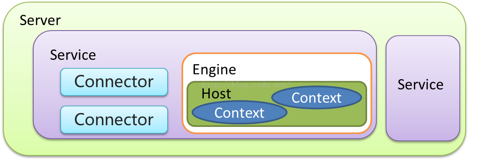

# 1 Tomcat生产环境应用

## 1.1 Web容器

Servlet可以理解为一种Java小程序，没有main方法，不能独立运行，必须部署到Servlet容器中，由容器实例化并调用。Tomcat就是一种Servlet容器，为了方便使用，Tomcat集成了HTTP服务器的功能，是一个“HTTP服务器 + Servlet容器”，即一个**Web容器**。


## 1.2 HTTP

HTTP 协议是浏览器与服务器之间的数据传送协议。作为应用层协议，HTTP是基于 TCP/IP 协议来传递数据的（HTML 文件、图片、查询结果等），HTTP协议不涉及数据包（Packet）传输，主要规定了客户端和服务器之间的通信格式。

假如浏览器需要从远程 HTTP服务器获取一个HTML文本，在这个过程中，浏览器实际上要做两件事情。

- 与服务器建立 Socket 连接。 
- 生成请求数据并通过 Socket 发送出去。


### Request

HTTP请求数据由三部分组成，分别是**请求行**、**请求报头**、**请求正文**。当这个HTTP 请求数据到达Tomcat后，Tomcat会把HTTP请求数据字节流解析成一个Request对象，这个Request对象封装了HTTP所有的请求信息。接着Tomcat把这个Request对象交给 Web应用去处理，处理完后得到一个Response对象，Tomcat会把这个 Response对象转成HTTP格式的响应数据并发送给浏览器。


### Response

HTTP 的响应也是由三部分组成，分别是**状态行**、**响应报头**、**报文主体**。


## 1.3 Cookie和Session

HTTP 协议是无状态的，请求与请求之间是没有关系。这样会出现一个问题：Web 应用不知道你是谁。因此 HTTP 协议需要一种技术让请求与请求之间建立起联系，并且服务器需要知道这个请求来自哪个用户，于是 Cookie 技术出现了。

**Cookie是HTTP报文的一个请求头**，Web应用可以将用户的标识信息或者其他一些信息（用户名等）存储在Cookie中。用户经过验证之后，每次HTTP请求报文中都包含Cookie，这样服务器读取这个Cookie请求头就知道用户是谁了。Cookie本质上就是一份存储在用户本地的文件，里面包含了每次请求中都需要传递的信息。

由于Cookie以明文的方式存储在本地，而Cookie中往往带有用户信息，这样就造成了非常大的安全隐患。而Session的出现解决了这个问题，**Session可以理解为服务器端开辟的存储空间，里面保存了用户的状态，用户信息以Session的形式存储在服务端。**当用户请求到来时，服务端可以把用户的请求和用户的Session对应起来。那么Session是怎么和请求对应起来的呢？答案是通过Cookie，浏览器在Cookie中填充了一个SessionID之类的字段用来标识请求。

具体工作过程是这样的：服务器在创建Session的同时，会为该Session生成唯一的SessionID，当浏览器再次发送请求的时候，会将这个SessionID带上，服务器接受到请求之后就会依据SessionID找到相应的Session，找到Session后，就可以在Session中获取或者添加内容了。而这些内容只会保存在服务器中，发到客户端的只有SessionID，这样相对安全，也节省了网络流量，因为不需要在Cookie中存储大量用户信息。

那么Session在何时何地创建呢？当然还是在服务器端程序运行的过程中创建的，不同语言实现的应用程序有不同的创建Session的方法。在Java中，是Web应用程序在调用HttpServletRequest的getSession方法时，由Web容器（比如Tomcat）创建的。Tomcat的Session管理器提供了多种持久化方案来存储Session，通常会采用高性能的存储方式，比如Redis，并且通过集群部署的方式，防止单点故障，从而提升高可用。同时，Session有过期时间，因此Tomcat会开启后台线程定期的轮询，如果Session过期了就将Session失效。


## 1.4 Servlet规范

Servlet容器一方面用来和HTTP服务器通信，接收请求，另一方面加载并实例化Servlet，调用这些Servlet的接口方法，将请求转发到具体的Servlet。

Servlet接口和Servlet容器这一整套规范叫作Servlet规范。Tomcat和Jetty都按照Servlet规范进行了实现，同时也具有HTTP服务器的功能。作为Java程序员，如果要实现新的业务功能，只需要实现一个Servlet，并把它注册到 Tomcat（Servlet 容器）中，剩下的事情就由Tomcat帮我们处理了。

Servlet的接口规范如下：

```java
public interface Servlet {

	void init(ServletConfig config) throws ServletException;

	ServletConfig getServletConfig();

	void service(ServletRequest req, ServletResponse res)
               throws ServletExce ption, IOException;

	String getServletInfo();

	void destroy();
}
```

其中最重要是的 `void service(ServletRequest req, ServletResponse res)` 方法，具体业务类在这个方法里实现处理逻辑。这个方法有两个参数：`ServletRequest` 和 `ServletResponse`。`ServletRequest` 用来封装请求信息 `ServletResponse` 用来封装响应信息，因此本质上这两个类是对通信协议的封装。

接口中还有两个跟生命周期有关的方法 `init` 和 `destroy`，Servlet容器在加载Servlet类的时候会调用 `init` 方法，在卸载的时候会调用 `destroy` 方法。我们可能会在` init` 方法里初始化一些资源，并在 `destroy` 方法里释放这些资源。

`ServletConfig` 的作用就是封装Servlet的初始化参数。你可以在web.xml给Servlet配置参数，并在程序里通过 `getServletConfig` 方法拿到这些参数。

Servet 规范还提供了HttpServlet来继承GenericServlet，并且加入了HTTP特性。这样我们通过继承HttpServlet类来实现自己的Servlet，只需要重写两个方法：`doGet` 和 `doPost`。


## 1.5 Servlet容器

当客户请求某个资源时，HTTP服务器会用一个ServletRequest对象把客户的请求信息封装起来，然后调用Servlet容器的 `service` 方法，Servlet容器拿到请求后，根据请求的URL和Servlet的映射关系，找到相应的Servlet，如果Servlet还没有被加载，就用反射机制创建这个Servlet，并调用Servlet的 `init `方法来完成初始化，接着调用Servlet的 `service` 方法来处理请求，把ServletResponse对象返回给HTTP服务器，HTTP服务器会把响应发送给客户端。


## 1.6 Web应用

Web应用程序目录下分别放置了Servlet的**类文件**、**配置文件**以及**静态资源**，Servlet容器通过读取配置文件，就能找到并加载Servlet。Web应用的目录结构基本如下：

```bash
|‐MyWebApp
  |‐WEB‐INF/web.xml		‐‐ 配置文件，用来配置Servlet等
  |‐WEB‐INF/lib/			‐‐ 存放Web应用所需各种JAR包
  |‐WEB‐INF/classes/	‐‐ 存放你的应用类，比如Servlet类
  |‐META‐INF/					‐‐ 目录存放工程的一些信息
```

Servlet规范里定义了 `ServletContext` 接口来对应一个Web应用。Web应用部署好后，Servlet容器在启动时会加载Web应用，并为每个Web应用创建唯一的ServletContext对象。你可以把ServletContext看成是一个全局对象，一个Web应用可能有多个Servlet，这些Servlet可以通过全局的ServletContext来共享数据，这些数据包括Web应用的初始化参数、Web应用目录下的文件资源等。由于ServletContext持有所有Servlet实例，你还可以通过它来实现Servlet请求的转发。


## 1.7 扩展机制

Servlet规范提供了两种扩展机制：**Filter**和**Listener**。

- **Filter**

Filter是过滤器，这个接口允许你对请求和响应做一些统一的定制化处理，比如你可以根据请求的频率来限制访问，或者根据国家地区的不同来修改响应内容。

工作原理：Web应用部署完成后，Servlet容器需要实例化Filter并把Filter链接成一个FilterChain。当请求进来时，获取第一个Filter并调用doFilter方法，doFilter方法负责调用这个FilterChain中的下一个Filter。

- **Listener**

Listener是监听器，这是另一种扩展机制。当Web应用在Servlet容器中运行时，Servlet容器内部会不断的发生各种事件，如Web应用的启动和停止、用户请求到达等。Servlet容器提供了一些默认的监听器来监听这些事件，当事件发生时，Servlet容器会负责调用监听器的方法。

当然，你可以定义自己的监听器去监听你感兴趣的事件，将监听器配置在web.xml中。比如Spring就实现了自己的监听器，来监听ServletContext的启动事件，目的是当 Servlet容器启动时，创建并初始化全局的Spring容器。


## 1.8 Tomcat目录结构

```
/bin：存放 Windows 或 Linux 平台上启动和关闭 Tomcat 的脚本文件。
/conf：存放 Tomcat 的各种全局配置文件，其中最重要的是server.xml。
/lib：存放 Tomcat 以及所有 Web 应用都可以访问的 JAR 文件。
/logs：存放 Tomcat 执行时产生的日志文件。
/work：存放 JSP 编译后产生的 Class 文件。
/webapps：Tomcat 的 Web 应用目录，默认情况下把 Web 应用放在这个目录下。
```

Tomcat的日志信息分为两类 ：一是**运行日志**，它主要记录运行过程中的一些信息，尤其是一些异常错误日志信息；二是**访问日志**，它记录访问的时间、IP 地址、访问的路径等相关信息。

- **catalina.\*\*\*.log**

主要是记录 Tomcat 启动过程的信息，在这个文件可以看到启动的 JVM 参数以及操作系统等日志信息。

- **catalina.out**

Tomcat 的标准输出（stdout）和标准错误（stderr），这是在 Tomcat 的启动脚本里指定的，如果没有修改的话stdout 和 stderr 会重定向到这里。所以在这个文件里可以看到我们在MyServlet.java程序里打印出来的信息

- **localhost.\*\*.log**

主要记录 Web 应用在初始化过程中遇到的未处理的异常，会被 Tomcat 捕获而输出这个日志文件。

- **localhost_access_log.\*\*.txt**

存放访问 Tomcat 的请求日志，包括 IP地址以及请求的路径、时间、请求协议以及状态码等信息。

- **manager.\*\*\*.log/host-manager.\*\*\*.log**

存放 Tomcat 自带的Manager 项目的日志信息。


## 1.9 Tomcat组件

### Tomcat架构

Tomcat是一个基于JAVA的WEB容器，其实现了JAVA EE中的Servlet与jsp规范，与nginx服务器不同在于一般用于动态请求处理。在架构设计上采用面向组件的方式设计。即整体功能是通过组件的方式拼装完成。另外每个组件都可以被替换以保证灵活性。


### Tomcat组件和关系

* Server和Service
* Connector连接器
  * HTTP 1.1
  * SSL  https
  * AJP（ Apache JServ Protocol） apache私有协议，用于apache反向代理Tomcat
* Container 
  * Engine    引擎 catalina
  * Host        虚拟机 基于域名 分发请求
  * Context  隔离各个WEB应用 每个Context的  ClassLoader都是独立
* Component 
  * Manager （管理器）
  * logger （日志管理）
  * loader （载入器）
  * pipeline (管道)
  * valve （管道中的阀）



### Tomcat server.xml

#### server  

root元素：server 的顶级配置。

主要属性如下：

- port：执行关闭命令的端口号
- shutdown：关闭命令

*示例：*

```
#基于telent 执行SHUTDOWN 命令即可关闭(必须大写)
telent 127.0.0.1 8005
SHUTDOWN
```

#### service

服务：将多个connector与一个Engine组合成一个服务，可以配置多个服务。

#### Connector

连接器：用于接收 指定协议下的连接 并指定给唯一的Engine 进行处理。

主要属性：

* protocol	监听的协议，默认是http/1.1
* port	指定服务器端要创建的端口号
* minThread	服务器启动时创建的处理请求的线程数
* maxThread	最大可以创建的处理请求的线程数
* enableLookups	如果为 `true`，则可以通过调用 `request.getRemoteHost()` 进行DNS查询来得到远程客户端的实际主机名，若为 `false` 则不进行DNS查询，而是返回其ip地址
* redirectPort	指定服务器正在处理http请求时收到了一个SSL传输请求后重定向的端口号
* acceptCount	指定当所有可以使用的处理请求的线程数都被使用时，可以放到处理队列中的请求数，超过这个数的请求将不予处理
* connectionTimeout	指定超时的时间数(以毫秒为单位)
* SSLEnabled	是否开启ssl验证，在https访问时需要开启。

*示例：*

```xml
 <Connector port="8860" protocol="org.apache.coyote.http11.Http11NioProtocol"
            connectionTimeout="20000"
            redirectPort="8862"
            URIEncoding="UTF-8"
            useBodyEncodingForURI="true"
            compression="on" 
            compressionMinSize="2048"
            compressableMimeType="text/html,text/xml,text/plain,text/javascript,text/css,application/x-json,application/json,application/x-javascript"
            maxThreads="1024" 
            minSpareThreads="200"
            acceptCount="800"
            enableLookups="false"/>
```

#### Engine

引擎：用于处理连接的执行器，默认的引擎是catalina。一个service 中只能配置一个Engine。
主要属性：

- name	引擎名称 
- defaultHost	默认host

#### Host

虚拟机：基于域名匹配至指定虚拟机。类似于nginx当中的server，默认的虚拟机是localhost。

*示例：*

```xml
<Host name="www.luban.com"  appBase="/usr/www/luban" unpackWARs="true" autoDeploy="true">
	<Valve className="org.apache.catalina.valves.AccessLogValve" 
         directory="logs"               
         prefix="www.luban.com.access_log" 
         suffix=".txt" 
         pattern="%h %l %u %t &quot;%r&quot; %s %b" />
</Host>
```

#### Context

应用上下文：一个host 下可以配置多个Context ，每个Context 都有其独立的classPath。相互隔离，以免造成ClassPath 冲突。

*示例：*

```xml
<Context docBase="hello" path="/h" reloadable="true"/>
```

#### Valve
阀门：可以理解成过滤器，具体配置要基于具体的Valve 接口的子类。

*示例：*

```xml
<Valve className="org.apache.catalina.valves.AccessLogValve" 
       directory="logs"
       prefix="www.wukong.com.access_log" 
       suffix=".txt"
       pattern="%h %l %u %t &quot;%r&quot; %s %b"/>
```


## 1.10 Tomcat自动部署脚本

Tomcat启动参数如下


| **启动参数**    | **描述说明**                                                 |
| :-------------- | :----------------------------------------------------------- |
| JAVA_OPTS       | jvm启动参数 , 设置内存  编码等。` -Xms100m -Xmx200m -Dfile.encoding=UTF-8` |
| JAVA_HOME       | 指定jdk目录，如果未设置从java环境变量当中去找。              |
| CATALINA_HOME   | Tomcat程序根目录                                             |
| CATALINA_BASE   | 应用部署目录，默认为 `$CATALINA_HOME`                        |
| CATALINA_OUT    | 应用日志输出目录，默认为 `$CATALINA_BASE/log`                |
| CATALINA_TMPDIR | 应用临时目录，默认为`$CATALINA_BASE/temp`                    |

可以编写一个脚本来实现自定义配置：

- 更新启动脚本

```bash
#!/bin/bash 
export JAVA_OPTS="-Xms100m -Xmx200m"
export CATALINA_HOME=/root/svr/apache-tomcat
export CATALINA_BASE="`pwd`"

case $1 in
  start)
  $CATALINA_HOME/bin/catalina.sh start
  	echo start success!!
  ;;
  stop)
  $CATALINA_HOME/bin/catalina.sh stop
  	echo stop success!!
  ;;
  restart)
  $CATALINA_HOME/bin/catalina.sh stop
  	echo stop success!!
  	sleep 3
  $CATALINA_HOME/bin/catalina.sh start
  echo start success!!
  ;;
  version)
  $CATALINA_HOME/bin/catalina.sh version
  ;;
  configtest)
  $CATALINA_HOME/bin/catalina.sh configtest
  ;;
  esac
exit 0
```

- docker脚本

```bash
docker run ‐id ‐‐name=test_tomcat \
           ‐e JAVA_OPTS='‐Xmx128m' \
           ‐p 8888:8080 \
           ‐v /usr/local/tomcat‐test/webapps:/usr/local/tomcat/webapps \
           ‐v /usr/local/tomcat‐test/logs:/usr/local/tomcat/logs \
           ‐v /usr/local/tomcat‐test/conf:/usr/local/tomcat/conf \
           ‐‐privileged=true tomcat:8
```


## 1.11 Tomcat源码启动

1. 解压源码并使用IDE打开；
2. 在apache-tomcat-8.5.57-src目录下添加pom.xml文件

```xml
<?xml version="1.0" encoding="UTF-8"?>
<project xmlns="http://maven.apache.org/POM/4.0.0" xmlns:xsi="http://www.w3.org/2001/XMLSchema-instance"
         xsi:schemaLocation="http://maven.apache.org/POM/4.0.0 https://maven.apache.org/xsd/maven-4.0.0.xsd">
    <modelVersion>4.0.0</modelVersion>
    <groupId>org.apache.tomcat</groupId>
    <artifactId>Tomcat8.0</artifactId>
    <name>Tomcat8.0</name>
    <version>8.0</version>
    <build>
        <finalName>Tomcat8.0</finalName>
        <sourceDirectory>java</sourceDirectory>
        <testSourceDirectory>test</testSourceDirectory>
        <resources>
            <resource>
                <directory>java</directory>
            </resource>
        </resources>
        <testResources>
            <testResource>
                <directory>test</directory>
            </testResource>
        </testResources>
        <plugins>
            <plugin>
                <groupId>org.apache.maven.plugins</groupId>
                <artifactId>maven-compiler-plugin</artifactId>
                <version>3.8.1</version>
                <configuration>
                    <encoding>UTF‐8</encoding>
                    <source>1.8</source>
                    <target>1.8</target>
                </configuration>
            </plugin>
        </plugins>
    </build>
    <dependencies>
        <dependency>
            <groupId>junit</groupId>
            <artifactId>junit</artifactId>
            <version>4.12</version>
            <scope>test</scope>
        </dependency>
        <dependency>
            <groupId>org.easymock</groupId>
            <artifactId>easymock</artifactId>
            <version>3.4</version>
        </dependency>
        <dependency>
            <groupId>ant</groupId>
            <artifactId>ant</artifactId>
            <version>1.7.0</version>
        </dependency>
        <dependency>
            <groupId>wsdl4j</groupId>
            <artifactId>wsdl4j</artifactId>
            <version>1.6.2</version>
        </dependency>
        <dependency>
            <groupId>javax.xml</groupId>
            <artifactId>jaxrpc</artifactId>
            <version>1.1</version>
        </dependency>
        <dependency>
            <groupId>org.eclipse.jdt.core.compiler</groupId>
            <artifactId>ecj</artifactId>
            <version>4.5.1</version>
        </dependency>
    </dependencies>
</project>
```

4. 在apache-tomcat-8.5.57-src同级目录下新建catalina-home文件夹，并且使目录下的文件如下：


5. 在IDEA选择【菜单】-【Run】-【Edit Configuration】，然后选择新增【Application】

- MainClass: `org.apache.catalina.startup.Bootstrap`
- VmOptions:  `-Dcatalina.home=/Users/tyrival/Workspace/apache-tomcat-8.5.57-src/catalina-home`


6. 解决报错问题

- TestCookieFilter报错找不到类CookieFilter

  删除 `apache-tomcat-8.5.57-src/test/util/TestCookieFilter`

- 启动后，访问 `localhost:8080`，报错 `org.apache.jasper.JasperException`

  `org.apache.catalina.startup.Bootstrap` 中添加代码块

  ```java
  {
  	JasperInitializer initializer = new JasperInitializer();
  }
  ```

  

