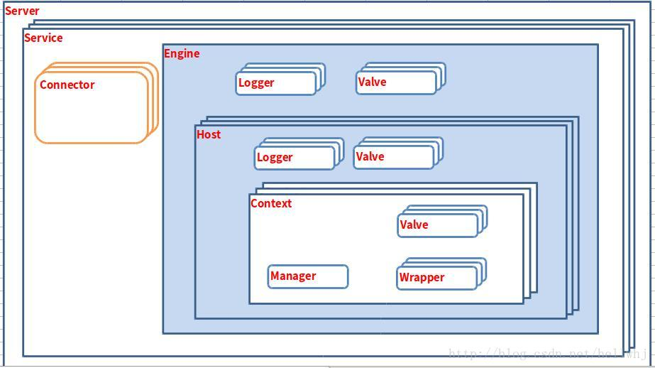
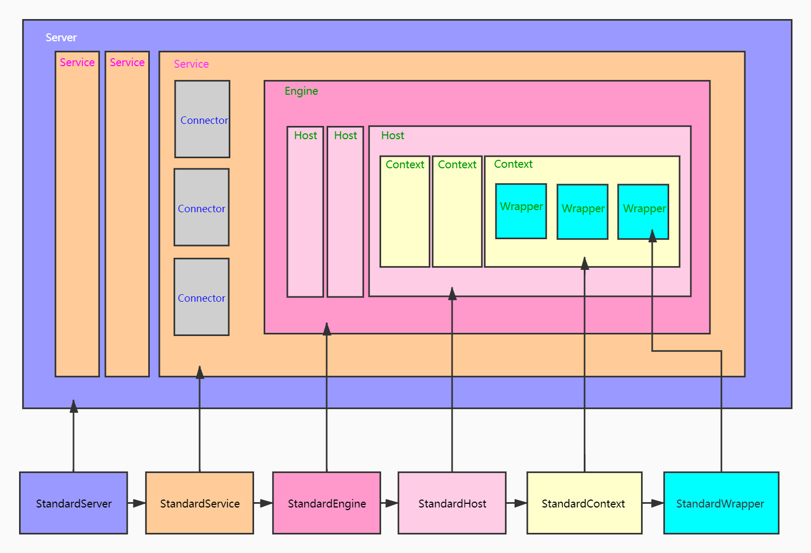
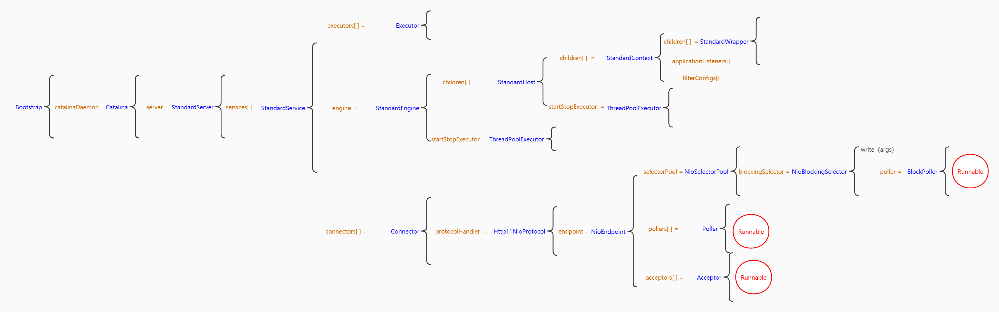
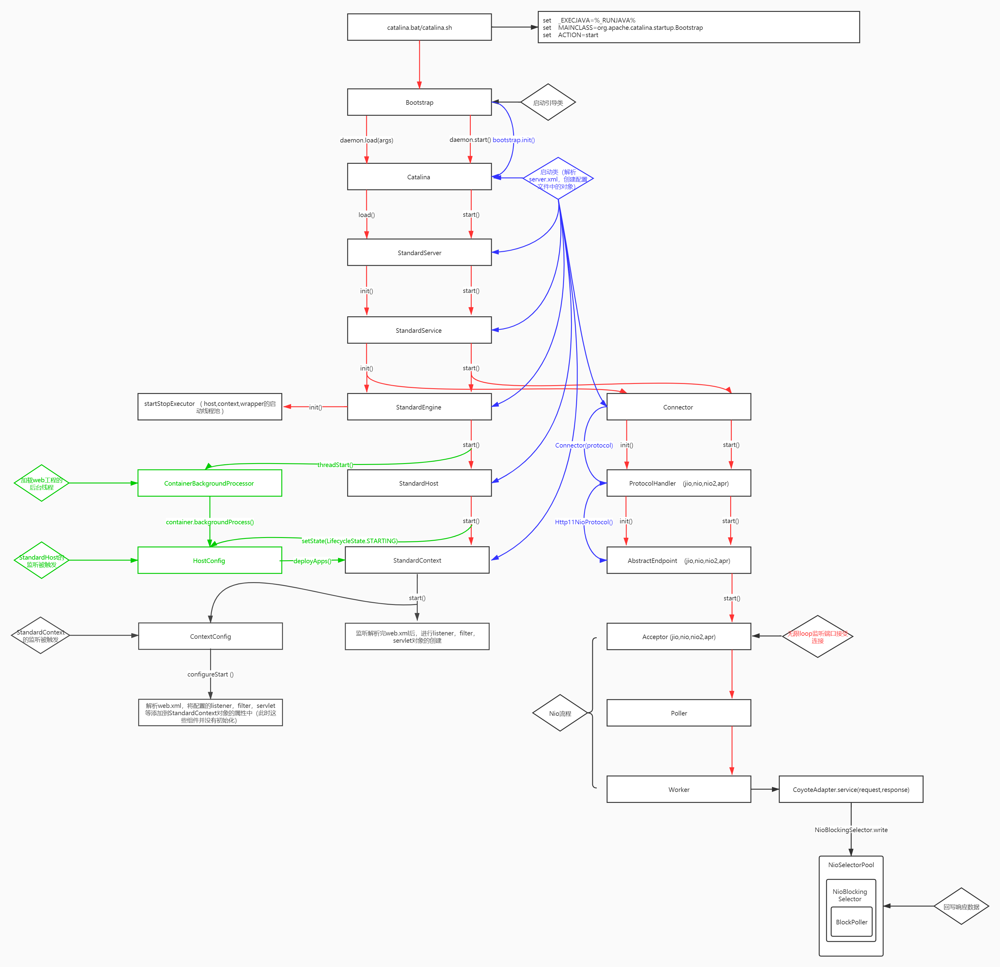

# 2 Tomcat核心组件源码

## 2.1 整体架构

Tomcat有两个功能：

- 对外处理连接，将收到的字节流转化为自己想要的Request和Response对象
- 对内处理Servlet，将对应的Request请求分发到相应的Servlet中

Tomcat分为两大部分，一部分是连接器(Connnector)处理对外连接和容器(Container)管理对内的Servelet。大体的关系图如下：



最外层的大框就是代表一个Tomcat服务，一个Tomcat服务可以对应多个Service。每个Service都有连接器和容器。

这些对应的关系我们也可以打开在Tomcat目录配置文件中 server.xml中看出来。

 ```xml
<Server port="8006" shutdown="SHUTDOWN">  
    <Service name ="Catalina">    
        <Connector port ="8080" protocol="HTTP/1.1" connectionTimeout="20000" redirectPort="8443"/>     
        <Connector port="8010" protocol="AJP/1.3" redirectPort="8443"/>
        <Engine name="Catalina" defaultHost="localhost">
            <Realm className="org.apache.catalina.realm.LockOutRealm">            
                <Realm className="org.apache.catalina.realm.UserDatabaseRealm" resourceName="UserDatabase"/>
            </Realm>          
            <Host name="localhost" appBase="webapps"></Host>
        </Engine>
    </Service>    
</Server>
 ```


## 2.2 Tomcat各组件对应的实现类






## 2.3 Tomcat启动流程

**蓝线部分**是各个组件的初始化，在Catalina对象中创建了server.xml的解析器，一步到位创建出大部分的组件

**红线部分**是责任链模式的启动流程

**绿线部分**是热加载和热部署的过程（war包的解压和web.xml的解析，解析出listener、filter、servlet等）

