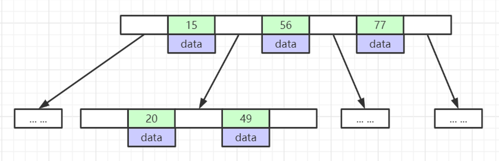
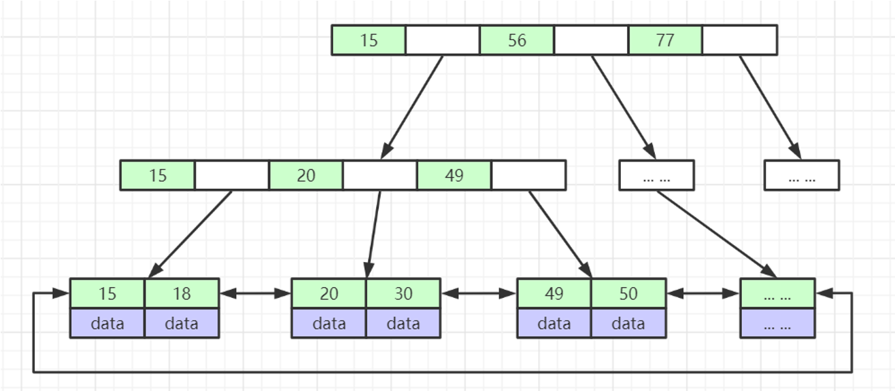
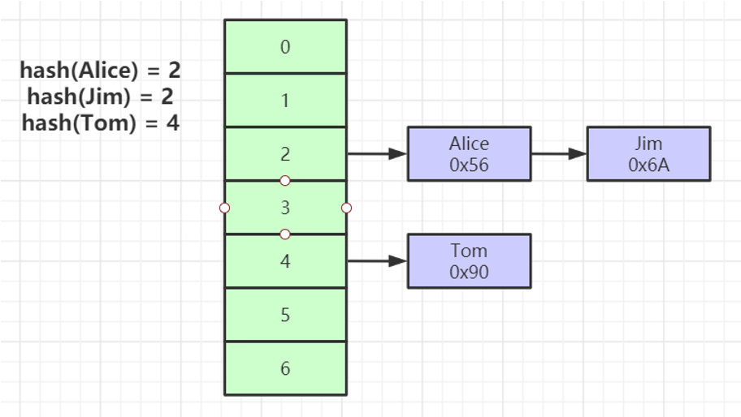
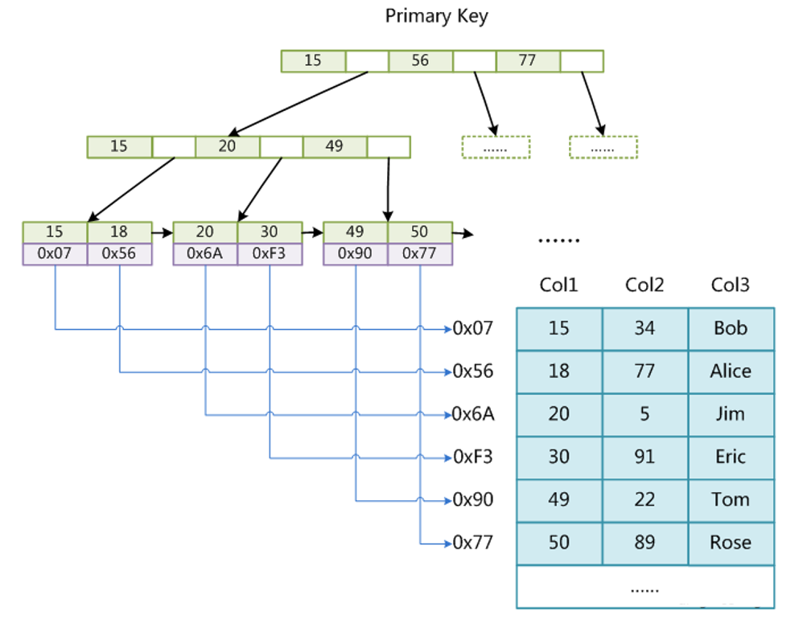
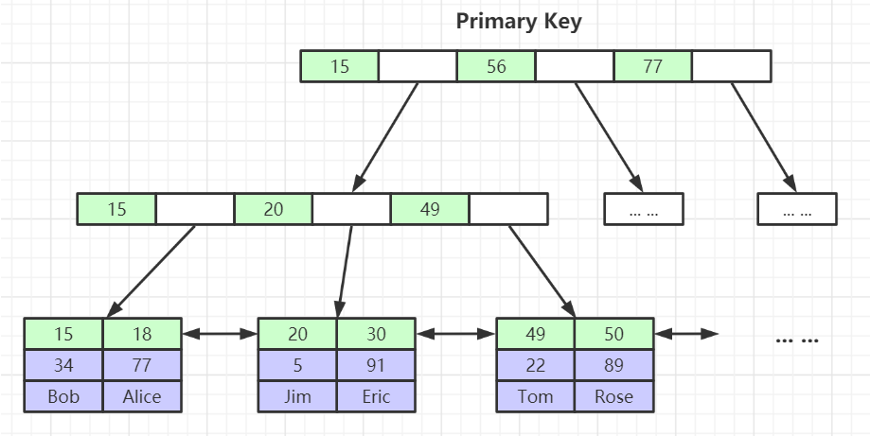
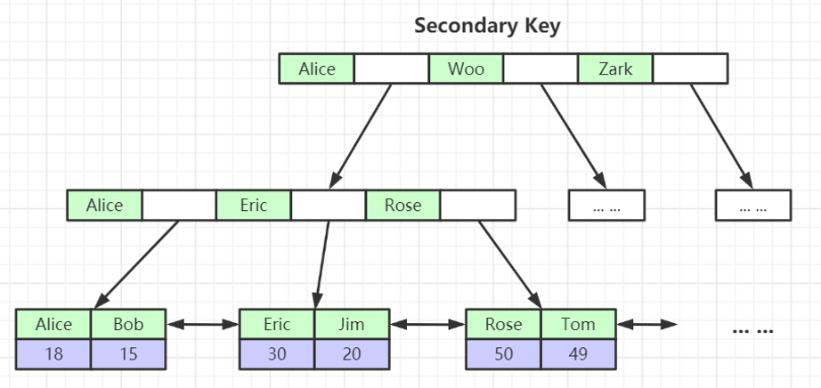
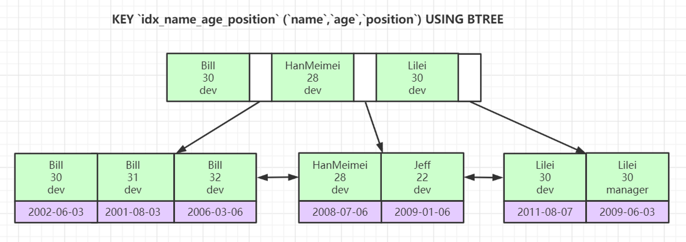

## 3.1 Mysql索引数据结构

索引是帮助MySQL高效获取数据的排好序的数据结构。

### 3.1.1 索引数据结构

- 二叉树

- 红黑树
- Hash表
- B-Tree

可以参考此网站，对数据结构进行了解，[数据结构可视化](https://www.cs.usfca.edu/~galles/visualization/Algorithms.html)

#### 二叉树

二叉树的缺点是当索引递增时，二叉树会变成一个链表，按索引查找时仍旧需要遍历所有索引。

#### 红黑树

红黑树在索引建立时会进行自动平衡，但缺点是层级过多时，当按索引查找时需要进行的大量IO，导致性能下降。

#### B-Tree

叶节点具有相同的深度，叶节点的指针为空

所有索引元素不重复

节点中的数据索引从左到右递增排列

相对于红黑树，B-Tree的层数很少，在查询时进行的IO次数少。



#### B+Tree(B-Tree变种)

非叶子节点不存储data，只存储索引(冗余)，可以放更多的索引

默认根节点为16k，可以在启动时直接载入内存，从而减少查询时的IO次数，而B-Tree因为所有节点都存储数据，不可能将根节点默认载入内存

叶子节点包含所有索引字段

叶子节点用指针连接，提高区间访问的性能（例如进行 `>`、`<` 等查询，可以直接通过指针连接进行遍历，而无需遍历非叶子节点）



#### Hash

对索引的key进行一次hash计算就可以定位出数据存储的位置

很多时候Hash索引要比B+ 树索引更高效

仅能满足 `=`，`IN`，不支持范围查询

hash冲突问题




### 3.2.2 存储引擎

#### MyISAM

MyISAM索引文件和数据文件是分离的(**非聚集索引**)



#### InnoDB存储引擎

InnoDB索引是**聚集索引**，表数据文件本身就是按B+Tree组织的一个索引结构文件，聚集索引-叶节点包含了完整的数据记录。

建议InnoDB表必须建主键，并且推荐使用整型的自增主键，因为非自增的主键在新增数据时，需要对非叶子结点进行调整，会导致更高的性能开销。



非主键索引结构叶子节点存储的是主键值，使用**非聚集索引**，而不是聚集索引，这样可以保证一致性和节省存储空间。



#### 索引最左前缀原理

联合索引的底层存储结构如图，是先按照 `name` 排序，然后按照 `age` 排序，最后按照 `position` 排序建立索引，所以当一个查询是未使用 `name`，而直接使用 `age` 或 `position` 进行查询时，是无法使用该索引的。

例如：

```sql
-- 可以使用索引
select * from users where name='Bill' and age>30

-- 无法使用索引，因为未使用name
select * from users where age>30 and title='dev'

-- 无法使用索引，因为未使用name和age
select * from users where title='dev'
```


