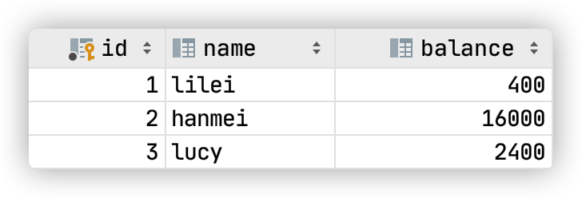
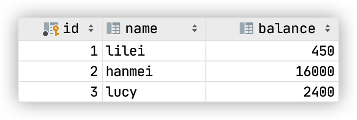
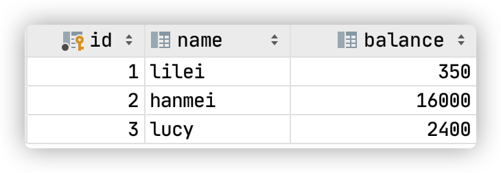
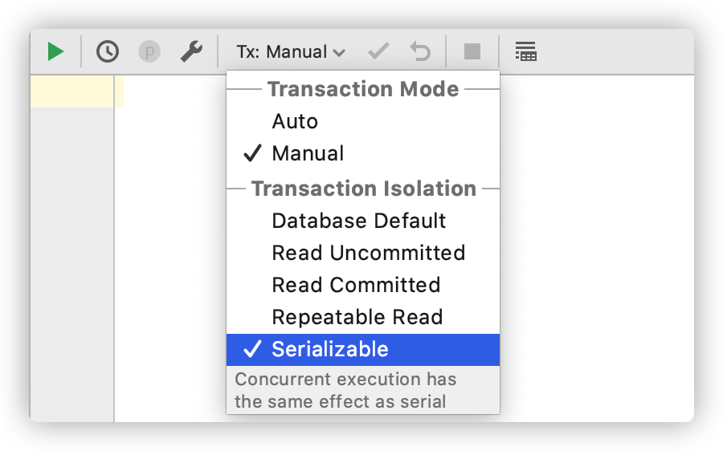
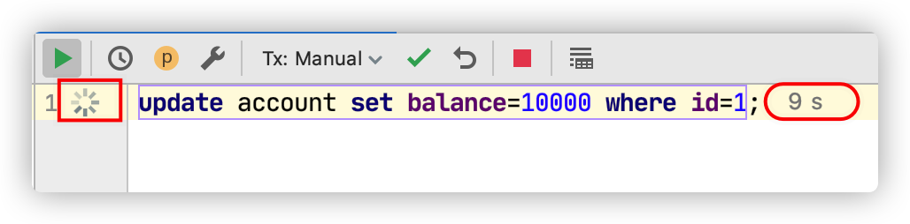

# 6 Mysql锁与事务隔离级别

## 6.1 概述

我们的数据库一般都会并发执行多个事务，多个事务可能会并发的对相同的一批数据进行增删改查操作，可能就会导致我们说的脏写、脏读、不可重复读、幻读这些问题。

这些问题的本质都是数据库的多事务并发问题，为了解决多事务并发问题，数据库设计了事务隔离机制、锁机制、MVCC多版本并发控制隔离机制，用一整套机制来解决多事务并发问题。


## 6.2 事务及其ACID属性

事务是由一组SQL语句组成的逻辑处理单元,事务具有以下4个属性,通常简称为事务的ACID属性。

- 原子性(Atomicity) ：事务是一个原子操作单元,其对数据的修改,要么全都执行,要么全都不执行。

- 一致性(Consistent) ：在事务开始和完成时,数据都必须保持一致状态。这意味着所有相关的数据规 则都必须应用于事务的修改,以保持数据的完整性。 
- 隔离性(Isolation) ：数据库系统提供一定的隔离机制,保证事务在不受外部并发操作影响的“独 立”环境执行。这意味着事务处理过程中的中间状态对外部是不可见的,反之亦然。
- 持久性(Durable) ：事务完成之后,它对于数据的修改是永久性的,即使出现系统故障也能够保持。

### 并发事务处理带来的问题

##### 更新丢失(Lost Update)或脏写

当两个或多个事务选择同一行，然后基于最初选定的值更新该行时，由于每个事务都不知道其他事务的存 在，就会发生丢失更新问题–最后的更新覆盖了由其他事务所做的更新。

##### 脏读（Dirty Reads）

一个事务正在对一条记录做修改，在这个事务完成并提交前，这条记录的数据就处于不一致的状态；这时，另一个事务也来读取同一条记录，如果不加控制，第二个事务读取了这些“脏”数据，并据此作进一步的 处理，就会产生未提交的数据依赖关系。这种现象被形象的叫做“脏读”。

一句话：事务A读取到了事务B已经修改但尚未提交的数据，还在这个数据基础上做了操作。此时，如果B事务回滚，A读取的数据无效，不符合一致性要求。

##### 不可重读（Non-Repeatable Reads）

一个事务在读取某些数据后的某个时间，再次读取以前读过的数据，却发现其读出的数据已经发生了改变、或某些记录已经被删除了，这种现象就叫做“不可重复读”。

一句话：事务A内部的相同查询语句在不同时刻读出的结果不一致，不符合隔离性

##### 幻读（Phantom Reads）

一个事务按相同的查询条件重新读取以前检索过的数据，却发现其他事务插入了满足其查询条件的新数据，这种现象就称为“幻读”。

一句话：事务A读取到了事务B提交的新增数据，不符合隔离性

### 事务隔离级别

“脏读”、“不可重复读”和“幻读”,其实都是数据库读一致性问题,必须由数据库提供一定的事务隔离机制 来解决。

| 隔离级别                     | 脏读（Dirty Read） | 不可重复读（NonRepeatable Read） | 幻读（Phantom Read） |
| ---------------------------- | ------------------ | -------------------------------- | -------------------- |
| 读未提交（Read uncommitted） | 可能               | 可能                             | 可能                 |
| 读已提交（Read committed）   | 不可能             | 可能                             | 可能                 |
| 可重复读（Repeatable read）  | 不可能             | 不可能                           | 可能                 |
| 可串行化（Serializable）     | 不可能             | 不可能                           | 不可能               |

数据库的事务隔离越严格,并发副作用越小,但付出的代价也就越大,因为事务隔离实质上就是使事务在一定程度 上“串行化”进行,这显然与“并发”是矛盾的。

同时,不同的应用对读一致性和事务隔离程度的要求也是不同的,比如许多应用对“不可重复读"和“幻读”并不 敏感,可能更关心数据并发访问的能力。

常看当前数据库的事务隔离级别

```sql
show variables like 'tx_isolation';
```

设置事务隔离级别

```sql
set tx_isolation='REPEATABLE-READ';
```

Mysql默认的事务隔离级别是可重复读，用Spring开发程序时，如果不设置隔离级别默认用Mysql设置的隔离级别，如果Spring设置了就用已经设置的隔离级别


## 6.3 锁详解

锁是计算机协调多个进程或线程并发访问某一资源的机制。 在数据库中，除了传统的计算资源（如CPU、RAM、I/O等）的争用以外，数据也是一种供需要用户共享的资 源。如何保证数据并发访问的一致性、有效性是所有数据库必须解决的一个问题，锁冲突也是影响数据库并发 访问性能的一个重要因素。

### 锁分类

- 从性能上分为**乐观锁**(用版本对比来实现)和**悲观锁**
- 从对数据库操作的类型分，分为**读锁**和**写锁**(都属于悲观锁) 
  - 读锁（共享锁，**S锁**(Shared)）：针对同一份数据，多个读操作可以同时进行而不会互相影响
  - 写锁（排它锁，**X锁**(eXclusive)）：当前写操作没有完成前，它会阻断其他写锁和读锁
- 从对数据操作的粒度分，分为**表锁**和**行锁**

#### 表锁

每次操作锁住整张表。开销小，加锁快；不会出现死锁；锁定粒度大，发生锁冲突的概率最高，并发度最低； 一般用在整表数据迁移的场景。 基本操作

```sql
-- 建表SQL
CREATE TABLE `mylock` (
`id` INT (11) NOT NULL AUTO_INCREMENT,
`NAME` VARCHAR (20) DEFAULT NULL,
PRIMARY KEY (`id`)
) ENGINE=MyISAM DEFAULT CHARSET = utf8;

-- 插入数据
INSERT INTO`tyrival`.`mylock` (`id`, `NAME`) VALUES ('1', 'a');
INSERT INTO`tyrival`.`mylock` (`id`, `NAME`) VALUES ('2', 'b');
INSERT INTO`tyrival`.`mylock` (`id`, `NAME`) VALUES ('3', 'c');
INSERT INTO`tyrival`.`mylock` (`id`, `NAME`) VALUES ('4', 'd');
```

##### 手动增加表锁

```sqlite
lock table 表名称 read(write),表名称2 read(write);
```

##### 查看表上加过的锁

```sql
show open tables;
```

##### 删除表锁

```sql
unlock tables;
```

#### 案例分析

##### 加读锁

当前session和其他session都可以读该表；当前session中插入或者更新锁定的表都会报错，其他session插入或更新则会等待。

##### 加写锁

当前session对该表的增删改查都没有问题，其他session对该表的所有操作被阻塞。

> **案例结论**
>
> 1. 对MyISAM表的读操作(加读锁) ，不会阻塞其他进程对同一表的读请求，但会阻塞对同一表的写请求。只有当读锁释放后，才会执行其它进程的写操作。 
> 2. 对MylSAM表的写操作(加写锁) ，会阻塞其他进程对同一表的读和写操作，只有当写锁释放后，才会执行其它进程的读写操作。

#### 行锁

每次操作锁住一行数据。开销大，加锁慢；会出现死锁；锁定粒度最小，发生锁冲突的概率最低，并发度最高。 InnoDB与MYISAM的最大不同有两点：

- InnoDB支持事务（TRANSACTION）
- InnoDB支持行级锁

##### 行锁演示 

一个session开启事务更新不提交，另一个session更新同一条记录会阻塞，更新不同记录不会阻塞

> **总结**
>
> MyISAM在执行查询语句SELECT前，会自动给涉及的所有表加读锁，在执行update、insert、delete操作会自动给涉及的表加写锁。 
>
> InnoDB在执行查询语句SELECT时，因为有mvcc机制不会加锁。但是update、insert、delete操作会加行 锁。
>
> 简而言之，就是**读锁会阻塞写，但是不会阻塞读。而写锁则会把读和写都阻塞。**


### 行锁与事务隔离级别案例分析

```sql
CREATE TABLE `account` (
  `id` int(11) NOT NULL AUTO_INCREMENT,
  `name` varchar(255) DEFAULT NULL,
  `balance` int(11) DEFAULT NULL,
PRIMARY KEY (`id`)
) ENGINE=InnoDB DEFAULT CHARSET=utf8;

INSERT INTO `tyrival`.`account` (`name`, `balance`) VALUES ('lilei', '450');
INSERT INTO `tyrival`.`account` (`name`, `balance`) VALUES ('hanmei', '16000');
INSERT INTO `tyrival`.`account` (`name`, `balance`) VALUES ('lucy', '2400');
```

##### 读未提交：

1. 打开一个客户端A，并设置当前事务模式为read uncommitted（读未提交）

```sql
set tx_isolation='read-uncommitted';
```


查询表account的初始值

```sql
select * from account;
```


2. 在客户端A的事务提交之前，打开另一个客户端B，更新表account，但不提交事务

```sql
update account set balance=balance-50 where id=1;
```


3. 这时，虽然客户端B的事务还没提交，但是客户端A就可以查询到B已经更新的数据



4. 一旦客户端B的事务因为某种原因回滚，所有的操作都将会被撤销，那客户端A查询到的数据其实就是脏数据

```sql
rollback;
select * from account;
```


5. 在客户端A执行更新语句

```sql
update account set balance = balance-50 where id=1
```

发现lilei的balance没有变成350，而是正确的值400，说明如果在数据库层面使用 `balance=balance-50` 进行update，是可以避免脏读问题的，但是很多时候我们经常将数据获取到Java代码中，计算完成后update进数据库，此时脏读问题就会造成数据错误，要想解决这个问题可以采用读已提交的隔离级别。


##### 读已提交

1. 打开一个客户端A，并设置当前事务模式为read committed（未提交读），查询表account的所有记录：

```sql
set tx_isolation='read-committed';
```


2. 在客户端A的事务提交之前，打开另一个客户端B，更新表account，但不提交

```sql
update account set balance = balance-50 where id=1;
```

3.  这时，客户端B的事务还没提交，客户端A不能查询到B已经更新的数据，解决了脏读问题 　　　　



4. 客户端B的事务提交

```sql
commit;
```

5. 客户端A执行与上一步相同的查询，结果 与上一步不一致，即产生了不可重复读的问题


##### 可重复读

1. 打开一个客户端A，并设置当前事务模式为repeatable read，查询表account的所有记录

```sql
set tx_isolation='repeatable-read';
```


2. 在客户端A的事务提交之前，打开另一个客户端B，更新表account并提交

```sql
update account set balance = balance-50 where id=1;
commit;
```



3. 在客户端A查询表account的所有记录，与步骤（1）查询结果一致，没有出现不可重复读的问题


4. 在客户端A，接着执行

```sql
update account set balance=balance-50 where id=1;
```

balance没有变成400-50=350，而是用步骤2中的350来算的，所以是300。数据的一致性倒是没有被破坏。可重复读的隔离级别下使用了**MVCC(multi-version concurrency control)机制**，select操作不会更新版本号，是快照读（历史版本）；insert、update和delete会更新版本号，是当前读（当前版本）。 


5. 重新打开客户端B，插入一条新数据后提交

```sql
insert into account values(4, 'lily', 700);
commit;
```


6. 在客户端A查询表account的所有记录，没有查出新增数据，所以没有出现幻读


7. 验证幻读，在客户端A执行以下SQL，发现能更新成功

```sql
update account set balance=888 where id=4;
commit;
```

再次查询能查到客户端B新的数据。


##### 串行化

1. 打开一个客户端A，并设置当前事务模式为serializable

```sql
set tx_isolation='serializable';
```



查询表account的初始值，不提交

```sql
select * from account where id=1;
```

2. 打开一个客户端B，并设置当前事务模式为serializable，更新相同的id为1的记录会被阻塞等待

```sql
update account set balance=10000 where id=1;
```



更新id为2的记录可以成功，说明在串行模式下innodb的查询也会被加上行锁。

```sql
update account set balance=10000 where id=2;
```


如果客户端A执行的是一个范围查询，那么**该范围内的所有行包括每行记录所在的间隙区间范围**(就算该行数据还未被插入也会加锁，这种是间隙锁)**都会被加锁**。此时如果客户端B在该范围内插入数据都会被阻塞，所以就避免了幻读。

> 串行化这种隔离级别并发性极低，开发中很少会用到。


#### 间隙锁(Gap Lock)

间隙锁，锁的就是两个值之间的空隙。Mysql默认级别是**repeatable-read**，**间隙锁在某些情况下可以解决幻读问题**。

假设account表里数据如下： 


那么间隙就有 id 为 (3,10)，(10,20)，(20,正无穷) 这三个区间， 在Session_1下面执行

```sql
-- 锁 (3,10] (10-20]
update account set nam ='tyrival' where id>8 and id<18;

-- 锁 (3,10] (10-20] (20, 正无穷]
update account set name='tyrival' where id>8 and id<25;
```

则其他Session没法在这个**范围所包含的所有行记录，以及这些行所在的间隙**里插入或修改任何数据，即id在(3,20]区间都无法修改数据，注意最后那个20也是包含在内的。 **间隙锁是在可重复读隔离级别下才会生效。**


#### 临键锁（Next-key Locks）

Next-Key Locks是行锁与间隙锁的组合。上面例子中的 (3,20] 这整个区间就叫做临键锁。


#### 无索引行锁会升级为表锁

锁主要是加在索引上，如果对非索引字段更新，行锁可能会变表锁。session1 执行

```sql
update account set balance=800 where name='lilei';
```

session2 对该表任一行操作都会阻塞住。

> **注意**
>
> InnoDB的行锁是针对索引加的锁，不是针对记录加的锁。并且该索引不能失效，否则都会从行锁升级为表锁。

锁定某一行还可以用lock in share mode(共享锁) 和for update(排它锁)，例如：

```sql
select * from test_innodb_lock where a=2 for update;
```

这样其他session只能读这行数据，修改则会被阻塞，直到锁定行的session提交。

> **结论**
>
> Innodb存储引擎由于实现了行级锁定，虽然在锁定机制的实现方面所带来的性能损耗，可能比表级锁定会要更高，但是在整体并发处理能力方面，要远远优于MYISAM的表级锁定。当系统并发量高的时候，Innodb的整体性能和MYISAM相比就会有比较明显的优势了。 
>
> 但是，Innodb的行级锁定同样也有其脆弱的一面，使用不当的时候，可能会让Innodb的整体性能表现不仅不能比MYISAM高，甚至可能会更差。


#### 行锁分析

通过检查InnoDB_row_lock状态变量来分析系统上的行锁的争夺情况

```sql
show status like 'innodb_row_lock%';
```

对各个状态量的说明如下： 

`Innodb_row_lock_current_waits` : 当前正在等待锁定的数量

`Innodb_row_lock_time` : 从系统启动到现在锁定总时间长度

`Innodb_row_lock_time_avg` : 每次等待所花平均时间

`Innodb_row_lock_time_max` ：从系统启动到现在等待最长的一次所花时间

`Innodb_row_lock_waits` :系统启动后到现在总共等待的次数

对于这5个状态变量，比较重要的主要是： 

`Innodb_row_lock_time_avg` （等待平均时长）

`Innodb_row_lock_waits` （等待总次数）

`Innodb_row_lock_time`（等待总时长）

尤其是当等待次数很高，而且每次等待时长也不小的时候，我们就需要分析系统中为什么会有如此多的等待， 然后根据分析结果着手制定优化计划。

##### 查看INFORMATION_SCHEMA系统库锁相关数据表

```sql
-- 查看事务
select * from INFORMATION_SCHEMA.INNODB_TRX;
-- 查看锁
select * from INFORMATION_SCHEMA.INNODB_LOCKS;
-- 查看锁等待
select * from INFORMATION_SCHEMA.INNODB_LOCK_WAITS;
-- 释放锁，trx_mysql_thread_id 可以从 INNODB_TRX 表中查询
kill trx_mysql_thread_id;
```


#### 死锁

```sql
set tx_isolation='repeatable-read';
```

Session_1执行

```sql
select * from account where id=1 for update; 
```

Session_2执行

```sql
select * from account where id=2 for update; 
```

Session_1执行

```sql
select * from account where id=2 for update;
```

Session_2执行

```sql
select * from account where id=1 for update; 
```

查看近期死锁日志信息

```sql
show engine innodb status; 
```

大多数情况mysql可以自动检测死锁并回滚产生死锁的那个事务，但是有些情况mysql没法自动检测死锁


### 锁优化建议

- 尽可能让所有数据检索都通过索引来完成，避免无索引行锁升级为表锁

- 合理设计索引，尽量缩小锁的范围尽可能减少检索条件范围，避免间隙锁

- 尽量控制事务大小，减少锁定资源量和时间长度，涉及事务加锁的sql尽量放在事务最后执行

- 尽可能低级别事务隔离