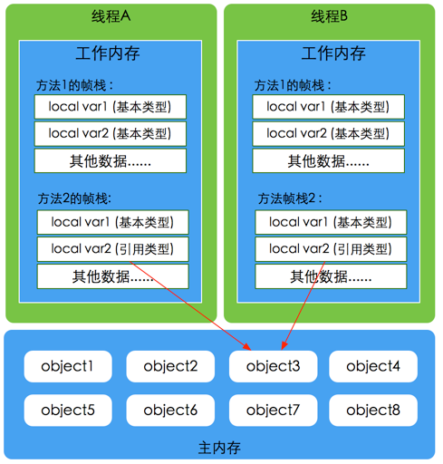

# 2. 并发编程之JMM三大特性详解

## 2.1 JMM模型

Java内存模型(Java Memory Model简称JMM)是一种抽象的概念，并不真实存在，它描述的是一组规则或规范，通过这组规范定义了程序中各个变量（包括实例字段，静态字段和构成数组对象的元素）的访问方式。JVM运行程序的实体是线程，而每个线程创建时JVM都会为其创建一个工作内存(有些地方称为栈空间)，用于存储线程私有的数据，而Java内存模型中规定所有变量都存储在主内存，主内存是共享内存区域，所有线程都可以访问，但线程对变量的操作(读取赋值等)必须在工作内存中进行，首先要将变量从主内存拷贝的自己的工作内存空间，然后对变量进行操作，操作完成后再将变量写回主内存，不能直接操作主内存中的变量，工作内存中存储着主内存中的变量副本拷贝，前面说过，工作内存是每个线程的私有数据区域，因此不同的线程间无法访问对方的工作内存，线程间的通信(传值)必须通过主内存来完成。

### JMM不同于JVM内存区域模型

 JMM与JVM内存区域的划分是不同的概念层次，更恰当说JMM描述的是一组规则，通过这组规则控制程序中各个变量在共享数据区域和私有数据区域的访问方式，**JMM是围绕原子性，有序性、可见性展开**。JMM与Java内存区域唯一相似点，都存在共享数据区域和私有数据区域，在JMM中主内存属于共享数据区域，从某个程度上讲应该包括了堆和方法区，而工作内存数据线程私有数据区域，从某个程度上讲则应该包括程序计数器、虚拟机栈以及本地方法栈。  

线程，工作内存，主内存工作交互图（基于JMM规范）：


#### 主内存

主要存储的是Java实例对象，所有线程创建的实例对象都存放在主内存中，不管该**实例对象是成员变量还是方法中的本地变量(也称局部变量)**，当然也包括了共享的类信息、常量、静态变量。由于是共享数据区域，多条线程对同一个变量进行访问可能会发生线程安全问题。

#### 工作内存

主要存储当前方法的所有本地变量信息(工作内存中存储着主内存中的变量副本拷贝)，每个线程只能访问自己的工作内存，即线程中的本地变量对其它线程是不可见的，就算是两个线程执行的是同一段代码，它们也会各自在自己的工作内存中创建属于当前线程的本地变量，当然也包括了字节码行号指示器、相关Native方法的信息。注意由于工作内存是每个线程的私有数据，线程间无法相互访问工作内存，因此存储在工作内存的数据不存在线程安全问题。

根据JVM虚拟机规范主内存与工作内存的数据存储类型以及操作方式，对于一个实例对象中的成员方法而言，如果方法中包含本地变量是基本数据类型（boolean,byte,short,char,int,long,float,double），将直接存储在工作内存的帧栈结构中，但倘若本地变量是引用类型，那么该变量的引用会存储在功能内存的帧栈中，而对象实例将存储在主内存(共享数据区域，堆)中。但对于实例对象的成员变量，不管它是基本数据类型或者包装类型(Integer、Double等)还是引用类型，都会被存储到堆区。至于static变量以及类本身相关信息将会存储在主内存中。需要注意的是，在主内存中的实例对象可以被多线程共享，倘若两个线程同时调用了同一个对象的同一个方法，那么两条线程会将要操作的数据拷贝一份到自己的工作内存中，执行完成操作后才刷新到主内存

模型如下图所示



#### Java内存模型与硬件内存架构的关系

通过对前面的硬件内存架构、Java内存模型以及Java多线程的实现原理的了解，我们应该已经意识到，多线程的执行最终都会映射到硬件处理器上进行执行，但Java内存模型和硬件内存架构并不完全一致。对于硬件内存来说只有寄存器、缓存内存、主内存的概念，并没有工作内存(线程私有数据区域)和主内存(堆内存)之分，也就是说Java内存模型对内存的划分对硬件内存并没有任何影响，因为JMM只是一种抽象的概念，是一组规则，并不实际存在，不管是工作内存的数据还是主内存的数据，对于计算机硬件来说都会存储在计算机主内存中，当然也有可能存储到CPU缓存或者寄存器中，因此总体上来说，Java内存模型和计算机硬件内存架构是一个相互交叉的关系，是一种抽象概念划分与真实物理硬件的交叉。(注意对于Java内存区域划分也是同样的道理)


### JMM存在的必要性

在明白了Java内存区域划分、硬件内存架构、Java多线程的实现原理与Java内存模型的具体关系后，接着来谈谈Java内存模型存在的必要性。由于JVM运行程序的实体是线程，而每个线程创建时JVM都会为其创建一个工作内存(有些地方称为栈空间)，用于存储线程私有的数据，线程与主内存中的变量操作必须通过工作内存间接完成，主要过程是将变量从主内存拷贝的每个线程各自的工作内存空间，然后对变量进行操作，操作完成后再将变量写回主内存，如果存在两个线程同时对一个主内存中的实例对象的变量进行操作就有可能诱发线程安全问题。

假设主内存中存在一个共享变量x，现在有A和B两条线程分别对该变量x=1进行操作，A/B线程各自的工作内存中存在共享变量副本x。假设现在A线程想要修改x的值为2，而B线程却想要读取x的值，那么B线程读取到的值是A线程更新后的值2还是更新前的值1呢？答案是，不确定，即B线程有可能读取到A线程更新前的值1，也有可能读取到A线程更新后的值2，这是因为工作内存是每个线程私有的数据区域，而线程A变量x时，首先是将变量从主内存拷贝到A线程的工作内存中，然后对变量进行操作，操作完成后再将变量x写回主内，而对于B线程的也是类似的，这样就有可能造成主内存与工作内存间数据存在一致性问题，假如A线程修改完后正在将数据写回主内存，而B线程此时正在读取主内存，即将x=1拷贝到自己的工作内存中，这样B线程读取到的值就是x=1，但如果A线程已将x=2写回主内存后，B线程才开始读取的话，那么此时B线程读取到的就是x=2，但到底是哪种情况先发生呢？

如以下示例图所示案例：


​    

以上关于主内存与工作内存之间的具体交互协议，即一个变量如何从主内存拷贝到工作内存、如何从工作内存同步到主内存之间的实现细节，Java内存模型定义了以下八种操作来完成。

### 数据同步八大原子操作

1. **lock(锁定)**：作用于主内存的变量，把一个变量标记为一条线程独占状态

2. **unlock(解锁)**：作用于主内存的变量，把一个处于锁定状态的变量释放出来，释放后的变量才可以被其他线程锁定

3. **read(读取)**：作用于主内存的变量，把一个变量值从主内存传输到线程的工作内存中，以便随后的load动作使用

4. **load(载入)**：作用于工作内存的变量，它把read操作从主内存中得到的变量值放入工作内存的变量副本中

5. **use(使用)**：作用于工作内存的变量，把工作内存中的一个变量值传递给执行引擎

6. **assign(赋值)**：作用于工作内存的变量，它把一个从执行引擎接收到的值赋给工作内存的变量

7. **store(存储)**：作用于工作内存的变量，把工作内存中的一个变量的值传送到主内存中，以便随后的write的操作

8. **write(写入)**：作用于工作内存的变量，它把store操作从工作内存中的一个变量的值传送到主内存的变量中

如果要把一个变量从主内存中复制到工作内存中，就需要按顺序地执行read和load操作，如果把变量从工作内存中同步到主内存中，就需要按顺序地执行store和write操作。但Java内存模型只要求上述操作必须按顺序执行，而没有保证必须是连续执行。


#### 同步规则分析

1. 不允许一个线程无原因地（没有发生过任何assign操作）把数据从工作内存同步回主内存中

2. 一个新的变量只能在主内存中诞生，不允许在工作内存中直接使用一个未被初始化（load或者assign）的变量。即就是对一个变量实施use和store操作之前，必须先自行assign和load操作。

3. 一个变量在同一时刻只允许一条线程对其进行lock操作，但lock操作可以被同一线程重复执行多次，多次执行lock后，只有执行相同次数的unlock操作，变量才会被解锁。lock和unlock必须成对出现。

4. 如果对一个变量执行lock操作，将会清空工作内存中此变量的值，在执行引擎使用这个变量之前需要重新执行load或assign操作初始化变量的值。

5. 如果一个变量事先没有被lock操作锁定，则不允许对它执行unlock操作；也不允许去unlock一个被其他线程锁定的变量。

6. 对一个变量执行unlock操作之前，必须先把此变量同步到主内存中（执行store和write操作）

### 并发编程的可见性，原子性与有序性问题

#### 原子性

原子性指的是一个操作是不可中断的，即使是在多线程环境下，一个操作一旦开始就不会被其他线程影响。

在java中，对基本数据类型的变量的读取和赋值操作是原子性操作有点要注意的是，对于32位系统的来说，long类型数据和double类型数据(对于基本数据类型，byte,short,int,float,boolean,char读写是原子操作)，它们的读写并非原子性的，也就是说如果存在两条线程同时对long类型或者double类型的数据进行读写是存在相互干扰的，因为对于32位虚拟机来说，每次原子读写是32位的，而long和double则是64位的存储单元，这样会导致一个线程在写时，操作完前32位的原子操作后，轮到B线程读取时，恰好只读取到了后32位的数据，这样可能会读取到一个既非原值又不是线程修改值的变量，它可能是“半个变量”的数值，即64位数据被两个线程分成了两次读取。但也不必太担心，因为读取到“半个变量”的情况比较少见，至少在目前的商用的虚拟机中，几乎都把64位的数据的读写操作作为原子操作来执行，因此对于这个问题不必太在意，知道这么回事即可。

```java
X = 10;		// 原子性（简单的读取、将数字赋值给变量）
Y = x;  	// 变量之间的相互赋值，不是原子操作
X++;			// 对变量进行计算操作
X = x + 1;
```

####  可见性

理解了指令重排现象后，可见性容易了，可见性指的是当一个线程修改了某个共享变量的值，其他线程是否能够马上得知这个修改的值。对于串行程序来说，可见性是不存在的，因为我们在任何一个操作中修改了某个变量的值，后续的操作中都能读取这个变量值，并且是修改过的新值。

但在多线程环境中可就不一定了，前面我们分析过，由于线程对共享变量的操作都是线程拷贝到各自的工作内存进行操作后才写回到主内存中的，这就可能存在一个线程A修改了共享变量x的值，还未写回主内存时，另外一个线程B又对主内存中同一个共享变量x进行操作，但此时A线程工作内存中共享变量x对线程B来说并不可见，这种工作内存与主内存同步延迟现象就造成了可见性问题，另外指令重排以及编译器优化也可能导致可见性问题，通过前面的分析，我们知道无论是编译器优化还是处理器优化的重排现象，在多线程环境下，确实会导致程序轮序执行的问题，从而也就导致可见性问题。

#### 有序性

有序性是指对于单线程的执行代码，我们总是认为代码的执行是按顺序依次执行的，这样的理解并没有毛病，毕竟对于单线程而言确实如此，但对于多线程环境，则可能出现乱序现象，因为程序编译成机器码指令后可能会出现指令重排现象，重排后的指令与原指令的顺序未必一致，要明白的是，在Java程序中，倘若在本线程内，所有操作都视为有序行为，如果是多线程环境下，一个线程中观察另外一个线程，所有操作都是无序的，前半句指的是单线程内保证串行语义执行的一致性，后半句则指指令重排现象和工作内存与主内存同步延迟现象。

### JMM如何解决原子性&可见性&有序性问题

#### 原子性问题

除了JVM自身提供的对基本数据类型读写操作的原子性外，可以通过 synchronized和Lock实现原子性。因为synchronized和Lock能够保证任一时刻只有一个线程访问该代码块。

#### 可见性问题

volatile关键字保证可见性。当一个共享变量被volatile修饰时，它会保证修改的值立即被其他的线程看到，即修改的值立即更新到主存中，当其他线程需要读取时，它会去内存中读取新值。synchronized和Lock也可以保证可见性，因为它们可以保证任一时刻只有一个线程能访问共享资源，并在其释放锁之前将修改的变量刷新到内存中。

#### 有序性问题

在Java里面，可以通过volatile关键字来保证一定的“有序性”（具体原理在下一节讲述volatile关键字）。另外可以通过synchronized和Lock来保证有序性，很显然，synchronized和Lock保证每个时刻是有一个线程执行同步代码，相当于是让线程顺序执行同步代码，自然就保证了有序性。

###### Java内存模型

每个线程都有自己的工作内存（类似于前面的高速缓存）。线程对变量的所有操作都必须在工作内存中进行，而不能直接对主存进行操作。并且每个线程不能访问其他线程的工作内存。Java内存模型具备一些先天的“有序性”，即不需要通过任何手段就能够得到保证的有序性，这个通常也称为happens-before 原则。如果两个操作的执行次序无法从happens-before原则推导出来，那么它们就不能保证它们的有序性，虚拟机可以随意地对它们进行重排序。

###### 指令重排序

java语言规范规定JVM线程内部维持顺序化语义。即只要程序的最终结果与它顺序化情况的结果相等，那么指令的执行顺序可以与代码顺序不一致，此过程叫指令的重排序。指令重排序的意义是什么？JVM能根据处理器特性（CPU多级缓存系统、多核处理器等）适当的对机器指令进行重排序，使机器指令能更符合CPU的执行特性，最大限度的发挥机器性能。

下图为从源码到最终执行的指令序列示意图：


#### as-if-serial语义

as-if-serial语义的意思是：不管怎么重排序（编译器和处理器为了提高并行度），（单线程）程序的执行结果不能被改变。编译器、runtime和处理器都必须遵守as-if-serial语义。

为了遵守as-if-serial语义，编译器和处理器不会对存在数据依赖关系的操作做重排序，因为这种重排序会改变执行结果。但是，如果操作之间不存在数据依赖关系，这些操作就可能被编译器和处理器重排序。

#### happens-before原则

只靠sychronized和volatile关键字来保证原子性、可见性以及有序性，那么编写并发程序可能会显得十分麻烦，幸运的是，从JDK 5开始，Java使用新的JSR-133内存模型，提供了happens-before 原则来辅助保证程序执行的原子性、可见性以及有序性的问题，它是判断数据是否存在竞争、线程是否安全的依据，happens-before 原则内容如下

1. 程序顺序原则，即在一个线程内必须保证语义串行性，也就是说按照代码顺序执行。
2. 锁规则 解锁(unlock)操作必然发生在后续的同一个锁的加锁(lock)之前，也就是说，如果对于一个锁解锁后，再加锁，那么加锁的动作必须在解锁动作之后(同一个锁)。
3. volatile规则 volatile变量的写，先发生于读，这保证了volatile变量的可见性，简单的理解就是，volatile变量在每次被线程访问时，都强迫从主内存中读该变量的值，而当该变量发生变化时，又会强迫将最新的值刷新到主内存，任何时刻，不同的线程总是能够看到该变量的最新值。
4. 线程启动规则 线程的start()方法先于它的每一个动作，即如果线程A在执行线程B的start方法之前修改了共享变量的值，那么当线程B执行start方法时，线程A对共享变量的修改对线程B可见
5. 传递性 A先于B ，B先于C 那么A必然先于C
6. 线程终止规则 线程的所有操作先于线程的终结，Thread.join()方法的作用是等待当前执行的线程终止。假设在线程B终止之前，修改了共享变量，线程A从线程B的join方法成功返回后，线程B对共享变量的修改将对线程A可见。
7. 线程中断规则 对线程 interrupt()方法的调用先行发生于被中断线程的代码检测到中断事件的发生，可以通过Thread.interrupted()方法检测线程是否中断。
8. 对象终结规则对象的构造函数执行，结束先于finalize()方法


## 2.2 volatile内存语义

volatile是Java虚拟机提供的轻量级的同步机制。volatile关键字有如下两个作用

- 保证被volatile修饰的共享变量对所有线程总数可见的，也就是当一个线程修改了一个被volatile修饰共享变量的值，新值总是可以被其他线程立即得知。
- 禁止指令重排序优化。

### volatile的可见性

关于volatile的可见性作用，我们必须意识到被volatile修饰的变量对所有线程总数立即可见的，对volatile变量的所有写操作总是能立刻反应到其他线程中

示例

```java
public class VolatileVisibilitySample {
    volatile boolean initFlag = false;
    public void save(){
        this.initFlag = true;
        String threadname = Thread.currentThread().getName();
        System.out.println("线程："+threadname+":修改共享变量initFlag");
    }
    public void load(){
        String threadname = Thread.currentThread().getName();
        while (!initFlag){
            //线程在此处空跑，等待initFlag状态改变
        }
        System.out.println("线程："+threadname+"当前线程嗅探到initFlag的状态的改变");
    }
    public static void main(String[] args){
        VolatileVisibilitySample sample = new VolatileVisibilitySample();
        Thread threadA = new Thread(()->{
            sample.save();
        },"threadA");
        Thread threadB = new Thread(()->{
            sample.load();
        },"threadB");
        threadB.start();
        try {
            Thread.sleep(1000);
        } catch (InterruptedException e) {
            e.printStackTrace();
        }
        threadA.start();
    }
}
```

线程A改变initFlag属性之后，线程B马上感知到

### volatile无法保证原子性

```java
// 示例
public class VolatileVisibility {
    public static volatile int i =0;
    public static void increase(){
        i++;
    }
}
```

在并发场景下，i变量的任何改变都会立马反应到其他线程中，但是如此存在多条线程同时调用increase()方法的话，就会出现线程安全问题，毕竟i++;操作并不具备原子性，该操作是先读取值，然后写回一个新值，相当于原来的值加上1，分两步完成，如果第二个线程在第一个线程读取旧值和写回新值期间读取i的域值，那么第二个线程就会与第一个线程一起看到同一个值，并执行相同值的加1操作，这也就造成了线程安全失败，因此对于increase方法必须使用synchronized修饰，以便保证线程安全，需要注意的是一旦使用synchronized修饰方法后，由于synchronized本身也具备与volatile相同的特性，即可见性，因此在这样种情况下就完全可以省去volatile修饰变量。

### volatile禁止重排优化

volatile关键字另一个作用就是禁止指令重排优化，从而避免多线程环境下程序出现乱序执行的现象，关于指令重排优化前面已详细分析过，这里主要简单说明一下volatile是如何实现禁止指令重排优化的。先了解一个概念，内存屏障(Memory Barrier）。 

### 硬件层的内存屏障

Intel硬件提供了一系列的内存屏障，主要有： 

1. lfence，是一种Load Barrier 读屏障 

2. sfence, 是一种Store Barrier 写屏障 

3. mfence, 是一种全能型的屏障，具备lfence和sfence的能力 

4. Lock前缀，Lock不是一种内存屏障，但是它能完成类似内存屏障的功能。Lock会对CPU总线和高速缓存加锁，可以理解为CPU指令级的一种锁。它后面可以跟ADD, ADC, AND, BTC, BTR, BTS, CMPXCHG, CMPXCH8B, DEC, INC, NEG, NOT, OR, SBB, SUB, XOR, XADD, and XCHG等指令。

不同硬件实现内存屏障的方式不同，Java内存模型屏蔽了这种底层硬件平台的差异，由JVM来为不同的平台生成相应的机器码。 JVM中提供了四类内存屏障指令：

| 屏障类型   | 指令示例                   | 说明                                                         |
| ---------- | -------------------------- | ------------------------------------------------------------ |
| LoadLoad   | Load1; LoadLoad; Load2     | 保证load1的读取操作在load2及后续读取操作之前执行             |
| StoreStore | Store1; StoreStore; Store2 | 在store2及其后的写操作执行前，保证store1的写操作已刷新到主内存 |
| LoadStore  | Load1; LoadStore; Store2   | 在stroe2及其后的写操作执行前，保证load1的读操作已读取结束    |
| StoreLoad  | Store1; StoreLoad; Load2   | 保证store1的写操作已刷新到主内存之后，load2及其后的读操作才能执行 |

内存屏障，又称内存栅栏，是一个CPU指令，它的作用有两个，一是保证特定操作的执行顺序，二是保证某些变量的内存可见性（利用该特性实现volatile的内存可见性）。由于编译器和处理器都能执行指令重排优化。如果在指令间插入一条Memory Barrier则会告诉编译器和CPU，不管什么指令都不能和这条Memory Barrier指令重排序，也就是说通过插入内存屏障禁止在内存屏障前后的指令执行重排序优化。Memory Barrier的另外一个作用是强制刷出各种CPU的缓存数据，因此任何CPU上的线程都能读取到这些数据的最新版本。总之，volatile变量正是通过内存屏障实现其在内存中的语义，即可见性和禁止重排优化。下面看一个非常典型的禁止重排优化的例子DCL，如下：

```java
public class DoubleCheckLock {
    private volatile static DoubleCheckLock instance;
    private DoubleCheckLock(){}
    public static DoubleCheckLock getInstance(){
        // 第一次检测
        if (instance==null){
            // 同步
            synchronized (DoubleCheckLock.class){
              	// 高并发场景下，可能有多个线程在synchronized处等待，当第一个线程创建对象完成后，
              	// 后续等待的线程仍旧会进来，所以此处需要做一次判断，避免后续线程重复创建对象。
                if (instance == null){
                    // 多线程环境下可能会出现问题的地方
                    instance = new  DoubleCheckLock();
                }
            }
        }
        return instance;
    }
}
```

上述代码一个经典的单例的双重检测的代码，这段代码在单线程环境下并没有什么问题，但如果在多线程环境下就可以出现线程安全问题。原因在于某一个线程执行到第一次检测，读取到的instance不为null时，instance的引用对象可能没有完成初始化。

因为 `instance = new DoubleCheckLock();` 可以分为以下3步完成(伪代码)

```java
memory = allocate();//1.分配对象内存空间
instance(memory);		//2.初始化对象
instance = memory;	//3.设置instance指向刚分配的内存地址，此时instance!=null
```

由于步骤1和步骤2间可能会重排序，如下：

```java
memory = allocate();//1.分配对象内存空间
instance = memory;	//3.设置instance指向刚分配的内存地址，此时instance!=null，但对象还没有初始化完成
instance(memory);		//2.初始化对象
```

由于步骤2和步骤3不存在数据依赖关系，而且无论重排前还是重排后程序的执行结果在单线程中并没有改变，因此这种重排优化是允许的。但是指令重排只会保证串行语义的执行的一致性(单线程)，但并不会关心多线程间的语义一致性。所以当一条线程访问instance不为null时，由于instance实例未必已初始化完成，也就造成了线程安全问题。那么该如何解决呢，很简单，我们使用volatile禁止instance变量被执行指令重排优化即可。

```java
// 禁止指令重排优化
private volatile static DoubleCheckLock instance;
```

### volatile内存语义的实现

前面提到过重排序分为编译器重排序和处理器重排序。为了实现volatile内存语义，JMM会分别限制这两种类型的重排序类型。

下图是JMM针对编译器制定的volatile重排序规则表。

| 第一个操作 | 第二个操作：普通读写 | 第二个操作：volatile读 | 第二个操作：volatile写 |
| ---------- | -------------------- | ---------------------- | ---------------------- |
| 普通读写   | 可以重排             | 可以重排               | 不可以重排             |
| volatile读 | 不可以重排           | 不可以重排             | 不可以重排             |
| volatile写 | 可以重排             | 不可以重排             | 不可以重排             |

举例来说，第二行最后一个单元格的意思是：在程序中，当第一个操作为普通变量的读或写时，如果第二个操作为volatile写，则编译器不能重排序这两个操作。

从上图可以看出：

- 当第二个操作是volatile写时，不管第一个操作是什么，都不能重排序。这个规则确保volatile写之前的操作不会被编译器重排序到volatile写之后。
- 当第一个操作是volatile读时，不管第二个操作是什么，都不能重排序。这个规则确保volatile读之后的操作不会被编译器重排序到volatile读之前。
- 当第一个操作是volatile写，第二个操作是volatile读或写时，不能重排序。

为了实现volatile的内存语义，编译器在生成字节码时，会在指令序列中插入内存屏障来禁止特定类型的处理器重排序。对于编译器来说，发现一个最优布置来最小化插入屏障的总数几乎不可能。为此，JMM采取保守策略。下面是基于保守策略的JMM内存屏障插入策略。

- 在每个volatile写操作的前面插入一个StoreStore屏障。
- 在每个volatile写操作的后面插入一个StoreLoad屏障。
- ·在每个volatile读操作的后面插入一个LoadLoad屏障。
- 在每个volatile读操作的后面插入一个LoadStore屏障。

上述内存屏障插入策略非常保守，但它可以保证在任意处理器平台，任意的程序中都能得到正确的volatile内存语义。

下面是保守策略下，volatile写插入内存屏障后生成的指令序列示意图


上图中StoreStore屏障可以保证在volatile写之前，其前面的所有普通写操作已经对任意处理器可见了。这是因为StoreStore屏障将保障上面所有的普通写在volatile写之前刷新到主内存。

这里比较有意思的是，volatile写后面的StoreLoad屏障。此屏障的作用是避免volatile写与 后面可能有的volatile读/写操作重排序。因为编译器常常无法准确判断在一个volatile写的后面 是否需要插入一个StoreLoad屏障（比如，一个volatile写之后方法立即return）。为了保证能正确 实现volatile的内存语义，JMM在采取了保守策略：在每个volatile写的后面，或者在每个volatile 读的前面插入一个StoreLoad屏障。从整体执行效率的角度考虑，JMM最终选择了在每个 volatile写的后面插入一个StoreLoad屏障。因为volatile写-读内存语义的常见使用模式是：一个 写线程写volatile变量，多个读线程读同一个volatile变量。当读线程的数量大大超过写线程时，选择在volatile写之后插入StoreLoad屏障将带来可观的执行效率的提升。从这里可以看到JMM 在实现上的一个特点：首先确保正确性，然后再去追求执行效率。

下图是在保守策略下，volatile读插入内存屏障后生成的指令序列示意图


上图中LoadLoad屏障用来禁止处理器把上面的volatile读与下面的普通读重排序。LoadStore屏障用来禁止处理器把上面的volatile读与下面的普通写重排序。

上述volatile写和volatile读的内存屏障插入策略非常保守。在实际执行时，只要不改变 volatile写-读的内存语义，编译器可以根据具体情况省略不必要的屏障。下面通过具体的示例

代码进行说明。

```java
class VolatileBarrierExample {
    int a;
    volatile int v1 = 1;
    volatile int v2 = 2;
    void readAndWrite() {
        int i = v1;		// 第一个volatile读
        int j = v2;		// 第二个volatile读
        a = i + j;		// 普通写
        v1 = i + 1;		// 第一个volatile写
        v2 = j * 2;		// 第二个volatile写
    }
}
```

针对readAndWrite()方法，编译器在生成字节码时可以做如下的优化。


注意，最后的StoreLoad屏障不能省略。因为第二个volatile写之后，方法立即return。此时编 译器可能无法准确断定后面是否会有volatile读或写，为了安全起见，编译器通常会在这里插 入一个StoreLoad屏障。

上面的优化针对任意处理器平台，由于不同的处理器有不同“松紧度”的处理器内存模 型，内存屏障的插入还可以根据具体的处理器内存模型继续优化。以X86处理器为例，图3-21 中除最后的StoreLoad屏障外，其他的屏障都会被省略。

前面保守策略下的volatile读和写，在X86处理器平台可以优化成如下图所示。前文提到过，X86处理器仅会对写-读操作做重排序。X86不会对读-读、读-写和写-写操作 做重排序，因此在X86处理器中会省略掉这3种操作类型对应的内存屏障。在X86中，JMM仅需 在volatile写后面插入一个StoreLoad屏障即可正确实现volatile写-读的内存语义。这意味着在 X86处理器中，volatile写的开销比volatile读的开销会大很多（因为执行StoreLoad屏障开销会比较大）。


> **引用资料：**
>
> 1、《并发编程的艺术》