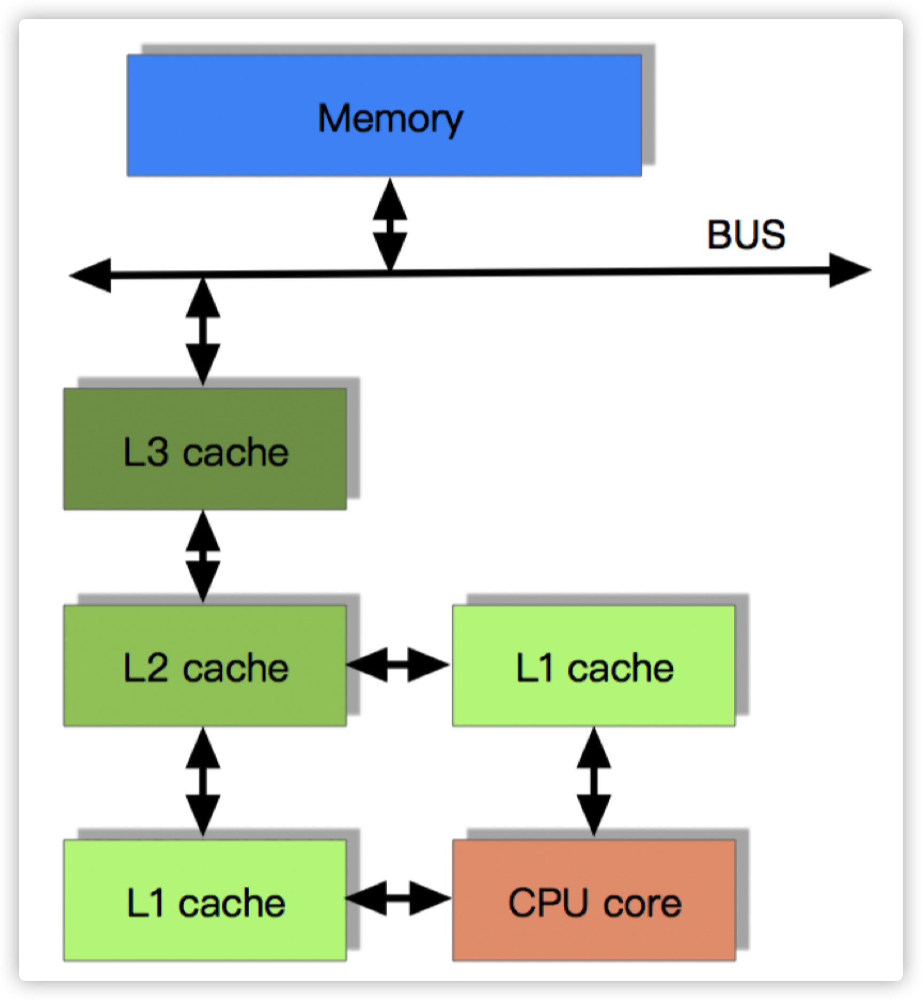
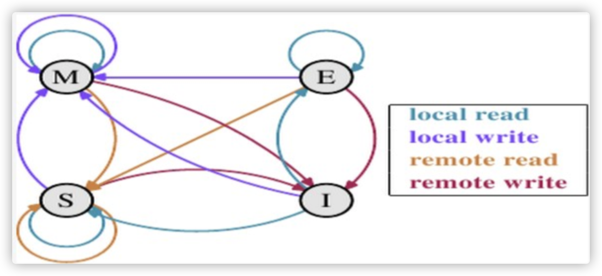
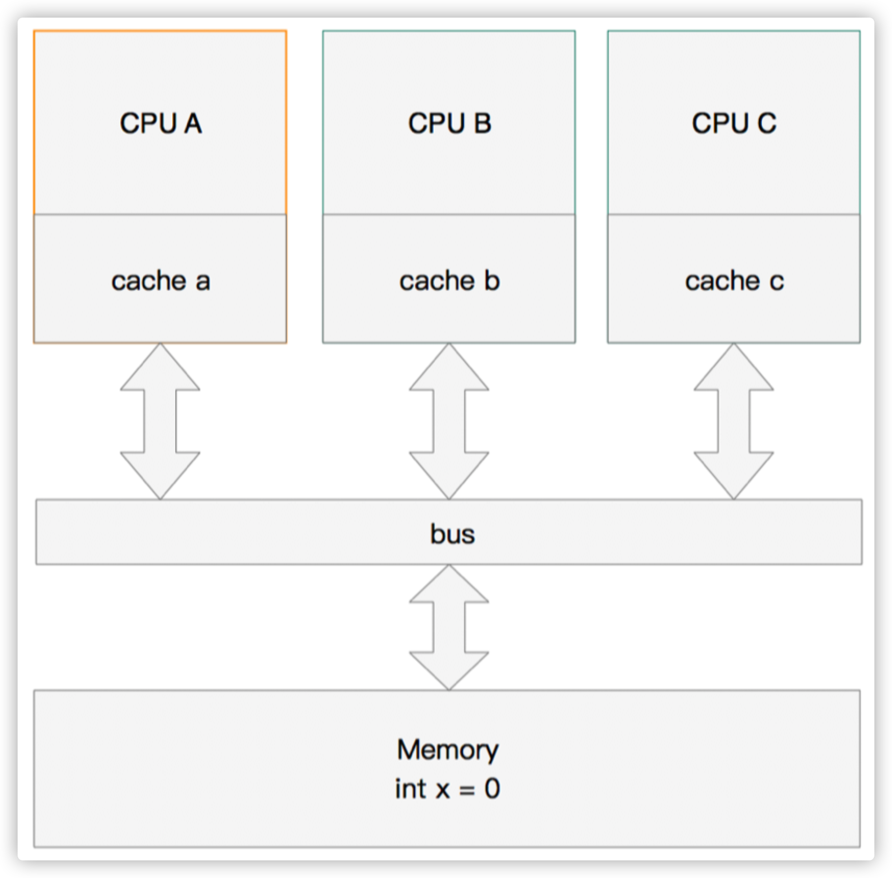
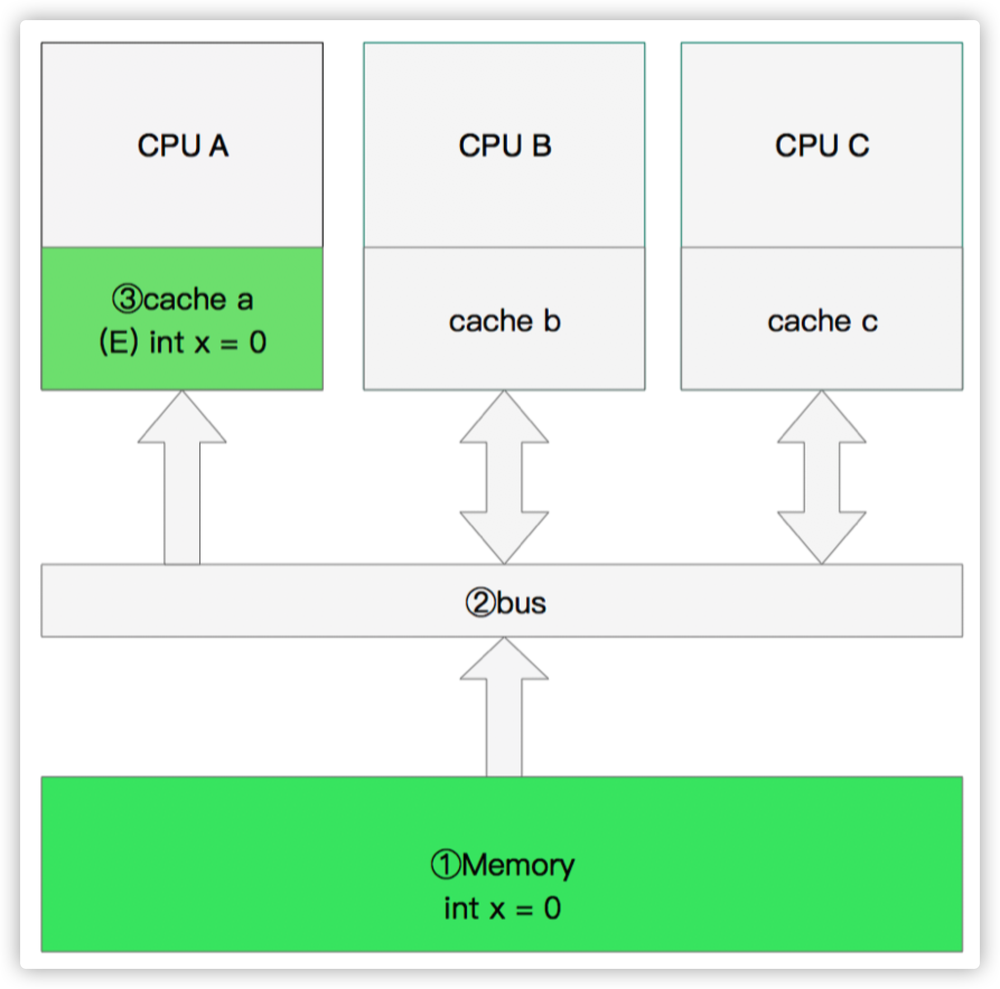
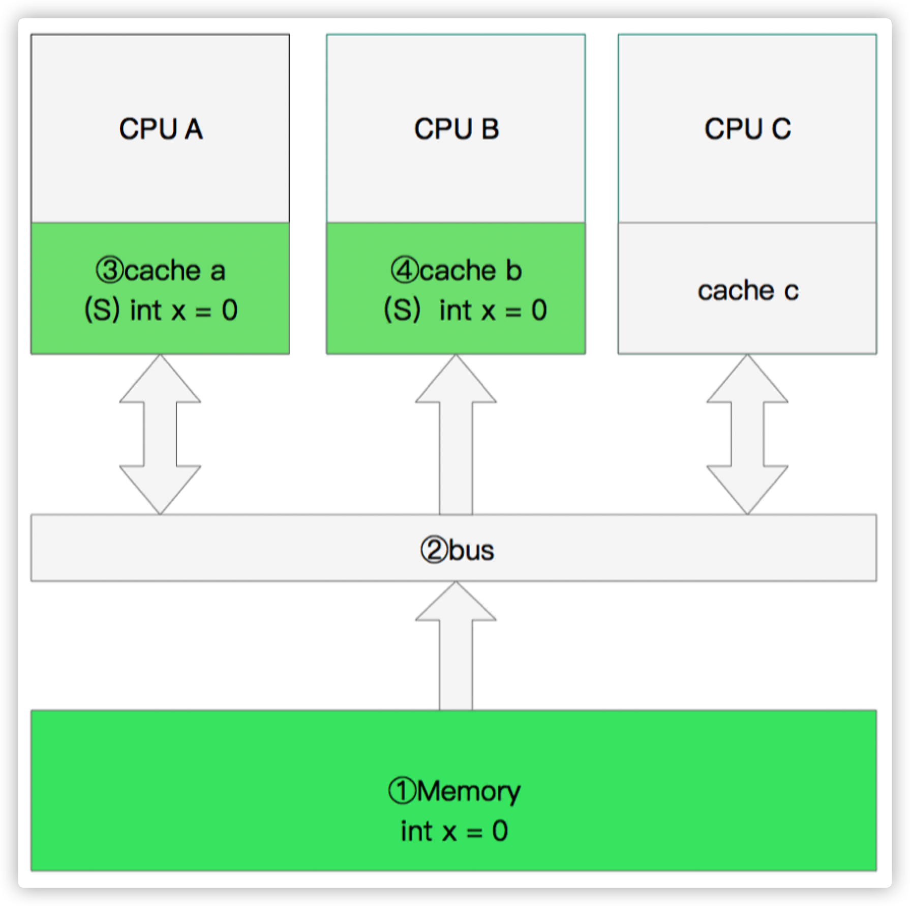
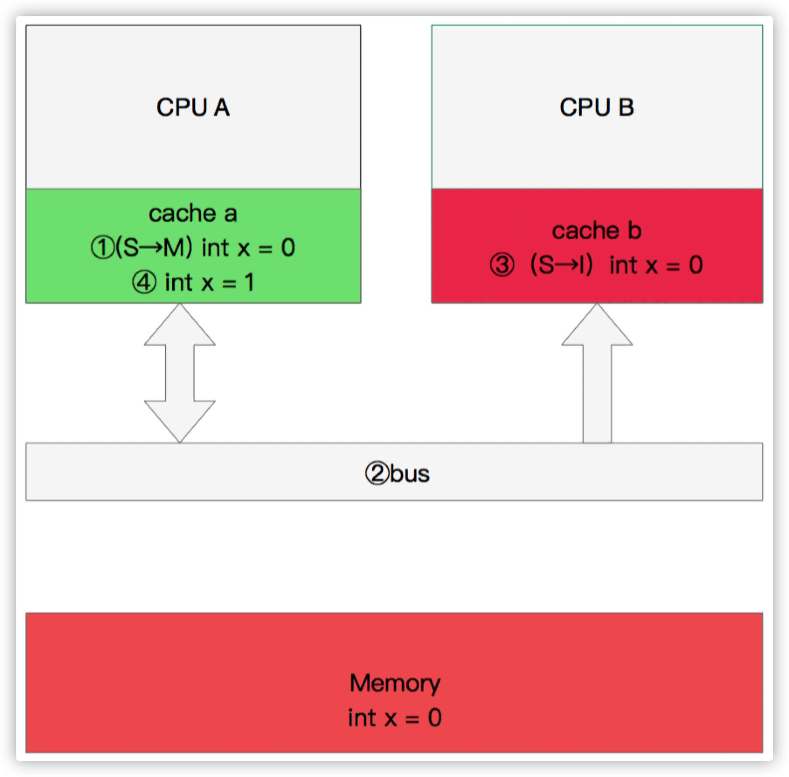
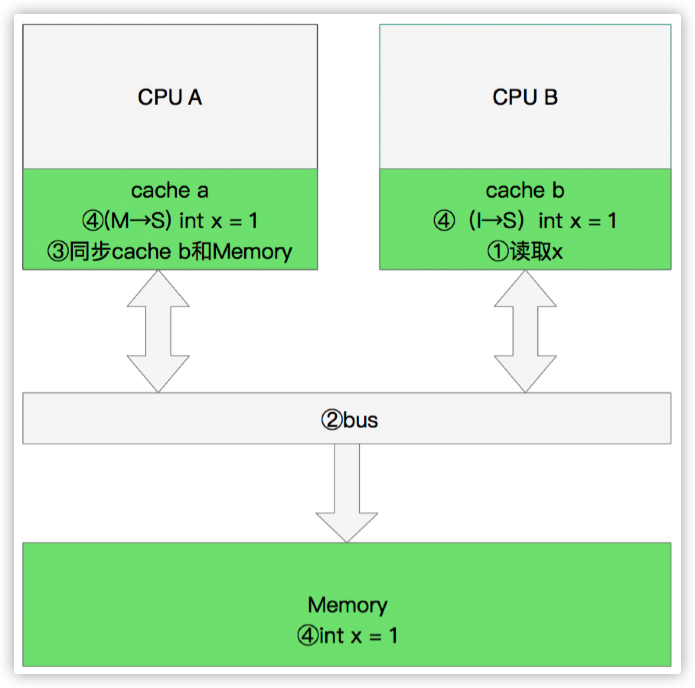

# 3 MESI缓存一致协议详解

## 3.1 CPU高速缓存（Cache Memory）

### CPU为何要有高速缓存

CPU在摩尔定律的指导下以每18个月翻一番的速度在发展，然而内存和硬盘的发展速度远远不及CPU。这就造成了高性能能的内存和硬盘价格及其昂贵。然而CPU的高度运算需要高速的数据。为了解决这个问 题，CPU厂商在CPU中内置了少量的高速缓存以解决I\O速度和CPU运算速度之间的不匹配问题。

在CPU访问存储设备时，无论是存取数据抑或存取指令，都趋于聚集在一片连续的区域中，这就被称为局部性原理。

> **时间局部性（Temporal Locality）**
>
> 如果一个信息项正在被访问，那么在近期它很可能还会被再次访问。比如循环、递归、方法的反复调用等。
>
> **空间局部性（Spatial Locality）**
>
> 如果一个存储器的位置被引用，那么将来他附近的位置也会被引用。比如顺序执行的代码、连续创建的两个对象、数组等。

#### 带有高速缓存的CPU执行计算的流程

1. 程序以及数据被加载到主内存

2. 指令和数据被加载到CPU的高速缓存
3. CPU执行指令，把结果写到高速缓存
4. 高速缓存中的数据写回主内存


#### 目前流行的多级缓存结构

由于CPU的运算速度超越了1级缓存的数据I\O能力，CPU厂商又引入了多级的缓存结构。



### 多核CPU多级缓存一致性协议MESI

多核CPU的情况下有多个一级缓存，如何保证缓存内部数据的一致,不让系统数据混乱。这里就引出了一个一致性的协议MESI。

#### MESI协议缓存状态

MESI 是指4中状态的首字母。每个Cache line有4个状态，可用2个bit表示，它们分别是：

> **缓存行（Cache line）**：缓存存储数据的单元。

| 状态                     | 描述                                                         | 监听任务                                                     |
| ------------------------ | ------------------------------------------------------------ | ------------------------------------------------------------ |
| M 修改 (Modified)        | 该Cache line有效，数据被修改了，和内存中 的数据不一致，数据只存在于本Cache中。 | 缓存行必须时刻监听所有试图读该缓存行相对就主。缓存行写回主存并将状态变成S（共享）状态之前 |
| E 独享、互斥 (Exclusive) | 该Cache line有效，数据和内存中的数据一 致，数据只存在于本Cache中。 | 缓存行也必须监听其它缓存读主存中该缓存行的操 变成S（共享）状态。 |
| S 共享 (Shared)          | 该Cache line有效，数据和内存中的数据一 致，数据存在于很多Cache中。 | 缓存行也必须监听其它缓存使该缓存行无效或者独 成无效（Invalid）。 |
| I 无效 (Invalid)         | 该Cache line无效。                                           | 无                                                           |

> **注意**
>
> **对于M和E状态而言总是精确的，他们在和该缓存行的真正状态是一致的，而S状态可能是非一致的。**如果一个缓存将处于S状态的缓存行作废了，而另一个缓存实际上可能已经独享了该缓存行，但是该缓存却不会将该缓存行升迁为E状态，这是因为其它缓存不会广播他们作废掉该缓存行的通知，同样由于缓存并没有保存该缓存行的copy的数量，因此（即使有这种通知）也没有办法确定自己是否已经独享了该缓存行。
>
> 从上面的意义看来E状态是一种投机性的优化：如果一个CPU想修改一个处于S状态的缓存行，总线事务需要将所有该缓存行的copy变成invalid状态，而修改E状态的缓存不需要使用总线事务。

#### MESI状态转换



理解该图的前置说明：

1. 触发事件

| 触发事件                 | 描述                       |
| ------------------------ | -------------------------- |
| 本地读取（Local read）   | 本地cache读取本地cache数据 |
| 本地写入（Local write）  | 本地cache写入本地cache数据 |
| 远端读取（Remote read）  | 其他cache读取本地cache数据 |
| 远端写入（Remote write） | 其他cache写入本地cache数据 |

2. cache分类

- 前提：所有的cache共同缓存了主内存中的某一条数据。
- 本地cache：指当前cpu的cache。
- 触发cache：触发读写事件的cache。
- 其他cache：指既除了以上两种之外的cache。

> **注意**
>
> 本地的事件触发 本地cache和触发cache为相同。

上图的切换解释：

| 状态          | 触发本地读取                                                 | 触发本地写入                                                 | 触发远端读取                                                 |
| ------------- | ------------------------------------------------------------ | ------------------------------------------------------------ | ------------------------------------------------------------ |
| M状态（修改） | 本地cache:M<br/>触发cache:M<br/>其他cache:I                  | 本地cache:M<br/>触发cache:M<br/>其他cache:I                  | 本地cache:M→E→S<br/>触发cache:I→S<br/>其他cache:I→S<br/>同步主内存后修改为E独享,同步触发、其他 cache后本地、触发、其他cache修改为S共享 |
| E状态（独享） | 本地cache:E<br/>触发cache:E<br/>其他cache:I                  | 本地cache:E→M<br/>触发cache:E→M<br/>其他cache:I<br/>本地cache变更为M,其 他cache状态应当是 I（无效） | 本地cache:E→S<br/>触发cache:I→S<br/>其他cache:I→S<br/>当其他cache要读取该数据时，其他、触发、本地cache都被设置为S(共享） |
| S状态（共享） | 本地cache:S<br/>触发cache:S<br/>其他cache:S                  | 本地cache:S→E→M<br/>触发cache:S→E→M<br/>其他cache:S→I<br/>当本地cache修改时，将 本地cache修改为E,其他 cache修改为I,然后再将 本地cache为M状态 | 本地cache:S<br/>触发cache:S<br/>其他cache:S                  |
| I状态（无效） | 本地cache:I→S或者I→E<br/>触发cache:I→S或者I →E<br/>其他cache:E、M、 I→S、I<br/>本地、触发cache将从I无 效修改为S共享或者E独 享，其他cache将从E、M、I变为S或者I | 本地cache:I→S→E→M<br/>触发cache:I→S→E→M<br/>其他cache:M、E、S→S→I | 既然是本cache是I，其他cache操作与它无 关                     |

下图示意了，当一个cache line的调整的状态的时候，另外一个cache line 需要调整的状态。

|      |  M   |  E   |  S   |  I   |
| :--: | :--: | :--: | :--: | :--: |
|  M   |  ×   |  ×   |  ×   |  √   |
|  E   |  ×   |  ×   |  ×   |  √   |
|  S   |  ×   |  ×   |  √   |  √   |
|  I   |  √   |  √   |  √   |  √   |

> **举个栗子**
>
> 假设cache 1 中有一个变量x = 0的cache line 处于S状态(共享)。那么其他拥有x变量的cache 2、cache 3等x的cache line调整为S状态（共享）或者调整为 I 状态（无效）。

#### 多核缓存协同操作

假设有三个CPU A、B、C，对应三个缓存分别是cache a、b、c。在主内存中定义了x的引用值为0。 



#### 单核读取

那么执行流程是：

- CPU A发出了一条指令，从主内存中读取x。
- 从主内存通过bus读取到缓存中（远端读取Remote read），这是该Cache line修改为E状态（独享）。



#### 双核读取

那么执行流程是：

- CPU A发出了一条指令，从主内存中读取x。
- CPU A从主内存通过bus读取到 cache a中并将该cache line 设置为E状态。
- CPU B发出了一条指令，从主内存中读取x。
- CPU B试图从主内存中读取x时，CPU A检测到了地址冲突。这时CPU A对相关数据做出响应。此时x 存储于cache a和cache b中，x在chche a和cache b中都被设置为S状态(共享)。 



#### 修改数据

那么执行流程是：

- CPU A 计算完成后发指令需要修改x。
- CPU A 将x设置为M状态（修改）并通知缓存了x的CPU B, CPU B将本地cache b中的x设置为I状态(无效)
- CPU A 对x进行赋值。 



#### 同步数据

那么执行流程是：

- CPU B 发出了要读取x的指令。

- CPU B 通知CPU A，CPU A将修改后的数据同步到主内存时cache a 修改为E（独享）

- CPU A同步CPU B的x，将cache a和同步后cache b中的x设置为S状态（共享）。 



### 缓存行伪共享

##### 什么是伪共享？

CPU缓存系统中是以缓存行（cache line）为单位存储的。目前主流的CPU Cache 的Cache Line 大小都是64Bytes。在多线程情况下，如果需要修改“共享同一个缓存行的变量”，就会无意中影响彼此的性能，这就是伪共享（False Sharing）。

> **举个例子**
>
> 现在有2个long 型变量a、b，如果有t1在访问a，t2在访问b，而a与b刚好在同一个cache line中，此时t1先修改a，将导致b被刷新！

##### 怎么解决伪共享？

Java8中新增了一个注解：`@sun.misc.Contended`。加上这个注解的类会自动补齐缓存行，需要注意的是此注解默认是无效的，需要在jvm启动时设置 `-XX:-RestrictContended` 才会生效。

```java
@sun.misc.Contended
public final static class TulingVolatileLong {
		public volatile long value = 0L;
		//public long p1, p2, p3, p4, p5, p6;
}
```


## 3.2 MESI优化和他们引入的问题

缓存的一致性消息传递是要时间的，这就使其切换时会产生延迟。当一个缓存被切换状态时其他缓存收到消息完成各自的切换并且发出回应消息这么一长串的时间中CPU都会等待所有缓存响应完成。可能出现的阻塞都会导致各种各样的性能问题和稳定性问题。

### CPU切换状态阻塞解决­存储缓存（Store Bufferes）

比如你需要修改本地缓存中的一条信息，那么你必须将I（无效）状态通知到其他拥有该缓存数据的CPU缓存中，并且等待确认。等待确认的过程会阻塞处理器，这会降低处理器的性能。应为这个等待远远比一个指令的执行时间长的多。

#### Store Bufferes

为了避免这种CPU运算能力的浪费，Store Bufferes被引入使用。处理器把它想要写入到主存的值写到缓存，然后继续去处理其他事情。当所有失效确认（Invalidate Acknowledge）都接收到时，数据才会最终被提交。

##### Store Bufferes的风险

1. 就是处理器会尝试从存储缓存（Store buffer）中读取值，但它还没有进行提交。这个的解决方案

称为Store Forwarding，它使得加载的时候，如果存储缓存中存在，则进行返回。

2. 保存什么时候会完成，这个并没有任何保证。

```java
value = 3；
void exeToCPUA(){
		value = 10;
		isFinsh = true;
}
void exeToCPUB(){
		if(isFinsh){
				//value一定等于10？！
				assert value == 10;
		}
}
```

试想一下开始执行时，CPU A保存着finished在E(独享)状态，而value并没有保存在它的缓存中。（例如，Invalid）。在这种情况下，value会比finished更迟地抛弃存储缓存。完全有可能CPU B读取finished的值为true，而value的值不等于10。

**即isFinsh的赋值在value赋值之前。**

这种在可识别的行为中发生的变化称为重排序（reordings）。注意，这不意味着你的指令的位置被恶意（或善意）地更改。它只是意味着其他的CPU会读到跟程序中写入的顺序不一样的结果。

~~顺便提一下NIO的设计和Store Bufferes的设计是非常相像的。~~

#### 硬件内存模型

执行失效也不是一个简单的操作，它需要处理器去处理。另外，存储缓存（Store Buffers）并不是无穷大的，所以处理器有时需要等待失效确认的返回。这两个操作都会使得性能大幅降低。为了应付这种情况，引入了失效队列。它们的约定如下：

- 对于所有的收到的Invalidate请求，Invalidate Acknowlege消息必须立刻发送
- Invalidate并不真正执行，而是被放在一个特殊的队列中，在方便的时候才会去执行。
- 处理器不会发送任何消息给所处理的缓存条目，直到它处理Invalidate。

即便是这样处理器已然不知道什么时候优化是允许的，而什么时候并不允许。干脆处理器将这个任务丢给了写代码的人。这就是内存屏障（Memory Barriers）。

>写屏障 Store Memory Barrier(a.k.a. ST, SMB, smp_wmb)是一条告诉处理器在执行这之后的指令之前，应用所 有已经在存储缓存（store buffer）中的保存的指令。 读屏障Load Memory Barrier (a.k.a.

```java
void executedOnCpu0() {
    value = 10;
    // 在更新数据之前必须将所有存储缓存（store buffer）中的指令执行完毕。
    storeMemoryBarrier();
    finished = true;
}

void executedOnCpu1() {
while(!finished);
    // 在读取之前将所有失效队列中关于该数据的指令执行完毕。
    loadMemoryBarrier();
    assert value == 10;
}
```

