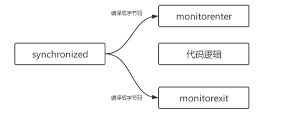
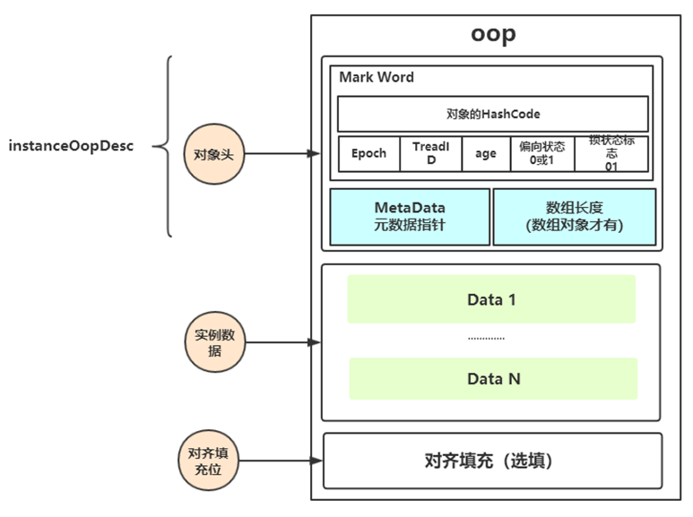
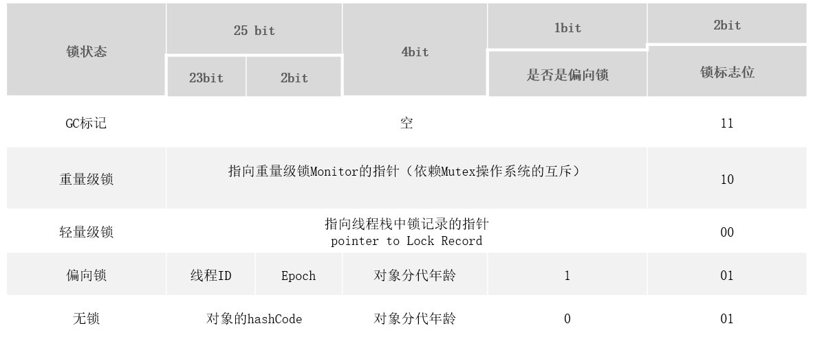
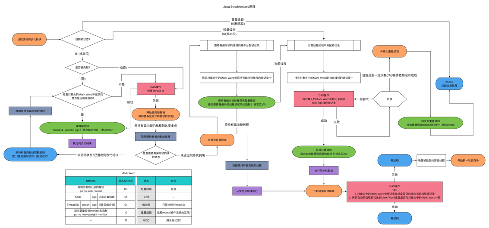

# 并发编程之synchronized详解

## 1. 设计同步器的意义

多线程编程中，有可能会出现多个线程同时访问同一个共享、可变资源的情况，这个资源我们称之其为临界资源；这种资源可能是：对象、变量、文件等。

- 共享：资源可以由多个线程同时访问

- 可变：资源可以在其生命周期内被修改

引出的问题：由于线程执行的过程是不可控的，所以需要采用同步机制来协同对对象可变状态的访问！

#### 如何解决线程并发安全问题？

实际上，所有的并发模式在解决线程安全问题时，采用的方案都是**序列化访问临界资源**。即在同一时刻，只能有一个线程访问临界资源，也称作**同步互斥访问**。

Java 中，提供了两种方式来实现同步互斥访问：**synchronized**和**Lock**

**同步器的本质就是加锁**

加锁目的：**序列化访问临界资源**，即同一时刻只能有一个线程访问临界资源(**同步互斥访问**)

不过有一点需要区别的是：当多个线程执行一个方法时，该方法内部的局部变量并不是临界资源，因为这些局部变量是在每个线程的私有栈中，因此不具有共享性，不会导致线程安全问题。多个线程公用的对象在堆中，各线程引用同一个对象，这个对象内部的变量才可以成为临界资源。


## 2. synchronized原理详解

**synchronized内置锁是一种对象锁(锁的是对象而非引用)，作用粒度是对象，可以用来实现对临界资源的同步互斥访问，是可重入的。**

加锁的方式：

1. 同步实例方法，锁是当前实例对象
2. 同步类方法，锁是当前类对象
3. 同步代码块，锁是括号里面的对象

### 2.1 synchronized底层原理

synchronized是基于JVM内置锁，通过内部对象**Monitor**(监视器锁)实现，基于进入与退出**Monitor**对象实现方法与代码块同步，监视器锁的实现依赖底层操作系统的**Mutex lock**（互斥锁）实现，它是一个重量级锁，性能较低。当然，**JVM内置锁在1.5之后版本做了重大的优化，**如锁粗化（Lock Coarsening）、锁消除（Lock Elimination）、轻量级锁（Lightweight Locking）、偏向锁（Biased Locking）、适应性自旋（Adaptive Spinning）等技术来减少锁操作的开销，内置锁的并发性能已经基本与Lock持平。

synchronized关键字被编译成字节码后会被翻译成monitorenter 和 monitorexit 两条指令分别在同步块逻辑代码的起始位置与结束位置。



每个同步对象都有一个自己的Monitor(监视器锁)，加锁过程如下图所示：


### 2.2 Monitor监视器锁

**任何一个对象都有一个Monitor与之关联，当且一个Monitor被持有后，它将处于锁定状态**。Synchronized在JVM里的实现都是 **基于进入和退出Monitor对象来实现方法同步和代码块同步**，虽然具体实现细节不一样，但是都可以通过成对的MonitorEnter和MonitorExit指令来实现。

- **monitorenter**：每个对象都是一个监视器锁（monitor）。当monitor被占用时就会处于锁定状态，线程执行monitorenter指令时尝试获取monitor的所有权，过程如下：

  - **如果monitor的进入数为0**，则该线程进入monitor，然后将进入数设置为1，该线程即为monitor的所有者；

  - **如果线程已经占有该monitor**，只是重新进入，则进入monitor的进入数加1；
  - **如果其他线程已经占用了monitor**，则该线程进入阻塞状态，直到monitor的进入数为0，再重新尝试获取monitor的所有权；

- **monitorexit**：执行monitorexit的线程必须是objectref所对应的monitor的所有者。**指令执行时，monitor的进入数减1，如果减1后进入数为0，那线程退出monitor，不再是这个monitor的所有者**。其他被这个monitor阻塞的线程可以尝试去获取这个 monitor 的所有权。

> **注意**
>
> 查看字节码可以看到，**monitorexit**指令出现了两次，第1次为同步正常退出释放锁；第2次为发生异步退出释放锁。主要是为了做容错处理，以确保在代码抛出异常时，也能正确释放锁。

通过上面两段描述，我们应该能很清楚的看出Synchronized的实现原理，**Synchronized的语义底层是通过一个monitor的对象来完成，其实wait/notify等方法也依赖于monitor对象**，这就是为什么只有在同步的块或者方法中才能调用wait/notify等方法，**否则会抛出java.lang.IllegalMonitorStateException的异常的原因**。

看一个同步方法：

```java
package it.yg.juc.sync;
public class SynchronizedMethod {
    public synchronized void method() {
        System.out.println("Hello World!");
    }
}
```

反编译结果：


从编译的结果来看，方法的同步并没有通过指令 **monitorenter** 和 **monitorexit** 来完成（理论上其实也可以通过这两条指令来实现），不过相对于普通方法，其常量池中多了 **ACC_SYNCHRONIZED** 标示符。**JVM就是根据该标示符来实现方法的同步的**：

当方法调用时，**调用指令将会检查方法的 ACC_SYNCHRONIZED 访问标志是否被设置**，如果设置了，**执行线程将先获取monitor**，获取成功之后才能执行方法体，**方法执行完后再释放monitor**。在方法执行期间，其他任何线程都无法再获得同一个monitor对象。

两种同步方式本质上没有区别，只是方法的同步是一种隐式的方式来实现，无需通过字节码来完成。**两个指令的执行是JVM通过调用操作系统的互斥原语mutex来实现，被阻塞的线程会被挂起、等待重新调度**，会导致“用户态和内核态”两个态之间来回切换，对性能有较大影响。

#### 什么是monitor？

可以把它理解为 **一个同步工具**，也可以描述为 **一种同步机制**，它通常被 **描述为一个对象**。与一切皆对象一样，所有的Java对象是天生的Monitor，每一个Java对象都有成为Monitor的潜质，**因为在Java的设计中 ，每一个Java对象自打娘胎里出来就带了一把看不见的锁，它叫做内部锁或者Monitor锁**。**也就是通常说Synchronized的对象锁，MarkWord锁标识位为10，其中指针指向的是Monitor对象的起始地址**。在Java虚拟机（HotSpot）中，**Monitor是由ObjectMonitor实现的**，其主要数据结构如下（位于HotSpot虚拟机源码ObjectMonitor.hpp文件，C++实现的）：

```c++
ObjectMonitor() {
    _header       = NULL;
    _count        = 0;			// 记录个数
    _waiters      = 0,
    _recursions   = 0;
    _object       = NULL;
    _owner        = NULL;
    _WaitSet      = NULL;		// 处于wait状态的线程，会被加入到_WaitSet
    _WaitSetLock  = 0 ;
    _Responsible  = NULL ;
    _succ         = NULL ;
    _cxq          = NULL ;
    FreeNext      = NULL ;
    _EntryList    = NULL ;	// 处于等待锁block状态的线程，会被加入到该列表
    _SpinFreq     = 0 ;
    _SpinClock    = 0 ;
    OwnerIsThread = 0 ;
  }
```

ObjectMonitor中有两个队列，**_WaitSet 和 _EntryList**，用来保存ObjectWaiter对象列表（ **每个等待锁的线程都会被封装成ObjectWaiter对象** ），**_owner指向持有ObjectMonitor对象的线程**，当多个线程同时访问一段同步代码时：

1. 首先会进入 _EntryList 集合，**当线程获取到对象的monitor后，进入 _Owner区域并把monitor中的owner变量设置为当前线程，同时monitor中的计数器count加1**；
2. 若线程调用 wait() 方法，**将释放当前持有的monitor，owner变量恢复为null，count自减1，同时该线程进入 WaitSet集合中等待被唤醒**；
3. 若当前线程执行完毕，**也将释放monitor（锁）并复位count的值，以便其他线程进入获取monitor(锁)**；

同时，**Monitor对象存在于每个Java对象的对象头Mark Word中（存储的指针的指向），Synchronized锁便是通过这种方式获取锁的**，也是为什么Java中任意对象可以作为锁的原因，**同时notify/notifyAll/wait等方法会使用到Monitor锁对象，所以必须在同步代码块中使用**。监视器Monitor有两种同步方式：**互斥与协作**。多线程环境下线程之间如果需要共享数据，需要解决互斥访问数据的问题，**监视器可以确保监视器上的数据在同一时刻只会有一个线程在访问**。

那么有个问题来了，我们知道synchronized加锁加在对象上，对象是如何记录锁状态的呢？答案是锁状态是被记录在每个对象的对象头（Mark Word）中，下面我们一起认识一下对象的内存布局。


## 3. 对象的内存布局

HotSpot虚拟机中，对象在内存中存储的布局可以分为三块区域：对象头（Header）、实例数据（Instance Data）和对齐填充（Padding）。

- 对象头：比如 hash码，对象所属的年代，对象锁，锁状态标志，偏向锁（线程）ID，偏向时间，数组长度（数组对象）等。**Java对象头一般占有2个机器码**（在32位虚拟机中，1个机器码等于4字节，也就是32bit，在64位虚拟机中，1个机器码是8个字节，也就是64bit），但是 **如果对象是数组类型，则需要3个机器码，因为JVM虚拟机可以通过Java对象的元数据信息确定Java对象的大小**，但是无法从数组的元数据来确认数组的大小，所以用一块来记录数组长度。
- 实例数据：存放类的属性数据信息，包括父类的属性信息；
- 对齐填充：由于虚拟机要求 **对象起始地址必须是8字节的整数倍**。填充数据不是必须存在的，仅仅是为了字节对齐；



#### 对象头

HotSpot虚拟机的**对象头**包括两部分信息，第一部分是**“Mark Word**”，用于存储对象自身的运行时数据， 如哈希码（HashCode）、GC分代年龄、锁状态标志、线程持有的锁、偏向线程ID、偏向时间戳等等，**它是实现轻量级锁和偏向锁的关键**。，这部分数据的长度在32位和64位的虚拟机（暂 不考虑开启压缩指针的场景）中分别为32个和64个Bits，官方称它为“Mark Word”。对象需要存储的运行时数据很多，其实已经超出了32、64位Bitmap结构所能记录的限度，但是对象头信息是与对象自身定义的数据无关的额 外存储成本，考虑到虚拟机的空间效率，Mark Word被设计成一个非固定的数据结构以便在极小的空间内存储尽量多的信息，它会根据对象的状态复用自己的存储空间。例如在32位的HotSpot虚拟机 中对象未被锁定的状态下，Mark Word的32个Bits空间中的25Bits用于存储对象哈希码（HashCode），4Bits用于存储对象分代年龄，2Bits用于存储锁标志位，1Bit固定为0，在其他状态（轻量级锁定、重量级锁定、GC标记、可偏向）下对象的存储内容如下表所示。

但是如果对象是数组类型，则需要三个机器码，因为JVM虚拟机可以通过Java对象的元数据信息确定Java对象的大小，但是无法从数组的元数据来确认数组的大小，所以用一块来记录数组长度。

对象头信息是与对象自身定义的数据无关的额外存储成本，但是考虑到虚拟机的空间效率，Mark Word被设计成一个非固定的数据结构以便在极小的空间内存存储尽量多的数据，它会根据对象的状态复用自己的存储空间，也就是说，Mark Word会随着程序的运行发生变化。

变化状态如下：

##### 32位虚拟机



##### 64位虚拟机


现在我们虚拟机基本是64位的，而64位的对象头有点浪费空间,JVM默认会开启指针压缩，所以基本上也是按32位的形式记录对象头的。

> 手动设置 -XX:+UseCompressedOops

哪些信息会被压缩？

1. 对象的全局静态变量(即类属性)

2. 对象头信息：64位平台下，原生对象头大小为16字节，压缩后为12字节

3. 对象的引用类型：64位平台下，引用类型本身大小为8字节，压缩后为4字节

4. 对象数组类型：64位平台下，数组类型本身大小为24字节，压缩后16字节

在Scott oaks写的《java性能权威指南》第八章8.22节提到了当heap size堆内存大于32GB是用不了压缩指针的，对象引用会额外占用20%左右的堆空间，也就意味着要38GB的内存才相当于开启了指针压缩的32GB堆空间。这是为什么呢？看下面引用中的红字（来自[openjdk wiki](https://wiki.openjdk.java.net/display/HotSpot/CompressedOops)）。32bit最大寻址空间是4GB，开启了压缩指针之后呢，一个地址寻址不再是1byte，而是8byte，因为不管是32bit的机器还是64bit的机器，java对象都是8byte对齐的，而类是java中的基本单位，对应的堆内存中都是一个一个的对象。

> Compressed oops represent managed pointers (in many but not all places in the JVM) as 32-bit values which must be scaled by a factor of 8 and added to a 64-bit base address to find the object they refer to. This allows applications to address up to four billion objects (not bytes), or a heap size of up to about 32Gb. At the same time, data structure compactness is competitive with ILP32 mode.

#### 对象头分析工具

运行时对象头锁状态分析工具JOL，他是OpenJDK开源工具包，引入下方maven依赖

```xml
<dependency>
    <groupId>org.openjdk.jol</groupId>
    <artifactId>jol-core</artifactId>
    <version>0.10</version>
</dependency>
```

##### 无锁态

```java
public class T0_ObjectSize {
    public static void main(String[] args) throws InterruptedException {
        Object o = new Object();
        System.out.println(ClassLayout.parseInstance(o).toPrintable());
    }
}
```

>运行结果为：
>
>```
>java.lang.Object object internals:
> OFFSET  SIZE   TYPE DESCRIPTION VALUE
>      0     4   (object header)  01 00 00 00 (00000001 00000000 00000000 00000000) (1)
>      4     4   (object header)  00 00 00 00 (00000000 00000000 00000000 00000000) (0)
>      8     4   (object header)  e5 01 00 f8 (11100101 00000001 00000000 11111000) (-134217243)
>     12     4   (loss due to the next object alignment)
>Instance size: 16 bytes
>```
>
>可以看到对象头中包含 `00000001 00000000 00000000 00000000`
>
>操作系统为**小端模式**，高低位是互换的，所以可以看到低位为 `00000001`，最末尾的 `01` 表示无锁态。

##### 轻量级锁

```java
public static void main(String[] args) throws InterruptedException {
    Object o = new Object();
    synchronized (o) {
    		System.out.println(ClassLayout.parseInstance(o).toPrintable());
    }
}
```

> 运行结果为：
>
> ```
> java.lang.Object object internals:
>  OFFSET  SIZE  TYPE DESCRIPTION  VALUE
>       0     4  (object header)   90 c9 0a 10 (10010000 11001001 00001010 00010000) (269142416)
>       4     4  (object header)   00 70 00 00 (00000000 01110000 00000000 00000000) (28672)
>       8     4  (object header)   e5 01 00 f8 (11100101 00000001 00000000 11111000) (-134217243)
>      12     4  (loss due to the next object alignment)
> Instance size: 16 bytes
> Space losses: 0 bytes internal + 4 bytes external = 4 bytes total
> ```
>
> 对象头中包含 `10010000 11001001 00001010 00010000`，低位为 `10010000`，最末尾的 `00` 表示轻量级锁。

###### 为什么没有从无锁态转为偏向锁？

因为JVM启动时，会延迟4秒左右启动偏向锁，所以在此处会直接从无锁态转为轻量级锁，而不是偏向锁。

###### 为什么偏向锁要延迟启动？

因为JVM启动时，其中的多个线程会对存在同步块的对象产生竞争，为了避免这些场景下**偏向锁-轻量级锁-重量级锁**的升级过程带来的消耗，所以延迟启动偏向锁。

##### 偏向锁

###### 示例1

```java
public static void main(String[] args) throws InterruptedException {
  	// 偏向锁大约延迟4秒启动，延迟执行5秒，等待偏向锁启动完成
    TimeUnit.SECONDS.sleep(5);
    Object o = new Object();
  	System.out.println(ClassLayout.parseInstance(o).toPrintable());
    synchronized (o) {
      	System.out.println(ClassLayout.parseInstance(o).toPrintable());
    }
}
```

> 运行结果为：
>
> ```
> java.lang.Object object internals:
>  OFFSET  SIZE   TYPE DESCRIPTION  VALUE
>       0     4   (object header)   05 00 00 00 (00000101 00000000 00000000 00000000) (5)
>       4     4   (object header)   00 00 00 00 (00000000 00000000 00000000 00000000) (0)
>       8     4   (object header)   e5 01 00 f8 (11100101 00000001 00000000 11111000) (-134217243)
>      12     4   (loss due to the next object alignment)
> Instance size: 16 bytes
> 
> java.lang.Object object internals:
>  OFFSET  SIZE   TYPE DESCRIPTION  VALUE
>       0     4   (object header)   05 38 81 d1 (00000101 00111000 10000001 11010001) (-780060667)
>       4     4   (object header)   9b 7f 00 00 (10011011 01111111 00000000 00000000) (32667)
>       8     4   (object header)   e5 01 00 f8 (11100101 00000001 00000000 11111000) (-134217243)
>      12     4   (loss due to the next object alignment)
> Instance size: 16 bytes
> Space losses: 0 bytes internal + 4 bytes external = 4 bytes total
> ```
>
> 对象头中包含
>
> ```bash
> # 无锁态的示例中，未启动偏向锁时，打印的结果
> 00000001 00000000 00000000 00000000
> # 开启偏向锁
> # 无锁状态
> 00000101 00000000 00000000 00000000
> # 有同步块
> # 偏向锁  对象分代年龄  Epoch  线程ID
> 00000101 00111000 10000001 11010001
> ```
>
> 可以看到，开启偏向锁后，无锁状态的低位末尾为 `01`，而不是 `01`，这是一种随时可专享偏向的状态，称为**匿名偏向**，此时还没有加上线程信息（后面都是0）。等到有同步块后，加上偏向锁，才写入线程ID、Epoch、对象分代年龄等信息。

###### 示例2

```java
public static void main(String[] args) {
    try {
    		Thread.sleep(5000);
    } catch (InterruptedException e) {
    		e.printStackTrace();
    }
    Object o = new Object();
    log.info(ClassLayout.parseInstance(o).toPrintable());

    new Thread(()->{
        synchronized (o){
        		log.info(ClassLayout.parseInstance(o).toPrintable());
        }
    }).start();

    try {
    		Thread.sleep(2000);
    } catch (InterruptedException e) {
    		e.printStackTrace();
    }

    log.info(ClassLayout.parseInstance(o).toPrintable());
    new Thread(()->{
        synchronized (o){
            log.info(ClassLayout.parseInstance(o).toPrintable());
        }
    }).start();
}
```

>运行结果为：
>
>```
>22:18:06.052 [main] INFO com.tyrival.concurrent.lesson04.T0_BasicLock - java.lang.Object object internals:
> OFFSET  SIZE   TYPE DESCRIPTION  VALUE
>      0     4   (object header)   05 00 00 00 (00000101 00000000 00000000 00000000) (5)
>      4     4   (object header)   00 00 00 00 (00000000 00000000 00000000 00000000) (0)
>      8     4   (object header)   e5 01 00 f8 (11100101 00000001 00000000 11111000) (-134217243)
>     12     4   (loss due to the next object alignment)
>Instance size: 16 bytes
>Space losses: 0 bytes internal + 4 bytes external = 4 bytes total
>
>22:18:06.060 [Thread-1] INFO com.tyrival.concurrent.lesson04.T0_BasicLock - java.lang.Object object internals:
> OFFSET  SIZE   TYPE DESCRIPTION  VALUE
>      0     4   (object header)   05 f0 8f 08 (00000101 11110000 10001111 00001000) (143650821)
>      4     4   (object header)   ee 7f 00 00 (11101110 01111111 00000000 00000000) (32750)
>      8     4   (object header)   e5 01 00 f8 (11100101 00000001 00000000 11111000) (-134217243)
>     12     4   (loss due to the next object alignment)
>Instance size: 16 bytes
>Space losses: 0 bytes internal + 4 bytes external = 4 bytes total
>
>22:18:08.063 [main] INFO com.tyrival.concurrent.lesson04.T0_BasicLock - java.lang.Object object internals:
> OFFSET  SIZE   TYPE DESCRIPTION   VALUE
>      0     4   (object header)    05 f0 8f 08 (00000101 11110000 10001111 00001000) (143650821)
>      4     4   (object header)    ee 7f 00 00 (11101110 01111111 00000000 00000000) (32750)
>      8     4   (object header)    e5 01 00 f8 (11100101 00000001 00000000 11111000) (-134217243)
>     12     4   (loss due to the next object alignment)
>Instance size: 16 bytes
>Space losses: 0 bytes internal + 4 bytes external = 4 bytes total
>
>22:18:08.066 [Thread-2] INFO com.tyrival.concurrent.lesson04.T0_BasicLock - java.lang.Object object internals:
> OFFSET  SIZE   TYPE DESCRIPTION  VALUE
>      0     4   (object header)   08 f9 65 0d (00001000 11111001 01100101 00001101) (224786696)
>      4     4   (object header)   00 70 00 00 (00000000 01110000 00000000 00000000) (28672)
>      8     4   (object header)   e5 01 00 f8 (11100101 00000001 00000000 11111000) (-134217243)
>     12     4   (loss due to the next object alignment)
>Instance size: 16 bytes
>Space losses: 0 bytes internal + 4 bytes external = 4 bytes total
>```
>
>可以看到4次打印结果分别为：
>
>```bash
># 匿名偏向
>00000101 00000000 00000000 00000000
># 第一个线程加了偏向锁
>00000101 11110000 10001111 00001000
># 当锁未被其他线程获取时，第一个线程仍旧持有锁
>00000101 11110000 10001111 00001000
># 第二个线程与第一个线程竞争锁，但此时第一个线程已经执行完毕，不存在强烈的竞争
># 所以此时偏向锁升级为轻量级锁，而不是重量级锁
>00001000 11111001 01100101 00001101
>```
>
>以上就是一个偏向锁升级为轻量级锁的过程

##### 重量级锁

```java
public static void main(String[] args) throws InterruptedException {
    Thread.sleep(5000);
    Object a = new Object();

    Thread thread1 = new Thread(){
        @Override
        public void run() {
            synchronized (a){
                System.out.println("thread1 locking");
                System.out.println(ClassLayout.parseInstance(a).toPrintable());
                try {
                    // 让线程晚点儿死亡，造成锁的竞争
                    Thread.sleep(2000);
                } catch (InterruptedException e) {
                    e.printStackTrace();
                }
            }
        }
    };
    Thread thread2 = new Thread(){
        @Override
        public void run() {
            synchronized (a){
                System.out.println("thread2 locking");
                System.out.println(ClassLayout.parseInstance(a).toPrintable());
                try {
                    Thread.sleep(2000);
                } catch (InterruptedException e) {
                    e.printStackTrace();
                }
            }
        }
    };
    thread1.start();
    thread2.start();
}
```

> 运行结果为：
>
> ```
> thread1 locking
> java.lang.Object object internals:
>  OFFSET  SIZE   TYPE DESCRIPTION  VALUE
>       0     4   (object header)   0a b6 80 71 (00001010 10110110 10000000 01110001) (1904260618)
>       4     4   (object header)   ed 7f 00 00 (11101101 01111111 00000000 00000000) (32749)
>       8     4   (object header)   e5 01 00 f8 (11100101 00000001 00000000 11111000) (-134217243)
>      12     4   (loss due to the next object alignment)
> Instance size: 16 bytes
> Space losses: 0 bytes internal + 4 bytes external = 4 bytes total
> 
> thread2 locking
> java.lang.Object object internals:
>  OFFSET  SIZE   TYPE DESCRIPTION  VALUE
>       0     4   (object header)   0a b6 80 71 (00001010 10110110 10000000 01110001) (1904260618)
>       4     4   (object header)   ed 7f 00 00 (11101101 01111111 00000000 00000000) (32749)
>       8     4   (object header)   e5 01 00 f8 (11100101 00000001 00000000 11111000) (-134217243)
>      12     4   (loss due to the next object alignment)
> Instance size: 16 bytes
> Space losses: 0 bytes internal + 4 bytes external = 4 bytes total
> ```
>
> 可以看到两个线程加锁为重量级锁。
>
> ```bash
> 00001010 10110110 10000000 01110001
> 00001010 10110110 10000000 01110001
> ```

## 3.1 锁的膨胀升级过程

锁的状态总共有四种，无锁状态、偏向锁、轻量级锁和重量级锁。随着锁的竞争，锁可以从偏向锁升级到轻量级锁，再升级的重量级锁，但是**锁的升级是单向的，也就是说只能从低到高升级，不会出现锁的降级**。从**JDK 1.6 开始默认是开启偏向锁和轻量级锁的**，可以通过 `-XX:-UseBiasedLocking` 来禁用偏向锁。下图为锁的升级全过程：



#### 偏向锁

偏向锁是Java 6之后加入的新锁，它是一种针对加锁操作的优化手段，经过研究发现，在大多数情况下，锁不仅不存在多线程竞争，而且总是由同一线程多次获得，因此为了减少同一线程获取锁(会涉及到一些CAS操作,耗时)的代价而引入偏向锁。偏向锁的核心思想是，如果一个线程获得了锁，那么锁就进入偏向模式，此时Mark Word 的结构也变为偏向锁结构，当这个线程再次请求锁时，无需再做任何同步操作，即获取锁的过程，这样就省去了大量有关锁申请的操作，从而也就提供程序的性能。所以，对于没有锁竞争的场合，偏向锁有很好的优化效果，毕竟极有可能连续多次是同一个线程申请相同的锁。但是对于锁竞争比较激烈的场合，偏向锁就失效了，因为这样场合极有可能每次申请锁的线程都是不相同的，因此这种场合下不应该使用偏向锁，否则会得不偿失，需要注意的是，偏向锁失败后，并不会立即膨胀为重量级锁，而是先升级为轻量级锁。下面我们接着了解轻量级锁。

> 默认开启偏向锁
>
> 开启偏向锁： `-XX:+UseBiasedLocking -XX:BiasedLockingStartupDelay=0 `
>
> 关闭偏向锁： `-XX:-UseBiasedLocking `

#### 轻量级锁

倘若偏向锁失败，虚拟机并不会立即升级为重量级锁，它还会尝试使用一种称为轻量级锁的优化手段(1.6之后加入的)，此时Mark Word 的结构也变为轻量级锁的结构。轻量级锁能够提升程序性能的依据是“对绝大部分的锁，在整个同步周期内都不存在竞争”，注意这是经验数据。需要了解的是，轻量级锁所适应的场景是线程交替执行同步块的场合，如果存在同一时间访问同一锁的场合，就会导致轻量级锁膨胀为重量级锁。

#### 自旋锁

轻量级锁失败后，虚拟机为了避免线程真实地在操作系统层面挂起，还会进行一项称为自旋锁的优化手段。这是基于在大多数情况下，线程持有锁的时间都不会太长，如果直接挂起操作系统层面的线程可能会得不偿失，毕竟操作系统实现线程之间的切换时需要从用户态转换到核心态，这个状态之间的转换需要相对比较长的时间，时间成本相对较高，因此自旋锁会假设在不久将来，当前的线程可以获得锁，因此虚拟机会让当前想要获取锁的线程做几个空循环(这也是称为自旋的原因)，一般不会太久，可能是50个循环或100循环，在经过若干次循环后，如果得到锁，就顺利进入临界区。如果还不能获得锁，那就会将线程在操作系统层面挂起，这就是自旋锁的优化方式，这种方式确实也是可以提升效率的。最后没办法也就只能升级为重量级锁了。

#### 锁粗化

当出现类似如下代码，出现加锁-释放-加锁-释放这样的代码：

```java
public static void main(String[] args) throws InterruptedException {
    Object object = new Object();
    synchronized (object) {
        System.out.println("1");
    }
    synchronized (object) {
        System.out.println("2");
    }
    synchronized (object) {
        System.out.println("3");
    }
}
```

为了减少加锁和释放的开销，JVM会对代码进行类似如下优化：

```java
public static void main(String[] args) throws InterruptedException {
    Object object = new Object();
    synchronized (object) {
        System.out.println("1");
        System.out.println("2");
        System.out.println("3");
    }
}
```

#### 锁消除

消除锁是虚拟机另外一种锁的优化，这种优化更彻底，Java虚拟机在JIT编译时(可以简单理解为当某段代码即将第一次被执行时进行编译，又称即时编译)，通过对运行上下文的扫描，去除不可能存在共享资源竞争的锁，通过这种方式消除没有必要的锁，可以节省毫无意义的请求锁时间，如下StringBuffer的append是一个同步方法，但是在add方法中的StringBuffer属于一个局部变量，并且不会被其他线程所使用，因此StringBuffer不可能存在共享资源竞争的情景，JVM会自动将其锁消除。**锁消除的依据是逃逸分析的数据支持。**

锁消除，前提是java必须运行在server模式（server模式会比client模式作更多的优化），同时必须开启逃逸分析

> `-XX:+DoEscapeAnalysis` 开启逃逸分析
>
> `-XX:+EliminateLocks` 表示开启锁消除。

例如下面代码中，object变量声明在方法中，只在当前线程的线程栈中有用，而object引用的对象在堆中不可能被其他线程访问到，所以这里的锁没有意义。

```java
public class LockTest {
    private void method1() {
        Object object = new Object();
        synchronized (object) {
            System.out.println("");
        }
    }
}
```

JVM会对代码做类似如下优化：

```java
public class LockTest {
    private void method1() {
        Object object = new Object();
        System.out.println("");
    }
}
```

#### 逃逸分析

使用逃逸分析，编译器可以对代码做如下优化：

1. 同步省略。如果一个对象被发现只能从一个线程被访问到，那么对于这个对象的操作可以不考虑同步。
2. 将堆分配转化为栈分配。如果一个对象在子程序中被分配，要使指向该对象的指针永远不会逃逸，对象可能是栈分配的候选，而不是堆分配。
3. 分离对象或标量替换。有的对象可能不需要作为一个连续的内存结构存在也可以被访问到，那么对象的部分（或全部）可以不存储在内存，而是存储在CPU寄存器中。

是不是所有的对象和数组都会在堆内存分配空间？**不一定**。在Java代码运行时，通过JVM参数可指定是否开启逃逸分析，

- `-XX:+DoEscapeAnalysis`：表示开启逃逸分析 

- `-XX:-DoEscapeAnalysis` ： 表示关闭逃逸分析。

> **注意**
>
> 从jdk 1.7开始已经默认开启逃逸分析，如需关闭，需要指定 `-XX:-DoEscapeAnalysis`

逃逸分析的案例

```java
public class T0_ObjectStackAlloc {
    /**
     * 进行两种测试
     * 关闭逃逸分析，同时调大堆空间，避免堆内GC的发生，如果有GC信息将会被打印出来
     * VM运行参数：-Xmx4G -Xms4G -XX:-DoEscapeAnalysis -XX:+PrintGCDetails -XX:+HeapDumpOnOutOfMemoryError
     *
     * 开启逃逸分析
     * VM运行参数：-Xmx4G -Xms4G -XX:+DoEscapeAnalysis -XX:+PrintGCDetails -XX:+HeapDumpOnOutOfMemoryError
     *
     * 执行main方法后
     * jps 查看进程
     * jmap -histo 进程ID
     */
    public static void main(String[] args) {
        long start = System.currentTimeMillis();
        for (int i = 0; i < 500000; i++) {
            alloc();
        }
        long end = System.currentTimeMillis();
        //查看执行时间
        System.out.println("cost-time " + (end - start) + " ms");
        try {
            Thread.sleep(100000);
        } catch (InterruptedException e1) {
            e1.printStackTrace();
        }
    }

    private static Student alloc() {
        //Jit对编译时会对代码进行 逃逸分析
        //并不是所有对象存放在堆区，有的一部分存在线程栈空间
        Student student = new Student();
        return student;
    }

    static class Student {
        private String name;
        private int age;
    }
}
```

#### 锁升级过程

