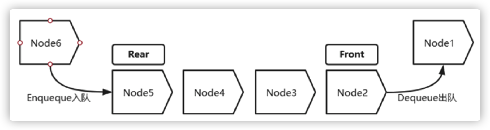
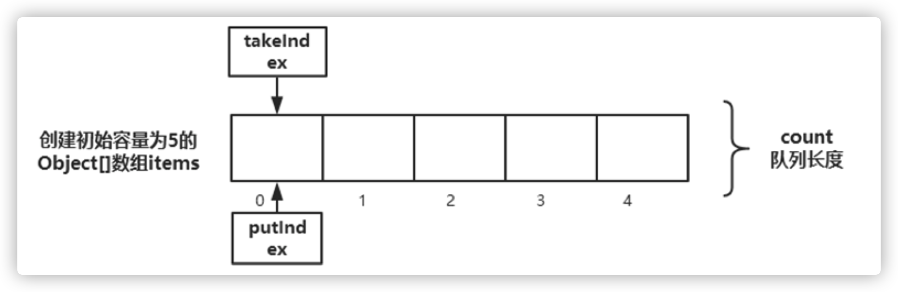

# 抽象队列同步器AQS应用之BlockingQueue详解

## 1. 概要

BlockingQueue，是 `java.util.concurrent` 包提供的用于解决并发生产者 - 消费者问题的最有用的类，它的特性是在任意时刻只有一个线程可以进行take或者put操作，并且BlockingQueue提供了超时return null的机制，在许多生产场景里都可以看到这个工具的身影。

## 2. 队列类型

1. 无限队列（unbounded queue ）- 几乎可以无限增长

2. 有限队列（ bounded queue ）- 定义了最大容量

## 3. 队列数据结构

队列实质就是一种存储数据的结构

- 通常用链表或者数组实现
- 一般而言队列具备FIFO先进先出的特性，当然也有双端队列（Deque）优先级队列
- 主要操作：入队（Enqueue）与出队（Dequeue）



常见的4种阻塞队列

- ArrayBlockingQueue 由数组支持的有界队列
- LinkedBlockingQueue 由链接节点支持的可选有界队列
- PriorityBlockingQueue 由优先级堆支持的无界优先级队列
- DelayQueue 由优先级堆支持的、基于时间的调度队列

### 3.1 ArrayBlockingQueue

队列基于数组实现,容量大小在创建ArrayBlockingQueue对象时已定义好。

数据结构如下图：



队列创建：

```java
BlockingQueue<String> blockingQueue = new ArrayBlockingQueue<>();
```

##### 应用场景

在线程池中有比较多的应用，生产者消费者场景

##### 工作原理

基于ReentrantLock保证线程安全，根据Condition实现队列满时的阻塞

### 3.2 LinkedBlockingQueue

是一个基于链表的无界队列(理论上有界)

```java
BlockingQueue<String> blockingQueue = new LinkedBlockingQueue<>();
```

上面这段代码中，blockingQueue的容量将设置为Integer.MAX_VALUE。 向无限队列添加元素的所有操作都将永远不会阻塞，[注意这里不是说不会加锁保证线程安全]，因此它可以增长到非常大的容量。

使用无限 BlockingQueue 设计**生产者 - 消费者**模型时，最重要的是消费者应该能够像生产者向队列添加消息一样快地消费消息。否则，内存可能会填满，然后就会得到一个 `OutOfMemory` 异常。

### 3.3 DelayQueue

由优先级堆支持的、基于时间的调度队列，内部基于无界队列PriorityQueue实现，而无界 队列基于数组的扩容实现。 队列创建：

```java
BlockingQueue<String> blockingQueue = new DelayQueue();
```

##### 要求

入队的对象必须要实现Delayed接口,而Delayed集成自Comparable接口 应用场景 电影票

##### 工作原理

队列内部会根据时间优先级进行排序。延迟类线程池周期执行。

## 4. BlockingQueue API

BlockingQueue 接口的所有方法可以分为两大类：负责向队列添加元素的方法和检索这些

元素的方法。在队列满/空的情况下，来自这两个组的每个方法的行为都不同。

##### 添加元素

| 方法                                      | 说明                                                         |
| ----------------------------------------- | ------------------------------------------------------------ |
| `add()`                                   | 如果插入成功则返回 true，否则抛出 IllegalStateException 异常 |
| `put()`                                   | 将指定的元素插入队列，如果队列满了，那么会阻塞直到有空间插入 |
| `offer()`                                 | 如果插入成功则返回 true，否则返回 false                      |
| `offer(E e, long timeout, TimeUnit unit)` | 尝试将元素插入队列，如果队列已满，那么会阻塞直到有空间插入   |

##### 检索元素

| 方法                                | 说明                                                         |
| ----------------------------------- | ------------------------------------------------------------ |
| `take()`                            | 获取队列的头部元素并将其删除，如果队列为空，则阻塞并等待元素变为可用 |
| `poll(long timeout, TimeUnit unit)` | 检索并删除队列的头部，如有必要，等待指定的等待时间以使元素可用，如果 时，则返回 null |

在构建生产者 - 消费者程序时，这些方法是 BlockingQueue 接口中最重要的构建块。 

### 多线程生产者-消费者示例

接下来我们创建一个由两部分组成的程序 - 生产者（Producer）和消费者（Consumer）。

生产者将生成一个 0 到 100 的随机数（十全大补丸的编号），并将该数字放在BlockingQueue 中。我们将创建 16 个线程（潘金莲）用于生成随机数并使用 `put()` 方法阻塞，直到队列中有可用空间。

需要记住的重要一点是，我们需要阻止我们的消费者线程无限期地等待元素出现在队列中。

从生产者（潘金莲）向消费者（武大郎）发出信号的好方法是，不需要处理消息，而是发送称为毒（poison）丸（pill）的特殊消息。 我们需要发送尽可能多的毒（poison）丸（pill），因为我们有消费者（武大郎）。然后当消费者从队列中获取特殊的毒（poison）丸（pill）消息时，它将优雅地完成执行。

以下生产者的代码：

```java
@Slf4j
public class NumbersProducer implements Runnable {
  
    private BlockingQueue<Integer> numbersQueue;
    private final int poisonPill;
    private final int poisonPillPerProducer;
  
    public NumbersProducer(BlockingQueue<Integer> numbersQueue, 
                           int poisonPill, 
                           int poisonPillPerProducer) {
      
    		this.numbersQueue = numbersQueue;
    		this.poisonPill = poisonPill;
    		this.poisonPillPerProducer = poisonPillPerProducer;
    }
  
    public void run() {
        try {
        		generateNumbers();
        } catch (InterruptedException e) {
        		Thread.currentThread().interrupt();
        }
    }
  
    private void generateNumbers() throws InterruptedException {
        for (int i = 0; i < 100; i++) {
        		numbersQueue.put(ThreadLocalRandom.current().nextInt(100));
        		log.info("潘金莲‐{}号,给武大郎的泡药！",
                     Thread.currentThread().getId());
        }
        for (int j = 0; j < poisonPillPerProducer; j++) {
        		numbersQueue.put(poisonPill);
        		log.info("潘金莲‐{}号,往武大郎的药里放入第{}颗毒丸！",
                     Thread.currentThread().getId(), j + 1);
        }
    }
}
```

我们的生成器构造函数将 BlockingQueue 作为参数，用于协调生产者和使用者之间的处理。我们看到方法`generateNumbers()` 将 100 个元素（生产100副药给武大郎吃）放入队列中。它还需要有毒（poison）丸（pill）（潘金莲给武大郎下毒）消息，以便知道在执行完成时放入队列的消息类型。该消息需要将 poisonPillPerProducer 次放入队列中。

每个消费者将使用 `take()` 方法从 BlockingQueue 获取一个元素，因此它将阻塞，直到队列中有一个元素。从队列中取出一个 Integer 后，它会检查该消息是否是毒（poison）丸（pill）（武大郎看潘金莲有没有下毒），如果是，则完成一个线程的执行。否则，它将在标准输出上打印出结果以及当前线程的名称。

```java
@Slf4j
public class NumbersConsumer implements Runnable {
  
    private BlockingQueue<Integer> queue;
    private final int poisonPill;
  
    public NumbersConsumer(BlockingQueue<Integer> queue, int poison Pill) {
    		this.queue = queue;
    		this.poisonPill = poisonPill;
    }
  
    public void run() {
        try {
        		while (true) {
                Integer number = queue.take();
                if (number.equals(poisonPill)) {
                    return;
                }
                log.info("武大郎‐{}号,喝药‐编号: {}",
                         Thread.currentThread().getId(), number);
        		}
        } catch (InterruptedException e) {
        		Thread.currentThread().interrupt();
        }
    }
}
```

需要注意的重要事项是队列的使用。与生成器构造函数中的相同，队列作为参数传递。我们可以这样做，是因为 BlockingQueue 可以在线程之间共享而无需任何显式同步。既然我们有生产者和消费者，我们就可以开始我们的计划。我们需要定义队列的容量，并将其设置为 10个元素。

我们创建4个生产者线程，并且创建等于可用处理器数量的消费者线程：

 ```java
public class Main {
    public static void main(String[] args) {
      
        int BOUND = 10;
        int N_PRODUCERS = 16;
        int N_CONSUMERS = Runtime.getRuntime().availableProcessors();
        int poisonPill = Integer.MAX_VALUE;
        int poisonPillPerProducer = N_CONSUMERS / N_PRODUCERS;
        int mod = N_CONSUMERS % N_PRODUCERS;
        BlockingQueue<Integer> queue = new LinkedBlockingQueue<>(BOUND);

        // 潘金莲给武大郎熬药
        for (int i = 1; i < N_PRODUCERS; i++) {
        		new Thread(new NumbersProducer(queue, poisonPill, poisonPillPe rProducer))
              				.start();
        }

        // 武大郎开始喝药
        for (int j = 0; j < N_CONSUMERS; j++) {
        		new Thread(new NumbersConsumer(queue, poisonPill)).start();
        }
        //潘金莲开始投毒，武大郎喝完毒药GG
        new Thread(new NumbersProducer(queue, poisonPill, poisonPillPe rProducer + mod))
          						.start();
    }
}
 ```

BlockingQueue 是使用具有容量的构造创建的。我们正在创造 4 个生产者和 N 个消费者（武大郎）。我们将我们的毒（poison）丸（pill）消息指定为 `Integer.MAX_VALUE`，因为我们的生产者在正常工作条件下永远不会发送这样的值。这里要注意的最重要的事情是 BlockingQueue 用于协调它们之间的工作。
