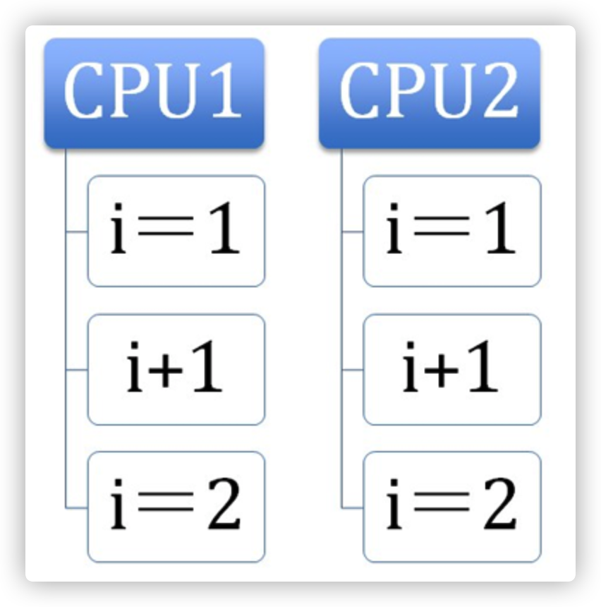
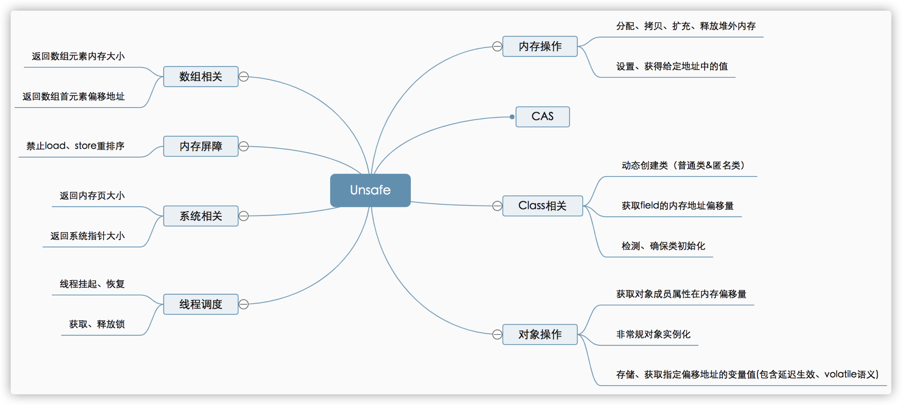
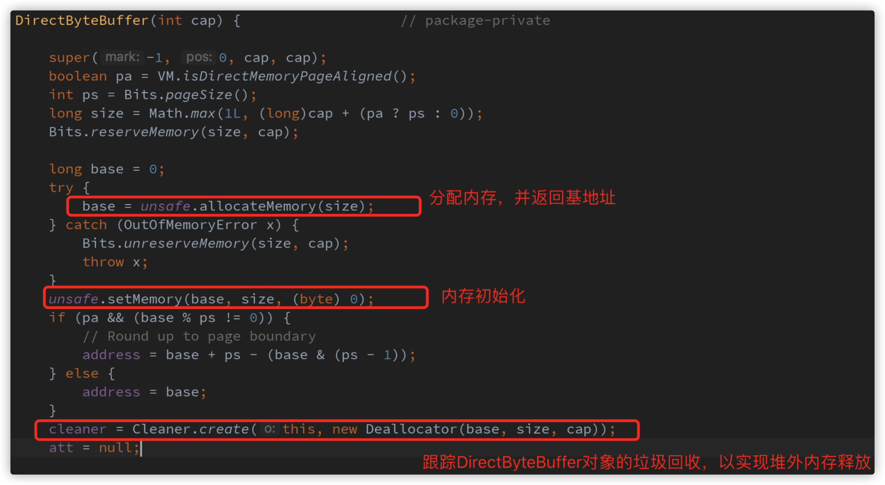
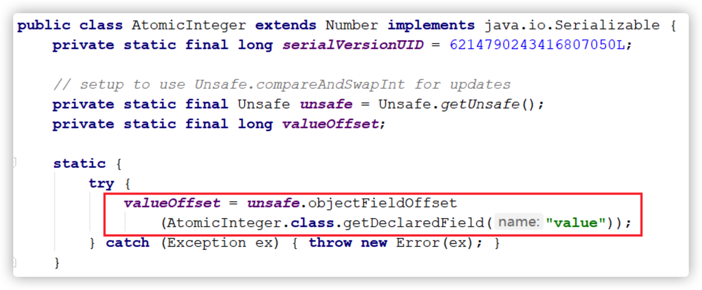
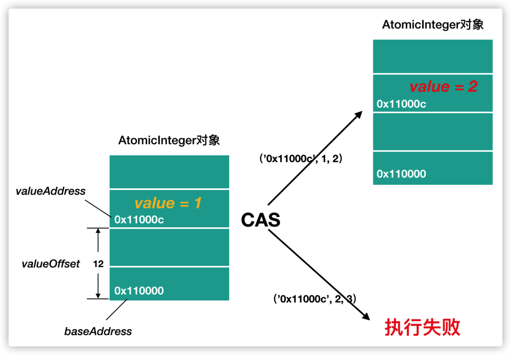
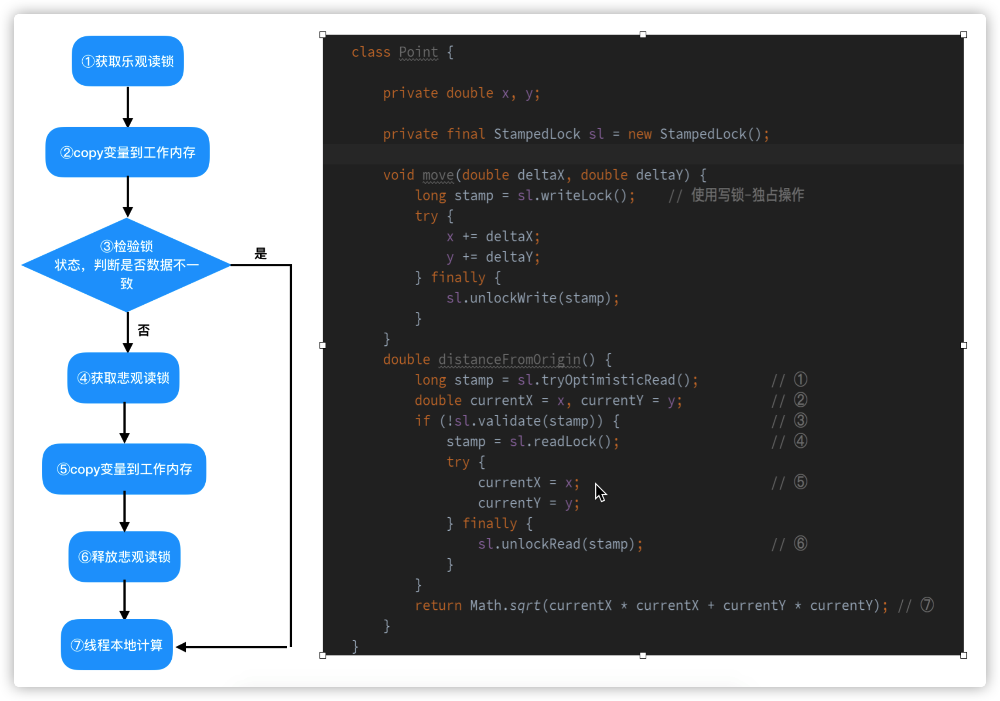
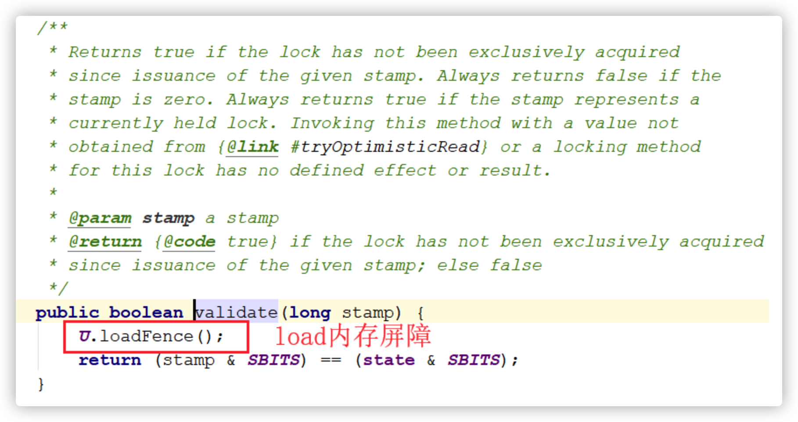

# 并发编程之Atomic&Unsafe魔法类详解

## 1. 原子操作

原子（atom）本意是“不能被进一步分割的最小粒子”，而原子操作（atomic operation）意为”不可被中断的一个或一系列操作” 。在多处理器上实现原子操作就变得有点复杂。本文让我们一起来聊一聊在 Inter 处理器和 Java 里是如何实现原子操作的。

### 1.1 相关术语

|   术语名称   |            英文            | 解释                                                         |
| :----------: | :------------------------: | ------------------------------------------------------------ |
|    缓存行    |         Cache line         | 缓存的最小操作单位                                           |
|  比较并交换  |      Compare and Swap      | CAS 操作需要输入两个数值，一个旧值（期望操作前的值）和一个新值，在操作期间先**比较**下在旧值有没有发生变化，如果没有发生变化，才**交换**成新值，发生了变化则不交换。 |
|  CPU流水线   |        CPU pipeline        | CPU 流水线的工作方式就象工业生产上的装配流水线，在 CPU 中由5~6个不同功能的电路单元组成一条指令处理流水线，然后将一条 X86 指令分成5~6步后再由这些电路单元分别执行，这样就能实现在一个 CPU 时钟周期完成一条指令，因此提高CPU的运算速度。 |
| 内存顺序冲突 | **Memory order violation** | 内存顺序冲突一般是由假共享引起，假共享是指多个CPU同时修改同一个缓存行的不同部分而引起其中一个 CPU 的操作无效，当出现这个内存顺序冲突时，CPU 必须清空流水线。 |

### 1.2 处理器如何实现原子操作

32位 IA-32 处理器使用**基于对缓存加锁或总线加锁**的方式来实现多处理器之间的原子操作。

#### 处理器自动保证基本内存操作的原子性

**首先处理器会自动保证基本的内存操作的原子性**。处理器保证从系统内存当中读取或者写入一个字节是原子的，意思是当一个处理器读取一个字节时，其他处理器不能访问这个字节的内存地址。奔腾6和最新的处理器能自动保证单处理器对同一个缓存行里进行16/32/64位的操作是原子的，但是复杂的内存操作处理器不能自动保证其原子性，比如跨总线宽度，跨多个缓存行，跨页表的访问。但是处理器提供总线锁定和缓存锁定两个机制来保证复杂内存操作的原子性。

#### 使用总线锁保证原子性

**第一个机制是通过总线锁保证原子性**。如果多个处理器同时对共享变量进行读改写（ i++ 就是经典的读改写操作）操作，那么共享变量就会被多个处理器同时进行操作，这样读改写操作就不是原子的，操作完之后共享变量的值会和期望的不一致，举个例子：如果 i=1 ,我们进行两次 i++ 操作，我们期望的结果是3，但是有可能结果是2。如下图：

原因是有可能多个处理器同时从各自的缓存中读取变量 i，分别进行加一操作，然后分别写入系统内存当中。那么想要保证读改写共享变量的操作是原子的，就必须保证 CPU1 读改写共享变量的时候，CPU2 不能操作缓存了该共享变量内存地址的缓存。

**处理器使用总线锁就是来解决这个问题的**。所谓总线锁就是使用处理器提供的一个 LOCK＃信号，当一个处理器在总线上输出此信号时，其他处理器的请求将被阻塞住,那么该处理器可以独占使用共享内存。

#### 使用缓存锁保证原子性

**第二个机制是通过缓存锁定保证原子性**。在同一时刻我们只需保证对某个内存地址的操作是原子性即可，但总线锁定把CPU和内存之间通信锁住了，这使得锁定期间，其他处理器不能操作其他内存地址的数据，所以总线锁定的开销比较大，最近的处理器在某些场合下使用缓存锁定代替总线锁定来进行优化。

频繁使用的内存会缓存在处理器的 L1，L2 和 L3 高速缓存里，那么原子操作就可以直接在处理器内部缓存中进行，并不需要声明总线锁，在奔腾6和最近的处理器中可以使用“缓存锁定”的方式来实现复杂的原子性。所谓“缓存锁定”就是如果缓存在处理器缓存行中内存区域在 LOCK 操作期间被锁定，当它执行锁操作回写内存时，处理器不在总线上声言 LOCK＃信号，而是修改内部的内存地址，并允许它的缓存一致性机制来保证操作的原子性，因为缓存一致性机制会阻止同时修改被两个以上处理器缓存的内存区域数据，当其他处理器回写已被锁定的缓存行的数据时会起缓存行无效，在例1中，当 CPU1 修改缓存行中的i时使用缓存锁定，那么 CPU2 就不能同时缓存了i的缓存行。

**但是有两种情况下处理器不会使用缓存锁定**。第一种情况是：当操作的数据不能被缓存在处理器内部，或操作的数据跨多个缓存行（cache line），则处理器会调用总线锁定。第二种情况是：有些处理器不支持缓存锁定。对于 Inter486 和奔腾处理器,就算锁定的内存区域在处理器的缓存行中也会调用总线锁定。

以上两个机制我们可以通过Inter处理器提供了很多 LOCK 前缀的指令来实现。比如位测试和修改指令 BTS，BTR，BTC，交换指令 XADD，CMPXCHG 和其他一些操作数和逻辑指令，比如 ADD（加），OR（或）等，被这些指令操作的内存区域就会加锁，导致其他处理器不能同时访问它。

#### Java当中如何实现原子操作

在 java 中可以通过**锁**和**循环 CAS** 的方式来实现原子操作。

JVM 中的CAS 操作正是利用了上文中提到的处理器提供的 CMPXCHG 指令实现的。自旋 CAS 实现的基本思路就是循环进行 CAS 操作直到成功为止，具体的类可以参见 juc 下的 atomic 包内的原子类。


## 2. Atomic

在 Atomic 包里一共有12个类，四种原子更新方式，分别是原子更新基本类型，原子更新数组，原子更新引用和原子更新字段。Atomic 包里的类基本都是使用 Unsafe 实现的包装类。

**基本类：**AtomicInteger、AtomicLong、AtomicBoolean；

**引用类型：**AtomicReference、AtomicReference的ABA实例、AtomicStampedRerence、AtomicMarkableReference；

**数组类型：**AtomicIntegerArray、AtomicLongArray、AtomicReferenceArray

**属性原子修改器（Updater）**：AtomicIntegerFieldUpdater、AtomicLongFieldUpdater、AtomicReferenceFieldUpdater

### 2.1 原子更新基本类型类

用于通过原子的方式更新基本类型，Atomic包提供了以下三个类：

- AtomicBoolean：原子更新布尔类型。
- AtomicInteger：原子更新整型。
- AtomicLong：原子更新长整型。

AtomicInteger的常用方法如下：

- int addAndGet(int delta) ：以原子方式将输入的数值与实例中的值（AtomicInteger里的value）相加，并返回结果
- boolean compareAndSet(int expect, int update) ：如果输入的数值等于预期值，则以原子方式将该值设置为输入的值。
- int getAndIncrement()：以原子方式将当前值加1，注意：这里返回的是自增前的值。
- void lazySet(int newValue)：最终会设置成 newValue，使用 lazySet 设置值后，可能导致其他线程在之后的一小段时间内还是可以读到旧的值。
- int getAndSet(int newValue)：以原子方式设置为 newValue 的值，并返回旧值。

Atomic包提供了三种基本类型的原子更新，但是Java的基本类型里还有 char，float 和 double 等。那么问题来了，如何原子的更新其他的基本类型呢？Atomic 包里的类基本都是使用 Unsafe 实现的，Unsafe 只提供了三种 CAS 方法，compareAndSwapObject，compareAndSwapInt 和 compareAndSwapLong，再看 AtomicBoolean 源码，发现其是先把 Boolean 转换成整型，再使用 compareAndSwapInt 进行 CAS，所以原子更新 double 也可以用类似的思路来实现。

### 2.2 原子更新数组类

通过原子的方式更新数组里的某个元素，Atomic包提供了以下三个类：

- AtomicIntegerArray：原子更新整型数组里的元素。
- AtomicLongArray：原子更新长整型数组里的元素。
- AtomicReferenceArray：原子更新引用类型数组里的元素。

AtomicIntegerArray类主要是提供原子的方式更新数组里的整型，其常用方法如下

- int addAndGet(int i, int delta)：以原子方式将输入值与数组中索引i的元素相加。
- boolean compareAndSet(int i, int expect, int update)：如果当前值等于预期值，则以原子方式将数组位置i的元素设置成update值。

### 2.3 原子更新引用类型

原子更新基本类型的 AtomicInteger，只能更新一个变量，如果要原子的更新多个变量，就需要使用这个原子更新引用类型提供的类。Atomic 包提供了以下三个类：

- AtomicReference：原子更新引用类型。
- AtomicReferenceFieldUpdater：原子更新引用类型里的字段。
- AtomicMarkableReference：原子更新带有标记位的引用类型。可以原子的更新一个布尔类型的标记位和引用类型。构造方法是AtomicMarkableReference(V initialRef, boolean initialMark)

### 2.4 原子更新字段类

​    如果我们只需要某个类里的某个字段，那么就需要使用原子更新字段类，Atomic 包提供了以下三个类：

- AtomicIntegerFieldUpdater：原子更新整型的字段的更新器。
- AtomicLongFieldUpdater：原子更新长整型字段的更新器。
- AtomicStampedReference：原子更新带有版本号的引用类型。该类将整数值与引用关联起来，可用于原子的更数据和数据的版本号，可以解决使用 CAS 进行原子更新时，可能出现的ABA问题。

原子更新字段类都是抽象类，每次使用都时候必须使用静态方法 newUpdater 创建一个更新器。原子更新类的字段的必须使用 public volatile 修饰符。


## 3. Unsafe应用解析

Unsafe是位于 `sun.misc` 包下的一个类，主要提供一些用于执行低级别、不安全操作的方法，如直接访问系统内存资源、自主管理内存资源等，这些方法在提升Java运行效率、增强 Java 语言底层资源操作能力方面起到了很大的作用。但由于 Unsafe 类使 Java 语言拥有了类似C语言指针一样操作内存空间的能力，这无疑也增加了程序发生相关指针问题的风险。在程序中过度、不正确使用Unsafe类会使得程序出错的概率变大，使得 Java 这种安全的语言变得不再“安全”，因此对Unsafe的使用一定要慎重。

Unsafe 类为一单例实现，提供静态方法 getUnsafe 获取 Unsafe 实例，当且仅当调用 getUnsafe 方法的类为引导类加载器所加载时才合法，否则抛出 SecurityException 异常。

```java
public class Unsafe {
    // 单例对象
    private static final Unsafe theUnsafe;

    private Unsafe() {
    }

    @CallerSensitive
    public static Unsafe getUnsafe() {
        Class var0 = Reflection.getCallerClass();
        // 仅在引导类加载器BootstrapClassLoader加载时才合法
        if(!VM.isSystemDomainLoader(var0.getClassLoader())) {
          	throw new SecurityException("Unsafe");
        } else {
          	return theUnsafe;
        }
    }
}
```

#### 如何获取Unsafe实例？

1. 从 getUnsafe 方法的使用限制条件出发，通过 Java 命令行命令 `-Xbootclasspath/a` 把调用 Unsafe 相关方法的类 A 所在 jar 包路径追加到默认的 bootstrap 路径中，使得A被引导类加载器加载，从而通过 Unsafe.getUnsafe 方法安全的获取 Unsafe 实例。

```java
java -Xbootclasspath/a:${path}   // 其中path为调用Unsafe相关方法的类所在jar包路径 
```

2. 通过反射获取单例对象 theUnsafe。

```java
public class UnsafeInstance {

    public static Unsafe reflectGetUnsafe() {
        try {
            Field field = Unsafe.class.getDeclaredField("theUnsafe");
            field.setAccessible(true);
            return (Unsafe) field.get(null);
        } catch (Exception e) {
          	e.printStackTrace();
        }
        return null;
    }
}
```

### 3.1 Unsafe功能介绍

Unsafe 提供的 API 大致可分为内存操作、CAS、Class 相关、对象操作、线程调度、系统信息获取、内存屏障、数组操作等几类，下面将对其相关方法和应用场景进行详细介绍。



#### 内存操作

这部分主要包含堆外内存的分配、拷贝、释放、给定地址值操作等方法。

```java
// 分配内存, 相当于C++的malloc函数
public native long allocateMemory(long bytes);

// 扩充内存
public native long reallocateMemory(long address, long bytes);

// 释放内存
public native void freeMemory(long address);

//在 给定的内存块中设置值
public native void setMemory(Object o, long offset, long bytes, byte value);

// 内存拷贝
public native void copyMemory(Object srcBase, long srcOffset, Object destBase, long destOffset, long bytes);

// 获取给定地址值，忽略修饰限定符的访问限制。与此类似操作还有：getInt、getDouble、getLong、getChar等
public native Object getObject(Object o, long offset);

// 为给定地址设置值，忽略修饰限定符的访问限制，与此类似操作还有：putInt、putDouble、putLong、putChar等
public native void putObject(Object o, long offset, Object x);

public native byte getByte(long address);

//为给定地址设置byte类型的值（当且仅当该内存地址为allocateMemory分配时，此方法结果才是确定的）
public native void putByte(long address, byte x);
```

通常，我们在 Java 中创建的对象都处于堆内内存（heap）中，堆内内存是由 JVM 所管控的 Java 进程内存，并且它们遵循 JVM 的内存管理机制，JVM 会采用垃圾回收机制统一管理堆内存。与之相对的是堆外内存，存在于 JVM 管控之外的内存区域，Java 中对堆外内存的操作，依赖于 Unsafe 提供的操作堆外内存的 native 方法。

#### 使用堆外内存的原因

- 对垃圾回收停顿的改善。由于堆外内存是直接受操作系统管理而不是JVM，所以当我们使用堆外内存时，即可保持较小的堆内内存规模。从而在 GC 时减少回收停顿对于应用的影响。
- 提升程序 I/O 操作的性能。通常在 I/O 通信过程中，会存在堆内内存到堆外内存的数据拷贝操作，对于需要频繁进行内存间数据拷贝且生命周期较短的暂存数据，都建议存储到堆外内存。

#### 典型应用

DirectByteBuffer 是 Java 用于实现堆外内存的一个重要类，通常用在通信过程中做缓冲池，如在 Netty、MINA 等 NIO 框架中应用广泛。DirectByteBuffer 对于堆外内存的创建、使用、销毁等逻辑均由 Unsafe 提供的堆外内存 API 来实现。

下图为 DirectByteBuffer 构造函数，创建 DirectByteBuffer 的时候，通过 Unsafe.allocateMemory 分配内存、Unsafe.setMemory 进行内存初始化，而后构建 Cleaner 对象用于跟踪 DirectByteBuffer 对象的垃圾回收，以实现当 DirectByteBuffer 被垃圾回收时，分配的堆外内存一起被释放。



### 3.2 CAS相关

如下源代码释义所示，这部分主要为 CAS 相关操作的方法。

```java
/**
 *
 * CAS
 * @param o         包含要修改field的对象
 * @param offset    对象中某field的偏移量
 * @param expected  期望值
 * @param update    更新值
 * @return          true | false
 */
public final native boolean compareAndSwapObject(Object var1, long var2, Object var4, Object var5);

public final native boolean compareAndSwapInt(Object var1, long var2, int var4, int var5);

public final native boolean compareAndSwapLong(Object var1, long var2, long var4, long var6);
```

#### 典型应用

如下图所示，AtomicInteger 的实现中，静态字段 valueOffset 即为字段 value 的内存偏移地址，valueOffset 的值在 AtomicInteger 初始化时，在静态代码块中通过 Unsafe 的 objectFieldOffset 方法获取。在 AtomicInteger 中提供的线程安全方法中，通过字段 valueOffset 的值可以定位到 AtomicInteger 对象中value的内存地址，从而可以根据 CAS 实现对 value 字段的原子操作。



下图为某个 AtomicInteger 对象自增操作前后的内存示意图，对象的基地址 `baseAddress = "0x110000"`，通过 `baseAddress + valueOffset` 得到 value 的内存地址 `valueAddress = "0x11000c"`；然后通过CAS进行原子性的更新操作，成功则返回，否则继续重试，直到更新成功为止。



### 3.3 线程调度

包括线程挂起、恢复、锁机制等方法。

```java
// 取消阻塞线程
public native void unpark(Object thread);

// 阻塞线程
public native void park(boolean isAbsolute, long time);

// 获得对象锁（可重入锁）
@Deprecated
public native void monitorEnter(Object o);

// 释放对象锁
@Deprecated
public native void monitorExit(Object o);

// 尝试获取对象锁
@Deprecated
public native boolean tryMonitorEnter(Object o);
```

方法 park、unpark 即可实现线程的挂起与恢复，将一个线程进行挂起是通过park方法实现的，调用 park 方法后，线程将一直阻塞直到超时或者中断等条件出现；unpark 可以终止一个挂起的线程，使其恢复正常。

#### 典型应用

Java 锁和同步器框架的核心类 AbstractQueuedSynchronizer，就是通过调用 **`LockSupport.park()`** 和**`LockSupport.unpark()`** 实现线程的阻塞和唤醒的，而 LockSupport 的 park、unpark 方法实际是调用 Unsafe 的 park、unpark 方式来实现。

### 3.4 内存屏障

在Java 8中引入，用于定义内存屏障（也称内存栅栏，内存栅障，屏障指令等，是一类同步屏障指令，是CPU或编译器在对内存随机访问的操作中的一个同步点，使得此点之前的所有读写操作都执行后才可以开始执行此点之后的操作），避免代码重排序。

```java
//内存屏障，禁止load操作重排序。屏障前的load操作不能被重排序到屏障后，屏障后的load操作不能被重排序到屏障前
public native void loadFence();

// 内存屏障，禁止store操作重排序。屏障前的store操作不能被重排序到屏障后，屏障后的store操作不能被重排序到屏障前
public native void storeFence();

// 内存屏障，禁止load、store操作重排序
public native void fullFence();
```

#### 典型应用

在 Java 8 中引入了一种锁的新机制——StampedLock，它可以看成是读写锁的一个改进版本。StampedLock 提供了一种乐观读锁的实现，这种乐观读锁类似于无锁的操作，完全不会阻塞写线程获取写锁，从而缓解读多写少时写线程“饥饿”现象。由于 StampedLock 提供的乐观读锁不阻塞写线程获取读锁，当线程共享变量从主内存load到线程工作内存时，会存在数据不一致问题，所以当使用 StampedLock 的乐观读锁时，需要遵从如下图用例中使用的模式来确保数据的一致性。



如上图用例所示计算坐标点 Point 对象，包含点移动方法 move 及计算此点到原点的距离的方法 distanceFromOrigin。在方法 distanceFromOrigin 中，首先，通过 tryOptimisticRead 方法获取乐观读标记；然后从主内存中加载点的坐标值 (x,y)；而后通过 StampedLock 的 validate 方法校验锁状态，判断坐标点 (x,y) 从主内存加载到线程工作内存过程中，主内存的值是否已被其他线程通过 move 方法修改，如果validate返回值为 true，证明 (x, y) 的值未被修改，可参与后续计算；否则，需加悲观读锁，再次从主内存加载(x,y)的最新值，然后再进行距离计算。其中，校验锁状态这步操作至关重要，需要判断锁状态是否发生改变，从而判断之前 copy 到线程工作内存中的值是否与主内存的值存在不一致。

下图为 StampedLock.validate 方法的源码实现，通过锁标记与相关常量进行位运算、比较来校验锁状态，在校验逻辑之前，会通过 Unsafe 的 loadFence 方法加入一个 load 内存屏障，目的是避免上图用例中步骤②和 StampedLock.validate 中锁状态校验运算发生重排序导致锁状态校验不准确的问题。

