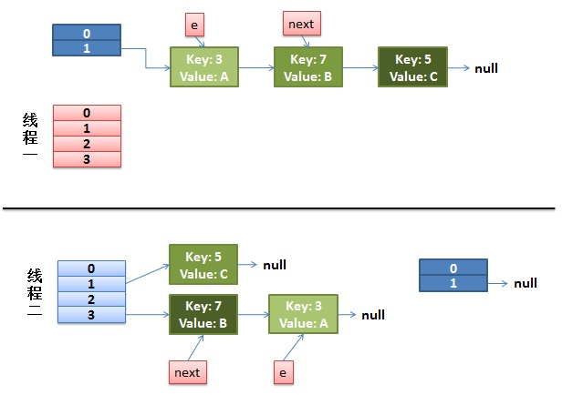
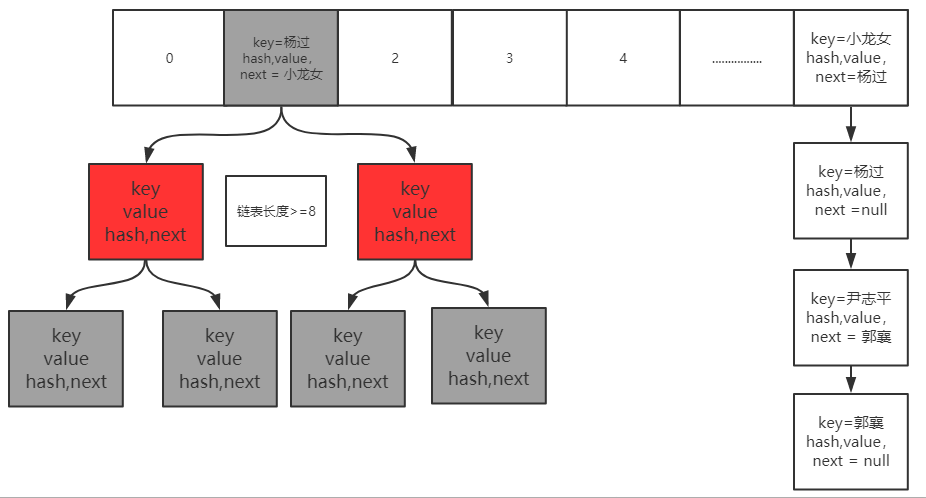
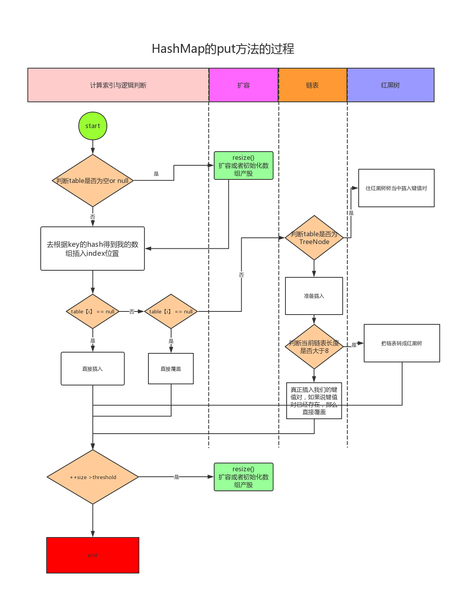

# Collections 之 Map & List & Set详解

## 1. HashMap

### 1.1 数据结构

数组 + 链表 + (红黑树 jdk >= 8)

### 1.2 源码原理分析

##### 重要成员变量

- DEFAULT_INITIAL_CAPACITY = 1 << 4; Hash表默认初始容量
- MAXIMUM_CAPACITY = 1 << 30; 最大Hash表容量
- DEFAULT_LOAD_FACTOR = 0.75f; 默认加载因子
- TREEIFY_THRESHOLD = 8; 链表转红黑树阈值
- UNTREEIFY_THRESHOLD = 6; 红黑树转链表阈值
- MIN_TREEIFY_CAPACITY = 64; 链表转红黑树时hash表最小容量阈值，达不到优先扩容。

HashMap是线程不安全的，不安全的具体原因就是在高并发场景下，扩容可能产生死锁（Jdk1.7存在）以及get操作可能带来的数据丢失。

### 1.3 Jdk7-扩容死锁分析

死锁问题核心在于下面代码，多线程扩容导致形成的链表环!

```java
void transfer(Entry[] newTable, boolean rehash) {
    int newCapacity = newTable.length;
    for (Entry<K,V> e : table) {
        while(null != e) {
            Entry<K,V> next = e.next;		// ①
            if (rehash) {
                e.hash = null == e.key ? 0 : hash(e.key);
            }
            int i = indexFor(e.hash, newCapacity);	// ②
            e.next = newTable[i];		// ③
            newTable[i] = e;	// ④
            e = next;					// ⑤
        }
    }
}
```

去掉了一些冗余的代码， 层次结构更加清晰了。

- ① 记录 oldhash 表中 e.next
- ② rehash 计算出数组的位置（hash 表中桶的位置）
- ③ e要插入链表的头部， 所以要先将 e.next 指向 new hash 表中的第一个元素
- ④ 将 e 放入到 new hash 表的头部
- ⑤ 转移 e 到下一个节点， 继续循环下去

#### 单线程扩容

###### 假设

hash算法就是简单的key与length（数组长度）求余。hash表长度为2，如果不扩容， 那么元素key为3,5,7按照计算（key % table.length）的话都应该碰撞到table[1]上。

###### 扩容

hash表长度会扩容为4重新 hash，key=3 会落到 table[3] 上（3%4=3），当前 e.next 为 key(7), 继续while 循环重新 hash，key=7 会落到 table[3]上（7%4=3），产生碰撞， 这里采用的是头插入法，所以 key=7 的 Entry 会排在 key=3 前面（这里可以具体看 while 语句中代码)当前 e.next 为 key(5), 继续 while 循环重新 hash，key=5 会落到 table[1] 上（5%4=3）， 当前 e.next 为 null，跳出 while 循环，resize结束。

如下图所示


#### 多线程扩容

下面就是多线程同时 put 的情况了， 然后同时进入 transfer 方法中：假设这里有两个线程同时执行了 `put()` 操作，并进入了 `transfer()` 环节

```java
while(null != e) {
      Entry<K,V> next = e.next;		// ① 线程1执行到此被调度挂起
      int i = indexFor(e.hash, newCapacity);		// ②
      e.next = newTable[i];		// ③
      newTable[i] = e;	// ④
      e = next;					// ⑤
}
```

那么此时状态为：



从上面的图我们可以看到，因为线程1的 e 指向了 key(3)，而 next 指向了 key(7)，在线程2 rehash 后，就指向了线程2 rehash 后的链表。

然后线程1被唤醒了：

1. 执行 e.next = newTable[i]，于是 key(3)的 next 指向了线程1的新 Hash 表，因为新 Hash 表为空，所以e.next = null，
2. 执行 newTable[i] = e，所以线程1的新 Hash 表第一个元素指向了线程2新 Hash 表的 key(3)。e 处理完毕。
3. 执行 e = next，将 e 指向 next，所以新的 e 是 key(7)

然后该执行 key(3)的 next 节点 key(7)了：

1. 现在的 e 节点是 key(7)，首先执行Entry<K,V> next = e.next,那么 next 就是 key(3)了
2. 执行e.next = newTable[i]，于是key(7) 的 next 就成了 key(3)
3. 执行newTable[i] = e，那么线程1的新 Hash 表第一个元素变成了 key(7)
4. 执行e = next，将 e 指向 next，所以新的 e 是 key(3)

此时状态为：


然后又该执行 key(7) 的 next 节点 key(3) 了：

1. 现在的 e 节点是 key(3)，首先执行 Entry<K,V> next = e.next，那么 next 就是 null
2. 执行 e.next = newTable[i]，于是key(3) 的 next 就成了 key(7)
3. 执行 newTable[i] = e，那么线程1的新 Hash 表第一个元素变成了 key(3)
4. 执行 e = next，将 e 指向 next，所以新的 e 是 key(7)

这时候的状态如图所示：


很明显，环形链表出现了。

#### Jdk8-扩容

Java8 HashMap扩容跳过了Jdk7扩容的坑，对源码进行了优化，采用高低位拆分转移方式，避免了链表环的产生。

扩容前：



扩容后：


由于Jdk8引入了新的数据结构，所以 put 方法过程也有了一定改进，其过程如下图所示。




## 2. ConcurrentHashMap

### 2.1 数据结构

ConcurrentHashMap 的数据结构与 HashMap 基本类似，区别在于：1、内部在数据写入时加了同步机制(分段锁)保证线程安全，读操作是无锁操作；2、扩容时老数据的转移是并发执行的，这样扩容的效率更高。

### 2.2 并发安全控制

Java7 ConcurrentHashMap 基于 ReentrantLock 实现分段锁


Java8中 ConcurrentHashMap基于分段锁+CAS保证线程安全，分段锁基于synchronized关键字实现；


### 2.3 源码原理分析

#### 重要成员变量

ConcurrentHashMap 拥有出色的性能，其中比较重要的成员如下：

- LOAD_FACTOR：负载因子, 默认75%, 当 table 使用率达到75%时，为减少 table 的 hash 碰撞，tabel 长度将扩容一倍。负载因子计算：元素总个数 %table.lengh
- TREEIFY_THRESHOLD：默认8，当链表长度达到8时，将结构转变为红黑树。
- UNTREEIFY_THRESHOLD：默认6，红黑树转变为链表的阈值。
- MIN_TRANSFER_STRIDE：默认16，table 扩容时，每个线程最少迁移 table 的槽位个数。
- MOVED：值为-1, 当 Node.hash 为 MOVED 时，代表着table正在扩容
- TREEBIN：置为-2，代表此元素后接红黑树。
- nextTable：table 迁移过程临时变量，在迁移过程中将元素全部迁移到nextTable上。
- sizeCtl：用来标志 table 初始化和扩容的，不同的取值代表着不同的含义:

  - 0：table 还没有被初始化

  - -1：table 正在初始化
  - 小于-1：实际值为 resizeStamp(n)<<RESIZE_STAMP_SHIFT+2，表明 table 正在扩容
  - 大于0：初始化完成后，代表table最大存放元素的个数，默认为 0.75*n

- transferIndex：table 容量从 n 扩到 2n 时，是从索引 n->1 的元素开始迁移，transferIndex 代表当前已经迁移的元素下标
- ForwardingNode：一个特殊的 Node 节点, 其 hashcode=MOVED，代表着此时table正在做扩容操作。扩容期间，若 table 某个元素为 null，那么该元素设置为 ForwardingNode，当下个线程向这个元素插入数据时，检查 hashcode=MOVED，就会帮着扩容。

ConcurrentHashMap 由三部分构成，table + 链表 + 红黑树，其中 table 是一个数组，既然是数组，必须要在使用时确定数组的大小，当table存放的元素过多时，就需要扩容，以减少碰撞发生次数，本文就讲解扩容的过程。扩容检查主要发生在插入元素(putVal())的过程:

- 一个线程插完元素后，检查 table 使用率，若超过阈值，调用transfer进行扩容
- 一个线程插入数据时，发现 table 对应元素的 hash=MOVED，那么调用 helpTransfer() 协助扩容。

#### 协助扩容helpTransfer

下面是协助扩容的过程

```java
final Node<K,V>[] helpTransfer(Node<K,V>[] tab, Node<K,V> f) { // table扩容
        Node<K,V>[] nextTab; int sc;
        if (tab != null && (f instanceof ForwardingNode) &&
            (nextTab = ((ForwardingNode<K,V>)f).nextTable) != null) {
            // 根据 length 得到一个标识符号
            int rs = resizeStamp(tab.length);
            while (nextTab == nextTable && table == tab &&
                   (sc = sizeCtl) < 0) {	// 说明还在扩容
                //判断是否标志发生了变化||  扩容结束了
                if ((sc >>> RESIZE_STAMP_SHIFT) != rs || sc == rs + 1 ||
                     // 达到最大的帮助线程 ||  判断扩容转移下标是否在调整（扩容结束）
                    sc == rs + MAX_RESIZERS || transferIndex <= 0)
                    break;
                // 将 sizeCtl + 1, （表示增加了一个线程帮助其扩容）
                if (U.compareAndSwapInt(this, SIZECTL, sc, sc + 1)) {
                    transfer(tab, nextTab);
                    break;
                }
            }
            return nextTab;
        }
        return table;
}
```

主要做了如下事情:

- 检查是否扩容完成

- 对sizeCtrl = sizeCtrl+1，然后调用transfer()进行真正的扩容。

#### 扩容transfer

扩容的整体步骤就是新建一个nextTab，size是之前的2倍，将table上的非空元素迁移到nextTab上面去。

```java
private final void transfer(Node<K,V>[] tab, Node<K,V>[] nextTab) {
    int n = tab.length, stride;
    if ((stride = (NCPU > 1) ? (n >>> 3) / NCPU : n) < MIN_TRANSFER_STRIDE)
       // subdivide range，每个线程最少迁移16个槽位，大的话，最多
        stride = MIN_TRANSFER_STRIDE;
    // initiating 才开始初始化新的nextTab
    if (nextTab == null) {
        try {
            @SuppressWarnings("unchecked")
            Node<K,V>[] nt = (Node<K,V>[])new Node<?,?>[n << 1];  // 扩容2倍
            nextTab = nt;
        } catch (Throwable ex) {      // try to cope with OOME
            sizeCtl = Integer.MAX_VALUE;
            return;
        }
        nextTable = nextTab;
        transferIndex = n;// 更新的转移下标，
    }
    int nextn = nextTab.length;
    ForwardingNode<K,V> fwd = new ForwardingNode<K,V>(nextTab);
    // 是否能够向前推进到下一个周期
    boolean advance = true;
    // to ensure sweep before committing nextTab，完成状态，如果是，则结束此方法
    boolean finishing = false;
    for (int i = 0, bound = 0;;) {
        Node<K,V> f; int fh;
        while (advance) { //取下一个周期
            int nextIndex, nextBound;
            // 本线程处理的区间范围为[bound, i),范围还没有处理完成，那么就继续处理
            if (--i >= bound || finishing)
                advance = false;
            // 目前处理到了这里（从大到小， 下线），开始找新的一轮的区间
            else if ((nextIndex = transferIndex) <= 0) {
                i = -1;
                advance = false;
            }
            // 这个条件改变的是transferIndex的值，从16变成了1
            else if (U.compareAndSwapInt
                     (this, TRANSFERINDEX, nextIndex,
                      // nextBound 是这次迁移任务的边界，注意，是从后往前
                      nextBound = (nextIndex > stride ?
                                   nextIndex - stride : 0))) {
                bound = nextBound; // 一块区间最小桶的下标
                i = nextIndex - 1; // 能够处理的最大桶的下标
                advance = false;
            }
        }
        if (i < 0 || i >= n || i + n >= nextn) { // 每个迁移线程都能达到这里
            int sc;
            if (finishing) { // 迁移完成
                nextTable = null;
                // 直接把以前的table丢弃了，上面的MOVE等标志全部丢弃，使用新的
                table = nextTab;
                sizeCtl = (n << 1) - (n >>> 1); // 扩大2n-0.5n = 1.50n, 更新新的容量阈值
                return;
            }
            // 表示当前线程迁移完成了
            if (U.compareAndSwapInt(this, SIZECTL, sc = sizeCtl, sc - 1)) {
                 // 注意此时sc的值并不等于sizeCtl，上一步，sizeCtl=sizeCtl-1了。这两个对象还是分割的
                if ((sc - 2) != resizeStamp(n) << RESIZE_STAMP_SHIFT)
                    return;
                finishing = advance = true;
                i = n;	// recheck before commit
            }
        }
        // 如果对应位置为null， 则将ForwardingNode放在对应的地方
        else if ((f = tabAt(tab, i)) == null)
            advance = casTabAt(tab, i, null, fwd);
        else if ((fh = f.hash) == MOVED)	// 别的线程已经在处理了，再推进一个下标
            advance = true;		// already processed，推动到下一个周期，仍然会检查i与bound是否结束
        else { // 说明位置上有值了，
            // 需要加锁，防止再向里面放值，在放数据时，也会锁住。比如整个table正在迁移，还没有迁移到这个元素，另外一个线程像这个节点插入数据，此时迁移到这里了，会被阻塞住
            synchronized (f) {
                if (tabAt(tab, i) == f) {	// 判断i下标和f是否相同
                    Node<K,V> ln, hn; 		// 高位桶， 地位桶
                    if (fh >= 0) {
                        int runBit = fh & n;	// n为2^n, 取余后只能是2^n
                        Node<K,V> lastRun = f;
                        // 找到最后一个不和fn相同的节点
                        for (Node<K,V> p = f.next; p != null; p = p.next) {
                            int b = p.hash & n;
                            // 只要找到这，之后的取值都是一样的，下次循环时，就不用再循环后面的
                            if (b != runBit) {
                                runBit = b;
                                lastRun = p;
                            }
                        }
                        if (runBit == 0) {
                            ln = lastRun;
                            hn = null;
                        }
                        else { 	// 比如1，16，32,如果低位%16，那么肯定是0。
                            hn = lastRun;
                            ln = null;
                        }
                        for (Node<K,V> p = f; p != lastRun; p = p.next) {
                            int ph = p.hash; K pk = p.key; V pv = p.val;
                            if ((ph & n) == 0)
                                // 这样就把相同串的给串起来了
                                ln = new Node<K,V>(ph, pk, pv, ln);
                            else
                                // 这样就把相同串的给串起来了，注意这里ln用法，第一个next为null，烦着串起来了。
                                hn = new Node<K,V>(ph, pk, pv, hn);
                        }
                        setTabAt(nextTab, i, ln); 	// 反着给串起来了
                        setTabAt(nextTab, i + n, hn);
                        setTabAt(tab, i, fwd);
                        advance = true;
                    }
                    else if (f instanceof TreeBin) {	// 如果是红黑树
                        TreeBin<K,V> t = (TreeBin<K,V>)f;
                        TreeNode<K,V> lo = null, loTail = null; // 也是高低节点
                        TreeNode<K,V> hi = null, hiTail = null;	// 也是高低节点
                        int lc = 0, hc = 0;
                        for (Node<K,V> e = t.first; e != null; e = e.next) { //中序遍历红黑树
                            int h = e.hash;
                            TreeNode<K,V> p = new TreeNode<K,V>
                                (h, e.key, e.val, null, null);
                            if ((h & n) == 0) { //0的放低位
                                //注意这里p.prev = loTail，每一个p都是下一个的prev
                                if ((p.prev = loTail) == null)
                                    lo = p; // 把头记住
                                else
                                    loTail.next = p;  // 上一次的p的next是这次的p
                                loTail = p; // 把上次p给记住
                                ++lc;
                            }
                            else { // 高位
                                if ((p.prev = hiTail) == null)
                                    hi = p; // 把尾记住
                                else
                                    hiTail.next = p;
                                hiTail = p;
                                ++hc;
                            }
                        }
                      	// 判断是否需要转化为树
                        ln = (lc <= UNTREEIFY_THRESHOLD) ? untreeify(lo) :
                            (hc != 0) ? new TreeBin<K,V>(lo) : t; // 如果没有高低的话，则部分为两个树
                        hn = (hc <= UNTREEIFY_THRESHOLD) ? untreeify(hi) :
                            (lc != 0) ? new TreeBin<K,V>(hi) : t;
                        setTabAt(nextTab, i, ln);
                        setTabAt(nextTab, i + n, hn);
                        setTabAt(tab, i, fwd);
                        advance = true;
                    }
                }
            }
        }
    }
}
```

其中有两个变量需要了解下：

- advance：表示是否可以向下一个轮元素进行迁移。
- finishing：table所有元素是否迁移完成。

大致做了如下事情：

- 确定线程每轮迁移元素的个数stride, 比如进来一个线程, 确定扩容table下标为 (a,b] 之间元素，下一个线程扩容(b,c]。这里对 b-a 或者 c-b 也是由最小值16限制的。 也就是说每个线程最少扩容连续16个 table 的元素。而标志当前迁移的下标保存在 transferIndex 里面。
- 检查 nextTab 是否完成初始化，若没有的话，说明是第一个迁移的线程，先初始化 nextTab，size是之前table的2倍。
- 进入while循环查找本轮迁移的table下标元素区间，保存在 (bound, i] 中，注意这里是半开半闭区间。
- 从i -> bound开始遍历table中每个元素，这里是从大到小遍历的:

    1. 若该元素为空，则向该元素标写入ForwardingNode，然后检查下一个元素。 当别的线程向这个元素插入数据时，根据这个标志符知道了 table 正在被别的线程迁移，在 putVal 中就会调用 helpTransfer 帮着迁移。

    2. 若该元素的 hash=MOVED，代表次 table 正在处于迁移之中，跳过。 按道理不会跑着这里的。

    3. 否则说明该元素跟着的是一个链表或者是个红黑树结构，若 hash>0，则说明是个链表，若 f instanceof TreeBin，则说明是个红黑树结构。

        - 链表迁移原理如下：遍历链表每个节点。若节点的f.hash&n==0成立，则将节点放在i，否则，则将节点放在n+i上面。

            迁移前，对该元素进行加锁。遍历链表时，这里使用 lastRun 变量，保留的是上次 hash 的值，假如整个链表全部节点 f.hash&n==0，那么第二次遍历，只要找到 lastRun 的值，那么认为之后的节点都是相同值，减少了不必要的f.hash&n 取值。遍历完所有的节点后，此时形成了两条链表，ln 存放的是 f.hash&n=0 的节点，hn 存放的是非0的节点，然后将 ln 存放在 nextTable 第 i 元素的位置，n+i 存放在 n+i 的位置。

            蓝色节点代表：f.hash&n==0，绿色节点代表 f.hash&n!=0。 最终蓝色的节点仍在存放在 (0, n) 范围里，绿的节点存放在 (n, 2n-1) 的范围之内。

        - 迁移链表和红黑树的原理是一样的，在红黑树中, 我们记录了每个红黑树的 first（这个节点不是hash最小的节点）和每个节点的 next，根据这两个元素，我们可以访问红黑树所有的元素，红黑树此时也是一个链表，红黑树和链表迁移的过程一样。红黑树根据迁移后拆分成了 hn 和 ln，根据链表长度确定链表是红黑树结构还是退化为了链表。

    4. 如何确定table所有元素迁移完成:

```java
// 表示当前线程迁移完成了
if (U.compareAndSwapInt(this, SIZECTL, sc = sizeCtl, sc - 1)) {
     // 注意此时sc的值并不等于sizeCtl，上一步 sizeCtl=sizeCtl-1。这两个对象还是分割的
    if ((sc - 2) != resizeStamp(n) << RESIZE_STAMP_SHIFT)
        return;
    finishing = advance = true;
    i = n;		// recheck before commit
}
```

第一个线程开始迁移时, 设置了sizeCtl= resizeStamp(n) << RESIZE_STAMP_SHIFT+2, 此后每个新来帮助迁移的线程都会sizeCtl=sizeCtl+1, 完成迁移后,sizeCtl-1, 那么只要有一个线程还处于迁移状态, 那么sizeCtl> resizeStamp(n) << RESIZE_STAMP_SHIFT+2一直成立, 当只有最后一个线程完成迁移之后, 等式两边才成立。 可能大家会有疑问, 第一个线程并没有对sizeCtl=sizeCtl+1, 此时完成后再减一, 那不是不相等了吗, 注意这里, sizeCtl在减一前, 将值赋给了sc, 等式比较的是sc。

#### 总结

table扩容过程就是将table元素迁移到新的table上, 在元素迁移时, 可以并发完成, 加快了迁移速度, 同时不至于阻塞线程。所有元素迁移完成后, 旧的table直接丢失, 直接使用新的table。


## 3. CopyOnWrite机制

核心思想：读写分离，空间换时间，避免为保证并发安全导致的激烈的锁竞争。

1. CopyOnWrite适用于读多写少的情况，最大程度的提高读的效率；

2. CopyOnWrite是最终一致性，在写的过程中，原有的读的数据是不会发生更新的，只有新的读才能读到最新数据；

3. 如何使其他线程能够及时读到新的数据，需要使用volatile变量；

4. 写的时候不能并发写，需要对写操作进行加锁；


#### 源码原理

写时复制

```java
/*
 * 添加元素api
 */
public boolean add(E e) {
    final ReentrantLock lock = this.lock;
    lock.lock();
    try {
        Object[] elements = getArray();
        int len = elements.length;
        Object[] newElements = Arrays.copyOf(elements, len + 1); 	// 复制一个array副本
        newElements[len] = e; 	// 往副本里写入
        setArray(newElements); 	// 副本替换原本，成为新的原本
        return true;
    } finally {
        lock.unlock();
    }
}

// 读api
public E get(int index) {
    return get(getArray(), index); 	// 无锁
}
```