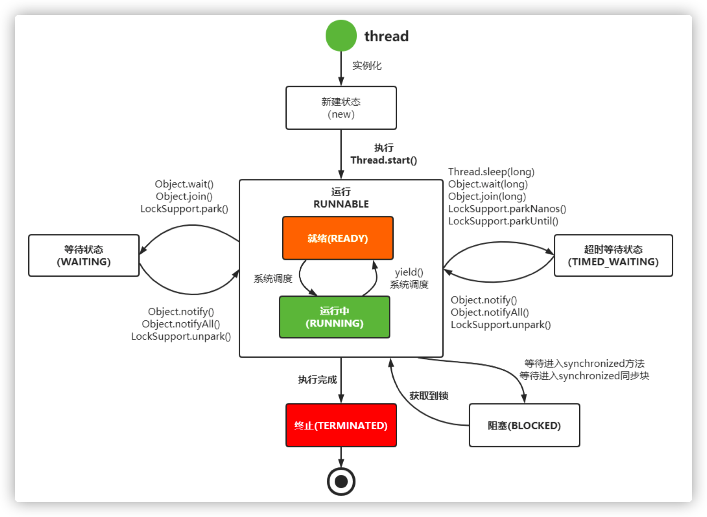
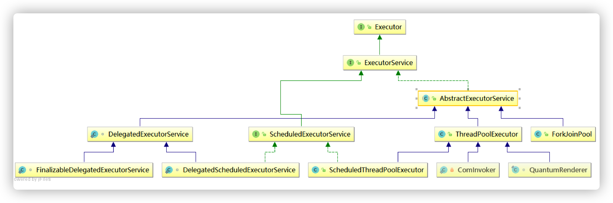
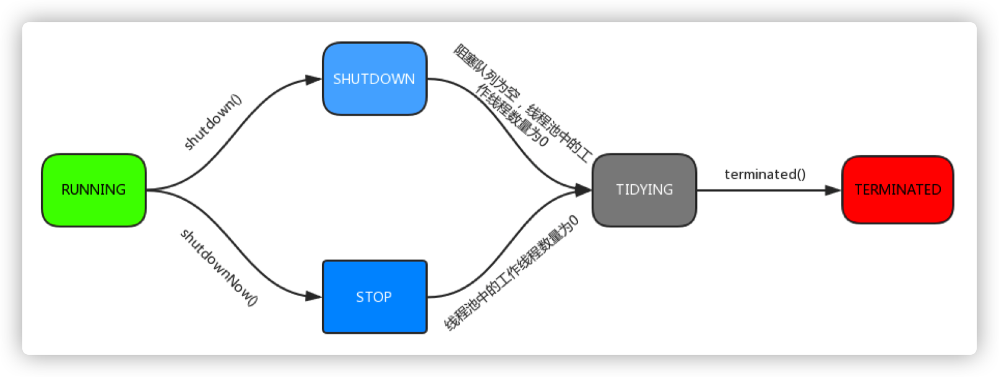
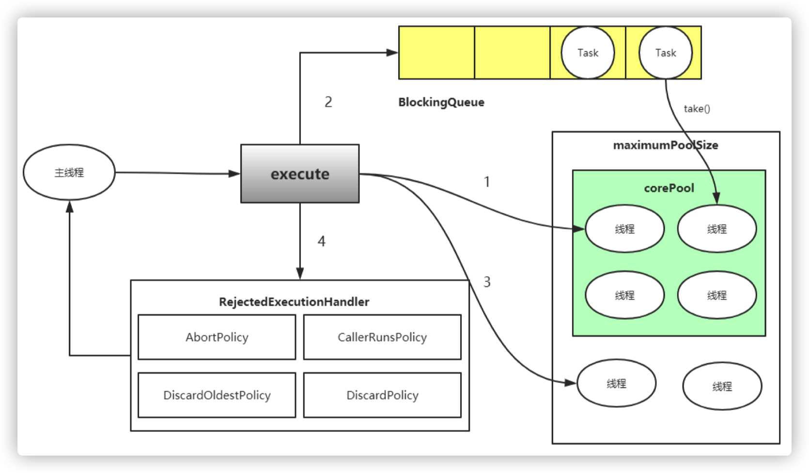
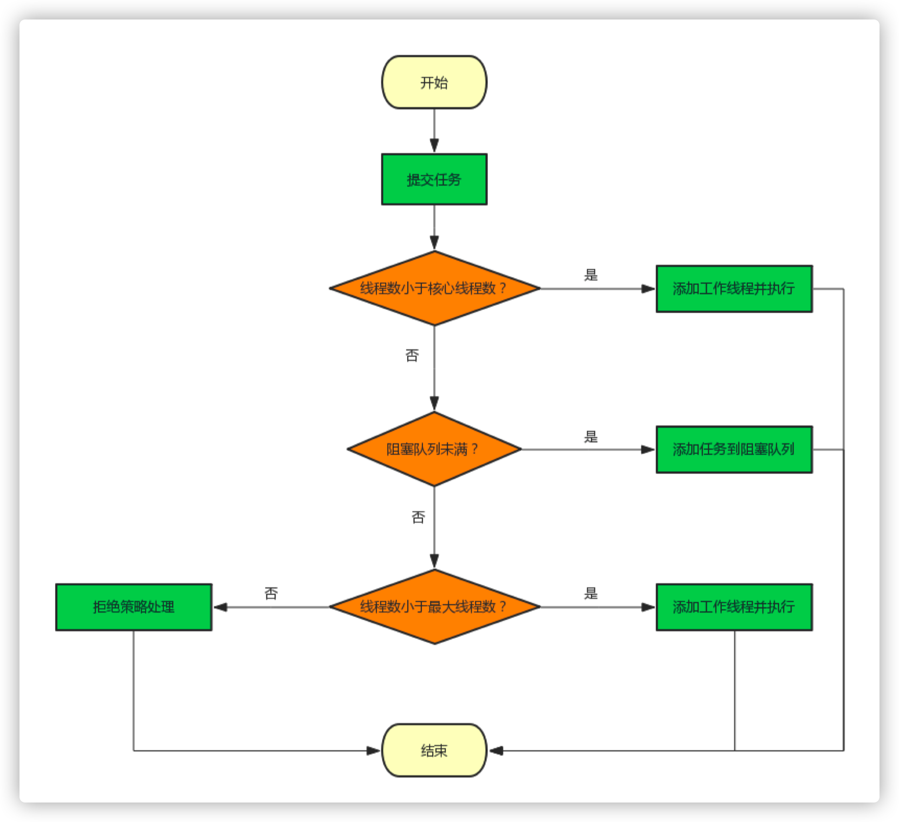
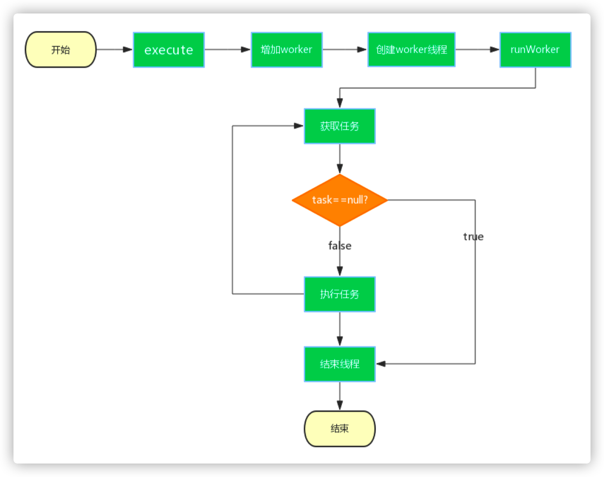

# Executor线程池原理与源码

## 1. 线程

线程是调度 CPU 资源的最小单位，线程模型分为 KLT 模型与 ULT 模型，JVM 使用的 KLT 模 型，Java 线程与 OS 线程保持 1:1 的映射关系，也就是说有一个 java 线程也会在操作系统里有 一个对应的线程。Java 线程有多种生命状态

- NEW,新建

- RUNNABLE，运行

- BLOCKED，阻塞

- WAITING，等待

- TIMED_WAITING，超时等待

- TERMINATED，终结

状态切换如下图所示：




## 2. 协程

协程 (纤程，用户级线程)，目的是为了追求最大力度的发挥硬件性能和提升软件的速 度，协程基本原理是：在某个点挂起当前的任务，并且保存栈信息，去执行另一个任务；等完成或达到某个条件时，再还原原来的栈信息并继续执行(整个过程线程不需要上下文切换)。

> Java原生不支持协程，在纯 java 代码里需要使用协程的话需要引入第三方包,如：quasar


## 3. 线程池

“线程池”，顾名思义就是一个线程缓存，线程是稀缺资源，如果被无限制的创建，不仅会消耗系统资源，还会降低系统的稳定性，因此Java中提供线程池对线程进行统一分配、调优和监控

### 3.1 线程池介绍

在web开发中，服务器需要接受并处理请求，所以会为一个请求来分配一个线程来进行处理。如果每次请求都新创建一个线程的话实现起来非常简便，但是存在一个问题：**如果并发的请求数量非常多，但每个线程执行的时间很短，这样就会频繁的创建和销毁线程，如此一来会大大降低系统的效率。可能出现服务器在为每个请求创建新线程和销毁线 程上花费的时间和消耗的系统资源要比处理实际的用户请求的时间和资源更多。**

那么有没有一种办法使执行完一个任务，并不被销毁，而是可以继续执行其他的任务呢？

这就是线程池的目的了。线程池为线程生命周期的开销和资源不足问题提供了解决方案。通过对多个任务重用线程，线程创建的开销被分摊到了多个任务上。

##### 什么时候使用线程池？

- 单个任务处理时间比较短

- 需要处理的任务数量很大

##### 线程池优势

- 重用存在的线程，减少线程创建，消亡的开销，提高性能；

- 提高响应速度。当任务到达时，任务可以不需要的等到线程创建就能立即执行；

- 提高线程的可管理性。线程是稀缺资源，如果无限制的创建，不仅会消耗系统资源，还会降低系统的稳定性，使用线程池可以进行统一的分配，调优和监控。

### 3.2 线程的实现方式

#### Runnable,Thread,Callable

```java
// 实现Runnable接口的类将被Thread执行，表示一个基本的任务
public interface Runnable {
    // run方法就是它所有的内容，就是实际执行的任务
    public abstract void run();
}

//Callable同样是任务，与Runnable接口的区别在于它接收泛型，同时它执行 任务后带有返回内容
public interface Callable<V> {
    // 相对于run方法的带有返回值的call方法
    V call() throws Exception;
}
```

#### Executor框架

Executor 接口是线程池框架中最基础的部分，定义了一个用于执行 Runnable 的 execute 方法。下图为它的继承与实现 



从图中可以看出Executor下有一个重要子接口ExecutorService，其中定义了线程池的具体 行为

- `execute(Runnable command)`：履行 Ruannable 类型的任务
- `submit(task)`：可用来提交 Callable 或 Runnable 任务，并返回代表此任务的 Future 对象
- `shutdown()`：在完成已提交的任务后封闭办事，不再接管新任务
- `shutdownNow()`：停止所有正在履行的任务并封闭办事
- `isTerminated()`：测试是否所有任务都履行完毕了
- `isShutdown()`：测试是否该 ExecutorService 已被关闭。

### 3.3 线程池重点属性

```java
private final AtomicInteger ctl = new AtomicInteger(ctlOf(RUNNING, 0));
private static final int COUNT_BITS = Integer.SIZE - 3;
private static final int CAPACITY = (1 << COUNT_BITS) - 1;
```

ctl是对线程池的运行状态和线程池中有效线程的数量进行控制的一个字段，它包含两部分的信息：

- 线程池的运行状态 runState
- 线程池内有效线程的数量 workerCount

这里可以看到，使用了 Integer 类型来保存，高3位保存 runState，低29位保存 workerCount。COUNT_BITS 就是29，CAPACITY 就是1左移29位减1（29个1），这个常量表示 workerCount 的上限值，大约是5亿。

### 3.4 ctl相关方法

```java
private static int runStateOf(int c) { return c & ~CAPACITY; }
private static int workerCountOf(int c) { return c & CAPACITY; }
private static int ctlOf(int rs, int wc) { return rs | wc; }
```

- runStateOf：获取运行状态； 
- workerCountOf：获取活动线程数；
- ctlOf：获取运行状态和活动线程数的值。

线程池存在5种状态

```java
RUNNING = ‐1 << COUNT_BITS; //高3位为111

SHUTDOWN = 0 << COUNT_BITS; //高3位为000

STOP = 1 << COUNT_BITS; //高3位为001

TIDYING = 2 << COUNT_BITS; //高3位为010

TERMINATED = 3 << COUNT_BITS; //高3位为011
```

- RUNNING
    - 状态说明：线程池处在 RUNNING 状态时，能够接收新任务，以及对已添加的任务进行处理。
    - 状态切换：线程池的初始化状态是 RUNNING。换句话说，线程池被一旦被创建，就处于 RUNNING 状态，并且线程池中的任务数为0！

-  SHUTDOWN
    - 状态说明：线程池处在 SHUTDOWN 状态时，不接收新任务，但能处理已添加的任务。
    - 状态切换：调用线程池的 `shutdown()` 接口时，线程池由 `RUNNING -> SHUTDOWN`。

- STOP
    - 状态说明：线程池处在 STOP 状态时，不接收新任务，不处理已添加的任务，并且会中断正在处理的任务。
    - 状态切换：调用线程池的 `shutdownNow()` 接口时，线程池由 `(RUNNING or SHUTDOWN ) -> STOP`。

- TIDYING
    - 状态说明：当所有的任务已终止，ctl 记录的”任务数量”为0，线程池会变为 TIDYING 状态。当线程池变为TIDYING 状态时，会执行钩子函数 `terminated()`。`terminated()` 在 ThreadPoolExecutor 类中是空的，若用户想在线程池变为 TIDYING 时，进行相应的处理； 可以通过重载 `terminated()` 函数来实现
    - 状态切换：当线程池在 SHUTDOWN 状态下，阻塞队列为空并且线程池中执行的任务也 为空时，就会由 `SHUTDOWN -> TIDYING`。 当线程池在 STOP 状态下，线程池中执行的 任务为空时，就会由 `STOP -> TIDYING`。

- TERMINATED
    - 状态说明：线程池彻底终止，就变成 TERMINATED 状态。
    - 状态切换：线程池处在 TIDYING 状态时，执行完 `terminated()` 之后，就会由 `TIDYING -> TERMINATED`。

进入 TERMINATED 的条件如下：

- 线程池不是 RUNNING 状态；

- 线程池状态不是 TIDYING 状态或 TERMINATED 状态；

- 如果线程池状态是 SHUTDOWN 并且 workerQueue 为空；

- workerCount 为0；

- 设置 TIDYING 状态成功。



### 3.5 线程池的具体实现

- ThreadPoolExecutor 默认线程池

- ScheduledThreadPoolExecutor 定时线程池


## 4. ThreadPoolExecutor

### 4.1 线程池的创建

```java
public ThreadPoolExecutor(int corePoolSize,
                          int maximumPoolSize,
                          long keepAliveTime,
                          TimeUnit unit,
                          BlockingQueue<Runnable> workQueue,
                          ThreadFactory threadFactory,
                          RejectedExecutionHandler handler)
```

### 4.2 任务提交

```java
public void execute() //提交任务无返回值
public Future<?> submit() //任务执行完成后有返回值
```

### 4.3 参数解释

##### corePoolSize

线程池中的核心线程数，当提交一个任务时，线程池创建一个新线程执行任务，直到当 前线程数等于corePoolSize；如果当前线程数为 corePoolSize，继续提交的任务被保存到 阻塞队列中，等待被执行；如果执行了线程池的 `prestartAllCoreThreads()` 方法，线程池会 提前创建并启动所有核心线程。

##### maximumPoolSize

线程池中允许的最大线程数。如果当前阻塞队列满了，且继续提交任务，则创建新的线 程执行任务，前提是当前线程数小于 maximumPoolSize；

##### keepAliveTime

线程池维护线程所允许的空闲时间。当线程池中的线程数量大于 corePoolSize 的时候，如果这时没有新的任务提交，核心线程外的线程不会立即销毁，而是会等待，直到等待的时间超过了 keepAliveTime；

##### unit

keepAliveTime的单位；

##### workQueue

用来保存等待被执行的任务的阻塞队列，且任务必须实现Runable接口，在JDK中提供了如下阻塞队列：

- ArrayBlockingQueue：基于数组结构的有界阻塞队列，按FIFO排序任务；
- LinkedBlockingQuene：基于链表结构的阻塞队列，按FIFO排序任务，吞吐量通常要高于ArrayBlockingQuene；
- SynchronousQuene：一个不存储元素的阻塞队列，每个插入操作必须等到另一个线程调用移除操作，否则插入操作一直处于阻塞状态，吞吐量通常要高于 LinkedBlockingQuene；
- priorityBlockingQuene：具有优先级的无界阻塞队列；

##### threadFactory

它是 ThreadFactory 类型的变量，用来创建新线程。默认使用 `Executors.defaultThreadFactory()`  来创建线程。使用默认的 ThreadFactory 来创建线程时，会使新创建的线程具有相同的 NORM_PRIORITY 优先级并且是非守护线程，同时也设置了线程的名称。

##### handler

线程池的饱和策略，当阻塞队列满了，且没有空闲的工作线程，如果继续提交任务，必 须采取一种策略处理该任务，线程池提供了4种策略

- AbortPolicy：直接抛出异常，默认策略；
- CallerRunsPolicy：用调用者所在的线程来执行任务；
- DiscardOldestPolicy：丢弃阻塞队列中靠最前的任务，并执行当前任务；
- DiscardPolicy：直接丢弃任务；

上面的4种策略都是 ThreadPoolExecutor 的内部类。 当然也可以根据应用场景实现 RejectedExecutionHandler 接口，自定义饱和策略，如 记录日志或持久化存储不能处理的任务。

### 4.4 线程池监控

```java
public long getTaskCount() // 线程池已执行与未执行的任务总数
public long getCompletedTaskCount() // 已完成的任务数
public int getPoolSize() // 线程池当前的线程数
public int getActiveCount() // 线程池中正在执行任务的线程数量
```

### 4.5 线程池原理



## 5. 源码分析

#### execute方法

```java
public void execute(Runnable command) {
  
    if (command == null)
      throw new NullPointerException();

    /*
     * clt记录着runState和workerCount
     */
    int c = ctl.get();
  
    /*
     * workerCountOf方法取出低29位的值，表示当前活动的线程数；
     * 如果当前活动线程数小于corePoolSize，则新建一个线程放入线程池中；
     * 并把任务添加到该线程中。
     */
    if (workerCountOf(c) < corePoolSize) {
      
        /*
         * addWorker中的第二个参数表示限制添加线程的数量是根据corePoolSize 来判断还是maximumPoolSize来判断；
         * 如果为true，根据corePoolSize来判断；
         * 如果为false，则根据maximumPoolSize来判断
         */
        if (addWorker(command, true))
            return;

        /*
         * 如果添加失败，则重新获取ctl值
         */
        c = ctl.get();
    }
  
    /*
     * 如果当前线程池是运行状态并且任务添加到队列成功
     */
    if (isRunning(c) && workQueue.offer(command)) {
      
        // 重新获取ctl值
        int recheck = ctl.get();
      
        // 再次判断线程池的运行状态，如果不是运行状态，由于之前已经把command 添加到workQueue中了，
        // 这时需要移除该command
        // 执行过后通过handler使用拒绝策略对该任务进行处理，整个方法返回
        if (! isRunning(recheck) && remove(command))
        		reject(command);
      
        /*
         * 获取线程池中的有效线程数，如果数量是0，则执行addWorker方法
         * 这里传入的参数表示：
         * 1. 第一个参数为null，表示在线程池中创建一个线程，但不去启动；
         * 2. 第二个参数为false，将线程池的有限线程数量的上限设置为maximumPo olSize，添加线程时根据maximumPoolSize来判断；
         * 如果判断workerCount大于0，则直接返回，在workQueue中新增的command 会在将来的某个时刻被执行。
         */
        else if (workerCountOf(recheck) == 0)
            addWorker(null, false);
    }

    /*
    * 如果执行到这里，有两种情况：
    * 1. 线程池已经不是RUNNING状态；
    * 2. 线程池是RUNNING状态，但workerCount >= corePoolSize并且workQ ueue已满。
    * 这时，再次调用addWorker方法，但第二个参数传入为false，将线程池的 有限线程数量的上限设置为maximumPoolSize；
    * 如果失败则拒绝该任务
    */
    else if (!addWorker(command, false))
    		reject(command);
}
```

简单来说，在执行 `execute()` 方法时如果状态一直是 RUNNING 时，的执行过程如下：

1. 如果 `workerCount < corePoolSize`， 则创建并启动一个线程来执行新提交的任务；

2. 如果 `workerCount >= corePoolSize`，且线程池内的阻塞队列未满，则将任务添加到该阻塞队列中；

3. 如果 `workerCount >= corePoolSize && workerCount < maximumPoolSize`，且线程池内的阻塞队列已满，则创建并启动一个线程来执行新 提交的任务；

4. 如果 `workerCount >= maximumPoolSize`，并且线程池内的阻塞队列已满, 则根 据拒绝策略来处理该任务, 默认的处理方式是直接抛异常。 这里要注意一下 `addWorker(null, false);`，也就是创建一个线程，但并没有传入任务，因为 任务已经被添加到 workQueue 中了，所以 worker 在执行的时候，会直接从 workQueue 中 获取任务。 所以， 在 `workerCountOf(recheck) == 0` 时执行 `addWorker(null, false);` 也是 为了保证线程池在 RUNNING 状态下必须要有一个线程来执行任务。

execute方法执行流程如下：



#### addWorker方法

addWorker 方法的主要工作是在线程池中创建一个新的线程并执行，firstTask 参数用于指定新增的线程执行的第一个任务，core 参数为true表示在新增线程时会判断当前活动线程数是否少于 corePoolSize，false 表示新增线程前需要判断当前活动线程数是否少于 maximumPoolSize，代码如下：

```java
private boolean addWorker(Runnable firstTask, boolean core) {
    retry:
    for (; ; ) {
        int c = ctl.get();

        // 获取运行状态
        int rs = runStateOf(c);

        /*
         * 这个if判断
         * 如果rs >= SHUTDOWN，则表示此时不再接收新任务；
         * 接着判断以下3个条件，只要有1个不满足，则返回false：
         * 1. rs == SHUTDOWN，这时表示关闭状态，不再接受新提交的任务，但却可 以继续处理阻塞队列中已保存的任务
         * 2. firsTask为空
         * 3. 阻塞队列不为空
         *
         * 首先考虑rs == SHUTDOWN的情况
         * 这种情况下不会接受新提交的任务，所以在firstTask不为空的时候会返回f alse；
         * 然后，如果firstTask为空，并且workQueue也为空，则返回false，
         * 因为队列中已经没有任务了，不需要再添加线程了
         */

        // Check if queue empty only if necessary.
        if (rs >= SHUTDOWN &&
                !(rs == SHUTDOWN && firstTask == null && !workQueue.isEmpty()))
            return false;
        for (; ; ) {
            // 获取线程数
            int wc = workerCountOf(c);

            // 如果wc超过CAPACITY，也就是ctl的低29位的最大值（二进制是29个1）， 返回false；
            // 这里的core是addWorker方法的第二个参数，如果为true表示根据corePo olSize来比较，
            // 如果为false则根据maximumPoolSize来比较。
            if (wc >= CAPACITY || wc >= (core ? corePoolSize : maximumPoolSize))
                return false;

            // 尝试增加workerCount，如果成功，则跳出第一个for循环
            if (compareAndIncrementWorkerCount(c))
                break retry;

            // 如果增加workerCount失败，则重新获取ctl的值
            c = ctl.get(); // Re‐read ctl

            // 如果当前的运行状态不等于rs，说明状态已被改变，返回第一个for循环继 续执行
            if (runStateOf(c) != rs)
                continue retry;
            // else CAS failed due to workerCount change; retry inner loop
        }
    }

    boolean workerStarted = false;
    boolean workerAdded = false;
    Worker w = null;
    try {

        // 根据firstTask来创建Worker对象
        w = new Worker(firstTask);

        // 每一个Worker对象都会创建一个线程
        final Thread t = w.thread;

        if (t != null) {
            final ReentrantLock mainLock = this.mainLock;
            mainLock.lock();
            try {
                int rs = runStateOf(ctl.get());

                // rs < SHUTDOWN表示是RUNNING状态；
                // 如果rs是RUNNING状态或者rs是SHUTDOWN状态并且firstTask为null，向 线程池中添加线程。
                // 因为在SHUTDOWN时不会在添加新的任务，但还是会执行workQueue中的任务
                if (rs < SHUTDOWN || (rs == SHUTDOWN && firstTask == null)) {

                    if (t.isAlive()) // precheck that t is startable
                        throw new IllegalThreadStateException();

                    // workers是一个HashSet
                    workers.add(w);
                    int s = workers.size();

                    // largestPoolSize记录着线程池中出现过的最大线程数量
                    if (s > largestPoolSize)
                        largestPoolSize = s;
                    workerAdded = true;
                }
            } finally {
                mainLock.unlock();
            }

            if (workerAdded) {

                // 启动线程
                t.start();
                workerStarted = true;
            }
        }
    } finally {
        if (!workerStarted)
            addWorkerFailed(w);
    }
    return workerStarted;
}
```

#### Worker类

线程池中的每一个线程被封装成一个 Worker 对象，ThreadPool 维护的其实就是一组 Worker 对象，请参见 JDK 源码。

Worker 类继承了 AQS， 并实现了 Runnable 接口， 注意其中的 firstTask 和 thread 属性：firstTask 用它来保存传入的任务；thread 是在调用构造方法时通过 ThreadFactory 来创建的线程，是用来处理任务的线程。

在调用构造方法时，需要把任务传入，这里通过 `getThreadFactory().newThread(this);` 来新建一个线程，  newThread 方法传入的参数是 this，因为 Worker 本身继承了 Runnable 接口，也就是一个线程，所以一个 Worker 对象在启动的时候会调用 Worker 类中的 run 方法。

Worker 继承了 AQS，使用 AQS 来实现独占锁的功能。为什么不使用 ReentrantLock 来实现呢？可以看到tryAcquire方法，它是不允许重入的，而 ReentrantLock 是允许重入的：

1. lock 方法一旦获取了独占锁，表示当前线程正在执行任务中；

2. 如果正在执行任务，则不应该中断线程；

3. 如果该线程现在不是独占锁的状态，也就是空闲的状态，说明它没有在处理任务，这时可以对该线程进行中断；

4. 线程池在执行 shutdown 方法或 tryTerminate 方法时会调用 interruptIdleWorkers 方法来中断空闲的线程， interruptIdleWorkers 方法会使用 tryLock 方法来判断线程池中的线程是否是空闲状态；

5. 之所以设置为不可重入，是因为我们不希望任务在调用像 setCorePoolSize 这样的线程池控制方法时重新获取锁。如果使用 ReentrantLock，它是可重入的，这样如果在任务中调用了如 setCorePoolSize 这类线程池控制的方法， 会中断正在运行的线程。

所以，Worker继承自AQS，用于判断线程是否空闲以及是否可以被中断。

此外， 在构造方法中执行了 `setState(-1);`， 把state变量设置为-1， 为什么这么做呢？是因为AQS中默认的state是0，如果刚创建了一个Worker对象，还没有执行任务时，这时就不应该被中断，看一下tryAquire方法：

```java
protected boolean tryAcquire(int unused) {
    // cas修改state，不可重入
    if (compareAndSetState(0, 1)) {
        setExclusiveOwnerThread(Thread.currentThread());
        return true;
    }
    return false;
}
```

tryAcquire 方法是根据state是否是0来判断的，所以，`setState(-1);` 将 state 设置为-1是为了禁止在执行任务前对线程进行中断。

正因为如此， 在 runWorker 方法中会先调用 Worker 对象的 unlock 方法将state设置为0。

#### runWorker方法

在 Worker 类中的 run 方法调用了 runWorker 方法来执行任务，runWorker 方法的代码如下：

```java
final void runWorker(Worker w) {

    Thread wt = Thread.currentThread();
    // 获取第一个任务
    Runnable task = w.firstTask;
    w.firstTask = null;
    // 允许中断
    w.unlock(); // allow interrupts
    // 是否因为异常退出循环
    boolean completedAbruptly = true;

    try {
        // 如果task为空，则通过getTask来获取任务
        while (task != null || (task = getTask()) != null) {
            w.lock();
            if ((runStateAtLeast(ctl.get(), STOP) ||
                    (Thread.interrupted() && runStateAtLeast(ctl.get(), STOP))) &&
                    !wt.isInterrupted())
                wt.interrupt();
            try {
                beforeExecute(wt, task);
                Throwable thrown = null;
                try {
                    task.run();
                } catch (RuntimeException x) {
                    thrown = x;
                    throw x;
                } catch (Error x) {
                    thrown = x;
                    throw x;
                } catch (Throwable x) {
                    thrown = x;
                    throw new Error(x);
                } finally {
                    afterExecute(task, thrown);
                }
            } finally {
                task = null;
                w.completedTasks++;
                w.unlock();
            }
        }
        completedAbruptly = false;
    } finally {
        processWorkerExit(w, completedAbruptly);
    }
}
```

这里说明一下第一个if判断，目的是：

- 如果线程池正在停止，那么要保证当前线程是中断状态；

- 如果不是的话，则要保证当前线程不是中断状态；

这里要考虑在执行该if语句期间可能也执行了 shutdownNow 方法，shutdownNow 方法会把状态设置为 STOP。

> **STOP状态**
>
> 不能接受新任务，也不处理队列中的任务，会中断正在处理任务的线程。在线程池处于 RUNNING 或 SHUTDOWN 状态时， 调用 `shutdownNow()` 方法会使线程池进入到该状态。

STOP 状态要中断线程池中的所有线程，而这里使用 `Thread.interrupted()` 来判断是否中断是为了确保在RUNNING 或者 SHUTDOWN 状态时线程是非中断状态的 ， 因为 `Thread.interrupted()` 方法会复位中断的状态。

总结一下 runWorker 方法的执行过程：

1. while 循环不断地通过 `getTask()` 方法获取任务；

2. `getTask()` 方法从阻塞队列中取任务；

3. 如果线程池正在停止，那么要保证当前线程是中断状态，否则要保证当前线程不是中断状态；

4. 调用 `task.run()` 执行任务；

5. 如果 task 为 null 则跳出循环，执行 `processWorkerExit()` 方法；

6. runWorker 方法执行完毕，也代表着Worker中的run方法执行完毕，销毁线程。

这里的 beforeExecute 方法和 afterExecute 方法在 ThreadPoolExecutor 类中是空的，留给子类来实现。completedAbruptly 变量来表示在执行任务过程中是否出现了异常，在 processWorkerExit 方法中会对该变量的值进行判断。

#### getTask方法

getTask方法用来从阻塞队列中取任务，代码如下：

```java
private Runnable getTask() {

    // timeOut变量的值表示上次从阻塞队列中取任务时是否超时
    boolean timedOut = false; // Did the last poll() time out?
    for (;;) {
        int c = ctl.get();
        int rs = runStateOf(c);
        
        // Check if queue empty only if necessary.
        
        /*
         * 如果线程池状态rs >= SHUTDOWN，也就是非RUNNING状态，再进行以下判 断：
         * 1. rs >= STOP，线程池是否正在stop；
         * 2. 阻塞队列是否为空。
         * 如果以上条件满足，则将workerCount减1并返回null。
         * 因为如果当前线程池状态的值是SHUTDOWN或以上时，不允许再向阻塞队列中 添加任务。
         */
        if (rs >= SHUTDOWN && (rs >= STOP || workQueue.isEmpty())) {
            decrementWorkerCount();
            return null;
        }
        int wc = workerCountOf(c);

        // Are workers subject to culling?
        // timed变量用于判断是否需要进行超时控制。
        // allowCoreThreadTimeOut默认是false，也就是核心线程不允许进行超 时；
        // wc > corePoolSize，表示当前线程池中的线程数量大于核心线程数量；
        // 对于超过核心线程数量的这些线程，需要进行超时控制
        boolean timed = allowCoreThreadTimeOut || wc > corePoolSize;

        /*
         * wc > maximumPoolSize的情况是因为可能在此方法执行阶段同时执行了se tMaximumPoolSize方法；
         * timed && timedOut 如果为true，表示当前操作需要进行超时控制，并且 上次从阻塞队列中获取任务发生了超时
         * 接下来判断，如果有效线程数量大于1，或者阻塞队列是空的，那么尝试将w orkerCount减1；
         * 如果减1失败，则返回重试。
         * 如果wc == 1时，也就说明当前线程是线程池中唯一的一个线程了。 33
         */
        if ((wc > maximumPoolSize || (timed && timedOut)) && (wc > 1 || workQueue.isEmpty())) {

            if (compareAndDecrementWorkerCount(c))
                return null;
            continue;

        }

        try {
            /*
             * 根据timed来判断，如果为true，则通过阻塞队列的poll方法进行超时控 制，如果在keepAliveTime时间内没有获取到任务，则返回null；
             * 否则通过take方法，如果这时队列为空，则take方法会阻塞直到队列不为 空。
             */
            Runnable r = timed ?
                    workQueue.poll(keepAliveTime, TimeUnit.NANOSECONDS) :
                    workQueue.take();

            if (r != null)
                return r;

            // 如果 r == null，说明已经超时，timedOut设置为true
            timedOut = true;
        } catch (InterruptedException retry) {
            // 如果获取任务时当前线程发生了中断，则设置timedOut为false并返回循 环重试
            timedOut = false;
        }
    }
}
```

这里重要的地方是第二个 if 判断，目的是控制线程池的有效线程数量。由上文中的分析可以知道，在执行 execute 方法时，如果当前线程池的线程数量超过了 corePoolSize 且小于 maximumPoolSize，并且 workQueue 已满时，则可以增加工作线程，但这时如果超时没有获取到任务，也就是 timedOut 为 true 的情况，说明 workQueue 已经为空了，也就说明了当前线程池中不需要那么多线程来执行任务了，可以把多于 corePoolSize 数量的线程销毁掉，保持线程数量在 corePoolSize 即可。 

什么时候会销毁？当然是 runWorker 方法执行完之后，也就是 Worker 中的 run 方法执行完，由JVM自动回收。

getTask 方法返回 null 时 ， 在 runWorker 方法中会跳出 while 循环，然后会执行 processWorkerExit 方法。

#### processWorkerExit方法

```java
private void processWorkerExit(Worker w, boolean completedAbruptly) {

    // 如果completedAbruptly值为true，则说明线程执行时出现了异常，需要 将workerCount减1；
    // 如果线程执行时没有出现异常，说明在getTask()方法中已经已经对worker Count进行了减1操作，这里就不必再减了。
    if (completedAbruptly) // If abrupt, then workerCount wasn't ad justed
        decrementWorkerCount();
    final ReentrantLock mainLock = this.mainLock;
    mainLock.lock();

    try {
        //统计完成的任务数
        completedTaskCount += w.completedTasks;
        // 从workers中移除，也就表示着从线程池中移除了一个工作线程
        workers.remove(w);
    } finally {
        mainLock.unlock();
    }

    // 根据线程池状态进行判断是否结束线程池
    tryTerminate();
    int c = ctl.get();

    /*
     * 当线程池是RUNNING或SHUTDOWN状态时，如果worker是异常结束，那么会 直接addWorker；
     * 如果allowCoreThreadTimeOut=true，并且等待队列有任务，至少保留一 个worker；
     * 如果allowCoreThreadTimeOut=false，workerCount不少于corePoolSize。
     */
    if (runStateLessThan(c, STOP)) {
        if (!completedAbruptly) {
            int min = allowCoreThreadTimeOut ? 0 : corePoolSize;
            if (min == 0 && ! workQueue.isEmpty())
                min = 1;
            if (workerCountOf(c) >= min)
                return; // replacement not needed
        }
        addWorker(null, false);
    }
}
```

至此，processWorkerExit 执行完之后，工作线程被销毁，以上就是整个工作线程的生命周期，从 execute 方法开始，Worker 使用 ThreadFactory 创建新的工作线程，runWorker 通过 getTask 获取任务，然后执行任务，如果 getTask 返回 null，进入 processWorkerExit 方法，整个线程结束，如图所示：




## 6. 课程总结

- 分析了线程的创建，任务的提交，状态的转换以及线程池的关闭；

- 这里通过 execute 方法来展开线程池的工作流程，execute 方法通过 corePoolSize，maximumPoolSize以及阻塞队列的大小来判断决定传入的任务应该 被立即执行，还是应该添加到阻塞队列中，还是应该拒绝任务。

- 介绍了线程池关闭时的过程，也分析了shutdown方法与getTask方法存在竞态条件；

- 在获取任务时，要通过线程池的状态来判断应该结束工作线程还是阻塞线程等待新的任务，也解释了为什么关闭线程池时要中断工作线程以及为什么每一个worker都需要lock。