# 并发编程之定时任务&定时线程池

## 1. ScheduledThreadPoolExecutor

##### 定时线程池类的类结构图

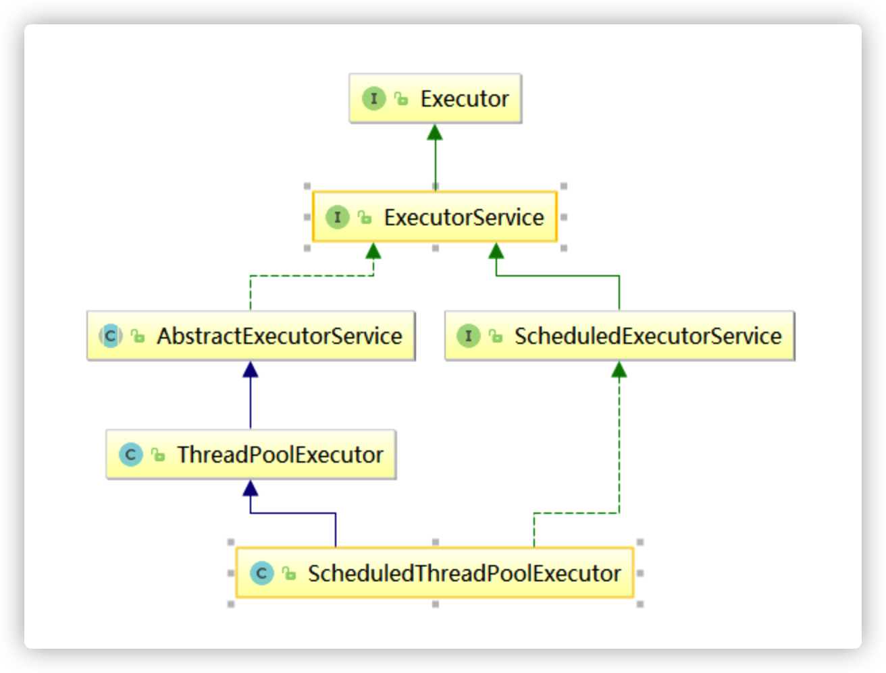

它用来处理延时任务或定时任务。

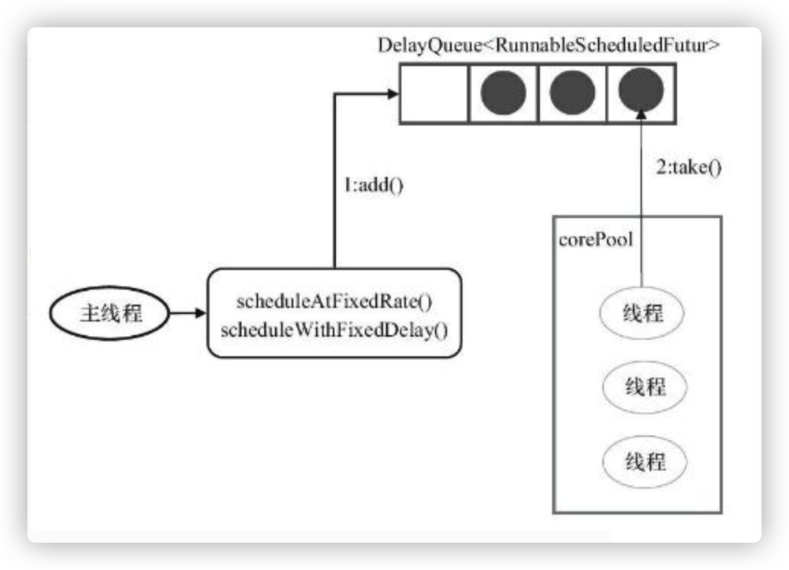

它接收 SchduledFutureTask 类型的任务，是线程池调度任务的最小单位，有三种提交任务的方式：

1. schedule
2. scheduledAtFixedRate
3. scheduledWithFixedDelay

它采用 DelayQueue 存储等待的任务

1. DelayQueue 内部封装了一个 PriorityQueue，它会根据 time 的先后时间排序，若 time 相同则根据 sequenceNumber 排序；
2. DelayQueue 也是一个无界队列；


## 2. SchduledFutureTask

SchduledFutureTask 接收的参数(成员变量)：

1. **private long** **time**：任务开始的时间
2. **private final long** **sequenceNumber**;：任务的序号
3. **private final long** **period**：任务执行的时间间隔

工作线程的执行过程：

- 工作线程会从 DelayQueue 取已经到期的任务去执行；
- 执行结束后重新设置任务的到期时间，再次放回 DelayQueue

ScheduledThreadPoolExecutor 会把待执行的任务放到工作队列 DelayQueue 中，DelayQueue 封装了一个 PriorityQueue，PriorityQueue 会对队列中的 ScheduledFutureTask 进行排序，具体的排序算法实现如下：

```java
public int compareTo(Delayed other) {
    if (other == this) // compare zero if same object
        return 0;
    if (other instanceof ScheduledFutureTask) {
        ScheduledFutureTask<?> x = (ScheduledFutureTask<?>)other;
        long diff = time - x.time;
        if (diff < 0)
            return -1;
        else if (diff > 0)
            return 1;
        else if (sequenceNumber < x.sequenceNumber)
            return -1;
        else
            return 1;
    }
    long diff = getDelay(NANOSECONDS) - other.getDelay(NANOSECONDS);
    return (diff < 0) ? -1 : (diff > 0) ? 1 : 0;
}
```

1. 首先按照 time 排序，time 小的排在前面，time大的排在后面；
2. 如果time相同，按照 sequenceNumber 排序，sequenceNumber 小的排在前面，sequenceNumber 大的排在后面，换句话说，如果两个 task 的执行时间相同，优先执行先提交的 task。

SchduledFutureTask 之run 方法实现

run 方法是调度 task 的核心，task 的执行实际上是 run 方法的执行。

```java
public void run() {
    boolean periodic = isPeriodic();
		//如果当前线程池已经不支持执行任务，则取消
    if (!canRunInCurrentRunState(periodic))
        cancel(false);
		//如果不需要周期性执行，则直接执行run方法然后结束
    else if (!periodic)
        ScheduledFutureTask.super.run();
		//如果需要周期执行，则在执行完任务以后，设置下一次执行时间
    else if (ScheduledFutureTask.super.runAndReset()) {
        // 计算下次执行该任务的时间
      	setNextRunTime();
 				//重复执行任务
        reExecutePeriodic(outerTask);
    }
}
```

1. 如果当前线程池运行状态不可以执行任务，取消该任务，然后直接返回，否则执行步骤2；
2. 如果不是周期性任务，调用 FutureTask 中的 run 方法执行，会设置执行结果，然后直接返回，否则执行步骤3；
3. 如果是周期性任务，调用 FutureTask 中的 runAndReset 方法执行，不会设置执行结果，然后直接返回，否则执行步骤4和步骤5；
4. 计算下次执行该任务的具体时间；
5. 重复执行任务。

reExecutePeriodic方法

```java
void reExecutePeriodic(RunnableScheduledFuture<?> task) {
    if (canRunInCurrentRunState(true)) {
        super.getQueue().add(task);
        if (!canRunInCurrentRunState(true) && remove(task))
            task.cancel(false);
        else
            ensurePrestart();
    }
}
```

该方法和 delayedExecute 方法类似，不同的是：

1. 由于调用 reExecutePeriodic 方法时已经执行过一次周期性任务了，所以不会 reject 当前任务；
2. 传入的任务一定是周期性任务。

**线程池任务的提交**

首先是 schedule 方法，该方法是指任务在指定延迟时间到达后触发，只会执行一次。

```java
public ScheduledFuture<?> schedule(Runnable command, long delay, TimeUnit unit) {
  
		//参数校验
		if (command == null || unit == null)
        throw new NullPointerException();
  
		//这里是一个嵌套结构，首先把用户提交的任务包装成ScheduledFutureTask
		//然后在调用decorateTask进行包装，该方法是留给用户去扩展的，默认是个空方法
    RunnableScheduledFuture<?> t = decorateTask(command,
        		new ScheduledFutureTask<Void>(command, null, triggerTime(delay, unit)));
		//包装好任务以后，就进行提交了
		delayedExecute(t);
    return t;
}
```

任务提交方法：

```java
private void delayedExecute(RunnableScheduledFuture<?> task) {
  
    //如果线程池已经关闭，则使用拒绝策略把提交任务拒绝掉
		if (isShutdown()) {
        reject(task);
    } else {
      
				//与ThreadPoolExecutor不同，这里直接把任务加入延迟队列
        super.getQueue().add(task);		//使用用的DelayedWorkQueue
      
				//如果当前状态无法执行任务，则取消
        if (isShutdown() && !canRunInCurrentRunState(task.isPeriodic()) && remove(task)) {
            task.cancel(false);
        } else {
        		//这里是增加一个worker线程，避免提交的任务没有worker去执行
        		//原因就是该类没有像ThreadPoolExecutor一样，woker满了才放入队列
						ensurePrestart();
        }
    }
}
```

**DelayedWorkQueue**

ScheduledThreadPoolExecutor 之所以要自己实现阻塞的工作队列，是因为 ScheduledThreadPoolExecutor 要求的工作队列有些特殊。

DelayedWorkQueue 是一个基于堆的数据结构，类似于 DelayQueue 和 PriorityQueue。在执行定时任务的时候，每个任务的执行时间都不同，所以 DelayedWorkQueue 的工作就是按照执行时间的升序来排列，执行时间距离当前时间越近的任务在队列的前面（**注意：这里的顺序并不是绝对的，堆中的排序只保证了子节点的下次执行时间要比父节点的下次执行时间要大，而叶子节点之间并不一定是顺序的，下文中会说明**）。

堆结构如下图：

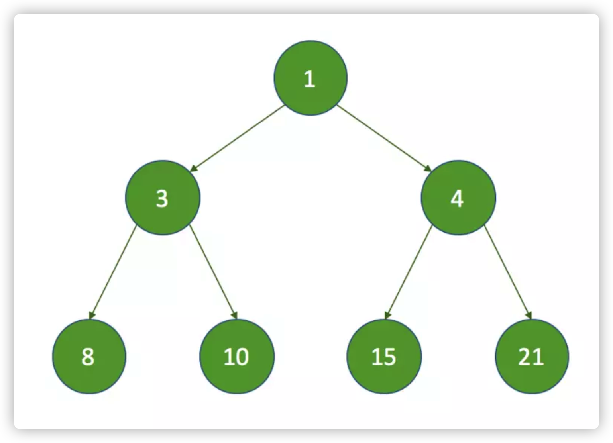

可见，DelayedWorkQueue 是一个基于最小堆结构的队列。堆结构可以使用数组表示，可以转换成如下的数组：

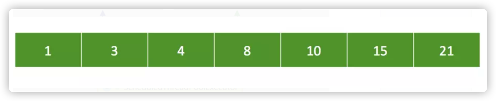

在这种结构中，可以发现有如下特性：

假设，索引值从0开始，子节点的索引值为k，父节点的索引值为p，则：

1. 一个节点的左子节点的索引为：k = p * 2 + 1；
2. 一个节点的右子节点的索引为：k = (p + 1) * 2；
3. 一个节点的父节点的索引为：p = (k - 1) / 2。

**为什么要使用DelayedWorkQueue呢？**

定时任务执行时需要取出最近要执行的任务，所以任务在队列中每次出队时一定要是当前队列中执行时间最靠前的，所以自然要使用优先级队列。

DelayedWorkQueue 是一个优先级队列，它可以保证每次出队的任务都是当前队列中执行时间最靠前的，由于它是基于堆结构的队列，堆结构在执行插入和删除操作时的最坏时间复杂度是 **O(logN)**。

**DelayedWorkQueue属性**

```java
// 队列初始容量
private static final int INITIAL_CAPACITY = 16;
// 根据初始容量创建RunnableScheduledFuture类型的数组
private RunnableScheduledFuture<?>[] queue =
				new RunnableScheduledFuture<?>[INITIAL_CAPACITY];
private final ReentrantLock lock = new ReentrantLock();
private int size = 0;
// leader线程
private Thread leader = null;
// 当较新的任务在队列的头部可用时，或者新线程可能需要成为leader，则通过该条件发出信号
private final Condition available = lock.newCondition();
```

注意这里的 leader，它是 Leader-Follower 模式的变体，用于减少不必要的定时等待。什么意思呢？对于多线程的网络模型来说：

> 所有线程会有三种身份中的一种：leader 和 follower，以及一个干活中的状态：proccesser。它的基本原则就是，永远最多只有一个 leader。而所有 follower 都在等待成为 leader。线程池启动时会自动产生一个Leader 负责等待网络IO事件，当有一个事件产生时，Leader线程首先通知一个 Follower 线程将其提拔为新的 Leader，然后自己就去干活了，去处理这个网络事件，处理完毕后加入 Follower 线程等待队列，等待下次成为 Leader。这种方法可以增强 CPU 高速缓存相似性，及消除动态内存分配和线程间的数据交换。

**offer方法**

```java
public boolean offer(Runnable x) {
		//参数校验
    if (x == null)
        throw new NullPointerException();
    RunnableScheduledFuture<?> e = (RunnableScheduledFuture<?>)x;
    final ReentrantLock lock = this.lock;
    lock.lock();
    try {
				//查看当前元素数量，如果大于队列长度则进行扩容
        int i = size;
        if (i >= queue.length)
            grow();
				//元素数量加1
        size = i + 1;
				//如果当前队列还没有元素，则直接加入头部
        if (i == 0) {
            queue[0] = e;
						//记录索引
            setIndex(e, 0);
        } else {
 						//把任务加入堆中，并调整堆结构，这里就会根据任务的触发时间排列
            //把需要最早执行的任务放在前面
            siftUp(i, e);
        }
				//如果新加入的元素就是队列头，这里有两种情况
        //1.这是用户提交的第一个任务
        //2.新任务进行堆调整以后，排在队列头
        if (queue[0] == e) {
						// leader设置为null为了使在take方法中的线程在通过available.signal();
          	// 后会执行available.awaitNanos(delay);
            leader = null;
						//加入元素以后，唤醒worker线程
            available.signal();
        }
    } finally {
        lock.unlock();
    }
    return true;
}
```

**任务排序sift方法**

```java
private void siftUp(int k, RunnableScheduledFuture<?> key) {
		// 找到父节点的索引
		while (k > 0) {
  			// 获取父节点
        int parent = (k - 1) >>> 1;
        RunnableScheduledFuture<?> e = queue[parent];
  			// 如果key节点的执行时间大于父节点的执行时间，不需要再排序了
        if (key.compareTo(e) >= 0)
            break;
 				// 如果key.compareTo(e) < 0，说明key节点的执行时间小于父节点的执行时间，需要把父节点移到后面
        queue[k] = e;
        setIndex(e, k);
				// 设置索引为k
        k = parent;
    }
		// key设置为排序后的位置中
    queue[k] = key;
    setIndex(key, k);
}
```

代码很好理解，就是循环的根据 key 节点与它的父节点来判断，如果 key 节点的执行时间小于父节点，则将两个节点交换，使执行时间靠前的节点排列在队列的前面。

假设新入队的节点的延迟时间（调用 `getDelay()` 方法获得）是5，执行过程如下：

1. 先将新的节点添加到数组的尾部，这时新节点的索引 k 为7：

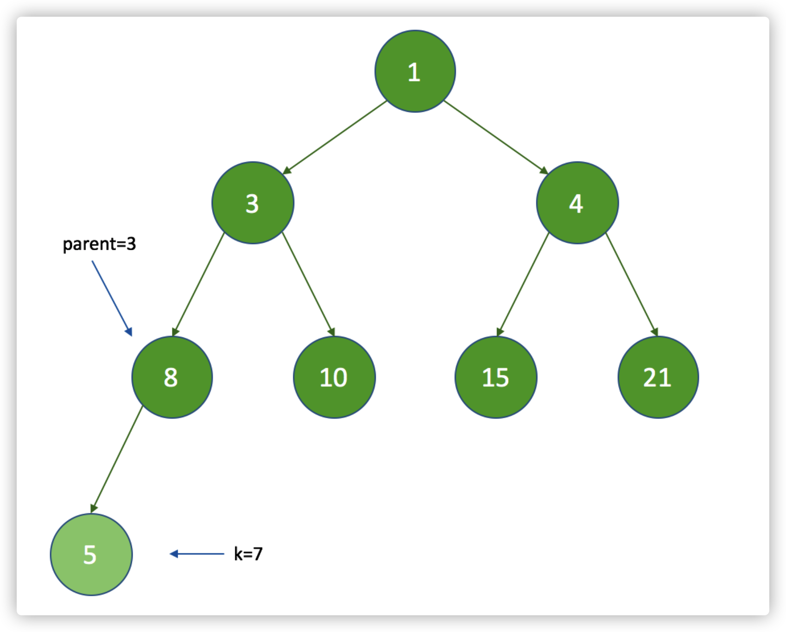

1. 计算新父节点的索引：`parent = (k - 1) >>> 1`，`parent = 3`，那么 `queue[3]` 的时间间隔值为8，因为 5 < 8 ，将执行 `queue[7] = queue[3]`：

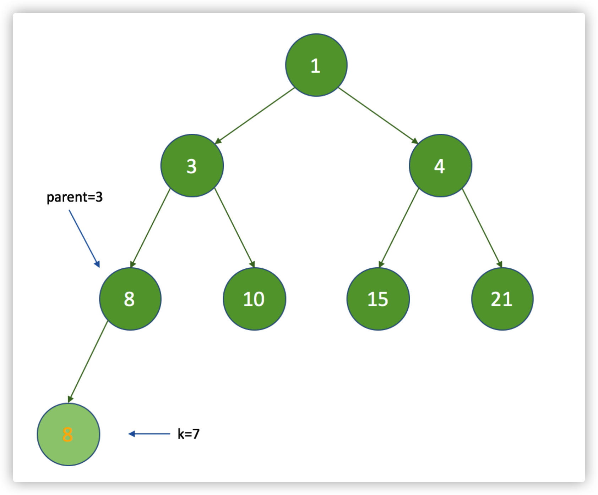

1. 这时将 k 设置为3，继续循环，再次计算 parent 为1，`queue[1]` 的时间间隔为3，因为 `5 > 3`，这时退出循环，最终 k 为3：

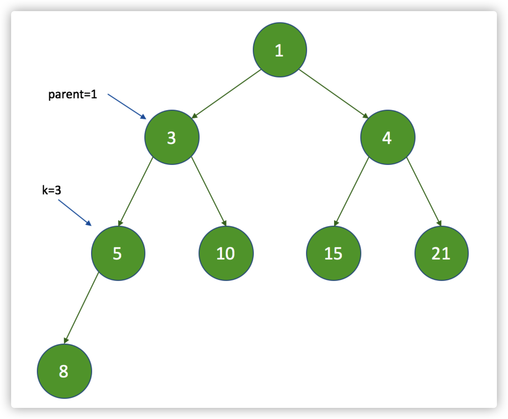

可见，每次新增节点时，只是根据父节点来判断，而不会影响兄弟节点。

**take方法**

```java
public RunnableScheduledFuture<?> take() throws InterruptedException {
    final ReentrantLock lock = this.lock;
    lock.lockInterruptibly();
    try {
        for (;;) {
            RunnableScheduledFuture<?> first = queue[0];
            if (first == null)
                available.await();
            else {
								// 计算当前时间到执行时间的时间间隔
                long delay = first.getDelay(NANOSECONDS);
                if (delay <= 0)
                    return finishPoll(first);
                first = null; // don't retain ref while waiting
                // leader不为空，阻塞线程
								if (leader != null)
                    available.await();
                else {
                    // leader为空，则把leader设置为当前线程，
Thread thisThread = Thread.currentThread();
                    leader = thisThread;
                    try {
                       // 阻塞到执行时间 
available.awaitNanos(delay);
                    } finally {
												// 设置leader = null，让其他线程执行available.awaitNanos(delay);
                        if (leader == thisThread)
                            leader = null;
                    }
                }
            }
        }
    } finally {
				// 如果leader不为空，则说明leader的线程正在执行available.awaitNanos(delay);
        // 如果queue[0] == null，说明队列为空
        if (leader == null && queue[0] != null)
            available.signal();
        lock.unlock();
    }
}
```

workQueue 中取任务。但定时任务却不同，因为如果一旦 getTask 方法取出了任务就开始执行了，而这时可能还没有到执行的时间，所以在 take 方法中，要保证只有在到指定的执行时间的时候任务才可以被取走。

再来说一下 leader 的作用，这里的leader是为了减少不必要的定时等待，当一个线程成为 leader 时，它只等待下一个节点的时间间隔，但其它线程无限期等待。 leader 线程必须在从 `take()` 或 `poll()` 返回之前 signal 其它线程，除非其他线程成为了 leader。

举例来说，如果没有 leader，那么在执行 take 时，都要执行 `available.awaitNanos(delay)`，假设当前线程执行了该段代码，这时还没有 signal，第二个线程也执行了该段代码，则第二个线程也要被阻塞。多个这时执行该段代码是没有作用的，因为只能有一个线程会从 take 中返回 `queue[0]`（因为有 lock），其他线程这时再返回 for 循环执行时取的 `queue[0]`，已经不是之前的 `queue[0]` 了，然后又要继续阻塞。

所以，为了不让多个线程频繁的做无用的定时等待，这里增加了 leader，如果 leader 不为空，则说明队列中第一个节点已经在等待出队，这时其它的线程会一直阻塞，减少了无用的阻塞（注意，在finally 中调用了 `signal()` 来唤醒一个线程，而不是 `signalAll()`）。

**poll 方法**

下面看下 poll 方法，与 take 类似，但这里要提供超时功能：

```java
public RunnableScheduledFuture<?> poll(long timeout, TimeUnit unit)
    throws InterruptedException {
    long nanos = unit.toNanos(timeout);
    final ReentrantLock lock = this.lock;
    lock.lockInterruptibly();
    try {
        for (;;) {
            RunnableScheduledFuture<?> first = queue[0];
            if (first == null) {
                if (nanos <= 0)
                    return null;
                else
                    nanos = available.awaitNanos(nanos);
            } else {
                long delay = first.getDelay(NANOSECONDS);
								// 如果delay <= 0，说明已经到了任务执行的时间，返回。
                if (delay <= 0)
                    return finishPoll(first);
								// 如果nanos <= 0，说明已经超时，返回null
                if (nanos <= 0)
                    return null;
                first = null; 	// don't retain ref while waiting
  							// nanos < delay 说明需要等待的时间小于任务要执行的延迟时间
                // leader != null 说明有其它线程正在对任务进行阻塞
                // 这时阻塞当前线程nanos纳秒
                if (nanos < delay || leader != null)
                    nanos = available.awaitNanos(nanos);
                else {
                    Thread thisThread = Thread.currentThread();
                    leader = thisThread;
                    try {
												// 这里的timeLeft表示delay减去实际的等待时间
                        long timeLeft = available.awaitNanos(delay);
                       	// 计算剩余的等待时间 
                      	nanos -= delay - timeLeft;
                    } finally {
                        if (leader == thisThread)
                            leader = null;
                    }
                }
            }
        }
    } finally {
        if (leader == null && queue[0] != null)
            available.signal();
        lock.unlock();
    }
}
```

**finishPoll方法**

当调用了 take 或者 poll 方法能够获取到任务时，会调用该方法进行返回：

```java
private RunnableScheduledFuture<?> finishPoll(RunnableScheduledFuture<?> f) {
		// 数组长度-1
    int s = --size;
		// 取出最后一个节点
    RunnableScheduledFuture<?> x = queue[s];
    queue[s] = null;
		// 长度不为0，则从第一个元素开始排序，目的是要把最后一个节点放到合适的位置上
    if (s != 0)
        siftDown(0, x);
    setIndex(f, -1);
    return f;
}
```

**siftDown方法**

siftDown 方法使堆从 k 开始向下调整：

```java
private void siftDown(int k, RunnableScheduledFuture<?> key) {
		// 根据二叉树的特性，数组长度除以2，表示取有子节点的索引
    int half = size >>> 1;
		// 判断索引为k的节点是否有子节点
    while (k < half) {
				// 左子节点的索引
        int child = (k << 1) + 1;
        RunnableScheduledFuture<?> c = queue[child];
				// 右子节点的索引
        int right = child + 1;
				// 如果有右子节点并且左子节点的时间间隔大于右子节点，取时间间隔最小的节点
        if (right < size && c.compareTo(queue[right]) > 0)
            c = queue[child = right];
				// 如果key的时间间隔小于等于c的时间间隔，跳出循环
        if (key.compareTo(c) <= 0)
            break;
				// 设置要移除索引的节点为其子节点
        queue[k] = c;
        setIndex(c, k);
        k = child;
    }
		// 将key放入索引为k的位置
    queue[k] = key;
    setIndex(key, k);
}
```

siftDown 方法执行时包含两种情况，一种是没有子节点，一种是有子节点（根据 half 判断）。例如：

**没有子节点的情况：**

假设初始的堆如下：

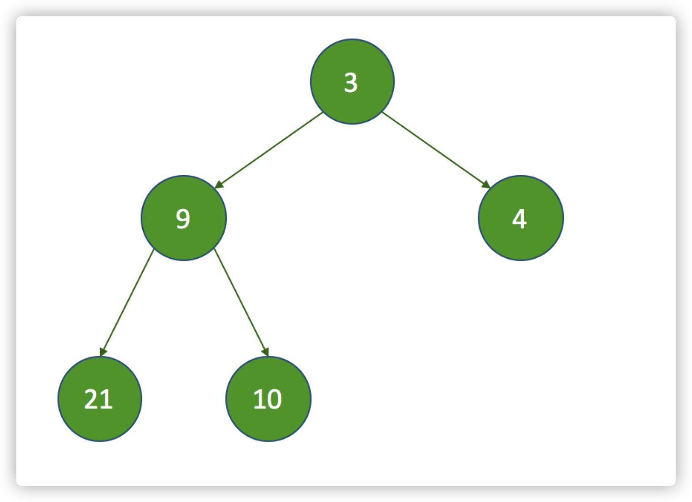

假设 `k = 3`，那么 `k = half`，没有子节点，在执行 siftDown 方法时直接把索引为3的节点设置为数组的最后一个节点：

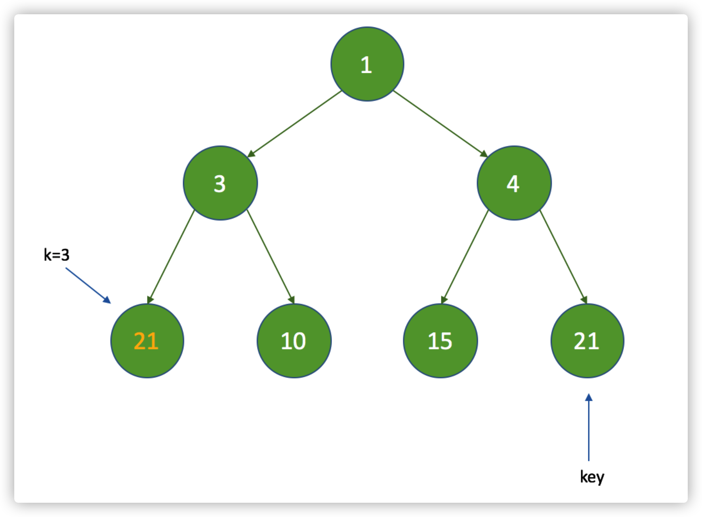

**有子节点的情况：**

假设 `k = 0`，那么执行以下步骤：

> 1、获取左子节点，`child = 1` ，获取右子节点，`right = 2`：

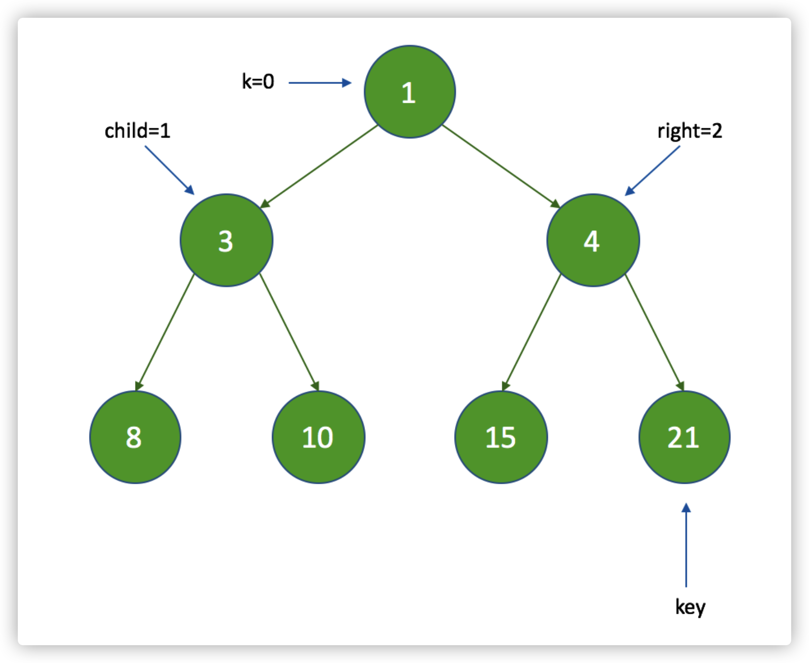

2、由于 `right < size`，这时比较左子节点和右子节点时间间隔的大小，这里 `3 < 7`，所以 `c = queue[child]`；

3、比较 key 的时间间隔是否小于 c 的时间间隔，这里不满足，继续执行，把索引为 k 的节点设置为 c，然后将k设置为 child；

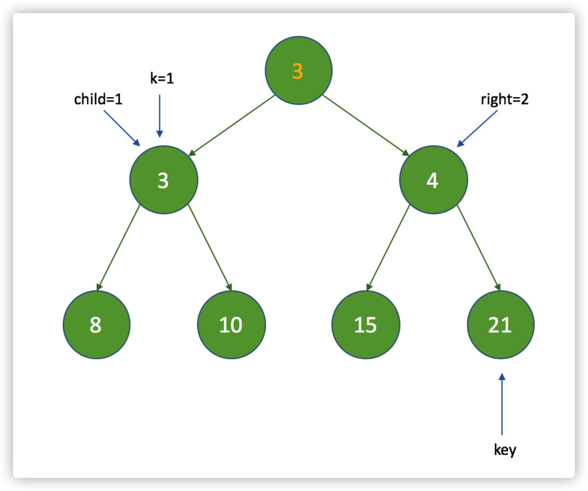

4、因为 `half = 3`，`k = 1`，继续执行循环，这时的索引变为：

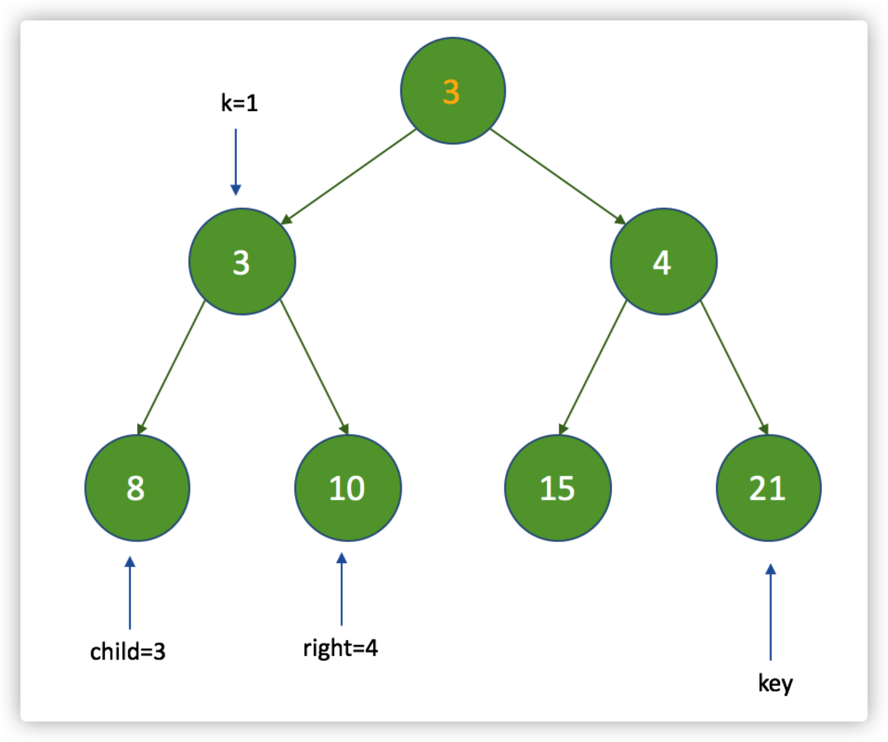

5、这时再经过如上判断后，将 k 的值为3，最终的结果如下：

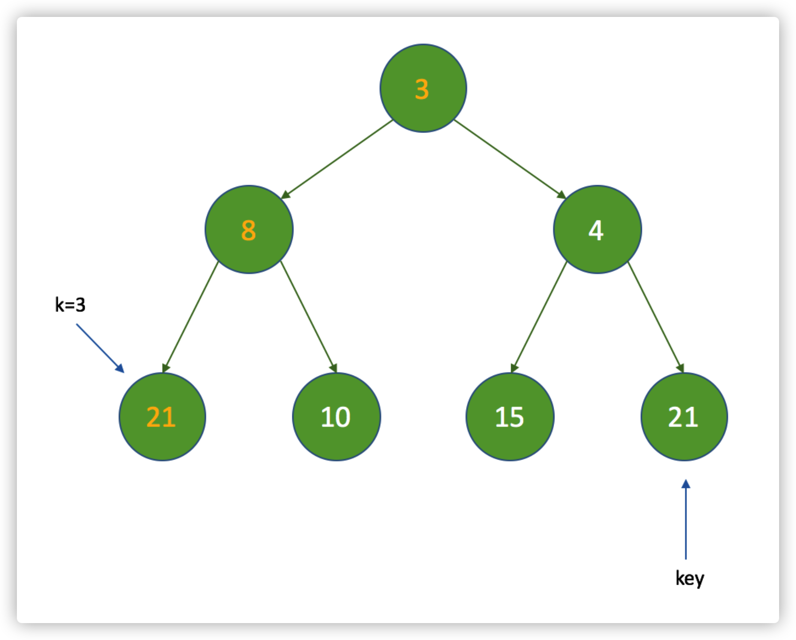

6、最后，如果在 finishPoll 方法中调用的话，会把索引为0的节点的索引设置为-1，表示已经删除了该节点，并且 size 也减了1，最后的结果如下：

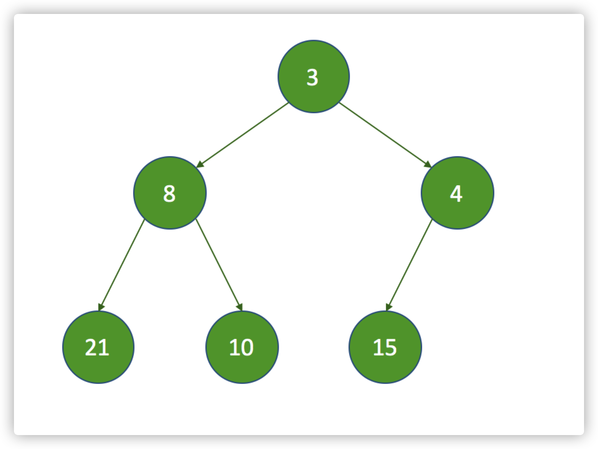

可见，siftdown 方法在执行完并不是有序的，但可以发现，子节点的下次执行时间一定比父节点的下次执行时间要大，由于每次都会取左子节点和右子节点中下次执行时间最小的节点，所以还是可以保证在 take 和 poll 时出队是有序的。

**remove方法**

```java
public boolean remove(Object x) {
    final ReentrantLock lock = this.lock;
    lock.lock();
    try {
        int i = indexOf(x);
        if (i < 0)
            return false;

        setIndex(queue[i], -1);
        int s = --size;
        RunnableScheduledFuture<?> replacement = queue[s];
        queue[s] = null;
        if (s != i) {
  					// 从i开始向下调整
            siftDown(i, replacement);
 						// 如果queue[i] == replacement，说明i是叶子节点
            // 如果是这种情况，不能保证子节点的下次执行时间比父节点的大
            // 这时需要进行一次向上调整
            if (queue[i] == replacement)
                siftUp(i, replacement);
        }
        return true;
    } finally {
        lock.unlock();
    }
}
```

假设初始的堆结构如下：

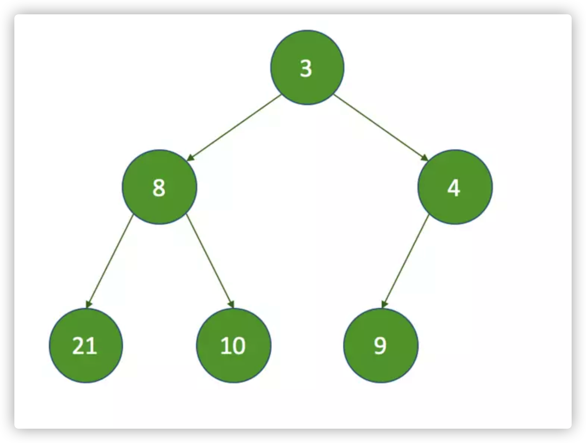

这时要删除8的节点，那么这时 `k = 1`，key 为最后一个节点：

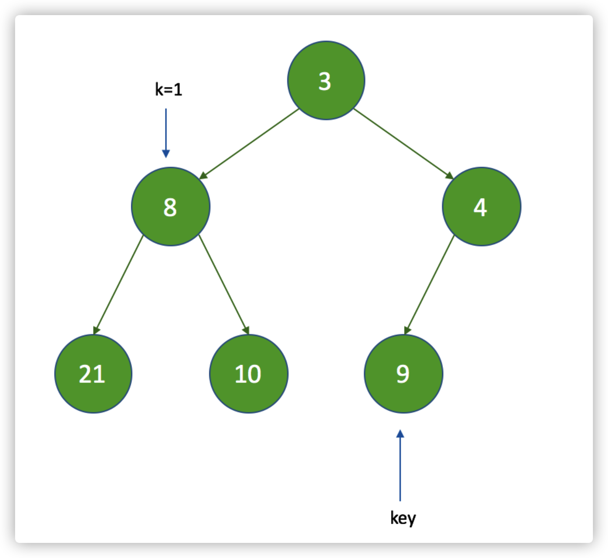

这时通过上文对 siftDown 方法的分析，siftDown 方法执行后的结果如下：


这时会发现，最后一个节点的值比父节点还要小，所以这里要执行一次 siftUp 方法来保证子节点的下次执行时间要比父节点的大，所以最终结果如下：


**总结**

主要总结为以下几个方面：

- 与 Timer 执行定时任务的比较，相比 Timer，ScheduedThreadPoolExecutor 有什么优点；
- ScheduledThreadPoolExecutor 继承自 ThreadPoolExecutor，所以它也是一个线程池，也有 coorPoolSize 和 workQueue，ScheduledThreadPoolExecutor 特殊的地方在于，自己实现了优先工作队列 DelayedWorkQueue；
- ScheduedThreadPoolExecutor 实现了 ScheduledExecutorService，所以就有了任务调度的方法，如 schedule，scheduleAtFixedRate 和 scheduleWithFixedDelay，同时注意他们之间的区别；
- 内部类 ScheduledFutureTask 继承自 FutureTask，实现了任务的异步执行并且可以获取返回结果。同时也实现了 Delayed 接口，可以通过 getDelay 方法获取将要执行的时间间隔；
- 周期任务的执行其实是调用了 FutureTask 类中的 runAndReset 方法，每次执行完不设置结果和状态。
- 详细分析了 DelayedWorkQueue 的数据结构，它是一个基于最小堆结构的优先队列，并且每次出队时能够保证取出的任务是当前队列中下次执行时间最小的任务。同时注意一下优先队列中堆的顺序，堆中的顺序并不是绝对的，但要保证子节点的值要比父节点的值要大，这样就不会影响出队的顺序。

总体来说，ScheduedThreadPoolExecutor 的重点是要理解下次执行时间的计算，以及优先队列的出队、入队和删除的过程，这两个是理解 ScheduedThreadPoolExecutor 的关键。