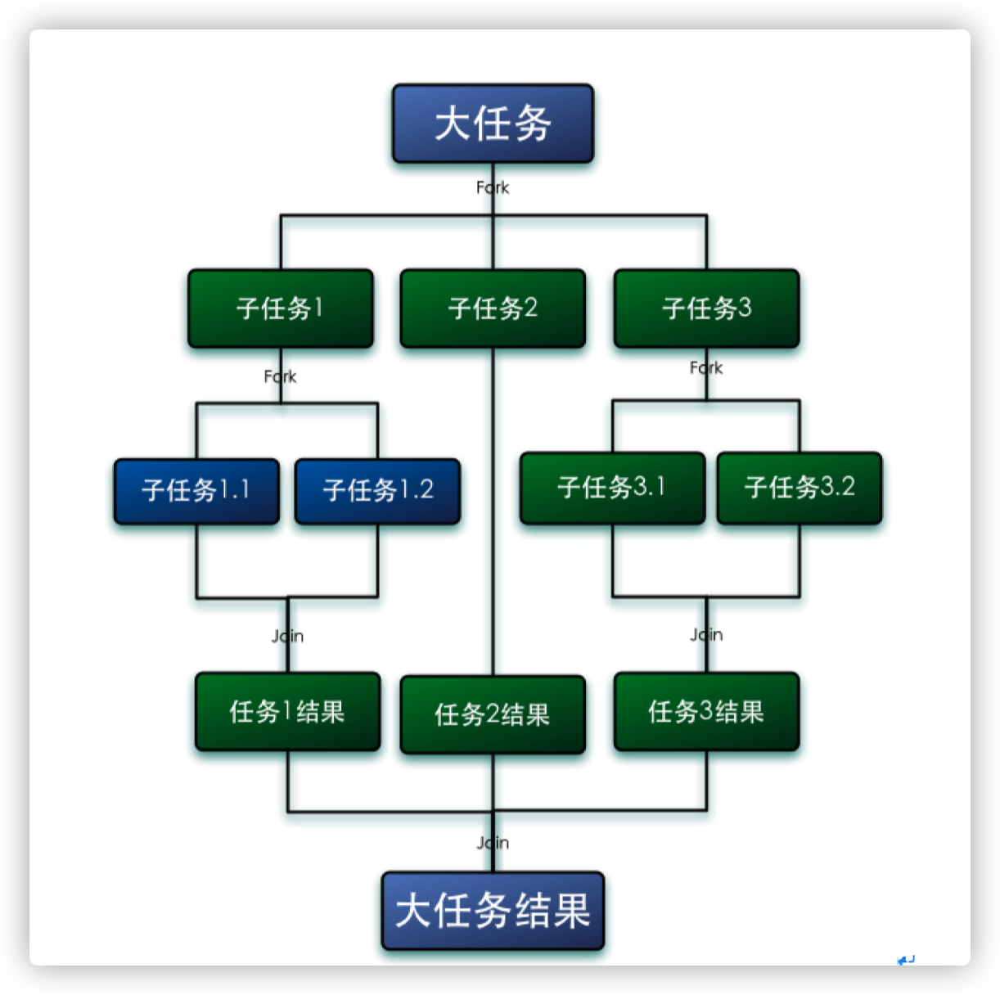
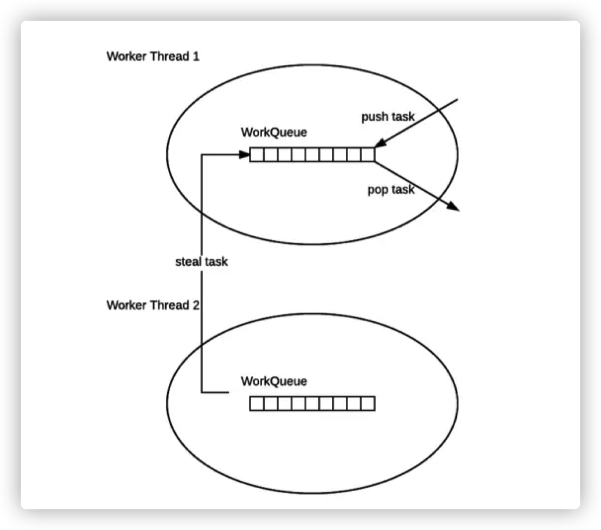
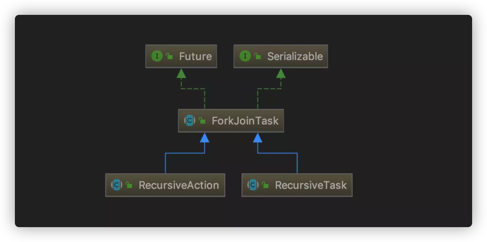
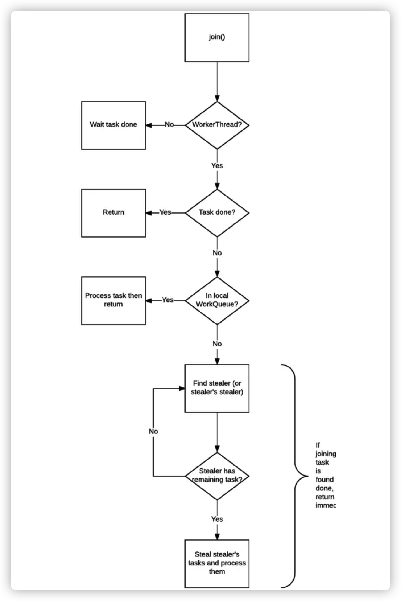
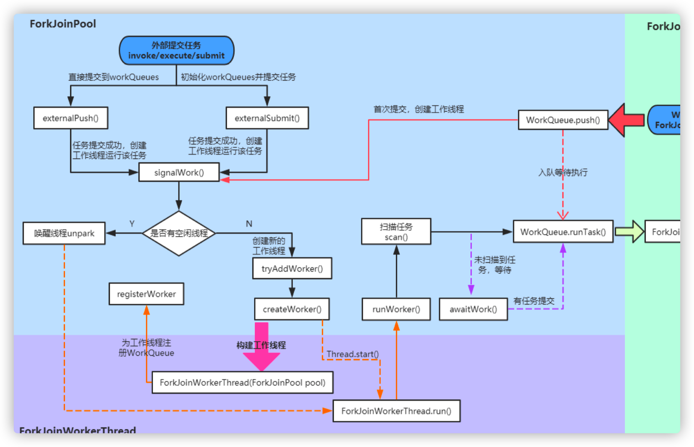

# 并发编程之Future&ForkJoin框架原理分析

## 1. 任务性质类型

#### CPU密集型（CPU-bound）

CPU 密集型也叫计算密集型，指的是系统的硬盘、内存性能相对CPU要好很多，此时，系统运作大部分的状况是CPU Loading 100%，CPU 要读/写 I/O（硬盘/内存），I/O 在很短的时间就可以完成，而 CPU 还有许多运算要处理，CPU Loading 很高。

在多重程序系统中，大部份时间用来做计算、逻辑判断等CPU动作的程序称之 CPU bound。例如一个计算圆周率至小数点一千位以下 的程序，在执行的过程当中绝大部份时间用在三角函数和开根号的计算，便是属于 CPU bound 的程序。

CPU bound 的程序一般而言 CPU 占用率相当高。这可能是因为任务本身不太需要访问I/O设备，也可能是因为程序是多线程实现因此 屏蔽掉了等待 I/O 的时间。 线程数一般设置为：

​		**线程数 = CPU核数 + 1 (现代CPU支持超线程)**

#### IO密集型（I/O bound）

IO 密集型指的是系统的 CPU 性能相对硬盘、内存要好很多，此时，系统运作，大部分的状况是 CPU 在等 I/O (硬盘/内存) 的读/写操 作，此时 CPU Loading 并不高。 

I/O bound 的程序一般在达到性能极限时，CPU 占用率仍然较低。这可能是因为任务本身需要大量 I/O 操作，而pipeline 做得不是很 好，没有充分利用处理器能力。 线程数一般设置为： 

​		**线程数 = ((线程等待时间 + 线程CPU时间) / 线程CPU时间) * CPU数目**

#### CPU密集型 vs IO密集型

我们可以把任务分为计算密集型和 IO 密集型。 

计算密集型任务的特点是要进行大量的计算，消耗 CPU 资源，比如计算圆周率、对视频进行高清解码等等，全靠 CPU 的运算能力。这 种计算密集型任务虽然也可以用多任务完成，但是任务越多，花在任务切换的时间就越多， CPU 执行任务的效率就越低，所以，要最高效 地利用 CPU，计算密集型任务同时进行的数量应当等于 CPU 的核心数。

计算密集型任务由于主要消耗 CPU 资源，因此，代码运行效率至关重要。Python 这样的脚本语言运行效率很低，完全不适合计算密集 型任务。对于计算密集型任务，最好用 C 语言编写。

第二种任务的类型是 IO 密集型，涉及到网络、磁盘 IO 的任务都是 IO 密集型任务，这类任务的特点是CPU消耗很少，任务的大部分时间 都在等待 IO 操作完成（因为 IO 的速度远远低于CPU和内存的速度）。对于IO密集型任务，任务越多，CPU 效率越高，但也有一个限度。常 见的大部分任务都是IO密集型任务，比如Web应用。

IO 密集型任务执行期间，99%的时间都花在IO上，花在 CPU 上的时间很少，因此，用运行速度极快的 C 语言替换用 Python 这样运行速 度极低的脚本语言，完全无法提升运行效率。对于IO密集型任务，最合适的语言就是开发效率最高（代码量最少）的语言，脚本语言是首选，C 语言最差。

## 2. Fork/Join 框架

Fork/Join 框架是 Java7 提供了的一个用于并行执行任务的框架， 是一个把大任务分割成若干个小任务，最终汇总每个小任务结果后得到大任务结果的框架。

Fork 就是把一个大任务切分为若干子任务并行的执行，Join 就是合并这些子任务的执行结果，最后得到这个大任务的结果。比如计算1+2+.....＋10000，可以分割成 10 个子任务，每个子任务分别对 1000 个数进行求和，最终汇总这 10 个子任务的结果。如下图所示： 



##### Fork/Jion特性

1. ForkJoinPool 不是为了替代 ExecutorService，而是它的补充，在某些应用场景下性能比 ExecutorService 更好。（见 Java Tip: When to use ForkJoinPool vs ExecutorService ）

2. ForkJoinPool 主要用于实现“分而治之”的算法，特别是分治之后递归调用的函数，例如 quick sort 等。

3. ForkJoinPool 最适合的是计算密集型的任务，如果存在 I/O，线程间同步，sleep() 等会造成线程长时间阻塞的情况时，最好配合使用 ManagedBlocker。


## 3. 工作窃取算法

工作窃取（work-stealing）算法是指某个线程从其他队列里窃取任务来执行。

我们需要做一个比较大的任务，我们可以把这个任务分割为若干互不依赖的子任务，为了减少线程间的竞争，于是把这些子任务分别放到不同的队列里，并为每个队列创建一个单独的线程来执行队列里的任务，线程和队列一一对应，比如A线程负责处理A队列里的任务。但是有的线程会先把自己队列里的任务干完，而其他线程对应的队列里还有任务等待处理。干完活的线程与其等着，不如去帮其他线程干活，于是它就去其他线程的队列里窃取一个任务来执行。而在这时它们会访问同一个队列，所以为了减少窃取任务线程和被窃取任务线程之间的竞争，通常会使用双端队列，被窃取任务线程永远从双端队列的头部拿任务执行，而窃取任务的线程永远从双端队列的尾部拿任务执行。

工作窃取算法的优点是充分利用线程进行并行计算，并减少了线程间的竞争，其缺点是在某些情况下还是存在竞争，比如双端队列里只有一个任务时。并且消耗了更多的系统资源，比如创建多个线程和多个双端队列。



1. ForkJoinPool 的每个工作线程都维护着一个工作队列（WorkQueue），这是一个双端队列（Deque），里面存放的对象是任务（ForkJoinTask）。

2. 每个工作线程在运行中产生新的任务（通常是因为调用了 `fork()`）时，会放入工作队列的队尾，并且工作线程在处理自己的工作队列时，使用的是 LIFO 方式，也就是说每次从队尾取出任务来执行。

3. 每个工作线程在处理自己的工作队列同时，会尝试窃取一个任务（或是来自于刚刚提交到 pool 的任务，或是来自于其他工作线程的工作队列），窃取的任务位于其他线程的工作队列的队首，也就是说工作线程在窃取其他工作线程的任务时，使用的是 FIFO方式。

4. 在遇到 `join()` 时，如果需要 join 的任务尚未完成，则会先处理其他任务，并等待其完成。

5. 在既没有自己的任务，也没有可以窃取的任务时，进入休眠。


## 4. fork/join的使用

ForkJoinTask：我们要使用 ForkJoin 框架，必须首先创建一个 ForkJoin 任务。它提供在任务中执行 `fork()` 和 `join()` 操作的机制，通常情况下我们不需要直接继承 ForkJoinTask 类，而只需要继承它的子类，Fork/Join 框架提供了以下两个子类：

- RecursiveAction：用于没有返回结果的任务。(比如写数据到磁盘，然后就退出了。 一个 RecursiveAction 可以把自己的工作分割成更小的几块， 这样它们可以由独立的线程或者CPU执行。 我们可以通过继承来实现一个 RecursiveAction)

- RecursiveTask ：用于有返回结果的任务。(可以将自己的工作分割为若干更小任务，并将这些子任务的执行合并到一个集体结果。可以有几个水平的分割和合并)

- CountedCompleter： 在任务完成执行后会触发执行一个自定义的钩子函数



- ForkJoinPool ：ForkJoinTask 需要通过 ForkJoinPool 来执行，任务分割出的子任务会添加到当前工作线程所维护的双端队列中，进入队列的头部。当一个工作线程的队列里暂时没有任务时，它会随机从其他工作线程的队列的尾部获取一个任务。

#### 使用场景示例：

定义 fork/join 任务，如下示例，随机生成2000w条数据在数组当中，然后求和

```java
/**
 * RecursiveTask并行计算，同步有返回值
 * ForkJoin框架处理的任务基本都能使用递归处理，比如求斐波那契数列等，但递归算法的缺陷是：
 * 一只会只用单线程处理， 
 * 二是递归次数过多时会导致堆栈溢出；
 * ForkJoin解决了这两个问题，使用多线程并发处理，充分利用计算资源来提高效率，同时避免堆栈溢出发生。
 * 当然像求斐波那契数列这种小问题直接使用线性算法搞定可能更简单，实际应用中完全没必要使用ForkJoin框架，
 * 所以ForkJoin是核弹，是用来对付大家伙的，比如超大数组排序。  
 * 最佳应用场景：多核、多内存、可以分割计算再合并的计算密集型任务
 */
class LongSum extends RecursiveTask<Long> {

    // 任务拆分的最小阀值
    static final int SEQUENTIAL_THRESHOLD = 1000;
    static final long NPS = (1000L * 1000 * 1000);
    static final boolean extraWork = true;	// change to add more than just a sum
    int low;
    int high;
    int[] array;

    LongSum(int[] arr, int lo, int hi) {
        array = arr;
        low = lo;
        high = hi;
    }

    /**
     * fork()方法：将任务放入队列并安排异步执行，一个任务应该只调用一次fork()函数，除非已经执行完毕并重新初始化。
     * tryUnfork()方法：尝试把任务从队列中拿出单独处理，但不一定成功。
     * join()方法：等待计算完成并返回计算结果。
     * isCompletedAbnormally()方法：用于判断任务计算是否发生异常。
     */
    protected Long compute() {
        // 任务被拆分到足够小时，则开始求和
        if (high ‐ low <= SEQUENTIAL_THRESHOLD) {
            long sum = 0;
            for (int i = low; i < high; ++i) {
                sum += array[i];
            }
            return sum;

        } else {	// 如果任务任然过大，则继续拆分任务，本质就是递归拆分
            int mid = low + (high ‐ low) / 2;
            LongSum left = new LongSum(array, low, mid);
            LongSum right = new LongSum(array, mid, high);
            left.fork();
            right.fork();
            long rightAns = right.join();
            long leftAns = left.join();
            return leftAns + rightAns;
        }
    }
}

// 执行fork/join任务
public class LongSumMain {
    // 获取逻辑处理器数量
    static final int NCPU = Runtime.getRuntime().availableProcessors();

    /** for time conversion */
    static final long NPS = (1000L * 1000 * 1000); 6
    static long calcSum;
    static final boolean reportSteals = true;

    public static void main(String[] args) throws Exception {
        int[] array = Utils.buildRandomIntArray(20000000);
        System.out.println("cpu‐num:"+NCPU);
        // 单线程下计算数组数据总和
        calcSum = seqSum(array);
        System.out.println("seq sum=" + calcSum);

        // 采用fork/join方式将数组求和任务进行拆分执行，最后合并结果
        LongSum ls = new LongSum(array, 0, array.length);
        ForkJoinPool fjp = new ForkJoinPool(4);	// 使用的线程数
        ForkJoinTask<Long> result = fjp.submit(ls);
        System.out.println("forkjoin sum=" + result.get());
        fjp.shutdown();
    }

    static long seqSum(int[] array) {
        long sum = 0;
        for (int i = 0; i < array.length; ++i)
            sum += array[i];
        return sum;
    }
}
```


## 5. fork/join框架原理

### 5.1 异常处理

ForkJoinTask 在执行的时候可能会抛出异常，但是我们没办法在主线程里直接捕获异常，所以 ForkJoinTask 提供了 `isCompletedAbnormally()` 方法来检查任务是否已经抛出异常或已经被取消了，并且可以通过 ForkJoinTask 的 `getException` 方法获取异常。示例如下

```java
if(task.isCompletedAbnormally()){
		System.out.println(task.getException());
}
```

getException 方法返回 Throwable 对象，如果任务被取消了则返回CancellationException。如果任务没有完成或者没有抛出异常则返回 null。

### 5.2 ForkJoinPool构造函数

其完整构造方法如下

```java
private ForkJoinPool(int parallelism,
                      ForkJoinWorkerThreadFactory factory,
                      UncaughtExceptionHandler handler,
                      int mode,
                      String workerNamePrefix) {
    this.workerNamePrefix = workerNamePrefix;
    this.factory = factory;
    this.ueh = handler;
    this.config = (parallelism & SMASK) | mode; 10
    long np = (long)(‐parallelism); // offset ctl counts
    this.ctl = ((np << AC_SHIFT) & AC_MASK) | ((np << TC_SHIFT) & TC_MASK);
}
```

重要参数解释

- parallelism：并行度（the parallelism level），默认情况下跟我们机器的 CPU 个数保持一致，使用`Runtime.getRuntime().availableProcessors()` 可以得到我们机器运行时可用的 CPU 个数。

- factory：创建新线程的工厂（the factory for creating new threads）。默认情况下使用`ForkJoinWorkerThreadFactory defaultForkJoinWorkerThreadFactory`。

- handler：线程异常情况下的处理器（`Thread.UncaughtExceptionHandler handler`），该处理器在线程执行任务时由于某些无法预料到的错误而导致任务线程中断时进行一些处理，默认情况为null。

- asyncMode：这个参数要注意，在 ForkJoinPool 中，每一个工作线程都有一个独立的任务队列，asyncMode表示工作线程内的任务队列是采用何种方式进行调度，可以是先进先出 FIFO，也可以是后进先出 LIFO。如果为true，则线程池中的工作线程则使用先进先出方式

进行任务调度，默认情况下是 false。

### 5.3 ForkJoinTask fork 方法

`fork()` 做的工作只有一件事，既是把任务推入当前工作线程的工作队列里。可以参看以下的源代码：

```java
public final ForkJoinTask<V> fork() {
		Thread t;
    if ((t = Thread.currentThread()) instanceof ForkJoinWorkerThread)
    		((ForkJoinWorkerThread)t).workQueue.push(this);
    else
        ForkJoinPool.common.externalPush(this);
    return this;
}
```

### 5.4 ForkJoinTask join 方法

`join()` 的工作则复杂得多，也是 `join()` 可以使得线程免于被阻塞的原因——不像同名的 `Thread.join()`。

1. 检查调用 join() 的线程是否是 ForkJoinThread 线程。如果不是（例如 main 线程），则阻塞当前线程，等待任务完成。如果是，则不阻塞。

2. 查看任务的完成状态，如果已经完成，直接返回结果。

3. 如果任务尚未完成，但处于自己的工作队列内，则完成它。

4. 如果任务已经被其他的工作线程偷走，则窃取这个小偷的工作队列内的任务（以 FIFO 方式），执行，以期帮助它早日完成欲 join 的任务。

5. 如果偷走任务的小偷也已经把自己的任务全部做完，正在等待需要 join 的任务时，则找到小偷的小偷，帮助它完成它的任务。

6. 递归地执行第5步。

将上述流程画成序列图的话就是这个样子：



### 5.5 ForkJoinPool.submit 方法

```java
public <T> ForkJoinTask<T> submit(ForkJoinTask<T> task) {
    if (task == null)
    		throw new NullPointerException();
    //提交到工作队列
    externalPush(task);
    return task;
}
```

ForkJoinPool 自身拥有工作队列，这些工作队列的作用是用来接收由外部线程（非 ForkJoinThread 线程）提交过来的任务，而这些工作队列被称为 submitting queue。

`submit()`和 `fork()` 其实没有本质区别，只是提交对象变成了 submitting queue 而已（还有一些同步，初始化的操作）。submitting queue 和其他 work queue 一样，是工作线程”窃取“的对象，因此当其中的任务被一个工作线程成功窃取时，就意味着提交的任务真正开始进入执行阶段。 

### 5.6 Fork/Join框架执行流程

