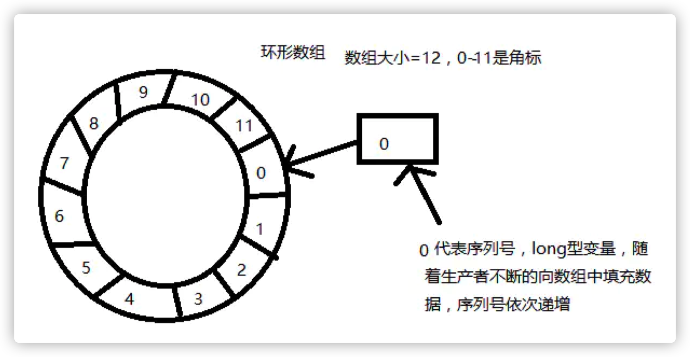
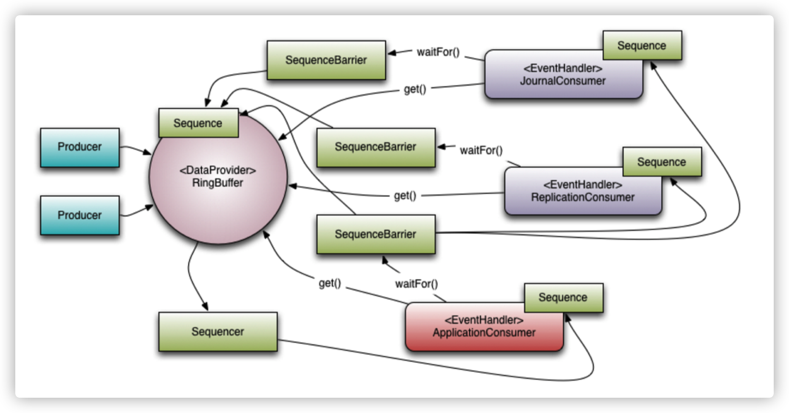

# 无锁并发框架Disruptor

Disruptor 是一个开源框架，研发的初衷是为了解决高并发下列队锁的问题，最早由 LMAX（一种新型零售金融交易平台）提出并使用，能够在无锁的情况下实现队列的并发操 作，并号称能够在一个线程里每秒处理6百万笔订单。

框架最经典也是最多的应用场景：生产消费。

生产消费模型，比如 BlockingQueue，大多是基于条件阻塞方式的，性能不够优秀！

- ArrayBlockingQueue：基于数组形式的队列，通过加锁的方式，来保证多线程 情况下数据的安全；

- LinkedBlockingQueue：基于链表形式的队列，也通过加锁的方式，来保证多线 程情况下数据的安全；

- ConcurrentLinkedQueue：基于链表形式的队列，通过 compare and swap（简称 CAS）协议的方式，来保证多线程情况下数据的安全，不加锁，主要使用了 Java 中的 `sun.misc.Unsafe` 类来实现；

## 1. 核心设计原理

Disruptor 通过以下设计来解决队列速度慢的问题： 

- 环形数组结构

    为了避免垃圾回收，采用数组而非链表。同时，数组对处理器的缓存机制更加友好（回顾一下： CPU 加载空间局部性原则）。

- 元素位置定位

    数组长度 2^n，通过位运算，加快定位的速度。下标采取递增的形式。不用担心 index 溢出的问 题。index 是 long 类型，即使100万 QPS 的处理速度，也需要30万年才能用完。

- 无锁设计

    每个生产者或者消费者线程，会先申请可以操作的元素在数组中的位置，申请到之后，直接在该位 置写入或者读取数据。

### 1.1 数据结构

框架使用 RingBuffer 来作为队列的数据结构，RingBuffer就是一个可自定义大小的环形数组。除数组外还有一个序列号 (sequence)，用以指向下一个可用的元素，供生产者与消费者使用。原理图如下所示： 

#### Sequence

mark：Disruptor 通过顺序递增的序号来编号管理通过其进行交换的数据（事件），对数据(事件)的处理过程总是沿着序号逐个递增处理。 

##### 数组+序列号设计的优势 

HashMap 在知道索引 (index) 下标的情况下，存与取数组上的元素 时间复杂度只有 O(1)，而这个 index 可以通过序列号与数组的长度取模来计算得出， `index=sequence % table.length`。当然也可以用位运算来计算效率更高，此时 `table.length` 必须是2的幂次方(原理前面讲过)。

### 1.2 概念与作用

- RingBuffer

    Disruptor 底层数据结构实现，核心类，是线程间交换数据的中 转地； 

- Sequencer

    序号管理器，生产同步的实现者，负责消费者/生产者各自序号、序号栅栏的管理和协调，Sequencer 有单生产者,多生产者两种不同的模式,里面实现了各种同步的算法；

- Sequence

    序号，声明一个序号，用于跟踪 ringbuffer 中任务的变化和消费 者的消费情况，disruptor 里面大部分的并发代码都是通过对 Sequence 的值同步修改实现的,而非锁,这是 disruptor 高性能的一个主要原因；

- SequenceBarrier

    序号栅栏，管理和协调生产者的游标序号和各个消费者的 序号，确保生产者不会覆盖消费者未来得及处理的消息，确保存在依赖的消费者之间能够按照正确的顺序处理，Sequence Barrier 是由 Sequencer 创建的,并被 Processor 持有； 

- EventProcessor

    事件处理器，监听 RingBuffer 的事件，并消费可用事件， 从 RingBuffer 读取的事件会交由实际的生产者实现类来消费；它会一直侦听下一个可 用的序号，直到该序号对应的事件已经准备好。

- EventHandler

    业务处理器，是实际消费者的接口，完成具体的业务逻辑实 现，第三方实现该接口；代表着消费者。

- Producer

    生产者接口，第三方线程充当该角色，producer 向 RingBuffer 写 入事件。

- Wait Strategy

    Wait Strategy 决定了一个消费者怎么等待生产者将事件 （Event）放入 Disruptor 中。

### 1.3 等待策略

#### BlockingWaitStrategy

Disruptor 的默认策略是 BlockingWaitStrategy。在BlockingWaitStrategy 内部是使用锁和 condition 来控制线程的唤醒。BlockingWaitStrategy 是最低效的策略，但其对CPU的消耗最小并且在各种不同部署环境中能提供更加一致的性能表现。

#### SleepingWaitStrategy

SleepingWaitStrategy 的性能表现跟 BlockingWaitStrategy 差不多，对 CPU 的消耗也类似，但其对生产者线程的影响最小，通过使用 `LockSupport.parkNanos(1)` 来实现循环等待。一般来说 Linux 系统会暂停一个线程约60µs，这样做的好处是，生产线程不需要采取任何其他行动就可以增加适当的计数器，也不需要花费时间信号通知条件变量。但是，在生产者线程和使用者线程之间移动事件的平均延迟会更高。它在不需要低延迟并且对生产线程的影响较小的情况最好。一个常见的用例是异步日志记录。

#### YieldingWaitStrategy 

YieldingWaitStrategy 是可以使用在低延迟系统的策略之一。YieldingWaitStrategy 将自旋以等待序列增加到适当的值。在循环体内，将调用 `Thread.yield()`，以允许其他排队的线程运行。在要求极高性能且事件处理线数小于 CPU 逻辑核心数的场景中，推荐使用此策略；例如，CPU 开启超线程的特性。

#### BusySpinWaitStrategy

性能最好，适合用于低延迟的系统。在要求极高性能且事件处理线程数小于 CPU 逻辑核心数的场景中，推荐使用此策略；例如，CPU 开启超线程的特性。

### 1.4 写数据

单线程写数据的流程：

1. 申请写入 m 个元素；

2. 若是有 m 个元素可以入，则返回最大的序列号。这儿主要判断是否会覆盖未读的元素；

3. 若是返回的正确，则生产者开始写入元素。