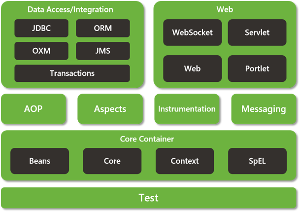

# Spring源码介绍和编译

## 1. Spring体系架构（基于4.x）

### 1.1 Core Container（核心容器）

该模块主要包含 Core、Beans、Context 和 SpEL 模块。其中 Core 和 Beans 是整个框架最基础的部分，提供IOC和依赖注入特性。这里最重要的概念就是 BeanFactory，提供了以 Factory 模式的实现来消除对程序性

单例模式。

- Core：模块主要包含 Spring 框架最基本的核心工具类，Core 是其他组件的基础核心。
- Beans：模块主要包含访问配置文件、创建/管理 Bean 以及 IOC/DI 相关的类。
- Context：继承了 Beans 的特性，主要为 Spring 提供大量的扩展，如国际化、事件机制、资源加载等待。ApplicationContext 接口是 Context 模块的关键。
- SpEL：模块提供了一个强大的语言表达式。

### 1.2 AOP and Instrumentation

提供符合 AOP Alliance 标准的面向切面编程的实现，可以让你定义如方法拦截器和切点，从而降低程序之间的耦合性。

- AspectJ 模块：提供了与 AspectJ 的集成 。
- Instrumentation 模块：提供用于某些应用程序服务器的类工具支持和类加载器实现 。

### 1.3 Messaging

该模块具有来自 Spring Integration 项目的关键抽象，如 Message，MessageChannel，MessageHandler 等。它们构成基于消息的应用程序的基础。该模块还包括一组注释，用于将消息映射到方法，类似于基于 Spring MVC 注释的编程模型。

### 1.4 Data Access/Integration

数据访问/集成层由 JDBC，ORM，OXM，JMS 和事务模块组成。

- JDBC 模块：提供了 JDBC 抽象层，从而无需进行繁琐的JDBC编码和数据库特定错误代码（不同数据代码可能不同）的解析。
- 事务模块：支持对实现特殊接口的类以及所有 POJO（普通 Java 对象）进行编程和声明式事务管理。
- ORM 模块：该模块为当前流行的 ORM（包括 JPA，JDO 和 Hibernate）提供了集成层。使用ORM模块，可以将所有这些O/R映射框架与Spring提供的所有功能结合使用，如前面提到的事务管理功能。
- OXM 模块：提供了一个抽象层，该抽象层支持 Object/ XML 映射实现，例如 JAXB，Castor，XMLBeans，JiBX和 XStream。
- JMS 模块（Java Messaging Service）：包含用于生成和使用消息的功能。从 Spring Framework 4.1 开始，提供了与 Spring-Messaging 模块集成。

### 1.5 Web

Web 上下文模块建立在应用程序上下文模块之上，为基于 Web 的应用程序提供上下文支持。该模块包含 Web、WebMVC、Web Socket 和 Web-Porlet 模块。

- Web 模块：提供了基本的面向 Web 的集成功能，如文件上传功能以及使用Servlet监听器和面向Web的应用程序上下文对 IoC 容器的初始化。
- WebMVC 模块（也称为 Web-Servlet 模块）：包含基于 Spring 的 Model-View-Controller（MVC）支持和针对Web 应用程序的 Rest Web 服务实现。
- Web-Portlet 模块（也称为 Web-Portlet 模块）：提供Portlet环境中的MVC实现。

### 1.6 Test

该模块支持使用 JUnit 或 TestNG 对 Spring 组件进行单元测试和集成测试。