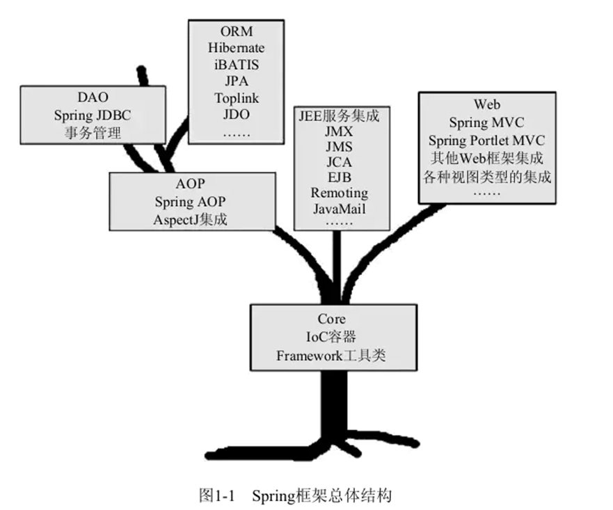
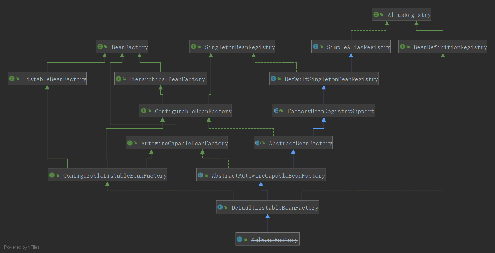
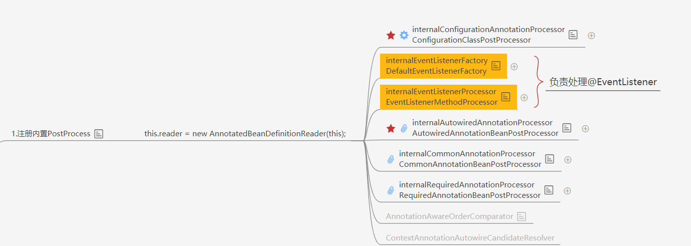
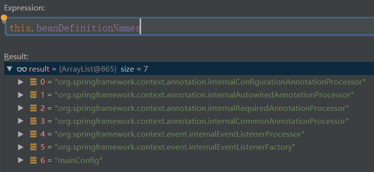
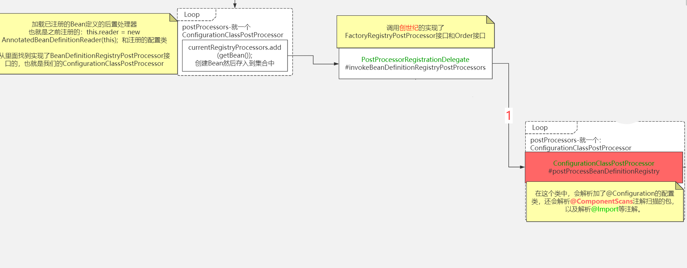
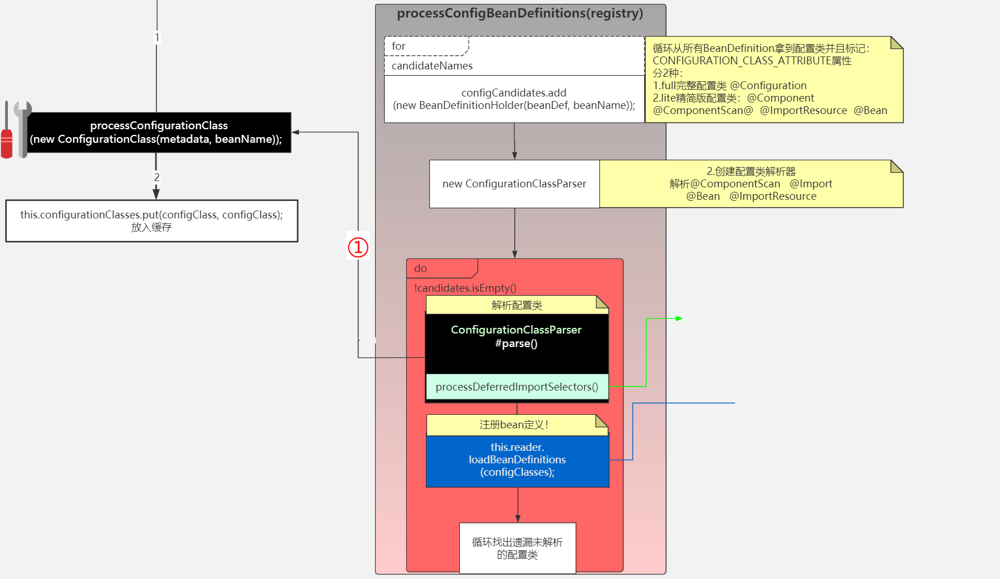
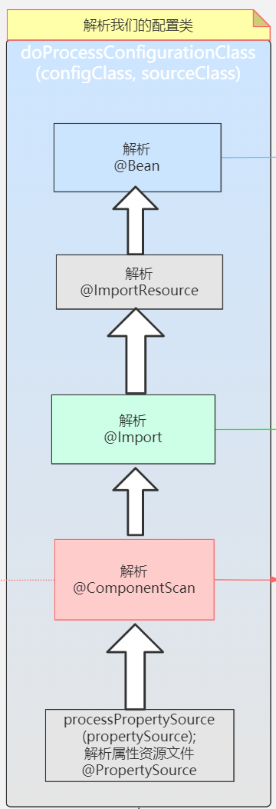
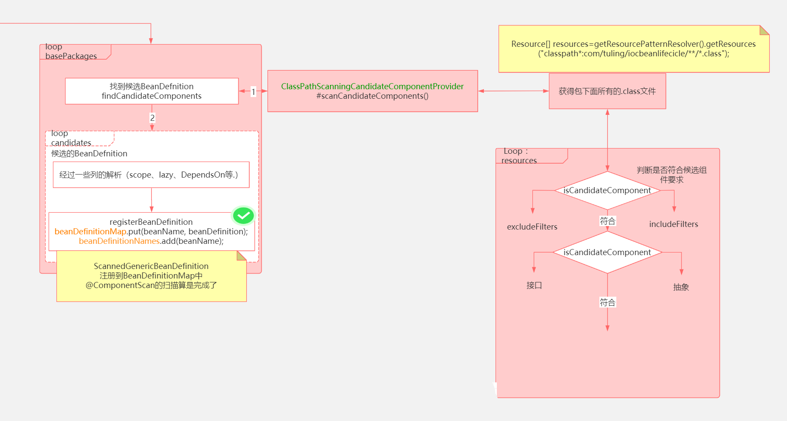
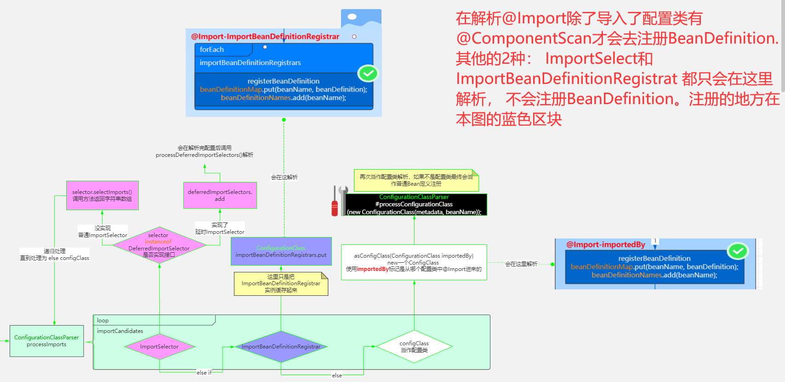

# Spring Ioc容器加载过程—Bean的生命周期源码深度剖析

Spring 最重要的概念是 IOC 和 AOP，其中IOC又是Spring中的根基：

​    

本文要说的 IOC 总体来说有两处地方最重要，一个是创建 Bean 容器，一个是初始化 Bean。为了保持文章的严谨性，如果同学们发现文章有误请一定不吝指出。

#### Demo

##### 配置类 MainConfig.java

```java
/**
 * Created by xsls on 2019/8/15.
 */
@Configuration
@ComponentScan(basePackages = {"com.tuling.iocbeanlifecicle"}) 
public class MainConfig {
  
}
```

##### Bean MainStart.java

```java
@Component
public class Car {

   private String name;
   @Autowired
   private Tank tank;

   public void setTank(Tank tank) {
      this.tank = tank;
   }

   public Tank getTank() {
      return tank;
   }

   public String getName() {
      return name;
   }

   public void setName(String name) {
      this.name = name;
   }

   public Car() {
      System.out.println("car加载....");
   }
}
```

## 1. Spring IoC容器的加载过程

### 1.1 实例化化容器：AnnotationConfigApplicationContext 

从这里出发：

```java
// 加载spring上下文
AnnotationConfigApplicationContext context = 
				new AnnotationConfigApplicationContext(MainConfig.class);
```

###### AnnotationConfigApplicationContext的结构关系：

​    

###### 创建AnnotationConfigApplicationContext对象

```java
//根据参数类型可以知道，其实可以传入多个annotatedClasses，但是这种情况出现的比较少
public AnnotationConfigApplicationContext(Class<?>... annotatedClasses) {
  //调用无参构造函数，会先调用父类GenericApplicationContext的构造函数
  //父类的构造函数里面就是初始化DefaultListableBeanFactory，并且赋值给beanFactory
  //本类的构造函数里面，初始化了一个读取器：AnnotatedBeanDefinitionReader read，一个扫描器ClassPathBeanDefinitionScanner scanner
  //scanner的用处不是很大，它仅仅是在我们外部手动调用 .scan 等方法才有用，常规方式是不会用到scanner对象的
  this();
  //把传入的类进行注册，这里有两个情况，
  //传入传统的配置类
  //传入bean（虽然一般没有人会这么做
  //看到后面会知道spring把传统的带上@Configuration的配置类称之为FULL配置类，不带@Configuration的称之为Lite配置类
  //但是我们这里先把带上@Configuration的配置类称之为传统配置类，不带的称之为普通bean
  register(annotatedClasses);
  //刷新
  refresh();
}
```

> **注意**
>
> 1. 这是一个有参的构造方法，可以接收多个配置类，不过一般情况下，只会传入一个配置类。
> 2. 这个配置类有两种情况，一种是传统意义上的带上 @Configuration 注解的配置类，还有一种是没有带上 @Configuration，但是带有 @Component，@Import，@ImportResouce，@Service，@ComponentScan 等注解的配置类，在 Spring 内部把前者称为Full配置类，把后者称之为 Lite 配置类。在本源码分析中，有些地方也把 Lite 配置类称为**普通 Bean**。

使用断点调试，通过this()调用此类无参的构造方法，代码到下面：

```java
public class AnnotationConfigApplicationContext extends GenericApplicationContext implements AnnotationConfigRegistry {

    //注解bean定义读取器，主要作用是用来读取被注解的了bean
    private final AnnotatedBeanDefinitionReader reader;

    //扫描器，它仅仅是在我们外部手动调用 .scan 等方法才有用，常规方式是不会用到scanner对象的
    private final ClassPathBeanDefinitionScanner scanner;

    /**
     * Create a new AnnotationConfigApplicationContext that needs to be populated
     * through {@link #register} calls and then manually {@linkplain #refresh refreshed}.
     */
    public AnnotationConfigApplicationContext() {
        //会隐式调用父类的构造方法，初始化DefaultListableBeanFactory

        //初始化一个Bean读取器
        this.reader = new AnnotatedBeanDefinitionReader(this);

        //初始化一个扫描器，它仅仅是在我们外部手动调用 .scan 等方法才有用，常规方式是不会用到scanner对象的
        this.scanner = new ClassPathBeanDefinitionScanner(this);
    }
}
```

首先无参构造方法中就是对读取器 `reader` 和扫描器 `scanner` 进行了实例化，reader的类型是 `AnnotatedBeanDefinitionReader`，可以看出它是一个 “打了注解的Bean定义读取器”，`scanner` 的类型 是`ClassPathBeanDefinitionScanner`，它仅仅是在外面手动调用 `.scan` 方法，或者调用参数为String的构造方法，传入需要扫描的包名才会用到，像这样方式传入的配置类是不会用到这个scanner对象的。

`AnnotationConfigApplicationContext` 类是有继承关系的，会隐式调用父类的构造方法：

### 1.2 实例化工厂 DefaultListableBeanFactory

```java
public class GenericApplicationContext extends AbstractApplicationContext implements BeanDefinitionRegistry {

    private final DefaultListableBeanFactory beanFactory;

    @Nullable
    private ResourceLoader resourceLoader;

    private boolean customClassLoader = false;

    private final AtomicBoolean refreshed = new AtomicBoolean();


    /**
     * Create a new GenericApplicationContext.
     * @see #registerBeanDefinition
     * @see #refresh
     */
    public GenericApplicationContext() {
        this.beanFactory = new DefaultListableBeanFactory();
    }
}
```

DefaultListableBeanFactory的关系图

​    

DefaultListableBeanFactory是相当重要的，从字面意思就可以看出它是一个Bean的工厂，什么是Bean的工厂？当然就是用来生产和获得Bean的。

### 1.3 实例化BeanDefinition读取器—AnnotatedBeanDefinitionReader

主要做了2件事情

- 注册内置BeanPostProcessor
- 注册相关的BeanDefinition

​    

让我们把目光回到AnnotationConfigApplicationContext的无参构造方法，让我们看看Spring在初始化AnnotatedBeanDefinitionReader的时候做了什么：

```java
public AnnotatedBeanDefinitionReader(BeanDefinitionRegistry registry) {
	this(registry, getOrCreateEnvironment(registry));
}
```

这里的BeanDefinitionRegistry当然就是AnnotationConfigApplicationContext的实例了，这里又直接调用了此类其他的构造方法：

```java
public AnnotatedBeanDefinitionReader(BeanDefinitionRegistry registry, Environment environment) {
  Assert.notNull(registry, "BeanDefinitionRegistry must not be null");
  Assert.notNull(environment, "Environment must not be null");
  this.registry = registry;
  this.conditionEvaluator = new ConditionEvaluator(registry, environment, null);
  AnnotationConfigUtils.registerAnnotationConfigProcessors(this.registry);
}
```

让我们把目光移动到这个方法的最后一行，进入registerAnnotationConfigProcessors方法：

```java
public static void registerAnnotationConfigProcessors(BeanDefinitionRegistry registry) {
	registerAnnotationConfigProcessors(registry, null);
}
```

这又是一个门面方法，再点进去，这个方法的返回值Set，但是上游方法并没有去接收这个返回值，所以这个方法的返回值也不是很重要了，当然方法内部给这个返回值赋值也不重要了。由于这个方法内容比较多，这里就把最核心的贴出来，这个方法的核心就是注册Spring内置的多个Bean：

```java
if (!registry.containsBeanDefinition(CONFIGURATION_ANNOTATION_PROCESSOR_BEAN_NAME)) {
  RootBeanDefinition def = new RootBeanDefinition(ConfigurationClassPostProcessor.class);
  def.setSource(source);
  beanDefs.add(
    		registerPostProcessor(registry, def, CONFIGURATION_ANNOTATION_PROCESSOR_BEAN_NAME));
}
```

- 判断容器中是否已经存在了ConfigurationClassPostProcessor Bean
- 如果不存在（当然这里肯定是不存在的），就通过RootBeanDefinition的构造方法获得ConfigurationClassPostProcessor的BeanDefinition，RootBeanDefinition是BeanDefinition的子类
- 执行registerPostProcessor方法，registerPostProcessor方法内部就是注册Bean，当然这里注册其他Bean也是一样的流程。

#### BeanDefinition是什么？

BeanDefinition联系图

###### 向上


- **BeanMetadataElement接口**：BeanDefinition元数据，返回该Bean的来源
- **AttributeAccessor接口**：提供对BeanDefinition属性操作能力，

###### 向下


它是用来描述Bean的，里面存放着关于Bean的一系列信息，比如Bean的作用域，Bean所对应的Class，是否懒加载，是否Primary等等，这个BeanDefinition也相当重要，我们以后会常常和它打交道。**

registerPostProcessor方法：

```java
private static BeanDefinitionHolder registerPostProcessor(
            BeanDefinitionRegistry registry, RootBeanDefinition definition, String beanName) {

	definition.setRole(BeanDefinition.ROLE_INFRASTRUCTURE);
	registry.registerBeanDefinition(beanName, definition);
	return new BeanDefinitionHolder(definition, beanName);
}
```

这方法为BeanDefinition设置了一个Role，ROLE_INFRASTRUCTURE代表这是spring内部的，并非用户定义的，然后又调用了registerBeanDefinition方法，再点进去，Oh No，你会发现它是一个接口，没办法直接点进去了，首先要知道registry实现类是什么，那么它的实现是什么呢？答案是DefaultListableBeanFactory：

```java
public void registerBeanDefinition(String beanName, BeanDefinition beanDefinition)
            throws BeanDefinitionStoreException {
	this.beanFactory.registerBeanDefinition(beanName, beanDefinition);
}
```

这又是一个门面方法，再点进去，核心在于下面两行代码：

```java
//beanDefinitionMap是Map<String, BeanDefinition>，
//这里就是把beanName作为key，ScopedProxyMode作为value，推到map里面
this.beanDefinitionMap.put(beanName, beanDefinition);

//beanDefinitionNames就是一个List<String>,这里就是把beanName放到List中去
this.beanDefinitionNames.add(beanName);
```

从这里可以看出DefaultListableBeanFactory就是我们所说的容器了，里面放着beanDefinitionMap，beanDefinitionNames，beanDefinitionMap是一个hashMap，beanName作为Key,beanDefinition作为Value，beanDefinitionNames是一个集合，里面存放了beanName。打个断点，第一次运行到这里，监视这两个变量：


**DefaultListableBeanFactory中的beanDefinitionMap，beanDefinitionNames也是相当重要的，以后会经常看到它，最好看到它，第一时间就可以反应出它里面放了什么数据**

这里仅仅是注册，可以简单的理解为把一些原料放入工厂，工厂还没有真正的去生产。

上面已经介绍过，这里会一连串注册好几个Bean，在这其中最重要的一个Bean（没有之一）就是BeanDefinitionRegistryPostProcessor Bean。

**ConfigurationClassPostProcessor实现BeanDefinitionRegistryPostProcessor接口，BeanDefinitionRegistryPostProcessor接口又扩展了BeanFactoryPostProcessor接口，BeanFactoryPostProcessor是Spring的扩展点之一，ConfigurationClassPostProcessor是Spring极为重要的一个类，必须牢牢的记住上面所说的这个类和它的继承关系。**

​    

除了注册了ConfigurationClassPostProcessor，还注册了其他Bean，其他Bean也都实现了其他接口，比如BeanPostProcessor等。

**BeanPostProcessor接口也是Spring的扩展点之一。**

至此，实例化AnnotatedBeanDefinitionReader reader分析完毕。

### 1.4 创建BeanDefinition扫描器—ClassPathBeanDefinitionScanner

由于常规使用方式是不会用到AnnotationConfigApplicationContext里面的scanner的，这里的scanner仅仅是为了程序员可以手动调用AnnotationConfigApplicationContext对象的scan方法。所以这里就不看scanner是如何被实例化的了。

### 1.5 注册配置类为BeanDefinition—register(annotatedClasses)

把目光回到最开始，再分析第二行代码：

```java
register(annotatedClasses);
```

这里传进去的是一个数组，最终会循环调用如下方法：

```java
<T> void doRegisterBean(Class<T> annotatedClass, @Nullable Supplier<T> instanceSupplier, @Nullable String name,
@Nullable Class<? extends Annotation>[] qualifiers, BeanDefinitionCustomizer... definitionCustomizers) {
    //AnnotatedGenericBeanDefinition可以理解为一种数据结构，是用来描述Bean的，这里的作用就是把传入的标记了注解的类
    //转为AnnotatedGenericBeanDefinition数据结构，里面有一个getMetadata方法，可以拿到类上的注解
    AnnotatedGenericBeanDefinition abd = new AnnotatedGenericBeanDefinition(annotatedClass);

    //判断是否需要跳过注解，spring中有一个@Condition注解，当不满足条件，这个bean就不会被解析
    if (this.conditionEvaluator.shouldSkip(abd.getMetadata())) {
        return;
    }

    abd.setInstanceSupplier(instanceSupplier);

    //解析bean的作用域，如果没有设置的话，默认为单例
    ScopeMetadata scopeMetadata = this.scopeMetadataResolver.resolveScopeMetadata(abd);
    abd.setScope(scopeMetadata.getScopeName());

    //获得beanName
    String beanName = (name != null ? name : this.beanNameGenerator.generateBeanName(abd, this.registry));

    //解析通用注解，填充到AnnotatedGenericBeanDefinition，解析的注解为Lazy，Primary，DependsOn，Role，Description
    AnnotationConfigUtils.processCommonDefinitionAnnotations(abd);

    //限定符处理，不是特指@Qualifier注解，也有可能是Primary,或者是Lazy，或者是其他（理论上是任何注解，这里没有判断注解的有效性），如果我们在外面，以类似这种
    //AnnotationConfigApplicationContext annotationConfigApplicationContext = new AnnotationConfigApplicationContext(Appconfig.class);常规方式去初始化spring，
    //qualifiers永远都是空的，包括上面的name和instanceSupplier都是同样的道理
    //但是spring提供了其他方式去注册bean，就可能会传入了
    if (qualifiers != null) {
        //可以传入qualifier数组，所以需要循环处理
        for (Class<? extends Annotation> qualifier : qualifiers) {
            //Primary注解优先
            if (Primary.class == qualifier) {
                abd.setPrimary(true);
            }
            //Lazy注解
            else if (Lazy.class == qualifier) {
                abd.setLazyInit(true);
            }
            //其他，AnnotatedGenericBeanDefinition有个Map<String,AutowireCandidateQualifier>属性，直接push进去
            else {
                abd.addQualifier(new AutowireCandidateQualifier(qualifier));
            }
        }
    }

    for (BeanDefinitionCustomizer customizer : definitionCustomizers) {
        customizer.customize(abd);
    }

    //这个方法用处不大，就是把AnnotatedGenericBeanDefinition数据结构和beanName封装到一个对象中
    BeanDefinitionHolder definitionHolder = new BeanDefinitionHolder(abd, beanName);

    definitionHolder = AnnotationConfigUtils.applyScopedProxyMode(scopeMetadata, definitionHolder, this.registry);

    //注册，最终会调用DefaultListableBeanFactory中的registerBeanDefinition方法去注册，
    //DefaultListableBeanFactory维护着一系列信息，比如beanDefinitionNames，beanDefinitionMap
    //beanDefinitionNames是一个List<String>,用来保存beanName
    //beanDefinitionMap是一个Map,用来保存beanName和beanDefinition
    BeanDefinitionReaderUtils.registerBeanDefinition(definitionHolder, this.registry);
}
```

在这里又要说明下，以常规方式去注册配置类，此方法中除了第一个参数，其他参数都是默认值。

1. 通过AnnotatedGenericBeanDefinition的构造方法，获得配置类的BeanDefinition，这里是不是似曾相似，在注册ConfigurationClassPostProcessor类的时候，也是通过构造方法去获得BeanDefinition的，只不过当时是通过RootBeanDefinition去获得，现在是通过AnnotatedGenericBeanDefinition去获得。
2. 判断需不需要跳过注册，Spring中有一个@Condition注解，如果不满足条件，就会跳过这个类的注册。
3. 然后是解析作用域，如果没有设置的话，默认为单例
4. 获得BeanName。
5. 解析通用注解，填充到AnnotatedGenericBeanDefinition，解析的注解为Lazy，Primary，DependsOn，Role，Description。
6. 限定符处理，不是特指@Qualifier注解，也有可能是Primary，或者是Lazy，或者是其他（理论上是任何注解，这里没有判断注解的有效性）。
7. 把AnnotatedGenericBeanDefinition数据结构和beanName封装到一个对象中（这个不是很重要，可以简单的理解为方便传参）。
8. 注册，最终会调用DefaultListableBeanFactory中的registerBeanDefinition方法去注册：

```java
public static void registerBeanDefinition(
				BeanDefinitionHolder definitionHolder, BeanDefinitionRegistry registry) 
				throws BeanDefinitionStoreException {

    //获取beanName
    // Register bean definition under primary name.
    String beanName = definitionHolder.getBeanName();

    //注册bean
    registry.registerBeanDefinition(beanName, definitionHolder.getBeanDefinition());

    //Spring支持别名
    // Register aliases for bean name, if any.
    String[] aliases = definitionHolder.getAliases();
    if (aliases != null) {
        for (String alias : aliases) {
            registry.registerAlias(beanName, alias);
        }
    }
}
```

这个registerBeanDefinition是不是又有一种似曾相似的感觉，没错，在上面注册Spring内置的Bean的时候，已经解析过这个方法了，这里就不重复了，此时，让我们再观察下beanDefinitionMap beanDefinitionNames两个变量，除了Spring内置的Bean，还有我们传进来的Bean，这里的Bean当然就是我们的配置类了：

​    



到这里注册配置类也分析完毕了。

### 1.6 refresh()

大家可以看到其实到这里，Spring还没有进行扫描，只是实例化了一个工厂，注册了一些内置的Bean和我们传进去的配置类，真正的大头是在第三行代码：

```java
refresh();
```

这个方法做了很多事情，让我们点开这个方法：

```java
public void refresh() throws BeansException, IllegalStateException {
    synchronized (this.startupShutdownMonitor) {
        // Prepare this context for refreshing.
        //刷新预处理，和主流程关系不大，就是保存了容器的启动时间，启动标志等
        prepareRefresh();

        //DefaultListableBeanFactory
        // Tell the subclass to refresh the internal bean factory.
        //和主流程关系也不大，最终获得了DefaultListableBeanFactory，
        // DefaultListableBeanFactory实现了ConfigurableListableBeanFactory
        ConfigurableListableBeanFactory beanFactory = obtainFreshBeanFactory();

        // Prepare the bean factory for use in this context.
        //还是一些准备工作，添加了两个后置处理器：ApplicationContextAwareProcessor，ApplicationListenerDetector
        //还设置了 忽略自动装配 和 允许自动装配 的接口,如果不存在某个bean的时候，spring就自动注册singleton bean
        //还设置了bean表达式解析器 等
        prepareBeanFactory(beanFactory);

        try {
            // Allows post-processing of the bean factory in context subclasses.
            //这是一个空方法
            postProcessBeanFactory(beanFactory);

            // Invoke factory processors registered as beans in the context.
            //执行自定义的BeanFactoryProcessor和内置的BeanFactoryProcessor
            invokeBeanFactoryPostProcessors(beanFactory);

            // Register bean processors that intercept bean creation.
            // 注册BeanPostProcessor
            registerBeanPostProcessors(beanFactory);

            // Initialize message source for this context.
            initMessageSource();

            // Initialize event multicaster for this context.
            initApplicationEventMulticaster();

            // Initialize other special beans in specific context subclasses.
            // 空方法
            onRefresh();

            // Check for listener beans and register them.
            registerListeners();

            // Instantiate all remaining (non-lazy-init) singletons.
            finishBeanFactoryInitialization(beanFactory);

            // Last step: publish corresponding event.
            finishRefresh();
        } catch (BeansException ex) {
            if (logger.isWarnEnabled()) {
                logger.warn("Exception encountered during context initialization - " +
                    "cancelling refresh attempt: " + ex);
            }

            // Destroy already created singletons to avoid dangling resources.
            destroyBeans();

            // Reset 'active' flag.
            cancelRefresh(ex);

            // Propagate exception to caller.
            throw ex;
        }

        finally {
            // Reset common introspection caches in Spring's core, since we
            // might not ever need metadata for singleton beans anymore...
            resetCommonCaches();
        }
    }
}      
```

里面有很多小方法，我们今天的目标是分析前五个小方法：

#### prepareRefresh

从命名来看，就知道这个方法主要做了一些刷新前的准备工作，和主流程关系不大，主要是保存了容器的启动时间，启动标志等。

#### ConfigurableListableBeanFactory beanFactory = obtainFreshBeanFactory()

这个方法和主流程关系也不是很大，可以简单的认为，就是把beanFactory取出来而已。XML模式下会在这里读取BeanDefinition

#### prepareBeanFactory

```java
//还是一些准备工作，添加了两个后置处理器：ApplicationContextAwareProcessor，ApplicationListenerDetector
//还设置了 忽略自动装配 和 允许自动装配 的接口,如果不存在某个bean的时候，spring就自动注册singleton bean
//还设置了bean表达式解析器 等
prepareBeanFactory(beanFactory);
```


这代码相比前面两个就比较重要了，我们需要点进去好好看看，做了什么操作:

```java
protected void prepareBeanFactory(ConfigurableListableBeanFactory beanFactory) {
    // Tell the internal bean factory to use the context's class loader etc.
    beanFactory.setBeanClassLoader(getClassLoader());//设置类加载器

    //设置bean表达式解析器
    beanFactory.setBeanExpressionResolver(new StandardBeanExpressionResolver(beanFactory.getBeanClassLoader()));

    //属性编辑器支持
    beanFactory.addPropertyEditorRegistrar(new ResourceEditorRegistrar(this, getEnvironment()));

    // Configure the bean factory with context callbacks.
    //添加一个后置处理器：ApplicationContextAwareProcessor，此后置处理处理器实现了BeanPostProcessor接口
    beanFactory.addBeanPostProcessor(new ApplicationContextAwareProcessor(this));

    //以下接口，忽略自动装配
    beanFactory.ignoreDependencyInterface(EnvironmentAware.class);
    beanFactory.ignoreDependencyInterface(EmbeddedValueResolverAware.class);
    beanFactory.ignoreDependencyInterface(ResourceLoaderAware.class);
    beanFactory.ignoreDependencyInterface(ApplicationEventPublisherAware.class);
    beanFactory.ignoreDependencyInterface(MessageSourceAware.class);
    beanFactory.ignoreDependencyInterface(ApplicationContextAware.class);

    // BeanFactory interface not registered as resolvable type in a plain factory.
    // MessageSource registered (and found for autowiring) as a bean.
    //以下接口，允许自动装配,第一个参数是自动装配的类型，，第二个字段是自动装配的值
    beanFactory.registerResolvableDependency(BeanFactory.class, beanFactory);
    beanFactory.registerResolvableDependency(ResourceLoader.class, this);
    beanFactory.registerResolvableDependency(ApplicationEventPublisher.class, this);
    beanFactory.registerResolvableDependency(ApplicationContext.class, this);

    // Register early post-processor for detecting inner beans as ApplicationListeners.
    //添加一个后置处理器：ApplicationListenerDetector，此后置处理器实现了BeanPostProcessor接口
    beanFactory.addBeanPostProcessor(new ApplicationListenerDetector(this));

    // Detect a LoadTimeWeaver and prepare for weaving, if found.
    if (beanFactory.containsBean(LOAD_TIME_WEAVER_BEAN_NAME)) {
        beanFactory.addBeanPostProcessor(new LoadTimeWeaverAwareProcessor(beanFactory));
        // Set a temporary ClassLoader for type matching.
        beanFactory.setTempClassLoader(new ContextTypeMatchClassLoader(beanFactory.getBeanClassLoader()));
    }

    //如果没有注册过bean名称为XXX，spring就自己创建一个名称为XXX的singleton bean
    //Register default environment beans.

    if (!beanFactory.containsLocalBean(ENVIRONMENT_BEAN_NAME)) {
        beanFactory.registerSingleton(ENVIRONMENT_BEAN_NAME, getEnvironment());
    }
    if (!beanFactory.containsLocalBean(SYSTEM_PROPERTIES_BEAN_NAME)) {
        beanFactory.registerSingleton(SYSTEM_PROPERTIES_BEAN_NAME, getEnvironment().getSystemProperties());
    }
    if (!beanFactory.containsLocalBean(SYSTEM_ENVIRONMENT_BEAN_NAME)) {
        beanFactory.registerSingleton(SYSTEM_ENVIRONMENT_BEAN_NAME, getEnvironment().getSystemEnvironment());
    }
}
```

主要做了如下的操作：

1. 设置了一个类加载器
2. 设置了bean表达式解析器
3. 添加了属性编辑器的支持
4. 添加了一个后置处理器：ApplicationContextAwareProcessor，此后置处理器实现了BeanPostProcessor接口
5. 设置了一些忽略自动装配的接口
6. 设置了一些允许自动装配的接口，并且进行了赋值操作
7. 在容器中还没有XX的bean的时候，帮我们注册beanName为XX的singleton bean

#### postProcessBeanFactory(beanFactory)

```java
//这是一个空方法
postProcessBeanFactory(beanFactory);
```

**6.5-invokeBeanFactoryPostProcessors(beanFactory)**

可以结合流程图一起观看更佳：

https://www.processon.com/view/link/5f18298a7d9c0835d38a57c0

```java
//执行自定义的BeanFactoryProcessor和内置的BeanFactoryProcessor
invokeBeanFactoryPostProcessors(beanFactory);

// 重点代码终于来了，可以说 这句代码是目前为止最重要，也是内容最多的代码了，我们有必要好好分析下：
protected void invokeBeanFactoryPostProcessors(ConfigurableListableBeanFactory beanFactory) {

//getBeanFactoryPostProcessors真是坑，第一次看到这里的时候，愣住了，总觉得获得的永远都是空的集合，掉入坑里，久久无法自拔
//后来才知道spring允许我们手动添加BeanFactoryPostProcessor
//即：annotationConfigApplicationContext.addBeanFactoryPostProcessor(XXX);
PostProcessorRegistrationDelegate.invokeBeanFactoryPostProcessors(beanFactory, getBeanFactoryPostProcessors());

    // Detect a LoadTimeWeaver and prepare for weaving, if found in the meantime
    // (e.g. through an @Bean method registered by ConfigurationClassPostProcessor)
    if (beanFactory.getTempClassLoader() == null && beanFactory.containsBean(LOAD_TIME_WEAVER_BEAN_NAME)) {
        beanFactory.addBeanPostProcessor(new LoadTimeWeaverAwareProcessor(beanFactory));
        beanFactory.setTempClassLoader(new ContextTypeMatchClassLoader(beanFactory.getBeanClassLoader()));
    }
}
```

让我们看看第一个小方法的第二个参数：

```java
public List<BeanFactoryPostProcessor> getBeanFactoryPostProcessors() { 	
    return this.beanFactoryPostProcessors;
}     
```

这里获得的是BeanFactoryPostProcessor，当我看到这里的时候，愣住了，通过IDEA的查找引用功能，我发现这个集合永远都是空的，根本没有代码为这个集合添加数据，很久都没有想通，后来才知道我们在外部可以手动添加一个后置处理器，而不是交给Spring去扫描，即：

```java
AnnotationConfigApplicationContext annotationConfigApplicationContext =
				new AnnotationConfigApplicationContext(AppConfig.class);
annotationConfigApplicationContext.addBeanFactoryPostProcessor(XXX);
```

只有这样，这个集合才不会为空，但是应该没有人这么做吧，当然也有可能是我孤陋寡闻。

让我们点开invokeBeanFactoryPostProcessors方法：

```java
public static void invokeBeanFactoryPostProcessors(
        ConfigurableListableBeanFactory beanFactory, List<BeanFactoryPostProcessor> beanFactoryPostProcessors) {

    // Invoke BeanDefinitionRegistryPostProcessors first, if any.
    Set<String> processedBeans = new HashSet<>();

    //beanFactory是DefaultListableBeanFactory，是BeanDefinitionRegistry的实现类，所以肯定满足if
    if (beanFactory instanceof BeanDefinitionRegistry) {
        BeanDefinitionRegistry registry = (BeanDefinitionRegistry) beanFactory;

        //regularPostProcessors 用来存放BeanFactoryPostProcessor，
        List<BeanFactoryPostProcessor> regularPostProcessors = new ArrayList<>();

        //registryProcessors 用来存放BeanDefinitionRegistryPostProcessor
        //BeanDefinitionRegistryPostProcessor扩展了BeanFactoryPostProcessor
        List<BeanDefinitionRegistryPostProcessor> registryProcessors = new ArrayList<>();

        // 循环传进来的beanFactoryPostProcessors，正常情况下，beanFactoryPostProcessors肯定没有数据
        // 因为beanFactoryPostProcessors是获得手动添加的，而不是spring扫描的
        // 只有手动调用annotationConfigApplicationContext.addBeanFactoryPostProcessor(XXX)才会有数据
        for (BeanFactoryPostProcessor postProcessor : beanFactoryPostProcessors) {
            // 判断postProcessor是不是BeanDefinitionRegistryPostProcessor，因为BeanDefinitionRegistryPostProcessor
            // 扩展了BeanFactoryPostProcessor，所以这里先要判断是不是BeanDefinitionRegistryPostProcessor
            // 是的话，直接执行postProcessBeanDefinitionRegistry方法，然后把对象装到registryProcessors里面去
            if (postProcessor instanceof BeanDefinitionRegistryPostProcessor) {
                BeanDefinitionRegistryPostProcessor registryProcessor =
                        (BeanDefinitionRegistryPostProcessor) postProcessor;
                registryProcessor.postProcessBeanDefinitionRegistry(registry);
                registryProcessors.add(registryProcessor);
            }

            else {//不是的话，就装到regularPostProcessors
                regularPostProcessors.add(postProcessor);
            }
        }

        // Do not initialize FactoryBeans here: We need to leave all regular beans
        // uninitialized to let the bean factory post-processors apply to them!
        // Separate between BeanDefinitionRegistryPostProcessors that implement
        // PriorityOrdered, Ordered, and the rest.
        //一个临时变量，用来装载BeanDefinitionRegistryPostProcessor
        //BeanDefinitionRegistry继承了PostProcessorBeanFactoryPostProcessor
        List<BeanDefinitionRegistryPostProcessor> currentRegistryProcessors = new ArrayList<>();

        // First, invoke the BeanDefinitionRegistryPostProcessors that implement PriorityOrdered.
        // 获得实现BeanDefinitionRegistryPostProcessor接口的类的BeanName:org.springframework.context.annotation.internalConfigurationAnnotationProcessor
        // 并且装入数组postProcessorNames，我理解一般情况下，只会找到一个
        // 这里又有一个坑，为什么我自己创建了一个实现BeanDefinitionRegistryPostProcessor接口的类，也打上了@Component注解
        // 配置类也加上了@Component注解，但是这里却没有拿到
        // 因为直到这一步，Spring还没有去扫描，扫描是在ConfigurationClassPostProcessor类中完成的，也就是下面的第一个
        // invokeBeanDefinitionRegistryPostProcessors方法
        String[] postProcessorNames =
                beanFactory.getBeanNamesForType(BeanDefinitionRegistryPostProcessor.class, true, false);

        for (String ppName : postProcessorNames) {
            if (beanFactory.isTypeMatch(ppName, PriorityOrdered.class)) {
                //获得ConfigurationClassPostProcessor类，并且放到currentRegistryProcessors
                //ConfigurationClassPostProcessor是很重要的一个类，它实现了BeanDefinitionRegistryPostProcessor接口
                //BeanDefinitionRegistryPostProcessor接口又实现了BeanFactoryPostProcessor接口
                //ConfigurationClassPostProcessor是极其重要的类
                //里面执行了扫描Bean，Import，ImportResouce等各种操作
                //用来处理配置类（有两种情况 一种是传统意义上的配置类，一种是普通的bean）的各种逻辑
                currentRegistryProcessors.add(beanFactory.getBean(ppName, BeanDefinitionRegistryPostProcessor.class));
                //把name放到processedBeans，后续会根据这个集合来判断处理器是否已经被执行过了
                processedBeans.add(ppName);
            }
        }

        //处理排序
        sortPostProcessors(currentRegistryProcessors, beanFactory);

        //合并Processors，为什么要合并，因为registryProcessors是装载BeanDefinitionRegistryPostProcessor的
        //一开始的时候，spring只会执行BeanDefinitionRegistryPostProcessor独有的方法
        //而不会执行BeanDefinitionRegistryPostProcessor父类的方法，即BeanFactoryProcessor的方法
        //所以这里需要把处理器放入一个集合中，后续统一执行父类的方法
        registryProcessors.addAll(currentRegistryProcessors);

        //可以理解为执行ConfigurationClassPostProcessor的postProcessBeanDefinitionRegistry方法
        //Spring热插播的体现，像ConfigurationClassPostProcessor就相当于一个组件，Spring很多事情就是交给组件去管理
        //如果不想用这个组件，直接把注册组件的那一步去掉就可以
        invokeBeanDefinitionRegistryPostProcessors(currentRegistryProcessors, registry);

        //因为currentRegistryProcessors是一个临时变量，所以需要清除
        currentRegistryProcessors.clear();

        // Next, invoke the BeanDefinitionRegistryPostProcessors that implement Ordered.
        // 再次根据BeanDefinitionRegistryPostProcessor获得BeanName，看这个BeanName是否已经被执行过了，有没有实现Ordered接口
        // 如果没有被执行过，也实现了Ordered接口的话，把对象推送到currentRegistryProcessors，名称推送到processedBeans
        // 如果没有实现Ordered接口的话，这里不把数据加到currentRegistryProcessors，processedBeans中，后续再做处理
        // 这里才可以获得我们定义的实现了BeanDefinitionRegistryPostProcessor的Bean
        postProcessorNames = beanFactory.getBeanNamesForType(BeanDefinitionRegistryPostProcessor.class, true, false);
        for (String ppName : postProcessorNames) {
            if (!processedBeans.contains(ppName) && beanFactory.isTypeMatch(ppName, Ordered.class)) {
                currentRegistryProcessors.add(beanFactory.getBean(ppName, BeanDefinitionRegistryPostProcessor.class));
                processedBeans.add(ppName);
            }
        }

        //处理排序
        sortPostProcessors(currentRegistryProcessors, beanFactory);

        //合并Processors
        registryProcessors.addAll(currentRegistryProcessors);

        //执行我们自定义的BeanDefinitionRegistryPostProcessor
        invokeBeanDefinitionRegistryPostProcessors(currentRegistryProcessors, registry);

        //清空临时变量
        currentRegistryProcessors.clear();

        // Finally, invoke all other BeanDefinitionRegistryPostProcessors until no further ones appear.
        // 上面的代码是执行了实现了Ordered接口的BeanDefinitionRegistryPostProcessor，
        // 下面的代码就是执行没有实现Ordered接口的BeanDefinitionRegistryPostProcessor
        boolean reiterate = true;
        while (reiterate) {
            reiterate = false;
            postProcessorNames = beanFactory.getBeanNamesForType(BeanDefinitionRegistryPostProcessor.class, true, false);
            for (String ppName : postProcessorNames) {
                if (!processedBeans.contains(ppName)) {
                    currentRegistryProcessors.add(beanFactory.getBean(ppName, BeanDefinitionRegistryPostProcessor.class));
                    processedBeans.add(ppName);
                    reiterate = true;
                }
            }
            sortPostProcessors(currentRegistryProcessors, beanFactory);
            registryProcessors.addAll(currentRegistryProcessors);
            invokeBeanDefinitionRegistryPostProcessors(currentRegistryProcessors, registry);
            currentRegistryProcessors.clear();
        }

        // Now, invoke the postProcessBeanFactory callback of all processors handled so far.
        //registryProcessors集合装载BeanDefinitionRegistryPostProcessor
        //上面的代码是执行子类独有的方法，这里需要再把父类的方法也执行一次
        invokeBeanFactoryPostProcessors(registryProcessors, beanFactory);

        //regularPostProcessors装载BeanFactoryPostProcessor，执行BeanFactoryPostProcessor的方法
        //但是regularPostProcessors一般情况下，是不会有数据的，只有在外面手动添加BeanFactoryPostProcessor，才会有数据
        invokeBeanFactoryPostProcessors(regularPostProcessors, beanFactory);
    }

    else {
        // Invoke factory processors registered with the context instance.
        invokeBeanFactoryPostProcessors(beanFactoryPostProcessors, beanFactory);
    }

    // Do not initialize FactoryBeans here: We need to leave all regular beans
    // uninitialized to let the bean factory post-processors apply to them!
    //找到BeanFactoryPostProcessor实现类的BeanName数组
    String[] postProcessorNames =
            beanFactory.getBeanNamesForType(BeanFactoryPostProcessor.class, true, false);

    // Separate between BeanFactoryPostProcessors that implement PriorityOrdered,
    // Ordered, and the rest.
    List<BeanFactoryPostProcessor> priorityOrderedPostProcessors = new ArrayList<>();
    List<String> orderedPostProcessorNames = new ArrayList<>();
    List<String> nonOrderedPostProcessorNames = new ArrayList<>();
    //循环BeanName数组
    for (String ppName : postProcessorNames) {
        //如果这个Bean被执行过了，跳过
        if (processedBeans.contains(ppName)) {
            // skip - already processed in first phase above
        }
        //如果实现了PriorityOrdered接口，加入到priorityOrderedPostProcessors
        else if (beanFactory.isTypeMatch(ppName, PriorityOrdered.class)) {
            priorityOrderedPostProcessors.add(beanFactory.getBean(ppName, BeanFactoryPostProcessor.class));
        }
        //如果实现了Ordered接口，加入到orderedPostProcessorNames
        else if (beanFactory.isTypeMatch(ppName, Ordered.class)) {
            orderedPostProcessorNames.add(ppName);
        }
        //如果既没有实现PriorityOrdered，也没有实现Ordered。加入到nonOrderedPostProcessorNames
        else {
            nonOrderedPostProcessorNames.add(ppName);
        }
    }

    //排序处理priorityOrderedPostProcessors，即实现了PriorityOrdered接口的BeanFactoryPostProcessor
    // First, invoke the BeanFactoryPostProcessors that implement PriorityOrdered.
    sortPostProcessors(priorityOrderedPostProcessors, beanFactory);
    //执行priorityOrderedPostProcessors
    invokeBeanFactoryPostProcessors(priorityOrderedPostProcessors, beanFactory);

    //执行实现了Ordered接口的BeanFactoryPostProcessor
    // Next, invoke the BeanFactoryPostProcessors that implement Ordered.
    List<BeanFactoryPostProcessor> orderedPostProcessors = new ArrayList<>();
    for (String postProcessorName : orderedPostProcessorNames) {
        orderedPostProcessors.add(beanFactory.getBean(postProcessorName, BeanFactoryPostProcessor.class));
    }
    sortPostProcessors(orderedPostProcessors, beanFactory);
    invokeBeanFactoryPostProcessors(orderedPostProcessors, beanFactory);

    // 执行既没有实现PriorityOrdered接口，也没有实现Ordered接口的BeanFactoryPostProcessor
    // Finally, invoke all other BeanFactoryPostProcessors.
    List<BeanFactoryPostProcessor> nonOrderedPostProcessors = new ArrayList<>();
    for (String postProcessorName : nonOrderedPostProcessorNames) {
        nonOrderedPostProcessors.add(beanFactory.getBean(postProcessorName, BeanFactoryPostProcessor.class));
    }
    invokeBeanFactoryPostProcessors(nonOrderedPostProcessors, beanFactory);

    // Clear cached merged bean definitions since the post-processors might have
    // modified the original metadata, e.g. replacing placeholders in values...
    beanFactory.clearMetadataCache();
}
```

首先判断beanFactory是不是BeanDefinitionRegistry的实例，当然肯定是的，然后执行如下操作：

1. 定义了一个Set，装载BeanName，后面会根据这个Set，来判断后置处理器是否被执行过了。
2. 定义了两个List，一个是regularPostProcessors，用来装载BeanFactoryPostProcessor，一个是registryProcessors用来装载BeanDefinitionRegistryPostProcessor，其中BeanDefinitionRegistryPostProcessor扩展了BeanFactoryPostProcessor。BeanDefinitionRegistryPostProcessor有两个方法，一个是独有的postProcessBeanDefinitionRegistry方法，一个是父类的postProcessBeanFactory方法。
3. 循环传进来的beanFactoryPostProcessors，上面已经解释过了，一般情况下，这里永远都是空的，只有手动add beanFactoryPostProcessor，这里才会有数据。我们假设beanFactoryPostProcessors有数据，进入循环，判断postProcessor是不是BeanDefinitionRegistryPostProcessor，因为BeanDefinitionRegistryPostProcessor扩展了BeanFactoryPostProcessor，所以这里先要判断是不是BeanDefinitionRegistryPostProcessor，是的话，执行postProcessBeanDefinitionRegistry方法，然后把对象装到registryProcessors里面去，不是的话，就装到regularPostProcessors。
4. 定义了一个临时变量：currentRegistryProcessors，用来装载BeanDefinitionRegistryPostProcessor。
5. getBeanNamesForType，顾名思义，是根据类型查到BeanNames，这里有一点需要注意，就是去哪里找，点开这个方法的话，就知道是循环beanDefinitionNames去找，这个方法以后也会经常看到。这里传了BeanDefinitionRegistryPostProcessor.class，就是找到类型为BeanDefinitionRegistryPostProcessor的后置处理器，并且赋值给postProcessorNames。一般情况下，只会找到一个，就是org.springframework.context.annotation.internalConfigurationAnnotationProcessor，也就是ConfigurationAnnotationProcessor。这个后置处理器在上一节中已经说明过了，十分重要。这里有一个问题，为什么我自己写了个类，实现了BeanDefinitionRegistryPostProcessor接口，也打上了@Component注解，但是这里没有获得，因为直到这一步，Spring还没有完成扫描，扫描是在ConfigurationClassPostProcessor类中完成的，也就是下面第一个invokeBeanDefinitionRegistryPostProcessors方法。
6. 循环postProcessorNames，其实也就是org.springframework.context.annotation.internalConfigurationAnnotationProcessor，判断此后置处理器是否实现了PriorityOrdered接口（ConfigurationAnnotationProcessor也实现了PriorityOrdered接口），

如果实现了，把它添加到currentRegistryProcessors这个临时变量中，再放入processedBeans，代表这个后置处理已经被处理过了。当然现在还没有处理，但是马上就要处理了。。。


7. 进行排序，PriorityOrdered是一个排序接口，如果实现了它，就说明此后置处理器是有顺序的，所以需要排序。当然目前这里只有一个后置处理器，就是ConfigurationClassPostProcessor。

8. 把currentRegistryProcessors合并到registryProcessors，为什么需要合并？因为一开始spring只会执行BeanDefinitionRegistryPostProcessor独有的方法，而不会执行BeanDefinitionRegistryPostProcessor父类的方法，即BeanFactoryProcessor接口中的方法，所以需要把这些后置处理器放入一个集合中，后续统一执行BeanFactoryProcessor接口中的方法。当然目前这里只有一个后置处理器，就是ConfigurationClassPostProcessor。

9. 可以理解为执行currentRegistryProcessors中的ConfigurationClassPostProcessor中的postProcessBeanDefinitionRegistry方法，这就是Spring设计思想的体现了，在这里体现的就是其中的**热插拔**，插件化开发的思想。Spring中很多东西都是交给插件去处理的，这个后置处理器就相当于一个插件，如果不想用了，直接不添加就是了。这个方法特别重要，我们后面会详细说来。



10. 清空currentRegistryProcessors，因为currentRegistryProcessors是一个临时变量，已经完成了目前的使命，所以需要清空，当然后面还会用到。

11. 再次根据BeanDefinitionRegistryPostProcessor获得BeanName，然后进行循环，看这个后置处理器是否被执行过了，如果没有被执行过，也实现了Ordered接口的话，把此后置处理器推送到currentRegistryProcessors和processedBeans中。

    这里就可以获得我们定义的，并且打上@Component注解的后置处理器了，因为Spring已经完成了扫描，但是这里需要注意的是，由于ConfigurationClassPostProcessor在上面已经被执行过了，所以虽然可以通过getBeanNamesForType获得，但是并不会加入到currentRegistryProcessors和processedBeans。

12. 处理排序。
13. 合并Processors，合并的理由和上面是一样的。
14. 执行我们自定义的BeanDefinitionRegistryPostProcessor。
15. 清空临时变量。
16. 在上面的方法中，仅仅是执行了实现了Ordered接口的BeanDefinitionRegistryPostProcessor，这里是执行没有实现Ordered接口的BeanDefinitionRegistryPostProcessor。
17. 上面的代码是执行子类独有的方法，这里需要再把父类的方法也执行一次。
18. 执行regularPostProcessors中的后置处理器的方法，需要注意的是，在一般情况下，regularPostProcessors是不会有数据的，只有在外面手动添加BeanFactoryPostProcessor，才会有数据。
19. 查找实现了BeanFactoryPostProcessor的后置处理器，并且执行后置处理器中的方法。和上面的逻辑差不多，不再详细说明。

这就是这个方法中做的主要的事情了，可以说是比较复杂的。但是逻辑还是比较清晰的，在第9步的时候，我说有一个方法会详细说来，现在就让我们好好看看这个方法究竟做了什么吧。



```java
public void processConfigBeanDefinitions(BeanDefinitionRegistry registry) {
    List<BeanDefinitionHolder> configCandidates = new ArrayList<>();
    String[] candidateNames = registry.getBeanDefinitionNames();//获得所有的BeanDefinition的Name，放入candidateNames数组

    //循环candidateNames数组
    for (String beanName : candidateNames) {
        BeanDefinition beanDef = registry.getBeanDefinition(beanName);//根据beanName获得BeanDefinition

        // 内部有两个标记位来标记是否已经处理过了
        // 这里会引发一连串知识盲点
        // 当我们注册配置类的时候，可以不加Configuration注解，直接使用Component ComponentScan Import ImportResource注解，称之为Lite配置类
        // 如果加了Configuration注解，就称之为Full配置类
        // 如果我们注册了Lite配置类，我们getBean这个配置类，会发现它就是原本的那个配置类
        // 如果我们注册了Full配置类，我们getBean这个配置类，会发现它已经不是原本那个配置类了，而是已经被cgilb代理的类了
        // 写一个A类，其中有一个构造方法，打印出“你好”
        // 再写一个配置类，里面有两个bean注解的方法
        // 其中一个方法new了A 类，并且返回A的对象，把此方法称之为getA
        // 第二个方法又调用了getA方法
        // 如果配置类是Lite配置类，会发现打印了两次“你好”，也就是说A类被new了两次
        // 如果配置类是Full配置类，会发现只打印了一次“你好”，也就是说A类只被new了一次，因为这个类被cgilb代理了，方法已经被改写
        if (ConfigurationClassUtils.isFullConfigurationClass(beanDef) ||
                ConfigurationClassUtils.isLiteConfigurationClass(beanDef)) {
            if (logger.isDebugEnabled()) {
                logger.debug("Bean definition has already been processed as a configuration class: " + beanDef);
            }
        }

        //判断是否为配置类（有两种情况 一种是传统意义上的配置类，一种是普通的bean），
        //在这个方法内部，会做判断，这个配置类是Full配置类，还是Lite配置类，并且做上标记
        //满足条件，加入到configCandidates
        else if (ConfigurationClassUtils.checkConfigurationClassCandidate(beanDef, this.metadataReaderFactory)) {
            configCandidates.add(new BeanDefinitionHolder(beanDef, beanName));
        }
    }

    // 如果没有配置类，直接返回
    // Return immediately if no @Configuration classes were found
    if (configCandidates.isEmpty()) {
        return;
    }

    // Sort by previously determined @Order value, if applicable
    //处理排序
    configCandidates.sort((bd1, bd2) -> {
        int i1 = ConfigurationClassUtils.getOrder(bd1.getBeanDefinition());
        int i2 = ConfigurationClassUtils.getOrder(bd2.getBeanDefinition());
        return Integer.compare(i1, i2);
    });

    // Detect any custom bean name generation strategy supplied through the enclosing application context
    SingletonBeanRegistry sbr = null;
    // DefaultListableBeanFactory最终会实现SingletonBeanRegistry接口，所以可以进入到这个if
    if (registry instanceof SingletonBeanRegistry) {
        sbr = (SingletonBeanRegistry) registry;
        if (!this.localBeanNameGeneratorSet) {
            //spring中可以修改默认的bean命名方式，这里就是看用户有没有自定义bean命名方式，虽然一般没有人会这么做
            BeanNameGenerator generator = (BeanNameGenerator) sbr.getSingleton(CONFIGURATION_BEAN_NAME_GENERATOR);
            if (generator != null) {
                this.componentScanBeanNameGenerator = generator;
                this.importBeanNameGenerator = generator;
            }
        }
    }

    if (this.environment == null) {
        this.environment = new StandardEnvironment();
    }

    // Parse each @Configuration class
    ConfigurationClassParser parser = new ConfigurationClassParser(
            this.metadataReaderFactory, this.problemReporter, this.environment,
            this.resourceLoader, this.componentScanBeanNameGenerator, registry);

    Set<BeanDefinitionHolder> candidates = new LinkedHashSet<>(configCandidates);
    Set<ConfigurationClass> alreadyParsed = new HashSet<>(configCandidates.size());
    do {
        //解析配置类（传统意义上的配置类或者是普通bean，核心来了）
        parser.parse(candidates);
        parser.validate();

        Set<ConfigurationClass> configClasses = new LinkedHashSet<>(parser.getConfigurationClasses());
        configClasses.removeAll(alreadyParsed);

        // Read the model and create bean definitions based on its content
        if (this.reader == null) {
            this.reader = new ConfigurationClassBeanDefinitionReader(
                    registry, this.sourceExtractor, this.resourceLoader, this.environment,
                    this.importBeanNameGenerator, parser.getImportRegistry());
        }
        this.reader.loadBeanDefinitions(configClasses);//直到这一步才把Import的类，@Bean @ImportRosource 转换成BeanDefinition
        alreadyParsed.addAll(configClasses);//把configClasses加入到alreadyParsed，代表

        candidates.clear();
        //获得注册器里面BeanDefinition的数量 和 candidateNames进行比较
        //如果大于的话，说明有新的BeanDefinition注册进来了
        if (registry.getBeanDefinitionCount() > candidateNames.length) {
            String[] newCandidateNames = registry.getBeanDefinitionNames();//从注册器里面获得BeanDefinitionNames
            Set<String> oldCandidateNames = new HashSet<>(Arrays.asList(candidateNames));//candidateNames转换set
            Set<String> alreadyParsedClasses = new HashSet<>();
            //循环alreadyParsed。把类名加入到alreadyParsedClasses
            for (ConfigurationClass configurationClass : alreadyParsed) {
                alreadyParsedClasses.add(configurationClass.getMetadata().getClassName());
            }
            for (String candidateName : newCandidateNames) {
                if (!oldCandidateNames.contains(candidateName)) {
                    BeanDefinition bd = registry.getBeanDefinition(candidateName);
                    if (ConfigurationClassUtils.checkConfigurationClassCandidate(bd, this.metadataReaderFactory) &&
                            !alreadyParsedClasses.contains(bd.getBeanClassName())) {
                        candidates.add(new BeanDefinitionHolder(bd, candidateName));
                    }
                }
            }
            candidateNames = newCandidateNames;
        }
    }
    while (!candidates.isEmpty());

    // Register the ImportRegistry as a bean in order to support ImportAware @Configuration classes
    if (sbr != null && !sbr.containsSingleton(IMPORT_REGISTRY_BEAN_NAME)) {
        sbr.registerSingleton(IMPORT_REGISTRY_BEAN_NAME, parser.getImportRegistry());
    }

    if (this.metadataReaderFactory instanceof CachingMetadataReaderFactory) {
        // Clear cache in externally provided MetadataReaderFactory; this is a no-op
        // for a shared cache since it'll be cleared by the ApplicationContext.
        ((CachingMetadataReaderFactory) this.metadataReaderFactory).clearCache();
    }
}
```

- 获得所有的BeanName，放入candidateNames数组。
- 循环candidateNames数组，根据beanName获得BeanDefinition，判断此BeanDefinition是否已经被处理过了。
- 判断是否是配置类，如果是的话。加入到configCandidates数组，在判断的时候，还会标记配置类属于Full配置类，还是Lite配置类，这里会引发一连串的知识盲点：
    - 当我们注册配置类的时候，可以不加@Configuration注解，直接使用@Component @ComponentScan @Import @ImportResource等注解，Spring把这种配置类称之为Lite配置类， 如果加了@Configuration注解，就称之为Full配置类。
    - 如果我们注册了Lite配置类，我们getBean这个配置类，会发现它就是原本的那个配置类，如果我们注册了Full配置类，我们getBean这个配置类，会发现它已经不是原本那个配置类了，而是已经被cgilb代理的类了。
    - 写一个A类，其中有一个构造方法，打印出“你好”，再写一个配置类，里面有两个被@bean注解的方法，其中一个方法new了A类，并且返回A的对象，把此方法称之为getA，第二个方法又调用了getA方法，如果配置类是Lite配置类，会发现打印了两次“你好”，也就是说A类被new了两次，如果配置类是Full配置类，会发现只打印了一次“你好”，也就是说A类只被new了一次，因为这个类被cgilb代理了，方法已经被改写。

- 如果没有配置类直接返回。
- 处理排序。
- 解析配置类，可能是Full配置类，也有可能是Lite配置类，这个小方
- 在第6步的时候，只是注册了部分Bean，像 @Import @Bean等，是没有被注册的，这里统一对这些进行注册。

下面是解析配置类的过程：

```java
public void parse(Set<BeanDefinitionHolder> configCandidates) {
    this.deferredImportSelectors = new LinkedList<>();
    //循环传进来的配置类
    for (BeanDefinitionHolder holder : configCandidates) {
        BeanDefinition bd = holder.getBeanDefinition();//获得BeanDefinition
        try {
            //如果获得BeanDefinition是AnnotatedBeanDefinition的实例
            if (bd instanceof AnnotatedBeanDefinition) {
                parse(((AnnotatedBeanDefinition) bd).getMetadata(), holder.getBeanName());
            } else if (bd instanceof AbstractBeanDefinition && ((AbstractBeanDefinition) bd).hasBeanClass()) {
                parse(((AbstractBeanDefinition) bd).getBeanClass(), holder.getBeanName());
            } else {
                parse(bd.getBeanClassName(), holder.getBeanName());
            }
        } catch (BeanDefinitionStoreException ex) {
            throw ex;
        } catch (Throwable ex) {
            throw new BeanDefinitionStoreException(
                    "Failed to parse configuration class [" + bd.getBeanClassName() + "]", ex);
        }
    }

    //执行DeferredImportSelector
    processDeferredImportSelectors();
}
```

因为可以有多个配置类，所以需要循环处理。我们的配置类的BeanDefinition是AnnotatedBeanDefinition的实例，所以会进入第一个if：

```java
protected final void parse(AnnotationMetadata metadata, String beanName) throws IOException {
    processConfigurationClass(new ConfigurationClass(metadata, beanName));
}

protected void processConfigurationClass(ConfigurationClass configClass) throws IOException {

    //判断是否需要跳过
    if (this.conditionEvaluator.shouldSkip(configClass.getMetadata(), ConfigurationPhase.PARSE_CONFIGURATION)) {
        return;
    }

    ConfigurationClass existingClass = this.configurationClasses.get(configClass);
    if (existingClass != null) {
        if (configClass.isImported()) {
            if (existingClass.isImported()) {
                existingClass.mergeImportedBy(configClass);
            }
            // Otherwise ignore new imported config class; existing non-imported class overrides it.
            return;
        } else {
            // Explicit bean definition found, probably replacing an import.
            // Let's remove the old one and go with the new one.
            this.configurationClasses.remove(configClass);
            this.knownSuperclasses.values().removeIf(configClass::equals);
        }
    }

    // Recursively process the configuration class and its superclass hierarchy.
    SourceClass sourceClass = asSourceClass(configClass);
    do {
        sourceClass = doProcessConfigurationClass(configClass, sourceClass);
    }
    while (sourceClass != null);

    this.configurationClasses.put(configClass, configClass);
}
```

重点在于doProcessConfigurationClass方法，需要特别注意，最后一行代码，会把configClass放入一个Map，会在上面第7步中用到。




```java
protected final SourceClass doProcessConfigurationClass(ConfigurationClass configClass, SourceClass sourceClass)
            throws IOException {

    //递归处理内部类，一般不会写内部类
    // Recursively process any member (nested) classes first
    processMemberClasses(configClass, sourceClass);

    // Process any @PropertySource annotations
    //处理@PropertySource注解，@PropertySource注解用来加载properties文件
    for (AnnotationAttributes propertySource : AnnotationConfigUtils.attributesForRepeatable(
            sourceClass.getMetadata(), PropertySources.class,
            org.springframework.context.annotation.PropertySource.class)) {
        if (this.environment instanceof ConfigurableEnvironment) {
            processPropertySource(propertySource);
        } else {
            logger.warn("Ignoring @PropertySource annotation on [" + sourceClass.getMetadata().getClassName() +
                    "]. Reason: Environment must implement ConfigurableEnvironment");
        }
    }

    // Process any @ComponentScan annotations
    //获得ComponentScan注解具体的内容，ComponentScan注解除了最常用的basePackage之外，还有includeFilters，excludeFilters等
    Set<AnnotationAttributes> componentScans = AnnotationConfigUtils.attributesForRepeatable(
            sourceClass.getMetadata(), ComponentScans.class, ComponentScan.class);

    //如果没有打上ComponentScan，或者被@Condition条件跳过，就不再进入这个if
    if (!componentScans.isEmpty() &&
            !this.conditionEvaluator.shouldSkip(sourceClass.getMetadata(), ConfigurationPhase.REGISTER_BEAN)) {
        //循环处理componentScans
        for (AnnotationAttributes componentScan : componentScans) {
            // The config class is annotated with @ComponentScan -> perform the scan immediately
            //componentScan就是@ComponentScan上的具体内容，sourceClass.getMetadata().getClassName()就是配置类的名称
            Set<BeanDefinitionHolder> scannedBeanDefinitions =
                    this.componentScanParser.parse(componentScan, sourceClass.getMetadata().getClassName());
            // Check the set of scanned definitions for any further config classes and parse recursively if needed
            for (BeanDefinitionHolder holder : scannedBeanDefinitions) {
                BeanDefinition bdCand = holder.getBeanDefinition().getOriginatingBeanDefinition();
                if (bdCand == null) {
                    bdCand = holder.getBeanDefinition();
                }
                if (ConfigurationClassUtils.checkConfigurationClassCandidate(bdCand, this.metadataReaderFactory)) {
                    //递归调用，因为可能组件类有被@Bean标记的方法，或者组件类本身也有ComponentScan等注解
                    parse(bdCand.getBeanClassName(), holder.getBeanName());
                }
            }
        }
    }

    // Process any @Import annotations
    //处理@Import注解
    //@Import注解是spring中很重要的一个注解，Springboot大量应用这个注解
    //@Import三种类，一种是Import普通类，一种是Import ImportSelector，还有一种是Import ImportBeanDefinitionRegistrar
    //getImports(sourceClass)是获得import的内容，返回的是一个set
    processImports(configClass, sourceClass, getImports(sourceClass), true);

    // Process any @ImportResource annotations
    //处理@ImportResource注解
    AnnotationAttributes importResource =
            AnnotationConfigUtils.attributesFor(sourceClass.getMetadata(), ImportResource.class);
    if (importResource != null) {
        String[] resources = importResource.getStringArray("locations");
        Class<? extends BeanDefinitionReader> readerClass = importResource.getClass("reader");
        for (String resource : resources) {
            String resolvedResource = this.environment.resolveRequiredPlaceholders(resource);
            configClass.addImportedResource(resolvedResource, readerClass);
        }
    }

    //处理@Bean的方法，可以看到获得了带有@Bean的方法后，不是马上转换成BeanDefinition，而是先用一个set接收
    // Process individual @Bean methods
    Set<MethodMetadata> beanMethods = retrieveBeanMethodMetadata(sourceClass);
    for (MethodMetadata methodMetadata : beanMethods) {
        configClass.addBeanMethod(new BeanMethod(methodMetadata, configClass));
    }

    // Process default methods on interfaces
    processInterfaces(configClass, sourceClass);

    // Process superclass, if any
    if (sourceClass.getMetadata().hasSuperClass()) {
        String superclass = sourceClass.getMetadata().getSuperClassName();
        if (superclass != null && !superclass.startsWith("java") &&
                !this.knownSuperclasses.containsKey(superclass)) {
            this.knownSuperclasses.put(superclass, configClass);
            // Superclass found, return its annotation metadata and recurse
            return sourceClass.getSuperClass();
        }
    }

    // No superclass -> processing is complete
    return null;
}
```

- 递归处理内部类，一般不会使用内部类。
- 处理@PropertySource注解，@PropertySource注解用来加载properties文件。
- 获得ComponentScan注解具体的内容，ComponentScan注解除了最常用的basePackage之外，还有includeFilters，excludeFilters等。
- 判断有没有被@ComponentScans标记，或者被@Condition条件带过，如果满足条件的话，进入if，进行如下操作：
    - 执行扫描操作，把扫描出来的放入set，这个方法稍后再详细说明。
    - 循环set，判断是否是配置类，是的话，递归调用parse方法，因为被扫描出来的类，还是一个配置类，有@ComponentScans注解，或者其中有被@Bean标记的方法 等等，所以需要再次被解析。

- 处理@Import注解，@Import是Spring中很重要的一个注解，正是由于它的存在，让Spring非常灵活，不管是Spring内部，还是与Spring整合的第三方技术，都大量的运用了@Import注解，@Import有三种情况，一种是Import普通类，一种是Import ImportSelector，还有一种是Import ImportBeanDefinitionRegistrar，getImports(sourceClass)是获得import的内容，返回的是一个set，这个方法稍后再详细说明。
- 处理@ImportResource注解。
- 处理@Bean的方法，可以看到获得了带有@Bean的方法后，不是马上转换成BeanDefinition，而是先用一个set接收。

我们先来看4.1中的那个方法：


```java
public Set<BeanDefinitionHolder> parse(AnnotationAttributes componentScan, final String declaringClass) {
    //扫描器，还记不记在new AnnotationConfigApplicationContext的时候
    //会调用AnnotationConfigApplicationContext的构造方法
    //构造方法里面有一句 this.scanner = new ClassPathBeanDefinitionScanner(this);
    //当时说这个对象不重要，这里就是证明了。常规用法中，实际上执行扫描的只会是这里的scanner对象
    ClassPathBeanDefinitionScanner scanner = new ClassPathBeanDefinitionScanner(this.registry,
            componentScan.getBoolean("useDefaultFilters"), this.environment, this.resourceLoader);

    //判断是否重写了默认的命名规则
    Class<? extends BeanNameGenerator> generatorClass = componentScan.getClass("nameGenerator");
    boolean useInheritedGenerator = (BeanNameGenerator.class == generatorClass);
    scanner.setBeanNameGenerator(useInheritedGenerator ? this.beanNameGenerator :
            BeanUtils.instantiateClass(generatorClass));

    ScopedProxyMode scopedProxyMode = componentScan.getEnum("scopedProxy");
    if (scopedProxyMode != ScopedProxyMode.DEFAULT) {
        scanner.setScopedProxyMode(scopedProxyMode);
    }
    else {
        Class<? extends ScopeMetadataResolver> resolverClass = componentScan.getClass("scopeResolver");
        scanner.setScopeMetadataResolver(BeanUtils.instantiateClass(resolverClass));
    }

    scanner.setResourcePattern(componentScan.getString("resourcePattern"));

    //addIncludeFilter addExcludeFilter,最终是往List<TypeFilter>里面填充数据
    //TypeFilter是一个函数式接口，函数式接口在java8的时候大放异彩，只定义了一个虚方法的接口被称为函数式接口
    //当调用scanner.addIncludeFilter  scanner.addExcludeFilter 仅仅把 定义的规则塞进去，并么有真正去执行匹配过程

    //处理includeFilters
    for (AnnotationAttributes filter : componentScan.getAnnotationArray("includeFilters")) {
        for (TypeFilter typeFilter : typeFiltersFor(filter)) {
            scanner.addIncludeFilter(typeFilter);
        }
    }

    //处理excludeFilters
    for (AnnotationAttributes filter : componentScan.getAnnotationArray("excludeFilters")) {
        for (TypeFilter typeFilter : typeFiltersFor(filter)) {
            scanner.addExcludeFilter(typeFilter);
        }
    }

    boolean lazyInit = componentScan.getBoolean("lazyInit");
    if (lazyInit) {
        scanner.getBeanDefinitionDefaults().setLazyInit(true);
    }

    Set<String> basePackages = new LinkedHashSet<>();
    String[] basePackagesArray = componentScan.getStringArray("basePackages");
    for (String pkg : basePackagesArray) {
        String[] tokenized = StringUtils.tokenizeToStringArray(this.environment.resolvePlaceholders(pkg),
                ConfigurableApplicationContext.CONFIG_LOCATION_DELIMITERS);
        Collections.addAll(basePackages, tokenized);
    }
    // 从下面的代码可以看出ComponentScans指定扫描目标，除了最常用的basePackages，还有两种方式
    // 1.指定basePackageClasses，就是指定多个类，只要是与这几个类同级的，或者在这几个类下级的都可以被扫描到，这种方式其实是spring比较推荐的
    // 因为指定basePackages没有IDE的检查，容易出错，但是指定一个类，就有IDE的检查了，不容易出错，经常会用一个空的类来作为basePackageClasses
    // 2.直接不指定，默认会把与配置类同级，或者在配置类下级的作为扫描目标
    for (Class<?> clazz : componentScan.getClassArray("basePackageClasses")) {
        basePackages.add(ClassUtils.getPackageName(clazz));
    }
    if (basePackages.isEmpty()) {
        basePackages.add(ClassUtils.getPackageName(declaringClass));
    }

    //把规则填充到排除规则：List<TypeFilter>，这里就把 注册类自身当作排除规则，真正执行匹配的时候，会把自身给排除
    scanner.addExcludeFilter(new AbstractTypeHierarchyTraversingFilter(false, false) {
        @Override
        protected boolean matchClassName(String className) {
            return declaringClass.equals(className);
        }
    });
    //basePackages是一个LinkedHashSet<String>，这里就是把basePackages转为字符串数组的形式
    return scanner.doScan(StringUtils.toStringArray(basePackages));
}
```

- 定义了一个扫描器scanner，还记不记在new AnnotationConfigApplicationContext的时候，会调用AnnotationConfigApplicationContext的构造方法，构造方法里面有一句 this.scanner = new ClassPathBeanDefinitionScanner(this);当时说这个对象不重要，这里就是证明了。常规用法中，实际上执行扫描的只会是这里的scanner对象。
- 处理includeFilters，就是把规则添加到scanner。
- 处理excludeFilters，就是把规则添加到scanner。
- 解析basePackages，获得需要扫描哪些包。
- 添加一个默认的排除规则：排除自身。
- 执行扫描，稍后详细说明。

这里需要做一个补充说明，添加规则的时候，只是把具体的规则放入规则类的集合中去，规则类是一个函数式接口，只定义了一个虚方法的接口被称为函数式接口，函数式接口在java8的时候大放异彩，这里只是把规则方塞进去，并没有真正执行匹配规则。

我们来看看到底是怎么执行扫描的：

 ```java
protected Set<BeanDefinitionHolder> doScan(String... basePackages) {
    Assert.notEmpty(basePackages, "At least one base package must be specified");
    Set<BeanDefinitionHolder> beanDefinitions = new LinkedHashSet<>();
    //循环处理basePackages
    for (String basePackage : basePackages) {
        //根据包名找到符合条件的BeanDefinition集合
        Set<BeanDefinition> candidates = findCandidateComponents(basePackage);
        for (BeanDefinition candidate : candidates) {
            ScopeMetadata scopeMetadata = this.scopeMetadataResolver.resolveScopeMetadata(candidate);
            candidate.setScope(scopeMetadata.getScopeName());
            String beanName = this.beanNameGenerator.generateBeanName(candidate, this.registry);
            //由findCandidateComponents内部可知，这里的candidate是ScannedGenericBeanDefinition
            //而ScannedGenericBeanDefinition是AbstractBeanDefinition和AnnotatedBeanDefinition的之类
            //所以下面的两个if都会进入
            if (candidate instanceof AbstractBeanDefinition) {
                //内部会设置默认值
                postProcessBeanDefinition((AbstractBeanDefinition) candidate, beanName);
            }
            if (candidate instanceof AnnotatedBeanDefinition) {
                //如果是AnnotatedBeanDefinition，还会再设置一次值
                AnnotationConfigUtils.processCommonDefinitionAnnotations((AnnotatedBeanDefinition) candidate);
            }
            if (checkCandidate(beanName, candidate)) {
                BeanDefinitionHolder definitionHolder = new BeanDefinitionHolder(candidate, beanName);
                definitionHolder =
                        AnnotationConfigUtils.applyScopedProxyMode(scopeMetadata, definitionHolder, this.registry);
                beanDefinitions.add(definitionHolder);
                registerBeanDefinition(definitionHolder, this.registry);
            }
        }
    }
    return beanDefinitions;
} 
 ```

因为basePackages可能有多个，所以需要循环处理，最终会进行Bean的注册。下面再来看看findCandidateComponents方法：

```java
public Set<BeanDefinition> findCandidateComponents(String basePackage) {
    //spring支持component索引技术，需要引入一个组件，因为大部分情况不会引入这个组件
    //所以不会进入到这个if
    if (this.componentsIndex != null && indexSupportsIncludeFilters()) {
        return addCandidateComponentsFromIndex(this.componentsIndex, basePackage);
    }
    else {
        return scanCandidateComponents(basePackage);
    }
}
```

Spring支持component索引技术，需要引入一个组件，大部分项目没有引入这个组件，所以会进入scanCandidateComponents方法：

```java
private Set<BeanDefinition> scanCandidateComponents(String basePackage) {
    Set<BeanDefinition> candidates = new LinkedHashSet<>();
    try {
        //把 传进来的类似 命名空间形式的字符串转换成类似类文件地址的形式，然后在前面加上classpath*:
        //即：com.xx=>classpath*:com/xx/**/*.class
        String packageSearchPath = ResourcePatternResolver.CLASSPATH_ALL_URL_PREFIX +
                resolveBasePackage(basePackage) + '/' + this.resourcePattern;
        //根据packageSearchPath，获得符合要求的文件
        Resource[] resources = getResourcePatternResolver().getResources(packageSearchPath);
        boolean traceEnabled = logger.isTraceEnabled();
        boolean debugEnabled = logger.isDebugEnabled();
        //循环资源
        for (Resource resource : resources) {
            if (traceEnabled) {
                logger.trace("Scanning " + resource);
            }

            if (resource.isReadable()) {//判断资源是否可读，并且不是一个目录
                try {
                    //metadataReader 元数据读取器，解析resource，也可以理解为描述资源的数据结构
                    MetadataReader metadataReader = getMetadataReaderFactory().getMetadataReader(resource);
                    //在isCandidateComponent方法内部会真正执行匹配规则
                    //注册配置类自身会被排除，不会进入到这个if
                    if (isCandidateComponent(metadataReader)) {
                        ScannedGenericBeanDefinition sbd = new ScannedGenericBeanDefinition(metadataReader);
                        sbd.setResource(resource);
                        sbd.setSource(resource);
                        if (isCandidateComponent(sbd)) {
                            if (debugEnabled) {
                                logger.debug("Identified candidate component class: " + resource);
                            }
                            candidates.add(sbd);
                        }
                        else {
                            if (debugEnabled) {
                                logger.debug("Ignored because not a concrete top-level class: " + resource);
                            }
                        }
                    }
                    else {
                        if (traceEnabled) {
                            logger.trace("Ignored because not matching any filter: " + resource);
                        }
                    }
                }
                catch (Throwable ex) {
                    throw new BeanDefinitionStoreException(
                            "Failed to read candidate component class: " + resource, ex);
                }
            }
            else {
                if (traceEnabled) {
                    logger.trace("Ignored because not readable: " + resource);
                }
            }
        }
    }
    catch (IOException ex) {
        throw new BeanDefinitionStoreException("I/O failure during classpath scanning", ex);
    }
    return candidates;
}        
```

- 把传进来的类似命名空间形式的字符串转换成类似类文件地址的形式，然后在前面加上classpath，即：`com.xx=>classpath*:com/xx/**/*.class`。
- 根据packageSearchPath，获得符合要求的文件。
- 循环符合要求的文件，进一步进行判断。

最终会把符合要求的文件，转换为BeanDefinition，并且返回。



**@Import解析：**

直到这里，上面说的4.1中提到的方法终于分析完毕了，让我们再看看上面提到的第5步中的处理@Import注解方法：


```java
//这个方法是不是很熟悉，没错，processImports这个方法就是在processConfigurationClass方法中被调用的
//processImports又主动调用processConfigurationClass方法，是一个递归调用，因为Import的普通类，也有可能被加了Import注解，@ComponentScan注解 或者其他注解，所以普通类需要再次被解析
//如果Import ImportSelector就跑到了第一个if中去，首先执行Aware接口方法，所以我们在实现ImportSelector的同时，还可以实现Aware接口
//然后判断是不是DeferredImportSelector，DeferredImportSelector扩展了ImportSelector
//如果不是的话，调用selectImports方法，获得全限定类名数组，在转换成类的数组，然后再调用processImports，又特么的是一个递归调用...
//可能又有三种情况，一种情况是selectImports的类是一个普通类，第二种情况是selectImports的类是一个ImportBeanDefinitionRegistrar类，第三种情况是还是一个ImportSelector类...
//所以又需要递归调用
//如果Import ImportBeanDefinitionRegistrar就跑到了第二个if，还是会执行Aware接口方法，这里终于没有递归了，会把数据放到ConfigurationClass中的Map<ImportBeanDefinitionRegistrar, AnnotationMetadata> importBeanDefinitionRegistrars中去
private void processImports(ConfigurationClass configClass, SourceClass currentSourceClass,
                            Collection<SourceClass> importCandidates, boolean checkForCircularImports) {

    if (importCandidates.isEmpty()) {
        return;
    }

    if (checkForCircularImports && isChainedImportOnStack(configClass)) {
        this.problemReporter.error(new CircularImportProblem(configClass, this.importStack));
    } else {
        this.importStack.push(configClass);
        try {
            for (SourceClass candidate : importCandidates) {
                if (candidate.isAssignable(ImportSelector.class)) {
                    // Candidate class is an ImportSelector -> delegate to it to determine imports
                    Class<?> candidateClass = candidate.loadClass();
                    ImportSelector selector = BeanUtils.instantiateClass(candidateClass, ImportSelector.class);
                    ParserStrategyUtils.invokeAwareMethods(
                            selector, this.environment, this.resourceLoader, this.registry);
                    if (this.deferredImportSelectors != null && selector instanceof DeferredImportSelector) {
                        this.deferredImportSelectors.add(
                                new DeferredImportSelectorHolder(configClass, (DeferredImportSelector) selector));
                    } else {
                        String[] importClassNames = selector.selectImports(currentSourceClass.getMetadata());
                        Collection<SourceClass> importSourceClasses = asSourceClasses(importClassNames);
                        processImports(configClass, currentSourceClass, importSourceClasses, false);
                    }
                } else if (candidate.isAssignable(ImportBeanDefinitionRegistrar.class)) {
                    // Candidate class is an ImportBeanDefinitionRegistrar ->
                    // delegate to it to register additional bean definitions
                    Class<?> candidateClass = candidate.loadClass();
                    ImportBeanDefinitionRegistrar registrar =
                            BeanUtils.instantiateClass(candidateClass, ImportBeanDefinitionRegistrar.class);
                    ParserStrategyUtils.invokeAwareMethods(
                            registrar, this.environment, this.resourceLoader, this.registry);
                    configClass.addImportBeanDefinitionRegistrar(registrar, currentSourceClass.getMetadata());
                } else {
                    // Candidate class not an ImportSelector or ImportBeanDefinitionRegistrar ->
                    // process it as an @Configuration class
                    this.importStack.registerImport(
                            currentSourceClass.getMetadata(), candidate.getMetadata().getClassName());
                    processConfigurationClass(candidate.asConfigClass(configClass));
                }
            }
        } catch (BeanDefinitionStoreException ex) {
            throw ex;
        } catch (Throwable ex) {
            throw new BeanDefinitionStoreException(
                    "Failed to process import candidates for configuration class [" +
                            configClass.getMetadata().getClassName() + "]", ex);
        } finally {
            this.importStack.pop();
        }
    }
}
```



这个方法大概的作用已经在注释中已经写明了，就不再重复了。

直到这里，才把ConfigurationClassPostProcessor中的processConfigBeanDefinitions方法简单的过了一下。但是这还没有结束，这里只会解析@Import的Bean而已， 不会注册。

后续还有个点：processConfigBeanDefinitions是BeanDefinitionRegistryPostProcessor接口中的方法，BeanDefinitionRegistryPostProcessor扩展了BeanFactoryPostProcessor，还有postProcessBeanFactory方法没有分析，这个方法是干嘛的，简单的来说，就是判断配置类是Lite配置类，还是Full配置类，如果是配置类，就会被Cglib代理，目的就是保证Bean的作用域。关于这个方法实在是比较复杂，课程中讲解。


我们来做一个总结，ConfigurationClassPostProcessor中的processConfigBeanDefinitions方法十分重要，主要是完成扫描，最终注册我们定义的Bean。

#### registerBeanPostProcessors(beanFactory);

实例化和注册beanFactory中扩展了 `BeanPostProcessor` 的bean。

例如：

`AutowiredAnnotationBeanPostProcessor` (处理被@Autowired注解修饰的bean并注入)

`RequiredAnnotationBeanPostProcessor` (处理被@Required注解修饰的方法)

`CommonAnnotationBeanPostProcessor` (处理@PreDestroy、@PostConstruct、@Resource等多个注解的作用)等。


#### initMessageSource()

```java
// 初始化国际化资源处理器. 不是主线代码忽略，没什么学习价值。
initMessageSource();
```

#### initApplicationEventMulticaster()

// 创建事件多播器


#### onRefresh();

模板方法，在容器刷新的时候可以自定义逻辑，不同的Spring容器做不同的事情。

#### registerListeners();

注册监听器，广播early application events


#### finishBeanFactoryInitialization(beanFactory);

实例化所有剩余的（非懒加载）单例

比如invokeBeanFactoryPostProcessors方法中根据各种注解解析出来的类，在这个时候都会被初始化。实例化的过程各种BeanPostProcessor开始起作用。 

这个方法是用来实例化懒加载单例Bean的，也就是我们的Bean都是在这里被创建出来的（当然我这里说的的是绝大部分情况是这样的）：

```java
finishBeanFactoryInitialization(beanFactory);
```

我们再进入finishBeanFactoryInitialization这方法，里面有一个beanFactory.preInstantiateSingletons()方法：

```java
//初始化所有的非懒加载单例
beanFactory.preInstantiateSingletons();
```

我们尝试再点进去，这个时候你会发现这是一个接口，好在它只有一个实现类，所以可以我们来到了他的唯一实现，实现类就是org.springframework.beans.factory.support.DefaultListableBeanFactory，这里面是一个循环，我们的Bean就是循环被创建出来的，我们找到其中的getBean方法：

```java
getBean(beanName);
```

这里有一个分支，如果Bean是FactoryBean，如何如何，如果Bean不是FactoryBean如何如何，好在不管是不是FactoryBean，最终还是会调用getBean方法，所以我们可以毫不犹豫的点进去，点进去之后，你会发现，这是一个门面方法，直接调用了doGetBean方法：

```java
return doGetBean(name, null, null, false);
```

再进去，不断的深入，接近我们要寻找的东西。我们要进入

```java
if (mbd.isSingleton()) {

    //getSingleton中的第二个参数类型是ObjectFactory<?>，是一个函数式接口，不会立刻执行，而是在
    //getSingleton方法中，调用ObjectFactory的getObject，才会执行createBean
    sharedInstance = getSingleton(beanName, () -> {
        try {
            return createBean(beanName, mbd, args);
        }
        catch (BeansException ex) {
            destroySingleton(beanName);
            throw ex;
        }
    });
    bean = getObjectForBeanInstance(sharedInstance, name, beanName, mbd);
}
```

这里面的createBean方法，再点进去啊，但是又点不进去了，这是接口啊，但是别慌，这个接口又只有一个实现类，所以说 没事，就是干，这个实现类为org.springframework.beans.factory.support.AbstractAutowireCapableBeanFactory。

这个实现的方法里面又做了很多事情，我们就不去看了，我就是带着大家找到那几个生命周期的回调到底定义在哪里就OK了。

```java
Object beanInstance = doCreateBean(beanName, mbdToUse, args);//创建bean，核心
if (logger.isDebugEnabled()) {
    logger.debug("Finished creating instance of bean '" + beanName + "'");
}
return beanInstance;
```

再继续深入doCreateBean方法，这个方法又做了一堆一堆的事情，但是值得开心的事情就是 我们已经找到了我们要寻找的东西了。

##### 创建实例

首先是创建实例，位于：

```java
instanceWrapper = createBeanInstance(beanName, mbd, args);	// 创建bean的实例。核心 
```

##### 填充属性

其次是填充属性，位于：

```java
 populateBean(beanName, mbd, instanceWrapper);	// 填充属性，炒鸡重要
```

在填充属性下面有一行代码：

```java
exposedObject = initializeBean(beanName, exposedObject, mbd); 
```

继续深入进去。

##### aware系列接口的回调

aware系列接口的回调位于initializeBean中的invokeAwareMethods方法：

```java
invokeAwareMethods(beanName, bean);
private void invokeAwareMethods(final String beanName, final Object bean) {
    if (bean instanceof Aware) {
        if (bean instanceof BeanNameAware) {
            ((BeanNameAware) bean).setBeanName(beanName);
        }
        if (bean instanceof BeanClassLoaderAware) {
            ClassLoader bcl = getBeanClassLoader();
            if (bcl != null) {
                ((BeanClassLoaderAware) bean).setBeanClassLoader(bcl);
            }
        }
        if (bean instanceof BeanFactoryAware) {
            ((BeanFactoryAware) bean).setBeanFactory(AbstractAutowireCapableBeanFactory.this);
        }
    }
}
```

##### BeanPostProcessor的postProcessBeforeInitialization方法

BeanPostProcessor的postProcessBeforeInitialization方法位于initializeBean的

```java
if (mbd == null || !mbd.isSynthetic()) {
    wrappedBean = applyBeanPostProcessorsBeforeInitialization(wrappedBean, beanName);
}

@Override
public Object applyBeanPostProcessorsBeforeInitialization(Object existingBean, String beanName)
        throws BeansException {

    Object result = existingBean;
    for (BeanPostProcessor processor : getBeanPostProcessors()) {
        Object current = processor.postProcessBeforeInitialization(result, beanName);
        if (current == null) {
            return result;
        }
        result = current;
    }
    return result;
}
```

##### afterPropertiesSet init-method

afterPropertiesSet init-method位于initializeBean中的

```java
invokeInitMethods(beanName, wrappedBean, mbd);
```

这里面调用了两个方法，一个是afterPropertiesSet方法，一个是init-method方法：

```java
((InitializingBean) bean).afterPropertiesSet(); invokeCustomInitMethod(beanName, bean, mbd);
```

##### BeanPostProcessor的postProcessAfterInitialization方法

BeanPostProcessor的postProcessAfterInitialization方法位于initializeBean的

```java
if (mbd == null || !mbd.isSynthetic()) {
    wrappedBean = applyBeanPostProcessorsAfterInitialization(wrappedBean, beanName);
}

public Object applyBeanPostProcessorsAfterInitialization(Object existingBean, String beanName)
        throws BeansException {

    Object result = existingBean;
    for (BeanPostProcessor processor : getBeanPostProcessors()) {
        Object current = processor.postProcessAfterI nitialization(result, beanName);
        if (current == null) {
            return result;
        }
        result = current;
    }
    return result;
}   
```

当然在实际的开发中，应该没人会去销毁Spring的应用上下文把，所以剩余的两个销毁的回调就不去找了。


## 2. Spring Bean的生命周期

Spring In Action以及市面上流传的大部分博客是这样的：

1. 实例化Bean对象，这个时候Bean的对象是非常低级的，基本不能够被我们使用，因为连最基本的属性都没有设置，可以理解为连Autowired注解都是没有解析的；
2. 填充属性，当做完这一步，Bean对象基本是完整的了，可以理解为Autowired注解已经解析完毕，依赖注入完成了；
3. 如果Bean实现了BeanNameAware接口，则调用setBeanName方法；
4. 如果Bean实现了BeanClassLoaderAware接口，则调用setBeanClassLoader方法；
5. 如果Bean实现了BeanFactoryAware接口，则调用setBeanFactory方法；
6. 调用BeanPostProcessor的postProcessBeforeInitialization方法；
7. 如果Bean实现了InitializingBean接口，调用afterPropertiesSet方法；
8. 如果Bean定义了init-method方法，则调用Bean的init-method方法；
9. 调用BeanPostProcessor的postProcessAfterInitialization方法；当进行到这一步，Bean已经被准备就绪了，一直停留在应用的上下文中，直到被销毁；
10. 如果应用的上下文被销毁了，如果Bean实现了DisposableBean接口，则调用destroy方法，如果Bean定义了destory-method声明了销毁方法也会被调用。

为了验证上面的逻辑，可以做个试验：

首先定义了一个Bean，里面有各种回调和钩子，其中需要注意下，我在SpringBean的构造方法中打印了studentService，看SpringBean被new的出来的时候，studentService是否被注入了；又在setBeanName中打印了studentService，看此时studentService是否被注入了，以此来验证，Bean是何时完成的自动注入的（这个StudentServiceImpl 类的代码就不贴出来了，无非就是一个最普通的Bean）：

```java
public class SpringBean implements InitializingBean, DisposableBean, BeanNameAware, BeanFactoryAware, BeanClassLoaderAware {

    public SpringBean() {
        System.out.println("SpringBean构造方法:" + studentService);
        System.out.println("SpringBean构造方法");
    }

    @Autowired
    StudentServiceImpl studentService;

    @Override
    public void afterPropertiesSet() throws Exception {
        System.out.println("afterPropertiesSet");
    }

    @Override
    public void destroy() throws Exception {
        System.out.println("destroy");
    }

    @Override
    public void setBeanClassLoader(ClassLoader classLoader) {
        System.out.println("setBeanClassLoader");
    }

    @Override
    public void setBeanFactory(BeanFactory beanFactory) throws BeansException {
        System.out.println("setBeanFactory");
    }

    @Override
    public void setBeanName(String name) {
        System.out.println("setBeanName:" + studentService);
        System.out.println("setBeanName");
    }

    public void initMethod() {
        System.out.println("initMethod");
    }

    public void destroyMethod() {
        System.out.println("destroyMethod");
    }
}
```

再定义一个BeanPostProcessor，在重写的两个方法中进行了判断，如果传进来的beanName是springBean才进行打印：

```java
@Component
public class MyBeanPostProcessor implements BeanPostProcessor {
    @Override
    public Object postProcessBeforeInitialization(Object bean, String beanName) throws BeansException {
        if(beanName.equals("springBean")) {
            System.out.println("postProcessBeforeInitialization");
        }
        return bean;
    }

    @Override
    public Object postProcessAfterInitialization(Object bean, String beanName) throws BeansException {
        if(beanName.equals("springBean")) {
            System.out.println("postProcessAfterInitialization");
        }
        return bean;
    }
}
```

定义一个配置类，完成自动扫描，但是SpringBean是手动注册的，并且声明了initMethod和destroyMethod：

```java
@Configuration
@ComponentScan
public class AppConfig {
    @Bean(initMethod = "initMethod",destroyMethod = "destroyMethod")
    public SpringBean springBean() {
        return new SpringBean();
    }
}
```

最后就是启动类了：

```java
public static void main(String[] args) {
    AnnotationConfigApplicationContext annotationConfigApplicationContext =
            new AnnotationConfigApplicationContext(AppConfig.class);
    annotationConfigApplicationContext.destroy();
}
```

运行结果：

```
SpringBean构造方法:null
SpringBean构造方法
setBeanName:com.codebear.StudentServiceImpl@31190526
setBeanName
setBeanClassLoader
setBeanFactory
postProcessBeforeInitialization
afterPropertiesSet
initMethod
postProcessAfterInitialization
destroy
destroyMethod
```

可以看到，试验结果和上面分析的完全一致。

这就是广为流传的Spring生命周期。

也许你在应付面试的时候，是死记硬背这些结论的，现在我带着你找到这些方法，跟我来。

#### finishRefresh();

refresh做完之后需要做的其他事情。

清除上下文资源缓存（如扫描中的ASM元数据）

初始化上下文的生命周期处理器，并刷新（找出Spring容器中实现了Lifecycle接口的bean并执行start()方法）。

发布ContextRefreshedEvent事件告知对应的ApplicationListener进行响应的操作

```java
protected void finishRefresh() {
    // Initialize lifecycle processor for this context.
    // 1.为此上下文初始化生命周期处理器
    initLifecycleProcessor();
 
    // Propagate refresh to lifecycle processor first.
    // 2.首先将刷新完毕事件传播到生命周期处理器（触发isAutoStartup方法返回true的SmartLifecycle的start方法）
    getLifecycleProcessor().onRefresh();
 
    // Publish the final event.
    // 3.推送上下文刷新完毕事件到相应的监听器
    publishEvent(new ContextRefreshedEvent(this));
 
    // Participate in LiveBeansView MBean, if active.
    LiveBeansView.registerApplicationContext(this);
}
```

这里单独介绍下publishEvent

```java
@Override
public void publishEvent(ApplicationEvent event) {
    publishEvent(event, null);
}
 
protected void publishEvent(Object event, ResolvableType eventType) {
    Assert.notNull(event, "Event must not be null");
    if (logger.isTraceEnabled()) {
        logger.trace("Publishing event in " + getDisplayName() + ": " + event);
    }
 
    // Decorate event as an ApplicationEvent if necessary
    // 1.如有必要，将事件装饰为ApplicationEvent
    ApplicationEvent applicationEvent;
    if (event instanceof ApplicationEvent) {
        applicationEvent = (ApplicationEvent) event;
    } else {
        applicationEvent = new PayloadApplicationEvent<Object>(this, event);
        if (eventType == null) {
            eventType = ((PayloadApplicationEvent) applicationEvent).getResolvableType();
        }
    }
 
    // Multicast right now if possible - or lazily once the multicaster is initialized
    if (this.earlyApplicationEvents != null) {
        this.earlyApplicationEvents.add(applicationEvent);
    } else {
        // 2.使用事件广播器广播事件到相应的监听器
        getApplicationEventMulticaster().multicastEvent(applicationEvent, eventType);
    }
 
    // Publish event via parent context as well...
    // 3.同样的，通过parent发布事件......
    if (this.parent != null) {
        if (this.parent instanceof AbstractApplicationContext) {
            ((AbstractApplicationContext) this.parent).publishEvent(event, eventType);
        } else {
            this.parent.publishEvent(event);
        }
    }
}
```

使用事件广播器广播事件到相应的监听器**multicastEvent**

```java
@Override
public void multicastEvent(final ApplicationEvent event, ResolvableType eventType) {
    ResolvableType type = (eventType != null ? eventType : resolveDefaultEventType(event));
    // 1.getApplicationListeners：返回与给定事件类型匹配的应用监听器集合
    for (final ApplicationListener<?> listener : getApplicationListeners(event, type)) {
        // 2.返回此广播器的当前任务执行程序
        Executor executor = getTaskExecutor();
        if (executor != null) {
            executor.execute(new Runnable() {
                @Override
                public void run() {
                    // 3.1 executor不为null，则使用executor调用监听器
                    invokeListener(listener, event);
                }
            });
        } else {
            // 3.2 否则，直接调用监听器
            invokeListener(listener, event);
        }
    }
}
```

调用监听器**invokeListener**

```java
protected void invokeListener(ApplicationListener<?> listener, ApplicationEvent event) {
    // 1.返回此广播器的当前错误处理程序
    ErrorHandler errorHandler = getErrorHandler();
    if (errorHandler != null) {
        try {
            // 2.1 如果errorHandler不为null，则使用带错误处理的方式调用给定的监听器
            doInvokeListener(listener, event);
        } catch (Throwable err) {
            errorHandler.handleError(err);
        }
    } else {
        // 2.2 否则，直接调用调用给定的监听器
        doInvokeListener(listener, event);
    }
}
 
private void doInvokeListener(ApplicationListener listener, ApplicationEvent event) {
    try {
        // 触发监听器的onApplicationEvent方法，参数为给定的事件
        listener.onApplicationEvent(event);
    } catch (ClassCastException ex) {
        String msg = ex.getMessage();
        if (msg == null || msg.startsWith(event.getClass().getName())) {
            // Possibly a lambda-defined listener which we could not resolve the generic event type for
            Log logger = LogFactory.getLog(getClass());
            if (logger.isDebugEnabled()) {
                logger.debug("Non-matching event type for listener: " + listener, ex);
            }
        } else {
            throw ex;
        }
    }
}
```

这样，当 Spring 执行到 finishRefresh 方法时，就会将 ContextRefreshedEvent 事件推送到 MyRefreshedListener 中。

跟 ContextRefreshedEvent 相似的还有：ContextStartedEvent、ContextClosedEvent、ContextStoppedEvent，有兴趣的可以自己看看这几个事件的使用场景。

当然，我们也可以自定义监听事件，只需要继承 ApplicationContextEvent 抽象类即可。


#### 问题

1.BeanFactory和FactoryBean的区别？

2.请介绍BeanFactoryPostProcessor在Spring中的用途。

3.SpringIoC的加载过程。

4.Bean的生命周期。

5.Spring中有哪些扩展接口及调用时机。