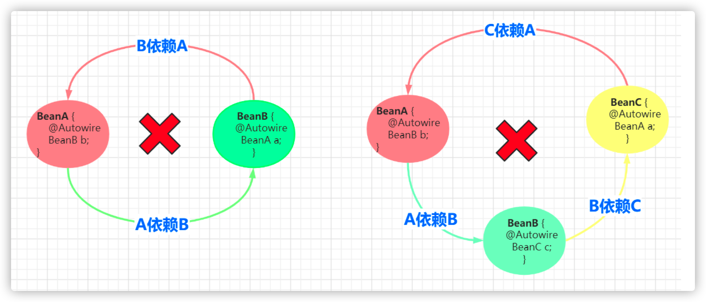
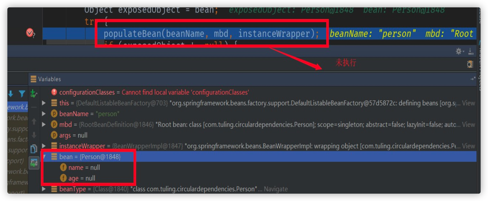
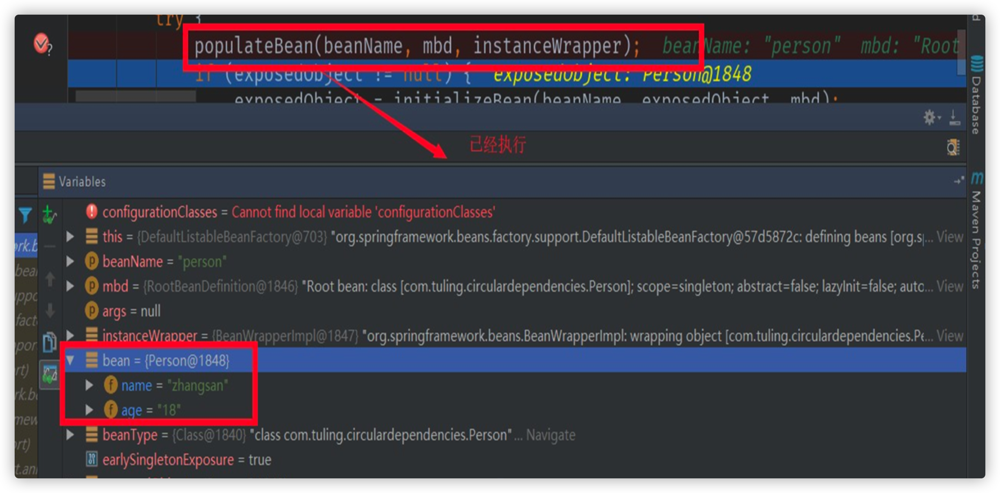
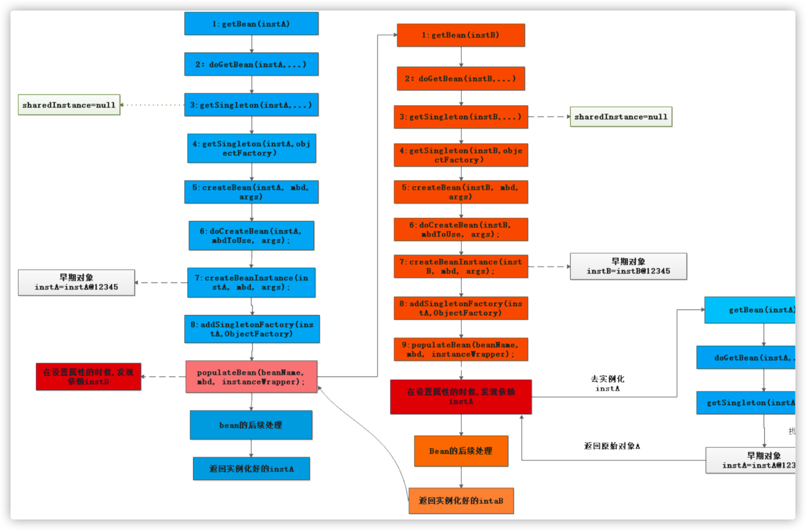
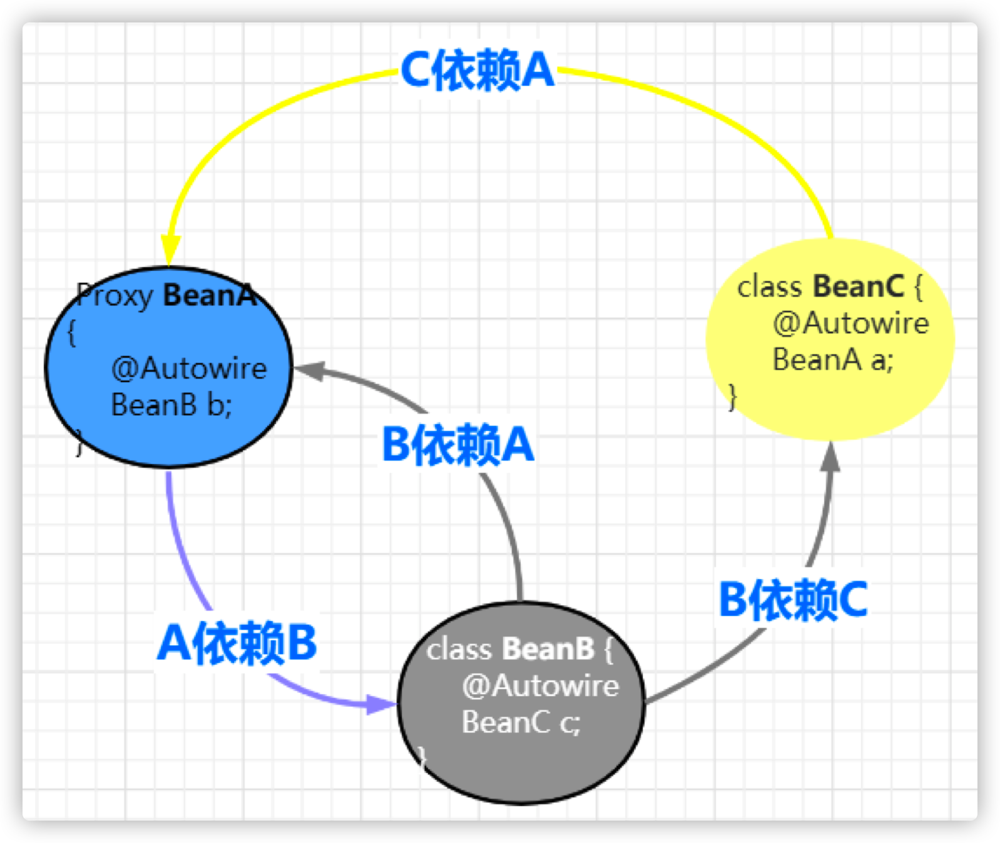

# Spring如何解决循环依赖

## 1. 什么是循环依赖?

所谓的循环依赖是指，A 依赖 B，B 又依赖 A，它们之间形成了循环依赖。或者是 A 依赖 B，B 依赖 C，C 又依 赖 A。它们之间的依赖关系如下：



Demo:

```java
public static void main(String[] args) throws Exception {

  // 已经加载循环依赖
  String beanName="com.tuling.circulardependencies.InstanceA";
  getBean(beanName);

  //ApplicationContext 已经加载spring容器
  InstanceA a = (InstanceA) getBean(beanName);
  a.say();

}

// 一级缓存 单例池 成熟态Bean
private static Map<String, Object> singletonObjects = new ConcurrentHashMap<>(256);

// 二级缓存 纯净态Bean (存储不完整的Bean用于解决循环依赖中多线程读取一级缓存的脏数据)
private static Map<String, Object> earlySingletonObjects = new ConcurrentHashMap<>(256);

// 三级缓存
private static Map<String, ObjectFactory> factoryEarlySingletonObjects = new ConcurrentHashMap<> (256);

// 标识当前是不是循环依赖 如果正在创建并且从一级缓存中没有拿到是不是说明是依赖
private static Set<String> singletonsCurrentlyInCreation = Collections.newSetFromMap(new ConcurrentHashMap<>(16));


/**
 * 创建Bean
 * @param beanName
 * @return
 */
private static Object getBean(String beanName) throws Exception {
  Class<?> beanClass = Class.forName(beanName);
  Object bean=getSingleton(beanName);
  if(bean!=null){
    return bean;
  }

  // 开始创建Bean
  singletonsCurrentlyInCreation.add(beanName);

  // 1.实例化
  Object beanInstanc = beanClass.newInstance();

  ObjectFactory factory= () ‐> {
    JdkProxyBeanPostProcessor beanPostProcessor=new JdkProxyBeanPostProcessor();
    return beanPostProcessor.getEarlyBeanReference(bean,beanName);
  };

  factoryEarlySingletonObjects.put(beanName,factory);

  // 只是循环依赖才创建动态代理？ //创建动态代理
  // Spring 为了解决 aop下面循环依赖会在这个地方创建动态代理 Proxy.newProxyInstance
  // Spring 是不会将aop的代码跟ioc写在一起
  // 不能直接将Proxy存入二级缓存中
  // 是不是所有的Bean都存在循环依赖 当存在循环依赖才去调用aop的后置处理器创建动态代理
  // 存入二级缓存
  // earlySingletonObjects.put(beanName,beanInstanc);
  // 2.属性赋值 解析Autowired
  // 拿到所有的属性名
  Field[] declaredFields = beanClass.getDeclaredFields(); 72

  // 循环所有属性
  for (Field declaredField : declaredFields) {

  // 从属性上拿到@Autowired
  Autowired annotation = declaredField.getAnnotation(Autowired.class);

  // 说明属性上面有@Autowired
  if(annotation != null){
    Class<?> type = declaredField.getType();
    //com.tuling.circulardependencies.InstanceB
    getBean(type.getName());
  }
}

// 3.初始化 (省略）
// 创建动态代理
// 存入到一级缓存
singletonObjects.put(beanName,beanInstanc);
  return beanInstanc;
}

private static Object getSingleton(String beanName){

  Object bean = singletonObjects.get(beanName);

  // 如果一级缓存没有拿到 是不是就说明当前是循环依赖创建
  if(bean == null && singletonsCurrentlyInCreation.contains(beanName)){

    // 调用bean的后置处理器创建动态代理
    bean = earlySingletonObjects.get(beanName);

    if(bean == null){
      ObjectFactory factory = factoryEarlySingletonObjects.get(beanName);
      factory.getObject();
    }
  }

  return bean;
}

private static Object getEarlyBeanReference(String beanName, Object bean){
  JdkProxyBeanPostProcessor beanPostProcessor=new JdkProxyBeanPostProcessor();
  return beanPostProcessor.getEarlyBeanReference(bean,beanName);
}
```


## 2. 如何解决循环依赖？

##### 三级缓存

DefaultSingletonBeanRegistry类的三个成员变量命名如下：

```java
/** 一级缓存 这个就是我们大名鼎鼎的单例缓存池 用于保存我们所有的单实例bean */
private final Map<String, Object> singletonObjects = new ConcurrentHashMap<>(256);

/** 三级缓存 该map用户缓存 key为 beanName value 为ObjectFactory(包装为早期对象) */
private final Map<String, ObjectFactory<?>> singletonFactories = new HashMap<>(16);

/** 二级缓存 ，用户缓存我们的key为beanName value是我们的早期对象(对象属性还没有来得及进行赋值) */
private final Map<String, Object> earlySingletonObjects = new HashMap<>(16);
```

以 BeanA 和 BeanB 两个类相互依赖为例

### 2.1 创建原始 bean 对象

##### 纯洁态Bean

```java
instanceWrapper = createBeanInstance(beanName, mbd, args);
final Object bean = (instanceWrapper != null ? instanceWrapper.getWrappedInstance() : null);
```

假设 beanA 先被创建，创建后的原始对象为BeanA@1234，上面代码中的 bean 变量指向就是这个对象。

### 2.2 暴露早期引用

该方法用于把早期对象包装成一个ObjectFactory 暴露到三级缓存中 用于将解决循环依赖

```java
protected void addSingletonFactory(String beanName, ObjectFactory<?> singletonFactory) {
	...
  //加入到三级缓存中，，，，，暴露早期对象用于解决循环依赖
  this.singletonFactories.put(beanName, singletonFactory);
	...
}
```

beanA 指向的原始对象创建好后，就开始把指向原始对象的引用通过 ObjectFactory 暴露出去。 getEarlyBeanReference 方法的第三个参数 bean 指向的正是 createBeanInstance 方法创建出原始 bean 对象 BeanA@1234。

### 2.3 解析依赖

```java
populateBean(beanName, mbd, instanceWrapper);
```

还没有进行属性装配，自动注入的属性都是null



初始化好的Bean



populateBean 用于向 beanA 这个原始对象中填充属性，当它检测到 beanA 依赖于 beanB 时，会首先去实例化 beanB。 beanB 在此方法处也会解析自己的依赖，当它检测到 beanA 这个依赖，于是调用 `BeanFactroy.getBean("beanA")` 这个方法，从容 器中获取 beanA。

### 2.4 获取早期引用

```java
protected Object getSingleton(String beanName, boolean allowEarlyReference) {

  /**
   * 第一步:我们尝试去一级缓存(单例缓存池中去获取对象,一般情况从该map中获取的对象是直接可以使用的)
   * IOC容器初始化加载单实例bean的时候第一次进来的时候 该map中一般返回空
   */
  Object singletonObject = this.singletonObjects.get(beanName);

  /**
   * 若在第一级缓存中没有获取到对象,并且singletonsCurrentlyInCreation这个list包含该beanName
   * IOC容器初始化加载单实例bean的时候第一次进来的时候 该list中一般返回空,但是循环依赖的时候可以满足该条件
   */
  if (singletonObject == null && isSingletonCurrentlyInCreation(beanName)) {

    synchronized (this.singletonObjects) {

      /**
       * 尝试去二级缓存中获取对象(二级缓存中的对象是一个早期对象)
       * 何为早期对象:就是bean刚刚调用了构造方法，还来不及给bean的属性进行赋值的对象(纯净态)
       * 就是早期对象
       */
      singletonObject = this.earlySingletonObjects.get(beanName);

      /**
       * 二级缓存中也没有获取到对象,allowEarlyReference为true(参数是有上一个方法传递进来的true)
       */
      if (singletonObject == null && allowEarlyReference) {

        /**
         * 直接从三级缓存中获取 ObjectFactory对象 这个对接就是用来解决循环依赖的关键所在
         * 在ioc后期的过程中,当bean调用了构造方法的时候,把早期对象包裹成一个ObjectFactory
         * 暴露到三级缓存中
         */
        ObjectFactory<?> singletonFactory = this.singletonFactories.get(beanName);

        //从三级缓存中获取到对象不为空
        if (singletonFactory != null) {

          /**
           * 在这里通过暴露的ObjectFactory 包装对象中,通过调用他的getObject()来获取我们的早期对象
           * 在这个环节中会调用到 getEarlyBeanReference()来进行后置处理
           */
          singletonObject = singletonFactory.getObject();

          // 把早期对象放置在二级缓存,
          this.earlySingletonObjects.put(beanName, singletonObject);

          // ObjectFactory 包装对象从三级缓存中删除掉
          this.singletonFactories.remove(beanName);
        }
      }
    }
  }

  return singletonObject;
}
```

接着上面的步骤讲:

- populateBean 调用 BeanFactroy.getBean("beanA") 以获取 beanB 的依赖。
- getBean("beanB") 会先调用 getSingleton("beanA")，尝试从缓存中获取 beanA。此时由于 beanA 还没完全实例化好
- 于是 this.singletonObjects.get("beanA") 返回 null。
- 接着 this.earlySingletonObjects.get("beanA") 也返回空，因为 beanA 早期引用还没放入到这个缓存中。
- 最后调用 singletonFactory.getObject() 返回 singletonObject，此时 singletonObject != null。singletonObject 指向 BeanA@1234，也就是 createBeanInstance 创建的原始对象。此时 beanB 获取到了这个原始对象的引用，beanB 就能顺利完成实例 化。beanB 完成实例化后，beanA 就能获取到 beanB 所指向的实例，beanA 随之也完成了实例化工作。由于 beanB.beanA 和 beanA 指向的是同一个对象 BeanA@1234，所以 beanB 中的 beanA 此时也处于可用状态了。

以上的过程对应下面的流程图：




## 3. 为何需要三级缓存,而不是两级缓存?

##### 为什么需要二级缓存？

二级缓存只要是为了分离成熟Bean和纯净Bean(未注入属性)的存放， 防止多线程中在Bean还未创建完成时读取到的Bean时不完整的。所 以也是为了保证我们getBean是完整最终的Bean，不会出现不完整的情况。

##### 为什么需要三级缓存？ 

我们都知道Bean的aop动态代理创建时在初始化之后，但是循环依赖的Bean如果使用了AOP。 那无法等到解决完循环依赖再创建动态代 理， 因为这个时候已经注入属性。 所以如果循环依赖的Bean使用了aop. 需要提前创建aop。 但是需要思考的是动态代理在哪创建？？ 在实例化后直接创建？ 但是我们正常的Bean是在初始化创建啊。 所以可以加个判断如果是 循环依赖就实例化后调用，没有循环依赖就正常在初始化后调用。 怎么判断当前创建的bean是不是循环依赖？ 根据二级缓存判断？有就是循环依赖？ 那这个判断怎么加？加载实例化后面行吗？实例化后如下：

```java
if(二级缓存有说明是循环依赖？){
	二级缓存=创建动态代理覆盖（判断当前bean是否被二级缓存命中）；
}
```

这样写可以吗？ 肯定不行啊， 因为实例化后始终会放入二级缓存中。

所以这样写不管是不是循环依赖都会在实例化后创建动态代理。

创建本身的时候没法判断自己是不是循环依赖，， 只有在B 引用A （不同bean的引用直接）下才能判断是不是循环依赖（比如B引用A,A 正在创建，那说明是循环依赖）， 所以判断要卸载getSingleton中。

```java
假如A是proxy.

A创建Bean ‐‐>注入属性B‐‐>getBean(B)‐‐>创建B‐‐>注入属性A‐‐‐‐>getSingleton("a")之后写如下代码

if(二级缓存有说明是循环依赖？){
	// 在这里创建AOP代理吗？
	二级缓存=创建动态代理覆盖（判断当前bean是否被二级缓存命中，没命中依然返回二级缓存）；
}
```

在这里创建行吗？行！那要三级缓存干吗？如果是这样的依赖呢？



A被循环依赖了俩次或N次， 那要创建N次aop吗然后在里面判断有没有命中? 什么？ 你说根据二级缓存的对象判断？ 如果是动态代 理就不重复创建？逻辑太复杂了。毫无扩展性也太过于耦合。。如果希望循环依赖给程序员扩展呢？那程序员不一定就返回proxy 。

```java
假如A是proxy. 

A创建Bean ‐‐>注入属性B‐‐>getBean(B)‐‐>创建B‐‐>注入属性A‐‐‐‐>getSingleton("a")之后写如下代码

if (二级缓存有说明是循环依赖？) {
  if (二级缓存是aop就) {
    return 二级缓存;
  }

  // 在这里创建AOP代理吗？
  二级缓存=创建动态代理覆盖（判断当前bean是否被二级缓存命中，没命中依然返回二级缓存）；
}
```

除了这样没有更好的解决方案吗？ 能不能让二级缓存存储的bean无脑返回就行了（不管是普通的还是代理的，让这块逻辑分离？ 可 以。 增加三级缓存，二级缓存先啥也不存。

三级缓存 存一个函数接口， 动态代理还是普通bean的逻辑调用BeanPostProcessor 都放在这里面。 只要调用了就存在二级缓存，无 脑返回就行。 大大减少业务逻辑复杂度

##### 为什么Spring不能解决构造器的循环依赖？

从流程图应该不难看出来，在Bean调用构造器实例化之前，一二三级缓存并没有Bean的任何相关信息，在

实例化之后才放入三级缓存中，因此当getBean的时候缓存并没有命中，这样就抛出了循环依赖的异常了。

##### 为什么多例Bean不能解决循环依赖？

我们自己手写了解决循环依赖的代码，可以看到，核心是利用一个map，来解决这个问题的，这个map就相当于缓存。

为什么可以这么做，因为我们的bean是单例的，而且是字段注入（setter注入）的，单例意味着只需要创建一次对象，后面就可以从缓存中取出来，字段注入，意味着我们无需调用构造方法进行注入。

- 如果是原型bean，那么就意味着每次都要去创建对象，无法利用缓存；

- 如果是构造方法注入，那么就意味着需要调用构造方法注入，也无法利用缓存。

##### 循环依赖可以关闭吗

可以，Spring提供了这个功能，我们需要这么写：

```java
public class Main {

public static void main(String[] args) {
  AnnotationConfigApplicationContext applicationContext = 
    		new AnnotationConfigApplicationContext();
  applicationContext.setAllowCircularReferences(false);
  applicationContext.register(AppConfig.class);
  applicationContext.refresh();
  }
}
```


## 4. 如何进行拓展

bean可以通过实现SmartInstantiationAwareBeanPostProcessor接口（一般这个接口供spring内部使用）的 getEarlyBeanReference方法进行拓展

### 4.1 何时进行拓展？（进行bean的实例化时）

```java
protected Object doCreateBean(final String beanName, 
                              final RootBeanDefinition mbd, 
                              final Object[] args) throws BeanCreationException {

  //省略其他代码，只保留了关键代码
  //...

  // Eagerly cache singletons to be able to resolve circular references
  // even when triggered by lifecycle interfaces like BeanFactoryAware.
  boolean earlySingletonExposure = (mbd.isSingleton() && 
                                    this.allowCircularReferences && 
                                    isSingletonCurrentlyInCreation(beanName));

  if (earlySingletonExposure) {
    if (logger.isDebugEnabled()) {
      logger.debug("Eagerly caching bean '" + beanName +
                   "' to allow for resolving potential circular references");
    }

    //将刚实例化好的bean添加到一级缓存中
    addSingletonFactory(beanName, new ObjectFactory

    @Override
    public Object getObject() throws BeansException {

      //执行拓展的后置处理器
      return getEarlyBeanReference(beanName, mbd, bean);
    }
  }
}
```

### 4.2 getEarlyBeanReference方法

```java
protected Object getEarlyBeanReference(String beanName, 
                                       RootBeanDefinition mbd, 
                                       Object bean) {
  Object exposedObject = bean;

  //判读我们容器中是否有InstantiationAwareBeanPostProcessors类型的后置处理器
  if (!mbd.isSynthetic() && hasInstantiationAwareBeanPostProcessors()) {

    //获取我们所有的后置处理器
    for (BeanPostProcessor bp : getBeanPostProcessors()) {

      //判断我们的后置处理器是不是实现了SmartInstantiationAwareBeanPostProcessor接口
      if (bp instanceof SmartInstantiationAwareBeanPostProcessor) {

        //进行强制转换
        SmartInstantiationAwareBeanPostProcessor ibp = 
              (SmartInstantiationAwareBeanPostProcessor) bp;

        //挨个调用SmartInstantiationAwareBeanPostProcessor的getEarlyBeanReference
        exposedObject = ibp.getEarlyBeanReference(exposedObject, beanName);
      }
    }
  }
  return exposedObject;
}
```

扩展示例：

```java
@Component
public class TulingBPP implements SmartInstantiationAwareBeanPostProcessor {

  public Object getEarlyBeanReference(Object bean, String beanName) throws BeansException {

    if(beanName.equals("instanceA") || beanName.equals("instanceB")) {
      JdkDynimcProxy jdkDynimcProxy = new JdkDynimcProxy(bean);
      return jdkDynimcProxy.getProxy();
    }
    
    return bean;
  }
}
```

