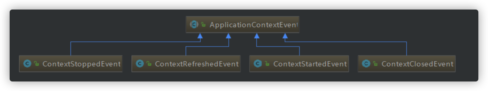
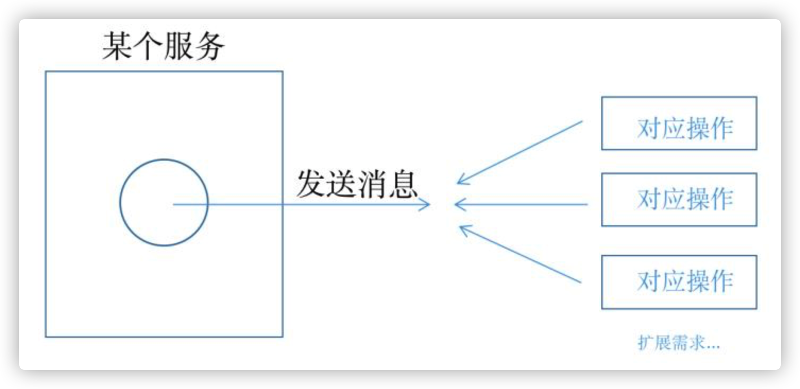
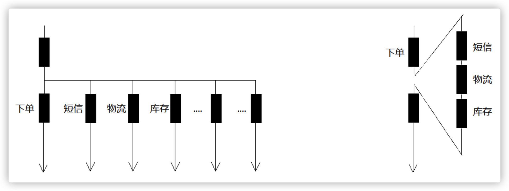
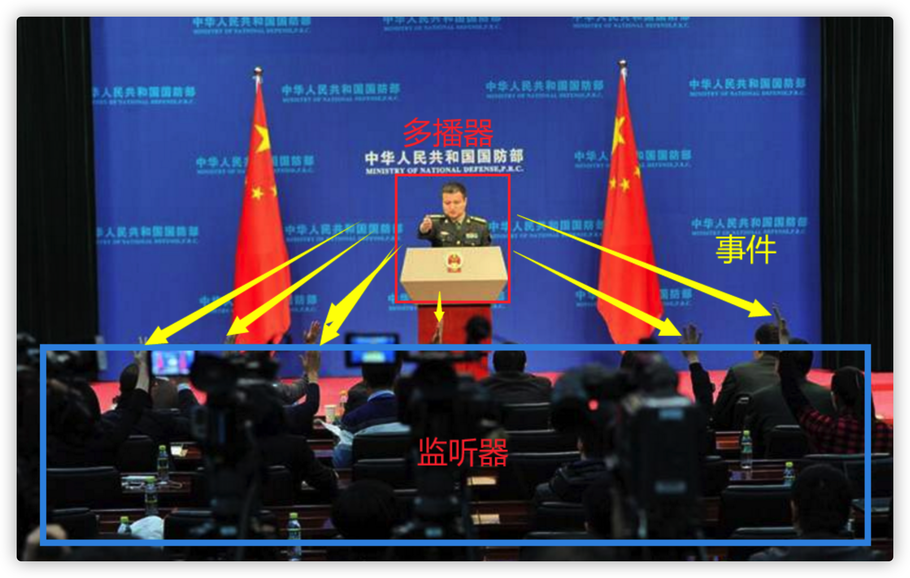
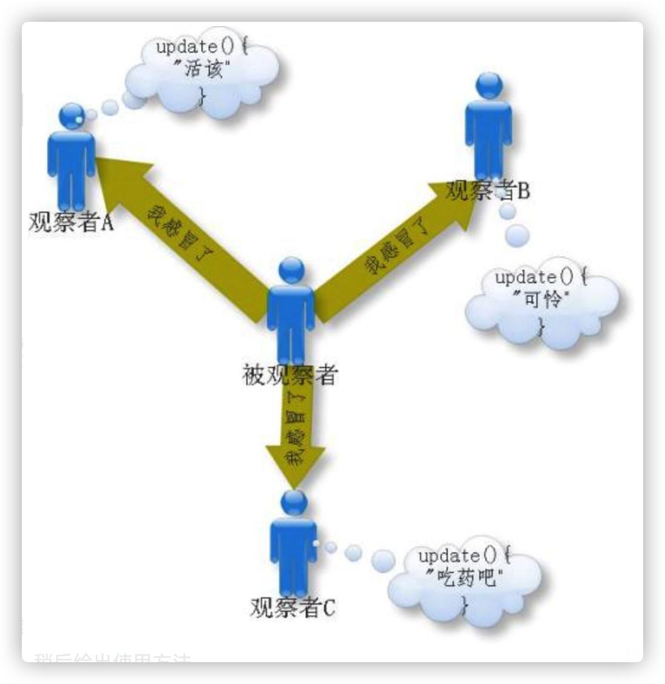
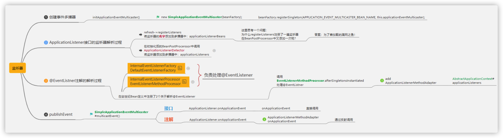

# Spring事件监听机制

## 1. 使用Spring 事件

 Spring事件体系包括三个组件：事件，事件监听器，事件广播器。

### 1.1 事件

#### Spring内置事件

内置事件中由系统内部进行发布，只需注入监听器

 

| **Event**             | **说明**                                                     |
| --------------------- | ------------------------------------------------------------ |
| ContextRefreshedEvent | 当容器被实例化或  refreshed  时发布.如调用 `refresh()` 方法, 此处的实例化是指所有的 bean 都已被加载,后置处理器都被激活,所有单例 bean 都已被实例化, 所有的容器对象都已准备好可使用. 如果容器支持热重载,则 refresh 可以被触发多次（XmlWebApplicatonContext 支持热刷新，而 GenericApplicationContext 则不支持） |
| ContextStartedEvent   | 当容器启动时发布,即调用 `start()` 方法，已启用意味着所有的 Lifecycle bean 都已显式接收到了 start 信号 |
| ContextStoppedEvent   | 当容器停止时发布,即调用 `stop()` 方法，即所有的 Lifecycle bean 都已显式接收到了 stop 信号，关闭的容器可以通过 `start()` 方法重启 |
| ContextClosedEvent    | 当容器关闭时发布,即调用 close 方法，关闭意味着所有的单例bean都已被销毁。关闭的容器不能被重启或 refresh |
| RequestHandledEvent   | 这只在使用 spring 的  DispatcherServlet 时有效，当一个请求被处理完成时发布 |

#### 自定义事件

事件类需要继承 ApplicationEvent，代码如下：

```java
/**
 * 事件
 */
public class BigEvent  extends ApplicationEvent {

    private String name;

    public BigEvent(Object source, String name) {
        super(source);
        this.name = name;
    }

    public String getName() {
        return name;
    }
}
```

这里为了简单测试，所以写的很简单。

事件类是一种很简单的pojo，除了需要继承 ApplicationEvent 也没什么了，这个类有一个构造方法需要 super。

### 1.2 事件监听器

#### 事件监听器-基于接口

```java
@Component
public class HelloEventListener implements ApplicationListener<OrderEvent> {
  
    @Override
    public void onApplicationEvent(OrderEvent event) {
        if(event.getName().equals("减库存")){
            System.out.println("减库存.......");
        }
    }
}         
```

事件监听器需要实现  ApplicationListener 接口，这是个泛型接口，泛型类类型就是事件类型，其次需要是 spring 容器托管的 bean，所以这里加了 @component，只有一个方法，就是 onApplicationEvent。

#### 事件监听器-基于注解

```java
@Component
public class OrderEventListener {
    @EventListener(OrderEvent.class)
    public void onApplicationEvent(OrderEvent event) {
        if(event.getName().equals("减库存")){
            System.out.println("减库存.......");
        }
    }
}
```

### 1.3 事件发布操作

事件发布方式很简单

```java
applicationContext.publishEvent(new HelloEvent(this,"lgb"));
```

然后调用方法就能看到

```bash
2020-9-22 19:08:00.052 INFO 284928 --- [nio-5577-exec-3] l.b.e.c.s.event.HelloEventListener    : receive lgb say hello!
```



#### 疑问

1. 同样的事件能有多个监听器 -- 可以的
2. 事件监听器一定要写一个类去实现吗？其实是可以不需要的，spring  有个注解 @EventListener，修饰在方法上，稍后给出使用方法
3. 事件监听操作和发布事件的操作是同步的吗？是的，所以如果有事务，监听操作也在事务内
4. 可以作为异步处理吗？可以，看源码有解释：

```java
@Bean(name = "applicationEventMulticaster")
public ApplicationEventMulticaster simpleApplicationEventMulticaster() {
    SimpleApplicationEventMulticaster eventMulticaster
            = new SimpleApplicationEventMulticaster();

    eventMulticaster.setTaskExecutor(new SimpleAsyncTaskExecutor());
    return eventMulticaster;
}
```




## 2. Spring事件原理

#### 原理：观察者模式

spring的事件监听有三个部分组成：

- **事件**（ApplicationEvent）负责对应相应监听器，事件源发生某事件是特定事件监听器被触发的原因。 
- **监听器**（ApplicationListener）对应于观察者模式中的**观察者**。监听器监听特定事件，并在内部定义了事件发生后的响应逻辑。 
- **事件发布器**（ApplicationEventMulticaster）对应于观察者模式中的**被观察者/主题，  负责通知观察者**对外提供发布事件和增删事件监听器的接口，维护事件和事件监听器之间的映射关系，并在事件发生时负责通知相关监听器。 





Spring事件机制是观察者模式的一种实现，但是除了发布者和监听者者两个角色之外，还有一个 EventMultiCaster 的角色负责把事件转发给监听者，工作流程如下：


也就是说上面代码中发布者调用 `applicationEventPublisher.publishEvent(msg);` 是会将事件发送给了 EventMultiCaster， 而后由 EventMultiCaster 注册着所有的 Listener，然后根据事件类型决定转发给那个 Listener。

#### 源码流程：



**Spring在ApplicationContext 接口的抽象实现类 AbstractApplicationContext 中完成了事件体系的搭建。**

AbstractApplicationContext  拥有一个 applicationEventMulticaster 成员变量，applicationEventMulticaster 提供了容器监听器的注册表。

`AbstractApplicationContext在refresh()` 这个容器启动方法中搭建了事件的基础设施，其中 AbstractApplicationContext的refresh 方法实现如下：

```java
@Override
public void refresh() throws BeansException, IllegalStateException {
    synchronized (this.startupShutdownMonitor) {
        // Prepare this context for refreshing.
        prepareRefresh();

        // Tell the subclass to refresh the internal bean factory.
        ConfigurableListableBeanFactory beanFactory = obtainFreshBeanFactory();

        // Prepare the bean factory for use in this context.
        prepareBeanFactory(beanFactory);

        try {
            // Allows post-processing of the bean factory in context subclasses.
            postProcessBeanFactory(beanFactory);

            // Invoke factory processors registered as beans in the context.
            invokeBeanFactoryPostProcessors(beanFactory);

            // Register bean processors that intercept bean creation.
            registerBeanPostProcessors(beanFactory);

            // Initialize message source for this context.
            initMessageSource();

            // Initialize event multicaster for this context.
            initApplicationEventMulticaster();

            // Initialize other special beans in specific context subclasses.
            onRefresh();

            // Check for listener beans and register them.
            registerListeners();

            // Instantiate all remaining (non-lazy-init) singletons.
            finishBeanFactoryInitialization(beanFactory);

            // Last step: publish corresponding event.
            finishRefresh();
        }

        catch (BeansException ex) {
            if (logger.isWarnEnabled()) {
                logger.warn("Exception encountered during context initialization - " +
                        "cancelling refresh attempt: " + ex);
            }

            // Destroy already created singletons to avoid dangling resources.
            destroyBeans();

            // Reset 'active' flag.
            cancelRefresh(ex);

            // Propagate exception to caller.
            throw ex;
        }

        finally {
            // Reset common introspection caches in Spring's core, since we
            // might not ever need metadata for singleton beans anymore...
            resetCommonCaches();
        }
    }
}
```

### 2.1 事件广播器的初始化

```java
/**
 * Initialize the ApplicationEventMulticaster.
 * Uses SimpleApplicationEventMulticaster if none defined in the context.
 * @see org.springframework.context.event.SimpleApplicationEventMulticaster
 */
protected void initApplicationEventMulticaster() {
    ConfigurableListableBeanFactory beanFactory = getBeanFactory();
    if (beanFactory.containsLocalBean(APPLICATION_EVENT_MULTICASTER_BEAN_NAME)) {
        this.applicationEventMulticaster =
                beanFactory.getBean(APPLICATION_EVENT_MULTICASTER_BEAN_NAME, ApplicationEventMulticaster.class);
        if (logger.isDebugEnabled()) {
            logger.debug("Using ApplicationEventMulticaster [" + this.applicationEventMulticaster + "]");
        }
    }
    else {
        this.applicationEventMulticaster = new SimpleApplicationEventMulticaster(beanFactory);
        beanFactory.registerSingleton(APPLICATION_EVENT_MULTICASTER_BEAN_NAME, this.applicationEventMulticaster);
        if (logger.isDebugEnabled()) {
            logger.debug("Unable to locate ApplicationEventMulticaster with name '" +
                    APPLICATION_EVENT_MULTICASTER_BEAN_NAME +
                    "': using default [" + this.applicationEventMulticaster + "]");
        }
    }
}
```

用户可以在配置文件中为容器定义一个自定义的事件广播器，只要实现 ApplicationEventMulticaster 就可以了，Spring 会通过 反射的机制将其注册成容器的事件广播器，如果没有找到配置的外部事件广播器，Spring 自动使用 SimpleApplicationEventMulticaster 作为事件广播器。

### 2.2 注册事件监听器

```java
/**
 * Add beans that implement ApplicationListener as listeners.
 * Doesn't affect other listeners, which can be added without being beans.
 */
protected void registerListeners() {
    // Register statically specified listeners first.
    for (ApplicationListener<?> listener : getApplicationListeners()) {
        getApplicationEventMulticaster().addApplicationListener(listener);
    }

    // Do not initialize FactoryBeans here: We need to leave all regular beans
    // uninitialized to let post-processors apply to them!
    String[] listenerBeanNames = getBeanNamesForType(ApplicationListener.class, true, false);
    for (String listenerBeanName : listenerBeanNames) {
        getApplicationEventMulticaster().addApplicationListenerBean(listenerBeanName);
    }

    // Publish early application events now that we finally have a multicaster...
    Set<ApplicationEvent> earlyEventsToProcess = this.earlyApplicationEvents;
    this.earlyApplicationEvents = null;
    if (earlyEventsToProcess != null) {
        for (ApplicationEvent earlyEvent : earlyEventsToProcess) {
            getApplicationEventMulticaster().multicastEvent(earlyEvent);
        }
    }
}
```

Spring 根据反射机制，使用 ListableBeanFactory的getBeansOfType 方法，从  BeanDefinitionRegistry 中找出所有实现 `org.springframework.context.ApplicationListener的Bean`，将它们注册为容器的事件监听器，实际的操作就是将其添加到事件广播器所提供的监听器注册表中。

### 2.3 发布事件

跟着 `finishRefresh();` 方法进入 `publishEvent(new ContextRefreshedEvent(this));` 方法如下：

```java
/**
 * Publish the given event to all listeners.
 * @param event the event to publish (may be an {@link ApplicationEvent}
 * or a payload object to be turned into a {@link PayloadApplicationEvent})
 * @param eventType the resolved event type, if known
 * @since 4.2
 */
protected void publishEvent(Object event, ResolvableType eventType) {
    Assert.notNull(event, "Event must not be null");
    if (logger.isTraceEnabled()) {
        logger.trace("Publishing event in " + getDisplayName() + ": " + event);
    }

    // Decorate event as an ApplicationEvent if necessary
    ApplicationEvent applicationEvent;
    if (event instanceof ApplicationEvent) {
        applicationEvent = (ApplicationEvent) event;
    }
    else {
        applicationEvent = new PayloadApplicationEvent<Object>(this, event);
        if (eventType == null) {
            eventType = ((PayloadApplicationEvent)applicationEvent).getResolvableType();
        }
    }

    // Multicast right now if possible - or lazily once the multicaster is initialized
    if (this.earlyApplicationEvents != null) {
        this.earlyApplicationEvents.add(applicationEvent);
    }
    else {
        getApplicationEventMulticaster().multicastEvent(applicationEvent, eventType);
    }

    // Publish event via parent context as well...
    if (this.parent != null) {
        if (this.parent instanceof AbstractApplicationContext) {
            ((AbstractApplicationContext) this.parent).publishEvent(event, eventType);
        }
        else {
            this.parent.publishEvent(event);
        }
    }
}    
```

在  AbstractApplicationContext的publishEvent 方法中， Spring 委托 ApplicationEventMulticaster 将事件通知给所有的事件监听器.

### 2.4 Spring默认的事件广播器SimpleApplicationEventMulticaster

```java
@Override
public void multicastEvent(final ApplicationEvent event, ResolvableType eventType) {
    ResolvableType type = (eventType != null ? eventType : resolveDefaultEventType(event));
    for (final ApplicationListener<?> listener : getApplicationListeners(event, type)) {
        Executor executor = getTaskExecutor();
        if (executor != null) {
            executor.execute(new Runnable() {
                @Override
                public void run() {
                    invokeListener(listener, event);
                }
            });
        }
        else {
            invokeListener(listener, event);
        }
    }
}

/**
 * Invoke the given listener with the given event.
 * @param listener the ApplicationListener to invoke
 * @param event the current event to propagate
 * @since 4.1
 */
@SuppressWarnings({"unchecked", "rawtypes"})
protected void invokeListener(ApplicationListener listener, ApplicationEvent event) {
    ErrorHandler errorHandler = getErrorHandler();
    if (errorHandler != null) {
        try {
            listener.onApplicationEvent(event);
        }
        catch (Throwable err) {
            errorHandler.handleError(err);
        }
    }
    else {
        try {
            listener.onApplicationEvent(event);
        }
        catch (ClassCastException ex) {
            // Possibly a lambda-defined listener which we could not resolve the generic event type for
            LogFactory.getLog(getClass()).debug("Non-matching event type for listener: " + listener, ex);
        }
    }
}
```

遍历注册的每个监听器，并启动来调用每个监听器的 onApplicationEvent 方法。由于 SimpleApplicationEventMulticaster的taskExecutor 的实现类是 SyncTaskExecutor，因此，事件监听器对事件的处理，是同步进行的。

从代码可以看出，`applicationContext.publishEvent()` 方法，需要同步等待各个监听器处理完之后，才返回。

也就是说，Spring 提供的事件机制，默认是同步的。如果想用异步的，可以自己实现 ApplicationEventMulticaster 接口，并在 Spring 容器中注册 id 为 applicationEventMulticaster的Bean。例如下面所示:

```java
public class AsyncApplicationEventMulticaster extends AbstractApplicationEventMulticaster {  
    private TaskExecutor taskExecutor = new SimpleAsyncTaskExecutor();  

    public void setTaskExecutor(TaskExecutor taskExecutor) {  
        this.taskExecutor = (taskExecutor != null ? taskExecutor : new SimpleAsyncTaskExecutor());  
    }  

    protected TaskExecutor getTaskExecutor() {  
        return this.taskExecutor;  
    }  

    @SuppressWarnings("unchecked")  
    public void multicastEvent(final ApplicationEvent event) {  
        for (Iterator<ApplicationListener> it = getApplicationListeners().iterator(); it.hasNext();) {  
            final ApplicationListener listener =  it.next();  
            getTaskExecutor().execute(new Runnable() {  
                public void run() {  
                    listener.onApplicationEvent(event);  
                }  
            });  
        }  
    }  
}  
```

spring配置：

```java
@Bean(name = "applicationEventMulticaster")
public ApplicationEventMulticaster simpleApplicationEventMulticaster() {
    SimpleApplicationEventMulticaster eventMulticaster
            = new SimpleApplicationEventMulticaster();

    //ThreadPoolTaskExecutor
    eventMulticaster.setTaskExecutor(new SimpleAsyncTaskExecutor());
    return eventMulticaster;
}
```

Spring 发布事件之后，所有注册的事件监听器，都会收到该事件，因此，事件监听器在处理事件时，需要先判断该事件是否是自己关心的。

Sping 事件体系所使用的设计模式是：观察者模式。ApplicationListener 是观察者接口，接口中定义了 onApplicationEvent 方法，该方法的作用是对  ApplicationEvent 事件进行处理。

####  问题：

Spring 是怎样避免读取到不完整 Bean 的？

怎么样可以在所有 Bean 创建完后做扩展代码？

请介绍下  Spring 事件监听器的原理。