# Spring声明式事务源码

## 1. @Transaction的使用

SpringBoot大行其道的今天，基于XML配置的Spring Framework的使用方式注定已成为过去式。注解驱动应用，面向元数据编程已然成受到越来越多开发者的偏好了，毕竟它的便捷程度、优势都是XML方式不可比拟的。

对SpringBoot有多了解，其实就是看对Spring Framework有多熟悉。比如SpringBoot大量的模块装配的设计模式，其实它属于Spring Framework提供的能力

- 开启注解驱动

```java
@EnableTransactionManagement
@EnableAspectJAutoProxy//(exposeProxy = true)
@ComponentScan(basePackages = {"com.tuling"})
public class MainConfig {

    @Bean
    public DataSource dataSource() {
        DruidDataSource dataSource = new DruidDataSource();
        dataSource.setUsername("root");
        dataSource.setPassword("123456");
        dataSource.setUrl("jdbc:mysql://localhost:3306/tuling-spring-trans");
        dataSource.setDriverClassName("com.mysql.jdbc.Driver");
        return dataSource;
    }

    /**
     *  配置JdbcTemplate Bean组件
     *     <bean class="org.springframework.jdbc.core.JdbcTemplate" id="jdbcTemplate">
     *         <property name="dataSource" ref="dataSource" ></property>
     *     </bean>
     * @param dataSource
     * @return
     */
    @Bean
    public JdbcTemplate jdbcTemplate(DataSource dataSource) {
        return new JdbcTemplate(dataSource);
    }

    /**
     *  配置事务管理器
     *     <bean class="org.springframework.jdbc.datasource.DataSourceTransactionManager" id="transactionManager">
     *         <property name="dataSource" ref="dataSource"></property>
     *     </bean>
     * @param dataSource
     * @return
     */
    @Bean
    public PlatformTransactionManager transactionManager(DataSource dataSource) {
        return new DataSourceTransactionManager(dataSource);
    }
}
```

> **注意**
>
> 使用 `@EnableTransactionManagement` 注解前，请务必保证已经配置了至少一个PlatformTransactionManager的Bean，否则会报错。（当然也可以实现TransactionManagementConfigurer来提供一个专属的，只是一般都不这么去做~~~）

- 在你想要加入事务的方法/类/接口上标注 `@Transactional` 注解

```java
@Component
@Transactional(rollbackFor = Exception.class)
public class PayServiceImpl implements PayService {

    @Autowired
    private AccountInfoDao accountInfoDao;

    @Autowired
    private ProductInfoDao productInfoDao;

    public void pay(String accountId, double money) { 
        // 更新余额
        int retVal = accountInfoDao.updateAccountBlance(accountId,money);
        System.out.println(1/0);
    }
}
```

运行测试

```java
public static void main(String[] args) {
    AnnotationConfigApplicationContext context = 
    		new AnnotationConfigApplicationContext(MainConfig.class);

    PayService payService = (PayService) context.getBean("payServiceImpl");
    payService.pay("123456789", 10);
}
```

就这么简单，事务就生效了（这条数据并没有insert成功）。


## 2. 原理

### 2.1 事务集成过程

接下来分析注解驱动事务的原理，同样的我们从 `@EnableTransactionManagement` 开始：

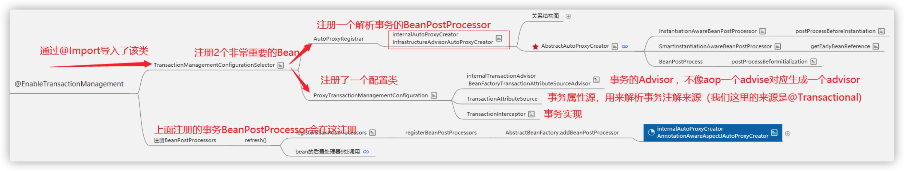

##### `@EnableTransactionManagement`

```java
@Target(ElementType.TYPE)
@Retention(RetentionPolicy.RUNTIME)
@Documented
@Import(TransactionManagementConfigurationSelector.class)
public @interface EnableTransactionManagement {
	boolean proxyTargetClass() default false;
	AdviceMode mode() default AdviceMode.PROXY;
	int order() default Ordered.LOWEST_PRECEDENCE;
}
```

简直太熟悉了，属性和 `@EnableAspectJAutoProxy` 注解一个套路。不同之处只在于 `@Import` 导入器导入的这个类，不同的是：它导入的是个ImportSelector

##### TransactionManagementConfigurationSelector

它所在的包为 `org.springframework.transaction.annotation`，jar属于：spring-tx（**若引入了spring-jdbc，这个jar会自动导入**）

```java
public class TransactionManagementConfigurationSelector extends AdviceModeImportSelector<EnableTransactionManagement> {

	@Override
	protected String[] selectImports(AdviceMode adviceMode) {
		switch (adviceMode) {
			// 很显然，绝大部分情况下都不会使用AspectJ的静态代理的
			// 这里面会导入两个类
			case PROXY:
				return new String[] {AutoProxyRegistrar.class.getName(),
						ProxyTransactionManagementConfiguration.class.getName()};
			case ASPECTJ:
				return new String[] {determineTransactionAspectClass()};
			default:
				return null;
		}
	}
  
	private String determineTransactionAspectClass() {
		return (ClassUtils.isPresent(
      	"javax.transaction.Transactional", getClass().getClassLoader()) ?
				TransactionManagementConfigUtils.JTA_TRANSACTION_ASPECT_CONFIGURATION_CLASS_NAME :
				TransactionManagementConfigUtils.TRANSACTION_ASPECT_CONFIGURATION_CLASS_NAME);
	}
}
```

##### AutoProxyRegistrar

从名字是意思是：自动代理注册器。它是个ImportBeanDefinitionRegistrar，可以实现自己向容器里注册Bean的定义信息

```java
// @since 3.1
public class AutoProxyRegistrar implements ImportBeanDefinitionRegistrar {

	@Override
	public void registerBeanDefinitions(AnnotationMetadata importingClassMetadata, BeanDefinitionRegistry registry) {
		boolean candidateFound = false;
		
		// 这里面需要特别注意的是：这里是拿到所有的注解类型~~~而不是只拿@EnableAspectJAutoProxy这个类型的
		// 原因：因为mode、proxyTargetClass等属性会直接影响到代理得方式，而拥有这些属性的注解至少有：
		// @EnableTransactionManagement、@EnableAsync、@EnableCaching等~~~~
		// 甚至还有启用AOP的注解：@EnableAspectJAutoProxy它也能设置`proxyTargetClass`这个属性的值，因此也会产生关联影响~
		Set<String> annoTypes = importingClassMetadata.getAnnotationTypes();
		for (String annoType : annoTypes) {
			AnnotationAttributes candidate = AnnotationConfigUtils.attributesFor(importingClassMetadata, annoType);
			if (candidate == null) {
				continue;
			}
			// 拿到注解里的这两个属性
			// 说明：如果你是比如@Configuration或者别的注解的话  他们就是null了
			Object mode = candidate.get("mode");
			Object proxyTargetClass = candidate.get("proxyTargetClass");

			// 如果存在mode且存在proxyTargetClass 属性
			// 并且两个属性的class类型也是对的，才会进来此处（因此其余注解相当于都挡外面了~）
			if (mode != null && proxyTargetClass != null && AdviceMode.class == mode.getClass() &&
					Boolean.class == proxyTargetClass.getClass()) {
		
				// 标志：找到了候选的注解~~~~
				candidateFound = true;
				if (mode == AdviceMode.PROXY) {
					// 这一部是非常重要的~~~~又到了我们熟悉的AopConfigUtils工具类，且是熟悉的registerAutoProxyCreatorIfNecessary方法
					// 它主要是注册了一个`internalAutoProxyCreator`，但是若出现多次的话，这里不是覆盖的形式，而是以第一次的为主
					// 当然它内部有做等级的提升之类的，这个之前也有分析过~~~~
					AopConfigUtils.registerAutoProxyCreatorIfNecessary(registry);
					
					// 看要不要强制使用CGLIB的方式(由此可以发现  这个属性若出现多次，是会是覆盖的形式)
					if ((Boolean) proxyTargetClass) {
						AopConfigUtils.forceAutoProxyCreatorToUseClassProxying(registry);
						return;
					}
				}
			}
		}
		
		// 如果一个都没有找到（我在想，肿么可能呢？）
		// 其实有可能：那就是自己注入这个类，而不是使用注解去注入（但并不建议这么去做）
		if (!candidateFound && logger.isInfoEnabled()) {
			// 输出info日志（注意并不是error日志）
		}
	}
}
```

这一步最重要的就是向Spring容器注入了一个自动代理创建器：`org.springframework.aop.config.internalAutoProxyCreator`，这里有个小细节注意一下，由于AOP和事务注册的都是名字为 `org.springframework.aop.config.internalAutoProxyCreator` 的BeanPostProcessor，但是只会保留一个，AOP的会覆盖事务的， 因为AOP优先级更大

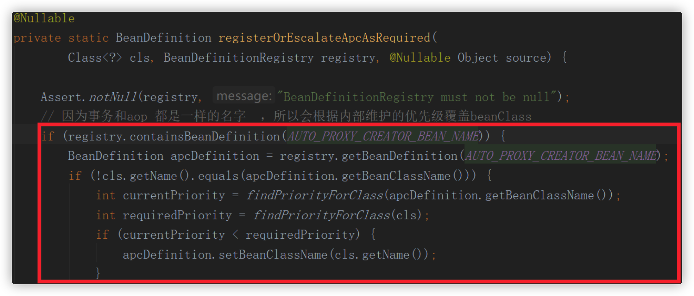

所以假如 `@EnableTransactionManagement` 和 `@EnableAspectJAutoProxy` 同时存在， 那么AOP的AutoProxyCreator会进行覆盖。

##### ProxyTransactionManagementConfiguration

它是一个 `@Configuration`，所以看看它向容器里注入了哪些Bean

```java
@Configuration
public class ProxyTransactionManagementConfiguration extends AbstractTransactionManagementConfiguration {

	// 这个Advisor可是事务的核心内容，也是本文重点分析的对象
	@Bean(name = TransactionManagementConfigUtils.TRANSACTION_ADVISOR_BEAN_NAME)
	@Role(BeanDefinition.ROLE_INFRASTRUCTURE)
	public BeanFactoryTransactionAttributeSourceAdvisor transactionAdvisor() {
		BeanFactoryTransactionAttributeSourceAdvisor advisor = new BeanFactoryTransactionAttributeSourceAdvisor();
		advisor.setTransactionAttributeSource(transactionAttributeSource());
		advisor.setAdvice(transactionInterceptor());
		// 顺序由@EnableTransactionManagement注解的Order属性来指定
    // 默认值为：Ordered.LOWEST_PRECEDENCE
		if (this.enableTx != null) {
			advisor.setOrder(this.enableTx.<Integer>getNumber("order"));
		}
		return advisor;
	}

	// TransactionAttributeSource这种类特别像TargetSource这种类的设计模式
	// 这里直接使用的是AnnotationTransactionAttributeSource基于注解的事务属性源
	@Bean
	@Role(BeanDefinition.ROLE_INFRASTRUCTURE)
	public TransactionAttributeSource transactionAttributeSource() {
		return new AnnotationTransactionAttributeSource();
	}

	// 事务拦截器，它是个MethodInterceptor，它也是Spring处理事务最为核心的部分
	// 请注意：你可以自己定义一个TransactionInterceptor（同名的），来覆盖此Bean（注意是覆盖）
	// 另外请注意：你自定义的BeanName必须同名，也就是必须名为：transactionInterceptor
  // 否则两个都会注册进容器里面去
	@Bean
	@Role(BeanDefinition.ROLE_INFRASTRUCTURE)
	public TransactionInterceptor transactionInterceptor() {
		TransactionInterceptor interceptor = new TransactionInterceptor();
		// 事务的属性
		interceptor.setTransactionAttributeSource(transactionAttributeSource());
		// 事务管理器（也就是注解最终需要使用的事务管理器,父类已经处理好了）
		// 此处注意：我们是可议不用特殊指定的，最终它自己会去容器匹配一个适合的
		if (this.txManager != null) {
			interceptor.setTransactionManager(this.txManager);
		}
		return interceptor;
	}
}

// 父类（抽象类），它实现了ImportAware接口，所以拿到@Import所在类的所有注解信息
@Configuration
public abstract class AbstractTransactionManagementConfiguration implements ImportAware {

	@Nullable
	protected AnnotationAttributes enableTx;
	/**
	 * Default transaction manager, as configured through a {@link TransactionManagementConfigurer}.
	 */
	// 此处：注解的默认的事务处理器（可议通过实现接口TransactionManagementConfigurer来自定义配置）
	// 因为事务管理器这个东西，一般来说全局一个就行，但是Spring也提供了定制化的能力
	@Nullable
	protected PlatformTransactionManager txManager;

	@Override
	public void setImportMetadata(AnnotationMetadata importMetadata) {
		// 此处：只拿到@EnableTransactionManagement这个注解的就成
    // 作为AnnotationAttributes保存起来
		this.enableTx = AnnotationAttributes.fromMap(importMetadata.getAnnotationAttributes(EnableTransactionManagement.class.getName(), false));
		// 这个注解是必须的
		if (this.enableTx == null) {
			throw new IllegalArgumentException("@EnableTransactionManagement is not present on importing class " + importMetadata.getClassName());
		}
	}

	// 可以配置一个Bean实现这个接口。然后给注解驱动的给一个默认的事务管理器
	// 设计模式都是想通的
	@Autowired(required = false)
	void setConfigurers(Collection<TransactionManagementConfigurer> configurers) {
		if (CollectionUtils.isEmpty(configurers)) {
			return;
		}
		// 同样的，最多也只允许你去配置一个
		if (configurers.size() > 1) {
			throw new IllegalStateException("Only one TransactionManagementConfigurer may exist");
		}
		TransactionManagementConfigurer configurer = configurers.iterator().next();
		this.txManager = configurer.annotationDrivenTransactionManager();
	}


	// 注册一个监听器工厂，用以支持@TransactionalEventListener注解标注的方法，来监听事务相关的事件
	// 通过事件监听模式来实现事务的监控
	@Bean(name = TransactionManagementConfigUtils.TRANSACTIONAL_EVENT_LISTENER_FACTORY_BEAN_NAME)
	@Role(BeanDefinition.ROLE_INFRASTRUCTURE)
	public static TransactionalEventListenerFactory transactionalEventListenerFactory() {
		return new TransactionalEventListenerFactory();
	}
}
```

下面重中之重来了，那就是BeanFactoryTransactionAttributeSourceAdvisor这个增强器

##### BeanFactoryTransactionAttributeSourceAdvisor

首先看它的父类：AbstractBeanFactoryPointcutAdvisor。它是一个和Bean工厂和事务都有关系的Advisor

从上面的配置类可议看出，它是new出来一个。使用的Advice为：`advisor.setAdvice(transactionInterceptor())`，既容器内的事务拦截器

使用的事务属性源为：`advisor.setTransactionAttributeSource(transactionAttributeSource())`，既一个`new AnnotationTransactionAttributeSource()` 支持三种事务注解来标注

```java
// @since 2.5.5
// 它是一个AbstractBeanFactoryPointcutAdvisor ，关于这个Advisor 请参阅之前的博文讲解
public class BeanFactoryTransactionAttributeSourceAdvisor extends AbstractBeanFactoryPointcutAdvisor {
	
	@Nullable
	private TransactionAttributeSource transactionAttributeSource;
	
	// 这个很重要，就是切面。它决定了哪些类会被切入，从而生成的代理对象~
	// 关于：TransactionAttributeSourcePointcut 下面有说
	private final TransactionAttributeSourcePointcut pointcut = new TransactionAttributeSourcePointcut() {
		// 注意此处`getTransactionAttributeSource`就是它的一个抽象方法
		@Override
		@Nullable
		protected TransactionAttributeSource getTransactionAttributeSource() {
			return transactionAttributeSource;
		}
	};
	
	// 可议手动设置一个事务属性源
	public void setTransactionAttributeSource(TransactionAttributeSource transactionAttributeSource) {
		this.transactionAttributeSource = transactionAttributeSource;
	}

	// 当然我们可以指定ClassFilter  默认情况下：ClassFilter classFilter = ClassFilter.TRUE;  匹配所有的类的
	public void setClassFilter(ClassFilter classFilter) {
		this.pointcut.setClassFilter(classFilter);
	}

	// 此处pointcut就是使用自己的这个pointcut去切入
	@Override
	public Pointcut getPointcut() {
		return this.pointcut;
	}
}
```

下面当然要重点看看TransactionAttributeSourcePointcut，它是怎么切入的

##### TransactionAttributeSourcePointcut

这个就是事务的匹配Pointcut切面，决定了哪些类需要生成代理对象从而应用事务。

```java
// 首先它的访问权限事default 显示是给内部使用的
// 首先它继承自StaticMethodMatcherPointcut
// 所以`ClassFilter classFilter = ClassFilter.TRUE;` 匹配所有的类
// 并且 isRuntime=false 表示只需要对方法进行静态匹配即可
abstract class TransactionAttributeSourcePointcut extends StaticMethodMatcherPointcut implements Serializable {

	// 方法的匹配，静态匹配即可（因为事务无需要动态匹配这么细粒度）
	@Override
	public boolean matches(Method method, Class<?> targetClass) {
		// 实现了如下三个接口的子类，就不需要被代理了  直接放行
		// TransactionalProxy它是SpringProxy的子类。
    // 如果是被TransactionProxyFactoryBean生产出来的Bean，就会自动实现此接口，
    // 那么就不会被这里再次代理了
		// PlatformTransactionManager：spring抽象的事务管理器
		// PersistenceExceptionTranslator对RuntimeException转换成DataAccessException的转换接口
		if (TransactionalProxy.class.isAssignableFrom(targetClass) ||
				PlatformTransactionManager.class.isAssignableFrom(targetClass) ||
				PersistenceExceptionTranslator.class.isAssignableFrom(targetClass)) {
			return false;
		}
		
		// 重要：拿到事务属性源
		// 如果 tas == null 表示没有配置事务属性源，那是全部匹配的，也就是说所有的方法都匹配
		// 或者 标注了 @Transaction 这样的注解的方法才会给与匹配
		TransactionAttributeSource tas = getTransactionAttributeSource();
		return (tas == null || tas.getTransactionAttribute(method, targetClass) != null);
	}	
	
  // ...
  
	// 由子类提供，告诉事务属性源，我才好知道哪些方法我需要切嘛
	@Nullable
	protected abstract TransactionAttributeSource getTransactionAttributeSource();
}
```

关于matches方法的调用时机：只要是容器内的每个Bean，都会经过`AbstractAutoProxyCreator#postProcessAfterInitialization` 从而会调用wrapIfNecessary方法，因此容器内所有的Bean的所有方法在容器启动时候都会执行此matche方法，因此请注意缓存的使用~~~~~

### 2.2 解析advisor

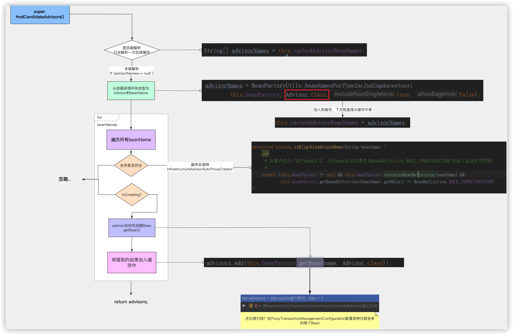

在Spring AOP中有过过介绍，解析事务advisor详细代码：`org.springframework.aop.framework.autoproxy.BeanFactoryAdvisorRetrievalHelper#findAdvisorBeans`

```java
public List<Advisor> findAdvisorBeans() {

   /**
    * 探测器字段缓存中cachedAdvisorBeanNames 是用来保存我们的Advisor全类名
    * 会在第一个单实例bean的中会去把这个advisor名称解析出来
    */
   String[] advisorNames = this.cachedAdvisorBeanNames;
   if (advisorNames == null) {
      /**
       * 去我们的容器中获取到实现了Advisor接口的实现类
       * 而我们的事务注解@EnableTransactionManagement 导入了一个叫ProxyTransactionManagementConfiguration配置类
       * 而在这个配置类中配置了
       * @Bean(name = TransactionManagementConfigUtils.TRANSACTION_ADVISOR_BEAN_NAME)
         @Role(BeanDefinition.ROLE_INFRASTRUCTURE)
         public BeanFactoryTransactionAttributeSourceAdvisor transactionAdvisor();
         然后把他的名字获取出来保存到 本类的属性变量cachedAdvisorBeanNames中
       */
      advisorNames = BeanFactoryUtils.beanNamesForTypeIncludingAncestors(
            this.beanFactory, Advisor.class, true, false);
      this.cachedAdvisorBeanNames = advisorNames;
   }
   // 若在容器中没有找到，直接返回一个空的集合
   if (advisorNames.length == 0) {
      return new ArrayList<>();
   }

   List<Advisor> advisors = new ArrayList<>();
   // ioc容器中找到了我们配置的BeanFactoryTransactionAttributeSourceAdvisor
   for (String name : advisorNames) {
      // 判断他是不是一个合适的 是我们想要的 默认true
      if (isEligibleBean(name)) {
         // BeanFactoryTransactionAttributeSourceAdvisor是不是正在创建的bean
         if (this.beanFactory.isCurrentlyInCreation(name)) {
            if (logger.isDebugEnabled()) {
               logger.debug("Skipping currently created advisor '" + name + "'");
            }
         }
         // 不是的话
         else {
            try {
               // 显示的调用getBean方法方法创建我们的BeanFactoryTransactionAttributeSourceAdvisor返回去
               advisors.add(this.beanFactory.getBean(name, Advisor.class));
            }
            catch (BeanCreationException ex) {
               Throwable rootCause = ex.getMostSpecificCause();
               if (rootCause instanceof BeanCurrentlyInCreationException) {
                  BeanCreationException bce = (BeanCreationException) rootCause;
                  String bceBeanName = bce.getBeanName();
                  if (bceBeanName != null && this.beanFactory.isCurrentlyInCreation(bceBeanName)) {
                     if (logger.isDebugEnabled()) {
                        logger.debug("Skipping advisor '" + name +
                              "' with dependency on currently created bean: " + ex.getMessage());
                     }
                     // Ignore: indicates a reference back to the bean we're trying to advise.
                     // We want to find advisors other than the currently created bean itself.
                     continue;
                  }
               }
               throw ex;
            }
         }
      }
   }
   return advisors;
}
```

去我们的容器中获取到实现了Advisor接口的实现类

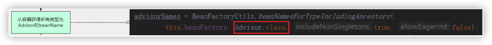

显示的调用getBean方法方法创建我们的 BeanFactoryTransactionAttributeSourceAdvisor 返回去

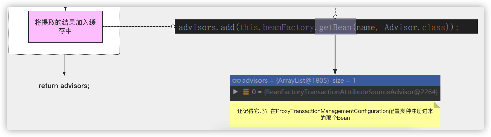

### 3.3 创建动态代理

https://www.processon.com/view/link/5f507c7407912902cf700145

在Spring AOP中有过过介绍，区别在于匹配方式的不同：

- AOP是按照Aspectj提供的API 结合切点表达式进行匹配。   
- 事务是根据方法或者类或者接口上面的@Transactional进行匹配。

所以本文和aop重复的就省略了如下：

```java
// 创建Bean
createBean:524, AbstractAutowireCapableBeanFactory (org.springframework.beans.factory.support)
// 执行带 Bean的生命周期的doCreateBean
doCreateBean:614, AbstractAutowireCapableBeanFactory (org.springframework.beans.factory.support)
// 初始化方法
initializeBean:1931, AbstractAutowireCapableBeanFactory (org.springframework.beans.factory.support)
// 执行初始化后的  BeanPostProcessor
applyBeanPostProcessorsAfterInitialization:445, AbstractAutowireCapableBeanFactory (org.springframework.beans.factory.support)
// 调用创建动态代理方法   AbstractAutoProxyCreator.postProcessAfterInitialization
postProcessAfterInitialization:327, AbstractAutoProxyCreator (org.springframework.aop.framework.autoproxy)
wrapIfNecessary:378, AbstractAutoProxyCreator (org.springframework.aop.framework.autoproxy)
// 根据当前bean找到匹配的advisor  
getAdvicesAndAdvisorsForBean:84, AbstractAdvisorAutoProxyCreator (org.springframework.aop.framework.autoproxy)
// 拿到before解析的所有adivsor做匹配
findEligibleAdvisors:106, AbstractAdvisorAutoProxyCreator (org.springframework.aop.framework.autoproxy)
findAdvisorsThatCanApply:144, AbstractAdvisorAutoProxyCreator (org.springframework.aop.framework.autoproxy)
findAdvisorsThatCanApply:344, AopUtils (org.springframework.aop.support)
// 根据TransactionAttributeSourcePointcut判断是否匹配
canApply:305, AopUtils (org.springframework.aop.support)
```

从该方法开始跟AOP有所区别了：

```java
public static boolean canApply(Pointcut pc, Class<?> targetClass, boolean hasIntroductions) {
   Assert.notNull(pc, "Pointcut must not be null");
   // 进行类级别过滤 这里会返回
   if (!pc.getClassFilter().matches(targetClass)) {
      return false;
   }
   /**
    * 进行方法级别过滤
    */
   // 如果 pc.getMethodMatcher() 返回TrueMethodMatcher则匹配所有方法
   MethodMatcher methodMatcher = pc.getMethodMatcher();
   if (methodMatcher == MethodMatcher.TRUE) {
      // No need to iterate the methods if we're matching any method anyway...
      return true;
   }

   // 判断匹配器是不是IntroductionAwareMethodMatcher
   // 只有AspectJExpressionPointCut才会实现这个接口
   IntroductionAwareMethodMatcher introductionAwareMethodMatcher = null;
   if (methodMatcher instanceof IntroductionAwareMethodMatcher) {
      introductionAwareMethodMatcher = (IntroductionAwareMethodMatcher) methodMatcher;
   }

   // 创建一个集合用于保存targetClass 的class对象
   Set<Class<?>> classes = new LinkedHashSet<>();
   // 判断当前class是不是代理的class对象
   if (!Proxy.isProxyClass(targetClass)) {
      // 加入到集合中去
      classes.add(ClassUtils.getUserClass(targetClass));
   }
   // 获取到targetClass所实现的接口的class对象，然后加入到集合中
   classes.addAll(ClassUtils.getAllInterfacesForClassAsSet(targetClass));

   // 循环所有的class对象
   for (Class<?> clazz : classes) {
      // 通过class获取到所有的方法
      Method[] methods = ReflectionUtils.getAllDeclaredMethods(clazz);
      // 循环我们的方法
      for (Method method : methods) {
         // 通过methodMatcher.matches来匹配我们的方法
         if (introductionAwareMethodMatcher != null ?
               // 通过切点表达式进行匹配 AspectJ方式
               introductionAwareMethodMatcher.matches(method, targetClass, hasIntroductions) :
               // 通过方法匹配器进行匹配 内置aop接口方式
               methodMatcher.matches(method, targetClass)) {
            // 只要有1个方法匹配上了就创建代理
            return true;
         }
      }
   }
   return false;
}
```

##### 关键点

-  `if (!pc.getClassFilter().matches(targetClass)) {`      
- 初筛时事务不像aop，  上面介绍的 TransactionAttributeSourcePointcut 的 getClassFilter 是 TrueClassFilter，所以所有的类都能匹配。

-  `if (methodMatcher instanceof IntroductionAwareMethodMatcher) {`
- 事务的 methodMatcher 没有实现该接口。 只有AOP的实现了该接口所以也导致下面：

- `methodMatcher.matches(method, targetClass)`
- 所以事务时直接调用 `methodMatcher.matches` 进行匹配

#### 匹配方式

##### `org.springframework.transaction.interceptor.TransactionAttributeSourcePointcut#matches`

```java
@Override
public boolean matches(Method method, @Nullable Class<?> targetClass) {
   if (targetClass != null && TransactionalProxy.class.isAssignableFrom(targetClass)) {
      return false;
   }
   /**
    * 获取我们@EnableTransactionManagement注解为我们容器中导入的ProxyTransactionManagementConfiguration
    * 配置类中的TransactionAttributeSource对象
    */
   TransactionAttributeSource tas = getTransactionAttributeSource();
   // 通过getTransactionAttribute看是否有@Transactional注解
   return (tas == null || tas.getTransactionAttribute(method, targetClass) != null);
}
```

###### 关键点

- `TransactionAttributeSource tas = getTransactionAttributeSource();`
- 这里获取到的时候 通过 `@Import` 的 ImportSelect 注册的配置类ProxyTransactionManagementConfiguration 中设置的 **AnnotationTransactionAttributeSource**：它是基于注解驱动的事务管理的事务属性源，和 `@Transaction` 相关，也是现在使用得最最多的方式。

它的基本作用为：它遇上比如 `@Transaction` 标注的方法时，此类会分析此事务注解，最终组织形成一个TransactionAttribute供随后的调用。

当然还有其他的类型 ，稍微举几个例：

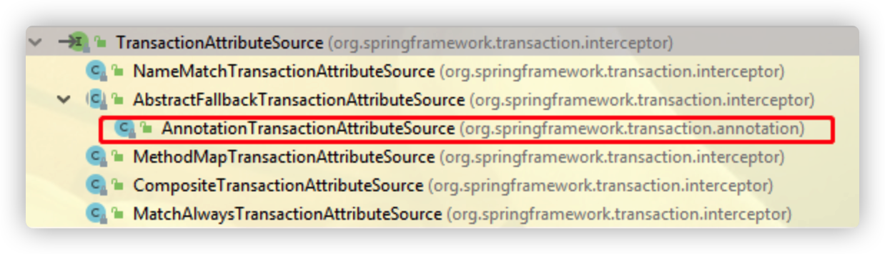

- **NameMatchTransactionAttributeSource：**根据名字就能匹配，然后该事务属性就会作用在对应的方法上。比如下面例子：

```java
@Bean
public TransactionAttributeSource transactionAttributeSource() {
    Map<String, TransactionAttribute> txMap = new HashMap<>();
    // required事务，适用于增删改场景
    RuleBasedTransactionAttribute requiredTx = new RuleBasedTransactionAttribute();
    requiredTx.setRollbackRules(Collections.singletonList(new RollbackRuleAttribute(RuntimeException.class)));
    requiredTx.setPropagationBehavior(TransactionDefinition.PROPAGATION_REQUIRED);
    txMap.put("add*", requiredTx);
    txMap.put("save*", requiredTx);
    txMap.put("insert*", requiredTx);
    txMap.put("update*", requiredTx);
    txMap.put("delete*", requiredTx); 

    // 查询，使用只读事务
    RuleBasedTransactionAttribute readOnlyTx = new RuleBasedTransactionAttribute();
    readOnlyTx.setReadOnly(true);
    readOnlyTx.setPropagationBehavior(TransactionDefinition.PROPAGATION_NOT_SUPPORTED);
    txMap.put("get*", readOnlyTx);
    txMap.put("query*", readOnlyTx);

    NameMatchTransactionAttributeSource source = new NameMatchTransactionAttributeSource();
    source.setNameMap(txMap);

    return source;
}
```

- **MethodMapTransactionAttributeSource**：它的使用方式和NameMatchTransactionAttributeSource基本相同，指定具体方法名
- **CompositeTransactionAttributeSource**：组合模式，这里不细讲

##### `org.springframework.transaction.interceptor.AbstractFallbackTransactionAttributeSource#getTransactionAttribute`

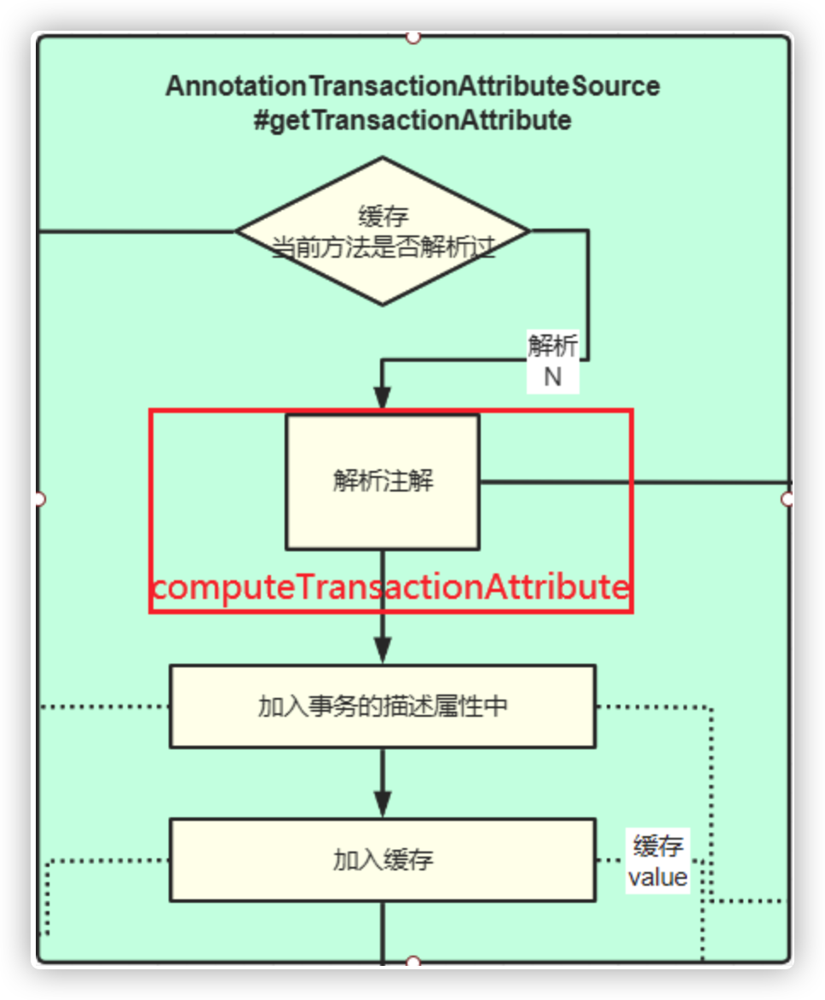

```java
public TransactionAttribute getTransactionAttribute(Method method, @Nullable Class<?> targetClass) {
   // 判断method所在的class是不是Object类型
   if (method.getDeclaringClass() == Object.class) {
      return null;
   }

   // 构建我们的缓存key
   Object cacheKey = getCacheKey(method, targetClass);
   // 先去我们的缓存中获取
   TransactionAttribute cached = this.attributeCache.get(cacheKey);
   // 缓存中不为空
   if (cached != null) {
      // 判断缓存中的对象是不是空事务属性的对象
      if (cached == NULL_TRANSACTION_ATTRIBUTE) {
         return null;
      }
      // 不是的话 就进行返回
      else {
         return cached;
      }
   }
   else {
      // 我们需要查找我们的事务注解，匹配在这体现
      TransactionAttribute txAttr = computeTransactionAttribute(method, targetClass);
      // 若解析出来的事务注解属性为空
      if (txAttr == null) {
         // 往缓存中存放空事务注解属性
         this.attributeCache.put(cacheKey, NULL_TRANSACTION_ATTRIBUTE);
      }
      else {
         // 我们执行方法的描述符，全类名+方法名
         String methodIdentification = ClassUtils.getQualifiedMethodName(method, targetClass);
         // 把方法描述设置到事务属性上去
         if (txAttr instanceof DefaultTransactionAttribute) {
            ((DefaultTransactionAttribute) txAttr).setDescriptor(methodIdentification);
         }
         if (logger.isDebugEnabled()) {
            logger.debug("Adding transactional method '" + methodIdentification + "' with attribute: " + txAttr);
         }
         // 加入到缓存
         this.attributeCache.put(cacheKey, txAttr);
      }
      return txAttr;
   }
}
```

###### 关键点

- `if (cached != null) {`
- 先从缓存中取， 因为这个过程相对比较耗资源，会使用缓存存储已经解析过的， 后续调用时需要获取

- `TransactionAttribute txAttr = computeTransactionAttribute(method, targetClass);`
- 该方法中具体执行匹配过程  大致是：  实现类方法--->接口的方法--->实现类---->接口类

- `((DefaultTransactionAttribute) txAttr).setDescriptor(methodIdentification);`
- 记录当前需要执行事务的方法名，记录到Descriptor   方便后续调用时判断

- `this.attributeCache.put(cacheKey, txAttr);`
- 加入到缓存中

##### 看下是怎么匹配的`org.springframework.transaction.interceptor.AbstractFallbackTransactionAttributeSource#computeTransactionAttribute`

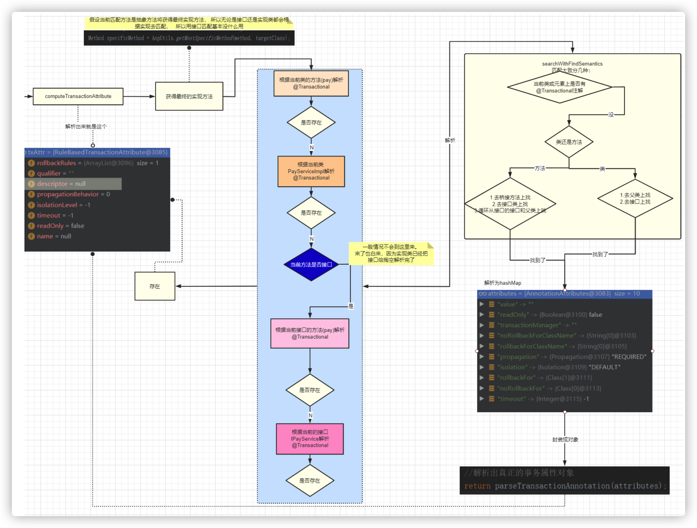

```java
@Nullable
protected TransactionAttribute computeTransactionAttribute(Method method, @Nullable Class<?> targetClass) {
   // 判断我们的事务方法上的修饰符是不是public的
   if (allowPublicMethodsOnly() && !Modifier.isPublic(method.getModifiers())) {
      return null;
   }

   // The method may be on an interface, but we need attributes from the target class.
   // If the target class is null, the method will be unchanged.
   Method specificMethod = AopUtils.getMostSpecificMethod(method, targetClass);

   // 第一步，我们先去目标class的方法上去找我们的事务注解
   TransactionAttribute txAttr = findTransactionAttribute(specificMethod);
   if (txAttr != null) {
      return txAttr;
   }

   // 第二步:去我们targetClass类[实现类]上找事务注解
   txAttr = findTransactionAttribute(specificMethod.getDeclaringClass());
   if (txAttr != null && ClassUtils.isUserLevelMethod(method)) {
      return txAttr;
   }
   // 具体方法不是当前的方法说明  当前方法是接口方法
   if (specificMethod != method) {
      //去我们的实现类的接口上的方法去找事务注解
      txAttr = findTransactionAttribute(method);
      if (txAttr != null) {
         return txAttr;
      }
      // 去我们的实现类的接口上去找事务注解
      txAttr = findTransactionAttribute(method.getDeclaringClass());
      if (txAttr != null && ClassUtils.isUserLevelMethod(method)) {
         return txAttr;
      }
   }
   return null;
}
```

###### 关键点

**这个方法乍一看，觉得是先从实现类方法-->实现类--->接口方法--->接口类**

**但是！！！！   他在第一个实现方法查找就已经找了接口方法父类方法。在实现类里面就找了接口类和父类，  所以接口方法--->接口类，基本走了也没用**

- `Method specificMethod = AopUtils.getMostSpecificMethod(method, targetClass);`
- 得到具体方法， 如果method是接口方法那将从targetClass得到实现类的方法 ， 所以说无论传的是接口还是实现， 都会先解析实现类， 所以接口传进来基本没啥用，因为findTransactionAttribute方法本身就会去接口中解析

- `TransactionAttribute txAttr = findTransactionAttribute(specificMethod);`
- 根据具体方法解析

- `txAttr = findTransactionAttribute(specificMethod.getDeclaringClass());`
- 根据实现类解析

#### `@Transactional`简单解释

这个事务注解可以用在类上，也可以用在方法上。

- 将事务注解标记到服务组件类级别,相当于为该服务组件的每个服务方法都应用了这个注解
- 事务注解应用在方法级别，是更细粒度的一种事务注解方式

注意 : 如果某个方法和该方法所属类上都有事务注解属性，优先使用方法上的事务注解属性。

另外，Spring 支持三个不同的事务注解 :

- Spring 事务注解 `org.springframework.transaction.annotation.Transactional`（纯正血统，官方推荐）
- JTA事务注解 `javax.transaction.Transactional`
- EJB 3 事务注解 `javax.ejb.TransactionAttribute`

上面三个注解虽然语义上一样，但是使用方式上不完全一样，若真要使其它的时请注意各自的使用方式~ 

所以， 我们来看下Spring 事务注解：SpringTransactionAnnotationParser 的解析：

```
findTransactionAttribute:146, AnnotationTransactionAttributeSource (org.springframework.transaction.annotation)
determineTransactionAttribute:164, AnnotationTransactionAttributeSource (org.springframework.transaction.annotation)
parseTransactionAnnotation:46, SpringTransactionAnnotationParser (org.springframework.transaction.annotation)
findMergedAnnotationAttributes:607, AnnotatedElementUtils (org.springframework.core.annotation)
searchWithFindSemantics:981, AnnotatedElementUtils (org.springframework.core.annotation)
searchWithFindSemantics:1009, AnnotatedElementUtils (org.springframework.core.annotation)
```

`org.springframework.core.annotation.AnnotatedElementUtils#searchWithFindSemantics` 这是个公共方法， 根据传入的注解类型和元素进行匹配

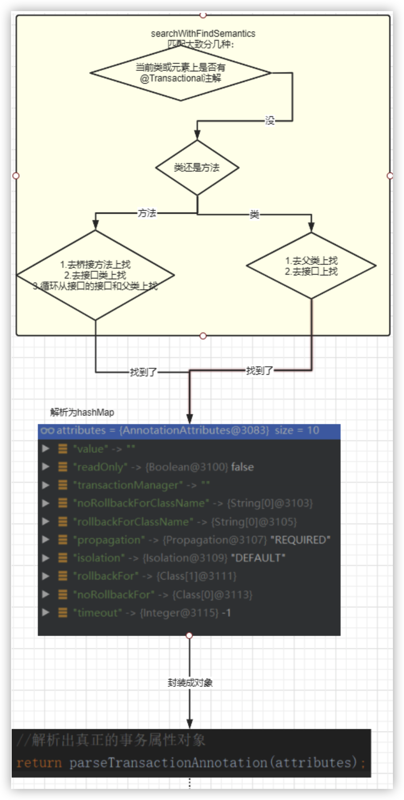

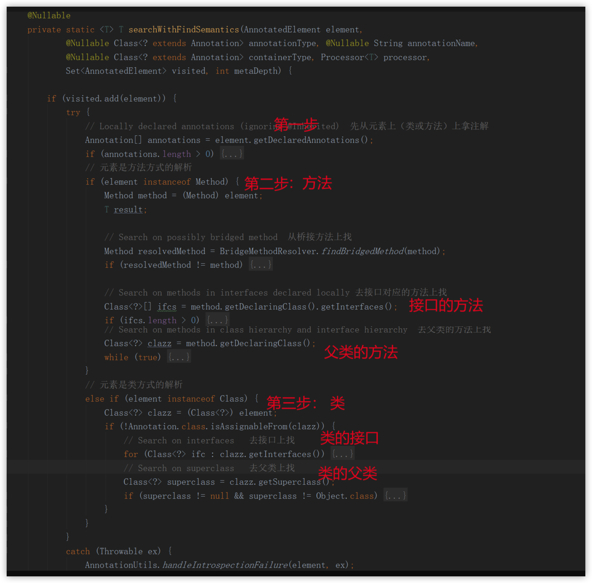

- 最终会解析成TransactionAttribute

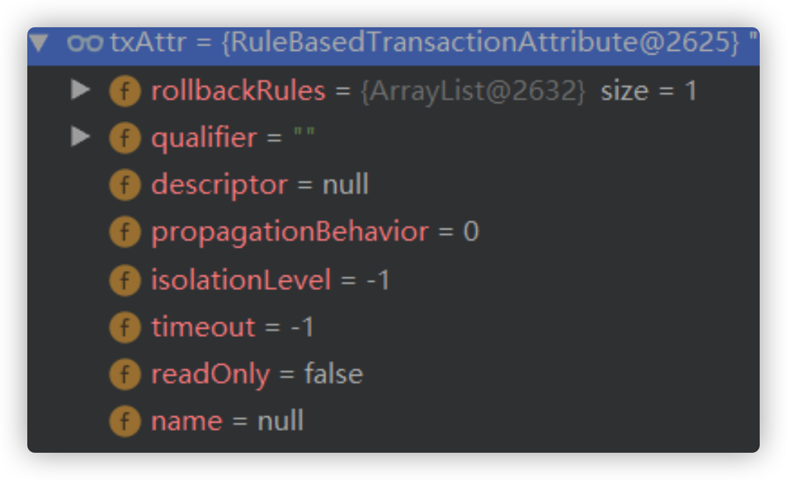

- 记录当前需要执行事务的方法名，记录到descriptor方便后续调用时判断

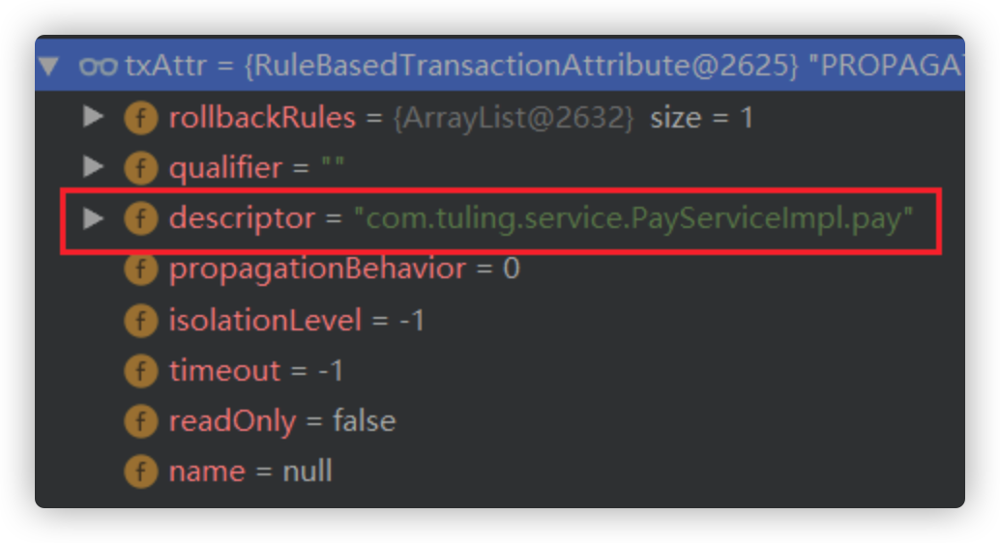

- 加入到缓存 `this.attributeCache.put(cacheKey, txAttr);`

- 如果 `txAttr!=null` 说明解析成功，`return true` 匹配成功！
- 创建动态代理跟Aop的逻辑是一样的，这里就不详细说了

### 3.4 调用代理对象

https://www.processon.com/view/link/5f50d4c75653bb53ea8df95a

调用开始和AOP是一样的，这里省略之前的代码：

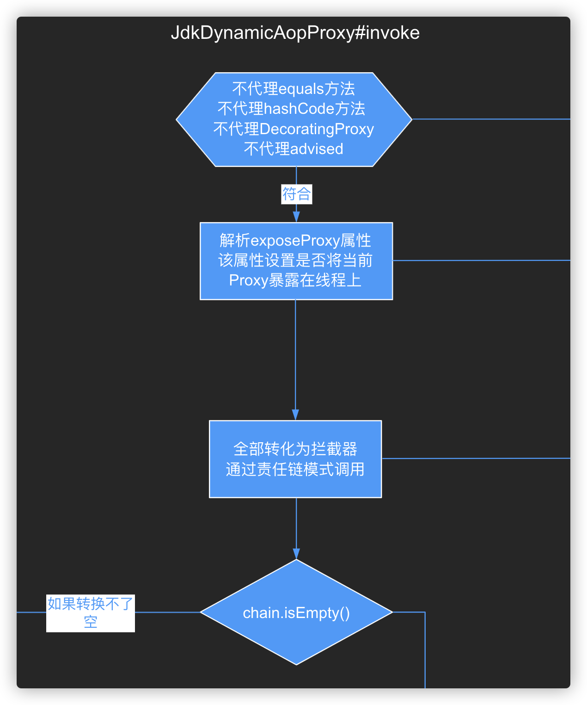

最终调用 `org.springframework.transaction.interceptor.TransactionAspectSupport#invokeWithinTransaction`

```java
@Nullable
protected Object invokeWithinTransaction(Method method, @Nullable Class<?> targetClass,
      final InvocationCallback invocation) throws Throwable {

   // 获取我们的事务属源对象在配置类中添加的，在创建代理进行匹配的时候还用了它还记得吗（将解析的事务属性赋值进去了）
   TransactionAttributeSource tas = getTransactionAttributeSource();
   // 获取解析后的事务属性信息，
   // 创建代理的时候也调用了getTransactionAttribute还记得吗，如果解析到了事务属性就可以创建代理，
   // 在这里是从解析后的缓存中获取
   final TransactionAttribute txAttr = (tas != null ? tas.getTransactionAttribute(method, targetClass) : null);
   // 获取我们配置的事务管理器对象 在我们自己的配置类里面配置的
   final PlatformTransactionManager tm = determineTransactionManager(txAttr);
   // 从tx属性对象中获取出标注了@Transactionl的方法描述符
   // 之前往descriptor中设置的还记得吧
   final String joinpointIdentification = methodIdentification(method, targetClass, txAttr);

   // 处理声明式事务
   if (txAttr == null || !(tm instanceof CallbackPreferringPlatformTransactionManager)) {
      // 有没有必要创建事务
      TransactionInfo txInfo = createTransactionIfNecessary(tm, txAttr, joinpointIdentification);

      Object retVal;
      try {
         //调用钩子函数进行回调目标方法
         retVal = invocation.proceedWithInvocation();
      }
      catch (Throwable ex) {
         //抛出异常进行回滚处理
         completeTransactionAfterThrowing(txInfo, ex);
         throw ex;
      }
      finally {
         // 清空我们的线程变量中transactionInfo的值
         cleanupTransactionInfo(txInfo);
      }
      //提交事务
      commitTransactionAfterReturning(txInfo);
      return retVal;
   }
   // 编程式事务：（回调偏向）
   else {
       ...
   }
}
```

方法概览

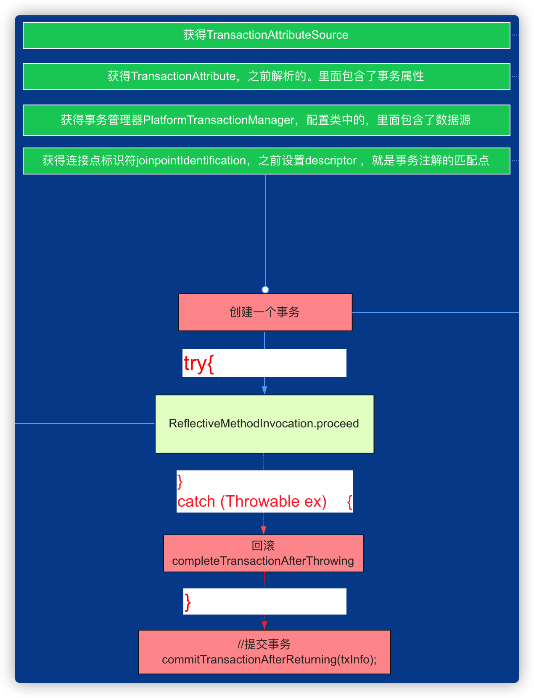

###### 关键点

- 前面4行都是获取一些基本信息

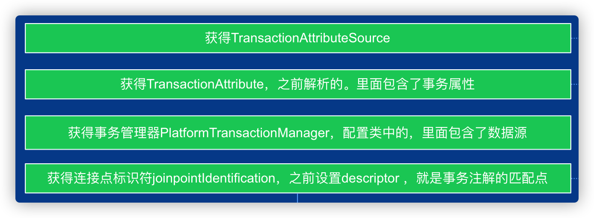

- createTransactionIfNecessary     这个方法逻辑最多，事务传播行为等实现都是在这种方法

- - 如果有必要会创建一个事务，什么是有必要？

- try  中回调"连接点（事务的方法）" 

- catch 中出现异常回滚事务

- commitTransactionAfterReturning 提交事务

着重看一下 **createTransactionIfNecessary** 的逻辑实现

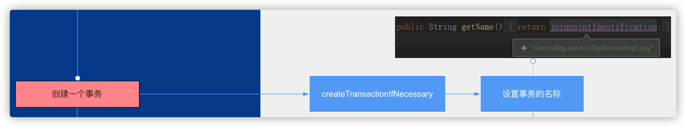

```java
protected TransactionInfo createTransactionIfNecessary(
      @Nullable PlatformTransactionManager tm,
      @Nullable TransactionAttribute txAttr, final String joinpointIdentification) {

   // 如果还没有定义名字，把连接点的ID定义成事务的名称
   if (txAttr != null && txAttr.getName() == null) {
      txAttr = new DelegatingTransactionAttribute(txAttr) {
         @Override
         public String getName() {
            return joinpointIdentification;
         }
      };
   }

   TransactionStatus status = null;
   if (txAttr != null) {
      if (tm != null) {
         // 获取一个事务状态
         status = tm.getTransaction(txAttr);
      }
      else {
         if (logger.isDebugEnabled()) {
            logger.debug("Skipping transactional joinpoint [" + joinpointIdentification +
                  "] because no transaction manager has been configured");
         }
      }
   }
   // 把事物状态和事物属性等信息封装成一个TransactionInfo对象
   return prepareTransactionInfo(tm, txAttr, joinpointIdentification, status);
}
```

###### 关键点

- 将之前的Descriptor   作为事务名称
- 这里重点看下 `tm.getTransaction`，tm 是我们在配置类中的transactionManager

```java
@Bean
public PlatformTransactionManager transactionManager(DataSource dataSource) {
    return new DataSourceTransactionManager(dataSource);
}
```

所以重点看下 `tm.getTransaction`

```java
public final TransactionStatus getTransaction(@Nullable TransactionDefinition definition) throws TransactionException {
   // 尝试获取一个事务对象
   Object transaction = doGetTransaction();

   // Cache debug flag to avoid repeated checks.
   boolean debugEnabled = logger.isDebugEnabled();

   /**
    * 判断从上一个方法传递进来的事务属性是不是为空
    */
   if (definition == null) {

      definition = new DefaultTransactionDefinition();
   }

   /**
    * 判断是不是已经存在了事务对象（事务嵌套）
    */
   if (isExistingTransaction(transaction)) {
      // 处理存在的事务
      return handleExistingTransaction(definition, transaction, debugEnabled);
   }

   // 检查事务设置的超时时间
   if (definition.getTimeout() < TransactionDefinition.TIMEOUT_DEFAULT) {
      throw new InvalidTimeoutException("Invalid transaction timeout", definition.getTimeout());
   }

   /**
    * 若当前的事务属性式 PROPAGATION_MANDATORY 表示必须运行在事务中，若当前没有事务就抛出异常
    * 由于isExistingTransaction(transaction)跳过了这里，说明当前是不存在事务的，那么就会抛出异常
    */
   if (definition.getPropagationBehavior() == TransactionDefinition.PROPAGATION_MANDATORY) {
      throw new IllegalTransactionStateException(
            "No existing transaction found for transaction marked with propagation 'mandatory'");
   }
   /**
    * PROPAGATION_REQUIRED 当前存在事务就加入到当前的事务,没有就新开一个
    * PROPAGATION_REQUIRES_NEW:新开一个事务,若当前存在事务就挂起当前事务
    * PROPAGATION_NESTED: PROPAGATION_NESTED
       表示如果当前正有一个事务在运行中，则该方法应该运行在 一个嵌套的事务中，
       被嵌套的事务可以独立于封装事务进行提交或者回滚(保存点)，
       如果封装事务不存在,行为就像 PROPAGATION_REQUIRES NEW
    */
   else if (definition.getPropagationBehavior() == TransactionDefinition.PROPAGATION_REQUIRED ||
         definition.getPropagationBehavior() == TransactionDefinition.PROPAGATION_REQUIRES_NEW ||
         definition.getPropagationBehavior() == TransactionDefinition.PROPAGATION_NESTED) {
      /**
       * 挂起当前事务，在这里为啥传入null?
       * 因为逻辑走到这里了,经过了上面的isExistingTransaction(transaction) 判断当前是不存在事务的
       * 所有再这里是挂起当前事务传递一个null进去
       */
      SuspendedResourcesHolder suspendedResources = suspend(null);
      if (debugEnabled) {
         logger.debug("Creating new transaction with name [" + definition.getName() + "]: " + definition);
      }
      try {
         // 意思是可以进行同步
         boolean newSynchronization = (getTransactionSynchronization() != SYNCHRONIZATION_NEVER);
         // 构造事务状态对象,newTransaction=true代表是一个新事务
         DefaultTransactionStatus status = newTransactionStatus(
               definition, transaction, true, newSynchronization, debugEnabled, suspendedResources);
         // 开启一个新的事物
         doBegin(transaction, definition);
         // 把当前的事务信息绑定到线程变量去
         prepareSynchronization(status, definition);
         return status;
      }
      catch (RuntimeException | Error ex) {
         resume(null, suspendedResources);
         throw ex;
      }
   }
   else { //创建一个空的事务
      // Create "empty" transaction: no actual transaction, but potentially synchronization.
      if (definition.getIsolationLevel() != TransactionDefinition.ISOLATION_DEFAULT && logger.isWarnEnabled()) {
         logger.warn("Custom isolation level specified but no actual transaction initiated; " +
               "isolation level will effectively be ignored: " + definition);
      }
      boolean newSynchronization = (getTransactionSynchronization() == SYNCHRONIZATION_ALWAYS);
      return prepareTransactionStatus(definition, null, true, newSynchronization, debugEnabled, null);
   }
}
```

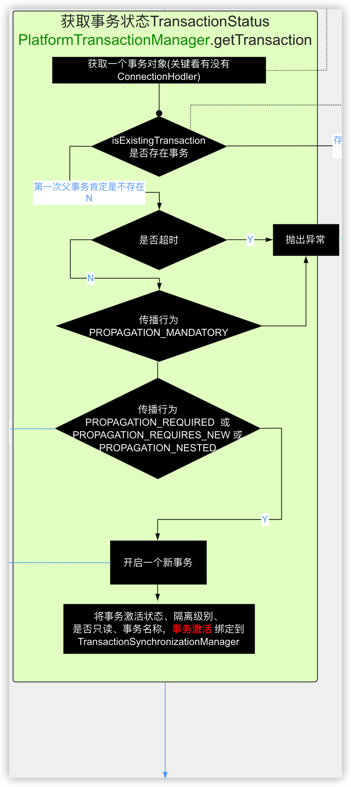

###### 关键点

可以看到这个方法里面做了很多关于事务的逻辑实现

- `Object transaction = doGetTransaction();`

- 获得事务对象，这里事务是否存在主要看它携带的ConnectionHolder（数据库连接持有者），如果ConnectionHolder有则基本说明存在事务，什么情况下会存在已存在事务？  ——嵌套事务

- `if (isExistingTransaction(transaction)) {`

- 这里判断是否存在事务

- - 如果已存在就处理嵌套的事务逻辑， 这里我们待会作为分支再来跟进
    - 如果不存在就处理顶层的事务逻辑，下面将先介绍顶层的事务逻辑

### 3.5 顶层的事务逻辑

处理不同的传播行为，看这之前我们先了解一下事务的传播行为

| 事务传播行为类型 | 外部不存在事务 | 外部存在事务                                                 | 使用方式                                                     |
| ---------------- | -------------- | ------------------------------------------------------------ | ------------------------------------------------------------ |
| REQUIRED（默认） | 开启新的事务   | 融合到外部事务中                                             | `@Transactional(propagation = Propagation.REQUIRED)` 适用增删改查 |
| SUPPORTS         | 不开启新的事务 | 融合到外部事务中                                             | `@Transactional(propagation = Propagation.SUPPORTS)` 适用查询 |
| REQUIRES_NEW     | 开启新的事务   | 挂起外部事务，创建新的事务                                   | `@Transactional(propagation = Propagation.REQUIRES_NEW)` 适用内部事务和外部事务不存在业务关联情况，如日志 |
| NOT_SUPPORTED    | 不开启新的事务 | 挂起外部事务，不开启事务                                     | `@Transactional(propagation = Propagation.NOT_SUPPORTED)` 不常用 |
| NEVER            | 不开启新的事务 | 抛出异常                                                     | `@Transactional(propagation = Propagation.NEVER)`不常用      |
| MANDATORY        | 抛出异常       | 融合到外部事务中                                             | `@Transactional(propagation = Propagation.MANDATORY)` 不常用 |
| NESTED           | 开启新的事务   | 融合到外部事务中,SavePoint机制，外层影响内层， 内层不会影响外层 | `@Transactional(propagation = Propagation.NESTED)` 不常用    |

-  PROPAGATION_MANDATORY

- 当事务传播行为是MANDATORY ， 所以这里直接抛出异常

-  PROPAGATION_REQUIRED || PROPAGATION_REQUIRES_NEW || PROPAGATION_NESTED

- 当事务传播行为是REQUIRED 或者 REQUIRES_NEW 或者 NESTED  都将开启一个新的事务，怎么开启：

- - `suspend(null);` 挂起当前事务， 顶层事务当前还没创建事务，没啥可挂的，所以传个null进去
    - newSynchronization 允许开启同步事务
    -  newTransactionStatus 构造事务状态对象, 并且把事务的信息封装进去：
        - definition，事务的属性
        - transaction，事务的对象
        -  true，代表是一个新的事务
    -  `doBegin(transaction, definition);` 开启一个新事务， 这里跟进去看下怎么开启的
    - `prepareSynchronization(status, definition);`
        - 把当前的事务信息绑定到线程变量去:   为什么要绑定要线程变量呢？  因为存在嵌套事务情况下需要用到

```java
// 事务的名称
private static final ThreadLocal<String> currentTransactionName = new NamedThreadLocal<>("Current transaction name");
// 是否为只读事务
private static final ThreadLocal<Boolean> currentTransactionReadOnly = new NamedThreadLocal<>("Current transaction read-only status");
// 当前事务的隔离级别
private static final ThreadLocal<Integer> currentTransactionIsolationLevel = new NamedThreadLocal<>("Current transaction isolation level");
// 当前事务是否激活  ，怎么样算激活：  就是有事务就是已开启， 当然到这一步一般就有事务的，因为执行doBegin就开启了
private static final ThreadLocal<Boolean> actualTransactionActive = new NamedThreadLocal<>("Actual transaction active");
```

看下**doBegin**

```java
protected void doBegin(Object transaction, TransactionDefinition definition) {
   // 强制转化事物对象
   DataSourceTransactionObject txObject = (DataSourceTransactionObject) transaction;
   Connection con = null;

   try {
      // 判断事务对象没有数据库连接持有器
      if (!txObject.hasConnectionHolder() ||
            txObject.getConnectionHolder().isSynchronizedWithTransaction()) {
         // 通过数据源获取一个数据库连接对象
         Connection newCon = obtainDataSource().getConnection();
         if (logger.isDebugEnabled()) {
            logger.debug("Acquired Connection [" + newCon + "] for JDBC transaction");
         }
         // 把我们的数据库连接包装成一个ConnectionHolder对象
         // 然后设置到我们的txObject对象中去
         txObject.setConnectionHolder(new ConnectionHolder(newCon), true);
      }

      // 标记当前的连接是一个同步事务...?
      txObject.getConnectionHolder().setSynchronizedWithTransaction(true);
      con = txObject.getConnectionHolder().getConnection();

      // 设置isReadOnly、隔离级别
      Integer previousIsolationLevel = DataSourceUtils.prepareConnectionForTransaction(con, definition);
      txObject.setPreviousIsolationLevel(previousIsolationLevel);

      // setAutoCommit 默认为true，即每条SQL语句在各自的一个事务中执行。
      if (con.getAutoCommit()) {
         txObject.setMustRestoreAutoCommit(true);
         if (logger.isDebugEnabled()) {
            logger.debug("Switching JDBC Connection [" + con + "] to manual commit");
         }
         con.setAutoCommit(false); // 开启事务
      }

      // 判断事务为只读事务
      prepareTransactionalConnection(con, definition);
      //设置事务激活
      txObject.getConnectionHolder().setTransactionActive(true);

      // 设置事务超时时间
      int timeout = determineTimeout(definition);
      if (timeout != TransactionDefinition.TIMEOUT_DEFAULT) {
         txObject.getConnectionHolder().setTimeoutInSeconds(timeout);
      }

      // 绑定我们的数据源和连接到我们的同步管理器上
      // 把数据源作为key，数据库连接作为value设置到线程变量中
      if (txObject.isNewConnectionHolder()) {
         TransactionSynchronizationManager.bindResource(obtainDataSource(), txObject.getConnectionHolder());
      }
   }

   ...
}
```

###### 关键点

- `txObject.setConnectionHolder(new ConnectionHolder(newCon), true);`
- 获取一个数据库Connection，封装到ConnectionHolder中,  是不是跟上面doGetTransaction();上下呼应了。  所以假如存在嵌套事务， 就可以拿到ConnectionHolder了

- `txObject.getConnectionHolder().setTransactionActive(true);`
- 开启事务后将事务激活， 又上下呼应了

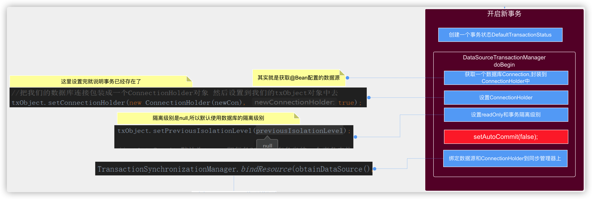

到这里，如果不存在嵌套事务的话  事务的主要逻辑代码就是这些。

### 3.6 嵌套的事务逻辑

> **注意**
>
> 要触发嵌套事务 如果是调用本类的方法一定要保证  将动态代理暴露在线程中：`@EnableAspectJAutoProxy(exposeProxy = true)`，通过当前线程代理调用才能触发本类方法的调用：`((PayService)AopContext.currentProxy()).updateProductStore(1);`

在pay方法基础上加入嵌套事务方法： 

```java
public void pay(String accountId, double money) {
    // 更新余额
     int retVal = accountInfoDao.updateAccountBlance(accountId,money);

    ((PayService)AopContext.currentProxy()).updateProductStore(1);
    System.out.println(1/0);
}
```

我们就从嵌套方法第5行开始跟踪调试：

```java
((PayService)AopContext.currentProxy()).updateProductStore(1);
```

同样也会来到：

```bash
org.springframework.transaction.interceptor.TransactionAspectSupport#invokeWithinTransaction
org.springframework.transaction.interceptor.TransactionAspectSupport#createTransactionIfNecessary
org.springframework.transaction.support.AbstractPlatformTransactionManager#getTransaction
```

```java
@Override
public final TransactionStatus getTransaction(@Nullable TransactionDefinition definition) throws TransactionException {
   // 尝试获取一个事务对象
   Object transaction = doGetTransaction();

   // Cache debug flag to avoid repeated checks.
   boolean debugEnabled = logger.isDebugEnabled();

   /**
    * 判断从上一个方法传递进来的事务属性是不是为空
    */
   if (definition == null) {

      definition = new DefaultTransactionDefinition();
   }

   /**
    * 判断是不是已经存在了事务对象（事务嵌套）
    */
   if (isExistingTransaction(transaction)) {
      // 处理存在的事务
      return handleExistingTransaction(definition, transaction, debugEnabled);
   }
   
    ...省略
}
```

- doGetTransaction  将能获得 ConnectionHolder，因为顶层事务在开启事务时已经存储。已经存在事务意味着什么不用我说了吧

- `if (isExistingTransaction(transaction)) {`

- - 成立！因为事务ConnectionHolder已经存在，并且已经激活（在doBegin中激活的）。执行嵌套事务handleExistingTransaction

#### handleExistingTransaction执行嵌套事务

```java
private TransactionStatus handleExistingTransaction(
      TransactionDefinition definition, Object transaction, boolean debugEnabled)
      throws TransactionException {

   /**
    * NEVER 存在外部事务：抛出异常
    */
   if (definition.getPropagationBehavior() == TransactionDefinition.PROPAGATION_NEVER) {
      throw new IllegalTransactionStateException(
            "Existing transaction found for transaction marked with propagation 'never'");
   }

   /**
    * NOT_SUPPORTED 存在外部事务：挂起外部事务
    */
   if (definition.getPropagationBehavior() == TransactionDefinition.PROPAGATION_NOT_SUPPORTED) {
      if (debugEnabled) {
         logger.debug("Suspending current transaction");
      }
      // 挂起存在的事物
      Object suspendedResources = suspend(transaction);
      boolean newSynchronization = (getTransactionSynchronization() == SYNCHRONIZATION_ALWAYS);
      // 创建一个新的非事物状态（保存了上一个存在事物状态的属性）
      return prepareTransactionStatus(
            definition, null, false, newSynchronization, debugEnabled, suspendedResources);
   }

   /**
    * REQUIRES_NEW 存在外部事务：挂起外部事务，创建新的事务
    */
   if (definition.getPropagationBehavior() == TransactionDefinition.PROPAGATION_REQUIRES_NEW) {
      if (debugEnabled) {
         logger.debug("Suspending current transaction, creating new transaction with name [" +
               definition.getName() + "]");
      }
      // 挂起已经存在的事物
      SuspendedResourcesHolder suspendedResources = suspend(transaction);
      try {
         // 是否需要新开启同步
         boolean newSynchronization = (getTransactionSynchronization() != SYNCHRONIZATION_NEVER);
         // 创建一个新的事物状态(包含了挂起的事务的属性)
         DefaultTransactionStatus status = newTransactionStatus(
               definition, transaction, true, newSynchronization, debugEnabled, suspendedResources);
         // 开启新的事物
         doBegin(transaction, definition);
         // 把新的事物状态设置到当前的线程变量中去
         prepareSynchronization(status, definition);
         return status;
      }
      catch (RuntimeException | Error beginEx) {
         resumeAfterBeginException(transaction, suspendedResources, beginEx);
         throw beginEx;
      }
   }

   /**
    * NESTED 存在外部事务：融合到外部事务中，应用层面和REQUIRED一样，源码层面
    */
   if (definition.getPropagationBehavior() == TransactionDefinition.PROPAGATION_NESTED) {
      if (!isNestedTransactionAllowed()) {
         throw new NestedTransactionNotSupportedException(
               "Transaction manager does not allow nested transactions by default - " +
               "specify 'nestedTransactionAllowed' property with value 'true'");
      }
      if (debugEnabled) {
         logger.debug("Creating nested transaction with name [" + definition.getName() + "]");
      }
      // 是否支持保存点：非JTA事务走这个分支。AbstractPlatformTransactionManager默认是true
      // JtaTransactionManager复写了该方法false，DataSourceTransactionManager没有复写，还是true,
      if (useSavepointForNestedTransaction()) {
         // 开启一个新的事物
         DefaultTransactionStatus status =
               prepareTransactionStatus(definition, transaction, false, false, debugEnabled, null);
         // 为事物设置一个回退点
         // savepoint 可以在一组事务中，设置一个回滚点，点以上的不受影响，点以下的回滚。（外层影响内层， 内层不会影响外层）
         status.createAndHoldSavepoint();
         return status;
      }
      else { // JTA事务走这个分支，创建新事务
         boolean newSynchronization = (getTransactionSynchronization() != SYNCHRONIZATION_NEVER);
         DefaultTransactionStatus status = newTransactionStatus(
               definition, transaction, true, newSynchronization, debugEnabled, null);
         doBegin(transaction, definition);
         prepareSynchronization(status, definition);
         return status;
      }
   }

   // Assumably PROPAGATION_SUPPORTS or PROPAGATION_REQUIRED.
   if (debugEnabled) {
      logger.debug("Participating in existing transaction");
   }
   if (isValidateExistingTransaction()) {
      if (definition.getIsolationLevel() != TransactionDefinition.ISOLATION_DEFAULT) {
         Integer currentIsolationLevel = TransactionSynchronizationManager.getCurrentTransactionIsolationLevel();
         if (currentIsolationLevel == null || currentIsolationLevel != definition.getIsolationLevel()) {
            Constants isoConstants = DefaultTransactionDefinition.constants;
            throw new IllegalTransactionStateException("Participating transaction with definition [" +
                  definition + "] specifies isolation level which is incompatible with existing transaction: " +
                  (currentIsolationLevel != null ?
                        isoConstants.toCode(currentIsolationLevel, DefaultTransactionDefinition.PREFIX_ISOLATION) :
                        "(unknown)"));
         }
      }
      if (!definition.isReadOnly()) {
         if (TransactionSynchronizationManager.isCurrentTransactionReadOnly()) {
            throw new IllegalTransactionStateException("Participating transaction with definition [" +
                  definition + "] is not marked as read-only but existing transaction is");
         }
      }
   }
   boolean newSynchronization = (getTransactionSynchronization() != SYNCHRONIZATION_NEVER);
   return prepareTransactionStatus(definition, transaction, false, newSynchronization, debugEnabled, null);
}
```

##### 关键点

- 根据事务传播行为作处理：

| 事务传播行为类型 | 外部不存在事务 | 外部存在事务                                                 | 使用方式                                                     |
| ---------------- | -------------- | ------------------------------------------------------------ | ------------------------------------------------------------ |
| REQUIRED（默认） | 开启新的事务   | 融合到外部事务中                                             | `@Transactional(propagation = Propagation.REQUIRED)` 适用增删改查 |
| SUPPORTS         | 不开启新的事务 | 融合到外部事务中                                             | `@Transactional(propagation = Propagation.SUPPORTS)` 适用查询 |
| REQUIRES_NEW     | 开启新的事务   | 挂起外部事务，创建新的事务                                   | `@Transactional(propagation = Propagation.REQUIRES_NEW)` 适用内部事务和外部事务不存在业务关联情况，如日志 |
| NOT_SUPPORTED    | 不开启新的事务 | 挂起外部事务                                                 | `@Transactional(propagation = Propagation.NOT_SUPPORTED)` 不常用 |
| NEVER            | 不开启新的事务 | 抛出异常                                                     | `@Transactional(propagation = Propagation.NEVER)` 不常用     |
| MANDATORY        | 抛出异常       | 融合到外部事务中                                             | `@Transactional(propagation = Propagation.MANDATORY)` 不常用 |
| NESTED           | 开启新的事务   | 融合到外部事务中，SavePoint机制，外层影响内层， 内层不会影响外层 | `@Transactional(propagation = Propagation.NESTED)` 不常用    |

###### PROPAGATION_NEVER  抛出异常

当事务传播行为是MANDATORY ，外部存在事务抛出异常： 所以这里直接抛出异常

###### PROPAGATION_NOT_SUPPORTED 挂起外部事务，不开启事务提交

- `suspend(transaction);` 挂起当前顶层事务，怎么挂呢？ 其实就是将线程变量里面的事务信息拿出来，再置空。 待事务提交或回滚后再放回线程变量中

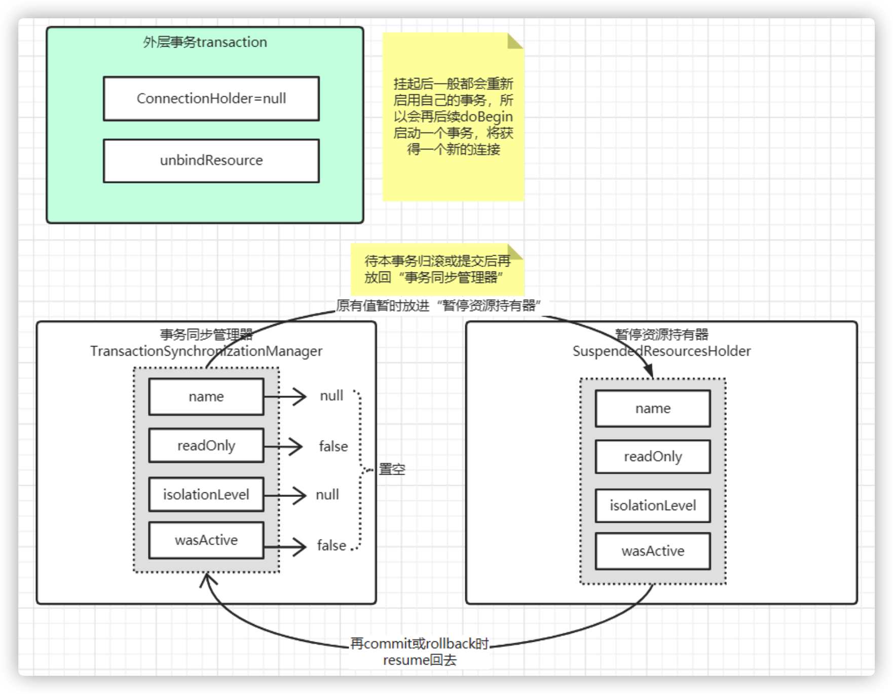

- newSynchronization   允许开启同步事务  

- newTransactionStatus  构造事务状态对象, 并且把事务的信息封装进去：

1. - definition,    事务的属性
    - transaction,   null    因为它不开启事务
    - false,     不是新事务
    - suspendedResources   挂起的事务对象，在事务提交或回滚后会调用重新放回线程变量中

- `prepareSynchronization(status, definition);` 把当前的事务信息绑定到线程变量去:   为什么要绑定要线程变量呢？  因为存在嵌套事务情况下需要用到

###### PROPAGATION_REQUIRES_NEW 挂起外部事务，创建新的事务

- `suspend(null);` 挂起当前顶层事务，怎么挂呢？ 其实就是将线程变量里面的事务信息拿出来，再置空。 待事务提交或回滚后再放回线程变量中
- newSynchronization   允许开启同步事务
- newTransactionStatus  构造事务状态对象, 并且把事务的信息封装进去
    - definition，事务的属性
    - transaction，事务的对象
    - true，代表是一个新的事务
    - suspendedResources，挂起的事务对象，在事务提交或回滚后会调用重新放回线程变量中

-  `doBegin(transaction, definition);`    开启一个新事务， 这里跟进去看下怎么开启的
- `prepareSynchronization(status, definition);`

1. - 把当前的事务信息绑定到线程变量去：为什么要绑定要线程变量呢？因为存在嵌套事务情况下需要用到

###### PROPAGATION_NESTED 融合到外部事务中，SavePoint机制，外层影响内层， 内层不会影响外层

- 这个不做过多介绍，  去了解一下jdbc的Savepoint自然就懂了

###### return prepareTransactionStatus(definition, transaction, false, newSynchronization, debugEnabled, null);

- definition，原事务的属性
- transaction，原事务的对象
- `newTransaction:false` 代表**不**是一个新的事务,如果不是新事务，提交事务时：由外层事务控制统一提交事务

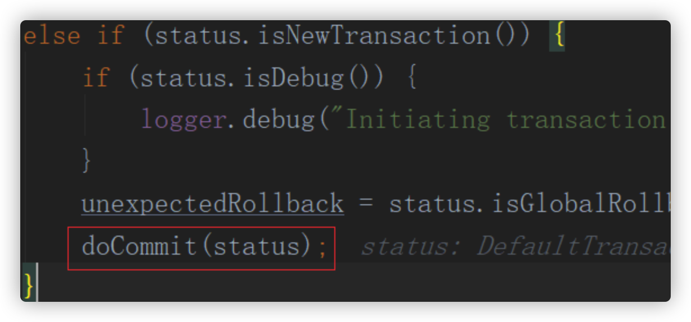

所以最终返回一个DefaultTransactionStatus， 后续回滚、提交都可以根据改对象进行控制。回滚提交逻辑比较简单不在这里重复了

#### 问题

简述Spring事务的原理机制。

描述事务的各传播机制及原理。