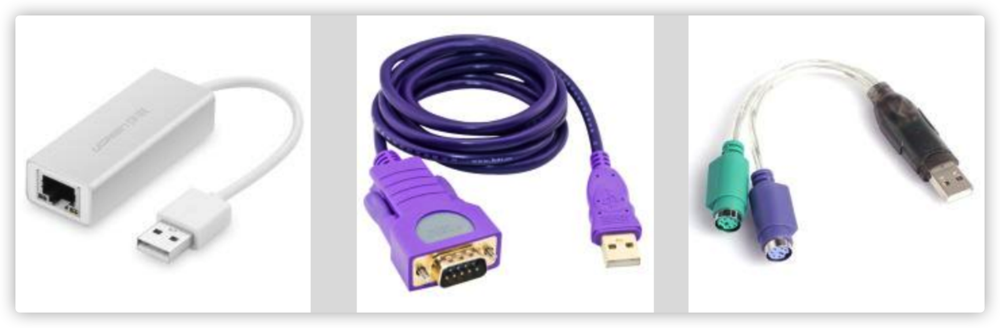

# SpringMVC源码

## 1. MVC模型的由来

### 1.1 Model1 **模型**

Model1 模型是很早以前项目开发的一种常见模型，项目主要由 jsp 和 JavaBean 两部分组成。它的优点是：结构简单。开发小型项目时效率高。缺点也同样明显：

- JSP 的职责兼顾于展示数据和处理数据（也就是干了控制器和视图的事）
- 所有逻辑代码都是写在 JSP 中的，导致代码重用性很低。
- 由于展示数据的代码和部分的业务代码交织在一起，维护非常不便。

所以，结论是此种设计模型已经被淘汰没人使用了。


在Model 1模式下，整个Web应用几乎全部由JSP页面组成，JSP页面接收处理客户端请求，对请求处理后直接做出响应。用少量的JavaBean来处理数据库连接、数据库访问等操作。 

### 1.2 Model2模型

Model2 模型是在 Model1 的基础上进行改良，它是 MVC 模型的一个经典应用。它把处理请求和展示数据进行分离，让每个部分各司其职。

此时的 JSP 已经就是纯粹的展示数据了，而处理请求的事情交由控制器来完成，使每个组件充分独立，提高了代码可重用性和易维护性。下图展示的就是 Model2 模型：


Model 2是基于MVC架构的设计模式。在Model 2架构中，Servlet作为前端控制器，负责接收客户端发送的请求。在Servlet中只包含控制逻辑和简单的前端处理；后端JavaBean来完成实际的逻辑处理；最后，转发到相应的JSP页面处理显示逻辑。Model 2具有组件化的特点，更适用于大规模应用的开发。


## 2. 基于MVC模型框架之：SpringMVC

### 2.1 SpringMVC的执行过程分析


总结：

- 前端控制器DispatcherServlet 由框架提供

    作用：接收请求，处理响应结果

- 处理器映射器HandlerMapping由框架提供

    作用：根据请求URL，找到对应的Handler

- 处理器适配器HandlerAdapter由框架提供

    作用：调用处理器（Handler|Controller）的方法

- 处理器Handler又名Controller,后端处理器

    作用：接收用户请求数据，调用业务方法处理请求

- 视图解析器ViewResolver由框架提供

    作用：视图解析，把逻辑视图名称解析成真正的物理视图。支持多种视图技术：JSTLView,FreeMarker...

- 视图View,程序员开发

    作用：将数据展现给用户

### 2.2 SpringMVC中三大组件详解

#### 处理器映射器

**HandlerMapping** 是在 Spring 的 3.1 版本之后加入的。它的出现，可以让使用者更加轻松的去配置 SpringMVC 的请求路径映射。去掉了早期繁琐的 xml 的配置。它的配置有两种方式：都是在 springmvc.xml 中加入配置。

- 方式一

```xml
<bean class="org.springframework.web.servlet.mvc.method.annotation.RequestMappingHandlerMapping"/>
```

- 方式二

```xml
<mvc:annotation-driven></mvc:annotation-driven>
```

#### 处理器适配器

要清晰的认识 SpringMVC 的处理器适配器，就先必须知道适配器以及它的作用。我们先通过下图，直观的了解一下：



通过上面三张图，我们可以直观的感受到，它是把不同的接口都转换成了 USB 接口。

代入到我们 SpringMVC 中，就是把不同的控制器，最终都可以看成是适配器类型，从而执行适配器中定义的方法。更深层次的是，我们可以把公共的功能都定义在适配器中，从而减少每种控制器中都有的重复性代码。

学习了SpringMVC 的执行过程，最终调用的是前端控制器 DispatcherServlet 的 doDispatch 方法，而该方法中的 HandlerAdapter 的 handle 方法实际调用了我们自己写的控制器方法。而我们写的控制方法名称各不一样，它是通过 handle 方法反射调用的。但是我们不知道的是，其实 SpringMVC 中处理器适配器也有多个。

#### HandlerAdapter详解

这里Spring mvc 采用适配器模式来适配调用指定Handler，根据Handler的不同种类采用不同的Adapter，其Handler与 HandlerAdapter 对应关系如下：

| Handler类别        | 对应适配器                     | 描述                                               |
| ------------------ | ------------------------------ | -------------------------------------------------- |
| Controller         | SimpleControllerHandlerAdapter | 标准控制器，返回ModelAndView                       |
| HttpRequestHandler | HttpRequestHandlerAdapter      | 业务自行处理 请求，不需要通过modelAndView 转到视图 |
| Servlet            | SimpleServletHandlerAdapter    | 基于标准的servlet 处理                             |
| HandlerMethod      | RequestMappingHandlerAdapter   | 基于@requestMapping对应方法处理                    |

##### org.springframework.web.servlet.mvc.SimpleControllerHandlerAdapter

使用此适配器，适用的控制器写法：要求实现 Controller 接口

```java
public class HelloController2 implements Controller {
  @Override
  public ModelAndView handleRequest(HttpServletRequest httpServletRequest, 
                                    HttpServletResponse httpServletResponse) 
    		throws Exception {
    ModelAndView mv = new ModelAndView();
    mv.setViewName("success");
    return mv;
  } 
}
```

同时要求我们在 springmvc.xml 中添加：

```xml
<bean id="simpleControllerHandlerAdapter " class="org.springframework.web.servlet.mvc.SimpleControllerHandlerAdapter"></bean> 
<bean name="/sayhello2" class="com.itheima.web.controller.HelloController2"></bean>
```

##### org.springframework.web.servlet.mvc.HttpRequestHandlerAdapter

使用此适配器的控制器写法：要求实现 HttpRequestHandler 接口

```java
public class HelloController3 implements HttpRequestHandler {
  @Override
  public void handleRequest(HttpServletRequest request, HttpServletResponse response) 
    		throws ServletException, IOException {
         request.getRequestDispatcher("/WEB-INF/pages/success.jsp")
           			.forward(request,response);
     } 
}
```

同时要求我们在 springmvc.xml 中添加：

```xml
<bean name="/sayhello3" class="com.itheima.web.controller.HelloController3"></bean> 
<bean id=" httpRequestHandlerAdapter" class="org.springframework.web.servlet.mvc.HttpRequestHandlerAdapter"></bean>
```

##### org.springframework.web.servlet.mvc.method.annotation.RequestMappingHandlerAdapter

这种方式也是我们实际开发中采用最多的。它的要求是我们用注解 `@Controller` 配置控制器

```java
@Controller
public class HelloControler {

  @RequestMapping("hello")
  public String sayHello() {
    System.out.println("控制器方法执行了");
    return "success";
  } 
}
```

同时要求我们在 springmvc.xml 中配置：

```xml
<bean id="requestMappingHandlerAdapter" class="org.springframework.web.servlet.mvc.method.annotation.RequestMappingHandlerAdapter"></bean>
```

不过通常情况下我们都是直接配置: 

```xml
<mvc:annotation-driven></mvc:annotation-driven>
```

#### **视图解析器**

首先，我们得先了解一下 SpringMVC 中的视图。视图的作用是渲染模型数据，将模型里的数据以某种形式呈现给客户。为了实现视图模型和具体实现技术的解耦，Spring 在 `org.springframework.web.servlet` 包中定义了一个高度抽象的 View 接口。

我们的视图是无状态的，所以他们不会有线程安全的问题。无状态是指对于每一个请求，都会创建一个 View对象。在 SpringMVC 中常用的视图类型：

| **分类**        | **视图类型**                                                 | **说明**                                                     |
| --------------- | ------------------------------------------------------------ | ------------------------------------------------------------ |
| URL 视图        | InternalResourceView                                         | 将 JSP 或者其他资源封装成一个视图，是InternaleResourceViewResolver默认使用的视图类型。 |
| JstlView        | 它是当我们在页面中使用了 JSTL 标签库的国际化标签后，需要采用的类型。 |                                                              |
| 文档类视图      | AbstractPdfView                                              | PDF 文档视图的抽象类                                         |
| AbstarctXlsView | Excel 文档视图的抽象类，该类是4.2版本之后才有的。之前使用的是AbstractExcelView。 |                                                              |
| JSON 视图       | MappingJackson2JsonView                                      | 将模型数据封装成Json格式数据输出。它需要借助 Jackson 开源框架。 |
| XML 视图        | MappingJackson2XmlView                                       | 将模型数据封装成 XML 格式数据。它是从 4.1 版本之后才加入的。 |

接下来就是了解视图解析器的作用。View Resolver 负责将处理结果生成 View 视图，View Resolver 首先根据逻辑视图名解析成物理视图名即具体的页面地址，再生成View视图对象，最后对View进行渲染将处理结果通过页面展示给用户。视图对象是由视图解析器负责实例化。

视图解析器的作用是将逻辑视图转为物理视图，所有的视图解析器都必须实现 ViewResolver 接口。SpringMVC 为逻辑视图名的解析提供了不同的策略，可以在 Spring WEB 上下文中配置一种或多种解析策略，并指定他们之间的先后顺序。每一种映射策略对应一个具体的视图解析器实现类。程序员可以选择一种视图解析器或混用多种视图解析器。可以通过 order 属性指定解析器的优先顺序，order 越小优先级越高，SpringMVC 会按视图解析器顺序的优先顺序对逻辑视图名进行解析，直到解析成功并返回视图对象，否则抛出 ServletException异常。

| **分类**           | **解析器类型**               | **说明**                                                     |
| ------------------ | ---------------------------- | ------------------------------------------------------------ |
| 解析为 Bean 的名称 | BeanNameViewResolver         | Bean 的 id 即为逻辑视图名称。                                |
| 解析为 URL 文件    | InternalResourceViewResolver | 将视图名解析成一个 URL 文件，一般就是一个 jsp 或者 html 文件。文件一般都存放在 WEB-INF 目录中。 |
| 解析指定 XML 文件  | XmlViewResolver              | 解析指定位置的 XML 文件，默认在 /WEB-INF/views.xml           |
| 解析指定属性文件   | ResourceBundleViewResolver   | 解析 properties 文件。                                       |

#### 不需要视图解析器的场景分析

在分析之前，我们先需要回顾下控制器方法的返回值，此处我们都是以注解 `@Controller` 配置控制器为例，控制器的方法返回值其实支持三种方式：

- String 类型。借助视图解析器，可以在指定位置为我们找到指定扩展名的视图。视图可以是 JSP，HTML 或者其他的控制器方法上的 RequestMapping 映射地址。前往指定视图的方式，默认是请求转发，可以通过redirect:前缀控制其使用重定向。

- void，即没有返回值。因为我们在控制器方法的参数中可以直接使用原始 SerlvetAPI 对象HttpServletRequest 和 HttpServletResponse 对象，所以无论是转发还是重定向都可以轻松实现，而无需使用返回值。

- ModelAndView 类型。其实我们跟踪源码可以发现在 DispatcherServlet 中的 doDispatch 方法执行时，HandlerAdapter 的 handle 方法的返回值就是 ModelAndView，只有我们的控制器方法定义为 void时，才不会返回此类型。当返回值是 String 的时候也会创建 ModelAndView 并返回。

通过上面三种控制器方法返回值，我们可以再深入的剖析一下我们请求之后接收响应的方式，其实无外乎就三种。

- 请求转发

- 重定向

- 直接使用 Response 对象获取流对象输入。可以是字节流也可以是字符流。

接下来我们就分析，这三种方式的本质区别。其中请求转发和重定向的区别相信大家已经很熟悉了。但是它们的共同点呢？就是都会引发页面的跳转。在我们的实际开发中，如果我们不需要页面跳转，即基于 ajax 的异步请求，用 json 数据交互时，即可不配置任何视图解析器。前后端交互是通过 json 数据的，利用 `@RequestBody`  和`@ResponseBody` 实现数据到 java对象的绑定（当然还要借助类似 Jackson 开源框架）。

#### 请求参数封装的实现原理

在使用 SpringMVC 实现请求参数封装时，它支持基本类型，POJO 类型和集合类型。其封装原理其实就是使用我们原始的 ServletAPI 中的方法，并且配合反射实现的封装。此处我们以最简单的 String 和 Integer 两个方法为例，带着大家把整个执行过程走一圈。

先来看控制器的方法：

```java
@Controller
public class HelloControler {

  @RequestMapping("hello")
  public String sayHello(String name,Integer age) {
    System.out.println("控制器方法执行了" + name + "," + age);
    return "success"; 
  } 
}
```

#### 常用注解的使用场景及实现思路分析

##### RequestParam

首先我们要明确，我们的请求参数体现形式是什么样的。 

在请求体的 MIME 类型为 `application/x-www-form-urlencoded` 或者 `application/json` 的情况下，无论 get/post/put/delete 请求方式，参数的体现形式都是 key=value。再来，通过上一小节我们知道，SpringMVC 是使用我们控制器方法的形参作为参数名称，再使用 request 的 getParameterValues 方法获取的参数。所以才会有请求参数的 key 必须和方法形参变量名称保持一致的要求。但是如果形参变量名称和请求参数的 key 不一致呢？此时，参数将无法封装成功。此时 RequestParam 注解就会起到作用，它会把该注解 value 属性的值作为请求参数的 key 来获取请求参数的值，并传递给控制器方法。

```java
@Controller
public class ParamController1 {
  /**
  * 处理请求的控制器方法
  * @return
  */
  @RequestMapping("hello")
  public String sayHello(@RequestParam("username") String name, Integer age) {

    System.out.println("控制器方法执行了" + name + "," + age);
    return "success"; 
  }
}
```

##### RequestBody

我们通过源码分析得知，SpringMVC 在封装请求参数的时候，默认只会获取参数的值，而不会把参数名称一同获取出来，这在我们使用表单提交的时候没有任何问题。因为我们的表单提交，请求参数是 key=value 的。但是当我们使用 ajax 进行提交时，请求参数可能是 json 格式的：`{key: value}`，在此种情况下，要想实现封装以我们前面的内容是无法实现的。此时需要我们使用 `@RequestBody` 注解。

JSP代码片段：

```html
<script src="${pageContext.request.contextPath}/js/jquery.min.js"></script> 
<script type="text/javascript">
  $(function(){
    $("#ajaxBtn").click(function() {
      $.ajax({
        type:"POST",
        url:"${pageContext.request.contextPath}/hello2",
        dataType:"text",
        data:"{'name':'test','age':18}",
        contentType:"application/json",
        success:function(data){
          alert(data);
        }
      });
    });
  })
</script> 
<title>SpringMVC</title>
</head> 
<body> 
	<button id="ajaxBtn">异步请求</button>
</body>
```

控制器代码片段：

```java
@Controller
public class ParamController {

  /**
  * 处理请求的控制器方法
  * @return
  */
  @RequestMapping("hello2")
  public String sayHello2(@RequestBody String body) {
		System.out.println("控制器方法执行了 2"+body);
		return "success"; 
  } 
}
```

##### PathVariable

它是 SpringMVC 在 3.0 之后新加入的一个注解，是 SpringMVC 支持 Restful 风格 URL 的一个重要标志。该注解的作用大家已经非常熟悉了，就是把藏在请求 URL 中的参数，给我们控制器方法的形参赋值。而Restful风格的 URL，在现如今的开发中使用越来越普遍了。那么它是如何实现封装的呢？请看下图：


首先还是执行到红框中解析参数这行代码，我们看出 SpringMVC 在实现请求 URL 使用占位符传参并封装到控制器方法的形参中，是通过请求域来实现的。最后把请求域转成一个 Map，再根据形参的名称作为 key，从 map 中获取 value，并给形参赋值。当然如果我们使用了 PathVariable 注解的 value 属性，则不会以形参名称为 key，而是直接使用 value属性的值作为 key 了。

#### 拦截器的AOP思想

AOP 思想是 Spring 框架的两大核心之一，是解决方法调用依赖以及提高方便后期代码维护的重要思想。它是把我们代码中高度重复的部分抽取出来，并在适当的时机，通过代理机制来执行，从而做到不修改源码对已经写好的方法进行增强。而拦截器正式这种思想的具体实现。

拦截器代码：

```java
public class MyInterceptor1 implements HandlerInterceptor{

  @Override
  public boolean preHandle(HttpServletRequest request, 
                           HttpServletResponse response, 
                           Object handler) throws Exception {
  	System.out.println("拦截器执行了");
  	return false; 
  }

  @Override
  public void postHandle(HttpServletRequest request, 
                         HttpServletResponse response, 
                         Object handler,
                         ModelAndView modelAndView) throws Exception {
  	System.out.println("执行了 postHandle 方法");
  }

  @Override
  public void afterCompletion(HttpServletRequest request, 
                              HttpServletResponse response, 
                              Object handler, 
                              Exception ex) throws Exception {
  	System.out.println("执行了 afterCompletion 方法");
  } 
}
```

#### 自定义拦截器中三个方法说明及使用场景

##### preHandle

此方法的执行时机是在控制器方法执行之前，所以我们通常是使用此方法对请求部分进行增强。同时由于结果视图还没有创建生成，所以此时我们可以指定响应的视图。

##### postHandle

此方法的执行时机是在控制器方法执行之后，结果视图创建生成之前。所以通常是使用此方法对响应部分进行增强。因为结果视图没有生成，所以我们此时仍然可以控制响应结果。

##### afterCompletion

此方法的执行时机是在结果视图创建生成之后，展示到浏览器之前。所以此方法执行时，本次请求要准备的数据具已生成完毕，且结果视图也已创建完成，所以我们可以利用此方法进行清理操作。同时，我们也无法控制响应结果集内容。

### 2.3 为什么不使用XML配置SpringMVC

#### 我们先来看基于XML的SpringMVC配置：

- 配置 web.xml

- 编写控制器

- 编写 springmvc.xml

- 配置控制器

- 配置处理器映射器，处理器适配器。

- 配置视图解析器。

其中，前3步和第6步基于注解配置时也都有，而第4、5步注解配置只需：

```xml
<!-- 开启 springmvc 对注解的支持 -->
<mvc:annotation-driven></mvc:annotation-driven>
<!-- XML 配置则需： -->
<!-- 实现 Controller 接口 -->
<bean class="org.springframework.web.servlet.mvc.SimpleControllerHandlerAdapter"/> 
<bean name="/sayhello2" class="com.itheima.web.controller.HelloController2"/>
<!-- 继承 HttpRequestHandler 类 --> 
<bean name="/sayhello3" class="com.itheima.web.controller.HelloController3"/> 
<bean class="org.springframework.web.servlet.mvc.HttpRequestHandlerAdapter"/>
```

而对比注解配置只需一个 Controller 注解和一个 RequestMapping 注解来比，显然注解来的更方便。

#### `mvc:annotation-driven`的说明

它就相当于在 xml 中配置了：

```xml
<!-- Begin -->

<!-- HandlerMapping --> 
<bean class="org.springframework.web.servlet.mvc.method.annotation.RequestMappingHandlerMapping"></bean> 
<bean class="org.springframework.web.servlet.handler.BeanNameUrlHandlerMapping"></bean>

<!-- HandlerAdapter --> 
<bean class="org.springframework.web.servlet.mvc.method.annotation.RequestMappingHandlerAdapter"></bean> 
<bean class="org.springframework.web.servlet.mvc.HttpRequestHandlerAdapter"></bean> 
<bean class="org.springframework.web.servlet.mvc.SimpleControllerHandlerAdapter"></bean>

<!-- HadnlerExceptionResolvers --> 
<bean class="org.springframework.web.servlet.mvc.method.annotation.ExceptionHandlerExceptionResolver"></bean> 
<bean class="org.springframework.web.servlet.mvc.annotation.ResponseStatusExceptionResolver"></bean> 
<bean class="org.springframework.web.servlet.mvc.support.DefaultHandlerExceptionResolver"></bean>

<!-- End --> 
```


## 3. Spring整合SpringMVC注意事项

Bean 被创建两次 ？ 

Spring 的 IOC 容器不应该扫描 SpringMVC 中的 bean，对应的SpringMVC 的 IOC 容器不应该扫描 Spring 中的 bean

```xml
<context:component-scan base-package="com.baiqi.springmvc" use-default-filters="false">  
 <context:include-filter 
   type="annotation" expression="org.springframework.stereotype.Controller"/>
 <context:include-filter 
   type="annotation" expression="org.springframework.web.bind.annotation.ControllerAdvice"/>
</context:component-scan>
```

```xml
<context:component-scan base-package="com.baiqi.springmvc">  
 <context:exclude-filter 
   type="annotation" expression="org.springframework.stereotype.Controller"/>
 <context:exclude-filter
   type="annotation" expression="org.springframework.web.bind.annotation.ControllerAdvice"/>
 </context:component-scan>
```


## 4. 在SpringMVC配置文件中引用业务层的Bean

- 多个 Spring IOC 容器之间可以设置为父子关系，以实现良好的解耦。

- SpringMVC WEB 层容器可作为 “业务层” Spring 容器的子容器：即 WEB 层容器可以引用业务层容器的 Bean，而业务层容器却访问不到 WEB 层容器的 Bean

