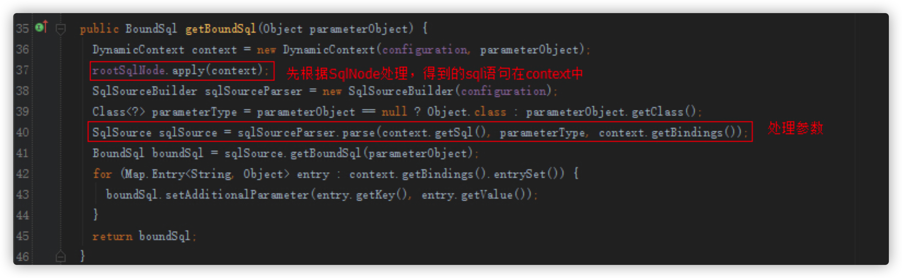

# Mybatis源码

## 1. Mybatis解析全局配置文件

### 1.1 传统JDBC和Mybatis相比的弊病

#### 传统JDBC

```java
@Test
public  void test() throws SQLException {
    Connection conn = null;
    PreparedStatement pstmt = null;
    try {
        // 1.加载驱动
        Class.forName("com.mysql.jdbc.Driver");

        // 2.创建连接
        conn = DriverManager.
                getConnection("jdbc:mysql://localhost:3306/mybatis_example", "root", "123456");

        // SQL语句
        String sql = "select id,user_name,create_time from t_user where id=?";

        // 获得sql执行者
        pstmt = conn.prepareStatement(sql);
        pstmt.setInt(1,1);

        // 执行查询
        //ResultSet rs= pstmt.executeQuery();
        pstmt.execute();
        ResultSet rs = pstmt.getResultSet();

        rs.next();
        User user = new User();
        user.setId(rs.getLong("id"));
        user.setUserName(rs.getString("user_name"));
        user.setCreateTime(rs.getDate("create_time"));
        System.out.println(user.toString());
    } catch (Exception e) {
        e.printStackTrace();
    }
    finally{
        // 关闭资源
        try {
            if(conn != null){
                conn.close();
            }
            if(pstmt != null){
                pstmt.close();
            }
        } catch (SQLException e) {
            e.printStackTrace();
        }
    }
}
```

##### 传统JDBC的问题

- 数据库连接创建，释放频繁造成西戎资源的浪费，从而影响系统性能，使用数据库连接池可以解决问题。

- sql语句在代码中硬编码，造成代码的不已维护，实际应用中sql的变化可能较大，sql代码和java代码没有分离开来维护不方便。

- 使用preparedStatement向有占位符传递参数存在硬编码问题因为sql中的where子句的条件不确定，同样是修改不方便

- 对结果集中解析存在硬编码问题，sql的变化导致解析代码的变化，系统维护不方便。

#### mybatis对传统的JDBC的解决方案

- 数据库连接创建、释放频繁造成系统资源浪费从而影响系统性能，如果使用数据库连接池可解决此问题。

    解决：在SqlMapConfig.xml中配置数据连接池，使用连接池管理数据库链接。

- Sql语句写在代码中造成代码不易维护，实际应用sql变化的可能较大，sql变动需要改变java代码。

    解决：将Sql语句配置在XXXXmapper.xml文件中与java代码分离。

- 向sql语句传参数麻烦，因为sql语句的where条件不一定，可能多也可能少，占位符需要和参数一一对应。

    解决：Mybatis自动将java对象映射至sql语句，通过statement中的parameterType定义输入参数的类型。

- 对结果集解析麻烦，sql变化导致解析代码变化，且解析前需要遍历，如果能将数据库记录封装成pojo对象解析比较方便。

    解决：Mybatis自动将sql执行结果映射至java对象，通过statement中的resultType定义输出结果的类型。

### 1.2 Mybatis简单介绍

MyBatis是一个持久层的ORM框架，使用简单，学习成本较低。可以执行自己手写的SQL语句，比较灵活。但是MyBatis的自动化程度不高，移植性也不高，有时从一个数据库迁移到另外一个数据库的时候需要自己修改配置，所以称只为半自动ORM框架

> **MyBaits基础应用**：http://note.youdao.com/noteshare?id=5d41fd41d970f1af9185ea2ec0647b64

#### Mybatis体系


Mybatis架构分为三层：

- **API接口层**：提供给外部使用的接口API，开发人员通过这些本地API来草种数据层。接口层一接手到调用请求，就会调用数据处理层来完成具体的数据处理；
- **数据处理层**：负责具体的SQL查找、SQL解析、SQL执行和执行结果映射处理等。它主要的目的是根据调用的请求完成一次数据库操作；
- **基础支撑层**：负责最基础的功能支撑，包括连接管理、事务管理、配置加载和缓存处理，这些都是共用的东西，将他们抽取出来作为最基础的组建，为上层的数据处理提供最基础的支撑。

一个Mybatis最简单的使用例子：

```java
public class App {
    public static void main(String[] args) {
        String resource = "mybatis-config.xml";
        Reader reader;
        try {
            // 将XML配置文件构建为Configuration配置类
            reader = Resources.getResourceAsReader(resource);
            // 通过加载配置文件流构建一个SqlSessionFactory  DefaultSqlSessionFactory
            SqlSessionFactory sqlMapper = new SqlSessionFactoryBuilder().build(reader);
            // 数据源 执行器  DefaultSqlSession
            SqlSession session = sqlMapper.openSession();
            try {
                // 执行查询 底层执行jdbc
                // User user = (User)session.selectOne("com.tuling.mapper.selectById", 1);
                UserMapper mapper = session.getMapper(UserMapper.class);
                System.out.println(mapper.getClass());
                User user = mapper.selectById(1L);
                System.out.println(user.getUserName());
            } catch (Exception e) {
                e.printStackTrace();
            }finally {
                session.close();
            }
        } catch (IOException e) {
            e.printStackTrace();
        }
    }
}
```

总结下就是分为下面四个步骤：

- 从配置文件（通常是XML文件）得到SessionFactory;
- 从SessionFactory得到SqlSession；
- 通过SqlSession进行CRUD和事务的操作；
- 执行完相关操作之后关闭Session。

### 1.3 Mybatis源码编译

> **MyBatis的源码编译**：https://www.cnblogs.com/mokingone/p/9108999.html

### 1.4 启动流程分析

```java
String resource = "mybatis-config.xml";
// 将XML配置文件构建为Configuration配置类
reader = Resources.getResourceAsReader(resource);
// 通过加载配置文件流构建一个SqlSessionFactory  DefaultSqlSessionFactory
SqlSessionFactory sqlMapper = new SqlSessionFactoryBuilder().build(reader);
```

通过上面代码发现，创建SqlSessionFactory的代码在SqlSessionFactoryBuilder中，进去一探究竟：

```java
// 整个过程就是将配置文件解析成Configration对象，然后创建SqlSessionFactory的过程
// Configuration是SqlSessionFactory的一个内部属性
public SqlSessionFactory build(InputStream inputStream, String environment, Properties properties) {
    try {
        XMLConfigBuilder parser = new XMLConfigBuilder(inputStream, environment, properties);
        return build(parser.parse());
    } catch (Exception e) {
        throw ExceptionFactory.wrapException("Error building SqlSession.", e);
    } finally {
        ErrorContext.instance().reset();
        try {
            inputStream.close();
        } catch (IOException e) {
            // Intentionally ignore. Prefer previous error.
        }
    }
}

public SqlSessionFactory build(Configuration config) {
    return new DefaultSqlSessionFactory(config);
}
```

下面看下解析配置文件过程中的一些细节。

先给出一个配置文件的列子：

```xml
<?xml version="1.0" encoding="UTF-8" ?>
<!DOCTYPE configuration PUBLIC "-//mybatis.org//DTD Config 3.0//EN"
        "http://mybatis.org/dtd/mybatis-3-config.dtd">
  
<configuration>
    <!-- SqlSessionFactoryBuilder中配置的配置文件的优先级最高；config.properties配置文件的优先级次之；properties标签中的配置优先级最低 -->
    <properties resource="org/mybatis/example/config.properties">
      <property name="username" value="dev_user"/>
      <property name="password" value="F2Fa3!33TYyg"/>
    </properties>

    <!-- 一些重要的全局配置 -->
    <settings>
    <setting name="cacheEnabled" value="true"/>
    <!--<setting name="lazyLoadingEnabled" value="true"/>-->
    <!--<setting name="multipleResultSetsEnabled" value="true"/>-->
    <!--<setting name="useColumnLabel" value="true"/>-->
    <!--<setting name="useGeneratedKeys" value="false"/>-->
    <!--<setting name="autoMappingBehavior" value="PARTIAL"/>-->
    <!--<setting name="autoMappingUnknownColumnBehavior" value="WARNING"/>-->
    <!--<setting name="defaultExecutorType" value="SIMPLE"/>-->
    <!--<setting name="defaultStatementTimeout" value="25"/>-->
    <!--<setting name="defaultFetchSize" value="100"/>-->
    <!--<setting name="safeRowBoundsEnabled" value="false"/>-->
    <!--<setting name="mapUnderscoreToCamelCase" value="false"/>-->
    <!--<setting name="localCacheScope" value="STATEMENT"/>-->
    <!--<setting name="jdbcTypeForNull" value="OTHER"/>-->
    <!--<setting name="lazyLoadTriggerMethods" value="equals,clone,hashCode,toString"/>-->
    <!--<setting name="logImpl" value="STDOUT_LOGGING" />-->
    </settings>

    <typeAliases>
    </typeAliases>

    <plugins>
        <plugin interceptor="com.github.pagehelper.PageInterceptor">
            <!-- 默认值为 false，当该参数设置为 true 时，如果 pageSize=0 或者 RowBounds.limit = 0 就会查询出全部的结果 -->
            <!-- 果某些查询数据量非常大，不应该允许查出所有数据 -->
            <property name="pageSizeZero" value="true"/>
        </plugin>
    </plugins>

    <environments default="development">
        <environment id="development">
            <transactionManager type="JDBC"/>
            <dataSource type="POOLED">
                <property name="driver" value="com.mysql.jdbc.Driver"/>
                <property name="url" value="jdbc:mysql://10.59.97.10:3308/windty"/>
                <property name="username" value="windty_opr"/>
                <property name="password" value="windty!234"/>
            </dataSource>
        </environment>
    </environments>

    <databaseIdProvider type="DB_VENDOR">
        <property name="MySQL" value="mysql" />
        <property name="Oracle" value="oracle" />
    </databaseIdProvider>

    <mappers>
        <!--这边可以使用package和resource两种方式加载mapper-->
        <!--<package name="包名"/>-->
        <!--<mapper resource="./mappers/SysUserMapper.xml"/>-->
        <mapper resource="./mappers/CbondissuerMapper.xml"/>
    </mappers>
</configuration>
```

下面是解析配置文件的核心方法：

```java
private void parseConfiguration(XNode root) {
    try {
        // issue #117 read properties first
        // 解析properties标签，并set到Configration对象中
        // 在properties配置属性后，在Mybatis的配置文件中就可以使用${key}的形式使用了。
        propertiesElement(root.evalNode("properties"));

        // 解析setting标签的配置
        Properties settings = settingsAsProperties(root.evalNode("settings"));
        // 添加vfs的自定义实现，这个功能不怎么用
        loadCustomVfs(settings);

        // 配置类的别名，配置后就可以用别名来替代全限定名
        // mybatis默认设置了很多别名，参考附录部分
        typeAliasesElement(root.evalNode("typeAliases"));

        // 解析拦截器和拦截器的属性，set到Configration的interceptorChain中
        // MyBatis 允许你在已映射语句执行过程中的某一点进行拦截调用。默认情况下，MyBatis 允许使用插件来拦截的方法调用包括：
        // Executor (update, query, flushStatements, commit, rollback, getTransaction, close, isClosed)
        // ParameterHandler (getParameterObject, setParameters)
        // ResultSetHandler (handleResultSets, handleOutputParameters)
        // StatementHandler (prepare, parameterize, batch, update, query)
        pluginElement(root.evalNode("plugins"));

        // Mybatis创建对象是会使用objectFactory来创建对象，一般情况下不会自己配置这个objectFactory，使用系统默认的objectFactory就好了
        objectFactoryElement(root.evalNode("objectFactory"));
        objectWrapperFactoryElement(root.evalNode("objectWrapperFactory"));
        reflectorFactoryElement(root.evalNode("reflectorFactory"));

        // 设置在setting标签中配置的配置
        settingsElement(settings);

        // 解析环境信息，包括事物管理器和数据源，SqlSessionFactoryBuilder在解析时需要指定环境id，如果不指定的话，会选择默认的环境；
        // 最后将这些信息set到Configration的Environment属性里面
        environmentsElement(root.evalNode("environments"));

        databaseIdProviderElement(root.evalNode("databaseIdProvider"));

        // 无论是 MyBatis 在预处理语句（PreparedStatement）中设置一个参数时，还是从结果集中取出一个值时， 都会用类型处理器将获取的值以合适的方式转换成 Java 类型。解析typeHandler。
        typeHandlerElement(root.evalNode("typeHandlers"));
        // 解析Mapper
        mapperElement(root.evalNode("mappers"));
    } catch (Exception e) {
        throw new BuilderException("Error parsing SQL Mapper Configuration. Cause: " + e, e);
    }
}
```


上面解析流程结束后会生成一个Configration对象，包含所有配置信息，然后会创建一个SqlSessionFactory对象，这个对象包含了Configration对象。

##### MyBatis启动的流程（获取SqlSession的过程）简单总结下：

- SqlSessionFactoryBuilder解析配置文件，包括属性配置、别名配置、拦截器配置、环境（数据源和事务管理器）、Mapper配置等；
- 解析完这些配置后会生成一个Configration对象，这个对象中包含了MyBatis需要的所有配置；
- 用这个Configration对象创建一个SqlSessionFactory对象，这个对象中包含了Configration对象；


## 2. Mybatis二级缓存

### 2.1 二级缓存的定义

二级缓存也称作是应用级缓存，与一级缓存不同的是它的作用范围是整个应用，而且可以跨线程使用。所以二级缓存有更高的命中率，适合缓存一些修改比较少的数据。

### 2.2 二级缓存扩展性需求


二级缓存的生命周期是整个应用，所以必须限制二级缓存的容量，在这里mybatis使用的是溢出淘汰机制。而一级缓存是会话级的生命周期非常短暂是没有必要实现这些功能的。相比较之下，二级缓存机制更加完善。

### 2.3 二级缓存的结构

二级缓存在结构设计上采用装饰器+责任链模式


##### 二级缓存是如何组装这些装饰器的呢？

这里我们先介绍一下CacheBuilder类顾名思义这是一个缓存构建类。该类就是二级缓存的构建类里面定义了一些上图装饰器类型的属性，以及构建组合这些装饰器的行为。

源码分析：

```java
public Cache build() {
    this.setDefaultImplementations();
    Cache cache = this.newBaseCacheInstance(this.implementation, this.id);
    this.setCacheProperties((Cache)cache);
    if (PerpetualCache.class.equals(cache.getClass())) {
        Iterator var2 = this.decorators.iterator();

        while(var2.hasNext()) {
            Class<? extends Cache> decorator = (Class)var2.next();
            cache = this.newCacheDecoratorInstance(decorator, (Cache)cache);
            this.setCacheProperties((Cache)cache);
        }

        cache = this.setStandardDecorators((Cache)cache);
    } else if (!LoggingCache.class.isAssignableFrom(cache.getClass())) {
        cache = new LoggingCache((Cache)cache);
    }
    return (Cache)cache;
}

private void setDefaultImplementations() {
    if (this.implementation == null) {
        this.implementation = PerpetualCache.class;
        if (this.decorators.isEmpty()) {
            this.decorators.add(LruCache.class);
        }
    }
}

private Cache setStandardDecorators(Cache cache) {
    try {
        MetaObject metaCache = SystemMetaObject.forObject(cache);
        if (this.size != null && metaCache.hasSetter("size")) {
            metaCache.setValue("size", this.size);
        }

        if (this.clearInterval != null) {
            cache = new ScheduledCache((Cache)cache);
            ((ScheduledCache)cache).setClearInterval(this.clearInterval);
        }

        if (this.readWrite) {
            cache = new SerializedCache((Cache)cache);
        }

        Cache cache = new LoggingCache((Cache)cache);
        cache = new SynchronizedCache(cache);
        if (this.blocking) {
            cache = new BlockingCache((Cache)cache);
        }

        return (Cache)cache;
    } catch (Exception var3) {
        throw new CacheException("Error building standard cache decorators.  Cause: " + var3, var3);
    }
}
```

### 2.4 SynchronizedCache线程同步缓存区

实现线程同步功能，与序列化缓存区共同保证二级缓存线程安全。若 `blocking = false` 关闭则SynchronizedCache位于责任链的最前端，否则就位于BlockingCache后面而BlockingCache位于责任链的最前端，从而保证了整条责任链是线程同步的。

源码分析：只是对于操作缓存的方法进行了线程同步功能


### 2.5 LoggingCache统计命中率以及打印日志

统计二级缓存命中率并输出打印，由以下源码可知：日志中出现了 `Cache Hit Ratio` 便表示命中了二级缓存。

源码分析：

```java
public class LoggingCache implements Cache {
    private final Log log;
    private final Cache delegate;
    protected int requests = 0;
    protected int hits = 0;

    public LoggingCache(Cache delegate) {
        this.delegate = delegate;
        this.log = LogFactory.getLog(this.getId());
    }

    public Object getObject(Object key) {
        //执行一次查询加一次
        ++this.requests;
        //查询缓存中是否已经存在
        Object value = this.delegate.getObject(key);
        if (value != null) {
            //命中一次加一次
            ++this.hits;
        }
        // 开启debug日志
        if (this.log.isDebugEnabled()) {
            this.log.debug("Cache Hit Ratio [" + this.getId() + "]: " + this.getHitRatio());
        }

        return value;
    }

    //计算命中率
    private double getHitRatio() {
        //命中次数:查询次数
        return (double) this.hits / (double) this.requests;
    }
}
```

### 2.6 ScheduledCache过期清理缓存区

`@CacheNamespace(flushInterval=100L)` 设置过期清理时间默认1个小时，若设置flushInterval为0代表永远不进行清除。

源码分析：操作缓存时都会进行检查缓存是否过期

```java
public class ScheduledCache implements Cache {
    private final Cache delegate;
    protected long clearInterval;
    protected long lastClear;

    public ScheduledCache(Cache delegate) {
        this.delegate = delegate;
        this.clearInterval = 3600000L;
        this.lastClear = System.currentTimeMillis();
    }

    public void clear() {
        this.lastClear = System.currentTimeMillis();
        this.delegate.clear();
    }

    private boolean clearWhenStale() {

        //判断当前时间与上次清理时间差是否大于设置的过期清理时间
        if (System.currentTimeMillis() - this.lastClear > this.clearInterval) {
            this.clear();//一旦进行清理便是清理全部缓存
            return true;
        } else {
            return false;
        }
    }
}
```

### 2.7 LruCache(最近最少使用)防溢出缓存区

内部使用链表(增删比较快)实现最近最少使用防溢出机制

源码分析：

```java
public void setSize(final int size) {
    this.keyMap = new LinkedHashMap<Object, Object>(size, 0.75F, true) {
        private static final long serialVersionUID = 4267176411845948333L;

        protected boolean removeEldestEntry(Entry<Object, Object> eldest) {
            boolean tooBig = this.size() > size;
            if (tooBig) {
                LruCache.this.eldestKey = eldest.getKey();
            }

            return tooBig;
        }
    };
}

// 每次访问都会遍历一次key进行重新排序，将访问元素放到链表尾部。
public Object getObject(Object key) {
    this.keyMap.get(key);
    return this.delegate.getObject(key);
}
```

### 2.8 FifoCache(先进先出)防溢出缓存区

源码分析：内部使用队列存储key实现先进先出防溢出机制。

```java
public class FifoCache implements Cache {
    private final Cache delegate;
    private final Deque<Object> keyList;
    private int size;

    public FifoCache(Cache delegate) {
        this.delegate = delegate;
        this.keyList = new LinkedList();
        this.size = 1024;
    }

    public void putObject(Object key, Object value) {
        this.cycleKeyList(key);
        this.delegate.putObject(key, value);
    }

    public Object getObject(Object key) {
        return this.delegate.getObject(key);
    }

    private void cycleKeyList(Object key) {
        this.keyList.addLast(key);
        //比较当前队列元素个数是否大于设定值
        if (this.keyList.size() > this.size) {
            //移除队列头元素
            Object oldestKey = this.keyList.removeFirst();
            //根据移除元素的key移除缓存区中的对应元素
            this.delegate.removeObject(oldestKey);
        }
    }
}
```

### 2.9 二级缓存的使用(命中条件)

- 会话提交后
- sql语句、参数相同
- 相同的statementID
- RowBounds相同

注意：设置为自动提交事务并不会命中二级缓存。

### 2.10 二级缓存的配置

​    

### 2.11 二级缓存为什么要提交之后才能命中缓存？

​    

会话一与会话二原本是两条隔离的事务，但由于二级缓存的存在导致彼此可见会发生脏读。若会话二的修改直接填充到二级缓存，会话一查询时缓存中存在即直接返回数据，此时会话二回滚会话一读到的数据就是脏数据。为了解决这一问题mybatis二级缓存机制就引入了**事务管理器(暂存区)**，所有变动的数据都会暂时存放到事务管理器的暂存区中，**只有执行提交动作后才会真正的将数据从暂存区中填充到二级缓存中**。


- 会话：事务缓存管理器：暂存区=1:1：N

- 暂存区：缓存区=1:1(一个暂存区对应唯一一个缓存区)

- 会话关闭，事务缓存管理器也会关闭，暂存区也会被清空

- 一个事务缓存管理器管理多个暂存区

- 有多少个暂存区取决于你访问了多少个Mapper文件(缓存的key是Mapper文件全路径ID)

### 2.12 二级缓存执行流程


- 查询是实时查询缓存区的。

 所有对二级缓存的实时变动都是通过暂存区来实现的。

- 暂存区清理完会进行标识，但此时二级缓存中数据并未清理，只有执行commit后才会真正清理二级缓存中的数据。

- 查询会实时查询缓存区，若暂存区清理标识为true就算从缓存区中查询到数据也会返回一个null，重新查询数据库(暂存区清理标识为true也会返回null是为了防止脏读，一旦提交清空掉二级缓存中的数据此时读取到的就是脏数据，因此返回null重新查询数据库得到的才是正确数据)。

源码分析：

若开启二级缓存进行查询方法的时候会走到类CachingExecutor中的query方法

```java
public <E> List<E> query(MappedStatement ms, Object parameterObject, RowBounds rowBounds, ResultHandler resultHandler, CacheKey key, BoundSql boundSql) throws SQLException {
    // 获得Cache
    Cache cache = ms.getCache();
    if (cache != null) {
        // 判断是否配置了flushCache=true,若配置了清空暂存区
        this.flushCacheIfRequired(ms);
        if (ms.isUseCache() && resultHandler == null) {
            this.ensureNoOutParams(ms, boundSql);
            // 获得缓存
            List<E> list = (List) this.tcm.getObject(cache, key);
            // 若为空查询数据库并将数据填充到暂存区
            if (list == null) {
                list = this.delegate.query(ms, parameterObject, rowBounds, resultHandler, key, boundSql);
                this.tcm.putObject(cache, key, list);
            }
            return list;
        }
    }
    return this.delegate.query(ms, parameterObject, rowBounds, resultHandler, key, boundSql);
}
```

根据上一步中的 `tcm.getObject(cache, key)` 方法查询二级缓存

```java
public Object getObject(Object key) {
    // 查询二级缓存
    Object object = this.delegate.getObject(key);
    // 为空也是为了先设置一个值防止缓存穿透
    if (object == null) {
        this.entriesMissedInCache.add(key);
    }
    // 判断暂存区清空标识是否为true，若为true直接返回null重新查询数据库防止脏读
    return this.clearOnCommit ? null : object;
}
```


## 3. Mybatis解析动态sql原理分析

在使用mybatis的时候，会在xml中编写sql语句。比如这段动态sql代码：

```xml
<update id="update" parameterType="org.format.dynamicproxy.mybatis.bean.User">
    UPDATE users
    <trim prefix="SET" prefixOverrides=",">
        <if test="name != null and name != ''">
            name = #{name}
        </if>
        <if test="age != null and age != ''">
            , age = #{age}
        </if>
        <if test="birthday != null and birthday != ''">
            , birthday = #{birthday}
        </if>
    </trim>
    where id = ${id}
</update>
```

mybatis底层是如何构造这段sql的？

### 3.1 MyBatis中一些关于动态SQL的接口和类

#### SqlNode接口

简单理解就是xml中的每个标签，比如上述sql的update、trim、if标签：

```java
public interface SqlNode {
    boolean apply(DynamicContext context);
}
```


#### SqlSource Sql源接口

代表从xml文件或注解映射的sql内容，主要就是用于创建BoundSql，有实现类DynamicSqlSource（动态Sql源），StaticSqlSource（静态Sql源）等：

```java
public interface SqlSource {
    BoundSql getBoundSql(Object parameterObject);
}
```

    

#### BoundSql类

封装mybatis最终产生sql的类，包括sql语句，参数，参数源数据等参数：


#### XNode

一个Dom API中的Node接口的扩展类。


#### BaseBuilder接口及其实现类

属性、方法省略了，这些Builder的作用就是用于构造sql：


下面我们简单分析下其中4个Builder：

##### XMLConfigBuilder

解析mybatis中configLocation属性中的全局xml文件，内部会使用XMLMapperBuilder解析各个xml文件。

##### XMLMapperBuilder

遍历mybatis中mapperLocations属性中的xml文件中每个节点的Builder，比如user.xml，内部会使用XMLStatementBuilder处理xml中的每个节点。

##### XMLStatementBuilder

解析xml文件中各个节点，比如select,insert,update,delete节点，内部会使用XMLScriptBuilder处理节点的sql部分，遍历产生的数据会丢到Configuration的mappedStatements中。

##### XMLScriptBuilder

解析xml中各个节点sql部分的Builder。

#### LanguageDriver接口及其实现类

属性、方法省略，该接口主要的作用就是构造sql:


简单分析下XMLLanguageDriver(处理xml中的sql，RawLanguageDriver处理静态sql)：

XMLLanguageDriver内部会使用XMLScriptBuilder解析xml中的sql部分。

### 3.2 源码分析

 SqlSessionFactory方法内部会使用XMLConfigBuilder解析属性configLocation中配置的路径，还会使用XMLMapperBuilder属性解析mapperLocations属性中的各个xml文件。

部分源码如下：


由于XMLConfigBuilder内部也是使用XMLMapperBuilder，我们就看看XMLMapperBuilder的解析细节。  


我们关注一下，增删改查节点的解析。


XMLStatementBuilder的解析：


默认会使用XMLLanguageDriver创建SqlSource（Configuration构造函数中设置）。

XMLLanguageDriver创建SqlSource：


XMLScriptBuilder解析sql：


得到SqlSource之后，会放到Configuration中，有了SqlSource，就能拿BoundSql了，BoundSql可以得到最终的sql。

### 3.3 实例分析

我以以下xml的解析大概说下parseDynamicTags的解析过程：

```xml
<update id="update" parameterType="org.format.dynamicproxy.mybatis.bean.User">
    UPDATE users
    <trim prefix="SET" prefixOverrides=",">
        <if test="name != null and name != ''">
            name = #{name}
        </if>
        <if test="age != null and age != ''">
            , age = #{age}
        </if>
        <if test="birthday != null and birthday != ''">
            , birthday = #{birthday}
        </if>
    </trim>
    where id = ${id}
</update>
```

> 在看解析之前，需先了解dom相关知识，[xml dom知识](http://www.w3school.com.cn/xmldom/index.asp), [dom博文](http://www.cnblogs.com/fangjian0423/p/dom-parse-xml-html.html)

parseDynamicTags方法的返回值是一个List，也就是一个Sql节点集合。SqlNode本文一开始已经介绍，分析完解析过程之后会说一下各个SqlNode类型的作用。

- 首先根据update节点(Node)得到所有的子节点，分别是3个子节点
    - 文本节点 \n UPDATE users
    - trim子节点 ...
    - 文本节点 \n where id = #{id}

- 遍历各个子节点

    - 如果节点类型是文本或者CDATA，构造一个TextSqlNode或StaticTextSqlNode
    - 如果节点类型是元素，说明该update节点是个动态sql，然后会使用NodeHandler处理各个类型的子节点。这里的NodeHandler是XMLScriptBuilder的一个内部接口，其实现类包括TrimHandler、WhereHandler、SetHandler、IfHandler、ChooseHandler等。看类名也就明白了这个Handler的作用，比如我们分析的trim节点，对应的是TrimHandler；if节点，对应的是IfHandler...

    这里子节点trim被TrimHandler处理，TrimHandler内部也使用parseDynamicTags方法解析节点

- 遇到子节点是元素的话，重复以上步骤

    trim子节点内部有7个子节点，分别是文本节点、if节点、是文本节点、if节点、是文本节点、if节点、文本节点。文本节点跟之前一样处理，if节点使用IfHandler处理

遍历步骤如上所示，下面我们看下几个Handler的实现细节。

IfHandler处理方法也是使用parseDynamicTags方法，然后加上if标签必要的属性。

```java
private class IfHandler implements NodeHandler {
    public void handleNode(XNode nodeToHandle, List<SqlNode> targetContents) {
      List<SqlNode> contents = parseDynamicTags(nodeToHandle);
      MixedSqlNode mixedSqlNode = new MixedSqlNode(contents);
      String test = nodeToHandle.getStringAttribute("test");
      IfSqlNode ifSqlNode = new IfSqlNode(mixedSqlNode, test);
      targetContents.add(ifSqlNode);
    }
}
```

TrimHandler处理方法也是使用parseDynamicTags方法，然后加上trim标签必要的属性。

```java
private class TrimHandler implements NodeHandler {
    public void handleNode(XNode nodeToHandle, List<SqlNode> targetContents) {
      List<SqlNode> contents = parseDynamicTags(nodeToHandle);
      MixedSqlNode mixedSqlNode = new MixedSqlNode(contents);
      String prefix = nodeToHandle.getStringAttribute("prefix");
      String prefixOverrides = nodeToHandle.getStringAttribute("prefixOverrides");
      String suffix = nodeToHandle.getStringAttribute("suffix");
      String suffixOverrides = nodeToHandle.getStringAttribute("suffixOverrides");
      TrimSqlNode trim = new TrimSqlNode(configuration, mixedSqlNode, prefix, prefixOverrides, suffix, suffixOverrides);
      targetContents.add(trim);
    }
}
```

以上update方法最终通过parseDynamicTags方法得到的SqlNode集合如下：


##### trim节点


由于这个update方法是个动态节点，因此构造出了DynamicSqlSource。DynamicSqlSource内部就可以构造sql了:   



DynamicSqlSource内部的SqlNode属性是一个MixedSqlNode。然后我们看看各个SqlNode实现类的apply方法

下面分析一下两个SqlNode实现类的apply方法实现：

##### MixedSqlNode

```java
public boolean apply(DynamicContext context) {
    for (SqlNode sqlNode : contents) {
      sqlNode.apply(context);
    }
    return true;
}
```

MixedSqlNode会遍历调用内部各个sqlNode的apply方法。

StaticTextSqlNode:

```java
public boolean apply(DynamicContext context) {
    context.appendSql(text);
    return true;
}            
```

直接append sql文本。

##### IfSqlNode

```java
public boolean apply(DynamicContext context) {
    if (evaluator.evaluateBoolean(test, context.getBindings())) {
      contents.apply(context);
      return true;
    }
    return false;
}
```

这里的evaluator是一个ExpressionEvaluator类型的实例，内部使用了OGNL处理表达式逻辑。

##### TrimSqlNode

```java
public boolean apply(DynamicContext context) {
    FilteredDynamicContext filteredDynamicContext = new FilteredDynamicContext(context);
    boolean result = contents.apply(filteredDynamicContext);
    filteredDynamicContext.applyAll();
    return result;
}

public void applyAll() {
  sqlBuffer = new StringBuilder(sqlBuffer.toString().trim());
  String trimmedUppercaseSql = sqlBuffer.toString().toUpperCase(Locale.ENGLISH);
  if (trimmedUppercaseSql.length() > 0) {
    applyPrefix(sqlBuffer, trimmedUppercaseSql);
    applySuffix(sqlBuffer, trimmedUppercaseSql);
  }
  delegate.appendSql(sqlBuffer.toString());
}

private void applyPrefix(StringBuilder sql, String trimmedUppercaseSql) {
  if (!prefixApplied) {
    prefixApplied = true;
    if (prefixesToOverride != null) {
      for (String toRemove : prefixesToOverride) {
        if (trimmedUppercaseSql.startsWith(toRemove)) {
          sql.delete(0, toRemove.trim().length());
          break;
        }
      }
    }
    if (prefix != null) {
      sql.insert(0, " ");
      sql.insert(0, prefix);
    }
  }
}
```

TrimSqlNode的apply方法也是调用属性contents(一般都是MixedSqlNode)的apply方法，按照实例也就是7个SqlNode，都是StaticTextSqlNode和IfSqlNode。 最后会使用FilteredDynamicContext过滤掉prefix和suffix。

### 3.4 总结

大致讲解了一下mybatis对动态sql语句的解析过程，其实回过头来看看不算复杂，还算蛮简单的。 之前接触mybaits的时候遇到刚才分析的那一段动态sql的时候总是很费解。

```xml
<update id="update" parameterType="org.format.dynamicproxy.mybatis.bean.User">
    UPDATE users
    <trim prefix="SET" prefixOverrides=",">
        <if test="name != null and name != ''">
            name = #{name}
        </if>
        <if test="age != null and age != ''">
            , age = #{age}
        </if>
        <if test="birthday != null and birthday != ''">
            , birthday = #{birthday}
        </if>
    </trim>
    where id = ${id}
</update>
```

想搞明白这个trim节点的prefixOverrides到底是什么意思(从字面上理解就是前缀覆盖)，而且官方文档上也没这方面知识的说明。我将这段xml改成如下：

```xml
<update id="update" parameterType="org.format.dynamicproxy.mybatis.bean.User">
    UPDATE users
    <trim prefix="SET" prefixOverrides=",">
        <if test="name != null and name != ''">
            , name = #{name}
        </if>
        <if test="age != null and age != ''">
            , age = #{age}
        </if>
        <if test="birthday != null and birthday != ''">
            , birthday = #{birthday}
        </if>
    </trim>
    where id = ${id}
</update>
```