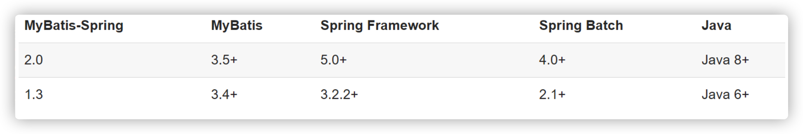
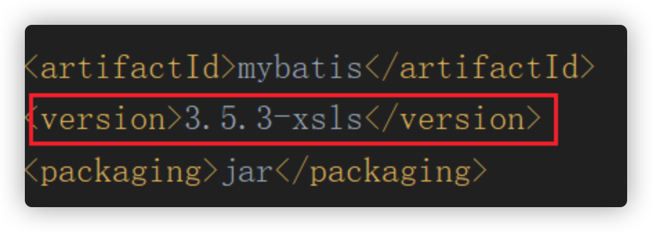
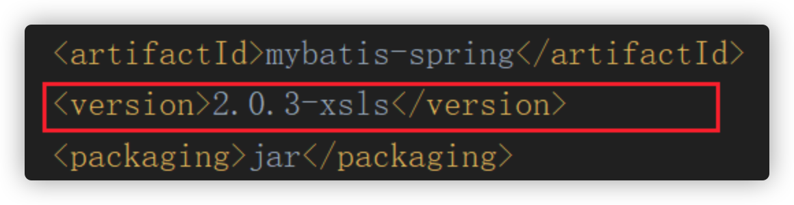
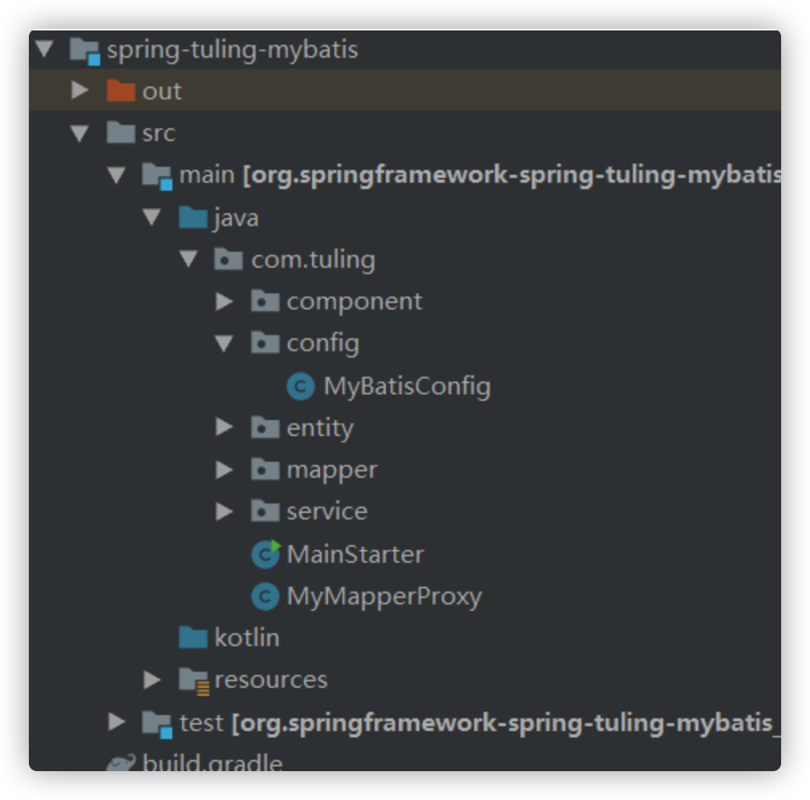

# Spring整合Mybatis原理

## 1. Mybatis集成Spring

### 1.1 Mybatis集成Spring的适配器源码下载

下载地址：https://github.com/mybatis/spring ，下载时注意版本：



为了在Spring源码中能够看到MyBatis的源码，需要将Mybatis的源码和MyBatis-Spring的源码 设置标识名称和添加安装源码到本地仓库的插件：





安装源码到本地仓库的插件：

```xml
<plugin>
  <artifactId>maven-source-plugin</artifactId>
  <version>3.0.1</version>
  <configuration>
    <attach>true</attach>
  </configuration>
  <executions>
    <execution>
      <phase>compile</phase>
      <goals>
        <goal>jar</goal>
      </goals>
    </execution>
  </executions>
</plugin>
```

### 1.2 Spring集成Mybatis



添加gradle依赖：

```
dependencies {
    testCompile group: 'junit', name: 'junit', version: '4.12'
    compile("mysql:mysql-connector-java:5.1.46")
    compile("com.alibaba:druid:1.1.8")
    compile("org.mybatis:mybatis-spring:2.0.3-xsls")
    compile("org.mybatis:mybatis:3.5.3-xsls")
    compile("org.projectlombok:lombok:1.18.4")
    compile("com.github.pagehelper:pagehelper:4.1.6")
    optional(project(":spring-context"))
    compile(project(":spring-jdbc"))
    compile("ch.qos.logback:logback-core:1.1.2")
    compile("ch.qos.logback:logback-classic:1.1.2")
    compile("org.slf4j:slf4j-api:1.7.7")
    optional(project(":spring-aop"))
    compile(project(":spring-jdbc")) 
    compile("org.mybatis.caches:mybatis-ehcache:1.1.0")
    compile("net.sf.ehcache:ehcache-core:2.6.11")
}
```

添加mybatis的测试代码：

```java
@EnableTransactionManagement
@Configuration
@MapperScan(basePackages = {"com.tuling.mapper"})
@ComponentScan(basePackages = {"com.tuling"})
@Repository
public class MyBatisConfig {    // =====>   spring.xml

   /**
    * <bean class="com.alibaba.druid.pool.DruidDataSource" id="dataSource"></bean>
    *
    * <bean class="org.mybatis.spring.SqlSessionFactoryBean" id="sqlSessionFactory">
    *     datasource
    *     mapper文件的路径
    *     别名
    * </bean>
    *
    * <mapper-scan basePackage=""/>
    * @return
    * @throws IOException
    */
   @Bean    // =====  >    <bean  class="org.mybatis.spring.SqlSessionFactoryBean">
   public SqlSessionFactoryBean sqlSessionFactory( ) throws IOException {
      SqlSessionFactoryBean factoryBean = new SqlSessionFactoryBean();
      factoryBean.setDataSource(dataSource());
      // 设置 MyBatis 配置文件路径
      factoryBean.setConfigLocation(new ClassPathResource("mybatis/mybatis-config.xml"));
      // 设置 SQL 映射文件路径
      factoryBean.setMapperLocations(new PathMatchingResourcePatternResolver().getResources("classpath:mybatis/mapper/*.xml"));
      factoryBean.setTypeAliases(User.class);

      return factoryBean;


   }

    public DataSource dataSource() {
        DruidDataSource dataSource = new DruidDataSource();
        dataSource.setUsername("root");
        dataSource.setPassword("123456");
        dataSource.setDriverClassName("com.mysql.jdbc.Driver");
        dataSource.setUrl("jdbc:mysql://localhost:3306/mybatis_example");
        return dataSource;
    }
}
```


## 2. SqlSessionFactoryBean

```java
public class SqlSessionFactoryBean implements FactoryBean<SqlSessionFactory>, InitializingBean, ApplicationListener<ApplicationEvent> {}
```

实现FactoryBean接口的getObject方法：

```java
/**
 * 
 * 将SqlSessionFactory对象注入spring容器
 * {@inheritDoc}
 */
@Override
public SqlSessionFactory getObject() throws Exception {
  if (this.sqlSessionFactory == null) {
    afterPropertiesSet();
  }

  return this.sqlSessionFactory;
}
```

```java
/**
 * {@inheritDoc}
 */
/**
 * 方法实现说明:我们自己配置文件中配置了SqlSessionFactoryBean,我们发现配置了该类实现了FactoryBean接口, 
 * 也实现了bean的生命周期回调接口InitializingBean
 * 首先我们会调用生命周期的回调afterPropertiesSet()，就是我们的SqlSessionFactorybean已经调用了构造方法
 */
@Override
public void afterPropertiesSet() throws Exception {
  notNull(dataSource, "Property 'dataSource' is required");
  notNull(sqlSessionFactoryBuilder, "Property 'sqlSessionFactoryBuilder' is required");
  state((configuration == null && configLocation == null) || !(configuration != null && configLocation != null),
      "Property 'configuration' and 'configLocation' can not specified with together");

  /**
   * 通过sqlSessionFactoryBuilder来构建我们的sqlSessionFactory
   */
  this.sqlSessionFactory = buildSqlSessionFactory();
}
```

核心是buildSqlSessionFactory：

```java
/**
 * 方法实现说明:构建我们的sqlSessionFactory的实例
 */
protected SqlSessionFactory buildSqlSessionFactory() throws Exception {

  // 声明一个Configuration对象用于保存mybatis的所有的配置信息
  final Configuration targetConfiguration;

  XMLConfigBuilder xmlConfigBuilder = null;
  // 初始化 configuration 对象，和设置其 `configuration.variables` 属性
  /**
   * 判断当前的SqlSessionFactoryBean是否在配置@Bean的时候 factoryBean.setConfiguration();
   *
   */
  if (this.configuration != null) {
    /**
     * 把配置的SqlSessionFactoryBean配置的configuration 赋值给targetConfiguration
     */
    targetConfiguration = this.configuration;
    if (targetConfiguration.getVariables() == null) {
      targetConfiguration.setVariables(this.configurationProperties);
    } else if (this.configurationProperties != null) {
      targetConfiguration.getVariables().putAll(this.configurationProperties);
    }
  }
  /**
   * 对configLocation进行非空判断，由于我们配置了SqlSessionFactoryBean的configLocation属性设置
   *
   * @Bean public SqlSessionFactoryBean sqlSessionFactory( ) throws IOException { SqlSessionFactoryBean factoryBean
   *       =new SqlSessionFactoryBean(); factoryBean.setDataSource(dataSource()); factoryBean.setConfigLocation(new
   *       ClassPathResource("mybatis/mybatis-config.xml")); factoryBean.setMapperLocations(new
   *       PathMatchingResourcePatternResolver().getResources("classpath:mybatis/mapper/*.xml")); return factoryBean;
   *       }
   */

  else if (this.configLocation != null) {
    /**
     * 创建我们xml配置构建器对象,对mybatis/mybatis-config.xml配置文件进行解析 在这里以及把我们的mybaits-config.xml解析出要给document对象
     */
    xmlConfigBuilder = new XMLConfigBuilder(this.configLocation.getInputStream(), null, this.configurationProperties);
    /**
     * 因为我们在创建XMLConfigBuilder的时候已经把我们的Configuration对象创建出来了
     */
    targetConfiguration = xmlConfigBuilder.getConfiguration();
  } else {
    LOGGER.debug(
        () -> "Property 'configuration' or 'configLocation' not specified, using default MyBatis Configuration");
    targetConfiguration = new Configuration();
    /**
     * 判断configurationProperties不为空,那么就调用targetConfiguration.set方法 把configurationProperties注入到Configuration对象中
     */
    Optional.ofNullable(this.configurationProperties).ifPresent(targetConfiguration::setVariables);
  }

  /**
   * objectFactory不为空,那么就调用targetConfiguration.set方法 把objectFactory注入到Configuration对象中
   */
  Optional.ofNullable(this.objectFactory).ifPresent(targetConfiguration::setObjectFactory);
  /**
   * objectWrapperFactory不为空,那么就调用targetConfiguration.set方法把 ObjectWrapperFactory注入到Configuration对象中
   */
  Optional.ofNullable(this.objectWrapperFactory).ifPresent(targetConfiguration::setObjectWrapperFactory);

  /**
   * vfs不为空,那么就调用targetConfiguration.set方法把 vfs注入到Configuration对象中
   */
  Optional.ofNullable(this.vfs).ifPresent(targetConfiguration::setVfsImpl);

  /**
   * typeAliasesPackage配置情况分为二种 1) 在mybaits-config.xml中配置了(mybatis的方式) <typeAliases>
   * <package name="com.tuling.entity"></package> </typeAliases>
   * 2)在配置我们的SqlSessionFactoryBean的时候配置了(Spring整合mybatis的方式)
   *
   * @Bean public SqlSessionFactoryBean sqlSessionFactory( ) throws IOException { SqlSessionFactoryBean factoryBean =
   *       new SqlSessionFactoryBean(); factoryBean.setDataSource(dataSource()); // 设置 MyBatis 配置文件路径
   *       factoryBean.setConfigLocation(new ClassPathResource("mybatis/mybatis-config.xml")); // 设置 SQL 映射文件路径
   *       factoryBean.setMapperLocations(new
   *       PathMatchingResourcePatternResolver().getResources("classpath:mybatis/mapper/*.xml"));
   *
   *       factoryBean.setTypeAliasesPackage("com.tuling.entity"); return factoryBean; }
   *
   *
   *       那么在Dept 就不需要写成com.tuling.entity了 <select id="findOne" parameterType="Integer" resultType="Dept"> select *
   *       from dept where id = #{id} </select>
   *
   *       若我们在配置SqlSessionFactoryBean接口的时候配置了typeAliasesPackage 那么
   *       这里才不会为空,同理,我们可以通过SqlSessionFactoryBean的typeAliasesSuperType 来控制哪些类的别名不支持
   */
  if (hasLength(this.typeAliasesPackage)) {

    /**
     * 第一步:扫描我们typeAliasesPackage 包路径下的所有的实体类的class类型 第二步:进行过滤,然后注册到Configuration的别名映射器中
     */
    scanClasses(this.typeAliasesPackage, this.typeAliasesSuperType).stream()
        .filter(clazz -> !clazz.isAnonymousClass()).filter(clazz -> !clazz.isInterface())
        .filter(clazz -> !clazz.isMemberClass()).forEach(targetConfiguration.getTypeAliasRegistry()::registerAlias);
  }

  /**
   * 判断我们SqlSessionFactory是否配置了typeAliases(class类型) 一般typeAliasesPackage配置好了 就没有必要配置typeAliases
   * 注册到Configuration的别名映射器中
   */
  if (!isEmpty(this.typeAliases)) {
    Stream.of(this.typeAliases).forEach(typeAlias -> {
      targetConfiguration.getTypeAliasRegistry().registerAlias(typeAlias);
      LOGGER.debug(() -> "Registered type alias: '" + typeAlias + "'");
    });
  }

  /**
   * 把我们自定义的插件注册到我们的mybatis的配置类上 系统默认的插件 Executor (update, query, flushStatements, commit, rollback, getTransaction,
   * close, isClosed) ParameterHandler (getParameterObject, setParameters) ResultSetHandler (handleResultSets,
   * handleOutputParameters) StatementHandler (prepare, parameterize, batch, update, query)
   */
  if (!isEmpty(this.plugins)) {
    Stream.of(this.plugins).forEach(plugin -> {
      targetConfiguration.addInterceptor(plugin);
      LOGGER.debug(() -> "Registered plugin: '" + plugin + "'");
    });
  }

  /**
   * 扫描我们自定义的类型处理器(用来处理我们的java类型和数据库类型的转化) 并且注册到我们的 targetConfiguration(批量注册)
   */
  if (hasLength(this.typeHandlersPackage)) {
    scanClasses(this.typeHandlersPackage, TypeHandler.class).stream().filter(clazz -> !clazz.isAnonymousClass())
        .filter(clazz -> !clazz.isInterface()).filter(clazz -> !Modifier.isAbstract(clazz.getModifiers()))
        .forEach(targetConfiguration.getTypeHandlerRegistry()::register);
  }

  /**
   * 通过配置<TypeHandlers></TypeHandlers>的形式来注册我们的类型处理器对象
   */
  if (!isEmpty(this.typeHandlers)) {
    Stream.of(this.typeHandlers).forEach(typeHandler -> {
      targetConfiguration.getTypeHandlerRegistry().register(typeHandler);
      LOGGER.debug(() -> "Registered type handler: '" + typeHandler + "'");
    });
  }

  /**
   * MyBatis 从 3.2 开始支持可插拔的脚本语言， 因此你可以在插入一种语言的驱动（language driver）之后来写基于这种语言的动态 SQL 查询
   * 具体用法:博客地址:https://www.jianshu.com/p/5c368c621b89
   */
  if (!isEmpty(this.scriptingLanguageDrivers)) {
    Stream.of(this.scriptingLanguageDrivers).forEach(languageDriver -> {
      targetConfiguration.getLanguageRegistry().register(languageDriver);
      LOGGER.debug(() -> "Registered scripting language driver: '" + languageDriver + "'");
    });
  }
  Optional.ofNullable(this.defaultScriptingLanguageDriver)
      .ifPresent(targetConfiguration::setDefaultScriptingLanguage);

  /**
   * 设置数据库厂商
   */
  if (this.databaseIdProvider != null) {// fix #64 set databaseId before parse mapper xmls
    try {
      targetConfiguration.setDatabaseId(this.databaseIdProvider.getDatabaseId(this.dataSource));
    } catch (SQLException e) {
      throw new NestedIOException("Failed getting a databaseId", e);
    }
  }

  /**
   * 若二级缓存不为空,注册二级缓存
   */
  Optional.ofNullable(this.cache).ifPresent(targetConfiguration::addCache);

  if (xmlConfigBuilder != null) {
    try {
      /**
       * 真正的解析我们的配置(mybatis-config.xml)的document对象
       */
      xmlConfigBuilder.parse();
      LOGGER.debug(() -> "Parsed configuration file: '" + this.configLocation + "'");
    } catch (Exception ex) {
      throw new NestedIOException("Failed to parse config resource: " + this.configLocation, ex);
    } finally {
      ErrorContext.instance().reset();
    }
  }

  /**
   * 为我们的configuration设置一个环境变量
   */
  targetConfiguration.setEnvironment(new Environment(this.environment,
      this.transactionFactory == null ? new SpringManagedTransactionFactory() : this.transactionFactory,
      this.dataSource));

  /**
   * 循环我们的mapper.xml文件
   */
  if (this.mapperLocations != null) {
    if (this.mapperLocations.length == 0) {
      LOGGER.warn(() -> "Property 'mapperLocations' was specified but matching resources are not found.");
    } else {
      for (Resource mapperLocation : this.mapperLocations) {
        if (mapperLocation == null) {
          continue;
        }
        try {
          /**
           * 真正的循环我们的mapper.xml文件
           */
          XMLMapperBuilder xmlMapperBuilder = new XMLMapperBuilder(mapperLocation.getInputStream(),
              targetConfiguration, mapperLocation.toString(), targetConfiguration.getSqlFragments());
          xmlMapperBuilder.parse();
        } catch (Exception e) {
          throw new NestedIOException("Failed to parse mapping resource: '" + mapperLocation + "'", e);
        } finally {
          ErrorContext.instance().reset();
        }
        LOGGER.debug(() -> "Parsed mapper file: '" + mapperLocation + "'");
      }
    }
  } else {
    LOGGER.debug(() -> "Property 'mapperLocations' was not specified.");
  }

  /**
   * 通过建造者模式构建我们的SqlSessionFactory对象 默认是DefaultSqlSessionFactory
   */
  return this.sqlSessionFactoryBuilder.build(targetConfiguration);
}
```

可知 SqlSessionFactoryBean 主要通过对 applicationContext.xml 解析完成时 Configuration 的实例化以及对完成对映射配置文件 `mapper*.xml` 的解析。

关键点：

- *XMLConfigBuilder：在mybatis中主要负责解释mybatis-config.xml。解析完后，如果我们自己设置了则使用我们的设置的进行覆盖。
- XMLMapperBuilder：负责解析映射配置文件

- targetConfiguration.setEnvironment 这里注意一下，事务工厂会使用一个新的 `new SpringManagedTransactionFactory()` ，而不是MyBatis之前的ManagedTransactionFactory。这个SpringManagedTransactionFactory会使用Spring事务中的dataSource ， 从而达到跟事务集成


## 3. Spring怎样管理Mapper接口的动态代理

https://www.processon.com/view/link/5f153429e401fd2e0deefd01

Spring和Mybatis时，我们重点要关注的就是这个代理对象。因为整合的目的就是：**把某个Mapper的代理对象作为一个bean放入Spring容器中，使得能够像使用一个普通bean一样去使用这个代理对象，比如能被@Autowire自动注入。**

比如当Spring和Mybatis整合之后，我们就可以使用如下的代码来使用Mybatis中的代理对象了：

```java
@Component
public class UserService {
    @Autowired
    private UserMapper userMapper;

    public User getUserById(Integer id) {
        return userMapper.selectById(id);
    }
}
```

UserService中的userMapper属性就会被自动注入为Mybatis中的代理对象。如果你基于一个已经完成整合的项目去调试即可发现，userMapper的类型为：org.apache.ibatis.binding.MapperProxy@41a0aa7d。证明确实是Mybatis中的代理对象。

好，那么现在我们要解决的问题的就是：**如何能够把Mybatis的代理对象作为一个bean放入Spring容器中？**

要解决这个，我们需要对Spring的bean生成过程有一个了解。

#### Spring中Bean的产生过程

Spring启动过程中，大致会经过如下步骤去生成bean：

- 扫描指定的包路径下的class文件
- 根据class信息生成对应的BeanDefinition
- 在此处，程序员可以利用某些机制去修改BeanDefinition
- 根据BeanDefinition生成bean实例
- 把生成的bean实例放入Spring容器中

假设有一个A类，假设有如下代码：

一个A类：

```java
@Component
public class A {
}
```

一个B类，不存在@Component注解

```java
public class B {
}
```

执行如下代码：

```java
AnnotationConfigApplicationContext context = 
  new AnnotationConfigApplicationContext(AppConfig.class);
System.out.println(context.getBean("a"));
```

输出结果为：com.tulingxueyuan.beans.A@6acdbdf5

A类对应的bean对象类型仍然为A类。但是这个结论是不确定的，我们可以利用BeanFactory后置处理器来修改BeanDefinition，我们添加一个BeanFactory后置处理器：

```java
@Component
public class MyBeanFactoryPostProcessor implements BeanFactoryPostProcessor {
    @Override
    public void postProcessBeanFactory(ConfigurableListableBeanFactory beanFactory) throws BeansException {
        BeanDefinition beanDefinition = beanFactory.getBeanDefinition("a");
        beanDefinition.setBeanClassName(B.class.getName());
    }
}
```

这样就会导致，原本的A类对应的BeanDefiniton被修改了，被修改成了B类，那么后续正常生成的bean对象的类型就是B类。此时，调用如下代码会报错：

```java
context.getBean(A.class);
```

但是调用如下代码不会报错，尽管B类上没有 `@Component` 注解：

```java
context.getBean(B.class);
```

并且，下面代码返回的结果是：com.tulingxueyuan.beans.B@4b1c1ea0

```java
AnnotationConfigApplicationContext context = 
  new AnnotationConfigApplicationContext(AppConfig.class);
System.out.println(context.getBean("a"));
```

之所以讲这个问题，是想说明一个问题：**在Spring中，bean对象跟class没有直接关系，跟BeanDefinition才有直接关系。**

那么回到我们要解决的问题：**如何能够把Mybatis的代理对象作为一个bean放入Spring容器中？**

在Spring中，**如果你想生成一个bean，那么得先生成一个BeanDefinition**，就像你想new一个对象实例，得先有一个class。

#### 解决问题

继续回到我们的问题，我们现在想自己生成一个bean，那么得先生成一个BeanDefinition，只要有了BeanDefinition，通过在BeanDefinition中设置**bean对象的类型**，然后把BeanDefinition添加给Spring，Spring就会根据BeanDefinition自动帮我们生成一个类型对应的bean对象。

所以，现在我们要解决两个问题：

- Mybatis的代理对象的类型是什么？因为我们要设置给BeanDefinition
- 我们怎么把BeanDefinition添加给Spring容器？

> **注意**
>
> 上文中我们使用的BeanFactory后置处理器，他只能修改BeanDefinition，并不能新增一个BeanDefinition。我们应该使用Import技术来添加一个BeanDefinition。后文再详细介绍如果使用Import技术来添加一个BeanDefinition，可以先看一下伪代码实现思路。

假设：我们有一个UserMapper接口，他的代理对象的类型为UserMapperProxy。

那么我们的思路就是这样的，伪代码如下：

```java
BeanDefinitoin bd = new BeanDefinitoin();
bd.setBeanClassName(UserMapperProxy.class.getName());
SpringContainer.addBd(bd);
```

但是，这里有一个严重的问题，就是上文中的UserMapperProxy是我们假设的，他表示一个代理类的类型，然而Mybatis中的代理对象是利用的JDK的动态代理技术实现的，也就是代理对象的代理类是动态生成的，我们根本无法确定代理对象的代理类到底是什么。

所以回到我们的问题：**Mybatis的代理对象的类型是什么？**

本来可以有两个答案：

- 代理对象对应的代理类

- 代理对象对应的接口

那么答案1就相当于没有了，因为是代理类是动态生成的，那么我们来看答案2：**代理对象对应的接口**

如果我们采用答案2，那么我们的思路就是：

```java
BeanDefinition bd = new BeanDefinitoin();
// 注意这里，设置的是UserMapper
bd.setBeanClassName(UserMapper.class.getName());
SpringContainer.addBd(bd);
```

但是，实际上给BeanDefinition对应的类型设置为一个接口是**行不通**的，因为Spring没有办法根据这个BeanDefinition去new出对应类型的实例，接口是没法直接new出实例的。

那么现在问题来了，我要解决的问题：**Mybatis的代理对象的类型是什么？**

两个答案都被我们否定了，所以这个问题是无解的，所以我们不能再沿着这个思路去思考了，只能回到最开始的问题：**如何能够把Mybatis的代理对象作为一个bean放入Spring容器中？**

总结上面的推理：**我们想通过设置BeanDefinition的class类型，然后由Spring自动的帮助我们去生成对应的bean，但是这条路是行不通的。** 

#### 终极解决方案

那么我们还有没有其他办法，可以去生成bean呢？并且**生成bean的逻辑不能由Spring来帮我们做**了，得由我们自己来做。

#### FactoryBean

有，那就是Spring中的FactoryBean。我们可以利用FactoryBean去自定义我们要生成的bean对象，比如：

```java
@Component
public class MyFactoryBean implements FactoryBean {
    @Override
    public Object getObject() throws Exception {
        Object proxyInstance = Proxy.newProxyInstance(MyFactoryBean.class.getClassLoader(), new Class[]{UserMapper.class}, new InvocationHandler() {
            @Override
            public Object invoke(Object proxy, Method method, Object[] args) throws Throwable {
                if (Object.class.equals(method.getDeclaringClass())) {
                    return method.invoke(this, args);
                } else {
                    // 执行代理逻辑
                    return null;
                }
            }
        });

        return proxyInstance;
    }

    @Override
    public Class<?> getObjectType() {
        return UserMapper.class;
    }
}
```

我们定义了一个MyFactoryBean，它实现了FactoryBean，getObject方法就是用来自定义生成bean对象逻辑的。

执行如下代码：

```java
public class Test {
    public static void main(String[] args) {
        AnnotationConfigApplicationContext context = new AnnotationConfigApplicationContext(AppConfig.class);
        System.out.println("myFactoryBean: " + context.getBean("myFactoryBean"));
        System.out.println("&myFactoryBean: " + context.getBean("&myFactoryBean"));
        System.out.println("myFactoryBean-class: " + context.getBean("myFactoryBean").getClass());
    }
}
```

将打印：

```
myFactoryBean: com.tulingxueyuan.beans.myFactoryBean$1@4d41cee
&myFactoryBean: com.tulingxueyuan.beans.myFactoryBean@3712b94
myFactoryBean-class: class com.sun.proxy.$Proxy20
```

从结果我们可以看到，从Spring容器中拿名字为"myFactoryBean"的bean对象，就是我们所自定义的jdk动态代理所生成的代理对象。

所以，我们可以通过FactoryBean来向Spring容器中添加一个自定义的bean对象。上文中所定义的MyFactoryBean对应的就是UserMapper，表示我们定义了一个MyFactoryBean，相当于把UserMapper对应的代理对象作为一个bean放入到了容器中。

但是作为程序员，我们不可能每定义了一个Mapper，还得去定义一个MyFactoryBean，这是很麻烦的事情，我们改造一下MyFactoryBean，让他变得更通用，比如：

```java
@Component
public class MyFactoryBean implements FactoryBean {

    // 注意这里
    private Class mapperInterface;
    public MyFactoryBean(Class mapperInterface) {
        this.mapperInterface = mapperInterface;
    }

    @Override
    public Object getObject() throws Exception {
        Object proxyInstance = Proxy.newProxyInstance(MyFactoryBean.class.getClassLoader(), new Class[]{mapperInterface}, new InvocationHandler() {
            @Override
            public Object invoke(Object proxy, Method method, Object[] args) throws Throwable {

                if (Object.class.equals(method.getDeclaringClass())) {
                    return method.invoke(this, args);
                } else {
                    // 执行代理逻辑
                    return null;
                }
            }
        });

        return proxyInstance;
    }

    @Override
    public Class<?> getObjectType() {
        return mapperInterface;
    }
}
```

改造MyFactoryBean之后，MyFactoryBean变得灵活了，可以在构造MyFactoryBean时，通过构造传入不同的Mapper接口。

实际上MyFactoryBean也是一个Bean，我们也可以通过生成一个BeanDefinition来生成一个MyFactoryBean，并给构造方法的参数设置不同的值，比如伪代码如下：

```java
BeanDefinition bd = new BeanDefinitoin();
// 注意一：设置的是MyFactoryBean
bd.setBeanClassName(MyFactoryBean.class.getName());
// 注意二：表示当前BeanDefinition在生成bean对象时，会通过调用MyFactoryBean的构造方法来生成，并传入UserMapper
bd.getConstructorArgumentValues().addGenericArgumentValue(UserMapper.class.getName())
SpringContainer.addBd(bd);
```

特别说一下注意二，表示表示当前BeanDefinition在生成bean对象时，会通过调用MyFactoryBean的构造方法来生成，并传入UserMapper的Class对象。那么在生成MyFactoryBean时就会生成一个UserMapper接口对应的代理对象作为bean了。

到此为止，其实就完成了我们要解决的问题：**把Mybatis中的代理对象作为一个bean放入Spring容器中**。只是我们这里是用简单的JDK代理对象模拟的Mybatis中的代理对象，如果有时间，我们完全可以调用Mybatis中提供的方法区生成一个代理对象。这里就不花时间去介绍了。

#### Import

到这里，我们还有一个事情没有做，就是怎么真正的定义一个BeanDefinition，并把它**添加**到Spring中，上文说到我们要利用Import技术，比如可以这么实现：

定义如下类：

```java
public class MyImportBeanDefinitionRegistrar implements ImportBeanDefinitionRegistrar {

    @Override
    public void registerBeanDefinitions(AnnotationMetadata importingClassMetadata, BeanDefinitionRegistry registry) {
        BeanDefinitionBuilder builder = BeanDefinitionBuilder.genericBeanDefinition();
        AbstractBeanDefinition beanDefinition = builder.getBeanDefinition();
        beanDefinition.setBeanClass(MyFactoryBean.class);
        beanDefinition.getConstructorArgumentValues().addGenericArgumentValue(UserMapper.class);
        // 添加beanDefinition
        registry.registerBeanDefinition("my"+UserMapper.class.getSimpleName(), beanDefinition);
    }
}
```

并且在 AppConfig 上添加 @Import 注解：

```java
@Import(MyImportBeanDefinitionRegistrar.class)
public class AppConfig {
}
```

这样在启动Spring时就会新增一个BeanDefinition，该BeanDefinition会生成一个MyFactoryBean对象，并且在生成MyFactoryBean对象时会传入UserMapper.class对象，通过MyFactoryBean内部的逻辑，相当于会自动生产一个UserMapper接口的代理对象作为一个bean。 

#### 总结

总结一下，通过我们的分析，我们要整合Spring和Mybatis，需要我们做的事情如下：

- 定义一个MyFactoryBean
- 定义一个MyImportBeanDefinitionRegistrar
- 在AppConfig上添加一个注解@Import(MyImportBeanDefinitionRegistrar.class)

#### 优化

这样就可以基本完成整合的需求了，当然还有两个点是可以优化的

第一，单独再定义一个@MyScan的注解，如下：

```java
@Retention(RetentionPolicy.RUNTIME)
@Import(MyImportBeanDefinitionRegistrar.class)
public @interface MyScan {
}
```

这样在AppConfig上直接使用@MyScan即可

第二，在MyImportBeanDefinitionRegistrar中，我们可以去扫描Mapper，在MyImportBeanDefinitionRegistrar我们可以通过AnnotationMetadata获取到对应的@MyScan注解，所以我们可以在@MyScan上设置一个value，用来指定待扫描的包路径。然后在MyImportBeanDefinitionRegistrar中获取所设置的包路径，然后扫描该路径下的所有Mapper，生成BeanDefinition，放入Spring容器中。

所以，到此为止，Spring整合Mybatis的核心原理就结束了，再次总结一下：

- 定义一个MyFactoryBean，用来将Mybatis的代理对象生成一个bean对象
- 定义一个MyImportBeanDefinitionRegistrar，用来生成不同Mapper对象的MyFactoryBean
- 定义一个@MynScan，用来在启动Spring时执行MyImportBeanDefinitionRegistrar的逻辑，并指定包路径

以上这个三个要素分别对象org.mybatis.spring中的：

- MapperFactoryBean
- MapperScannerRegistrar
- @MapperScan