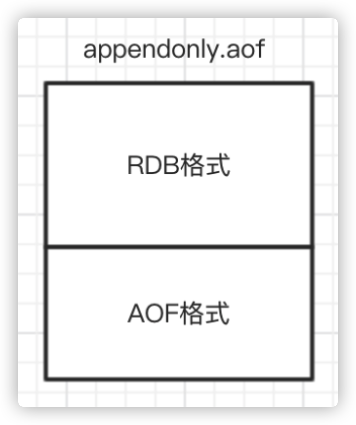
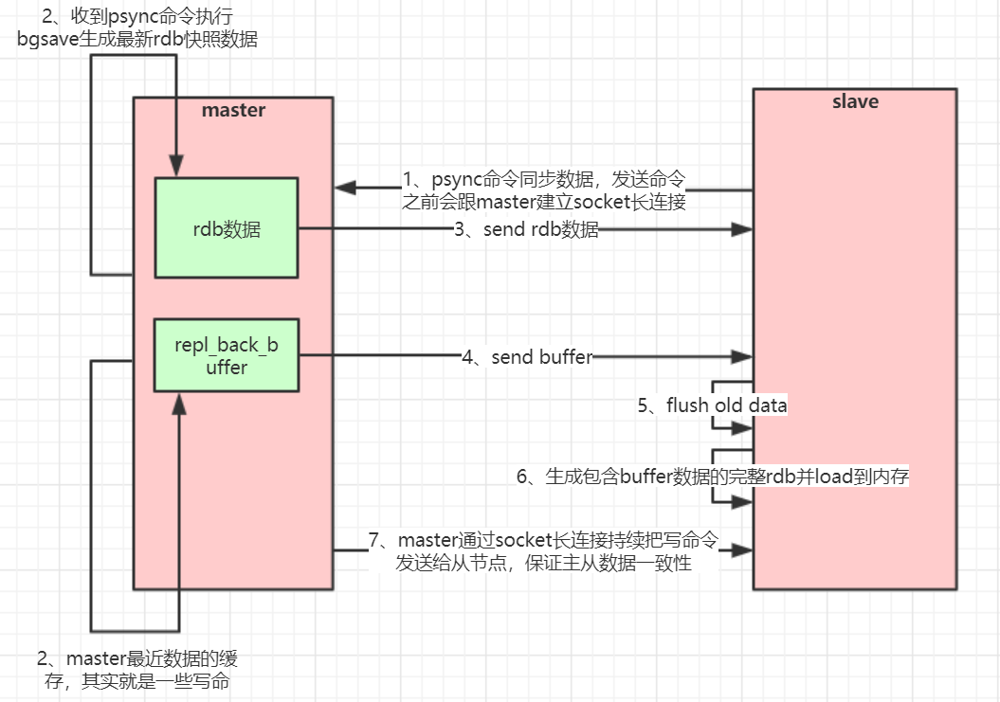

# Redis持久化、主从与哨兵架构详解

## 1. Redis持久化

### 1.1 RDB快照（snapshot）

在默认情况下，Redis将内存数据库快照保存在名字为dump.rdb的二进制文件中。

可以对Redis进行设置，让它在 “N秒内数据集至少有M个改动“ 这一条件被满足时，自动保存一次数据集。

比如说，以下设置会让Redis在满足 “60秒内有至少有1000个键被改动” 这一条件时，自动保存一次数据集。

```bash
# redis.conf
# 持久化文件名
dbfilename "dump.rdb"
# 持久化文件位置
dir "/usr/local/redis-5.0.3/data/6379"
```

关闭RDB只需要将所有的save保存策略注释掉即可

```bash
## 保存策略的参数含义：save 900 1 表示当900秒内出现至少一次修改，则进行持久化
# save 900 1
# save 300 10
# save 60 10000
```

还可以手动执行命令生成RDB快照，进入redis客户端执行命令**`save`**或**`bgsave`**可以生成dump.rdb文件，每次命令执行都会将所有redis内存快照到一个新的rdb文件里，并覆盖原有rdb快照文件。

save是同步命令，bgsave是异步命令，bgsave会从redis主进程fork（`fork()`是linux函数）出一个子进程专门用来生成rdb快照文件

> **注意**
>
> 配置自动生成rdb文件后台使用的是bgsave方式。

##### save与bgsave对比

| **命令**              | **save**         | **bgsave**                                     |
| --------------------- | ---------------- | ---------------------------------------------- |
| IO类型                | 同步             | 异步                                           |
| 是否阻塞redis其它命令 | 是               | 否(在生成子进程执行调用fork函数时会有短暂阻塞) |
| 复杂度                | O(n)             | O(n)                                           |
| 优点                  | 不会消耗额外内存 | 不阻塞客户端命令                               |
| 缺点                  | 阻塞客户端命令   | 需要fork子进程，消耗内存                       |

> **注意**
>
> 快照功能并不是非常耐久（durable）： 如果 Redis 因为某些原因而造成故障停机， 那么服务器将丢失最近写入、且仍未保存到快照中的那些数据。

### 1.2 AOF（append-only file）

从1.1版本开始， Redis增加了一种完全耐久的持久化方式：AOF 持久化，将**修改的**每一条指令记录进文件appendonly.aof中，可以通过修改配置文件来打开 AOF 功能：

```bash
# redis.conf
# 将appendonly由no改为yes即可启用
appendonly yes
# 记录指令的文件名
appendfilename "appendonly.aof"
# 持久化文件位置，与上面的rdb持久化文件保存在相同路径下
dir "/usr/local/redis-5.0.3/data/6379"
```

从现在开始，每当 Redis 执行一个改变数据集的命令时（比如 [SET](http://redisdoc.com/string/set.html#set)）， 这个命令就会被追加到 AOF 文件的末尾。这样的话，当Redis重新启动时，程序就可以通过重新执行AOF文件中的命令来达到重建数据集的目的。

可以配置Redis多久才将数据fsync到磁盘一次，有三个选项：

```bash
# redis.conf
## 以下三种策略只可三选一

## 每次有新命令追加到AOF文件时就执行一次fsync ，非常慢，也非常安全
# appendfsync always

## 每秒fsync一次，足够快（和使用 RDB 持久化差不多），并且在故障时只会丢失1秒钟的数据。
appendfsync everysec

## 从不fsync，将数据交给操作系统来处理。更快，也更不安全的选择。
# appendfsync no
```

> **注意**
>
> 推荐（并且也是默认）的措施为每秒 fsync 一次， 这种 fsync 策略可以兼顾速度和安全性。

#### AOF重写

AOF文件里可能有太多没用指令，所以AOF会定期根据**内存的最新数据**生成aof文件，重写可以大大压缩aof文件大小。例如，执行了如下几条命令：

```bash
127.0.0.1:6379> incr readcount
(integer) 1
127.0.0.1:6379> incr readcount
(integer) 2
127.0.0.1:6379> incr readcount
(integer) 3
127.0.0.1:6379> incr readcount
(integer) 4
127.0.0.1:6379> incr readcount
(integer) 5
```

重写后AOF文件里变成如下格式：

```bash
# 文件格式为RESP（Redis协议规范），
*3
$3
SET
$2
readcount
$1
5
```

如下两个配置可以控制AOF自动重写频率

```bash
# aof文件至少要达到64M才会自动重写，文件太小恢复速度本来就很快，重写的意义不大
auto-aof-rewrite-min-size 64mb
# aof文件自上一次重写后文件大小增长了100%则再次触发重写
auto-aof-rewrite-percentage 100
```

> **注意**
>
> AOF还可以手动重写，进入redis客户端执行命令 `bgrewriteaof` 重写AOF。AOF重写redis会fork出一个子进程去做，不会对redis正常命令处理有太多影响。

##### RDB 和 AOF ，应该用哪一个？

| **命令**   | **RDB**    | **AOF**      |
| ---------- | ---------- | ------------ |
| 启动优先级 | 低         | 高           |
| 体积       | 小         | 大           |
| 恢复速度   | 快         | 慢           |
| 数据安全性 | 容易丢数据 | 根据策略决定 |

redis启动时如果既有rdb文件又有aof文件，则优先选择aof文件恢复数据，因为aof一般来说数据更全一点。

### 1.3 Redis 4.0 混合持久化

重启 Redis 时，我们很少使用 RDB来恢复内存状态，因为会丢失大量数据。我们通常使用 AOF 日志重放，但是重放 AOF 日志性能相对 RDB来说要慢很多，这样在 Redis 实例很大的情况下，启动需要花费很长的时间。 Redis 4.0 为了解决这个问题，带来了一个新的持久化选项——混合持久化。

通过如下配置可以开启混合持久化：

```bash
aof-use-rdb-preamble yes
```

如果开启了混合持久化，**AOF在重写时**，不再是单纯将内存数据转换为RESP命令写入AOF文件，而是将重写**这一刻之前**的内存做RDB快照处理，并且将RDB快照内容和**增量的**AOF修改内存数据的命令存在一起，都写入新的AOF文件，新的文件一开始不叫appendonly.aof，等到重写完新的AOF文件才会进行改名，原子的覆盖原有的AOF文件，完成新旧两个AOF文件的替换。

于是在 Redis 重启的时候，可以先加载 RDB 的内容，然后再重放增量 AOF 日志就可以完全替代之前的 AOF 全量文件重放，因此重启效率大幅得到提升。

混合持久化AOF文件结构



 

## 2. Redis主从架构


> **注意**
>
> 主从架构中，slave只是作为master的备份存在，如果master节点挂了，需要将一个可用的slave节点的配置文件修改为master，并将其他slave指向新的master，然后重启集群，并且还需要将服务端程序中的redis连接信息（例如 Jedis）进行修改，使其指向新的master节点。

### 2.1 Redis主从工作原理

如果你为master配置了一个slave，不管这个slave是否是第一次连接上Master，它都会发送一个**SYNC**命令（redis2.8版本之前的命令）给master请求复制数据。

##### 数据全量复制

master收到SYNC命令后，**不管master是否打开了rdb持久化功能**，都会在后台进行数据持久化通过bgsave生成最新的rdb快照文件。持久化期间，master会继续接收客户端的请求，它会把这些可能修改数据集的请求缓存在内存中。

当持久化进行完毕以后，master会把这份rdb文件数据集发送给slave，slave会把接收到的数据进行持久化生成rdb，然后再加载到内存中。然后，master再将之前缓存在内存中的命令发送给slave。

当master与slave之间的连接由于某些原因而断开时，slave能够自动重连Master，如果master收到了多个slave并发连接请求，它只会进行一次持久化，而不是一个连接一次，然后再把这一份持久化的数据发送给多个并发连接的slave。

当master和slave断开重连后，一般都会对整份数据进行复制。但从redis2.8版本开始，master和slave断开重连后支持部分复制。

##### 数据部分复制

从2.8版本开始，slave与master能够在网络连接断开**重连后只进行部分数据复制。**

master会在其内存中创建一个复制数据用的缓存队列，缓存最近一段时间的数据，master和它所有的slave都维护了复制的数据下标offset和master的进程id。因此，当网络连接断开后，slave会请求master继续进行未完成的复制，从所记录的数据下标开始。如果master进程id变化了，或者从节点数据下标offset太旧，已经不在master的缓存队列里了，那么将会进行一次全量数据的复制。

> **注意**
>
> 从2.8版本开始，redis改用可以支持部分数据复制的命令 `PSYNC` 去master同步数据

##### 主从复制(全量复制)流程图




##### 主从复制(部分复制)流程图


#### redis主从架构搭建

##### 配置从节点步骤

1. 复制一份redis.conf文件

2. 将相关配置修改为如下值：

```bash
port 6380
pidfile /var/run/redis_6380.pid
logfile "6380.log"
dir /usr/local/redis-5.0.3/data/6380
```

3. 配置主从复制

```bash
# 从本机6379的redis实例复制数据
replicaof 192.168.0.60 6379
replica-read-only yes
```

4. 启动从节点

```bash
redis-server redis.conf
```

5. 连接从节点

```bash
redis-cli -p 6380
```

6. 测试在6379实例上写数据，6380实例是否能及时同步新修改数据

7. 可以自己再配置一个6381的从节点

##### Jedis连接代码示例

引入相关依赖：

```xml
<dependency>
    <groupId>redis.clients</groupId>
    <artifactId>jedis</artifactId>
    <version>2.9.0</version>
</dependency>
```

访问代码：

```java
public class JedisSingleTest {
    public static void main(String[] args) throws IOException {

        JedisPoolConfig jedisPoolConfig = new JedisPoolConfig();
        jedisPoolConfig.setMaxTotal(20);
        jedisPoolConfig.setMaxIdle(10);
        jedisPoolConfig.setMinIdle(5);

        // timeout，这里既是连接超时又是读写超时，
      	// 从Jedis 2.8开始有区分connectionTimeout和soTimeout的构造函数
        JedisPool jedisPool = 
          new JedisPool(jedisPoolConfig, "192.168.0.60", 6379, 3000, null);

        Jedis jedis = null;
        try {
            // 从redis连接池里拿出一个连接执行命令
            jedis = jedisPool.getResource();

            System.out.println(jedis.set("single", "tyrival"));
            System.out.println(jedis.get("single"));

            // 管道示例
            // 管道的命令执行方式：cat redis.txt | redis-cli -h 127.0.0.1 -a password - p 6379 --pipe
            /*
            Pipeline pl = jedis.pipelined();
            for (int i = 0; i < 10; i++) {
                pl.incr("pipelineKey");
                pl.set("tyrival" + i, "tyrival");
            }
            List<Object> results = pl.syncAndReturnAll();
            System.out.println(results);
            */

            // lua脚本模拟一个商品减库存的原子操作
            // lua脚本命令执行方式：redis-cli --eval /tmp/test.lua , 10
            /*
            jedis.set("product_count_10016", "15");  // 初始化商品10016的库存
            String script = " local count = redis.call('get', KEYS[1]) " +
                            " local a = tonumber(count) " +
                            " local b = tonumber(ARGV[1]) " +
                            " if a >= b then " +
                            "   redis.call('set', KEYS[1], a-b) " +
                            "   return 1 " +
                            " end " +
                            " return 0 ";
            Object obj = jedis.eval(script, Arrays.asList("product_count_10016"), Arrays.asList("10"));
            System.out.println(obj);
            */

        } catch (Exception e) {
            e.printStackTrace();
        } finally {
            // 注意这里不是关闭连接，在JedisPool模式下，Jedis会被归还给资源池。
            if (jedis != null)
                jedis.close();
        }
    }
}
```

#### redis管道与调用lua脚本

代码示例上面已经给出

##### 管道（Pipeline）

客户端可以一次性发送多个请求而不用等待服务器的响应，待所有命令都发送完后再一次性读取服务的响应，这样可以极大的降低多条命令执行的网络传输开销，管道执行多条命令的网络开销实际上只相当于一次命令执行的网络开销。需要注意到是用pipeline方式打包命令发送，redis必须在**处理完所有命令前先缓存起所有命令的处理结果**。打包的命令越多，缓存消耗内存也越多。所以并不是打包的命令越多越好。

pipeline中发送的每个command都会被server立即执行，如果执行失败，将会在此后的响应中得到信息；也就是pipeline并不是表达“所有command都一起成功”的语义，管道中前面命令失败，后面命令不会有影响，继续执行。

详细代码示例见上面jedis连接示例：

```java
Pipeline pl = jedis.pipelined();
for (int i = 0; i < 10; i++) {
    pl.incr("pipelineKey");
    pl.set("tyrival" + i, "tyrival");
}
List<Object> results = pl.syncAndReturnAll();
System.out.println(results);
```

##### Redis Lua脚本

Redis在2.6推出了脚本功能，允许开发者使用Lua语言编写脚本传到Redis中执行。使用脚本的好处如下:

1. **减少网络开销**：本来5次网络请求的操作，可以用一个请求完成，原先5次请求的逻辑放在redis服务器上完成。使用脚本，减少了网络往返时延。**这点跟管道类似**。

2. **原子操作**：Redis会将整个脚本作为一个整体执行，中间不会被其他命令插入。**管道不是原子的，不过redis的批量操作命令(类似mset)是原子的。**

3. **替代redis的事务功能**：redis自带的事务功能很鸡肋，报错不支持回滚，而redis的lua脚本几乎实现了常规的事务功能，支持报错回滚操作，官方推荐如果要使用redis的事务功能可以用redis lua替代。

>**官网文档上有这样一段话：**
>
>A Redis script is transactional by definition, so everything you can do with a Redis transaction, you can also do with a script, 
>and usually the script will be both simpler and faster.

从Redis2.6.0版本开始，通过内置的Lua解释器，可以使用EVAL命令对Lua脚本进行求值。EVAL命令的格式如下：

```bash
EVAL script numkeys key [key ...] arg [arg ...]　
```

script参数是一段Lua脚本程序，它会被运行在Redis服务器上下文中，这段脚本**不必(也不应该)定义为一个Lua函数**。numkeys参数用于指定键名参数的个数。键名参数 key [key ...] 从EVAL的第三个参数开始算起，表示在脚本中所用到的那些Redis键(key)，这些键名参数可以在 Lua中通过全局变量KEYS数组，用1为基址的形式访问(KEYS[1] ，KEYS[2] ，以此类推)。

在命令的最后，那些不是键名参数的附加参数 arg [arg ...] ，可以在Lua中通过全局变量**ARGV**数组访问，访问的形式和KEYS变量类似( ARGV[1] 、 ARGV[2] ，诸如此类)。例如

```bash
127.0.0.1:6379> eval "return {KEYS[1],KEYS[2],ARGV[1],ARGV[2]}" 2 key1 key2 first second
1) "key1"
2) "key2"
3) "first"
4) "second"
```

其中 "return {KEYS[1],KEYS[2],ARGV[1],ARGV[2]}" 是被求值的Lua脚本，数字2指定了键名参数的数量， key1和key2是键名参数，分别使用 KEYS[1] 和 KEYS[2] 访问，而最后的 first 和 second 则是附加参数，可以通过 ARGV[1] 和 ARGV[2] 访问它们。

在 Lua 脚本中，可以使用 **`redis.call()`** 函数来执行Redis命令

Jedis调用示例详见上面jedis连接示例：

```java
jedis.set("product_stock_10016", "15");  // 初始化商品10016的库存
String script = " local count = redis.call('get', KEYS[1]) " +
                " local a = tonumber(count) " +
                " local b = tonumber(ARGV[1]) " +
                " if a >= b then " +
                "   redis.call('set', KEYS[1], count-b) " +
                "   return 1 " +
                " end " +
                " return 0 ";
Object obj = jedis.eval(script, Arrays.asList("product_stock_10016"), Arrays.asList("10"));
System.out.println(obj);
```

> **注意**
>
> 不要在Lua脚本中出现死循环和耗时的运算，否则redis会阻塞，将不接受其他的命令，所以使用时要注意不能出现死循环、耗时的运算。redis是单进程、单线程执行脚本。管道不会阻塞redis。


## 3. Redis哨兵高可用架构


sentinel哨兵是特殊的redis服务，不提供读写服务，主要用来监控redis实例节点。

哨兵架构下client端第一次从哨兵找出redis的主节点，后续就直接访问redis的主节点，不会每次都通过sentinel代理访问redis的主节点，当redis的主节点发生变化，哨兵会第一时间感知到，并且将新的redis主节点通知给client端(这里面redis的client端一般都实现了订阅功能，订阅sentinel发布的节点变动消息)。

##### redis哨兵架构搭建步骤

1. 复制一份sentinel.conf文件

```bash
cp sentinel.conf sentinel-26379.conf
```

2. 将相关配置修改为如下值：

```bash
port 26379
daemonize yes
pidfile "/var/run/redis-sentinel-26379.pid"
logfile "26379.log"
dir "/usr/local/redis-5.0.3/data"
# sentinel monitor <master-name> <ip> <redis-port> <quorum>
# quorum是一个数字，指明当有多少个sentinel认为一个master失效时(值一般为：sentinel总数/2 + 1)，master才算真正失效
sentinel monitor mymaster 192.168.0.60 6379 2
```

3. 启动sentinel哨兵实例

```bash
src/redis-sentinel sentinel-26379.conf
```

4. 查看sentinel的info信息

```bash
src/redis-cli -p 26379
127.0.0.1:26379> info
```

可以看到Sentinel的info里已经识别出了redis的主从

5. 可以自己再配置两个sentinel，端口26380和26381，注意上述配置文件里的对应数字都要修改

##### 哨兵的Jedis连接代码

```java
public class JedisSentinelTest {
    public static void main(String[] args) throws IOException {

        JedisPoolConfig config = new JedisPoolConfig();
        config.setMaxTotal(20);
        config.setMaxIdle(10);
        config.setMinIdle(5);

        String masterName = "mymaster";
        Set<String> sentinels = new HashSet<String>();
        sentinels.add(new HostAndPort("localhost", 26379).toString());
        sentinels.add(new HostAndPort("localhost", 26380).toString());
        sentinels.add(new HostAndPort("localhost", 26381).toString());
        // JedisSentinelPool其实本质跟JedisPool类似，都是与redis主节点建立的连接池
        // JedisSentinelPool并不是说与sentinel建立的连接池，而是通过sentinel发现redis主节点并与其建立连接
        JedisSentinelPool jedisSentinelPool = 
                new JedisSentinelPool(masterName, sentinels, config, 3000, null);
        Jedis jedis = null;
        try {
            jedis = jedisSentinelPool.getResource();
            System.out.println(jedis.set("sentinel", "tyrival"));
            System.out.println(jedis.get("sentinel"));
        } catch (Exception e) {
            e.printStackTrace();
        } finally {
            // 注意这里不是关闭连接，在JedisPool模式下，Jedis会被归还给资源池。
            if (jedis != null)
                jedis.close();
        }
    }
}
```

##### 哨兵的Spring Boot整合Redis连接代码见示例项目：redis-sentinel-cluster

引入相关依赖：

```xml
<dependency>
   <groupId>org.springframework.boot</groupId>
   <artifactId>spring-boot-starter-data-redis</artifactId>
</dependency>

<dependency>
   <groupId>org.apache.commons</groupId>
   <artifactId>commons-pool2</artifactId>
</dependency>
```

springboot项目核心配置：

```yaml
server:
  port: 8080

spring:
  redis:
    database: 0
    timeout: 3000
    sentinel:    #哨兵模式
      master: mymaster #主服务器所在集群名称
     nodes: 192.168.0.60:26379,192.168.0.60:26380,192.168.0.60:26381
   lettuce:
      pool:
        max-idle: 50
        min-idle: 10
        max-active: 100
        max-wait: 1000
```

访问代码：

```java
@RestController
public class IndexController {

    private static final Logger logger = LoggerFactory.getLogger(IndexController.class);

    @Autowired
    private StringRedisTemplate stringRedisTemplate;

    /**
     * 测试节点挂了哨兵重新选举新的master节点，客户端是否能动态感知到
     * 新的master选举出来后，哨兵会把消息发布出去，客户端实际上是实现了一个消息监听机制，
     * 当哨兵把新master的消息发布出去，客户端会立马感知到新master的信息，从而动态切换访问的masterip
     *
     * @throws InterruptedException
     */
    @RequestMapping("/test_sentinel")
    public void testSentinel() throws InterruptedException {
        int i = 1;
        while (true) {
            try {
                stringRedisTemplate.opsForValue().set("tyrival" + i, i + "");
                System.out.println("设置key：" + "tyrival" + i);
                i++;
                Thread.sleep(1000);
            } catch (Exception e) {
                logger.error("错误：", e);
            }
        }
    }
}
```

##### StringRedisTemplate与RedisTemplate 

spring 封装了 RedisTemplate 对象来进行对redis的各种操作，它支持所有的 redis 原生的 api。在RedisTemplate中提供了几个常用的接口方法的使用，分别是:

```java
private ValueOperations<K, V> valueOps;
private HashOperations<K, V> hashOps;
private ListOperations<K, V> listOps;
private SetOperations<K, V> setOps;
private ZSetOperations<K, V> zSetOps;
```

RedisTemplate中定义了对5种数据结构操作

```java
redisTemplate.opsForValue(); // 操作字符串
redisTemplate.opsForHash();  // 操作hash
redisTemplate.opsForList();  // 操作list
redisTemplate.opsForSet();   // 操作set
redisTemplate.opsForZSet();  // 操作有序set
```

StringRedisTemplate继承自RedisTemplate，也一样拥有上面这些操作。

StringRedisTemplate默认采用的是String的序列化策略，保存的key和value都是采用此策略序列化保存的。

RedisTemplate默认采用的是JDK的序列化策略，保存的key和value都是采用此策略序列化保存的。

##### Redis客户端命令对应的RedisTemplate中的方法列表

| **String类型结构**                       |                                                              |
| ---------------------------------------- | ------------------------------------------------------------ |
| Redis                                    | `RedisTemplate rt`                                           |
| set key value                            | `rt.opsForValue().set("key","value")`                        |
| get key                                  | `rt.opsForValue().get("key")`                                |
| del key                                  | `rt.delete("key")`                                           |
| strlen key                               | `rt.opsForValue().size("key")`                               |
| getset key value                         | `rt.opsForValue().getAndSet("key","value")`                  |
| getrange key start end                   | `rt.opsForValue().get("key",start,end)`                      |
| append key value                         | `rt.opsForValue().append("key","value")`                     |
|                                          |                                                              |
| **Hash结构**                             |                                                              |
| hmset key field1 value1 field2 value2... | `rt.opsForHash().putAll("key", map)`  //map是一个集合对象    |
| hset key field value                     | `rt.opsForHash().put("key","field","value")`                 |
| hexists key field                        | `rt.opsForHash().hasKey("key","field")`                      |
| hgetall key                              | `rt.opsForHash().entries("key")`  //返回Map对象              |
| hvals key                                | `rt.opsForHash().values("key")`  //返回List对象              |
| hkeys key                                | `rt.opsForHash().keys("key")`   //返回List对象               |
| hmget key field1 field2...               | `rt.opsForHash().multiGet("key",keyList)`                    |
| hsetnx key field value                   | `rt.opsForHash().putIfAbsent("key","field","value"`          |
| hdel key field1 field2                   | `rt.opsForHash().delete("key","field1","field2")`            |
| hget key field                           | `rt.opsForHash().get("key","field")`                         |
|                                          |                                                              |
| **List结构**                             |                                                              |
| lpush list node1 node2 node3...          | `rt.opsForList().leftPush("list","node")`                    |
|                                          | `rt.opsForList().leftPushAll("list",list)`  //list是集合对象 |
| rpush list node1 node2 node3...          | `rt.opsForList().rightPush("list","node")`                   |
|                                          | `rt.opsForList().rightPushAll("list",list)`  //list是集合对象 |
| lindex key index                         | `rt.opsForList().index("list", index)`                       |
| llen key                                 | `rt.opsForList().size("key")`                                |
| lpop key                                 | `rt.opsForList().leftPop("key")`                             |
| rpop key                                 | `rt.opsForList().rightPop("key")`                            |
| lpushx list node                         | `rt.opsForList().leftPushIfPresent("list","node")`           |
| rpushx list node                         | `rt.opsForList().rightPushIfPresent("list","node")`          |
| lrange list start end                    | `rt.opsForList().range("list",start,end)`                    |
| lrem list count value                    | `rt.opsForList().remove("list",count,"value")`               |
| lset key index value                     | `rt.opsForList().set("list",index,"value")`                  |
|                                          |                                                              |
| **Set结构**                              |                                                              |
| sadd key member1 member2...              | `rt.boundSetOps("key").add("member1","member2",...)`         |
|                                          | `rt.opsForSet().add("key", set)`  //set是一个集合对象        |
| scard key                                | `rt.opsForSet().size("key")`                                 |
| sidff key1 key2                          | `rt.opsForSet().difference("key1","key2")`  //返回一个集合对象 |
| sinter key1 key2                         | `rt.opsForSet().intersect("key1","key2")`  //同上            |
| sunion key1 key2                         | `rt.opsForSet().union("key1","key2")`  //同上                |
| sdiffstore des key1 key2                 | `rt.opsForSet().differenceAndStore("key1","key2","des")`     |
| sinter des key1 key2                     | `rt.opsForSet().intersectAndStore("key1","key2","des")`      |
| sunionstore des key1 key2                | `rt.opsForSet().unionAndStore("key1","key2","des")`          |
| sismember key member                     | `rt.opsForSet().isMember("key","member")`                    |
| smembers key                             | `rt.opsForSet().members("key")`                              |
| spop key                                 | `rt.opsForSet().pop("key")`                                  |
| srandmember key count                    | `rt.opsForSet().randomMember("key",count)`                   |
| srem key member1 member2...              | `rt.opsForSet().remove("key","member1","member2",...)`       |

