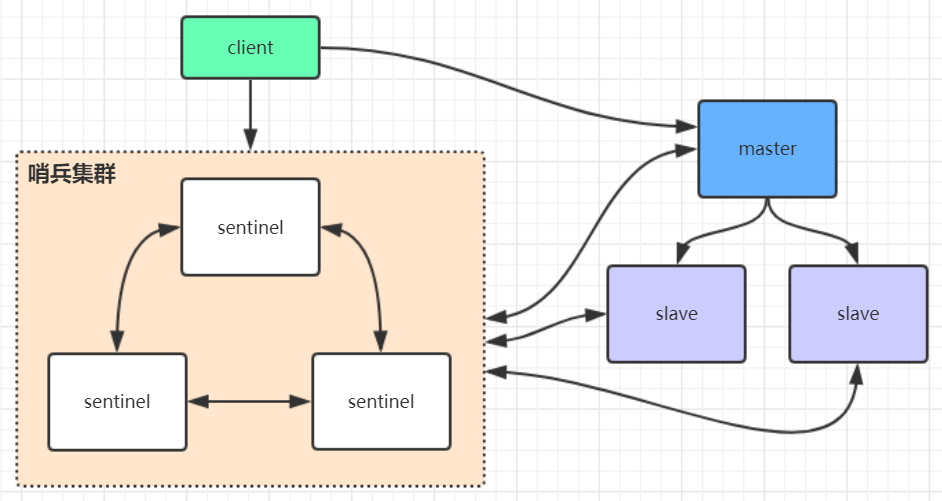
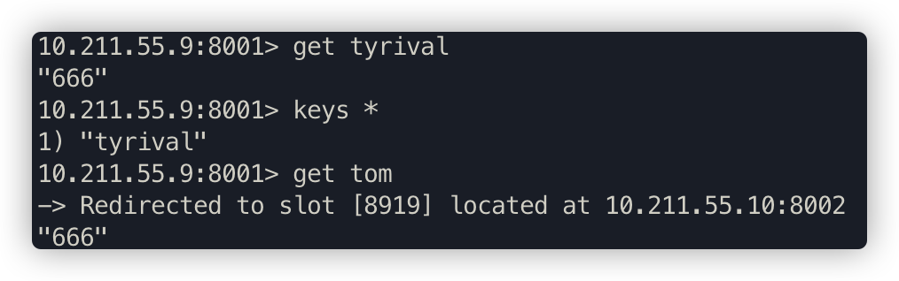
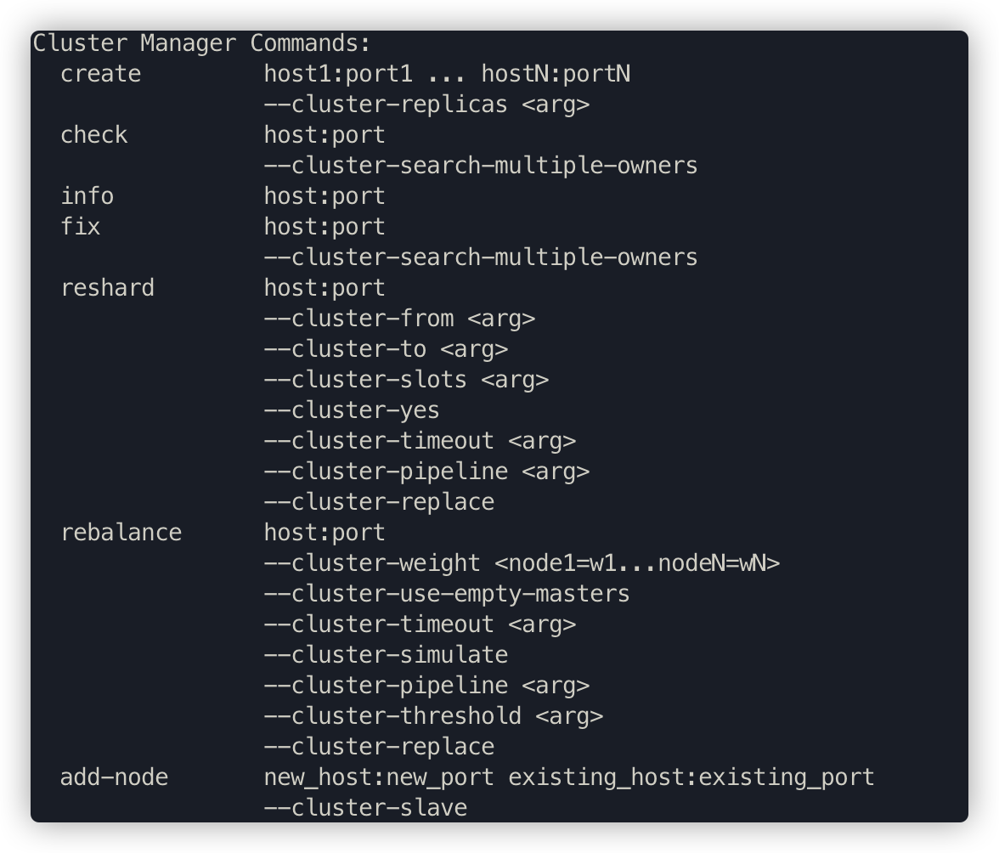
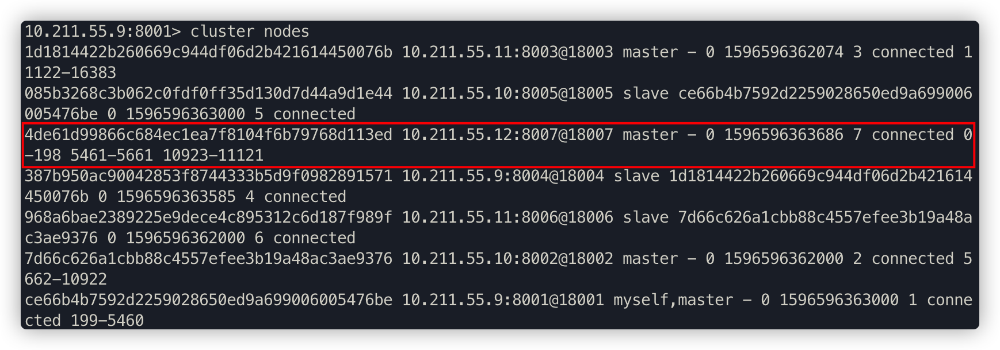
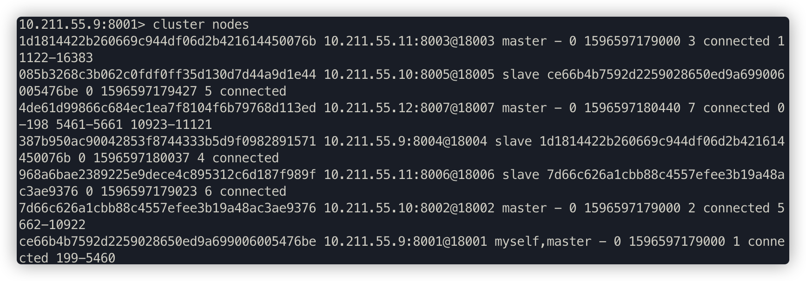
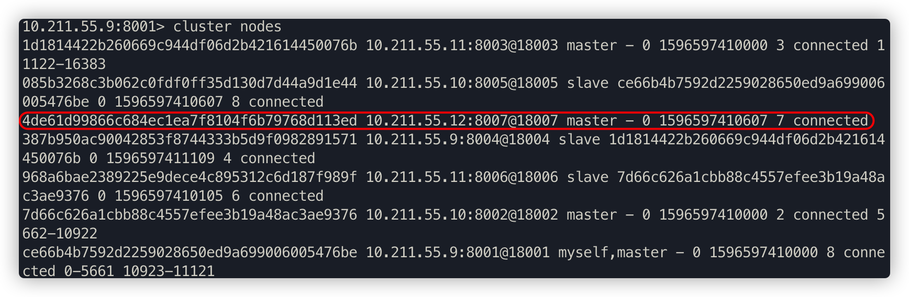

# Redis高可用集群

## 1. Redis集群方案比较

- **哨兵模式** 



在redis3.0以前的版本要实现集群一般是借助哨兵sentinel工具来监控master节点的状态，如果master节点异常，则会做主从切换，将某一台slave作为master，哨兵的配置略微复杂，并且性能和高可用性等各方面表现一般，特别是在主从切换的瞬间存在访问瞬断的情况，而且哨兵模式只有一个主节点对外提供服务，没法支持很高的并发，且单个主节点内存也不宜设置得过大，否则会导致持久化文件过大，影响数据恢复或主从同步的效率。

- **高可用集群模式**


redis集群是一个由多个主从节点群组成的分布式服务器群，它具有复制、高可用和分片特性。Redis集群不需要sentinel哨兵也能完成节点移除和故障转移的功能。需要将每个节点设置成集群模式，这种集群模式没有中心节点，可水平扩展，据官方文档称可以线性扩展到上万个节点(官方推荐不超过1000个节点)。redis集群的性能和高可用性均优于之前版本的哨兵模式，且集群配置非常简单 


## 2. Redis高可用集群搭建

- **redis安装**

下载地址：http://redis.io/download

```bash
## 安装步骤：
# 安装gcc
yum install gcc

# 把下载好的redis-5.0.3.tar.gz放在/usr文件夹下，并解压
wget http://download.redis.io/releases/redis-5.0.3.tar.gz
tar xzf redis-5.0.3.tar.gz
cd redis-5.0.3

# 进入到解压好的redis-5.0.3目录下，进行编译与安装
make 

# 要使用后台启动，所以修改redis.conf里的daemonize改为yes

# 启动并指定配置文件
src/redis-server redis.conf

# 验证启动是否成功 
ps -ef | grep redis 

# 进入redis客户端 
/usr/local/redis/bin/redis-cli 

# 退出客户端
quit

# 退出redis服务： 
pkill redis-server 
kill 进程号                       
src/redis-cli shutdown 
```

- **redis集群搭建**

redis集群需要至少要三个master节点，我们这里搭建三个master节点，并且给每个master再搭建一个slave节点，总共6个redis节点，这里用三台机器部署6个redis实例，每台机器一主一从，搭建集群的步骤如下：

1. 在第一台机器的/usr/local下创建文件夹redis-cluster，然后在其下面分别创建2个文件夾如下

```bash
mkdir -p /usr/local/redis-cluster
mkdir 8001 8004
```

2. 把之前的redis.conf配置文件copy到8001下，修改如下内容

```bash
daemonize yes		①
port 8001				②
## 指定数据文件存放位置，必须要指定不同的目录位置，不然会丢失数据
dir /usr/local/redis-cluster/8001/		③
## 启动集群模式
cluster-enabled yes		④
## 集群节点信息文件，这里800x最好和port对应上
cluster-config-file nodes-8001.conf		⑤
cluster-node-timeout 5000		⑥
## 去掉bind绑定访问ip信息
# bind 127.0.0.1			⑦
## 关闭保护模式
protected-mode no			⑧
appendonly yes				⑨　

## 如果要设置密码需要增加如下配置
## 设置redis访问密码
requirepass tyrival		⑩
## 设置集群节点间访问密码，跟上面一致
masterauth tyrival		⑪
```

3. 把修改后的配置文件，copy到8004，修改第②、③、⑤项里的端口号，可以用批量替换

```bash
:%s/源字符串/目的字符串/g
```

4. 另外两台机器也需要做上面几步操作，第二台机器用8002和8005，第三台机器用8003和8006
5. 分别启动6个redis实例，然后检查是否启动成功

```bash
/usr/redis-5.0.3/src/redis-server /usr/local/redis-cluster/800*/redis.conf
# 查看是否启动成功
ps -ef | grep redis
```

6. 用redis-cli创建整个redis集群(redis5以前的版本集群是依靠ruby脚本redis-trib.rb实现)

```bash
# 下面命令里的1代表为每个创建的主服务器节点创建一个从服务器节点
# 执行这条命令需要确认三台机器之间的redis实例要能相互访问，可以先简单把所有机器防火墙关掉，如果不关闭防火墙则需要打开redis服务端口和集群节点gossip通信端口16379(默认是在redis端口号上加10000)

# 关闭防火墙
# systemctl stop firewalld # 临时关闭防火墙
# systemctl disable firewalld # 禁止开机启动

# --cluster-replicas 1 表示为每个主节点创建一个副本
/usr/redis-5.0.3/src/redis-cli -a tyrival --cluster create --cluster-replicas 1 10.211.55.9:8001 10.211.55.10:8002 10.211.55.11:8003 10.211.55.9:8004 10.211.55.10:8005 10.211.55.11:8006 
```

7. 验证集群

```bash
# 连接任意一个客户端即可：./redis-cli -c -h -p (-a访问服务端密码，-c表示集群模式，指定ip地址和端口号）
/usr/redis-5.0.3/src/redis-cli -a tyrival -c -h 10.211.55.9 -p 8001

# 查看集群信息
cluster info

# 查看节点列表
cluster nodes

# 关闭集群则需要逐个进行关闭，使用命令：
/usr/redis-5.0.3/src/redis-cli -a tyrival -c -h 10.211.55.* -p 800* shutdown
```


## 3. Java操作redis集群

借助redis的java客户端jedis可以操作以上集群，引用jedis版本的maven坐标如下

```xml
<dependency>
    <groupId>redis.clients</groupId>
    <artifactId>jedis</artifactId>
    <version>2.9.0</version>
</dependency>
```

Java编写访问redis集群的代码非常简单，如下所示：

```java
package com.tyrival.distributed.old.lession07;

import redis.clients.jedis.HostAndPort;
import redis.clients.jedis.JedisCluster;
import redis.clients.jedis.JedisPoolConfig;

import java.io.IOException;
import java.util.HashSet;
import java.util.Set;

public class JedisClusterTest {
    public static void main(String[] args) throws IOException {

        JedisPoolConfig config = new JedisPoolConfig();
        config.setMaxTotal(20);
        config.setMaxIdle(10);
        config.setMinIdle(5);

        Set<HostAndPort> jedisClusterNode = new HashSet<HostAndPort>();
        jedisClusterNode.add(new HostAndPort("10.211.55.9", 8001));
        jedisClusterNode.add(new HostAndPort("10.211.55.10", 8002));
        jedisClusterNode.add(new HostAndPort("10.211.55.11", 8003));
        jedisClusterNode.add(new HostAndPort("10.211.55.9", 8004));
        jedisClusterNode.add(new HostAndPort("10.211.55.10", 8005));
        jedisClusterNode.add(new HostAndPort("10.211.55.11", 8006));

        JedisCluster jedisCluster = null;
        try {
            // connectionTimeout：指的是连接一个url的连接等待时间
            // soTimeout：指的是连接上一个url，获取response的返回等待时间
            jedisCluster =
                    new JedisCluster(jedisClusterNode, 6000, 5000, 10, "tyrival", config);
            System.out.println(jedisCluster.set("cluster", "tyrival"));
            System.out.println(jedisCluster.get("cluster"));
        } catch (Exception e) {
            e.printStackTrace();
        } finally {
            if (jedisCluster != null)
                jedisCluster.close();
        }
    }
}

运行效果如下：
OK
tyrival
```

集群的Spring Boot整合Redis连接代码见示例项目

1. 引入相关依赖：

```xml
<dependency>
   <groupId>org.springframework.boot</groupId>
   <artifactId>spring-boot-starter-data-redis</artifactId>
</dependency>

<dependency>
   <groupId>org.apache.commons</groupId>
   <artifactId>commons-pool2</artifactId>
</dependency>
```

springboot项目核心配置：

```yml
server:
  port: 8080

spring:
  redis:
    database: 0
    timeout: 3000
    password: tyrival
    cluster:
      nodes: 10.211.55.9:8001,10.211.55.10:8002,10.211.55.11:8003,10.211.55.9:8004,10.211.55.10:8005,10.211.55.11:8006
   lettuce:
      pool:
        max-idle: 50
        min-idle: 10
        max-active: 100
        max-wait: 1000
```

访问代码：

```java
package com.tyrival.distributed.old.lession07;

import com.tyrival.distributed.old.lession05.RedisOpsController;
import org.slf4j.Logger;
import org.slf4j.LoggerFactory;
import org.springframework.beans.factory.annotation.Autowired;
import org.springframework.data.redis.core.StringRedisTemplate;
import org.springframework.web.bind.annotation.RequestMapping;
import org.springframework.web.bind.annotation.RestController;

@RestController
public class IndexClusterController {

    private static final Logger logger = LoggerFactory.getLogger(RedisOpsController.class);

    @Autowired
    private StringRedisTemplate stringRedisTemplate;

    @RequestMapping("/test_cluster")
    public void testCluster() throws InterruptedException {
        stringRedisTemplate.opsForValue().set("tyrival", "666");
        logger.info(stringRedisTemplate.opsForValue().get("tyrival"));

        stringRedisTemplate.opsForValue().set("tom", "666");
        logger.info(stringRedisTemplate.opsForValue().get("tom"));
    }
}
```

> **注意**
>
> 执行上述代码可以发现，在8001节点遍历keys只能看到tyrival，看不到tom，说明tyrival储存在8001节点；同时，在8001节点查询tom，会被重定向到8002节点。
>
> 


## 4. Redis集群原理分析

Redis Cluster 将所有数据划分为 16384 个 slots(槽位)，每个节点负责其中一部分槽位。槽位的信息存储于每个节点中。

当 Redis Cluster 的客户端来连接集群时，它也会得到一份集群的槽位配置信息并将其缓存在客户端本地。这样当客户端要查找某个 key 时，可以直接定位到目标节点。同时因为槽位的信息可能会存在客户端与服务器不一致的情况，还需要纠正机制来实现槽位信息的校验调整。

#### 槽位定位算法

Cluster 默认会对 key 值使用 crc16 算法进行 hash 得到一个整数值，然后用这个整数值对 16384 进行取模来得到具体槽位。

```java
HASH_SLOT = CRC16(key) mod 16384
```

#### 跳转重定位

当客户端向一个错误的节点发出了指令，该节点会发现指令的 key 所在的槽位并不归自己管理，这时它会向客户端发送一个特殊的跳转指令携带目标操作的节点地址，告诉客户端去连这个节点去获取数据。客户端收到指令后除了跳转到正确的节点上去操作，还会同步更新纠正本地的槽位映射表缓存，后续所有 key 将使用新的槽位映射表。


#### Redis集群节点间的通信机制

redis cluster节点间采取gossip协议进行通信。维护集群的元数据有两种方式：**集中式**和**gossip**。

##### 集中式

优点在于元数据的更新和读取，时效性非常好，一旦元数据出现变更立即就会更新到集中式的存储中，其他节点读取的时候立即就可以立即感知到；不足在于所有的元数据的更新压力全部集中在一个地方，可能导致元数据的存储压力。 

##### gossip


gossip协议包含多种消息，包括ping，pong，meet，fail等等。 

- ping

  每个节点都会频繁给其他节点发送ping，其中包含自己的状态还有自己维护的集群元数据，互相通过ping交换元数据； 

- pong

  返回ping和meet，包含自己的状态和其他信息，也可以用于信息广播和更新； 

- fail

  某个节点判断另一个节点fail之后，就发送fail给其他节点，通知其他节点，指定的节点宕机了。

- meet

  某个节点发送meet给新加入的节点，让新节点加入集群中，然后新节点就会开始与其他节点进行通信，不需要发送形成网络的所需的所有CLUSTER MEET命令。发送CLUSTER MEET消息以便每个节点能够达到其他每个节点只需通过一条已知的节点链就够了。由于在心跳包中会交换gossip信息，将会创建节点间缺失的链接。

gossip协议的优点在于元数据的更新比较分散，不是集中在一个地方，更新请求会陆陆续续，打到所有节点上去更新，有一定的延时，降低了压力；缺点在于元数据更新有延时可能导致集群的一些操作会有一些滞后。

- +10000端口 

  每个节点都有一个专门用于节点间通信的端口，就是自己提供服务的端口号+10000，比如7001，那么用于节点间通信的就是17001端口。 每个节点每隔一段时间都会往另外几个节点发送ping消息，同时其他几点接收到ping消息之后返回pong消息。

#### 网络抖动

真实世界的机房网络往往并不是风平浪静的，它们经常会发生各种各样的小问题。比如网络抖动就是非常常见的一种现象，突然之间部分连接变得不可访问，然后很快又恢复正常。

为解决这种问题，Redis Cluster 提供了一种选项 `cluster-node-timeout`，表示当某个节点持续 timeout 的时间失联时，才可以认定该节点出现故障，需要进行主从切换。如果没有这个选项，网络抖动会导致主从频繁切换 (数据的重新复制)。

#### Redis集群选举原理分析

当slave发现自己的master变为FAIL状态时，便尝试进行Failover，以期成为新的master。由于挂掉的master可能会有多个slave，从而存在多个slave竞争成为master节点的过程， 其过程如下：

1. slave发现自己的master变为FAIL

2. 将自己记录的集群currentEpoch加1，并广播FAILOVER_AUTH_REQUEST信息

3. 其他节点收到该信息，只有master响应，判断请求者的合法性，并发送FAILOVER_AUTH_ACK，对每一个epoch只发送一次ack

4. 尝试failover的slave收集master返回的FAILOVER_AUTH_ACK

5. slave收到**超过半数master的ack**后变成新Master(这里解释了集群为什么至少需要三个主节点，如果只有两个，当其中一个挂了，只剩一个主节点是不能选举成功的)

6. slave广播Pong消息通知其他集群节点。

从节点并不是在主节点一进入 FAIL 状态就马上尝试发起选举，而是有一定延迟，一定的延迟确保我们等待FAIL状态在集群中传播，slave如果立即尝试选举，其它masters或许尚未意识到FAIL状态，可能会拒绝投票

- 延迟计算公式：

   **DELAY = 500ms + random(0 ~ 500ms) + SLAVE_RANK * 1000ms**

- SLAVE_RANK表示此slave已经从master复制数据的总量的rank。Rank越小代表已复制的数据越新。这种方式下，持有最新数据的slave将会首先发起选举（理论上）。

##### 集群是否完整才能对外提供服务

当redis.conf的配置cluster-require-full-coverage为no时，表示当负责一个插槽的主库下线且没有相应的从库进行故障恢复时，集群仍然可用，如果为yes则集群不可用。

##### Redis集群为什么至少需要三个master节点，并且推荐节点数为奇数？

因为新master的选举需要大于半数的集群master节点同意才能选举成功，如果只有两个master节点，当其中一个挂了，是达不到选举新master的条件的。

 奇数个master节点可以在满足选举该条件的基础上节省一个节点，比如三个master节点和四个master节点的集群相比，大家如果都挂了一个master节点都能选举新master节点，如果都挂了两个master节点都没法选举新master节点了，所以奇数的master节点更多的是**从节省机器资源角度出发**说的。

##### Redis集群对批量操作命令的支持

对于类似mset，mget这样的多个key的原生批量操作命令，redis集群只支持所有key落在同一slot的情况，如果有多个key一定要用mset命令在redis集群上操作，则可以在key的前面加上{XX}，这样参数数据分片hash计算的只会是大括号里的值，这样能确保不同的key能落到统一slot里去，示例如下：

```bash
mset {user1}:name tyrival {user1}:age 18
```

假设name和age计算的hash slot值不一样，但是这条命令在集群下执行，redis只会用大括号里的 user1 做hash slot计算，所以算出来的slot值肯定相同，最后都能落在同一slot。

##### 哨兵leader选举流程

当一个master服务器被某sentinel视为客观下线状态后，该sentinel会与其他sentinel协商选出sentinel的leader进行故障转移工作。每个发现master服务器进入客观下线的sentinel都可以要求其他sentinel选自己为sentinel的leader，选举是先到先得。同时每个sentinel每次选举都会自增配置纪元(选举周期)，每个纪元中只会选择一个sentinel的leader。如果所有超过一半的sentinel选举某sentinel作为leader。之后该sentinel进行故障转移操作，从存活的slave中选举出新的master，这个选举过程跟集群的master选举很类似。

哨兵集群只有一个哨兵节点，redis的主从也能正常运行以及选举master，如果master挂了，那唯一的那个哨兵节点就是哨兵leader了，可以正常选举新master。

不过为了高可用一般都推荐至少部署三个哨兵节点。为什么推荐奇数个哨兵节点原理跟集群奇数个master节点类似。


## 5. 高可用集群水平扩展

Redis3.0以后的版本虽然有了集群功能，提供了比之前版本的哨兵模式更高的性能与可用性，但是集群的水平扩展却比较麻烦，今天就来带大家看看redis高可用集群如何做水平扩展，原始集群(见下图)由6个节点组成，6个节点分布在三台机器上，采用三主三从的模式


#### 启动集群

1. 启动整个集群

```bash
/usr/redis-5.0.3/src/redis-server /usr/local/redis-cluster/8001/redis.conf
/usr/redis-5.0.3/src/redis-server /usr/local/redis-cluster/8002/redis.conf
/usr/redis-5.0.3/src/redis-server /usr/local/redis-cluster/8003/redis.conf
/usr/redis-5.0.3/src/redis-server /usr/local/redis-cluster/8004/redis.conf
/usr/redis-5.0.3/src/redis-server /usr/local/redis-cluster/8005/redis.conf
/usr/redis-5.0.3/src/redis-server /usr/local/redis-cluster/8006/redis.conf
```

2. 客户端连接8001端口的redis实例

```bash
/usr/redis-5.0.3/src/redis-cli -a zhuge -c -h 10.211.55.9 -p 8001
```

3. 查看集群状态

```bash
10.211.55.9:8001> cluster nodes
```


从上图可以看出，整个集群运行正常，三个master节点和三个slave节点，8001端口的实例节点存储0-5460这些hash槽，8002端口的实例节点存储5461-10922这些hash槽，8003端口的实例节点存储10923-16383这些hash槽，这三个master节点存储的所有hash槽组成redis集群的存储槽位，slave点是每个主节点的备份从节点，不显示存储槽位  

```bash
10.211.55.9:8001> cluster info
```


##### 查看redis集群的命令帮助

```bash
cd /usr/redis-5.0.3
src/redis-cli --cluster help
```



- create：创建一个集群环境host1:port1 ... hostN:portN

- call：可以执行redis命令

- add-node：将一个节点添加到集群里，第一个参数为新节点的ip:port，第二个参数为集群中任意一个已经存在的节点的ip:port 

- del-node：移除一个节点

- reshard：重新分片

- check：检查集群状态 

#### 集群操作

我们在原始集群基础上再增加一主(8007)一从(8008)，增加节点后的集群参见下图，新增节点用虚线框表示


##### 增加redis实例

在/usr/local/redis-cluster下创建8007和8008文件夹，并拷贝8001文件夹下的redis.conf文件到8007和8008这两个文件夹下

```bash
mkdir 8007 8008
cd 8001
cp redis.conf /usr/local/redis-cluster/8007/
cp redis.conf /usr/local/redis-cluster/8008/

# 修改8007文件夹下的redis.conf配置文件
vim /usr/local/redis-cluster/8007/redis.conf
# 修改如下内容：
port 8007
dir /usr/local/redis-cluster/8007/
cluster-config-file nodes-8007.conf

# 修改8008文件夹下的redis.conf配置文件
vim /usr/local/redis-cluster/8008/redis.conf
修改内容如下：
port 8008
dir /usr/local/redis-cluster/8008/
cluster-config-file nodes8008.conf

# 启动8007和8008俩个服务并查看服务状态
/usr/redis-5.0.3/src/redis-server /usr/local/redis-cluster/8007/redis.conf
/usr/redis-5.0.3/src/redis-server /usr/local/redis-cluster/8008/redis.conf
ps -el | grep redis
```

##### 配置8007为集群主节点

使用add-node命令新增一个主节点8007(master)，前面的ip:port为新增节点，后面的ip:port为已知存在节点，看到日志最后有"[OK] New node added correctly"提示代表新节点加入成功

```bash
/usr/redis-5.0.3/src/redis-cli -a tyrival --cluster add-node 10.211.55.12:8007 10.211.55.9:8001
```

##### 查看集群状态

```bash
/usr/redis-5.0.3/src/redis-cli -a tyrival -c -h 10.211.55.9 -p 8001
10.211.55.9:8001> cluster nodes
```


> **注意**
>
> 当添加节点成功以后，新增的节点不会有任何数据，因为它还没有分配任何的slot(hash槽)，我们需要为新节点手工分配hash槽

##### 重新分片

使用redis-cli命令为8007分配hash槽，找到集群中的任意一个主节点，对其进行重新分片工作。

```bash
/usr/redis-5.0.3/src/redis-cli -a tyrival --cluster reshard 10.211.55.9:8001
```

输出如下：

```bash
... ...
# 需要多少个槽移动到新的节点上，自己设置，比如600个hash槽
How many slots do you want to move (from 1 to 16384)? 600

# 把这600个hash槽移动到哪个节点上去，需要指定节点id
What is the receiving node ID? 4de61d99866c684ec1ea7f8104f6b79768d113ed

# 输入all为从所有主节点(8001,8002,8003)中分别抽取相应的槽数指定到新节点中，抽取的总槽数为600个
Please enter all the source node IDs.
Type 'all' to use all the nodes as source nodes for the hash slots.
Type 'done' once you entered all the source nodes IDs.
Source node 1:all
... ...
# 输入yes确认开始执行分片任务
Do you want to proceed with the proposed reshard plan (yes/no)? yes
......
```

##### 查看最新的集群状态

```bash
/usr/redis-5.0.3/src/redis-cli -a tyrival -c -h 10.211.55.9 -p 8001
10.211.55.9:8001> cluster nodes
```



如上图所示，现在8007已经有hash槽了，也就是说可以在8007上进行读写数据了。8007已经加入到集群中，并且是主节点(Master)。

##### 配置8008为8007的从节点

添加从节点8008到集群中去并查看集群状态

```bash
/usr/redis-5.0.3/src/redis-cli -a tyrival --cluster add-node 10.211.55.12:8008 10.211.55.9:8001
```


如图所示，还是一个master节点，没有被分配任何的hash槽。

我们需要执行replicate命令来指定当前节点(从节点)的主节点id为哪个,首先需要连接新加的8008节点的客户端，然后使用集群命令进行操作，把当前的8008(slave)节点指定到一个主节点下(这里使用之前创建的8007主节点)

```bash
/usr/redis-5.0.3/src/redis-cli -a tyrival -c -h 10.211.55.12 -p 8008
# 后面的id为8007的节点id
10.211.55.12:8008> cluster replicate 4de61d99866c684ec1ea7f8104f6b79768d113ed
```

查看集群状态，8008节点已成功添加为8007节点的从节点


##### 删除8008从节点

用del-node删除从节点8008，指定删除节点ip、端口和节点id

```bash
/usr/redis-5.0.3/src/redis-cli -a tyrival --cluster del-node 10.211.55.12:8008 9e32ed7d916cba1b5f65bbea2d1efe440d3baf26
```

再次查看集群状态，如下图所示，8008这个slave节点已经移除，并且该节点的redis服务也已被停止



##### 删除8007主节点

最后，我们尝试删除之前加入的主节点8007，这个步骤相对比较麻烦一些，因为主节点的里面是有分配了hash槽的，所以我们这里必须先把8007里的hash槽放入到其他的可用主节点中去，然后再进行移除节点操作，不然会出现数据丢失问题(目前只能把master的数据迁移到一个节点上，暂时做不了平均分配功能)，执行命令如下：

```bash
/usr/redis-5.0.3/src/redis-cli -a tyrival --cluster reshard 10.211.55.12:8007
```

输出如下：

```bash
... ...
How many slots do you want to move (from 1 to 16384)? 600

# 需要把数据移动到哪？8001的主节点id
What is the receiving node ID? ce66b4b7592d2259028650ed9a699006005476be

# 数据源，也就是8007节点id
Please enter all the source node IDs.
Type 'all' to use all the nodes as source nodes for the hash slots.
Type 'done' once you entered all the source nodes IDs.
Source node 1:2728a594a0498e98e4b83a537e19f9a0a3790f38
# 这里直接输入done 开始生成迁移计划
Source node 2:done
 ... ...
# 输入yes开始迁移
Do you want to proceed with the proposed reshard plan (yes/no)? Yes
```

至此已经成功的把8007主节点的数据迁移到8001上去了，可以看一下现在的集群状态如下图，8007下面已经没有任何hash槽了，证明迁移成功。



最后直接使用del-node命令删除8007主节点即可

```bash
/usr/redis-5.0.3/src/redis-cli -a tyrival --cluster del-node 10.211.55.12:8007 4de61d99866c684ec1ea7f8104f6b79768d113ed
```

查看集群状态，一切还原为最初始状态。

