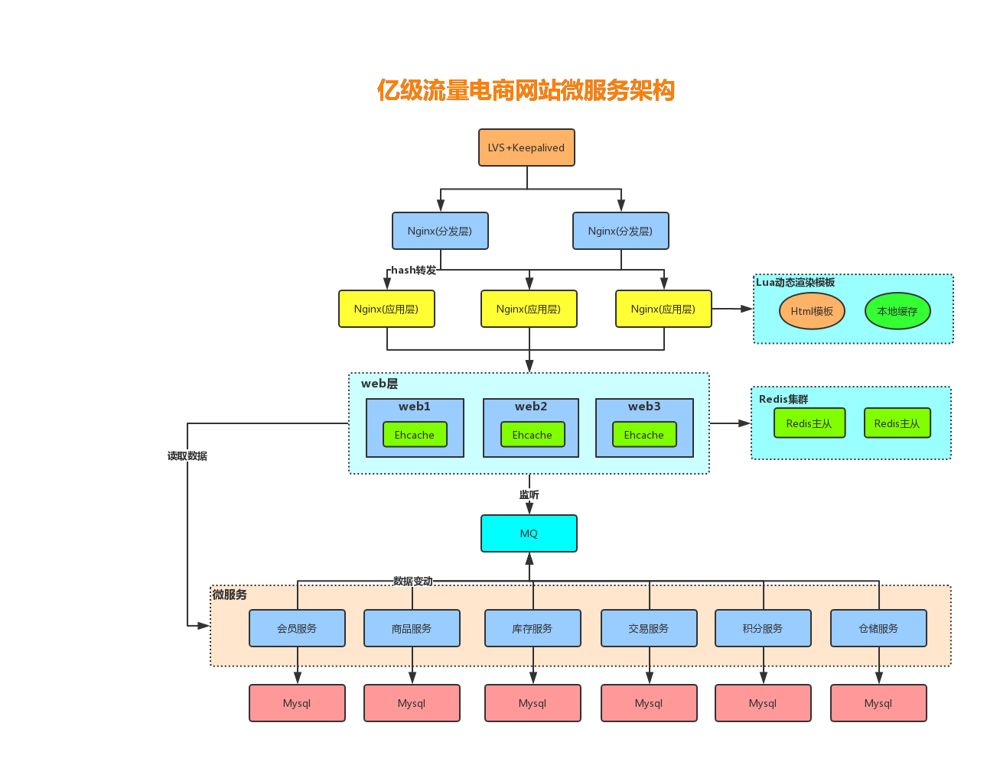

# Redis缓存设计与性能优化

#### 多级缓存架构



## 1. 缓存设计

### 1.1 缓存穿透

缓存穿透是指查询一个根本不存在的数据，缓存层和存储层都不会命中，通常出于容错的考虑，如果从存储层查不到数据则不写入缓存层。缓存穿透将导致不存在的数据每次请求都要到存储层去查询，失去了缓存保护后端存储的意义。造成缓存穿透的基本原因有两个：

- 自身业务代码或者数据出现问题。

- 一些恶意攻击、 爬虫等造成大量空命中。 

缓存穿透问题解决方案通常是**缓存空对象**或**布隆过滤器**。

#### 缓存空对象

示例伪代码：

```java
String get(String key) {
    // 从缓存中获取数据
    String cacheValue = cache.get(key);
    // 缓存为空
    if (StringUtils.isBlank(cacheValue)) {
        // 从存储中获取
        String storageValue = storage.get(key);
        cache.set(key, storageValue);
        // 如果存储数据为空，需要设置一个过期时间(300秒)，防止之后数据库里真的出现此ID
        if (storageValue == null) {
            cache.expire(key, 60 * 5);
        }
        return storageValue;
    } else {
        // 缓存非空
        return cacheValue;
    }
}
```

#### 布隆过滤器

对于恶意攻击，向服务器请求大量不存在的数据造成的缓存穿透，还可以用布隆过滤器先做一次过滤，对于不存在的数据布隆过滤器一般都能够过滤掉，不让请求再往后端发送。当布隆过滤器说**某个值存在时，这个值可能不存在；当它说不存在时，那就肯定不存在。**


布隆过滤器就是**一个大型的位数组和几个不一样的无偏 hash 函数**。所谓无偏就是能够把元素的 hash 值算得比较均匀。

向布隆过滤器中添加 key 时，会使用**多个 hash 函数**对 key 进行 hash 算得一个整数索引值，然后**对位数组长度进行取模**运算得到一个位置，每个 hash 函数都会算得一个不同的位置。再把位数组的这几个位置都置为 1 就完成了 add 操作。

向布隆过滤器询问 key 是否存在时，跟 add 一样，也会把 hash 的几个位置都算出来，看看位数组中这几个位置是否都为 1，只要有一个位为 0，那么说明布隆过滤器中这个key 不存在。如果都是 1，这并不能说明这个 key 就一定存在，只是极有可能存在，因为这些位被置为 1 可能是因为其它的 key 存在所致。如果这个位数组比较稀疏，这个概率就会很大，如果这个位数组比较拥挤，这个概率就会降低。

这种方法适用于数据命中不高、数据相对固定、实时性低（通常是数据集较大）的应用场景，代码维护较为复杂， 但是**缓存空间占用很少**。

可以用guava包自带的布隆过滤器，引入依赖：

```xml
<dependency>
    <groupId>com.google.guava</groupId>
    <artifactId>guava</artifactId>
    <version>22.0</version>
</dependency>
```

示例伪代码：

```java
import com.google.common.hash.BloomFilter;

//初始化布隆过滤器
//1000：期望存入的数据个数，0.001：期望的误差率
BloomFilter<String> bloomFilter = BloomFilter
  								.create(Funnels.stringFunnel(Charset.forName("utf-8")), 1000, 0.001);  

//把所有数据存入布隆过滤器
void init(){
    for (String key: keys) {
        bloomFilter.put(key);
    }
}

String get(String key) {
    // 从布隆过滤器这一级缓存判断下key是否存在
    Boolean exist = bloomFilter.mightContain(key);
    if(!exist){
        return "";
    }
    // 从缓存中获取数据
    String cacheValue = cache.get(key);
    // 缓存为空
    if (StringUtils.isBlank(cacheValue)) {
        // 从存储中获取
        String storageValue = storage.get(key);
        cache.set(key, storageValue);
        // 如果存储数据为空，需要设置一个过期时间(300秒)
        if (storageValue == null) {
            cache.expire(key, 60 * 5);
        }
        return storageValue;
    } else {
        // 缓存非空
        return cacheValue;
    }
}
```

### 1.2 缓存失效

由于大批量缓存在同一时间失效可能导致大量请求同时穿透缓存直达数据库，可能会造成数据库瞬间压力过大甚至挂掉，对于这种情况我们在批量增加缓存时最好将这一批数据的缓存过期时间设置为一个时间段内的不同时间。

示例伪代码：

```java
String get(String key) {
    // 从缓存中获取数据
    String cacheValue = cache.get(key);
    // 缓存为空
    if (StringUtils.isBlank(cacheValue)) {
        // 从存储中获取
        String storageValue = storage.get(key);
        cache.set(key, storageValue);
        // 设置一个过期时间(300到600之间的一个随机数)
        int expireTime = new Random().nextInt(300)  + 300;
        if (storageValue == null) {
            cache.expire(key, expireTime);
        }
        return storageValue;
    } else {
        // 缓存非空
        return cacheValue;
    }
}
```

### 1.3 缓存雪崩

缓存雪崩指的是缓存层支撑不住或宕掉后，流量会像奔逃的野牛一样，打向后端存储层。

由于缓存层承载着大量请求，有效地保护了存储层，但是如果缓存层由于某些原因不能提供服务(比如超大并发过来，缓存层支撑不住，或者由于缓存设计不好，类似大量请求访问bigkey，导致缓存能支撑的并发急剧下降)，于是大量请求都会达到存储层，存储层的调用量会暴增，造成存储层也会级联宕机的情况。 

预防和解决缓存雪崩问题，可以从以下三个方面进行着手：

- 保证缓存层服务高可用性，比如使用Redis Sentinel或Redis Cluster。

- 依赖隔离组件为后端限流并降级。比如使用Hystrix限流降级组件。

- 提前演练。在项目上线前，演练缓存层宕掉后，应用以及后端的负载情况以及可能出现的问题，在此基础上做一些预案设定。

### 1.4 热点缓存key重建优化

开发人员使用“缓存+过期时间”的策略既可以加速数据读写，又保证数据的定期更新，这种模式基本能够满足绝大部分需求。但是有两个问题如果同时出现， 可能就会对应用造成致命的危害：

- 当前key是一个热点key（例如一个热门的娱乐新闻），并发量非常大。
- 重建缓存不能在短时间完成，可能是一个复杂计算，例如复杂的SQL、多次IO、多个依赖等。

在缓存失效的瞬间，有大量线程来重建缓存，造成后端负载加大，甚至可能会让应用崩溃。要解决这个问题主要就是要避免大量线程同时重建缓存。

我们可以利用互斥锁来解决，此方法只允许一个线程重建缓存，其他线程等待重建缓存的线程执行完，重新从缓存获取数据即可。

示例伪代码：

```java
String get(String key) {
    // 从Redis中获取数据
    String value = redis.get(key);
    // 如果value为空， 则开始重构缓存
    if (value == null) {
        // 只允许一个线程重建缓存，使用nx，并设置过期时间ex
        String mutexKey = "mutext:key:" + key;
        if (redis.set(mutexKey, "1", "ex 180", "nx")) {
             // 从数据源获取数据
            value = db.get(key);
            // 回写Redis，并设置过期时间
            redis.setex(key, timeout, value);
            // 删除key_mutex
            redis.delete(mutexKey);
        }// 其他线程休息50毫秒后重试
        else {
            Thread.sleep(50);
            get(key);
        }
    }
    return value;
}
```


## 2. 开发规范与性能优化

### 2.1 键值设计

#### key设计

- 【建议】: 可读性和可管理性

  以业务名(或数据库名)为前缀(防止key冲突)，用冒号分隔，比如【业务名:表名:id】

```
trade:order:1
```

- 【建议】：简洁性

  保证语义的前提下，控制key的长度，当key较多时，内存占用也不容忽视，例如：

```
user:{uid}:friends:messages:{mid} 简化为 u:{uid}:fr:m:{mid}
```

- 【强制】：不要包含特殊字符

> **反例**
>
> 包含空格、换行、单双引号以及其他转义字符

#### value设计

- 【强制】：拒绝bigkey(防止网卡流量、慢查询)

  在Redis中，一个字符串最大512MB，一个二级数据结构（例如hash、list、set、zset）可以存储大约40亿个(2^32-1)个元素，但实际中如果下面两种情况，我就会认为它是bigkey。

  - 字符串类型：它的big体现在单个value值很大，一般认为超过10KB就是bigkey。

  - 非字符串类型：哈希、列表、集合、有序集合，它们的big体现在元素个数太多。

  一般来说，string类型控制在10KB以内，hash、list、set、zset元素个数不要超过5000。

> **反例**
>
> 一个包含200万个元素的list。

> **注意**
>
> 非字符串的bigkey，不要使用del删除，使用hscan、sscan、zscan方式渐进式删除，同时要注意防止bigkey过期时间自动删除问题(例如一个200万的zset设置1小时过期，会触发del操作，造成阻塞）

##### bigkey的危害

- 导致redis阻塞

- 网络拥塞

  bigkey也就意味着每次获取要产生的网络流量较大，假设一个bigkey为1MB，客户端每秒访问量为1000，那么每秒产生1000MB的流量，对于普通的千兆网卡(按照字节算是128MB/s)的服务器来说简直是灭顶之灾，而且一般服务器会采用单机多实例的方式来部署，也就是说一个bigkey可能会对其他实例也造成影响，其后果不堪设想。

- 过期删除

  有个bigkey，它安分守己（只执行简单的命令，例如hget、lpop、zscore等），但它设置了过期时间，当它过期后，会被删除，如果没有使用Redis 4.0的过期异步删除(**lazyfree-lazy-expire yes**)，就会存在阻塞Redis的可能性。

##### bigkey的产生

一般来说，bigkey的产生都是由于程序设计不当，或者对于数据规模预料不清楚造成的，来看几个例子：

- 社交类：粉丝列表，如果某些明星或者大v不精心设计下，必是bigkey。

- 统计类：例如按天存储某项功能或者网站的用户集合，除非没几个人用，否则必是bigkey。

- 缓存类：将数据从数据库load出来序列化放到Redis里，这个方式非常常用，但有两个地方需要注意，第一，是不是有必要把所有字段都缓存；第二，有没有相关关联的数据，有的同学为了图方便把相关数据都存一个key下，产生bigkey。

##### 如何优化bigkey

- 拆

  big list： list1、list2、...listN

  big hash：可以讲数据分段存储，比如一个大的key，假设存了1百万的用户数据，可以拆分成200个key，每个key下面存放5000个用户数据

- 如果bigkey不可避免，也要思考一下要不要每次把所有元素都取出来(例如有时候仅仅需要hmget，而不是hgetall)，删除也是一样，尽量使用优雅的方式来处理。

- 【推荐】：选择适合的数据类型。

  例如：实体类型(要合理控制和使用数据结构，但也要注意节省内存和性能之间的平衡)

> **反例**
>
> ```
> set user:1:name tom
> set user:1:age 19
> set user:1:favor football
> ```
>
> **正例**
>
> ```
> hmset user:1 name tom age 19 favor football
> ```
>

- 【推荐】：控制key的生命周期，redis不是垃圾桶。

  建议使用expire设置过期时间(条件允许可以打散过期时间，防止集中过期)。

### 2.2 命令使用

- 【推荐】 O(N)命令关注N的数量

  例如：hgetall、lrange、smembers、zrange、sinter等并非不能使用，但是需要明确N的值。有遍历的需求可以使用hscan、sscan、zscan代替。

- 【推荐】：禁用命令

  禁止线上使用keys、flushall、flushdb等，通过redis的rename机制禁掉命令，或者使用scan的方式渐进式处理。

- 【推荐】合理使用select

  redis的多数据库较弱，使用数字进行区分，很多客户端支持较差，同时多业务用多数据库实际还是单线程处理，会有干扰。

- 【推荐】使用批量操作提高效率

> 原生命令：例如mget、mset。
> 非原生命令：可以使用pipeline提高效率。

但要注意控制一次批量操作的元素个数(例如500以内，实际也和元素字节数有关)。

> **注意两者不同**
>
> 1. 原生是原子操作，pipeline是非原子操作。
> 2. pipeline可以打包不同的命令，原生做不到
> 3. pipeline需要客户端和服务端同时支持。

- 【建议】Redis事务功能较弱，不建议过多使用，可以用lua替代

### 2.3 客户端使用

- 【推荐】避免多个应用使用一个Redis实例

> **正例**
>
> 不相干的业务拆分，公共数据做服务化。

- 【推荐】使用带有连接池的数据库，可以有效控制连接，同时提高效率，标准使用方式：

```java
JedisPoolConfig jedisPoolConfig = new JedisPoolConfig();
jedisPoolConfig.setMaxTotal(5);
jedisPoolConfig.setMaxIdle(2);
jedisPoolConfig.setTestOnBorrow(true);

JedisPool jedisPool = new JedisPool(jedisPoolConfig, "10.211.55.9", 6379, 3000, null);

Jedis jedis = null;
try {
    jedis = jedisPool.getResource();
    // 具体的命令
    jedis.executeCommand()
} catch (Exception e) {
    logger.error("op key {} error: " + e.getMessage(), key, e);
} finally {
    // 注意这里不是关闭连接，在JedisPool模式下，Jedis会被归还给资源池。
    if (jedis != null) 
        jedis.close();
}
```

连接池参数含义：

| 序号 | 参数名             | 含义                                                         | 默认值           | 使用建议                                          |
| ---- | ------------------ | ------------------------------------------------------------ | ---------------- | ------------------------------------------------- |
| 1    | maxTotal           | 资源池中最大连接数                                           | 8                | 设置建议见下面                                    |
| 2    | maxIdle            | 资源池允许最大空闲的连接数                                   | 8                | 设置建议见下面                                    |
| 3    | minIdle            | 资源池确保最少空闲的连接数                                   | 0                | 设置建议见下面                                    |
| 4    | blockWhenExhausted | 当资源池用尽后，调用者是否要等待。只有当为true时，下面的maxWaitMillis才会生效 | true             | 建议使用默认值                                    |
| 5    | maxWaitMillis      | 当资源池连接用尽后，调用者的最大等待时间(单位为毫秒)         | -1：表示永不超时 | 不建议使用默认值                                  |
| 6    | testOnBorrow       | 向资源池借用连接时是否做连接有效性检测(ping)，无效连接会被移除 | false            | 业务量很大时候建议设置为false(多一次ping的开销)。 |
| 7    | testOnReturn       | 向资源池归还连接时是否做连接有效性检测(ping)，无效连接会被移除 | false            | 业务量很大时候建议设置为false(多一次ping的开销)。 |
| 8    | jmxEnabled         | 是否开启jmx监控，可用于监控                                  | true             | 建议开启，但应用本身也要开启                      |

#### 优化建议

##### maxTotal

最大连接数，早期的版本叫maxActive。实际上这个是一个很难回答的问题，考虑的因素比较多：

- 业务希望Redis并发量

   - 客户端执行命令时间
   - Redis资源：例如 nodes(例如应用个数) * maxTotal 是不能超过redis的最大连接数maxclients。
   - 资源开销：例如虽然希望控制**空闲连接**(连接池此刻可马上使用的连接)，但是不希望因为连接池的频繁释放创建连接造成不必靠开销。

> **示例**
>
> - 一次命令时间（borrow|return resource + Jedis执行命令(含网络) ）的平均耗时约为1ms，一个连接的QPS大约是1000
> - 业务期望的QPS是50000
>
> 那么理论上需要的资源池大小是50000 / 1000 = 50个。但事实上这是个理论值，还要考虑到要比理论值预留一些资源，通常来讲maxTotal可以比理论值大一些。

这个值不是越大越好，一方面连接太多占用客户端和服务端资源，另一方面对于Redis这种高QPS的服务器，一个大命令的阻塞即使设置再大资源池仍然会无济于事。

##### maxIdle和minIdle

maxIdle实际上才是业务需要的最大连接数，maxTotal是为了**给出余量**，所以maxIdle不要设置过小，否则会有new Jedis(新连接)开销。

**连接池的最佳性能是maxTotal = maxIdle**，这样就避免连接池伸缩带来的性能干扰。但是如果并发量不大或者maxTotal设置过高，会导致不必要的连接资源浪费。一般推荐maxIdle可以设置为按上面的业务期望QPS计算出来的理论连接数，maxTotal可以再放大一倍。

minIdle（最小空闲连接数），与其说是最小空闲连接数，不如说是"**至少需要保持的空闲连接数**"，在使用连接的过程中，如果连接数超过了minIdle，那么继续建立连接，如果超过了maxIdle，当超过的连接执行完业务后会慢慢被移出连接池释放掉。

如果系统启动完马上就会有很多的请求过来，那么可以给redis连接池做**预热**，比如快速的创建一些redis连接，执行简单命令，类似ping()，快速的将连接池里的空闲连接提升到minIdle的数量。

**连接池预热**示例代码：

```java
List<Jedis> minIdleJedisList = new ArrayList<Jedis>(jedisPoolConfig.getMinIdle());

for (int i = 0; i < jedisPoolConfig.getMinIdle(); i++) {
    Jedis jedis = null;
    try {
        jedis = pool.getResource();
        minIdleJedisList.add(jedis);
        jedis.ping();
    } catch (Exception e) {
        logger.error(e.getMessage(), e);
    } finally {
        //注意，这里不能马上close将连接还回连接池，否则最后连接池里只会建立1个连接。。
        //jedis.close();
    }
}
//统一将预热的连接还回连接池
for (int i = 0; i < jedisPoolConfig.getMinIdle(); i++) {
    Jedis jedis = null;
    try {
        jedis = minIdleJedisList.get(i);
        //将连接归还回连接池
        jedis.close();
    } catch (Exception e) {
        logger.error(e.getMessage(), e);
    } finally {
    }
}
```

总之，要根据实际系统的QPS和调用redis客户端的规模整体评估每个节点所使用的连接池大小。

###### 3. 【建议】高并发下建议客户端添加熔断功能(例如netflix hystrix)

###### 4. 【推荐】设置合理的密码，如有必要可以使用SSL加密访问

###### 5. 【建议】**Redis对于过期键有三种清除策略：**

- 被动删除：当读/写一个已经过期的key时，会触发惰性删除策略，直接删除掉这个过期key

- 主动删除：由于惰性删除策略无法保证冷数据被及时删掉，所以Redis会定期主动淘汰一批已过期的key
- 当前已用内存超过**maxmemory**限定时，触发主动清理策略

当REDIS运行在主从模式时，只有主结点才会执行被动和主动这两种过期删除策略，然后把删除操作”del key”同步到从结点。

第三种策略的情况如下：

当前已用内存超过**maxmemory**限定时，会触发主动清理策略

根据自身业务类型，选好maxmemory-policy(最大内存淘汰策略)，设置好过期时间。如果不设置最大内存，当 Redis 内存超出物理内存限制时，内存的数据会开始和磁盘产生频繁的交换 (swap)，会让 Redis 的性能急剧下降。

默认策略是**volatile-lru（Least Recently Used）**，即超过最大内存后，在过期键中使用lru算法进行key的剔除，保证**不过期数据不被删除**（只清除设置了过期时间的key），但是可能会出现OOM问题。

其他策略如下：

- allkeys-lru：根据LRU算法删除键，不管数据有没有设置超时属性，直到腾出足够空间为止。
- allkeys-random：随机删除所有键，直到腾出足够空间为止。
- volatile-random: 随机删除过期键，直到腾出足够空间为止。
- volatile-ttl：根据键值对象的ttl属性，删除最近将要过期数据。如果没有，回退到noeviction策略。
- noeviction：不会剔除任何数据，拒绝所有写入操作并返回客户端错误信息"(error) OOM command not allowed when used memory"，此时Redis只响应读操作。