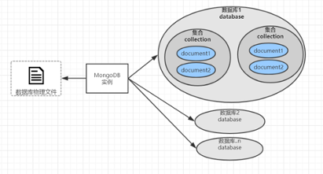

# MongoDB 快速上手

## 1. MongoDB的体系结构

### 1.1 NoSql的概念

NoSQL（NoSQL = Not Only SQL)，互联网的早期我们的数据大多以关系型数据库来存储的。其特点是规范的数据结构（预定义模式）、强一至性、表与表之间通过外键进行关联，这些特征使我们对数据的管理更加清晰和严谨，但随着互联网的发展数据成爆炸式的增长我们对数据库需要更好的灵活性和更快的速度。这就是NoSql可以做到的。它不需要预先定义模式，没有主外键关联、支持分片、支持副本。

#### NoSql的分类

##### 键值(Key-Value)存储数据库

这一类数据库主要会使用到一个哈希表，这个表中有一个特定的键和一个指针指向特定的数据。Key/value模型对于IT系统来说的优势在于简单、易部署。但是如果DBA只对部分值进行查询或更新的时候，Key/value就显得效率低下了。举例如：Tokyo Cabinet/Tyrant，Redis，Voldemort，Oracle BDB。

##### 列存储数据库

这部分数据库通常是用来应对分布式存储的海量数据。键仍然存在，但是它们的特点是指向了多个列。这些列是由列家族来安排的。如：Cassandra，HBase，Riak.

##### 文档型数据库

文档型数据库的灵感是来自于Lotus Notes办公软件的，而且它同第一种键值存储相类似。该类型的数据模型是版本化的文档，半结构化的文档以特定的格式存储，比如JSON。文档型数据库可 以看作是键值数据库的升级版，允许之间嵌套键值。而且文档型数据库比键值数据库的查询效率更高。如：CouchDB，MongoDB。国内也有文档型数据库SequoiaDB，已经开源。

##### 图形(Graph)数据库

图形结构的数据库同其他行列以及刚性结构的SQL数据库不同，它是使用灵活的图形模型，并且能够扩展到多个服务器上。NoSQL数据库没有标准的查询语言（SQL），因此进行数据库查询需要制定数据模型。许多NoSQL数据库都有REST式的数据接口或者查询API。如：Neo4J，InfoGrid，Infinite Graph。

### 1.2 NoSql的应用场景

NoSQL数据库在以下的这几种情况下比较适用：

1. 数据模型比较简单；

2. 需要灵活性更强的IT系统；

3. 对数据库性能要求较高；

4. 不需要高度的数据一致性；

### 1.3 MongoDB的逻辑组成

#### 体系结构



###### 逻辑结构对比

| **关系型数据库**                   | **MongoDB**                           |
| ---------------------------------- | ------------------------------------- |
| database（数据库）                 | database（数据库）                    |
| table（表）                        | collection（集合）                    |
| row（行）                          | document（BSON 文档）                 |
| column（列）                       | field（字段）                         |
| index（唯一索引、主键索引）        | index（全文索引）                     |
| join（主外键关联）                 | embedded  Document（嵌套文档）        |
| primary  key（指定1至N个列做主键） | primary  key（指定_id field做为主键） |
| aggreation（groupy）               | aggreation（pipeline mapReduce）      |

配置⽂件示例

```bash
vim ./conf/mongo.conf
```

内容

```bash
dbpath=data/mongo/
port=27017
bind_ip=0.0.0.0
fork=true
logpath=logs/mongodb.log
logappend=true
auth=false
```

以配置⽂件⽅式启动

```bash
./bin/mongod -f conf/mongo.conf 
```


## 2. MongoDB安装配置与基础命令

### 2.1 下载

下载地址：https://www.mongodb.com/download-center/community

```bash
# 下载
wget https://fastdl.mongodb.org/linux/mongodb-linux-x86_64-4.0.5.tgz 
# 解压
tar -zxvf mongodb-linux-x86_64-4.0.5.tgz
```

### 2.2 启动参数

mongoDb 由C++编写，下载的包可以直接启动

```bash
# 创建数据库目录
mkdir -p /data/mongo
# 启动mongo
./bin/mongod --dbpath=/data/mongo/
```

#### 常规参数

| 参数      | 说明                         |
| --------- | ---------------------------- |
| dbpath    | 数据库目录，默认/data/db     |
| bind_ip   | 监听IP地址，默认全部可以访问 |
| port      | 监听的端口，默认27017        |
| logpath   | 日志路径                     |
| logappend | 是否追加日志                 |
| auth      | 是开启用户密码登陆           |
| fork      | 是否已后台启动的方式登陆     |
| config    | 指定配置文件                 |

#### 配置文件示例

```bash
vim ./conf/mongo.conf
```

内容：

```bash
dbpath=data/
port=27017
bind_ip=0.0.0.0
fork=true
logpath=data/mongodb.log
logappend=true
auth=false
```

以配置文件方式启动

```bash
./bin/mongod -f conf/mongo.conf 
```

### 2.3 客户端Shell 的使用及参数说明

```bash
#启动客户端 连接 本机的地的默认端口
./bin/mongo 
# 指定IP和端口
./bin/mongo --host=127.0.0.1 --port=27017
```

mongo shell 是一个js 控台，可以执行js 相关运算如:

```bash
> 1+1
2
> var i=123;
> print(i)
123
>  
```

### 2.4 数据库与集合的基础操作

```js
// 查看数据库
show dbs;
// 切换数据库
use luban;
// 创建数据库与集合，在插入数据时会自动 创建数据库与集和
db.friend.insertOne({name:"wukong",sex:"man"});
// 查看集合
show tables;
show collections;
// 删除集合
db.friend.drop();
// 删除数据库
db.dropDatabase();
```


## 3. MongoDB CRUD

### 3.1 数据的新增的方式

Mongodb数据插入的说明：

1. 数据库的新增不需要序先设计模型结构，插入数据时会自动创建。

2. 同一个集合中不同数据字段结构可以不一样

```js
// 插入单条 
db.friend.insertOne({name:"wukong"，sex:"man"});

// 插入多条
db.friend.insertMany([
		{name:"wukong",sex:"man"},
  	{name:"diaocan",sex:"woman",age:18,birthday:new Date("1995-11-02")},
  	{name:"zixiao",sex:"woman"}
]);

// 指定ID 
db.friend.insert([
		{_id:1,name:"wokong",sex:"man",age:1},
		{_id:2,name:"diaocan",sex:"women",birthday:new Date("1988-11-11")}
])
```

### 3.2 数据的查询

###### 基础数据脚本

```js
// 职工信息
db.emp.insert([
    {_id:1101,name:'鲁班',job:'讲师',dep:'讲师部',salary:10000},
    {_id:1102,name:'悟空',job:'讲师',dep:'讲师部',salary:10000},
    {_id:1103,name:'诸葛',job:'讲师',dep:'讲师部',salary:10000},
    {_id:1105,name:'赵云',job:'讲师',dep:'讲师部',salary:8000},
    {_id:1106,name:'韩信',job:'校长',dep:'校办',salary:20000},
    {_id:1107,name:'貂蝉',job:'班主任',dep:'客服部',salary:8000},
    {_id:1108,name:'安其',job:'班主任',dep:'客服部',salary:8000},
    {_id:1109,name:'李白',job:'教务',dep:'教务处',salary:8000},
    {_id:1110,name:'默子',job:'教务',dep:'教务处',salary:8000},
    {_id:1111,name:'大乔',job:'助教',dep:'客服部',salary:5000},
    {_id:1112,name:'小乔',job:'助教',dep:'客服部',salary:3000},
]);

// 学生信息
db.student.insertMany([
    {_id:"001",name:"陈霸天",age:5,grade:{redis:87,zookeper:85,dubbo:90}},
    {_id:"002",name:"张明明",age:3,grade:{redis:86,zookeper:82,dubbo:59}},
    {_id:"003",name:"肖炎炎",age:2,grade:{redis:81,zookeper:94,dubbo:88}},
    {_id:"004",name:"李鬼才",age:6,grade:{redis:48,zookeper:87,dubbo:48}}
])


// 学生科目
db.subject.insertMany([
    {_id:"001",name:"陈霸天",subjects:["redis","zookeper","dubbo"]},
    {_id:"002",name:"张明明",subjects:["redis","Java","mySql"]},
    {_id:"003",name:"肖炎炎",subjects:["mySql","zookeper","bootstrap"]},
    {_id:"004",name:"李鬼才",subjects:["Java","dubbo","Java"]},
])


db.subject2.insertMany([
		{_id:"001",name:"陈霸天",subjects:[{name:"redis",hour:12},{name:"dubbo",hour:120},{name:"zookeper",hour:56}]},
    {_id:"002",name:"张明明",subjects:[{name:"java",hour:120},{name:"mysql",hour:10},{name:"oracle",hour:30}]},
    {_id:"003",name:"肖炎炎",subjects:[{name:"mysql",hour:12},{name:"html5",hour:120},{name:"netty",hour:56}]},
    {_id:"004",name:"李鬼才",subjects:[{name:"redis",hour:12},{name:"dubbo",hour:120},{name:"netty",hour:56}]}
])

// 课程项目
db.project.insert([
  	{_id:1,name:"Java Script",description:"name is js and jquery"},
		{_id:2,name:"Git",description:"Git is a free and open source distributed version control system designed to handle everything from small to very large projects with speed and efficiency"},
		{_id:3,name:"Apache dubbo",description:"Apache Dubbo  is a high-performance, java based open source RPC framework.阿里 开源 项目"},
		{_id:4,name:"Redis", description:"Redis is an open source (BSD licensed), in-memory data structure store, used as a database, cache and message broker. It supports data structures"},
		{_id:5,name:"Apache ZooKeeper",description:"Apache ZooKeeper is an effort to develop and maintain an open-source server which enables highly reliable distributed coordination"}
])
```

#### 基础查询

- 值运算：$in , $gt , $gte , $lt , $lte , $all
- 逻辑运算：$and , $or

```js
// 基于ID查找
db.emp.find({_id:1101})
// 基于属性查找
db.emp.find({"name":"鲁班"})
// && 运算 与大于 运算
db.emp.find({"job":"讲师","salary":{$gt:8000}})
// in 运算
db.emp.find({"job":{$in:["讲师","班主任"]}})
// or 运算
db.emp.find({
  	$or:[{job:"讲师"},{dep:"客服部"}]
})
db.emp.find({
  	$or:[{"name":"貂蝉"},{salary:{$gte:8000}}]
})
```

#### 排序与分页

```js
// sort 表示按照哪些属性排序，以及正序还是倒序
// skip 表示跳过几条数据，比如每页5条，要查询第3页，则跳过前2页，skip(5*2)
// limit 表示查询出几条数据
db.emp.find().sort({dep:1,salary:-1}).skip(5*2).limit(5)
```

#### 嵌套查询

```js
// 错误示例：grade的值不完整或者错误，无结果
db.student.find({
  	grade:{"redis":87,"dubbo":90}
})
db.student.find({
  	grade:{redis:87,zookeper:85}
})

// 基于复合属性查找 时必须包含其所有的值 并且顺序一至
db.student.find({
  	grade:{"redis":87,"zookeper":85,"dubbo":90}
})
// 基于复合属性当中的指定值 查找。注：名称必须用双引号
db.student.find({
  	"grade.redis":87
});
db.student.find({
  	"grade.redis":{$gt:80}
})
```

#### 数组查询

```js
// 错误示例：subjects值不完整或数组元素顺序错误，无结果
db.subject.find({
  	subjects:["redis","zookeper"]
})
db.subject.find({
  	subjects:["zookeper","redis","dubbo"]
})

// 与嵌套查询一样，必须是所有的值 并且顺序一至
db.subject.find({
  	subjects:["redis","zookeper","dubbo"]
})
// $all 匹配数组中包含该两项的值。注：顺序不作要求
db.subject.find({
  	subjects:{$all:["redis","zookeper"]}
})
// 简化数组查询
db.subject.find({subjects:"redis"})
// 简化数组查询 ，匹配数组中存在任意一值。与$all相对应
db.subject.find({
  	subjects:{$in:["redis","zookeper"]}
})
```

#### 数组嵌套查询

```js
// 基础查询，必须查询全部，且顺序一至
db.subject2.find({
  	subjects:{name:"redis",hour:12}
})
// 指定查询第一个数组，课时大于12
db.subject2.find({
  	"subjects.0.hour":{$gt:12}
})
// 查询任科目，课时大于12
db.subject2.find({
  	"subjects.hour":{$gt:12}
})
// $elemMatch元素匹配，指定属性满足，不要求顺序一至
db.subject2.find({
  	subjects:{
      	$elemMatch:{name:"redis",hour:12}
    }
})
// 匹配数组中符合条件的元素，如果不加$elemMatch，
// 则会把{name:redis,hour:{$gt:10}}作为一个完整的数组元素对象来匹配，而不会执行大于10的匹配
db.subject2.find({
  	subjects: {
      	$elemMatch:{
          	name:"redis",hour:{$gt:10}
        }
    }
})
// 数组中任意元素匹配，不限定在同一个对象当中
db.subject2.find({
  	"subjects.name":"mysql","subjects.hour":120
})
```

> **操作符**
>
> $elemMatch：对子元素进行逻辑运算

### 3.3 数据的修改与删除

**db.表.update( 条件, {设置值}, false, false )**

操作符：

- $set：设置值
- $unset：删除指定字段
- $inc：自增
- $set：修改

```js
// 设置值
db.emp.update(
  	{_id:1101},
  	{$set:{salary:10300}}
)
// 自增
db.emp.update(
  	{_id:1101},
  	{$inc:{salary:200}}
)
// 基于条件，只会更新第一条 
db.emp.update(
  	{"dep":"客服部"},
  	{$inc:{salary:100}}
)
// 更新所有符合条件的数据
db.emp.updateMany(
  	{"dep":"客服部"},
  	{$inc:{salary:100}}
)
// $unset删除字段，数字1可以随意填
db.subject2.update(
  	{"_id":"001"},
  	{$unset:{"subjects":1}}
)
```

#### 嵌套数组修改

运算符

- $addToSet：添加至集合（命令区分大小写）
- $push：推送至集合
- $pull：从集合中删除
- $pop：删除集合中的两端未尾元素。

###### $addToSet

添加至集合，多次执行不会重复插入

```js
db.subject2.update(
  	{"_id":"001"},
  	{
      	$addToSet:{
    				"subjects":{"name":"mongodb","hour":20}
        }
    }
)
```

###### $push

推送至集合，多次执行会多次添加元素

```js
db.subject2.update(
  	{"_id":"001"},
  	{
      	$push:{
      			"subjects":{"name":"mongodb","hour":20}
        }
    }
)
```

###### $pull

将匹配的元素项，从集合中全部删除

```js
// 仅匹配一个字段
db.subject2.update(
  	{"_id":"001"},
  	{
      	$pull:{
          	"subjects":{"name":"mongodb"}
        }
    }
)
```

> **注意**：$addToSet、$push、$pull 均可操作数组，效果等同于执行多次数组中元素。
>
> ```js
> db.subject2.update(
>     {"_id":"001"},
>     {
>       	$addToSet:{
>       			"subjects":[
>               	{"name":"mongodb","hour":20},
>               	{"name":"mongodb2","hour":22}
>             ]
>         }
>     }
> )
> ```

###### $pop

删除集合中的两端未尾元素。

```js
// -1 删除队首元素
db.subject2.update(
  	{"_id":"001"},
  	{
      	$pop:{"subjects":-1}
    }
)
// 1 删除队尾元素
db.subject2.update(
  	{"_id":"002"},
  	{
      	$pop:{"subjects":1}
    }
)
```

> **注意**
>
> 值仅能是 1 或 -1，不能是其它值

###### $elemMatch

基于条件删除数组元素：

```js
// 删除id=001中hour大于10的元素，无法删除，因为此处会将{"hour":{$gt:10}}作为一个对象识别
db.subject2.update(
  	{"_id":"003"},
  	{
      	$pull:{
          	"subjects":{"hour":{$gt:10}}
        }
    }
)
// 使用$elemMatch运行算符
db.subject2.update(
  	{"_id":"004"},
  	{
      	$pull:{
          	"subjects":{
              	$elemMatch:{"hour":{$gt:10}}
            }
        }
    }
)
```

> **注意**
>
> **upsert** 更新时如果记录不存在，将会进行插入操作
>
> ```js
> db.subject2.update(
>   	{"_id":"009"},
>   	{$set:{"name":"陈陈"}},
>   	true
> )
> ```

##### 更新多条记录：

默认情况下，update只会更新单条记录，更新多条需要添加第四个参数为true

```js
// 只更新第一条
db.subject2.update(
  	{},
  	{$set:{"name":"陈"}},
  	true,
  	false
)
// 更新全部
db.subject2.update(
    {},
    {$set:{"name":"陈"}},
    true,
    true
)
// 更新全部
db.subject2.updateMany(
    {},
    {$set:{"name":"陈"}}
)
```

### 3.4 删除

```js
// 基于查找删除
db.emp.deleteOne({_id:1101})
// 删除整个集合
db.project.drop()
// 删除库
db.dropDatabase()
```


 