#  MongoDB集群架构与高级特性

## 1. MongoDB的聚合操作

#### pipeline 与 mapRedurce 比较

pipeline 速度快，但只能运行在单机上，适合数据量小的实时聚合操作。

mapRedurce 可以运行在分布式节点，适适大数量并且复杂的聚合分析操作

### 1.1 pipeline 聚合

pipeline 聚合其特性是运行速度快，只能运行在单机上，并且对资源的使用有一定限制如下：

* 单个的聚合操作耗费的内存不能超过20%
* 返回的结果集大小在16M以内

#### 语法说明

aggredate 方法接收任意多个参数，每个参数都是一个具体类别的聚合操作，通过参数的顺序组成一个执行链。每个操作执行完后将返回结果交给下一个操作，直到最后产出结果。

```js
db.collection.aggregate(match,project,group,...)
```

#### pipeline相关运算符

* $match：匹配过滤聚合的数据
* $project：返回需要聚合的字段
* $group：统计聚合数据，必须指定_id列
  * $max：求出最大值
  * $sum：求和
  * $avg：求平均值
  * $push：将结果插入至一个数组当中
  * $addToSet：将结果插入至一个数组当中，并去重
  * $first：取第一个值
  * $last：取最后一个值
* $limit：用来限制MongoDB聚合管道返回的文档数。
* $skip：在聚合管道中跳过指定数量的文档，并返回余下的文档。
* $unwind：（flatmap）将文档中的某一个数组类型字段拆分成多条，每条包含数组中的一个值。
* $sort：将输入文档排序后输出。

##### 示例

原始数据：

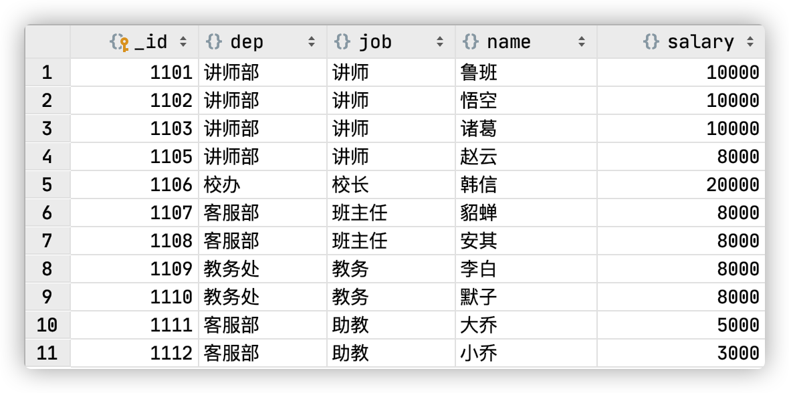


###### `$match` 条件过滤 

```js
db.emp.aggregate({$match:{"job":"讲师"}})
```


###### `$project` 指定列返回

```js
// 返回指定例，_id 自动带上
db.emp.aggregate(
  	{$match:{"job":"讲师"}},
  	{$project:{"job":1,"salary":1}}
)
```

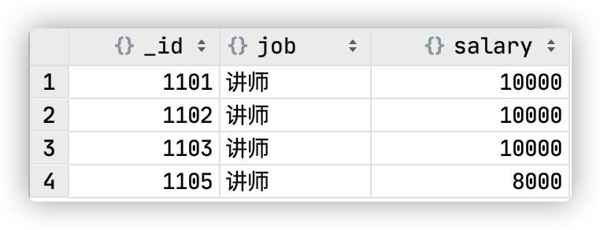

```js
// 返回指定列，并修改列名
db.emp.aggregate(
  	{$match:{"job":"讲师"}},
  	{$project:{"工作":"$job","薪水":"$salary"}}
)
```

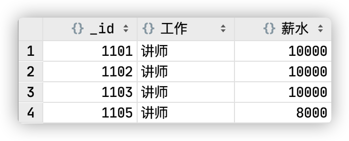


###### `$group` 操作 ( 必须指定_id 列)  

```js
// 基于工作分组，并求出薪水总和
db.emp.aggregate({
  	$group:{_id:"$job",total:{$sum:"$salary"}}
})
```

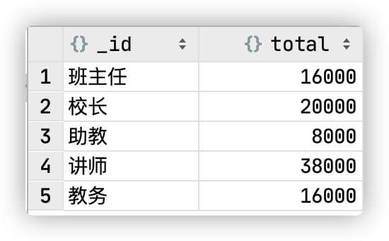

```js
// 求出薪水最大值
db.emp.aggregate({
  	$group:{_id:"$job",total:{$max:"$salary"}}
})
```

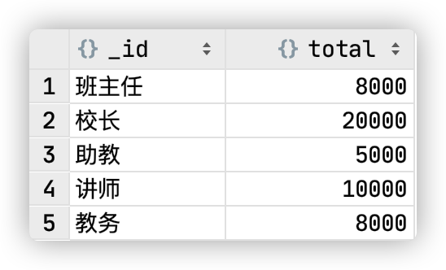

```js
// 将所有薪水添加列表
db.emp.aggregate({
  	$group:{_id:"$job",total:{$push:"$salary"}}
})
```

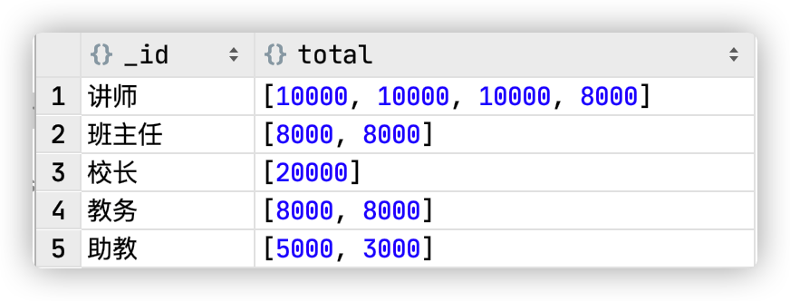

```js
// 将所有薪水添加列表，并去重
db.emp.aggregate({
  	$group:{_id:"$job",total:{$addToSet:"$salary"}}
})
```

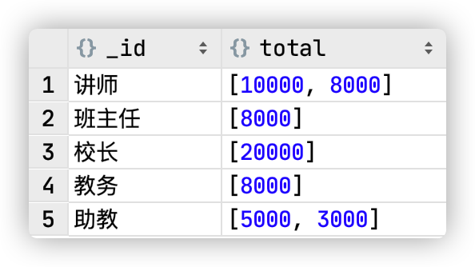

```js
// 取第一个值
db.emp.aggregate({
  	$group:{_id:"$job",first:{$first:"$salary"}}
})
```

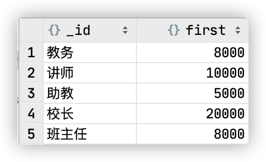

```js
// 取最后一个值
db.emp.aggregate({
  	$group:{_id:"$job",last:{$last:"$salary"}}
})
```

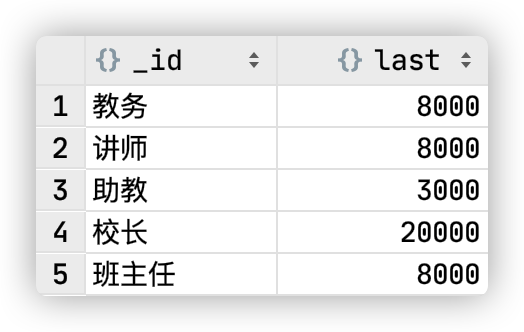


###### 聚合操作可以任意个数和顺序的组合

```js
// 二次过滤
db.emp.aggregate(
  	{$match:{"job":"讲师"}},
  	{$project:{"工作":"$job","薪水":"$salary"}},
  	{$match:{"薪水":{$gt:8000}}}
)
```

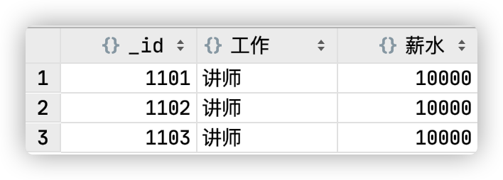


###### `$skip` 与 `$limit` 跳转，并限制返回数量   

```js
db.emp.aggregate(
  	{$group:{_id:"$job",total:{$push:"$salary"}}},
  	{$limit:4},
  	{$skip:2}
)
```

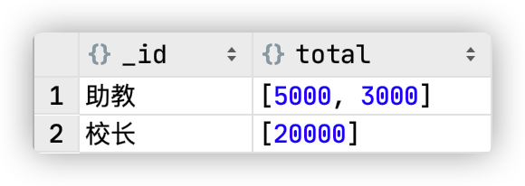


###### `$sort` 排序 

```js
db.emp.aggregate(
  	{$project:{"工作":"$job","salary":1}},
  	{$sort:{"salary":1,"工作":1}}
)
```

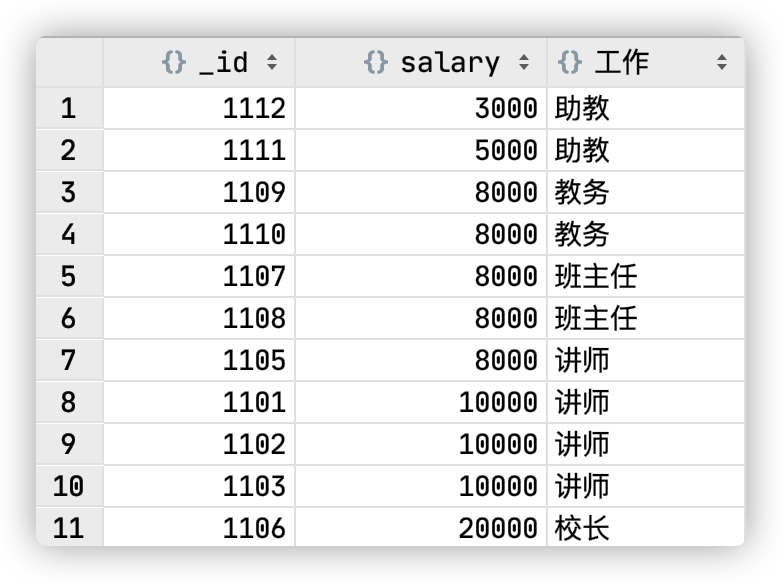


###### `unwind` 操作，将数组拆分成多条记录

```js
db.emp.aggregate(
  	{$group:{_id:"$job",total:{$push:"$salary"}}},
  	{$unwind:"$total"}
)
```

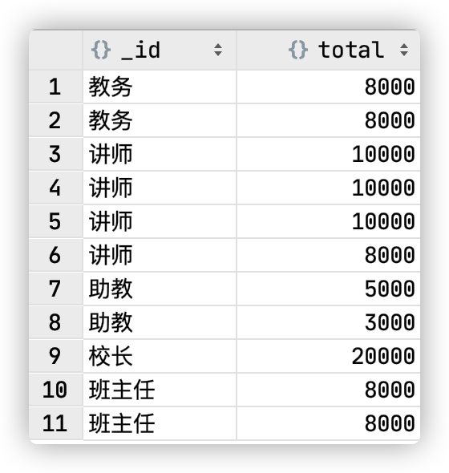


### 1.2 mapRedurce聚合

mapRedurce 非常适合实现非常复杂 并且数量大的聚合计算，其可运行在多台节点上实行分布式计算。

#### mapRedurce概念

MapReduce 现大量运用于hadoop大数据计算当中，其最早来自于 google 的一遍论文，解决大PageRank搜索结果排序的问题。其大至原理如下：

#### mongodb中mapRedurce的使用流程

1. 创建map函数
2. 创建redurce函数
3. 将map、redurce 函数添加至集合中，并返回新的结果集
4. 查询新的结果集

#### 示列

基础示例

```js
// 创建map对象
var map1 = function (){
  	// 内置函数 key，value
		emit(this.job, this.name); 
}
// 创建reduce对象 
var reduce1 = function(job, count){
		return Array.sum(count);
}
// 执行mapReduce任务，并将结果放到新的集合 result 当中
db.emp.mapReduce(map1, reduce1, {out: "result"}).find()
// 查询新的集合
db.result.find()
```

 使用复合对象作为key

```js
// 使用复合对象作为key
var map2 = function (){
		emit({"job": this.job, "dep": this.dep},{"name": this.name, "dep": this.dep});
}
var reduce2 = function(key, values){
		return values.length;
}
 
db.emp.mapReduce(map2, reduce2, {out: "result2"}).find()
```

调式 mapReduce 执行

```js
var emit = function(key, value){
		print(key + ":" + value);
}
```


## 2. MongoDB的索引特性

### 2.1 索引的基础概念

查看执行计划：

```js
db.emp.find({"salary":{$gt:500}}).explain()
```

> 结果如下，可以看到stage为COLLSCAN，表示全表扫描。
>
> ```json
> "winningPlan": {
>   "stage": "LIMIT",
>   "limitAmount": 1,
>   "inputStage": {
>     "stage": "COLLSCAN",
>     "filter": {
>       "salary": {
>       	"$gt": 500
>       }
>     },
>     "direction": "forward"
>   }
> }
> ```

创建简单索引

```js
// 创建索引
db.emp.createIndex({salary:1})

// 查看索引
db.emp.getIndexes()
```


```js
// 查看执行计划，可以看到 `"stage": "IXSCAN"`，表示使用索引查询。
db.emp.find({"salary":{$gt:500}}).explain()
```

### 2.2 单键索引

单个例上创建索引：

```js
db.subject.createIndex({"name":1})
```

嵌套文档中的列创建索引

```js
db.subject.createIndex({"grade.redis":1})
```

整个文档创建索引

```js
db.subject.createIndex({"grade":1})
```

查看索引

```js
db.subject.getIndexes()
```


### 2.3 多键索引

创建多键索引

```js
db.subject.createIndex({"subjects":1})
```

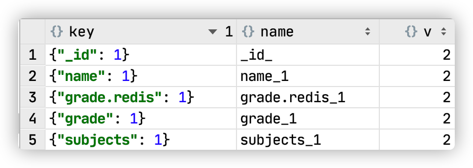


### 2.4 复合索引（组合索引）

创建复合索引

```js
db.emp.createIndex({"job":1,"salary":-1})
```

查看执行计划，可以看到 `"stage": "IXSCAN"` 都使用了索引：

```js
// "stage": "IXSCAN" 使用索引
db.emp.find({"job":"讲师","salary":{$gt:500}}).explain()

// "stage": "IXSCAN" 使用索引
db.emp.find({"salary":{$gt:5000},"job":"讲师"}).explain()

// "stage": "IXSCAN" 使用索引
db.emp.find({"job":"讲师"}).explain()

// "stage": "IXSCAN" 使用索引
db.emp.find({"salary":{$gt:500}}).explain()
```

复合索引在排序中的应用：

```js
// 完全匹配 => 走索引
db.emp.find({}).sort({"job":1,"salary":-1}).explain()

// 完全不匹配 => 走索引
db.emp.find({}).sort({"job":-1,"salary":1}).explain()

// 一半匹配 => 不走索引
db.emp.find({}).sort({"job":1,"salary":1}).explain()

// 一半匹配 => 不走索引
db.emp.find({}).sort({"job":-1,"salary":-1}).explain()

// => 走索引，最左匹配原则
db.emp.find({}).sort({"job":-1}).explain()

// => 走索引，这是因为之前2.1章节建立了salary的索引
db.emp.find({}).sort({"salary":-1}).explain()
```

### 2.5 过期索引

过期索引存在一个过期的时间，如果时间过期，相应的数据会被自动删除

```js
// 插入数据
db.log.insert({"title":"this is logger info","createTime":new Date()})

// 创建过期索引
db.log.createIndex({"createTime":1},{expireAfterSeconds:10})
```

### 2.6 全文索引

创建全文索引

```js
db.project.createIndex({"name":"text","description":"text"})
```

使用全文索引进行查询

```js
db.project.find({$text:{$search:"java dubbo"}})
```


`-` 用于屏蔽关键字 

```js
db.project.find({$text:{$search:"java -dubbo"}})
```


短语查询,`\"` 包含即可

```js
db.project.find({$text:{$search:"\"Apache Dubbo\""}})
```


中文查询

```js
db.project.find({$text:{$search:"阿里 开源"}})
```

