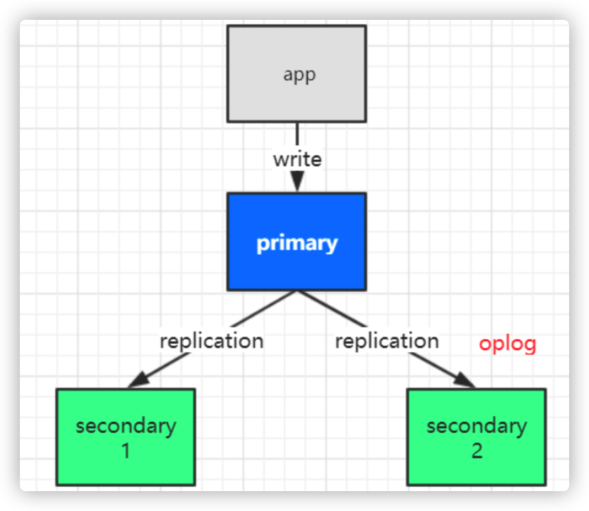
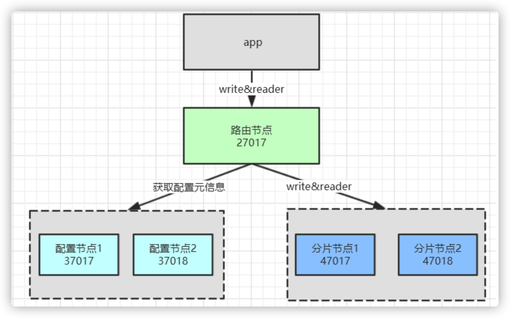

# MongoDB企业应用实战

## 1. MongoDB 复制集特性

### 1.1 复制集群的架构



### 1.2 复制集群搭建基础示例

- 假设有3台服务器，IP分别为 `10.211.55.9`，`10.211.55.10`，`10.211.55.11`

- 主节点配置

```bash
dbpath=data
port=27017
fork=true
bind_ip=0.0.0.0
logpath=logs/master.log
replSet=tyrival
```

- 从节点1配置

```bash
dbpath=data
port=27018
fork=true
bind_ip=0.0.0.0
logpath=logs/slave1.log
replSet=tyrival
```

- 从节点2配置

```bash
dbpath=data
port=27019
fork=true
bind_ip=0.0.0.0
logpath=logs/slave2.log
replSet=tyrival
```

- 分别启动三个节点

```bash
./bin/mongod -f conf/master.conf
./bin/mongod -f conf/slave1.conf
./bin/mongod -f conf/slave2.conf
```

- 进入其中一个节点

```bash
# 假设进入10.211.55.9
./bin/mongo

# 可以查看集群状态，可以看到"errmsg" : "not master and slaveOk=false"
show dbs;
```

- 集群复制配置管理

```js
// 查看复制集群的帮助方法
rs.help()
```

- 添加配置

```js
// 声明配置变量
var cfg = {
  	"_id": "tyrival",
    "members": [
        {"_id": 1, "host": "10.211.55.9:27017"},
        {"_id": 2, "host": "10.211.55.10:27018"}
    ]
}
// 初始化配置
rs.initiate(cfg)
/*
  可以看到如下信息：
  {
    "ok" : 1,
    "$clusterTime" : {
      "clusterTime" : Timestamp(1597996780, 1),
      "signature" : {
        "hash" : BinData(0,"AAAAAAAAAAAAAAAAAAAAAAAAAAA="),
        "keyId" : NumberLong(0)
      }
    },
    "operationTime" : Timestamp(1597996780, 1)
  }
 */

// 查看集群状态，可以看到集群已建立完成
rs.status()
```

- 变更节点示例

```js
// 插入新的复制节点
rs.add("10.211.55.11:27019")
// 删除slave 节点
rs.remove("10.211.55.11:27019")
```

- 演示复制状态

    - 进入主节点客户端

    ```bash
    ./bin/mongo
    ```

    - 插入数据

    ```js
    // 新建数据库
    use tyrival;
    
    // 插入数据
    db.emp.insert([
        {_id:1101,name:'鲁班',job:'讲师',dep:'讲师部',salary:10000},
        {_id:1102,name:'悟空',job:'讲师',dep:'讲师部',salary:10000},
        {_id:1103,name:'诸葛',job:'讲师',dep:'讲师部',salary:10000},
        {_id:1105,name:'赵云',job:'讲师',dep:'讲师部',salary:8000},
        {_id:1106,name:'韩信',job:'校长',dep:'校办',salary:20000},
        {_id:1107,name:'貂蝉',job:'班主任',dep:'客服部',salary:8000},
        {_id:1108,name:'安其',job:'班主任',dep:'客服部',salary:8000},
        {_id:1109,name:'李白',job:'教务',dep:'教务处',salary:8000},
        {_id:1110,name:'默子',job:'教务',dep:'教务处',salary:8000},
        {_id:1111,name:'大乔',job:'助教',dep:'客服部',salary:5000},
        {_id:1112,name:'小乔',job:'助教',dep:'客服部',salary:3000},
    ]);
    ```

    - 进入从节点查看数据

    ```js
    // 需要先确认从节点准备完成，然后才可查看数据
    rs.slaveOk()
    
    // 切换数据库
    use tyrival;
    
    // 查看数据，可以查到上面插入的数据
    db.emp.find();
    ```

    > **注意**
    >
    > 第一次进入从节点，不能读取数据，需要执行 `rs.slaveOk()` 

    - 尝试在从节点下插入数据

    ```js
    // 会提示如下信息，无法插入数据
    {
      ...
      "ok" : 0,
    	"errmsg" : "not master",
      ...
    }
    ```

### 1.3 复制集群选举操作

为了保证高可用，在集群当中如果主节点挂掉后，会自动 在从节点中选举一个 重新做为主节点。

- 演示节点的切换操作
- kill 主节点的mongodb进程
- 进入从节点查看集群状态 `rs.status()`

```json
{
	"set" : "tyrival",
	"members" : [
		{
			"_id" : 1,
      // 节点不可达
			"stateStr" : "(not reachable/healthy)",
		},
		{
			"_id" : 2,
      // 成为主节点
			"stateStr" : "PRIMARY",
		},
		{
			"_id" : 3,
			"stateStr" : "SECONDARY",
		}
	]
}
```

- 重新启动之前的27017节点，可以看到这个节点变成了从节点

```json
{
  "_id" : 1,
  "name" : "10.211.55.9:27017",
  "stateStr" : "SECONDARY",
}
```

##### 选举的原理

在 mongodb 中通过在 集群配置中的 `priority` 属性值大小来决定选举谁做为主节点，通时也可以设置 `arbiterOnly` 为 `true` 表示 做为裁判节点用于执行选举操作，该配置下的节点永远不会被选举为主节点和从节点。

```js
// 重新配置节点
var cfg = {
  	"_id": "tyrival",
    "protocolVersion": 1,
    "members": [
        {"_id": 1, "host": "10.211.55.9:27017", "priority": 10},
        {"_id": 2, "host": "10.211.55.10:27018", "priority": 5},
      	// 权重为0的节点，永远不会参与选举
        {"_id": 3, "host": "10.211.55.11:27019", "priority": 0},
      	// 仲裁节点，不参与选举，也不参与工作
        {"_id": 4, "host": "10.211.55.12:27020", "arbiterOnly": true}
    ]
}

// 重新装载配置，并重新生成集群节点。
rs.reconfig(cfg)

// 重新查看集群状态
rs.isMaster()

/*
	可以看到如下状态，27019节点不参与选举，27020节点为仲裁节点
  {
    "hosts" : [
      "10.211.55.9:27017",
      "10.211.55.10:27018"
    ],
    "passives" : [
      "10.211.55.11:27019"
    ],
    "arbiters" : [
      "10.211.55.12:27020"
    ],
  }
 */
```

> **注意**
>
> 如果对节点进行权重配置时，27019节点为主节点，则无法将其权重设置为0。
>
> ```json
> {
> 	"ok" : 0,
> 	"errmsg" : "This node, 10.211.55.10:27019, with _id MemberId(3) is not electable under the new configuration with {version: 2, term: 2} for replica set tyrival",
> }
> ```

##### 节点说明

- PRIMARY 节点：可以查询和新增数据；

- SECONDARY 节点：只能查询不能新增，基于priority权重可以被选为主节点；

- RBITER 节点：不能查询数据和新增数据 ，不能变成主节点。


## 2. MongoDB 分片操作

### 2.1 分片的概念

随着数据的增长，单机实例的瓶颈是很明显的。可以通过复制的机制应对压力，但mongodb中单个集群的 节点数量限制到了12个以内，所以需要通过分片进一步横向扩展。此外分片也可节约磁盘的存储。

### 2.2 mongodb 中的分片架构

 

##### 分片中的节点说明

* 路由节点（mongos）：用于分发用户的请求，起到反向代理的作用。
* 配置节点（config）：用于存储分片的元数据信息，路由节基于元数据信息 决定把请求发给哪个分片。（3.4版本之后，该节点必须使用复制集。）
* 分片节点（shard）：用于实际存储的节点，其每个数据块默认为64M，满了之后就会产生新的数据库。

### 2.3 分片示例流程

- 准备3台服务器
    - 10.211.55.9 路由器 `27017`，分片节点2-primary `57017`
    - 10.211.55.10 配置节点1 `37017`，分片节点1-primary `47017`
    - 10.211.55.11 配置节点2 `37018`，分片节点2-secondary `47018`
- 配置并启动config节点集群

```bash
## 节点1
# config-37017.conf
dbpath=data/config1
port=37017
fork=true
bind_ip=0.0.0.0
logpath=logs/config1.log
replSet=configCluster
configsvr=true

# 10.211.55.10
./bin/mongod -f conf/config-37017.conf

## 节点2
# config-37018.conf
dbpath=data/config2
port=37018
fork=true
bind_ip=0.0.0.0
logpath=logs/config2.log
replSet=configCluster
configsvr=true

# 10.211.55.11
./bin/mongod -f conf/config-37018.conf
```

- 进入shell，并添加config集群配置：

```js
./bin/mongo --port 37017

// 添加配置
var cfg ={
  	"_id": "configCluster",
    "protocolVersion": 1,
    "members": [
        {"_id": 0, "host": "10.211.55.10:37017"},
        {"_id": 1, "host": "10.211.55.11:37018"}
    ]
}
// 重新装载配置，并重新生成集群。
rs.initiate(cfg)
```

- 配置路由节点mongos

```bash
# 节点 route-27017.conf
port=27017
bind_ip=0.0.0.0
fork=true
logpath=logs/route.log
configdb=conf/10.211.55.10:37017,10.211.55.11:37018

# 10.211.55.9
./bin/mongos -f conf/route-27017.conf
```

- 配置shard1节点集群

```bash
## 启动节点
# 节点1 shard1-47017.conf
dbpath=data/shard47017
port=47017
fork=true
bind_ip=0.0.0.0
logpath=logs/shard47017.log
shardsvr=true
replSet=shard1
# 10.211.55.10
./bin/mongod -f conf/shard1-47017.conf

# 节点2 shard1-47018.conf
dbpath=data/shard47018
port=47018
fork=true
bind_ip=0.0.0.0
logpath=logs/shard47018.log
shardsvr=true
replSet=shard1
# 10.211.55.11
./bin/mongod -f conf/shard1-47018.conf


## 配置集群
# 10.211.55.10
./bin/mongo --port 47017

# 配置集群shard1
var cfg = {
  	"_id": "shard1",
    "members": [
        {"_id": 1, "host": "10.211.55.10:47017"},
        {"_id": 2, "host": "10.211.55.11:47018"}
    ]
}
rs.initiate(cfg)
```

- 配置shard2集群

```bash
## 启动节点
# 节点2 shard2-57017.conf
dbpath=data/shard57017
port=57017
fork=true
bind_ip=0.0.0.0
logpath=logs/shard57017.log
shardsvr=true
replSet=shard2
# 10.211.55.9
./bin/mongod -f conf/shard2-57017.conf


## 配置集群
# 10.211.55.9
./bin/mongo --port 57017
# 配置集群shard2
var cfg = {
  	"_id": "shard2",
    "members": [
        {"_id": 1, "host": "10.211.55.9:57017"}
    ]
}
rs.initiate(cfg)
```

- 添加分片节点

```js
// 10.211.55.9 进入路由节点
./bin/mongo --port 27017

// 添加分片节点，添加格式为 集群名/IP:PORT,...
sh.addShard("shard1/10.211.55.10:47017,10.211.55.11:47018");
sh.addShard("shard2/10.211.55.9:57017");

// 查看状态
sh.status()
/*
  shards:
        {  "_id" : "shard1",  "host" : "shard1/10.211.55.10:47017,10.211.55.11:47018",  "state" : 1 }
        {  "_id" : "shard2",  "host" : "shard2/10.211.55.9:57017",  "state" : 1 }
  ...
 */
```

- 为数据库开启分片功能

```js
// 为数据库tyrival开启分片
sh.enableSharding("tyrival")
```

- 为指定集合开启分片功能

```js
sh.shardCollection("tyrival.emp",{"_id":1})
```

- 修改分片大小

```js
use config
db.settings.find()
db.settings.save({_id:"chunksize",value:1})
```

-  尝试插入10万条数据：

```js
for(var i = 1; i <= 100000; i++){
		db.emp.insert({"_id":i,"name":"copy"+i});
}

// 查看分片情况
sh.status()
```

> **注意**
>
> 使用_id、时间等进行分片，优点是可以无限分下去，缺点是热点数据将会进入一个分片，导致数据分布不均匀；
>
> 解决办法：使用 _id hash创建索引
>
> ```js
> db.emp.createIndex({_id: 'hashed'})
> ```


## 3. MongoDB用户权限管理

- 创建管理员用户

```js
use admin;
db.createUser({"user":"admin","pwd":"123456","roles":["root"]})
// 验证用户信息
db.auth("admin","123456")
// 查看用户信息
db.getUsers() 
// 修改密码
db.changeUserPassword("admin","123456")
```

- 以auth方式启动mongod

```js
// 以auth方向启动mongod，也可以在mongo.conf中添加auth=true参数，mongdb的权限体系才会起作用
./bin/mongod -f conf/mongo.conf --auth

// 验证用户
use admin;
db.auth("admin","123456")
```

- 创建只读用户

```js
db.createUser({"user":"dev","pwd":"123456","roles":["read"]})
```

- 重新登陆 验证用户权限

```js
use luban;
db.auth("dev","123456")
```


## 4. Docker搭建集群

### 4.1 `docker-compose.yml`

```yml
version: '3'
services:
  mongo_cs1:
    image: mongo
    container_name: mongo_cs1
    networks:
      mongo:
        ipv4_address: 172.20.0.12
    volumes:
      - /etc/localtime:/etc/localtime
      - ./data/config01/db:/data/db
      - ./data/config01/configdb:/data/configdb
      - ./data/config01/backup:/data/backup
    ports:
      - 27019:27019
    command: --configsvr --replSet "rs_configsvr" --bind_ip_all
    restart: always
  mongo_cs2:
    image: mongo
    container_name: mongo_cs2
    networks:
      mongo:
        ipv4_address: 172.20.0.13
    volumes:
      - /etc/localtime:/etc/localtime
      - ./data/config02/db:/data/db
      - ./data/config02/configdb:/data/configdb
      - ./data/config02/backup:/data/backup
    ports:
      - 27029:27019
    command: --configsvr --replSet "rs_configsvr" --bind_ip_all
    restart: always
  mongo_cs3:
    image: mongo
    container_name: mongo_cs3
    networks:
      mongo:
        ipv4_address: 172.20.0.14
    volumes:
      - /etc/localtime:/etc/localtime
      - ./data/config03/db:/data/db
      - ./data/config03/configdb:/data/configdb
      - ./data/config03/backup:/data/backup
    ports:
      - 27039:27019
    command: --configsvr --replSet "rs_configsvr" --bind_ip_all
    restart: always

  mongo_sh01:
    image: mongo
    container_name: mongo_sh01
    networks:
      mongo:
        ipv4_address: 172.20.0.15
    ports:
      - 27018:27018
    volumes:
      - /etc/localtime:/etc/localtime
      - ./data/shard01/db:/data/db
      - ./data/shard01/configdb:/data/configdb
      - ./data/shard01/backup:/data/backup
    command: --shardsvr --replSet "rs_shardsvr0" --bind_ip_all
    restart: always
    depends_on:
      - mongo_cs1
      - mongo_cs2
      - mongo_cs3
  mongo_sh02:
    image: mongo
    container_name: mongo_sh02
    networks:
      mongo:
        ipv4_address: 172.20.0.16
    ports:
      - 27028:27018
    volumes:
      - /etc/localtime:/etc/localtime
      - ./data/shard02/db:/data/db
      - ./data/shard02/configdb:/data/configdb
      - ./data/shard02/backup:/data/backup
    command: --shardsvr --replSet "rs_shardsvr0" --bind_ip_all
    restart: always
    depends_on:
      - mongo_cs1
      - mongo_cs2
      - mongo_cs3

  mongo_sh11:
    image: mongo
    container_name: mongo_sh11
    networks:
      mongo:
        ipv4_address: 172.20.0.17
    ports:
      - 27038:27018
    volumes:
      - /etc/localtime:/etc/localtime
      - ./data/shard11/db:/data/db
      - ./data/shard11/configdb:/data/configdb
      - ./data/shard11/backup:/data/backup
    command: --shardsvr --replSet "rs_shardsvr1" --bind_ip_all
    restart: always
    depends_on:
      - mongo_cs1
      - mongo_cs2
      - mongo_cs3
  mongo_sh12:
    image: mongo
    container_name: mongo_sh12
    networks:
      mongo:
        ipv4_address: 172.20.0.18
    ports:
      - 27048:27018
    volumes:
      - /etc/localtime:/etc/localtime
      - ./data/shard12/db:/data/db
      - ./data/shard12/configdb:/data/configdb
      - ./data/shard12/backup:/data/backup
    command: --shardsvr --replSet "rs_shardsvr1" --bind_ip_all
    restart: always
    depends_on:
      - mongo_cs1
      - mongo_cs2
      - mongo_cs3


  mongos:
    image: mongo
    container_name: mongos
    networks:
      mongo:
        ipv4_address: 172.20.0.11
    ports:
      - 27017:27017
    volumes:
      - /etc/localtime:/etc/localtime
      - ./data/mongos/db:/data/db
      - ./data/mongos/configdb:/data/configdb
    entrypoint: mongos
    command: --configdb rs_configsvr/172.20.0.12:27019,172.20.0.13:27019,172.20.0.14:27019 --bind_ip_all
    restart: always
    depends_on:
        - mongo_sh01
        - mongo_sh02
        - mongo_sh11
        - mongo_sh12

networks:
  mongo:
    driver: bridge
    ipam:
      config:
        - subnet: 172.20.0.10/24
```

### 4.2 配置

#### 配置config集群

进入任意config容器

```bash
docker exec -it mongo_cs1 /bin/bash
```

连接mongodb

```bash
mongo --host 172.20.0.12 --port 27019
```

初始化集群

```js
rs.initiate(
  {
    _id: "rs_configsvr",
    configsvr: true,
    members: [
      { _id : 0, host : "172.20.0.12:27019" },
      { _id : 1, host : "172.20.0.13:27019" },
      { _id : 2, host : "172.20.0.14:27019" }
    ]
  }
)
```

#### 配置分片集群

进入任意分片容器

```bash
docker exec -it mongo_sh01 /bin/bash
```

连接mongodb

```bash
mongo --host 172.20.0.15 --port 27018
```

初始化集群

```js
rs.initiate(
  {
    _id : "rs_shardsvr0",
    members: [
      { _id : 0, host : "172.20.0.15:27018" },
      { _id : 1, host : "172.20.0.16:27018" }
    ]
  }
)
```

同样的方法配置分片集群2

```js
docker exec -it mongo_sh11 /bin/bash

mongo --host 172.20.0.17 --port 27018

rs.initiate(
  {
    _id : "rs_shardsvr1",
    members: [
      { _id : 0, host : "172.20.0.17:27018" },
      { _id : 1, host : "172.20.0.18:27018" }
    ]
  }
)
```

#### 配置路由节点

进入路由节点容器

```bash
docker exec -it mongos /bin/bash
```

连接mongodb

```bash
mongo --host 172.20.0.11 --port 27017
```

将分片服务器添加到路由节点

```js
sh.addShard("rs_shardsvr0/172.20.0.15:27018,172.20.0.16:27018")
sh.addShard("rs_shardsvr1/172.20.0.17:27018,172.20.0.18:27018")
```

### 4.3 验证

连接到路由节点mongos

```bash
docker exec -it mongos /bin/bash
mongo --host 172.20.0.11 --port 27017
```

配置一个数据库并启用分片，设置分片规则为hashed

```js
sh.enableSharding("tyrival")
sh.shardCollection("tyrival.order", {"_id": "hashed" })
```

切换数据库，并添加数据

```js
use tyrival

for (i = 1; i <= 1000; i=i+1){
    db.order.insert({'price': 1})
}
```

查看数据添加情况

```js
db.order.find().count()
// 1000
```

进入任意分片节点，并连接数据库

```bash
docker exec -it mongo_sh01 bash
mongo --host 172.20.0.15 --port 27018
```

查看分片中的数据量

```JS
use tyrival
db.order.find().count()
// 485
```

