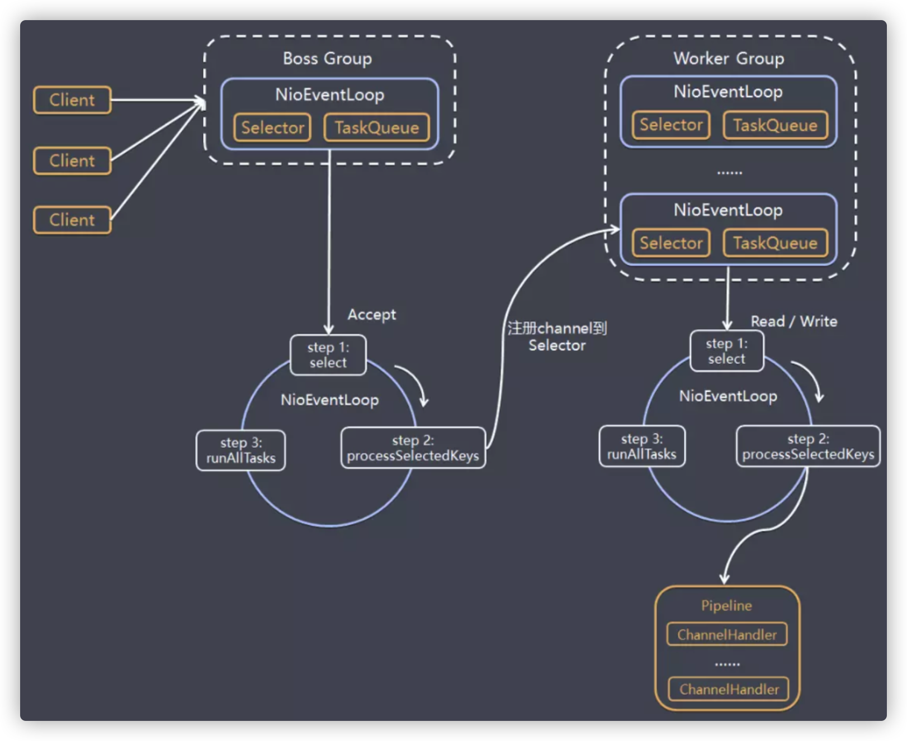
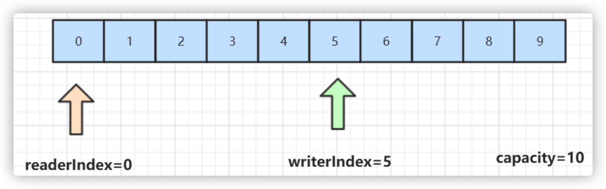

# Netty核心功能与线程模型

## 1. Netty初探

NIO 的类库和 API 繁杂，使用麻烦：需要熟练掌握Selector、ServerSocketChannel、SocketChannel、ByteBuffer等。 

开发工作量和难度都非常大：例如客户端面临断线重连、 网络闪断、心跳处理、半包读写、 网络拥塞和异常流的处理等等。

Netty 对 JDK 自带的 NIO 的 API 进行了良好的封装，解决了上述问题。且Netty拥有高性能、 吞吐量更高，延迟更低，减少资源消耗，最小化不必要的内存复制等优点。

Netty 现在都在用的是4.x，5.x版本已经废弃，Netty 4.x 需要JDK 6以上版本支持

#### Netty的使用场景

1. 互联网行业：在分布式系统中，各个节点之间需要远程服务调用，高性能的 RPC 框架必不可少，Netty 作为异步高性能的通信框架，往往作为基础通信组件被这些 RPC 框架使用。典型的应用有：阿里分布式服务框架 Dubbo 的 RPC 框架使用 Dubbo 协议进行节点间通信，Dubbo 协议默认使用 Netty 作为基础通信组件，用于实现。各进程节点之间的内部通信。Rocketmq底层也是用的Netty作为基础通信组件。
2. 游戏行业：无论是手游服务端还是大型的网络游戏，Java 语言得到了越来越广泛的应用。Netty 作为高性能的基础通信组件，它本身提供了 TCP/UDP 和 HTTP 协议栈。
3. 大数据领域：经典的 Hadoop 的高性能通信和序列化组件 Avro 的 RPC 框架，默认采用 Netty 进行跨界点通信，它的 Netty Service 基于 Netty 框架二次封装实现。

netty相关开源项目：https://netty.io/wiki/related-projects.html


## 2. Netty线程模型

可以先理解下《Scalable IO in Java》这篇文章里说的一些IO处理模式，Netty的线程模型如下图所示：



#### 模型解释

1. Netty 抽象出两组线程池BossGroup和WorkerGroup，BossGroup专门负责接收客户端的连接, WorkerGroup专门负责网络的读写

2. BossGroup和WorkerGroup类型都是NioEventLoopGroup

3. NioEventLoopGroup 相当于一个事件循环**线程组**, 这个组中含有多个事件循环线程 ， 每一个事件循环线程是NioEventLoop

4. 每个NioEventLoop都有一个selector , 用于监听注册在其上的socketChannel的网络通讯

5. 每个Boss  NioEventLoop线程内部循环执行的步骤有 3 步
    - 处理accept事件 , 与client 建立连接 , 生成 NioSocketChannel 
    - 将NioSocketChannel注册到某个worker NIOEventLoop上的selector
    - 处理任务队列的任务 ， 即runAllTasks

6. 每个worker  NIOEventLoop线程循环执行的步骤
    - 轮询注册到自己selector上的所有NioSocketChannel 的read, write事件
    - 处理 I/O 事件， 即read , write 事件， 在对应NioSocketChannel 处理业务
    - runAllTasks处理任务队列TaskQueue的任务 ，一些耗时的业务处理一般可以放入TaskQueue中慢慢处理，这样不影响数据在 pipeline 中的流动处理

7. 每个worker NIOEventLoop处理NioSocketChannel业务时，会使用 pipeline (管道)，管道中维护了很多 handler 处理器用来处理 channel 中的数据


## 3. Netty模块组件

##### 【Bootstrap、ServerBootstrap】

Bootstrap 意思是引导，一个 Netty 应用通常由一个 Bootstrap 开始，主要作用是配置整个 Netty 程序，串联各个组件，Netty 中 Bootstrap 类是客户端程序的启动引导类，ServerBootstrap 是服务端启动引导类。

##### 【Future、ChannelFuture】

正如前面介绍，在 Netty 中所有的 IO 操作都是异步的，不能立刻得知消息是否被正确处理。

但是可以过一会等它执行完成或者直接注册一个监听，具体的实现就是通过 Future 和 ChannelFutures，他们可以注册一个监听，当操作执行成功或失败时监听会自动触发注册的监听事件。

##### 【Channel】

Netty 网络通信的组件，能够用于执行网络 I/O 操作。Channel 为用户提供：

1. 当前网络连接的通道的状态（例如是否打开？是否已连接？）
2. 网络连接的配置参数 （例如接收缓冲区大小）
3. 提供异步的网络 I/O 操作(如建立连接，读写，绑定端口)，异步调用意味着任何 I/O 调用都将立即返回，并且不保证在调用结束时所请求的 I/O 操作已完成。
4. 调用立即返回一个 ChannelFuture 实例，通过注册监听器到 ChannelFuture 上，可以 I/O 操作成功、失败或取消时回调通知调用方。
5. 支持关联 I/O 操作与对应的处理程序。

不同协议、不同的阻塞类型的连接都有不同的 Channel 类型与之对应。

下面是一些常用的 Channel 类型：

```
NioSocketChannel，异步的客户端 TCP Socket 连接。
NioServerSocketChannel，异步的服务器端 TCP Socket 连接。
NioDatagramChannel，异步的 UDP 连接。
NioSctpChannel，异步的客户端 Sctp 连接。
NioSctpServerChannel，异步的 Sctp 服务器端连接，这些通道涵盖了 UDP 和 TCP 网络 IO 以及文件 IO。
```

##### 【Selector】

Netty 基于 Selector 对象实现 I/O 多路复用，通过 Selector 一个线程可以监听多个连接的 Channel 事件。

当向一个 Selector 中注册 Channel 后，Selector 内部的机制就可以自动不断地查询(Select) 这些注册的 Channel 是否有已就绪的 I/O 事件（例如可读，可写，网络连接完成等），这样程序就可以很简单地使用一个线程高效地管理多个 Channel 。

##### 【NioEventLoop】

NioEventLoop 中维护了一个线程和任务队列，支持异步提交执行任务，线程启动时会调用 NioEventLoop 的 run 方法，执行 I/O 任务和非 I/O 任务：

I/O 任务，即 selectionKey 中 ready 的事件，如 accept、connect、read、write 等，由 processSelectedKeys 方法触发。

非 IO 任务，添加到 taskQueue 中的任务，如 register0、bind0 等任务，由 runAllTasks 方法触发。

##### 【NioEventLoopGroup】

NioEventLoopGroup，主要管理 eventLoop 的生命周期，可以理解为一个线程池，内部维护了一组线程，每个线程(NioEventLoop)负责处理多个 Channel 上的事件，而一个 Channel 只对应于一个线程。

##### 【ChannelHandler】

ChannelHandler 是一个接口，处理 I/O 事件或拦截 I/O 操作，并将其转发到其 ChannelPipeline(业务处理链)中的下一个处理程序。

ChannelHandler 本身并没有提供很多方法，因为这个接口有许多的方法需要实现，方便使用期间，可以继承它的子类：

```
ChannelInboundHandler 用于处理入站 I/O 事件。
ChannelOutboundHandler 用于处理出站 I/O 操作。
```

或者使用以下适配器类：

```
ChannelInboundHandlerAdapter 用于处理入站 I/O 事件。
ChannelOutboundHandlerAdapter 用于处理出站 I/O 操作。
```

##### 【ChannelHandlerContext】

保存 Channel 相关的所有上下文信息，同时关联一个 ChannelHandler 对象。

##### 【ChannelPipeline】

保存 ChannelHandler 的 List，用于处理或拦截 Channel 的入站事件和出站操作。

ChannelPipeline 实现了一种高级形式的拦截过滤器模式，使用户可以完全控制事件的处理方式，以及 Channel 中各个的 ChannelHandler 如何相互交互。

在 Netty 中每个 Channel 都有且仅有一个 ChannelPipeline 与之对应，它们的组成关系如下： 


一个 Channel 包含了一个 ChannelPipeline，而 ChannelPipeline 中又维护了一个由 ChannelHandlerContext 组成的双向链表，并且每个 ChannelHandlerContext 中又关联着一个 ChannelHandler。

read事件(入站事件)和write事件(出站事件)在一个双向链表中，入站事件会从链表 head 往后传递到最后一个入站的 handler，出站事件会从链表 tail 往前传递到最前一个出站的 handler，两种类型的 handler 互不干扰。


## 4. Netty通讯示例

Netty的maven依赖：

```xml
<dependency>
    <groupId>io.netty</groupId>
    <artifactId>netty-all</artifactId>
    <version>4.1.35.Final</version>
</dependency>
```

服务端代码：

```java
public class NettyServer {

    public static void main(String[] args) throws Exception {

        // 创建两个线程组bossGroup和workerGroup, 含有的子线程NioEventLoop的个数默认为cpu核数的两倍
        // bossGroup只是处理连接请求 ,真正的和客户端业务处理，会交给workerGroup完成
        EventLoopGroup bossGroup = new NioEventLoopGroup(1);
        EventLoopGroup workerGroup = new NioEventLoopGroup();
        try {
            // 创建服务器端的启动对象
            ServerBootstrap bootstrap = new ServerBootstrap();
            // 使用链式编程来配置参数
            bootstrap.group(bossGroup, workerGroup) // 设置两个线程组
                    .channel(NioServerSocketChannel.class) // 使用NioServerSocketChannel作为服务器的通道实现
                    // 初始化服务器连接队列大小，服务端处理客户端连接请求是顺序处理的,所以同一时间只能处理一个客户端连接。
                    // 多个客户端同时来的时候,服务端将不能处理的客户端连接请求放在队列中等待处理
                    .option(ChannelOption.SO_BACKLOG, 1024)
                    .childHandler(new ChannelInitializer<SocketChannel>() {	// 创建通道初始化对象，设置初始化参数

                        @Override
                        protected void initChannel(SocketChannel ch) throws Exception {
                            // 对workerGroup的SocketChannel设置处理器
                            ch.pipeline().addLast(new NettyServerHandler());
                        }
                    });
            System.out.println("netty server start。。");
            // 绑定一个端口并且同步, 生成了一个ChannelFuture异步对象，通过isDone()等方法可以判断异步事件的执行情况
            // 启动服务器(并绑定端口)，bind是异步操作，sync方法是等待异步操作执行完毕
            ChannelFuture cf = bootstrap.bind(9000).sync();
            // 给cf注册监听器，监听我们关心的事件
            /*cf.addListener(new ChannelFutureListener() {
                @Override
                public void operationComplete(ChannelFuture future) throws Exception {
                    if (cf.isSuccess()) {
                        System.out.println("监听端口9000成功");
                    } else {
                        System.out.println("监听端口9000失败");
                    }
                }
            });*/
            // 对通道关闭进行监听，closeFuture是异步操作，监听通道关闭
            // 通过sync方法同步等待通道关闭处理完毕，这里会阻塞等待通道关闭完成
            cf.channel().closeFuture().sync();
        } finally {
            bossGroup.shutdownGracefully();
            workerGroup.shutdownGracefully();
        }
    }
}


/**
 * 自定义Handler需要继承netty规定好的某个HandlerAdapter(规范)
 */
public class NettyServerHandler extends ChannelInboundHandlerAdapter {

    /**
     * 读取客户端发送的数据
     *
     * @param ctx 上下文对象, 含有通道channel，管道pipeline
     * @param msg 就是客户端发送的数据
     * @throws Exception
     */
    @Override
    public void channelRead(ChannelHandlerContext ctx, Object msg) throws Exception {
        System.out.println("服务器读取线程 " + Thread.currentThread().getName());
        // Channel channel = ctx.channel();
        // ChannelPipeline pipeline = ctx.pipeline(); //本质是一个双向链接, 出站入站
        // 将 msg 转成一个 ByteBuf，类似NIO 的 ByteBuffer
        ByteBuf buf = (ByteBuf) msg;
        System.out.println("客户端发送消息是:" + buf.toString(CharsetUtil.UTF_8));
    }

    /**
     * 数据读取完毕处理方法
     *
     * @param ctx
     * @throws Exception
     */
    @Override
    public void channelReadComplete(ChannelHandlerContext ctx) throws Exception {
        ByteBuf buf = Unpooled.copiedBuffer("HelloClient", CharsetUtil.UTF_8);
        ctx.writeAndFlush(buf);
    }

    /**
     * 处理异常, 一般是需要关闭通道
     *
     * @param ctx
     * @param cause
     * @throws Exception
     */
    @Override
    public void exceptionCaught(ChannelHandlerContext ctx, Throwable cause) throws Exception {
        ctx.close();
    }
}
```

客户端代码：

```java
public class NettyClient {
    public static void main(String[] args) throws Exception {
        // 客户端需要一个事件循环组
        EventLoopGroup group = new NioEventLoopGroup();
        try {
            // 创建客户端启动对象
            // 注意客户端使用的不是 ServerBootstrap 而是 Bootstrap
            Bootstrap bootstrap = new Bootstrap();
            // 设置相关参数
            bootstrap.group(group) //设置线程组
                    .channel(NioSocketChannel.class) // 使用 NioSocketChannel 作为客户端的通道实现
                    .handler(new ChannelInitializer<SocketChannel>() {
                        @Override
                        protected void initChannel(SocketChannel channel) throws Exception {
                            //加入处理器
                            channel.pipeline().addLast(new NettyClientHandler());
                        }
                    });
            System.out.println("netty client start");
            // 启动客户端去连接服务器端
            ChannelFuture channelFuture = bootstrap.connect("127.0.0.1", 9000).sync();
            // 对关闭通道进行监听
            channelFuture.channel().closeFuture().sync();
        } finally {
            group.shutdownGracefully();
        }
    }
}

public class NettyClientHandler extends ChannelInboundHandlerAdapter {

    /**
     * 当客户端连接服务器完成就会触发该方法
     *
     * @param ctx
     * @throws Exception
     */
    @Override
    public void channelActive(ChannelHandlerContext ctx) throws Exception {
        ByteBuf buf = Unpooled.copiedBuffer("HelloServer", CharsetUtil.UTF_8);
        ctx.writeAndFlush(buf);
    }

    // 当通道有读取事件时会触发，即服务端发送数据给客户端
    @Override
    public void channelRead(ChannelHandlerContext ctx, Object msg) throws Exception {
        ByteBuf buf = (ByteBuf) msg;
        System.out.println("收到服务端的消息:" + buf.toString(CharsetUtil.UTF_8));
        System.out.println("服务端的地址： " + ctx.channel().remoteAddress());
    }

    @Override
    public void exceptionCaught(ChannelHandlerContext ctx, Throwable cause) throws Exception {
        cause.printStackTrace();
        ctx.close();
    }
}
```

看完代码，我们发现Netty架的目标就是让你的业务逻辑从网络基础应用编码中分离出来，让你可以专注业务的开发，而不需写一大堆类似NIO的网络处理操作。


## 5. ByteBuf详解

从结构上来说，ByteBuf 由一串字节数组构成。数组中每个字节用来存放信息。

ByteBuf 提供了两个索引，一个用于读取数据，一个用于写入数据。这两个索引通过在字节数组中移动，来定位需要读或者写信息的位置。

当从 ByteBuf 读取时，它的 readerIndex（读索引）将会根据读取的字节数递增。

同样，当写 ByteBuf 时，它的 writerIndex 也会根据写入的字节数进行递增。



需要注意的是极限的情况是 readerIndex 刚好读到了 writerIndex 写入的地方。

如果 readerIndex 超过了 writerIndex 的时候，Netty 会抛出 IndexOutOf-BoundsException 异常。

示例代码：

```java
public class NettyByteBuf {
    public static void main(String[] args) {
        // 创建byteBuf对象，该对象内部包含一个字节数组byte[10]
        // 通过readerindex和writerIndex和capacity，将buffer分成三个区域
        // 已经读取的区域：[0,readerindex)
        // 可读取的区域：[readerindex,writerIndex)
        // 可写的区域: [writerIndex,capacity)
        ByteBuf byteBuf = Unpooled.buffer(10);
        System.out.println("byteBuf=" + byteBuf);

        for (int i = 0; i < 8; i++) {
            byteBuf.writeByte(i);
        }
        System.out.println("byteBuf=" + byteBuf);

        for (int i = 0; i < 5; i++) {
            System.out.println(byteBuf.getByte(i));
        }
        System.out.println("byteBuf=" + byteBuf);

        for (int i = 0; i < 5; i++) {
            System.out.println(byteBuf.readByte());
        }
        System.out.println("byteBuf=" + byteBuf);


        //用Unpooled工具类创建ByteBuf
        ByteBuf byteBuf2 = Unpooled.copiedBuffer("hello,zhuge!", CharsetUtil.UTF_8);
        //使用相关的方法
        if (byteBuf2.hasArray()) {
            byte[] content = byteBuf2.array();
            //将 content 转成字符串
            System.out.println(new String(content, CharsetUtil.UTF_8));
            System.out.println("byteBuf=" + byteBuf2);

            System.out.println(byteBuf2.readerIndex()); // 0
            System.out.println(byteBuf2.writerIndex()); // 12
            System.out.println(byteBuf2.capacity()); // 36

            System.out.println(byteBuf2.getByte(0)); // 获取数组0这个位置的字符h的ascii码，h=104

            int len = byteBuf2.readableBytes(); //可读的字节数  12
            System.out.println("len=" + len);

            //使用for取出各个字节
            for (int i = 0; i < len; i++) {
                System.out.println((char) byteBuf2.getByte(i));
            }

            //范围读取
            System.out.println(byteBuf2.getCharSequence(0, 6, CharsetUtil.UTF_8));
            System.out.println(byteBuf2.getCharSequence(6, 6, CharsetUtil.UTF_8));
        }
    }
}
```

