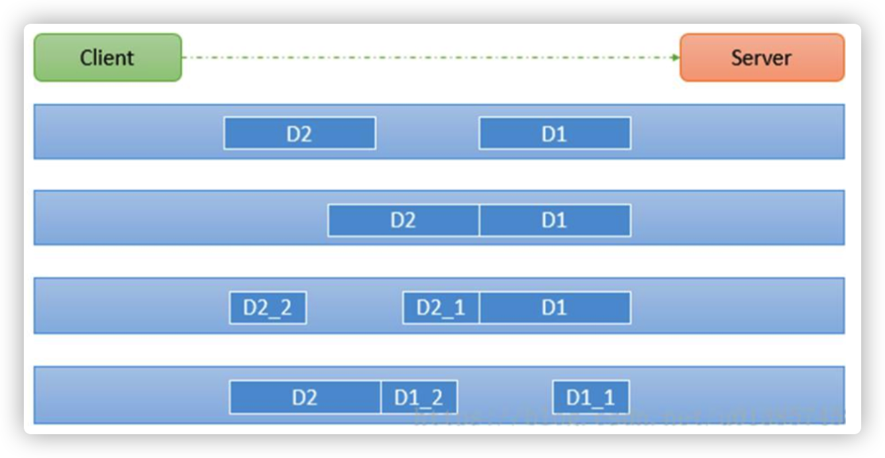
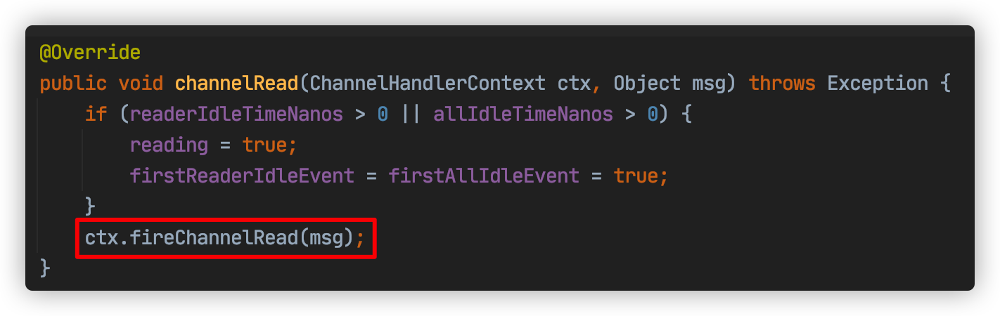
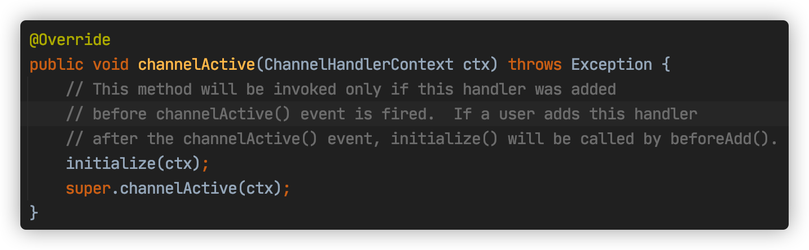
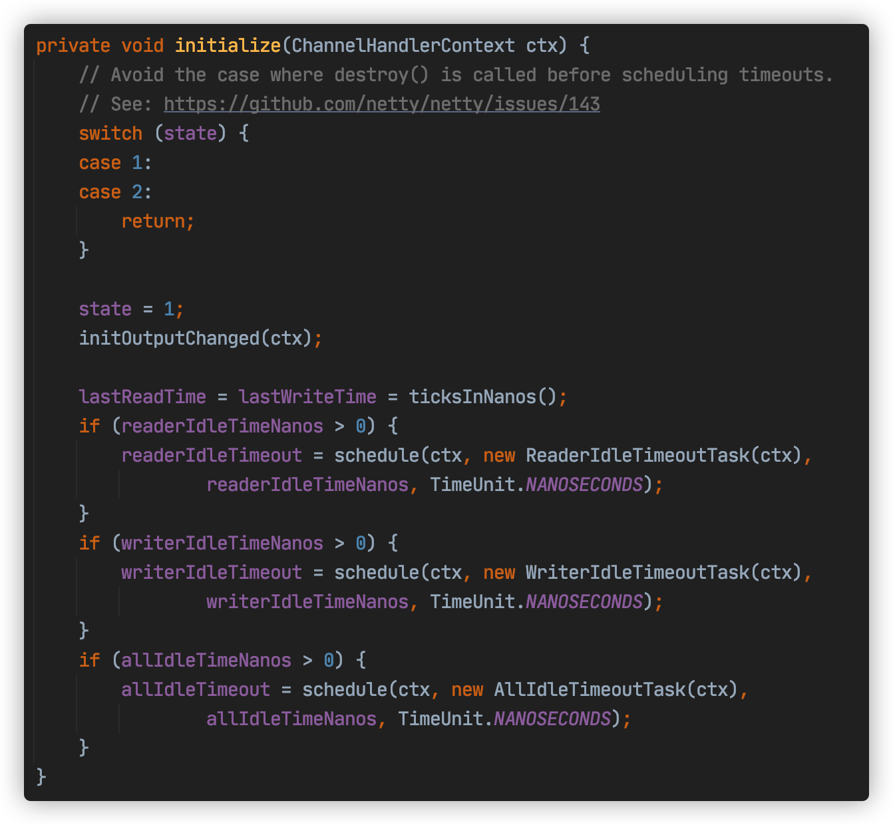
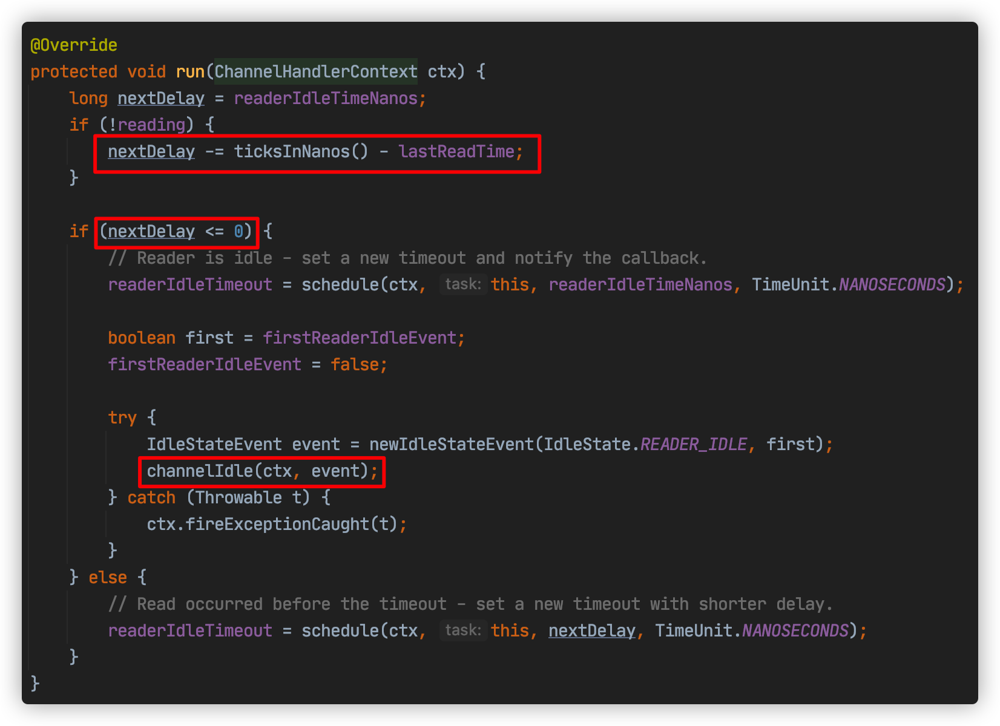
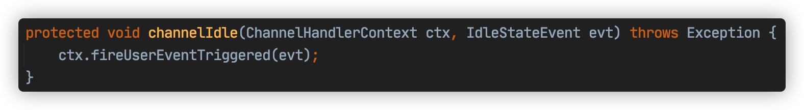
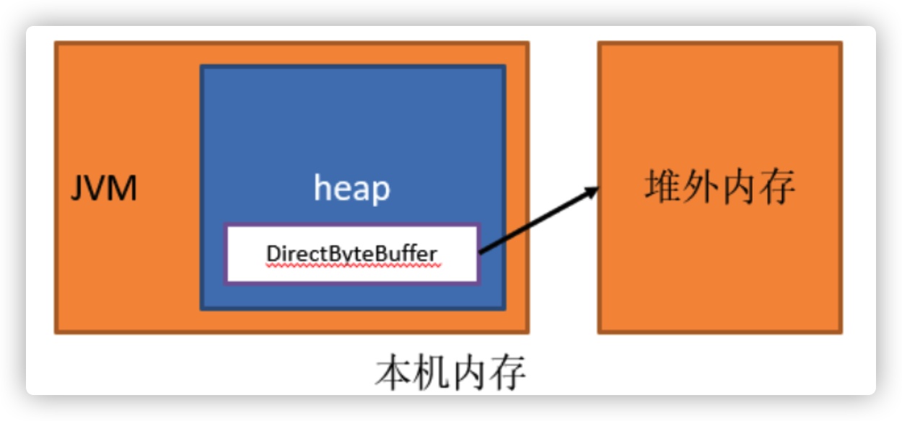

# Netty编解码，粘包拆包及零拷贝

## 1. Netty编解码

Netty涉及到编解码的组件有Channel、ChannelHandler、ChannelPipe等，先大概了解下这几个组件的作用。

#### ChannelHandler

ChannelHandler充当了处理入站和出站数据的应用程序逻辑容器。例如，实现ChannelInboundHandler接口（或ChannelInboundHandlerAdapter），你就可以接收入站事件和数据，这些数据随后会被你的应用程序的业务逻辑处理。当你要给连接的客户端发送响应时，也可以从ChannelInboundHandler冲刷数据。你的业务逻辑通常写在一个或者多个ChannelInboundHandler中。ChannelOutboundHandler原理一样，只不过它是用来处理出站数据的。

#### ChannelPipeline

ChannelPipeline提供了ChannelHandler链的容器。**以客户端应用程序为例**，如果事件的运动方向是从客户端到服务端的，那么我们称这些事件为**出站的**，即客户端发送给服务端的数据会通过pipeline中的一系列ChannelOutboundHandler（ChannelOutboundHandler调用是**从tail到head方向**逐个调用每个handler的逻辑），并被这些Handler处理，反之则称为入站的，入站只调用pipeline里的ChannelInboundHandler逻辑（ChannelInboundHandler调用是**从head到tail方向**逐个调用每个handler的逻辑）。

### 1.1 编码解码器

当你通过Netty发送或者接受一个消息的时候，就将会发生一次数据转换。入站消息会被**解码**：从字节转换为另一种格式（比如java对象）；如果是出站消息，它会被**编码成字节**。

Netty提供了一系列实用的编码解码器，他们都实现了ChannelInboundHadnler或者ChannelOutboundHandler接口。在这些类中，channelRead方法已经被重写了。以入站为例，对于每个从入站Channel读取的消息，这个方法会被调用。随后，它将调用由已知解码器所提供的decode()方法进行解码，并将已经解码的字节转发给ChannelPipeline中的下一个ChannelInboundHandler。

Netty提供了很多编解码器，比如编解码字符串的StringEncoder和StringDecoder，编解码对象的ObjectEncoder和ObjectDecoder等。

当然也可以通过集成ByteToMessageDecoder自定义编解码器。


## 2. Netty粘包拆包

TCP粘包拆包是指发送方发送的若干包数据到接收方接收时粘成一包或某个数据包被拆开接收。如下图所示，client发了两个数据包D1和D2，但是server端可能会收到如下几种情况的数据。



#### 为什么出现粘包现象

TCP 是面向连接的， 面向流的， 提供高可靠性服务。 收发两端（客户端和服务器端） 都要有成对的 socket，因此， 发送端为了将多个发给接收端的包， 更有效的发给对方， 使用了优化方法（Nagle 算法），将多次间隔较小且数据量小的数据， 合并成一个大的数据块， 然后进行封包。 这样做虽然提高了效率， 但是接收端就难于分辨出完整的数据包了， 因为面向流的通信是无消息保护边界的。

#### 解决方案

1. 格式化数据：每条数据有固定的格式（开始符、结束符），这种方法简单易行，但选择开始符和结束符的时候一定要注意每条数据的内部一定不能出现开始符或结束符。
2. 发送长度：发送每条数据的时候，将数据的长度一并发送，比如可以选择每条数据的前4位是数据的长度，应用层处理时可以根据长度来判断每条数据的开始和结束。

**第二种方案更稳妥，参见项目示例com.tuling.netty.split包下代码**

### 2.1 Netty心跳检测机制

所谓心跳, 即在 TCP 长连接中, 客户端和服务器之间定期发送的一种特殊的数据包, 通知对方自己还在线, 以确保 TCP 连接的有效性.

在 Netty 中, 实现心跳机制的关键是 IdleStateHandler, 看下它的构造器：

```java
public IdleStateHandler(int readerIdleTimeSeconds, int writerIdleTimeSeconds, int allIdleTimeSeconds) {
    this((long)readerIdleTimeSeconds, (long)writerIdleTimeSeconds, (long)allIdleTimeSeconds, TimeUnit.SECONDS);
}
```

这里解释下三个参数的含义：

- readerIdleTimeSeconds: 读超时. 即当在指定的时间间隔内没有从 Channel 读取到数据时, 会触发一个 READER_IDLE 的 IdleStateEvent 事件.
- writerIdleTimeSeconds: 写超时. 即当在指定的时间间隔内没有数据写入到 Channel 时, 会触发一个 WRITER_IDLE 的 IdleStateEvent 事件.
- allIdleTimeSeconds: 读/写超时. 即当在指定的时间间隔内没有读或写操作时, 会触发一个 ALL_IDLE 的 IdleStateEvent 事件.

注：这三个参数默认的时间单位是秒。若需要指定其他时间单位，可以使用另一个构造方法：

```java
IdleStateHandler(boolean observeOutput, long readerIdleTime, long writerIdleTime, long allIdleTime, TimeUnit unit)
```

要实现Netty服务端心跳检测机制需要在服务器端的ChannelInitializer中加入如下的代码：

```java
pipeline.addLast(new IdleStateHandler(3, 0, 0, TimeUnit.SECONDS));
```

初步地看下IdleStateHandler源码，先看下IdleStateHandler中的channelRead方法：



红框代码其实表示该方法只是进行了透传，不做任何业务逻辑处理，让channelPipe中的下一个handler处理channelRead方法

我们再看看channelActive方法：



这里有个initialize的方法，这是IdleStateHandler的精髓，接着探究：



这边会触发一个Task，ReaderIdleTimeoutTask，这个task里的run方法源码是这样的：



第一个红框代码是用当前时间减去最后一次channelRead方法调用的时间，假如这个结果是6s，说明最后一次调用channelRead已经是6s之前的事情了，你设置的是5s，那么nextDelay则为-1，说明超时了，那么第二个红框代码则会触发下一个handler的userEventTriggered方法：



如果没有超时则不触发userEventTriggered方法。

Netty心跳检测代码示例：

```java
//服务端代码
public class HeartBeatServer {

    public static void main(String[] args) throws Exception {
        EventLoopGroup boss = new NioEventLoopGroup();
        EventLoopGroup worker = new NioEventLoopGroup();
        try {
            ServerBootstrap bootstrap = new ServerBootstrap();
            bootstrap.group(boss, worker)
                    .channel(NioServerSocketChannel.class)
                    .childHandler(new ChannelInitializer<SocketChannel>() {
                        @Override
                        protected void initChannel(SocketChannel ch) throws Exception {
                            ChannelPipeline pipeline = ch.pipeline();
                            pipeline.addLast("decoder", new StringDecoder());
                            pipeline.addLast("encoder", new StringEncoder());
                            //IdleStateHandler的readerIdleTime参数指定超过3秒还没收到客户端的连接，
                            //会触发IdleStateEvent事件并且交给下一个handler处理，下一个handler必须
                            //实现userEventTriggered方法处理对应事件
                            pipeline.addLast(new IdleStateHandler(3, 0, 0, TimeUnit.SECONDS));
                            pipeline.addLast(new HeartBeatHandler());
                        }
                    });
            System.out.println("netty server start。。");
            ChannelFuture future = bootstrap.bind(9000).sync();
            future.channel().closeFuture().sync();
        } catch (Exception e) {
            e.printStackTrace();
        } finally {
            worker.shutdownGracefully();
            boss.shutdownGracefully();
        }
    }
}

//服务端处理handler
public class HeartBeatServerHandler extends SimpleChannelInboundHandler<String> {

    int readIdleTimes = 0;

    @Override
    protected void channelRead0(ChannelHandlerContext ctx, String s) throws Exception {
        System.out.println(" ====== > [server] message received : " + s);
        if ("Heartbeat Packet".equals(s)) {
            ctx.channel().writeAndFlush("ok");
        } else {
            System.out.println(" 其他信息处理 ... ");
        }
    }

    @Override
    public void userEventTriggered(ChannelHandlerContext ctx, Object evt) throws Exception {
        IdleStateEvent event = (IdleStateEvent) evt;

        String eventType = null;
        switch (event.state()) {
            case READER_IDLE:
                eventType = "读空闲";
                readIdleTimes++; // 读空闲的计数加1
                break;
            case WRITER_IDLE:
                eventType = "写空闲";
                // 不处理
                break;
            case ALL_IDLE:
                eventType = "读写空闲";
                // 不处理
                break;
        }
        System.out.println(ctx.channel().remoteAddress() + "超时事件：" + eventType);
        if (readIdleTimes > 3) {
            System.out.println(" [server]读空闲超过3次，关闭连接，释放更多资源");
            ctx.channel().writeAndFlush("idle close");
            ctx.channel().close();
        }
    }

    @Override
    public void channelActive(ChannelHandlerContext ctx) throws Exception {
        System.err.println("=== " + ctx.channel().remoteAddress() + " is active ===");
    }
}
   //客户端代码
   public class HeartBeatClient {
    public static void main(String[] args) throws Exception {
        EventLoopGroup eventLoopGroup = new NioEventLoopGroup();
        try {
            Bootstrap bootstrap = new Bootstrap();
            bootstrap.group(eventLoopGroup).channel(NioSocketChannel.class)
                    .handler(new ChannelInitializer<SocketChannel>() {
                        @Override
                        protected void initChannel(SocketChannel ch) throws Exception {
                            ChannelPipeline pipeline = ch.pipeline();
                            pipeline.addLast("decoder", new StringDecoder());
                            pipeline.addLast("encoder", new StringEncoder());
                            pipeline.addLast(new HeartBeatClientHandler());
                        }
                    });

            System.out.println("netty client start。。");
            Channel channel = bootstrap.connect("127.0.0.1", 9000).sync().channel();
            String text = "Heartbeat Packet";
            Random random = new Random();
            while (channel.isActive()) {
                int num = random.nextInt(10);
                Thread.sleep(num * 1000);
                channel.writeAndFlush(text);
            }
        } catch (Exception e) {
            e.printStackTrace();
        } finally {
            eventLoopGroup.shutdownGracefully();
        }
    }

    static class HeartBeatClientHandler extends SimpleChannelInboundHandler<String> {

        @Override
        protected void channelRead0(ChannelHandlerContext ctx, String msg) throws Exception {
            System.out.println(" client received :" + msg);
            if (msg != null && msg.equals("idle close")) {
                System.out.println(" 服务端关闭连接，客户端也关闭");
                ctx.channel().closeFuture();
            }
        }
    }
}
```


## 3. Netty零拷贝

Netty的接收和发送ByteBuffer采用DIRECT BUFFERS，使用堆外**直接内存**进行Socket读写，不需要进行字节缓冲区的二次拷贝。

如果使用传统的JVM堆内存（HEAP BUFFERS）进行Socket读写，JVM会将堆内存Buffer拷贝一份到直接内存中，然后才能写入Socket中。JVM堆内存的数据是不能直接写入Socket中的。相比于堆外直接内存，消息在发送过程中多了一次缓冲区的内存拷贝。

可以看下netty的读写源码，比如read源码 `NioByteUnsafe.read()`


### 3.1 直接内存

直接内存（Direct Memory）并不是虚拟机运行时数据区的一部分，也不是Java虚拟机规范中定义的内存区域，某些情况下这部分内存也会被频繁地使用，而且也可能导致OutOfMemoryError异常出现。Java里用DirectByteBuffer可以分配一块直接内存(堆外内存)，元空间对应的内存也叫作直接内存，它们对应的都是机器的物理内存。



```java
/**
 * 直接内存与堆内存的区别
 */
public class DirectMemoryTest {

    public static void heapAccess() {
        long startTime = System.currentTimeMillis();
        //分配堆内存
        ByteBuffer buffer = ByteBuffer.allocate(1000);
        for (int i = 0; i < 100000; i++) {
            for (int j = 0; j < 200; j++) {
                buffer.putInt(j);
            }
            buffer.flip();
            for (int j = 0; j < 200; j++) {
                buffer.getInt();
            }
            buffer.clear();
        }
        long endTime = System.currentTimeMillis();
        System.out.println("堆内存访问:" + (endTime - startTime) + "ms");
    }

    public static void directAccess() {
        long startTime = System.currentTimeMillis();
        //分配直接内存
        ByteBuffer buffer = ByteBuffer.allocateDirect(1000);
        for (int i = 0; i < 100000; i++) {
            for (int j = 0; j < 200; j++) {
                buffer.putInt(j);
            }
            buffer.flip();
            for (int j = 0; j < 200; j++) {
                buffer.getInt();
            }
            buffer.clear();
        }
        long endTime = System.currentTimeMillis();
        System.out.println("直接内存访问:" + (endTime - startTime) + "ms");
    }

    public static void heapAllocate() {
        long startTime = System.currentTimeMillis();
        for (int i = 0; i < 100000; i++) {
            ByteBuffer.allocate(100);
        }
        long endTime = System.currentTimeMillis();
        System.out.println("堆内存申请:" + (endTime - startTime) + "ms");
    }

    public static void directAllocate() {
        long startTime = System.currentTimeMillis();
        for (int i = 0; i < 100000; i++) {
            ByteBuffer.allocateDirect(100);
        }
        long endTime = System.currentTimeMillis();
        System.out.println("直接内存申请:" + (endTime - startTime) + "ms");
    }

    public static void main(String args[]) {
        for (int i = 0; i < 10; i++) {
            heapAccess();
            directAccess();
        }

        System.out.println();

        for (int i = 0; i < 10; i++) {
            heapAllocate();
            directAllocate();
        }
    }
}

运行结果：
堆内存访问:44ms
直接内存访问:29ms
堆内存访问:33ms
直接内存访问:19ms
堆内存访问:55ms
直接内存访问:38ms
堆内存访问:39ms
直接内存访问:20ms
堆内存访问:38ms
直接内存访问:18ms
堆内存访问:36ms
直接内存访问:19ms
堆内存访问:34ms
直接内存访问:19ms
堆内存访问:40ms
直接内存访问:20ms
堆内存访问:37ms
直接内存访问:24ms
堆内存访问:59ms
直接内存访问:25ms

堆内存申请:11ms
直接内存申请:36ms
堆内存申请:13ms
直接内存申请:52ms
堆内存申请:62ms
直接内存申请:40ms
堆内存申请:2ms
直接内存申请:37ms
堆内存申请:1ms
直接内存申请:81ms
堆内存申请:2ms
直接内存申请:23ms
堆内存申请:1ms
直接内存申请:31ms
堆内存申请:2ms
直接内存申请:32ms
堆内存申请:7ms
直接内存申请:41ms
堆内存申请:8ms
直接内存申请:142ms
```

从程序运行结果看出直接内存申请较慢，但访问效率高。在java虚拟机实现上，本地IO一般会直接操作直接内存（直接内存=>系统调用=>硬盘/网卡），而非直接内存则需要二次拷贝（堆内存=>直接内存=>系统调用=>硬盘/网卡）。

#### 直接内存分配源码分析

```java
public static ByteBuffer allocateDirect(int capacity) {
    return new DirectByteBuffer(capacity);
}


DirectByteBuffer(int cap) {                   // package-private
    super(-1, 0, cap, cap);
    boolean pa = VM.isDirectMemoryPageAligned();
    int ps = Bits.pageSize();
    long size = Math.max(1L, (long)cap + (pa ? ps : 0));
    //判断是否有足够的直接内存空间分配，可通过-XX:MaxDirectMemorySize=<size>参数指定直接内存最大可分配空间，如果不指定默认为最大堆内存大小，
    //在分配直接内存时如果发现空间不够会显示调用System.gc()触发一次full gc回收掉一部分无用的直接内存的引用对象，同时直接内存也会被释放掉
    //如果释放完分配空间还是不够会抛出异常java.lang.OutOfMemoryError
   Bits.reserveMemory(size, cap);

    long base = 0;
    try {
        // 调用unsafe本地方法分配直接内存
        base = unsafe.allocateMemory(size);
    } catch (OutOfMemoryError x) {
        // 分配失败，释放内存
        Bits.unreserveMemory(size, cap);
        throw x;
    }
    unsafe.setMemory(base, size, (byte) 0);
    if (pa && (base % ps != 0)) {
        // Round up to page boundary
        address = base + ps - (base & (ps - 1));
    } else {
        address = base;
    }
    
    // 使用Cleaner机制注册内存回收处理函数，当直接内存引用对象被GC清理掉时，
    // 会提前调用这里注册的释放直接内存的Deallocator线程对象的run方法
    cleaner = Cleaner.create(this, new Deallocator(base, size, cap));
    att = null;
}


// 申请一块本地内存。内存空间是未初始化的，其内容是无法预期的。
// 使用freeMemory释放内存，使用reallocateMemory修改内存大小
public native long allocateMemory(long bytes);

// openjdk8/hotspot/src/share/vm/prims/unsafe.cpp
UNSAFE_ENTRY(jlong, Unsafe_AllocateMemory(JNIEnv *env, jobject unsafe, jlong size))
  UnsafeWrapper("Unsafe_AllocateMemory");
  size_t sz = (size_t)size;
  if (sz != (julong)size || size < 0) {
    THROW_0(vmSymbols::java_lang_IllegalArgumentException());
  }
  if (sz == 0) {
    return 0;
  }
  sz = round_to(sz, HeapWordSize);
  // 调用os::malloc申请内存，内部使用malloc这个C标准库的函数申请内存
  void* x = os::malloc(sz, mtInternal);
  if (x == NULL) {
    THROW_0(vmSymbols::java_lang_OutOfMemoryError());
  }
  //Copy::fill_to_words((HeapWord*)x, sz / HeapWordSize);
      return addr_to_java(x);
UNSAFE_END
```

#### 使用直接内存的优缺点

优点：

- 不占用堆内存空间，减少了发生GC的可能
- java虚拟机实现上，本地IO会直接操作直接内存（直接内存=>系统调用=>硬盘/网卡），而非直接内存则需要二次拷贝（堆内存=>直接内存=>系统调用=>硬盘/网卡）

缺点：

- 初始分配较慢
- 没有JVM直接帮助管理内存，容易发生内存溢出。为了避免一直没有FULL GC，最终导致直接内存把物理内存被耗完。我们可以指定直接内存的最大值，通过-XX：MaxDirectMemorySize来指定，当达到阈值的时候，调用system.gc来进行一次FULL GC，间接把那些没有被使用的直接内存回收掉。