# Netty线程模型源码详解

##### 为什么要看源码？

1. **提升技术功底：**学习源码里的优秀设计思想，比如一些疑难问题的解决思路，还有一些优秀的设计模式，整体提升自己的技术功底

2. **深度掌握技术框架：**源码看多了，对于一个新技术或框架的掌握速度会有大幅提升，看下框架demo大致就能知道底层的实现，技术框架更新再快也不怕

3. **快速定位线上问题：**遇到线上问题，特别是框架源码里的问题(比如bug)，能够快速定位，这就是相比其他没看过源码的人的优势

4. **对面试大有裨益：**面试一线互联网公司对于框架技术一般都会问到源码级别的实现

5. **知其然知其所以然：**对技术有追求的人必做之事，使用了一个好的框架，很想知道底层是如何实现的

6. **拥抱开源社区：**参与到开源项目的研发，结识更多大牛，积累更多优质人脉

##### 看源码方法(凭经验去猜)

1. **先使用：**先看官方文档快速掌握框架的基本使用

2. **抓主线：**找一个demo入手，顺藤摸瓜快速静态看一遍框架的主线源码(**抓大放小**)，画出源码主流程图，切勿一开始就陷入源码的细枝末节，否则会把自己绕晕

3. **画图做笔记：**总结框架的一些核心功能点，从这些功能点入手深入到源码的细节，**边看源码边画源码走向图**，并对关键源码的理解做笔记，把源码里的闪光点都记录下来，后续借鉴到工作项目中，理解能力强的可以直接看静态源码，也可以边看源码边debug源码执行过程，观察一些关键变量的值

4. **整合总结：**所有功能点的源码都分析完后，回到主流程图再梳理一遍，争取把自己画的所有图都在脑袋里做一个整合

## 1. Netty线程模型图

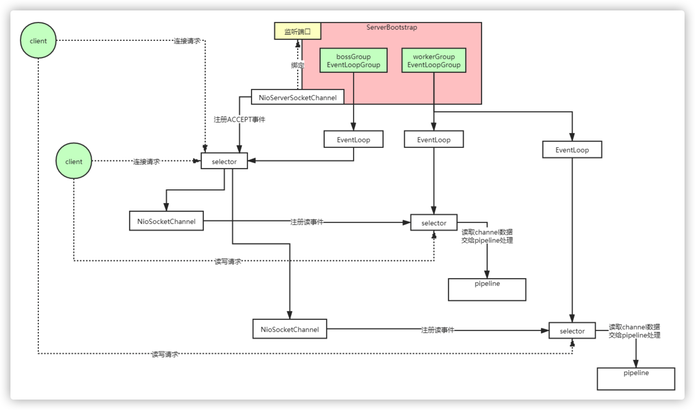

## 2. Netty线程模型源码剖析图

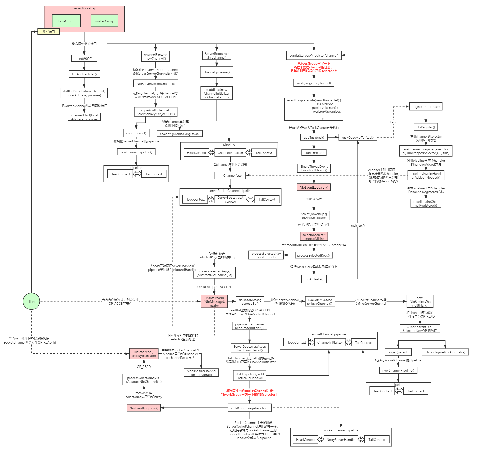

## 3. Netty高并发高性能架构设计精髓

- 主从Reactor线程模型
- NIO多路复用非阻塞
- **无锁串行化**设计思想
- 支持高性能序列化协议
- 零拷贝(直接内存的使用)
- ByteBuf内存池设计
- 灵活的TCP参数配置能力
- 并发优化

### 3.1 无锁串行化设计思想

在大多数场景下，并行多线程处理可以提升系统的并发性能。但是，如果对于共享资源的并发访问处理不当，会带来严重的锁竞争，这最终会导致性能的下降。为了尽可能的避免锁竞争带来的性能损耗，可以通过串行化设计，即消息的处理尽可能在同一个线程内完成，期间不进行线程切换，这样就避免了多线程竞争和同步锁。

为了尽可能提升性能，Netty采用了串行无锁化设计，在IO线程内部进行串行操作，避免多线程竞争导致的性能下降。表面上看，串行化设计似乎CPU利用率不高，并发程度不够。但是，通过调整NIO线程池的线程参数，可以同时启动多个串行化的线程并行运行，这种局部无锁化的串行线程设计相比一个队列-多个工作线程模型性能更优。

Netty的NioEventLoop读取到消息之后，直接调用ChannelPipeline的fireChannelRead(Object msg)，只要用户不主动切换线程，一直会由NioEventLoop调用到用户的Handler，期间不进行线程切换，这种串行化处理方式避免了多线程操作导致的锁的竞争，从性能角度看是最优的。

### 3.2 ByteBuf内存池设计

随着JVM虚拟机和JIT即时编译技术的发展，对象的分配和回收是个非常轻量级的工作。但是对于缓冲区Buffer(相当于一个内存块)，情况却稍有不同，特别是对于堆外直接内存的分配和回收，是一件耗时的操作。为了尽量重用缓冲区，Netty提供了基于ByteBuf内存池的缓冲区重用机制。需要的时候直接从池子里获取ByteBuf使用即可，使用完毕之后就重新放回到池子里去。下面我们一起看下Netty ByteBuf的实现：

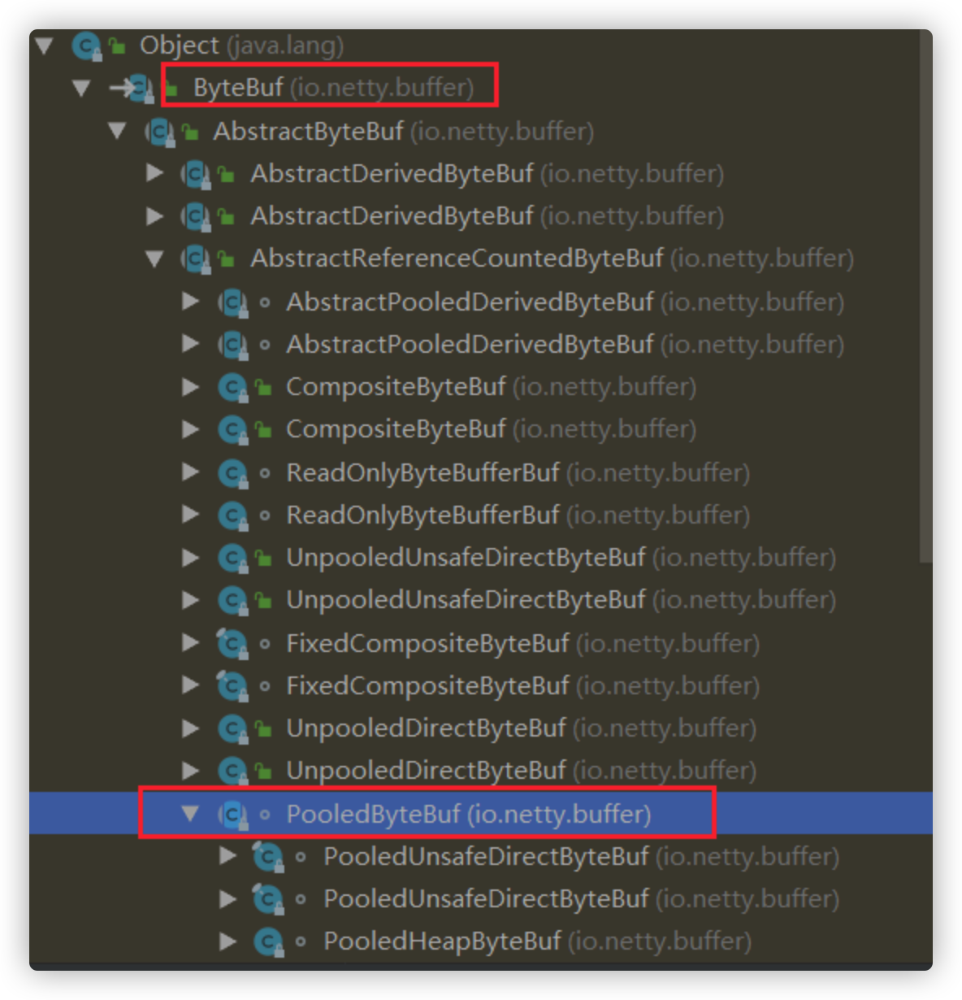

 

可以看下netty的读写源码里面用到的ByteBuf内存池，比如read源码NioByteUnsafe.read()

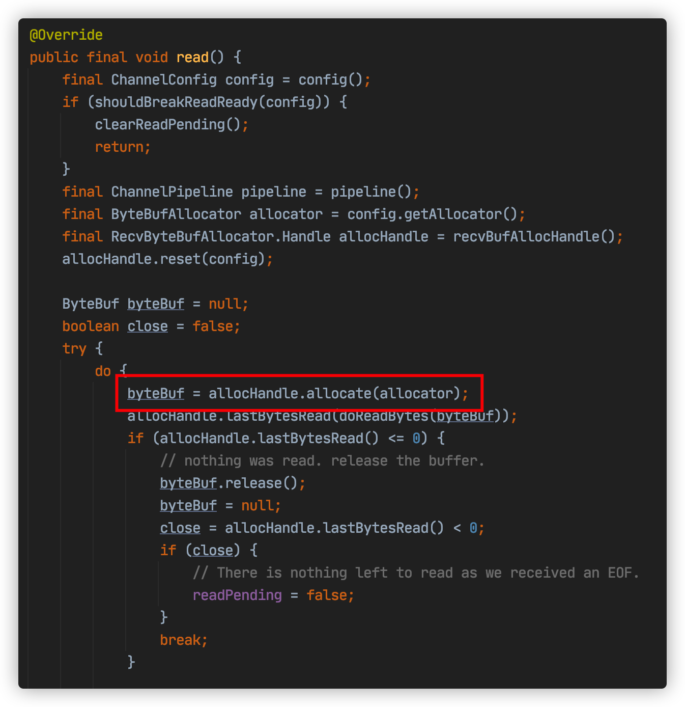

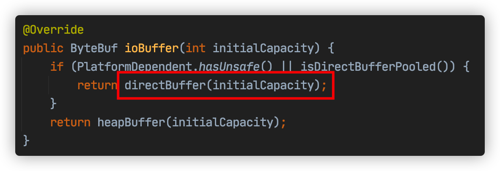

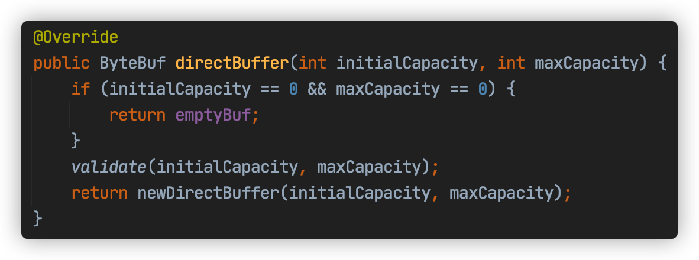

 继续看newDirectBuffer方法，我们发现它是一个抽象方法，由AbstractByteBufAllocator的子类负责具体实现，代码如下：

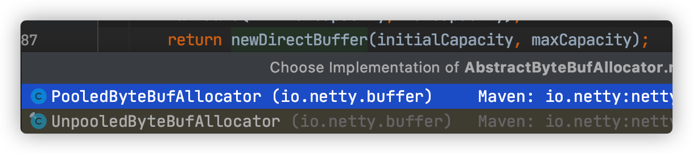

 代码跳转到PooledByteBufAllocator的newDirectBuffer方法，从Cache中获取内存区域PoolArena，调用它的allocate方法进行内存分配：

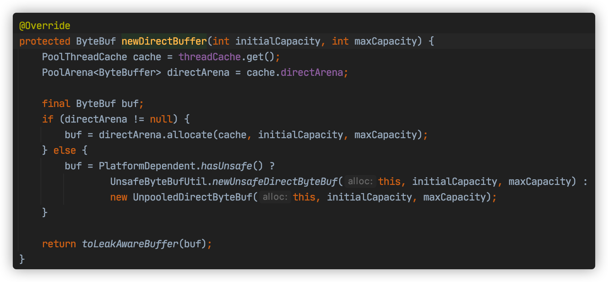

 PoolArena的allocate方法如下：

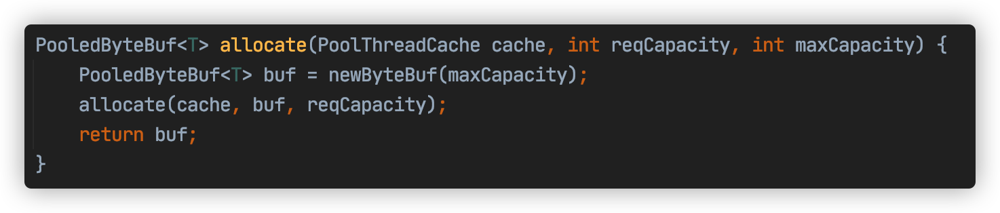

 我们重点分析newByteBuf的实现，它同样是个抽象方法，由子类DirectArena和HeapArena来实现不同类型的缓冲区分配

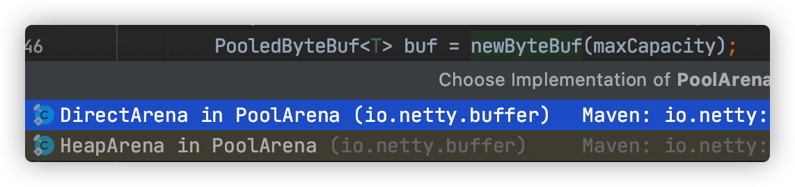

 我们这里使用的是直接内存，因此重点分析DirectArena的实现

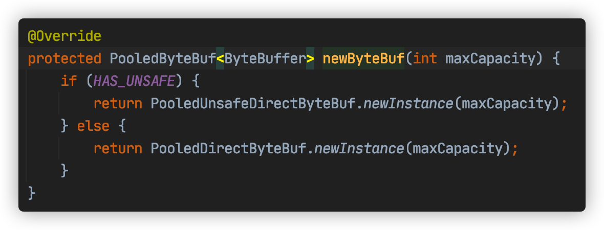

 最终执行了PooledUnsafeDirectByteBuf的newInstance方法，代码如下：

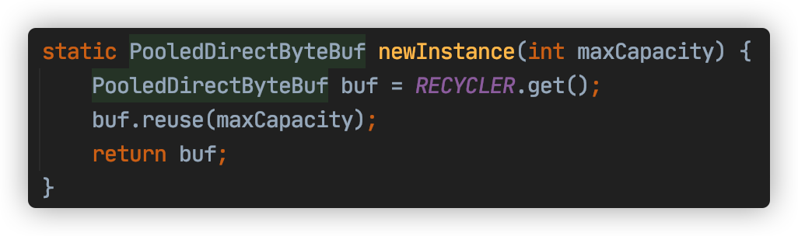

 通过RECYCLER的get方法循环使用ByteBuf对象，如果是非内存池实现，则直接创建一个新的ByteBuf对象。

### 3.3 灵活的TCP参数配置能力

合理设置TCP参数在某些场景下对于性能的提升可以起到显著的效果，例如接收缓冲区SO_RCVBUF和发送缓冲区SO_SNDBUF。如果设置不当，对性能的影响是非常大的。通常建议值为128K或者256K。

Netty在启动辅助类ChannelOption中可以灵活的配置TCP参数，满足不同的用户场景。

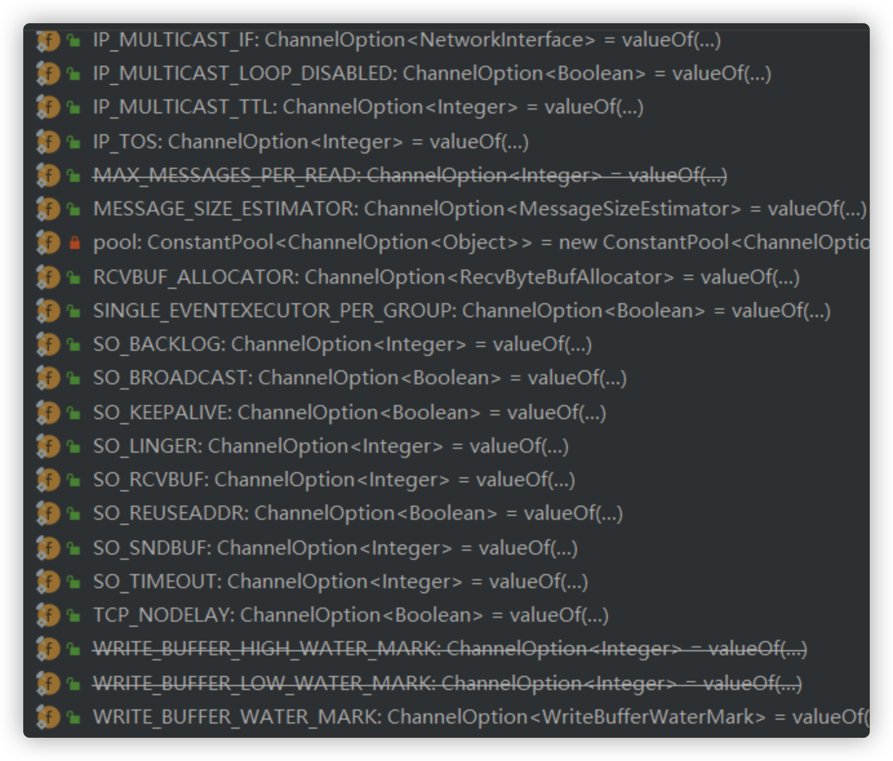

 

### 3.4 并发优化

- volatile的大量、正确使用;
- CAS和原子类的广泛使用；
- 线程安全容器的使用；
- 通过读写锁提升并发性能。