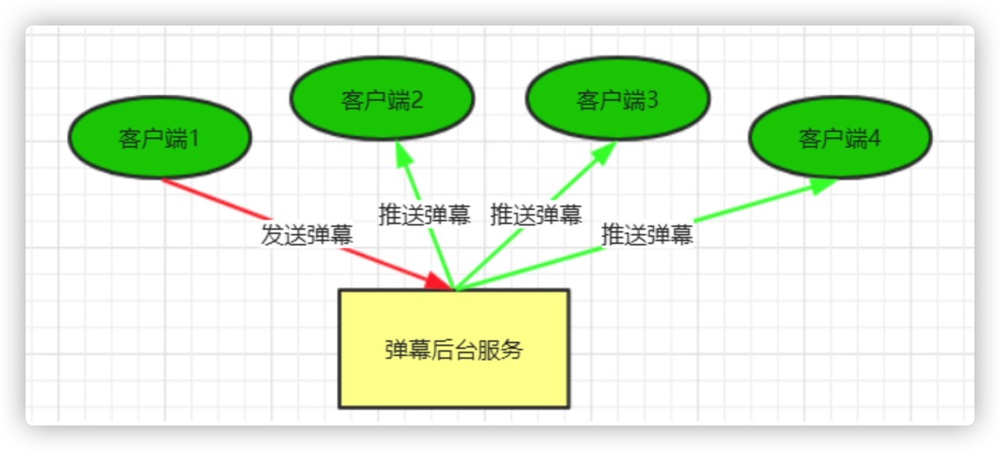
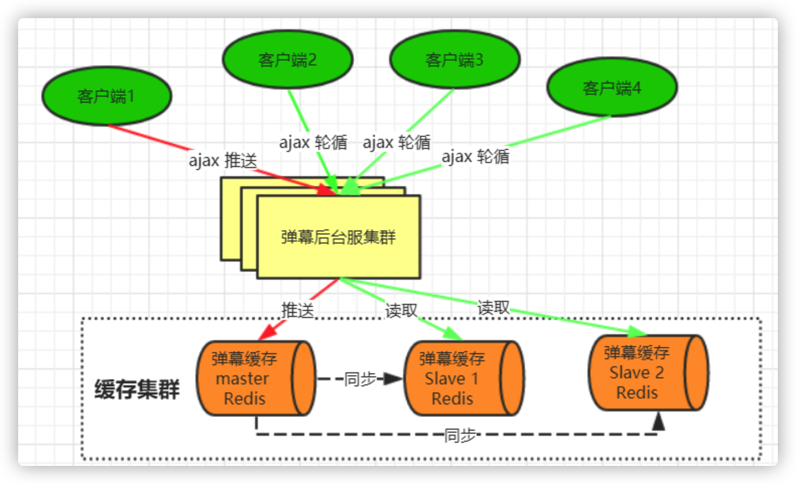
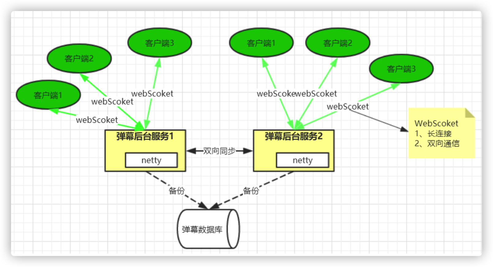
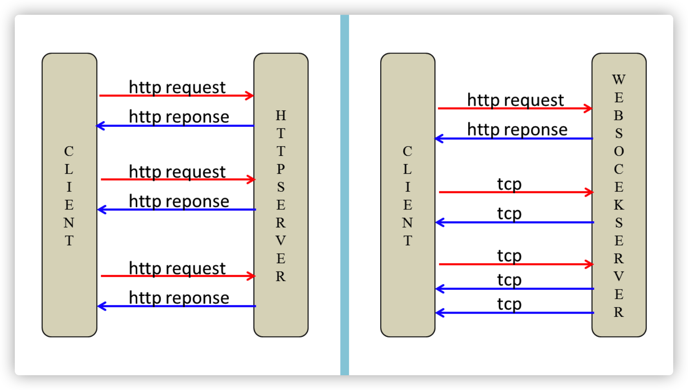
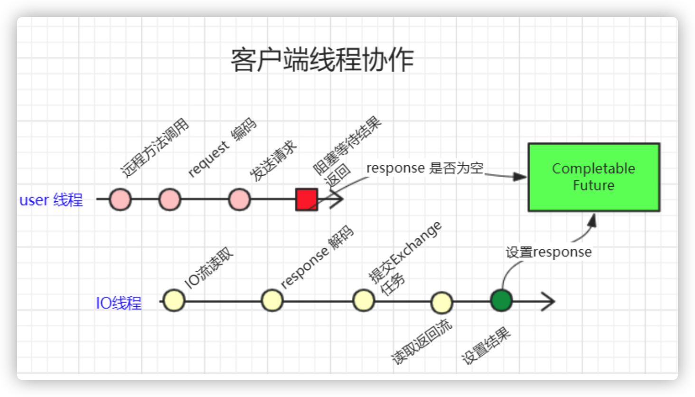
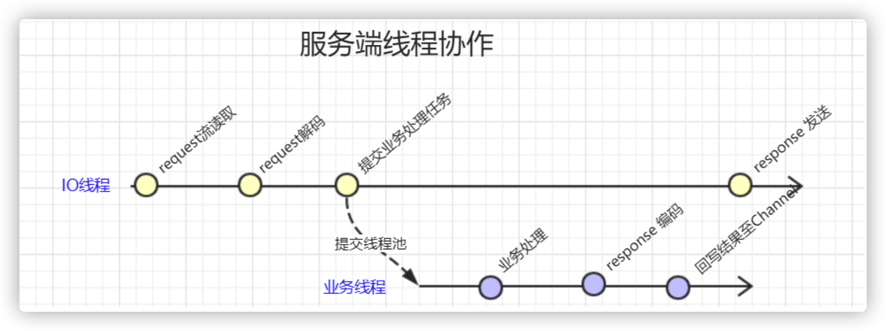

# Netty在弹幕系统与Dubbo框架中的应用

## 1. 弹幕系统概要设计

#### 什么是弹幕系统？


弹幕系统特点：

1. **实时性高**：你发我收， 毫秒之差
2. **并发量大**：一人吐槽，万人观看
3. 对数据一至性要求并不高.


## 2. 弹幕系统架构设计

##### 业务架构



​	

##### 实现方案一



##### 实现方案二




## 3. WebScoket协议解析实现

### 3.1 webSocket 协议简介

webSocket 是html5 开始提供的一种浏览器与服务器间进行全双工二进制通信协议，其基于TCP双向全双工作进行消息传递，同一时刻即可以发又可以接收消息，相比Http的半双工协议性能有很大的提升

##### webSocket特点如下：

1. 单一TCP长连接，采用全双工通信模式
2. 对代理、防火墙透明
3. 无头部信息、消息更精简
4. 通过ping/pong 来保活
5. 服务器可以主动推送消息给客户端，不在需要客户轮询

### 3.2 WebSocket 协议报文格式

我们知道，任何应用协议都有其特有的报文格式，比如Http协议通过 空格 换行组成其报文。如http 协议不同在于WebSocket属于二进制协议，通过规范进二进位来组成其报文。具体组成如下图：


##### 报文说明：

FIN

标识是否为此消息的最后一个数据包，占 1 bit

RSV1, RSV2, RSV3: 用于扩展协议，一般为0，各占1bit

Opcode

数据包类型（frame type），占4bits

0x0：标识一个中间数据包

0x1：标识一个text类型数据包

0x2：标识一个binary类型数据包

0x3-7：保留

0x8：标识一个断开连接类型数据包

0x9：标识一个ping类型数据包

0xA：表示一个pong类型数据包

0xB-F：保留

MASK：占1bits

用于标识PayloadData是否经过掩码处理。如果是1，Masking-key域的数据即是掩码密钥，用于解码PayloadData。客户端发出的数据帧需要进行掩码处理，所以此位是1。

Payload length

Payload data的长度，占7bits，7+16bits，7+64bits：

如果其值在0-125，则是payload的真实长度。

如果值是126，则后面2个字节形成的16bits无符号整型数的值是payload的真实长度。注意，网络字节序，需要转换。

如果值是127，则后面8个字节形成的64bits无符号整型数的值是payload的真实长度。注意，网络字节序，需要转换。

Payload data

应用层数据

### 3.3 WebSocket 在浏览当中的使用

Http 连接与webSocket 连接建立示意图：



通过javaScript 中的API可以直接操作WebSocket 对象，其示例如下：

```js
var ws = new WebSocket(“ws://localhost:8080”); 
ws.onopen = function()// 建立成功之后触发的事件 { 
  console.log(“打开连接”);   ws.send("ddd"); // 发送消息 
  }; 
  ws.onmessage = function(evt)  { // 接收服务器消息
    console.log(evt.data); 
    }; 
    ws.onclose   = function(evt)  { 
      console.log(“WebSocketClosed!”); // 关闭连接  };
      ws.onerror   = function(evt)  { 
      console.log(“WebSocketError!”); // 连接异常 
 }; 
```

##### 弹幕系统实时演示

```bash
#启动服务
#查看当前端口连接数
netstat -nat|grep -i "8880"|wc -l
#查看指定进程线程数
pstree -p 3000 | wc -l
```


## 4. Netty在Dubbo中应用分析

远程调用  注册中心、负载均衡、容错、透明化 => 协议实现  Dubbo 协议

### 4.1 网络传输的实现组成


1. **IO模型：**
  2. BIO 同步阻塞
  3. NIO 同步非阻塞
  4. AIO 异步非阻塞 
5. **连接模型：**
  6. 长连接
  7. 短连接
8. **线程分类：**
  9. IO线程
  10. 服务端业务线程
  11. 客户端调度线程
  12. 客户端结果exchange线程。
  13. 保活心跳线程
  14. 重连线程
15. **线程池模型：**
  16. 固定数量线程池
  17. 缓存线程池
  18. 有限线程池

### 4.2 dubbo传输uml类图


### 4.3 Dubbo 传输协作线程

1. **客户端调度线程**：用于发起远程方法调用的线程。
2. **客户端IO线程：**由传输框架实现，用于request 消息流发送、response 消息流读取与解码等操作。
3. **服务端IO线程**：由传输框架实现，用于request消息流读取与解码 与Response发送。
4. **业务执行线程：**服务端具体执行业务方法的线程

##### 客户端线程协作流程



1. **调度线程**
  2. 调用远程方法
  3. 对request 进行协议编码
  4. 发送request 消息至IO线程
  5. 等待结果的获取
6. **IO线程**
  7. 读取response流
  8. response 解码
  9. 封返回结果
  10. 填充返回结果

##### 调用调试

设置超时任务:

>newFuture:98, DefaultFuture (org.apache.dubbo.remoting.exchange.support)
>request:116, HeaderExchangeChannel (org.apache.dubbo.remoting.exchange.support.header)
>request:84, HeaderExchangeClient (org.apache.dubbo.remoting.exchange.support.header)
>request:80, ReferenceCountExchangeClient (org.apache.dubbo.rpc.protocol.dubbo)
>doInvoke:97, DubboInvoker (org.apache.dubbo.rpc.protocol.dubbo)
>invoke:155, AbstractInvoker (org.apache.dubbo.rpc.protocol)
>invoke:52, AsyncToSyncInvoker (org.apache.dubbo.rpc.protocol)
>invoke:92, MonitorFilter (org.apache.dubbo.monitor.support)
>invoke:82, ProtocolFilterWrapper$1 (org.apache.dubbo.rpc.protocol)
>invoke:54, FutureFilter (org.apache.dubbo.rpc.protocol.dubbo.filter)
>invoke:82, ProtocolFilterWrapper$1 (org.apache.dubbo.rpc.protocol)
>invoke:14, ProviderHelloFilter (com.tuling.dubbo)
>invoke:82, ProtocolFilterWrapper$1 (org.apache.dubbo.rpc.protocol)
>invoke:60, ConsumerContextFilter (org.apache.dubbo.rpc.filter)
>invoke:82, ProtocolFilterWrapper$1 (org.apache.dubbo.rpc.protocol)
>invoke:157, ProtocolFilterWrapper$CallbackRegistrationInvoker (org.apache.dubbo.rpc.protocol)
>invoke:78, ListenerInvokerWrapper (org.apache.dubbo.rpc.listener)
>invoke:56, InvokerWrapper (org.apache.dubbo.rpc.protocol)
>doInvoke:82, FailoverClusterInvoker (org.apache.dubbo.rpc.cluster.support)
>invoke:248, AbstractClusterInvoker (org.apache.dubbo.rpc.cluster.support)
>invoke:78, MockClusterInvoker (org.apache.dubbo.rpc.cluster.support.wrapper)
>invoke:55, InvokerInvocationHandler (org.apache.dubbo.rpc.proxy)
>getUser:-1, proxy0 (org.apache.dubbo.common.bytecode)
>main:43, DubboClient (com.tuling.dubbo)

发起管道调用：

>writeAndFlush:1071, DefaultChannelPipeline (io.netty.channel)
>writeAndFlush:300, AbstractChannel (io.netty.channel)
>send:134, NettyChannel (org.apache.dubbo.remoting.transport.netty4)
>send:177, AbstractClient (org.apache.dubbo.remoting.transport)
>send:53, AbstractPeer (org.apache.dubbo.remoting.transport)
>request:118, HeaderExchangeChannel (org.apache.dubbo.remoting.exchange.support.header)
>request:84, HeaderExchangeClient (org.apache.dubbo.remoting.exchange.support.header)
>request:80, ReferenceCountExchangeClient (org.apache.dubbo.rpc.protocol.dubbo)
>doInvoke:97, DubboInvoker (org.apache.dubbo.rpc.protocol.dubbo)
>invoke:155, AbstractInvoker (org.apache.dubbo.rpc.protocol)
>invoke:52, AsyncToSyncInvoker (org.apache.dubbo.rpc.protocol)
>invoke:92, MonitorFilter (org.apache.dubbo.monitor.support)
>invoke:82, ProtocolFilterWrapper$1 (org.apache.dubbo.rpc.protocol)
>invoke:54, FutureFilter (org.apache.dubbo.rpc.protocol.dubbo.filter)
>invoke:82, ProtocolFilterWrapper$1 (org.apache.dubbo.rpc.protocol)
>invoke:14, ProviderHelloFilter (com.tuling.dubbo)
>invoke:82, ProtocolFilterWrapper$1 (org.apache.dubbo.rpc.protocol)
>invoke:60, ConsumerContextFilter (org.apache.dubbo.rpc.filter)
>invoke:82, ProtocolFilterWrapper$1 (org.apache.dubbo.rpc.protocol)
>invoke:157, ProtocolFilterWrapper$CallbackRegistrationInvoker (org.apache.dubbo.rpc.protocol)
>invoke:78, ListenerInvokerWrapper (org.apache.dubbo.rpc.listener)
>invoke:56, InvokerWrapper (org.apache.dubbo.rpc.protocol)
>doInvoke:82, FailoverClusterInvoker (org.apache.dubbo.rpc.cluster.support)
>invoke:248, AbstractClusterInvoker (org.apache.dubbo.rpc.cluster.support)
>invoke:78, MockClusterInvoker (org.apache.dubbo.rpc.cluster.support.wrapper)
>invoke:55, InvokerInvocationHandler (org.apache.dubbo.rpc.proxy)
>getUser:-1, proxy0 (org.apache.dubbo.common.bytecode)
>main:43, DubboClient (com.tuling.dubbo)

##### 服务端线程协作



1. **IO线程：**
  2. request 流读取
  3. request 解码
  4. 提交业务处理任务
5. **业务线程：**
  6. 业务方法执行
  7. response 编码
  8. 回写结果至channel