# RabbitMQ基本概念讲解

## 1. 为什么选择RabbitMQ

- 开源，性能好，稳定性保证
- 提供了消息的可靠性投递（confirm），返回模式
- 与sping amqp 整合和完美，提供丰富的api
- 集群模式十分丰富(HA模式 镜像队列模型)
- 保证数据不丢失的情况下，保证很好的性能


## 2. RabbitMQ高性能是如何做到的

- 使用的语言是elang语言(通常使用到交互机上)，elang的语言的性能能与原生socket的延迟效果.

- 消息入队的延时已经消息的消费的响应很快


## 3. AMQP协议(Advanced message queue protocol) 高级消息队列协议

- 是一个二进制协议
- amqp 是一个应用层协议的规范（定义了很多规范）,可以有很多不同的消息中间件产品（需要遵循该规范
    - server：是消息队列节点
    - virtual host:虚拟注解
    - exchange 交换机（消息投递到交换机上）
    - message queue（被消费者监听消费）

交互机和队列是有一个绑定的关系 

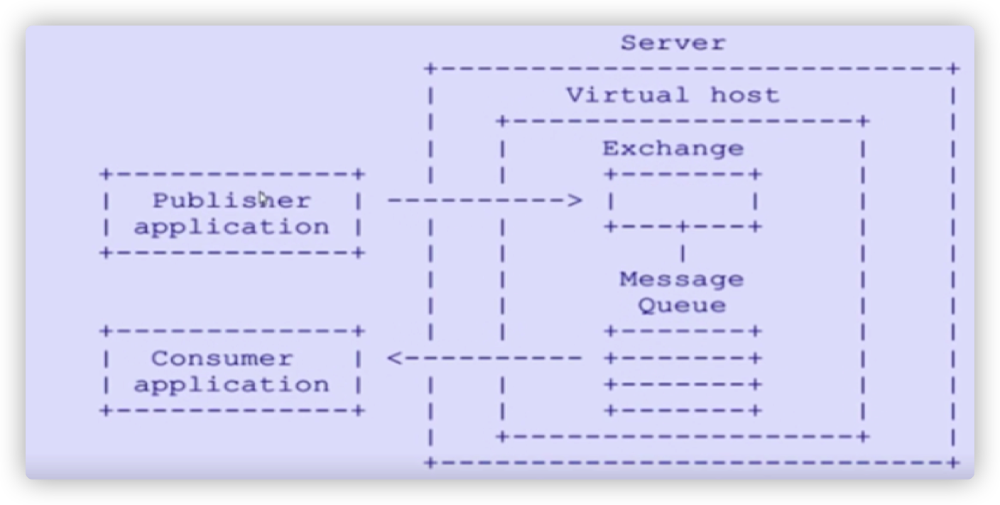


## 4. AMQP的核心概念

#### server

又称为broker，接受客户端连接，实现amqp实体服务 

#### connection

连接,应用程序与brokder建立网络连接

#### channel

网络通道，几乎所有的操作都是在channel中进行的，是进行消息对象的通道，客户端可以建立 多个通道，每一个channel表示一个会话任务

#### message

服务器和应用程序之间传递数据的载体，有properties（消息属性,用来修饰消息,比如消息的优 先级,延时投递）和Body（消息体）

#### virtual host

虚拟主机，是一个逻辑概念,最上层的消息路由，一个虚拟主机中可以包含多个exhange 和 queue 但是一个虚拟主机中不能有名称相同的exchange 和queue

#### exchange

交换机，消息直接投递到交换机上，然后交换机根据消息的路由key 来路由到对应绑定的队列上

#### baingding

绑定 exchange 与queue的虚拟连接,bingding中可以包含route_key

#### route_key

路由key ，他的作用是在交换机上通过route_key来把消息路由到哪个队列上

#### queue

队列，用于来保存消息的载体，有消费者监听，然后消费消息


## 5. RabbitMQ的整体架构模型 

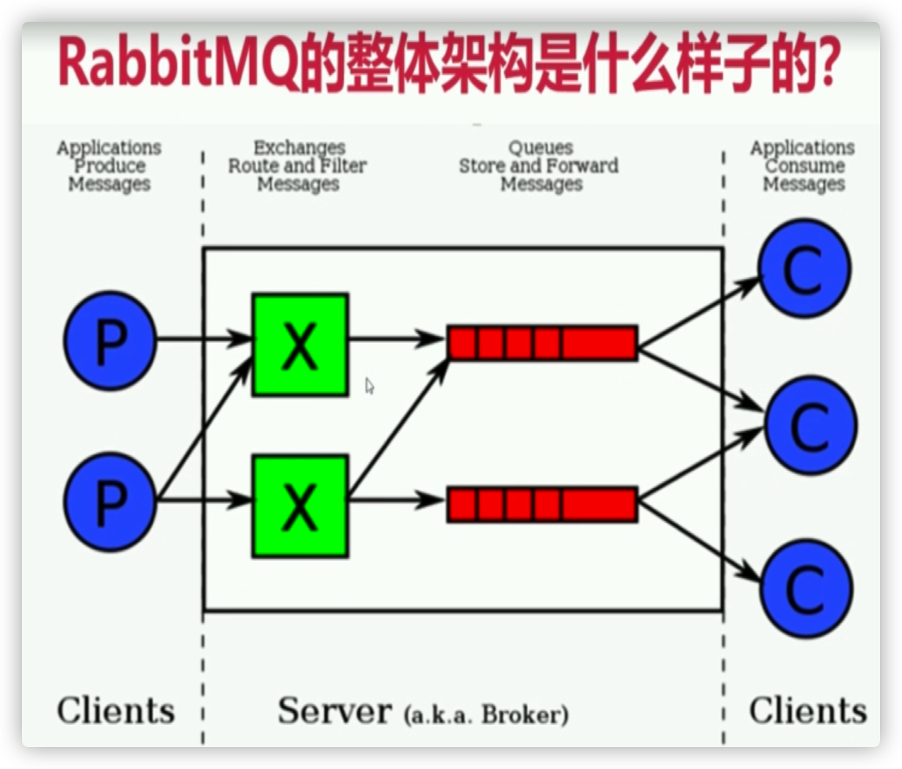


## 6. RabbitMQ的消息如何流转的

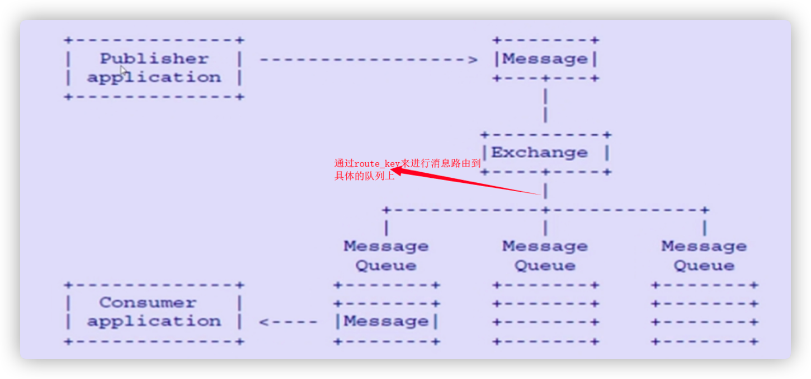


## 7. RabbitMQ的安装和使用

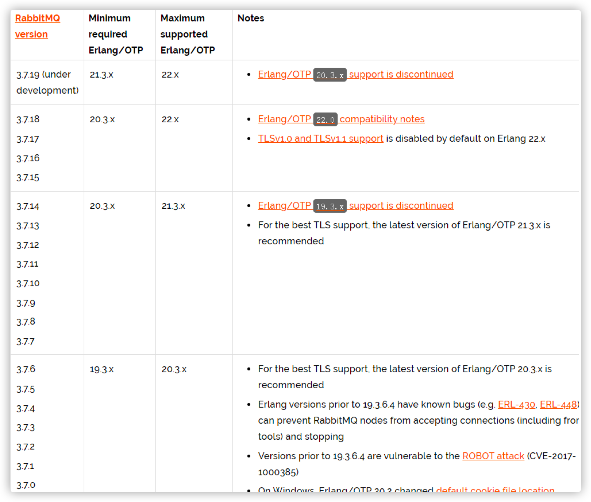

##### 安装rabbitmq所需要的依赖包

```bash
yum install build-essential openssl openssl-devel unixODBC unixODBC-devel make gcc gccc++ kernel-devel m4 ncurses-devel tk tc xz
```

##### 下载安装包 (cd /usr/local/software)

```bash
wget www.rabbitmq.com/releases/erlang/erlang-18.3-1.el7.centos.x86_64.rpm 
wget http://repo.iotti.biz/CentOS/7/x86_64/socat-1.7.3.2-5.el7.lux.x86_64.rpm 
wget www.rabbitmq.com/releases/rabbitmq-server/v3.6.5/rabbitmq-server-3.6.5-1.noarch.rpm
```

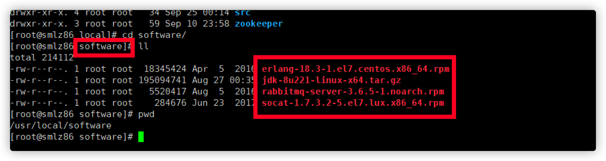

##### 安装服务命令

```bash
# 第一步:安装erlang语言环境
rpm -ivh erlang-18.3-1.el7.centos.x86_64.rpm
# 第二步:安装socat加解密软件 
rpm -ivh socat-1.7.3.2-5.el7.lux.x86_64.rpm 
# 第三步:最后安装rabbitmq 
rpm -ivh rabbitmq-server-3.6.5-1.noarch.rpm
```

##### 修改集群用户与连接心跳检测

注意修改vim /usr/lib/rabbitmq/lib/rabbitmq_server-3.6.5/ebin/rabbit.app文件

修改：loopback_users 中的 <<"guest">>,只保留guest（不修改只能通过localhost访问）

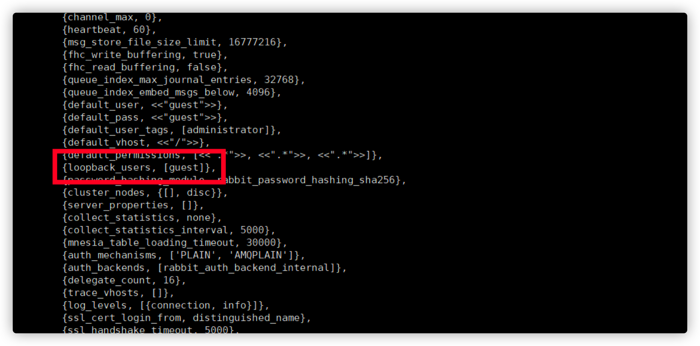

##### 修改本机系统文件 

- 修改 vim /etc/rabbitmq/rabbitmq-env.conf 添加: NODENAME=rabbit

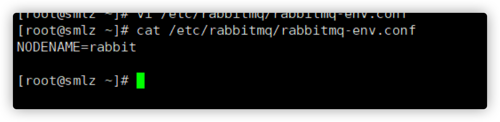

- 修改 vim /etc/hostname

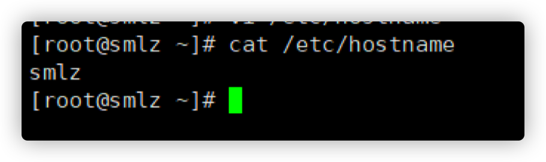

- 修改本地 vim /etc/hosts文件

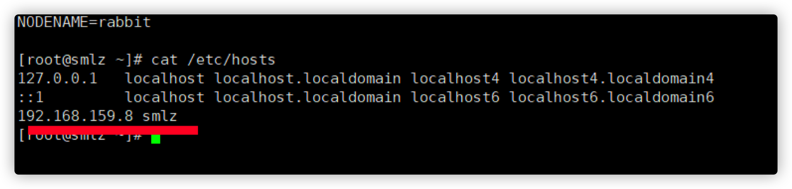

##### 验证服务器是可用的

```bash
rabbitmq-server start & 
```

执行管控台插件（不然不能在浏览器方法）

```bash
rabbitmq-plugins enable rabbitmq_management 
```

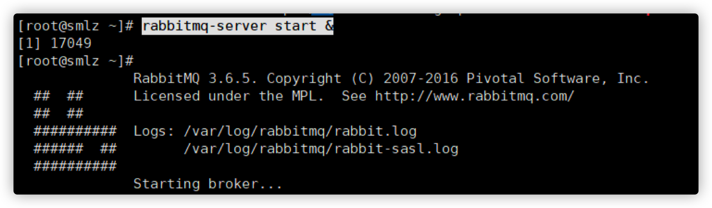

检查端口

```bash
lsof -i:5672
```

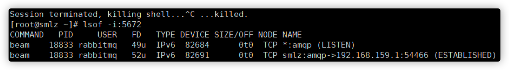

通过

```bash
ps -ef|grep rabbitmq
```

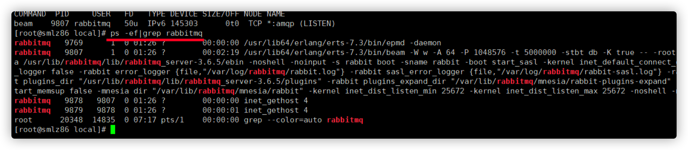

访问地址：http://192.168.159.8:15672

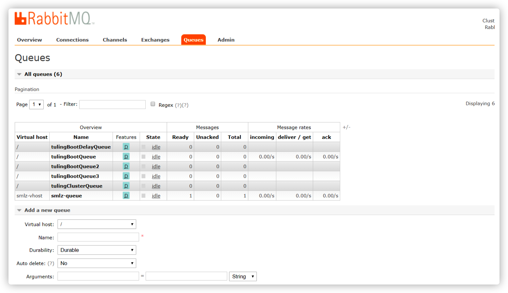

> 具体安装3.6.5的文档：https://www.cnblogs.com/sky-cheng/p/10709104.html 
>
> 卸载文档：https://www.cnblogs.com/kingsonfu/p/11023967.html 
>
> 插件地址：https://www.rabbitmq.com/community-plugins.html 
>
> 延时插件地址：https://dl.bintray.com/rabbitmq/communityplugins/3.6.x/rabbitmq_delayed_message_exchange/ 
>
> ```bash
> # 下载延时插件
> wget https://dl.bintray.com/rabbitmq/communityplugins/3.6.x/rabbitmq_delayed_message_exchange/rabbitmq_delayed_message_exchange-201712153.6.x.zip
> 
> # 解压延时插件
> unzip rabbitmq_delayed_message_exchange-20171215-3.6.x.zip
> 
> # 把延时插件拷贝到指定目录下
> cp rabbitmq_delayed_message_exchange-20171215-3.6.x.ez /usr/lib/rabbitmq/lib/rabbitmq_server-3.7.5/plugins
> 
> # 启动延时插件
> rabbitmq-plugins enable rabbitmq_delayed_message_exchange
> ```
>
> 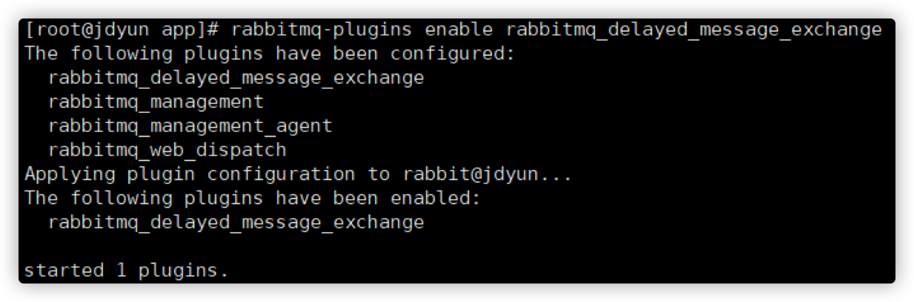


## 8. 命令行和管控台

开启管控台插件

```bash
rabbitmq-plugus rabbitmq_management 
```

测试连接：http://ip:15672  

用户名密码：guest/guest

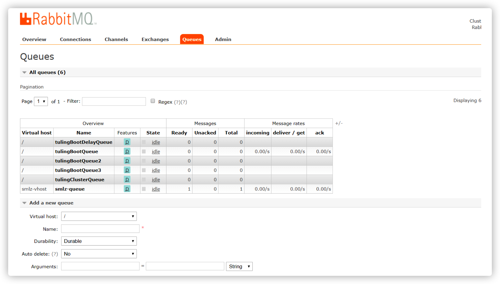

### 8.1 管理控制台命令:

##### 起停服务命令

- 启动服务 

```bash
# 启动rabbitmq节点 保证需要erlang虚拟机节点起来才能执行
rabbitmqctl start_app
```

- 停止服务 

```bash
# 停止rabbtimq节点，但是不会停止erlang节点
rabbitmqctl stop_app
# 都会停止
rabbitmqctl stop
```

- 查看服务状态

```bash
rabbtimqctl status
```

### 8.2 用户操作命令

- 查看所有用户列表

```bash
rabbitmq list_users
```

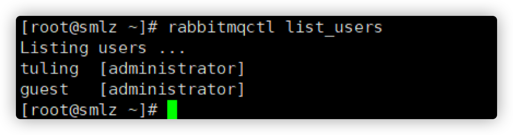

- 添加用户

```bash
rabbitmqctl add_user tyrival tyrival
```

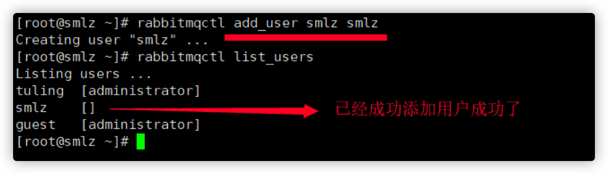

- 设置rabbitmq用户的角色

```bash
rabbitmqctl set_user_tags tyrival administrator
```

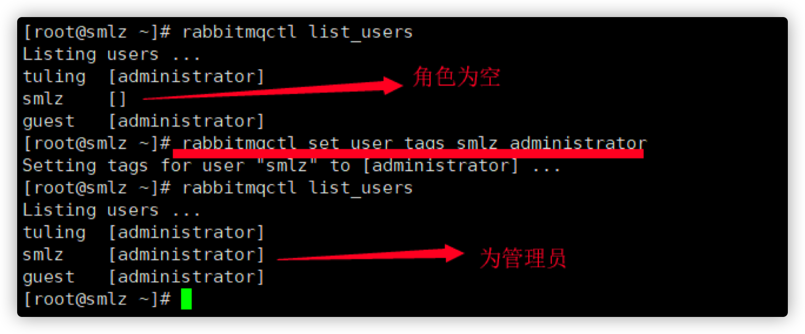

- 为用户设置权限

```bash
rabbitmqctl set_permissions -p / tyrival ".*" ".*" ".*"
rabbitmqctl set_permissions -p <虚拟机> <用户名> ".*" ".*" ".*"
```

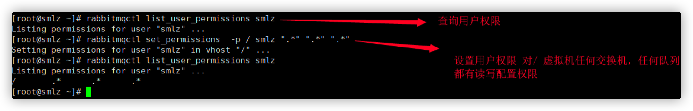

- 列出用户权限

```bash
rabbitmqctl list_user_permissions tyrival
```


- 清除用户权限

```bash
rabbitmqctl clear_permissions -p <虚拟机> <用户名>
```

 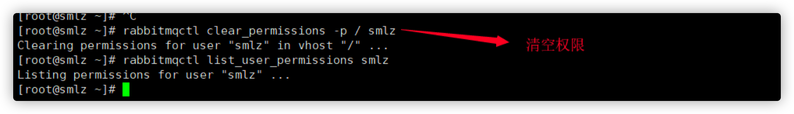

- 删除用户

```bash
rabbitmqctl delete_user root 
```

- 修改密码

```bash
rabbitmqctl change_password 用户名 新密码
```

### 8.3 虚拟主机操作

```bash
# 增加一个虚拟主机 
rabbitmqctl add_vhost /cloudmall 
# 查看所有的虚拟主机
rabbitmqctl list_vhosts
# 查看虚拟主机的权限
rabbitmqctl list_permissions -p /cloudmall
# 删除虚拟主机
rabbitmqctl delete_vhost /cloudmall
```

### 8.4 操作队列命令

```bash
# 查询所有队列
rabbitmqctl list_queues 
# 清除队列消息
rabbitmqctl -p vhostpath purge_queue blue
```

### 8.5 高级命令

```bash
# 移除所有数据，该命令需要在rabbitmqctl stop_app命令之后才执行（也就是说在服务停止后）
rabbitmqctl reset
# 组成集群命令
rabbitmqctl join_cluster <cluster_node> [--ram]
# 查看集群状态
rabbitmqctl cluster_status
# 修改集群节点存储数据模式
rabbitmqctl change_cluster_node_type dist|ram
# 忘记节点（摘除节点）
rabbitmqctl forget_cluster_node [--offline]
# 修改节点名称
rabbitmqctc rename_cluster_node oldnode1 newnode1 oldnode2 newnode2
```


## 9. 消费者 生产者模型（使用java连接mq）

#### 生产者

```java
public class RabbitmqProducter {

    public static void main(String[] args) throws IOException, TimeoutException {
        // 1. 创建连接工厂
        ConnectionFactory connectionFactory = new ConnectionFactory();
        // 2. 设置连接工厂的属性
        connectionFactory.setHost("192.168.159.8");
        connectionFactory.setPort(5672);
        connectionFactory.setVirtualHost("tyrival");
        connectionFactory.setUsername("tyrival");
        connectionFactory.setPassword("tyrival");
        // 3. 通过连接工厂创建连接对象
        Connection connection = connectionFactory.newConnection();
        // 4. 通过连接创建channel Channel channel = connection.createChannel();
        // 5. 通过channel发送消息
        for (int i = 0; i < 5; i++) {
            String message = "hello--" + i;
            /**
             * 以前讲过说我们的消息会发送的exchange上，
             * 但是在这里我们没有指定交换机?
             * 那我们的消息发送到哪里了？？？？
             * The default exchange is implicitly bound to every queue, 
             * with a routing key equal to the queue name.
             * It is not possible to explicitly bind to, 
             * or unbind from the default exchange. It also cannot be deleted.
             * 说明:加入我们消息发送的时候没有指定具体的交换机的话，
             * 那么就会发送到rabbimtq指定默认的交换机上，
             * 那么该交换机就会去根据routing_key 查找对应的queueName 然后发送的该队列上.
             */
            channel.basicPublish("", "tyrival-queue-01", null, message.getBytes());
        }
        // 6. 关闭连接
        channel.close();
        connection.close();
    }
}
```

#### 消费者

```java
public class RabbitmqConsumer {
    public static void main(String[] args) throws IOException, TimeoutException, InterruptedException {
        // 创建连接工厂
        ConnectionFactory connectionFactory = new ConnectionFactory();
        connectionFactory.setHost("192.168.159.8");
        connectionFactory.setPort(5672);
        connectionFactory.setVirtualHost("tyrival");
        connectionFactory.setUsername("tyrival");
        connectionFactory.setPassword("tyrival");
        // 创建连接
        Connection connection = connectionFactory.newConnection();
        // 创建一个
        channel Channel channel = connection.createChannel();
        // 声明队列
        String queueName = "tyrival-queue-01";
        /**
         * queue:队列的名称
         * durable:是否持久化, 队列的声明默认是存放到内存中的，如果rabbitmq重启会丢失，如果想重启之后还存在就要使队列持久化，
         * 保存到Erlang自带的Mnesia数据库中，当rabbitmq重启之后会读取该数据库
         * exclusive:当连接关闭时connection.close()该队列是否会自动删除；
         * 二：该队列是否是私有的private，如果不是排外的，可以使用两个消费者都访问同一个队列，
         * 没有任何问题，如果是排外的，会对当前队列加锁，其他通道channel是不能访问的，如果强制访问会报异常
         * com.rabbitmq.client.ShutdownSignalException: channel error; 
         * protocol method: #method<channel.close>(reply-code=40
         * 一般等于true的话用于一个队列只能有一个消费者来消费的场景 
         * autodelete:是否自动删除，当最后一个消费者断开连接之后队列是否自动被删除，可以通过RabbitMQ Management，
         * 查看某个队列的消费者数量，当consumers = 0时队列就会自动删除
         */
        channel.queueDeclare(queueName, true, false, true, null);
        // 创建消费者
        QueueingConsumer queueingConsumer = new QueueingConsumer(channel);
        channel.basicConsume(queueName, true, queueingConsumer);
        while (true) {
            QueueingConsumer.Delivery delivery = queueingConsumer.nextDelivery();
            String reserveMsg = new String(delivery.getBody());
            System.out.println("消费消息:" + reserveMsg);
        }
    }
}
```


## 10. RabbitMQ交换机详解

### 10.1 作用

接受生产者的消息，然后根据路由键 把消息投递到跟交换机绑定的对应的队列上

 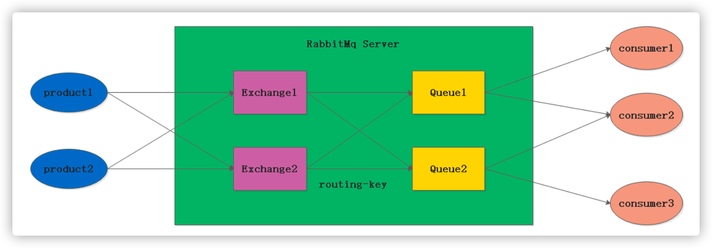

### 10.2 交换机的属性

- Name：交换机的名称

- Type：交换机的类型，direct, topic, fanout, headers

- Durability：是否需要持久化

- autodelete：假如没有队列绑定到该交换机，那么该交换机会自动删除

- Internal：当前交换机是否用户rabbitmq内部使用不常用，默认为false

- Argurements：扩展参数，用户扩展AMQP定制化协议

### 10.3 交换机的类型

#### 直连交换机direct exchange

所以发送的direct exhchange 的消息都会被投递到与routekey名称（与队列名称）相同的queue上

**:direct模式下，可以使用rabbitmq自定exchange----> default exchange

所以不需要交换机和任何队列绑定, 消息将会投递到route_key名称和队列名称相同的队列上

 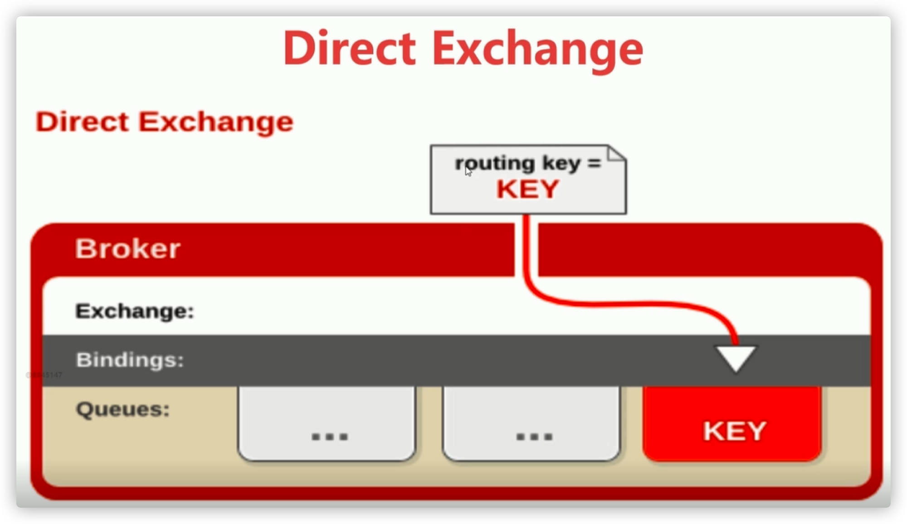

##### 代码演示

直连交换机生产者

```java
public class DirectExchangeProductor {
    public static void main(String[] args) throws IOException, TimeoutException {
        // 创建连接工厂 
        ConnectionFactory connectionFactory = new ConnectionFactory();
        connectionFactory.setHost("192.168.159.8");
        connectionFactory.setPort(5672);
        connectionFactory.setVirtualHost("tyrival-host");
        connectionFactory.setUsername("tyrival");
        connectionFactory.setPassword("tyrival");
        // 创建连接 
        Connection connection = connectionFactory.newConnection();
        // 创建
        channel Channel channel = connection.createChannel();
        // 定义交换机名称 
        String exchangeName = "tyrival.directchange";
        // 定义routingKey
        String routingKey = "tyrival.directchange.key";
        // 消息体内容
        String messageBody = "hello tyrival ";
        channel.basicPublish(exchangeName, routingKey, null, messageBody.getBytes());
    }
}
```

直接交换机消费者

```java
public class DirectExchangeConsumer {
    public static void main(String[] args) throws IOException, TimeoutException, InterruptedException {
        // 创建连接工厂 
        ConnectionFactory connectionFactory = new ConnectionFactory();
        connectionFactory.setHost("192.168.159.8");
        connectionFactory.setPort(5672);
        connectionFactory.setVirtualHost("tyrival-host");
        connectionFactory.setUsername("tyrival");
        connectionFactory.setPassword("tyrival");
        // 创建连接 
        Connection connection = connectionFactory.newConnection();
        // 创建
        channel Channel channel = connection.createChannel();

        String exchangeName = "tyrival.directchange";
        String exchangeType = "direct";
        String queueName = "tyrival.directqueue";
        String routingKey = "tyrival.directchange.key"; 
        /** 
         * 声明一个交换机 * exchange:交换机的名称 
         * type:交换机的类型 常见的有direct,fanout,topic等 
         * durable:设置是否持久化。durable设置为true时表示持久化，反之非持久化.持久化可以将交换器存入磁盘，在服务器重启的时候不会 
         * autodelete:设置是否自动删除。autoDelete设置为true时，则表示自动删除。自动删除的前提是至少有一个队列或者交换器与这个交换 
         * 不能错误的理解—当与此交换器连接的客户端都断开连接时，RabbitMq会自动删除本交换器 
         * arguments:其它一些结构化的参数，比如：alternate-exchange 
         */
        channel.exchangeDeclare(exchangeName, exchangeType, true, false, null);


        /**
         * 声明一个队列 
         * durable:表示rabbitmq关闭删除队列 
         * autodelete:表示没有程序和队列建立连接 那么就会自动删除队列 
         */
        channel.queueDeclare(queueName, true, false, false, null);
        /** 
         * 队里和交换机绑定
         */
        channel.queueBind(queueName, exchangeName, routingKey);
        /** 
         * 创建一个消费者 
         */
        QueueingConsumer queueingConsumer = new QueueingConsumer(channel);
        /** 
         * 开始消费 
         */
        channel.basicConsume(queueName, true, queueingConsumer);
        while (true) {
            QueueingConsumer.Delivery delivery = queueingConsumer.nextDelivery();
            String reciverMessage = new String(delivery.getBody());
            System.out.println("消费消息:-----" + reciverMessage);
        }
    }
}
```

#### 主题交换机 TopicExchange

就是在队列上绑到top 交换机上的路由key 可以是通过通配符来匹配的通配符的规则是 

比如: log.# ：可以匹配一个单词 也可以匹配多个单词 

比如 log.# 可以匹配log.a log.a.b log.* 可以匹配一个单词 

比如 log.* 可以匹配log.a 但是不可以匹配log.a.b

 

##### 代码演示

topic exchange 生产者

```java
public static void main(String[] args) throws IOException, TimeoutException {
    ConnectionFactory connectionFactory = new ConnectionFactory();
    connectionFactory.setVirtualHost("cloudmall");
    connectionFactory.setHost("47.104.128.12");
    connectionFactory.setPort(5672);
    Connection connection = connectionFactory.newConnection();
    Channel channel = connection.createChannel();
    String topExchangeName = "top.exchange";
    String routingKey1 = "top.key.1";
    String routingKey2 = "top.key.2";
    channel.basicPublish(topExchangeName, routingKey1, null, "测试交换机".getBytes());
    channel.basicPublish(topExchangeName, routingKey2, null, "测试交换机".getBytes());
    channel.close();
    connection.close();
}
```

##### 代码演示

topic exhcange 消费者

```java
public class Top4Consumer {
    public static void main(String[] args) throws IOException, TimeoutException, InterruptedException {
        ConnectionFactory connectionFactory = new ConnectionFactory();
        connectionFactory.setVirtualHost("cloudmall");
        connectionFactory.setHost("47.104.128.12");
        connectionFactory.setPort(5672);
        Connection connection = connectionFactory.newConnection();
        Channel channel = connection.createChannel();
        String topicExchangeName = "top.exchange";
        // 声明一个交换机
        channel.exchangeDeclare(topicExchangeName, "topic", true, true, false, null);
        // 声明一个队列 
        channel.queueDeclare("top.queue", true, false, true, null);
        // 队列绑定到交换机 
        channel.queueBind("top.queue", topicExchangeName, "top.#");
        QueueingConsumer queueingConsumer = new QueueingConsumer(channel);
        // 参数：队列名称、是否自动ACK、Consumer 
        channel.basicConsume("top.queue", true, queueingConsumer);
        while (true) {
            QueueingConsumer.Delivery delivery = queueingConsumer.nextDelivery();
            System.out.println(new String(delivery.getBody()));
        }
    }
}
```

#### 扇形交换机 fanout exchange

就是消息通过从交换机到队列上不会通过路由key，所以该模式的速度是最快的，只要和交换机绑定的那么消息就会被分发到与之绑定的队列上

 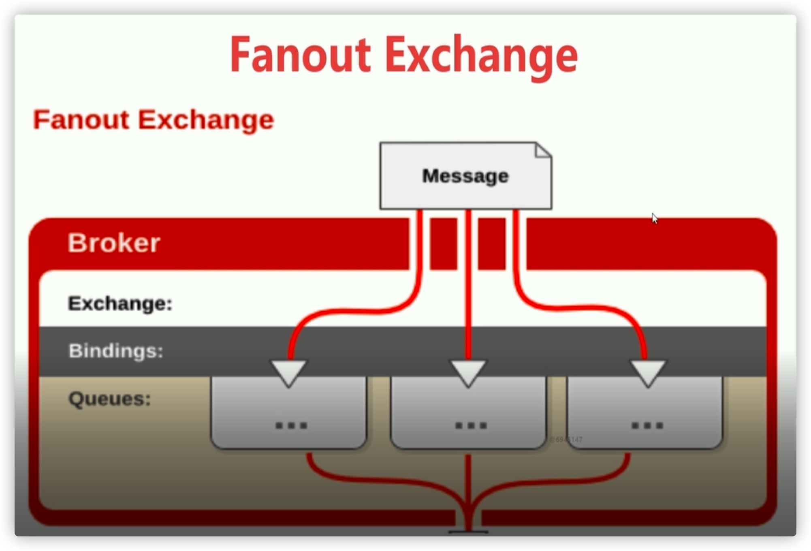

##### 代码演示

扇形交换机模式下的生产者

```java
public static void main(String[] args) throws IOException, TimeoutException {
    ConnectionFactory connectionFactory = new ConnectionFactory();
    connectionFactory.setHost("47.104.128.12");
    connectionFactory.setPort(5672);
    connectionFactory.setVirtualHost("cloudmall");
    Connection connection = connectionFactory.newConnection();
    Channel channel = connection.createChannel();
    String fanoutExchangeName = "test.fanout.exchange";
    String routingKey = "test.fanout.key";
    channel.basicPublish(fanoutExchangeName, routingKey, null, "測試扇形交换机".getBytes());
}
```

扇形交换机模式下的消费者

```java
public static void main(String[] args) 
  throws IOException, TimeoutException, InterruptedException {
    ConnectionFactory connectionFactory = new ConnectionFactory();
    connectionFactory.setHost("47.104.128.12");
    connectionFactory.setPort(5672);
    connectionFactory.setVirtualHost("cloudmall");
    Connection connection = connectionFactory.newConnection();
    Channel channel = connection.createChannel();
    // 创建交换机 
    channel.exchangeDeclare("test.fanout.exchange", "fanout", true, true, false, null);
    // 创建队列 
    channel.queueDeclare("test.fanout.queue", true, false, true, null);
    // 绑定队列 
    channel.queueBind("test.fanout.queue", "test.fanout.exchange", "");
    QueueingConsumer queueingConsumer = new QueueingConsumer(channel);
    channel.basicConsume("test.fanout.queue", true, queueingConsumer);
    while (true) {
        QueueingConsumer.Delivery delivery = queueingConsumer.nextDelivery();
        System.out.println(new String(delivery.getBody()));
    }
}
```


## 11. 队列，绑定虚拟主机，消息

- 绑定：exchange 与之间的连接关系(通过路由规则) 

- 队列：用来存储消息的实体
    - 队列的属性：durability 消息是否被持久化
    - AutoDelete：表示最后一个监听被移除那么该队列就会被删除
- 消息：用来生产着和消费者之间传递数据的
    - 消息属性：包括消息体body 和属性 properties
    - 常用属性：
        - delivery mode
        - headers
        - content_type（消息类型）
        - content_encoding（消息编码）
        - priporty（消息优先级）correntlation_id（最为消息唯一的id）
        - reply_to（消息失败做重回队列）
        - expiretion（消息的过期时间)
        - message_id（消息id）
        - timestamp
        - type
        - user_id
        - app_id
        - cluster_id

自定义消息属性的消费端代码：

```java
public static void main(String[] args) throws IOException, TimeoutException, InterruptedException {
    ConnectionFactory connectionFactory = new ConnectionFactory();
    connectionFactory.setHost("47.104.128.12");
    connectionFactory.setPort(5672);
    connectionFactory.setVirtualHost("/");
    // 2 通过连接工厂创建连接 
    Connection connection = connectionFactory.newConnection();
    // 3 通过connection创建一个Channel 
    Channel channel = connection.createChannel();
    // 4 声明（创建）一个队列 
    String queueName = "test001";
    channel.queueDeclare(queueName, true, false, false, null);
    // 5 创建消费者 
    QueueingConsumer queueingConsumer = new QueueingConsumer(channel);
    // 6 设置Channel
    channel.basicConsume(queueName, true, queueingConsumer);
    while (true) {
        //7 获取消息 
        Delivery delivery = queueingConsumer.nextDelivery();
        String msg = new String(delivery.getBody());
        System.out.println("消费端: " + msg);
        System.out.println(delivery.getProperties());
        System.out.println(delivery.getProperties().getHeaders());
    }
}
```

自定义消息属性的生产着

```java
public static void main(String[] args) throws IOException, TimeoutException {
    // 创建连接工厂
    ConnectionFactory connectionFactory = new ConnectionFactory();
    connectionFactory.setHost("47.104.128.12");
    connectionFactory.setPort(5672);
    connectionFactory.setVirtualHost("/");
    // 创建连接
    Connection connection = connectionFactory.newConnection();
    // 创建channel
    Channel channel = connection.createChannel();
    Map<String, Object> extraMap = new HashMap<>();
    extraMap.put("k1", "v1");
    extraMap.put("k2", "v2");
    /**
     * 附带额外信息的消息体
     */
    AMQP.BasicProperties basicProperties = new AMQP.BasicProperties.Builder()
            .deliveryMode(2)    // 2为持久化，1不是持久化
            .appId("测试appid")
            .clusterId("测试集群id")
            .contentType("application/json")
            .contentEncoding("UTF-8")
            .headers(extraMap)
            .build();
    for (int i = 0; i < 10; i++) {
        String tragetMsg = "这是我的第【" + (i + 1) + "】条消息";
        channel.basicPublish("", "test001", basicProperties, tragetMsg.getBytes());
    }
    channel.close();
    connection.close();
}
```

