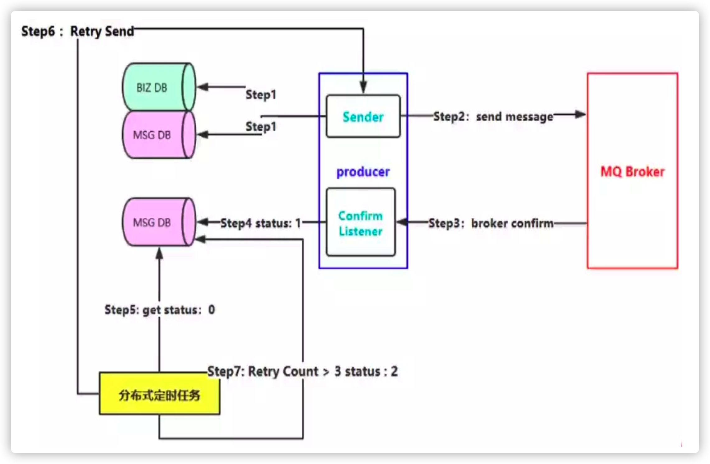
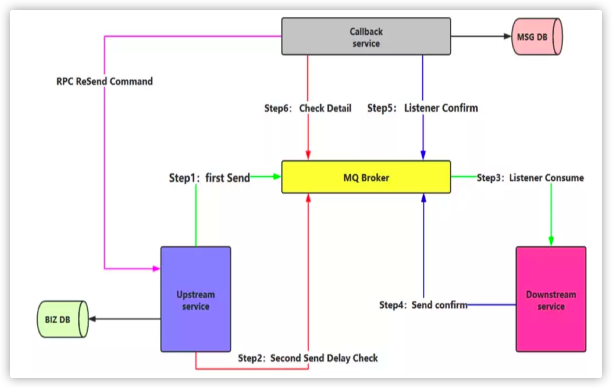
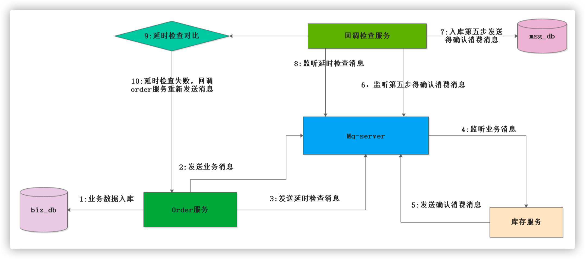
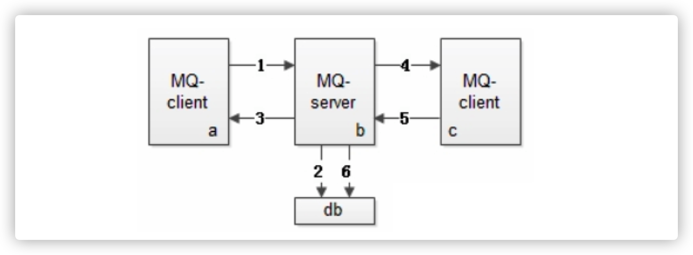
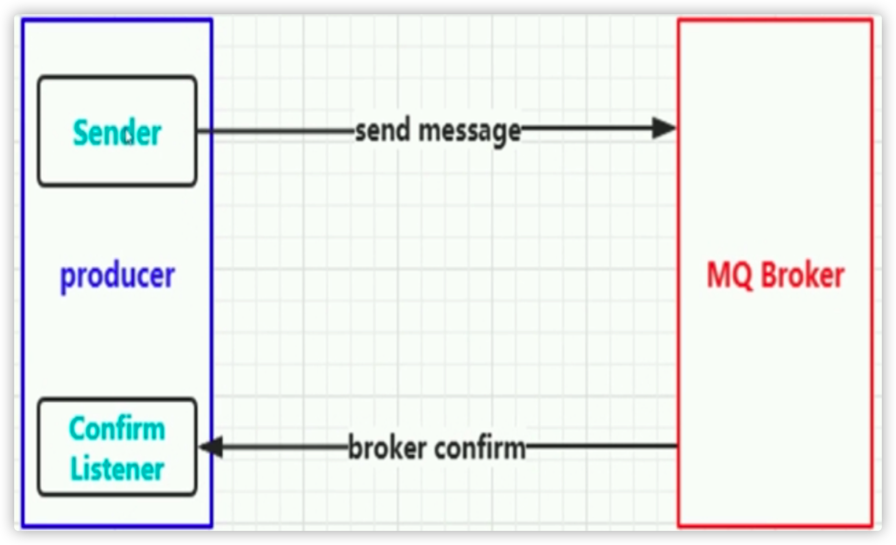
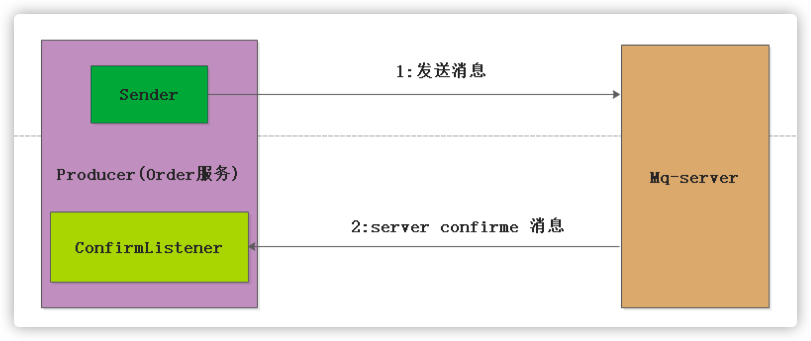
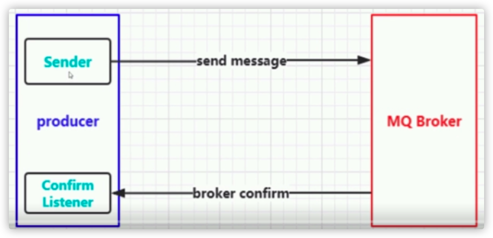
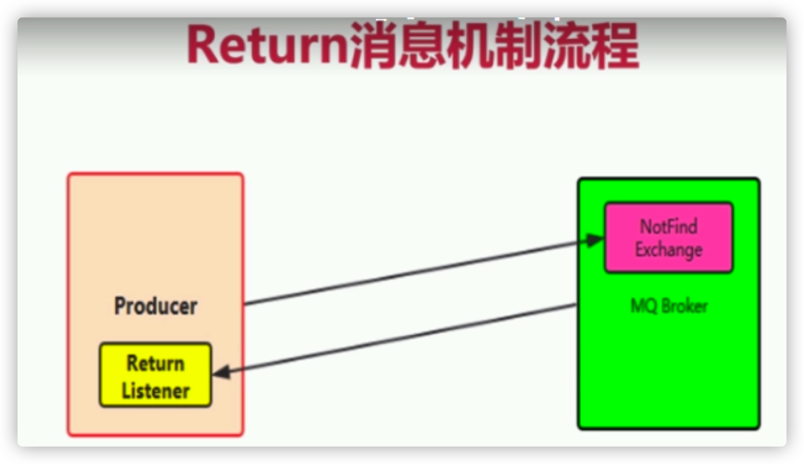
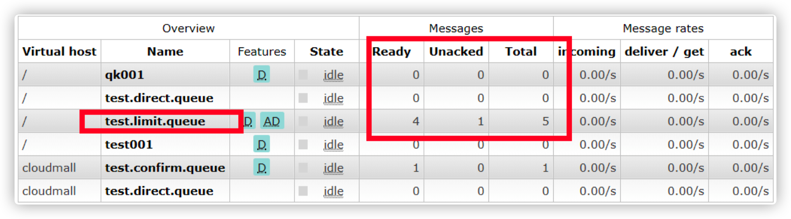

# RabbitMQ集群及高级特性

## 1. 消息的可靠性投递

### 1.1 如何保障消息的百分百投递成功

##### 什么是生产端的可靠性投递

- 保障消息成功发送出去
- 保障mq节点成功接收消息
- 消息发送端需要收到mq服务的确认应答
- 完善的消息补偿机制（百分百成功成功 需要该步骤）

##### 解决保障可靠性投递的方案（消息落库） 




消息入库打标解决思路（Order_Serve 调用物流服务举列子）在消息生产者端（也就是订单服务）

###### 正常链路流程

- 该环节调用了操作了二次数据库，在创建订单的操作的时候，把数据插入到订单相关的表中,并且构造调用物流模块的数据消息，把消息插入到消息表中,初始状态为0
- 把物流消息投递到消息队列中
- 消息队列访问一个确认消息,并且由，订单服务来监控mq server的确认消息
- 根据收到的确认消息来更新数据库中的消息记录的状态

###### 异常链路流程

- 该环节调用了操作了二次数据库，在创建订单的操作的时候，把数据插入到订单相关的表中,并且构造调 用物流模块的数据消息，把消息插入到消息表中,初始状态为0
- 把物流消息投递到消息队列中
- 由于网络闪断，导致消费端监控mq服务访问的确认消息没有收到，那么在msg_db中的那条消息的状态永远就是0状态。这个时候，我们需要对这种情况下做出补偿

###### 补偿机制

启动一个分布式的定时任务,不定时的去扫描msg_db的这个表，状态为0的消息记录，在这里我们可以根据 业务来设置扫描重发规则

- 规则1：插入msg_db表中5Min后状态还是为0的记录，进行消息重试
- 规则2：若重试的次数超过五次状态还是为0的话，我们就把消息状态改为2,此时我们需要人工的去确认状态 为2的消息是什么原因导致没有成功的

###### 消息入库打标的缺点

在第一步的过程中，既插入了业务数据表，也同时插入了消息记录表，进行了二次db操作，在高并发的环 境下，这个环境就会造成性能瓶颈

##### 延时投递，做二次确认检测，回调检测





还是由order服务（upstream service）物流服务（downstream servcie）来举列子


## 2. 幂等性以及消息的幂等性

### 2.1 什么是接口的幂等性?

**接口的幂等性**，简而言之，就是对接口发起的一次调用和多次调用，锁生产的结果都是一致的。

某些接口具有天然的幂等性：比如长查询接口，不管是查询一次还是多次，返回的结果都是一致的

##### 若接口没有保障幂等性，那么就出现问题

###### 案例一

比如订单提交的过程中，用户点了一次提交，但是由于网络等原因，导致后端处理延时，客户就连续点击了多次，在没有幂等性的条件下，那么就会造成订单的重复提交。 

###### 解决方案

在保存订单的时候，根据生成的系统全局唯一 ID（这里订单号+业务类型），并且把该唯一 ID 调用 redis 的 setnx 命令保存起来，在第一次保存的时候，由于 redis 中没有该 key，那么就会 把全局唯一 ID 进行设置上，此时订单就会保存成功。这个时候若出现前端重复点击按钮，由于第一步已经 setnx 上了 就会阻止后面的保存。

### 2.2 MQ如何解决幂等性

##### 发送消息的流程



- 消息生产者向 mq 服务端发送消息
- mq 服务端把消息进行落地
- 消息服务端向消息生产者发送 ack
- 消息消费者消费消息
- 消费者发送 ack
- mq 服务将落地消息删除

##### 消息重复发送的原因

为了保障消息的百分之百的投递，我们使用了消息重发，确认机制，使得消息可能被重复发送，由上图可知 道，由于网络原因，第三步的上半场 ack 丢失还是第五步的下半场ack丢失都会导致消息重复发送

##### 消息重复发送的导致后果

上半场消息生产者是用户支付模块，专门是用来给用户扣费的，而下半场的消息消费者服务是会员卡服务， 是通过接受扣费服务发送的消息来进行发卡的。由于第三步或者是第五步 ack 丢失，那么就会导致上游服务重复发送消息就会导致扣一次款，发多次卡

##### mq服务端是如何保证幂等性

消息队列的服务中，对每一条消息都会生成一个全局唯一的与业务无关的 ID（inner_msg_id），当 mq_server 接受到消息的时候，先根据 inner_msg_id 是否需要重复发送，再决定消息是否落DB，这样保证每条消息都只会落一次 DB

##### 消费端如何来做到幂等性的

还是把对每条消息做生成一个唯一性的 ID 通过 redis 的来 setnx 命令来保证幂等性。


## 3. 消息确认Confirm

### 3.1 理解Confirm消息确认机制

- 消息的确认是指，生产端投递消息后，若mq-server接受到消息，就会给生产者一个应答

- 生产端根据mq broker返回应答来确认该条消息是否正常发送到了broker,这种方式是消息可靠性投递的核心保障

- 消息确认机制的流程图





- 如何来做消息的confirm
    - 在channel上开启确认模式 channel.confirmSelect(); 
    - 在channel上增加confirm监听，来监听成功和异常的confirm结果

- 代码演示

    生产者

```java
public static void main(String[] args) throws IOException, TimeoutException {
    ConnectionFactory connectionFactory = new ConnectionFactory();
    connectionFactory.setVirtualHost("cloudmall");
    connectionFactory.setHost("47.104.128.12");
    connectionFactory.setPort(5672);
    Connection connection = connectionFactory.newConnection();
    Channel channel = connection.createChannel();
    // 开启confirm 
    channel.confirmSelect();
    channel.addConfirmListener(new ConfirmListener() {
        /**
         * 接口成功 
         * @param deliveryTag deliveryTag 消息id 
         * @param multiple 是否批量 
         * @throws IOException
         */
        @Override
        public void handleAck(long deliveryTag, boolean multiple) throws IOException {
            System.out.println("消息id" + deliveryTag + "............ack");
        }

        @Override
        public void handleNack(long deliveryTag, boolean multiple) throws IOException {
            System.out.println("消息id" + deliveryTag + "............no ack");
        }
    });
    channel.basicPublish("test.confirm.exchange", "test.confirm.key", null, "confirm消息".getBytes());
}
```

​		消费者

```java
public static void main(String[] args) throws IOException, TimeoutException, InterruptedException {
    ConnectionFactory connectionFactory = new ConnectionFactory();

    connectionFactory.setVirtualHost("cloudmall");
    connectionFactory.setHost("47.104.128.12");
    connectionFactory.setPort(5672);

    Connection connection = connectionFactory.newConnection();
    Channel channel = connection.createChannel();
    channel.exchangeDeclare("test.confirm.exchange", "topic", true, false, null);
    channel.queueDeclare("test.confirm.queue", true, false, false, null);
    channel.queueBind("test.confirm.queue", "test.confirm.exchange", "test.confirm.#");
    QueueingConsumer queueingConsumer = new QueueingConsumer(channel);

    channel.basicConsume("test.confirm.queue", true, queueingConsumer);
    while (true) {
        QueueingConsumer.Delivery delivery = queueingConsumer.nextDelivery();
        System.out.println(new String(delivery.getBody()));
    }
}
```

### 3.2 MQ的confirm机制

- 消息的确认:指的是生产者将消息投递后，如何mq-server接受到消息，就会给生产者一个应答.

- 生产者接受到应答，来确保该条消息是否成功发送到了mq-server

- confirm机制是消息可靠性投递的核心保障

### 3.3 MQ的confirm机制的核心流程图



### 3.4 confirm机制的现实步骤

- 在channel 上开启确认模式 channel.confirmSelect(); 
- 在channel上添加监听，用来监听mq-server返回的应答

#### 代码演示

生产者

```java
public static void main(String[] args) throws IOException, TimeoutException {
    ConnectionFactory connectionFactory = new ConnectionFactory();
    connectionFactory.setVirtualHost("/");
    connectionFactory.setHost("47.104.128.12");
    connectionFactory.setPort(5672);
    Connection connection = connectionFactory.newConnection();
    Channel channel = connection.createChannel();
    // 开启confirm 确认机制 
    channel.confirmSelect();
    // 设置confirm 监听 
    channel.addConfirmListener(new AngleConfirmListerner());
    // 生产消息 
    channel.basicPublish("test.confirm.exchange", "test.confirm.key", null, "测试confirm消息".getBytes());
}
```

消费者

```java
public static void main(String[] args) throws IOException, TimeoutException, InterruptedException {
    ConnectionFactory connectionFactory = new ConnectionFactory();
    connectionFactory.setVirtualHost("/");
    connectionFactory.setHost("47.104.128.12");
    connectionFactory.setPort(5672);
    Connection connection = connectionFactory.newConnection();
    Channel channel = connection.createChannel();
    // 声明交换机队列以及绑定关系 
    channel.exchangeDeclare("test.confirm.exchange", "topic", true, true, false, null);
    channel.queueDeclare("test.confirm.queue", true, false, true, null);
    channel.queueBind("test.confirm.queue", "test.confirm.exchange", "test.confirm.key");
    QueueingConsumer queueingConsumer = new QueueingConsumer(channel);
    channel.basicConsume("test.confirm.queue", true, queueingConsumer);
    while (true) {
        QueueingConsumer.Delivery delivery = queueingConsumer.nextDelivery();
        System.out.println(new String(delivery.getBody()));
    }
}
```

confirm消息监听器代码

```java
public class AngleConfirmListerner implements ConfirmListener {
    @Override
    public void handleAck(long deliveryTag, boolean multiple) throws IOException {
        System.out.println("消息deliveryTag" + deliveryTag + "被正常签收");
    }

    @Override
    public void handleNack(long deliveryTag, boolean multiple) throws IOException {
        System.out.println("消息deliveryTag" + deliveryTag + "没被签收");
    }
}
```


## 4. return listener 消息处理机制

### 4.1 Return Listener处理不可路由的消息

消息生产者，通过把消息投递到exchange上，然后通过routingkey 把消息路由到某一个队列上，然后我们 消费者通过队列消息侦听，然后进行消息消费处理.

会出现的情况：

- broker中根本没有对应的exchange交换机来接受该消息
- 消息能够投递到broker的交换机上，但是交换机根据routingKey 路由不到某一个队列上.

针对上述二种情况，需要return listener来处理这种不可达的消息。

- 若在消息生产端 的mandatory设置为true 那么就会调用生产端ReturnListener 来处理
- 若消息生产端的mandatory设置为false（默认值也是false），那么mq-broker就会自动删除消息



#### 代码演示

生产端

```java
public static void main(String[] args) throws IOException, TimeoutException {
    ConnectionFactory connectionFactory = new ConnectionFactory();
    connectionFactory.setVirtualHost("/");
    connectionFactory.setHost("47.104.128.12");
    connectionFactory.setPort(5672);
    Connection connection = connectionFactory.newConnection();
    Channel channel = connection.createChannel();
    // 设置return listernr 
    channel.addReturnListener(new AngleReturnListener());
    // 可达消息 
    channel.basicPublish("test.return.exchange", "test.return.key", false, null, "return listener test".getBytes());
    // 不可达消息 调用return listener 
    channel.basicPublish("test.return.exchange", "test.return.key1", true, null, "return listener test2".getBytes());
    // 不可达消息,mq-broker自动删除模式 
    channel.basicPublish("test.return.exchange", "test.return.key2", false, null, "return listener test3".getBytes());
}
```

消费端

```java
public static void main(String[] args) 
  throws IOException, TimeoutException, InterruptedException {
    ConnectionFactory connectionFactory = new ConnectionFactory();
    connectionFactory.setVirtualHost("/");
    connectionFactory.setHost("47.104.128.12");
    connectionFactory.setPort(5672);
    Connection connection = connectionFactory.newConnection();
    Channel channel = connection.createChannel();
    channel.exchangeDeclare("test.return.exchange", "direct", true, true, false, null);
    channel.queueDeclare("test.return.queue", true, false, true, null);
    channel.queueBind("test.return.queue", "test.return.exchange", "test.return.key");
    QueueingConsumer queueingConsumer = new QueueingConsumer(channel);
    channel.basicConsume("test.return.queue", true, queueingConsumer);
    while (true) {
        QueueingConsumer.Delivery delivery = queueingConsumer.nextDelivery();
        System.out.println(new String(delivery.getBody()));
    }
}
```

return listener

```java
public class AngleReturnListener implements ReturnListener {
    @Override
    public void handleReturn(int replyCode,
                             String replyText,
                             String exchange,
                             String routingKey,
                             AMQP.BasicProperties properties,
                             byte[] body) throws IOException {
        System.out.println("记录不可达消息........................");
        System.out.println("replaycode=" + replyCode);
        System.out.println("replyText=" + replyText);
        System.out.println("exchange=" + exchange);
        System.out.println("routingKey=" + routingKey);
        System.out.println("properties=" + properties);
        System.out.println("body=" + newString(body));
    }
}
```


## 5. 消费端的自定义消费监听

### 5.1 本章1-4消费消息的方式都是通过如下方式消费消息

```java
while (true) {
	QueueingConsumer.Delivery delivery = queueingConsumer.nextDelivery(); 
  System.out.println(new String(delivery.getBody())); 
}
```

我们需要一个更加优雅的方式来消费消息,通过继承DefaultConsumer类来实现自定义的消息端

#### 代码演示

自定义消费端

```java
public class AngleCustomConsumer extends DefaultConsumer {
    /**
     * Constructs a new instance and records its association to the passed-in channel.
     * @param channel the channel to which this consumer is attached
     */
    public AngleCustomConsumer(Channel channel) {
        super(channel);
    }

    /**
     * 处理消息
     * @param consumerTag
     * @param envelope
     * @param properties
     * @param body
     * @throws IOException
     */
    public void handleDelivery(String consumerTag,
                               Envelope envelope,
                               AMQP.BasicProperties properties,
                               byte[] body) throws IOException {
        System.out.println("自定义的消息消费端");
        System.out.println("consumerTag=" + consumerTag);
        System.out.println("envelope=" + envelope);
        System.out.println("properties=" + properties);
        System.out.println("body=" + new String(body));
    }
}
```

消费者:

```java
public class Consumer {
    public static void main(String[] args) throws IOException, TimeoutException {
        ConnectionFactory connectionFactory = new ConnectionFactory();
        connectionFactory.setVirtualHost("/");
        connectionFactory.setHost("47.104.128.12");
        connectionFactory.setPort(5672);
        Connection connection = connectionFactory.newConnection();
        Channel channel = connection.createChannel();
        channel.exchangeDeclare("test.customconsumer.exchange", "direct", true, true, false, null);
        channel.queueDeclare("test.customconsumer.queue", true, false, true, null);
        channel.queueBind("test.customconsumer.queue", "test.customconsumer.exchange", "test.customconsumer.key");
        //设置自定义消费端 
        channel.basicConsume("test.customconsumer.queue", true, new AngleCustomConsumer(channel));
    }
}
```

消息生产者:

```java
public class producter {
    public static void main(String[] args) throws IOException, TimeoutException {
        ConnectionFactory connectionFactory = new ConnectionFactory();
        connectionFactory.setVirtualHost("/");
        connectionFactory.setHost("47.104.128.12");
        connectionFactory.setPort(5672);
        Connection connection = connectionFactory.newConnection();
        Channel channel = connection.createChannel();
        channel.basicPublish("test.customconsumer.exchange",
                "test.customconsumer.key", false, null, "自定义消费端消息".getBytes());
    }
}
```


## 6. 消费端如何做限流量

### 6.1 消费端限流

#### 场景

订单的高峰期，在mq的broker上堆积了成千上万条消息没有处理，这个时候随便打开了消费者，就会出现如此多的消息瞬间推送给消费者，消费者不能处理这么多消息，就会导致消费者出现巨大压力，甚至服务器崩溃

##### 解决方案

rabbitmq 提供一个钟qos（服务质量保证）,也就是在关闭了消费端的自动ack的前提下，可以设置阈值（出队）的消息数没有被确认（手动确认），那么就不会推送消息过来.

#### 限流的级别（consumer级别或者是channel级别）

实现的方式 

```java
void BasicQos(uint prefetchSize, ushort prefetchCount, bool global) 
```

- uint prefetchSize：指定的是设定消息的大小(rabbitmq还没有该功能，所以一般是填写0表示不限制）
- ushort perfetchCount：表示设置消息的阈值，每次过来几条消息（一般是填写1，逐条处理消息）
- bool global：表示是channel级别的还是 consumer的限制（channel的限制rabbitmq 还没有该功能）

#### 代码演示

生产者

```java
public class producter {
    public static void main(String[] args) throws IOException, TimeoutException {
        ConnectionFactory connectionFactory = new ConnectionFactory();
        connectionFactory.setVirtualHost("/");
        connectionFactory.setHost("47.104.128.12");
        connectionFactory.setPort(5672);
        Connection connection = connectionFactory.newConnection();
        Channel channel = connection.createChannel();
        // 发送五条消息 
        for (int i = 0; i < 5; i++) {
            channel.basicPublish("test.limit.exchange", "test.limit.key", false, null, "自定义消费端消息".getBytes());
        }
    }
}
```

消费者:

```java
public static void main(String[] args) throws IOException, TimeoutException {
    ConnectionFactory connectionFactory = new ConnectionFactory();
    connectionFactory.setVirtualHost("/");
    connectionFactory.setHost("47.104.128.12");
    connectionFactory.setPort(5672);
    Connection connection = connectionFactory.newConnection();
    Channel channel = connection.createChannel();
    channel.exchangeDeclare("test.limit.exchange", "direct", true, true, false, null);
    channel.queueDeclare("test.limit.queue", true, false, true, null);
    channel.queueBind("test.limit.queue", "test.limit.exchange", "test.limit.key");
    // gloabl设置为ture 那么就是channel级别的限流，若为false 就是consumer级别的限制流量
    channel.basicQos(0, 1, false);
    // 关闭自动签收
    channel.basicConsume("test.limit.queue", false, new AngleCustomConsumer(channel));
}

// 自定义消费者监听
public class AngleCustomConsumer extends DefaultConsumer {
    private Channel channel;

    /**
     * Constructs a new instance and records its association to the passed-in channel.
     *
     * @param channel the channel to which this consumer is attached
     */
    public AngleCustomConsumer(Channel channel) {
        super(channel);
        this.channel = channel;
    }

    /**
     * 处理消息
     *
     * @param consumerTag
     * @param envelope
     * @param properties
     * @param body
     * @throws IOException
     */
    public void handleDelivery(String consumerTag,
                               Envelope envelope,
                               AMQP.BasicProperties properties,
                               byte[] body) throws IOException {
        System.out.println("自定义的消息消费端");
        System.out.println("consumerTag=" + consumerTag);
        System.out.println("envelope=" + envelope);
        System.out.println("properties=" + properties);
        System.out.println("body=" + new String(body));
        // 消费端的手动签收,假如关闭手动签收，也关闭自动签收，那么消费端只会接收到一条消息
        channel.basicAck(envelope.getDeliveryTag(), false);
    }
}
```

运行结果




## 7. 消费端的ack

### 7.1 消费端的ack模式

消费端的ack类型：**自动ack和手动ack**

做消息限流的时候，我们需要关闭自动ack 然后进行手动ack的确认,若我们业务出现了问题，我们就可以进行nack重回队列，当消费端进行了nack的操作的时候，我们可以通过设置来进行对消息的重回队列的操作（但是一般我们不会设置重回队列的操作）

#### 代码演示

手动ack以及重回队列操作

```java
public class producter {
    public static void main(String[] args) throws IOException, TimeoutException {
        ConnectionFactory connectionFactory = new ConnectionFactory();
        connectionFactory.setVirtualHost("/");
        connectionFactory.setHost("47.104.128.12");
        connectionFactory.setPort(5672);
        Connection connection = connectionFactory.newConnection();
        Channel channel = connection.createChannel();

        for (int i = 0; i < 5; i++) {
            Map<String, Object> header = new HashMap<>();
            header.put("num", i + 1);
            // 设置消息属性 
            AMQP.BasicProperties basicProperties = new AMQP.BasicProperties()
                    .builder()
                    .contentEncoding("utf-8")
                    .contentType("application/json")
                    .deliveryMode(2)
                    .headers(header)
                    .build();
            channel.basicPublish("test.ack.exchange", "test.ack.key", false, basicProperties, ("自定ack消息" + (i + 1)).getBytes());
        }
    }
}
```

消费端代码

```java
public class Consumer {

    public static void main(String[] args) throws IOException, TimeoutException {
        ConnectionFactory connectionFactory = new ConnectionFactory();
        connectionFactory.setVirtualHost("/");
        connectionFactory.setHost("47.104.128.12");
        connectionFactory.setPort(5672);

        Connection connection = connectionFactory.newConnection();

        Channel channel = connection.createChannel();

        channel.exchangeDeclare("test.ack.exchange", "direct", true, true, false, null);
        channel.queueDeclare("test.ack.queue", true, false, true, null);
        channel.queueBind("test.ack.queue", "test.ack.exchange", "test.ack.key");
        //gloabl设置为ture 那么就是channel级别的限流，若为false 就是consumer级别的限制流量 
        // channel.basicQos(0,1,false);
        // 关闭自动签收
        channel.basicConsume("test.ack.queue",false,new AngleCustomConsumer(channel));
    }
}
```

自定义消费者

```java
public class AngleCustomConsumer extends DefaultConsumer {

    private Channel channel;

    /**
     * Constructs a new instance and records its association to the passed-in channel. 
     * @param channel the channel to which this consumer is attached
     */
    public AngleCustomConsumer(Channel channel) {
        super(channel);
        this.channel = channel;
    }

    /**
     * 处理消息 
     * @param consumerTag 
     * @param envelope 
     * @param properties 
     * @param body 
     * @throws IOException
     */
    public void handleDelivery(String consumerTag, 
                               Envelope envelope, 
                               AMQP.BasicProperties properties, 
                               byte[] body) throws IOException {

        try {
            Thread.currentThread().sleep(1000);
        } catch (InterruptedException e) {
            e.printStackTrace();
        }

        System.out.println(properties.getHeaders());
        String num = properties.getHeaders().get("num").toString();
        if (num.equals("1")) {
            System.out.println("业务系统处理消息异常消息重新回队列" + new String(body));
            channel.basicNack(envelope.getDeliveryTag(), false, true);

        } else {
            System.out.println("自定义的消息消费端");
            System.out.println("consumerTag=" + consumerTag);
            System.out.println("envelope=" + envelope);
            System.out.println("properties=" + properties);
            System.out.println("body=" + new String(body));
            //消费端的手动签收,加入我关闭手动签收，也关闭自动签收，那么消费端只会接收到一条消息
            channel.basicAck(envelope.getDeliveryTag(), false);
        }
    }
}
```


## 8. 死信队列(死信交换机)

### 8.1 死信队列DLX（Dead-leater-exchange）

#### 死信

就是在队列中的消息如果没有消费者消费，那么该消息就成为一个死信，那这个消息被重新发送到另外一个exchange上的话， 那么后面这个exhcange就是死信队列

#### 消息变成死信的几种情况

- 消息被拒绝（basic.reject/basic.nack）并且requeue（重回队列）的属性设置为 false 表示不需要重回队列，那么该消息就是一个死信消息；
- 消息TTL过期。消息本身设置了过期时间，或者队列设置了消息过期时间 x-message-ttl 队列达到最大长度:比如队列最大长度是3000，那么3001消息就会被送到死信队列上；
- 死信队列也是一个正常的exchange，也会通过routingkey 绑定到具体的队列上。

#### 代码演示

```java
public class DLX_CustomConsumer extends DefaultConsumer {

    private Channel channel;

    /**
     * Constructs a new instance and records its association to the passed-in channel. 
     * @param channel the channel to which this consumer is attached
     */
    public DLX_CustomConsumer(Channel channel) {
        super(channel);
        this.channel = channel;
    }

    public void handleDelivery(String consumerTag, 
                               Envelope envelope, 
                               AMQP.BasicProperties properties, 
                               byte[] body) throws IOException {
        System.out.println("为了测试死信队列,我们进行nack");
        //把消息变为死信 通过nack 且requeue不进行重新发送 
        channel.basicNack(envelope.getDeliveryTag(), false, false);
    }
}
```

消费者

```java
public class DLX_consumer {

    public static void main(String[] args) throws IOException, TimeoutException {
        ConnectionFactory connectionFactory = new ConnectionFactory();
        connectionFactory.setVirtualHost("/");
        connectionFactory.setHost("47.104.128.12");
        connectionFactory.setPort(5672);

        Connection connection = connectionFactory.newConnection();
        Channel channel = connection.createChannel();
        String normalExchangeName = "test.normaldlx.exchange";
        String normalQueueName = "test.normaldlx.queue";
        String dlxExchangeName = "test.dlx.exchange";
        String dlxQueueName = "test.dlx.queue";
        // 声明一个正常的业务队列
        channel.exchangeDeclare(normalExchangeName, "topic", true, true, false, null);
        Map<String, Object> argurments = new HashMap<>();
        // 设置正常队列中的死信发往哪个队列
        argurments.put("x-dead-letter-exchange", "test.dlx.exchange");
        channel.queueDeclare(normalQueueName,true,true,true,argurments);
        channel.queueBind(normalQueueName,normalExchangeName,"test.normaldlx.key");
        // 声明死信队列
        channel.exchangeDeclare(dlxExchangeName,"topic",true,true,false,null);
        channel.queueDeclare(dlxQueueName,true,true,true,null);
        channel.queueBind(dlxQueueName,dlxExchangeName,"#");
        channel.basicConsume(normalQueueName, false, new DLX_CustomConsumer(channel));
    }
}
```

生产者

```java
public class DLX_Producter {

    public static void main(String[] args) throws IOException, TimeoutException {
        ConnectionFactory connectionFactory = new ConnectionFactory();
        connectionFactory.setVirtualHost("/");
        connectionFactory.setHost("47.104.128.12");
        connectionFactory.setPort(5672);
        Connection connection = connectionFactory.newConnection();
        Channel channel = connection.createChannel();
        // 设置消息5S钟超时 
        AMQP.BasicProperties basicProperties = new AMQP.BasicProperties().builder().expiration("10000").build();
        channel.basicPublish("test.normaldlx.exchange", "test.normaldlx.key", basicProperties, "测试消息转为死信队列".getBytes());
    }
}
```

