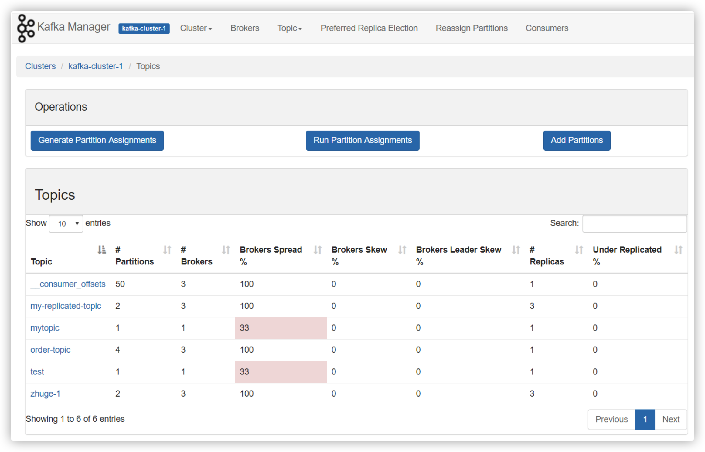
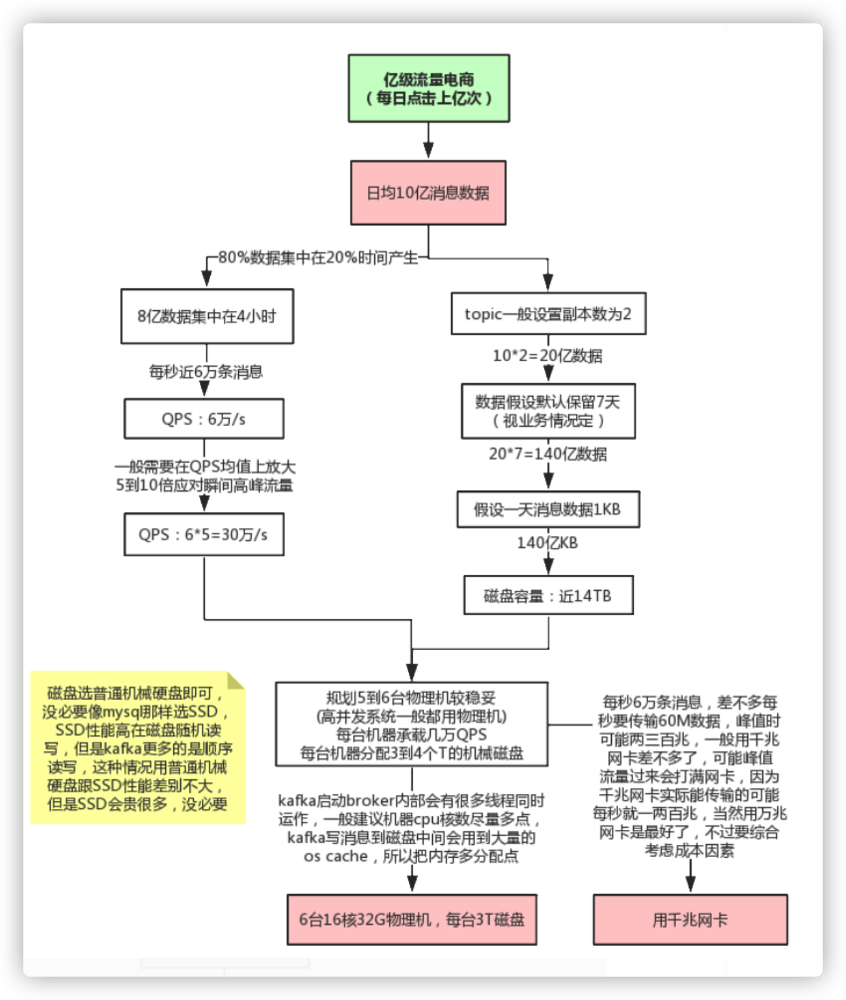
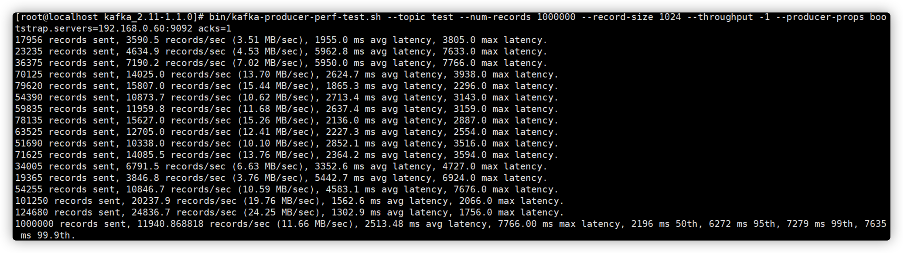

# Kafka性能优化实战

## 1. Kafka可视化管理工具kafka-manager



安装及基本使用可参考：https://www.cnblogs.com/dadonggg/p/8205302.html


## 2. 线上环境规划



### 2.1 JVM参数设置

kafka是scala语言开发，运行在JVM上，需要对JVM参数合理设置，参看 [JVM调优专题](../../01-JVM/README.md)

修改bin/kafka-start-server.sh中的jvm设置

```bash
export KAFKA_HEAP_OPTS="-Xmx16G -Xms16G -Xmn12G -XX:MetaspaceSize=256M -XX:+UseG1GC -XX:MaxGCPauseMillis=50"
```

这种大内存的情况一般都要用G1垃圾收集器，因为年轻代内存比较大，用G1可以设置GC最大停顿时间，不至于一次minor gc就花费太长时间

### 2.2 线上问题及优化

#### 2.2.1 消息丢失情况

##### 消息发送端

1. acks=0： 表示producer不需要等待任何broker确认收到消息的回复，就可以继续发送下一条消息。性能最高，但是最容易丢消息。大数据统计报表场景，对性能要求很高，对数据丢失不敏感的情况可以用这种。

2. acks=1： 至少要等待leader已经成功将数据写入本地log，但是不需要等待所有follower是否成功写入。就可以继续发送下一条消息。这种情况下，如果follower没有成功备份数据，而此时leader又挂掉，则消息会丢失。

3. acks=-1或all： 这意味着leader需要等待所有备份(min.insync.replicas配置的备份个数)都成功写入日志，这种策略会保证只要有一个备份存活就不会丢失数据。这是最强的数据保证。一般除非是金融级别，或跟钱打交道的场景才会使用这种配置。当然如果min.insync.replicas配置的是1则也可能丢消息，跟acks=1情况类似。

##### 消息消费端

如果消费这边配置的是自动提交，万一消费到数据还没处理完，就自动提交offset了，但是此时你consumer直接宕机了，未处理完的数据丢失了，下次也消费不到了。

#### 2.2.2 消息重复消费

##### 消息发送端

发送消息如果配置了重试机制，比如网络抖动时间过长导致发送端发送超时，实际broker可能已经接收到消息，但发送方会重新发送消息

##### 消息消费端

如果消费这边配置的是自动提交，刚拉取了一批数据处理了一部分，但还没来得及提交，服务挂了，下次重启又会拉取相同的一批数据重复处理

一般消费端都是要做**消费幂等**处理的。

#### 2.2.3 消息乱序

如果发送端配置了重试机制，kafka不会等之前那条消息完全发送成功才去发送下一条消息，这样可能会出现，发送了1，2，3条消息，第一条超时了，后面两条发送成功，再重试发送第1条消息，这时消息在broker端的顺序就是2，3，1了

所以，是否一定要配置重试要根据业务情况而定。也可以用同步发送的模式去发消息，当然acks不能设置为0，这样也能保证消息从发送端到消费端全链路有序。

#### 2.2.4 消息积压

1. 线上有时因为发送方发送消息速度过快，或者消费方处理消息过慢，可能会导致broker积压大量未消费消息。

此种情况如果积压了上百万未消费消息需要紧急处理，可以修改消费端程序，让其将收到的消息快速转发到其他topic(可以设置很多分区)，然后再启动多个消费者同时消费新主题的不同分区。

2. 由于消息数据格式变动或消费者程序有bug，导致消费者一直消费不成功，也可能导致broker积压大量未消费消息。

此种情况可以将这些消费不成功的消息转发到其它队列里去(类似**死信队列**)，后面再慢慢分析死信队列里的消息处理问题。

#### 2.2.5 延时队列

延时队列存储的对象是延时消息。所谓的“延时消息”是指消息被发送以后，并不想让消费者立刻获取，而是等待特定的时间后，消费者才能获取这个消息进行消费，延时队列的使用场景有很多， 比如 ：

1. 在订单系统中， 一个用户下单之后通常有 30 分钟的时间进行支付，如果 30 分钟之内没有支付成功，那么这个订单将进行异常处理，这时就可以使用延时队列来处理这些订单了。

2. 订单完成1小时后通知用户进行评价。

**实现思路：**发送延时消息时先把消息按照不同的延迟时间段发送到指定的队列中（topic_1s，topic_5s，topic_10s，...topic_2h，这个一般不能支持任意时间段的延时），然后通过定时器进行轮训消费这些topic，查看消息是否到期，如果到期就把这个消息发送到具体业务处理的topic中，队列中消息越靠前的到期时间越早，具体来说就是定时器在一次消费过程中，对消息的发送时间做判断，看下是否延迟到对应时间了，如果到了就转发，如果还没到这一次定时任务就可以提前结束了。

#### 2.2.6 消息回溯

如果某段时间对已消费消息计算的结果觉得有问题，可能是由于程序bug导致的计算错误，当程序bug修复后，这时可能需要对之前已消费的消息重新消费，可以指定从多久之前的消息回溯消费，这种可以用consumer的offsetsForTimes、seek等方法指定从某个offset偏移的消息开始消费，参见上节课的内容。

#### 2.2.7 分区数越多吞吐量越高吗

可以用kafka压测工具自己测试分区数不同，各种情况下的吞吐量

```bash
# 往test里发送一百万消息，每条设置1KB
# throughput 用来进行限流控制，当设定的值小于 0 时不限流，当设定的值大于 0 时，当发送的吞吐量大于该值时就会被阻塞一段时间
bin/kafka-producer-perf-test.sh --topic test --num-records 1000000 --record-size 1024 --throughput -1 
--producer-props bootstrap.servers=192.168.0.60:9092 acks=1
```



网络上很多资料都说分区数越多吞吐量越高 ， 但从压测结果来看，分区数到达某个值吞吐量反而开始下降，实际上很多事情都会有一个临界值，当超过这个临界值之后，很多原本符合既定逻辑的走向又会变得不同。一般情况分区数跟集群机器数量相当就差不多了。当然吞吐量的数值和走势还会和磁盘、文件系统、 I/O调度策略等因素相关。

> **注意**
>
> 如果分区数设置过大，比如设置10000，可能会设置不成功，后台会报错"java.io.IOException : Too many open files"。

异常中最关键的信息是“ Too many open flies”，这是一种常见的 Linux 系统错误，通常意味着文件描述符不足，它一般发生在创建线程、创建 Socket、打开文件这些场景下 。 在 Linux系统的默认设置下，这个文件描述符的个数不是很多 ，通过 ulimit -n 命令可以查看：一般默认是1024，可以将该值增大，比如：ulimit -n 65535