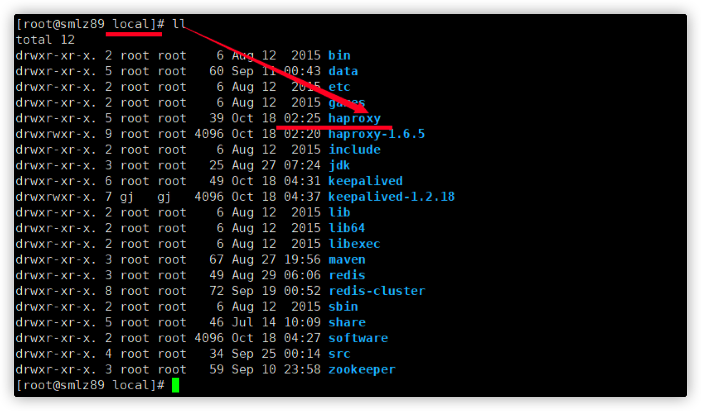

# RabbitMQ如何作可靠性消息投递

## 1. 集群节点安装

### 1.1 集群节点安装

192.168.159.86，192.168.159.87，192.168.159.88，这里以86服务器单台演示。

- 安装rabbitmq所需要的依赖包

```bash
yum install build-essential openssl openssl-devel unixODBC unixODBC-devel make gcc gccc++ kernel-devel m4 ncurses-devel tk tc xz
```

- 下载安装包（目录是/usr/local/software）

```bash
wget www.rabbitmq.com/releases/erlang/erlang-18.3-1.el7.centos.x86_64.rpm 
wget http://repo.iotti.biz/CentOS/7/x86_64/socat-1.7.3.2-5.el7.lux.x86_64.rpm 
wget www.rabbitmq.com/releases/rabbitmq-server/v3.6.5/rabbitmq-server-3.6.5-1.noarch.rpm
```


- 安装服务命令

```bash
# 第一步: 安装erlang语言环境 
rpm -ivh erlang-18.3-1.el7.centos.x86_64.rpm 
# 第二步: 安装socat加解密软件 
rpm -ivh socat-1.7.3.2-5.el7.lux.x86_64.rpm 
# 第三步: 最后安装rabbitmq 
rpm -ivh rabbitmq-server-3.6.5-1.noarch.rpm
```

- 修改集群用户与连接心跳检测

```bash
# 修改
vim /usr/lib/rabbitmq/lib/rabbitmq_server3.6.5/ebin/rabbit.app
# 修改 loopback_users 中的 <<"guest">>，只保留guest（不修改只能通过localhost访问） 
```


- 修改本机系统文件 

    修改` vim /etc/rabbitmq/rabbitmq-env.conf`

    添加：NODENAME=rabbit


​		修改 `vim /etc/hostname`


​		修改本地 `vim /etc/hosts`


- 验证单台服务器是可用的

```bash
 cd /usr/local
 rabbitmqctl start_app
 # 启动插件
 rabbitmq-plugins enable rabbitmq_management
```


```bash
 # 检查端口
 lsof -i:5672 
```


```bash
ps -ef|grep rabbitmq
```


访问地址：http://192.168.159.86:15672


- 87，88节点按照以上的步骤进行想同的操作

- 选择86服务器一个主节点（master）把86的Cookie文件同步到87、88节点上去

```bash
cd /var/lib/rabbitmq
# 文件的权限修改为777，原来是400
chmod 777 /var/lib/rabbitmq/.erlang.cookie
# 把.erlang.cookie文件copy到各个节点下
# 最后把所有cookie文件权限还原为400
# copy 86的.erlang.cookie文件到87、88上
scp /var/lib/rabbitmq/.erlang.cookie 192.168.159.87:/var/lib/rabbitmq
scp /var/lib/rabbitmq/.erlang.cookie 192.168.159.88:/var/lib/rabbitmq
```

- 启用集群命令

```bash
cd /usr/local
# 在86、87、88机器上先执行停止命令
rabbitmqctl stop

# 在三台服务器上86、87、88上执行 下面的命令（启动集群命令）
rabbitmq-server -detached

# 切换到87的机器上执行下面三条命令（同样目录都是再/usr/local下执行的）
rabbitmqctl stop_app 
rabbitmqctl join_cluster 
rabbit@tyrival86 rabbitmqctl start_app

# 切换到88的机器上执行下面三条命令（同样目录都是再/usr/local下执行的）
rabbitmqctl stop_app 
rabbitmqctl join_cluster 
rabbit@tyrival86 rabbitmqctl start_app

# 修改集群名称: 在86上执行给命令(/usr/local) 
rabbitmqctl set_cluster_name rabbitmq_cluster_tyrival

# 查看集群状态
rabbitmqctl cluster_status
```


- 三台服务随意访问地址

    访问任意一个管控台节点：http://192.168.159.86:15672


- 配置镜像队列

```bash
# 在任意节点上执行
rabbitmqctl set_policy ha-all "^" '{"ha-mode":"all"}'
```

将所有队列设置为镜像队列，即队列会被复制到各个节点，各个节点状态一致， RabbitMQ高可用集群就已经搭建好了,我们可以重启服务，查看其队列是否在从 节点同步

- 剔除节点命令

```bash
rabbitmqctl forget_cluster_node rabbit@节点名称(比如tyrival87 tyrival88)
```


## 2. 安装HaProxy（192.168.159.89）

### 2.1 Haproxy简介

HAProxy是一款提供高可用性、负载均衡以及基于TCP和HTTP应用的代理软件，HAProxy是完全免费的、借助HAProxy可以快速并且可靠的提供基于TCP和 HTTP应用的代理解决方案。

HAProxy适用于那些负载较大的web站点，这些站点通常又需要会话保持或七层处理。 HAProxy可以支持数以万计的并发连接,并且HAProxy的运行模式使得它可以很

简单安全的整合进架构中，同时可以保护web服务器不被暴露到网络上

### 2.2 Haproxy安装

- 下载依赖包

```bash
yum install gcc vim wget
```

- 下载haproxy 

```bash
# 可能要翻墙
wget http://www.haproxy.org/download/1.6/src/haproxy-1.6.5.tar.gz
```


- 进行解压

```bash
cd /usr/local/software
# 解压后会在 /usr/local 中生成一个文件 haproxy-1.6.5文件夹
tar -zxvf haproxy-1.6.5.tar.gz -C /usr/local 
```


- 进入目录、进行编译、安装

```bash
# 进入解压目录
cd /usr/local/haproxy-1.6.5
# 编译
make TARGET=linux31 PREFIX=/usr/local/haproxy
# 安装
make install PREFIX=/usr/local/haproxy
# 创建 一个haproxy的目录 用于存放haproxy的配置文件
mkdir /etc/haproxy
# 赋权
groupadd -r -g 149 haproxy 
useradd -g haproxy -r -s /sbin/nologin -u 149 haproxy 
# 创建配置文件 
touch /etc/haproxy/haproxy.cfg
```



- haproxy.cfg配置文件详解

```bash
# lgging options 
global
	log 127.0.0.1 local0 info 
	maxconn 5120 
	chroot /usr/local/haproxy 
	uid 99 
	gid 99 
	daemon 
	quiet 
	nbproc 20 
	pidfile /var/run/haproxy.pid

defaults
	log global 
	# 使用4层代理模式，”mode http”为7层代理模式 
	mode tcp 
	# if you set mode to tcp,then you nust change tcplog into httplog 
	option tcplog 
	option dontlognull 
	retries 3 
	option redispatch 
	maxconn 2000 
	contimeout 5s 
	# 客户端空闲超时时间为60秒，则HA发起重连机制 
	clitimeout 60s 
	# 服务器端链接超时时间为15秒，则HA发起重连机制 
	srvtimeout 15s 
	# front-end IP for consumers and producters

listen rabbitmq_cluster 
	# 监听的端口 
	bind 0.0.0.0:5672 
	# 配置TCP模式 
	mode tcp 
	# 简单的轮询 
	balance roundrobin 
	# ============== 超级 超级 重要防止应用程序连接关闭 ==============
	timeout client 3h 
	timeout server 3h 
	# rabbitmq集群节点配置 
	# inter 每隔五秒对mq集群做健康检查，2次正确证明服务器可用，2次失败证明服务器不可用，并且配置主备机 
	server tyrival86 192.168.159.86:5672 check inter 5000 rise 2 fall 2 
	server tyrival87 192.168.159.87:5672 check inter 5000 rise 2 fall 2 
	server tyrival88 192.168.159.88:5672 check inter 5000 rise 2 fall 2 
	# 配置haproxy web监控，查看统计信息 
listen stats 
	bind 192.168.159.89:8100 
	mode http 
	option httplog 
	stats enable 
	# 设置haproxy监控地址为http://192.168.159.89:8100/rabbitmq-stats 
	stats uri /rabbitmq-stats 
	stats refresh 5s
```

- 启动haproxy

```bash
/usr/local/haproxy/sbin/haproxy -f /etc/haproxy/haproxy.cfg
```

- 查看haproxy是否启动

```bash
ps-ef|grep rabbitmq
```


- haparoxy的监控台访问 http://192.168.159.89:8100/rabbitmq-stats 


- 关闭haproxy命令

```bash
killall haproxy
```


## 3. 集群测试

应用程序客户端连接地址:如下（生产端）


### 3.1 发送消息到集群


消费端连接配置


启动集群


## 4. 模拟集群服务器故障

##### 停止主节点86节点


##### 生产端：成功发送


##### 消费端：成功接收

