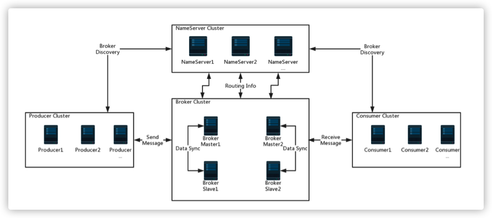

# RocketMQ整体部署与快速实战

### 架构图



Apache RocketMQ是一个分布式消息传递和流媒体平台，具有低延迟，高性能和可靠性，万亿级容量和灵活的可伸缩性。 它由四个部分组成：

- nameserver，broker，生产者和使用者。它们中的每一个都可以水平扩展，而没有单个故障点。 如上面的屏幕截图所示。 
- nameserver：提供轻量级的服务发现和路由。 每个名称服务器记录完整的路由信息，提供相应的读写服务，并支持快速的存储扩展。 
- Broker：通过提供轻量级的TOPIC和QUEUE机制来存储消息。


## 1. RocketMQ部署

- RocketMQ加入环境变量

```bash
vim /etc/profile

### profile
# java环境变量
export JAVA_HOME=/usr/local/jdk
export CLASSPATH=.:$JAVA_HOME/lib/dt.jar:$JAVA_HOME/lib/tools.jar
export PATH=$JAVA_HOME/bin:$PATH 4
# rocketmq目录
export ROCKETMQ_HOME=/usr/local/rocketmq/rocketmq‐all‐4.1.0‐incubating
export PATH=$ROCKETMQ_HOME/bin:$PATH
```

- 刷新环境变量

```bash
source /etc/profile
```

- 修改配置文件

```bash
vim /usr/local/rocketmq/conf/broker.conf

### broker.conf
# 集群名称，可自定义
brokerClusterName=DefaultCluster
brokerName=broker‐a
brokerId=0
# 定义服务地址，主存地址
namesrvAddr=192.168.241.198:9876
deleteWhen=04
fileReservedTime=48
brokerRole=ASYNC_MASTER
flushDiskType=ASYNC_FLUSH
autoCreateTopicEnable=true
# 消息存储根路径
storePathRootDir=/data/rocketmq/store
# 日志路径
storePathCommitLog=/data/rocketmq/store/commitlog
```

> **注**
>
> 机器内存不够（一般针对虚拟机），需要修改JAVA_OPT关于内存的设置
>
> - runserver.sh
>
> ```bash
> vim /usr/local/rocketmq/bin/runserver.sh
> 
> #!/bin/sh
> # Licensed to the Apache Software Foundation (ASF) under one or more
> # contributor license agreements. See the NOTICE file distributed with
> # this work for additional information regarding copyright ownership.
> # The ASF licenses this file to You under the Apache License, Version 2.0
> # (the "License"); you may not use this file except in compliance with
> # the License. You may obtain a copy of the License at
> #
> # http://www.apache.org/licenses/LICENSE‐2.0
> #
> # Unless required by applicable law or agreed to in writing, software
> # distributed under the License is distributed on an "AS IS" BASIS,
> # WITHOUT WARRANTIES OR CONDITIONS OF ANY KIND, either express or implied.
> # See the License for the specific language governing permissions and
> # limitations under the License.
> #=======================================================================
> # Java Environment Setting
> #=======================================================================
> error_exit ()
> {
>   echo "ERROR: $1 !!"
>   exit 1
> }
> 
> [ ! ‐e "$JAVA_HOME/bin/java" ] && JAVA_HOME=$HOME/jdk/java
> [ ! ‐e "$JAVA_HOME/bin/java" ] && JAVA_HOME=/usr/java 
> [ ! ‐e "$JAVA_HOME/bin/java" ] && error_exit "Please set the JAVA_HOME v ariable in your environment, We need java(x64)!"
> export JAVA_HOME
> export JAVA="$JAVA_HOME/bin/java"
> export BASE_DIR=$(dirname $0)/..
> export CLASSPATH=.:${BASE_DIR}/conf:${CLASSPATH}
> 
> #=======================================================================
> # JVM Configuration
> #=======================================================================
> #修改此处的内存大小，默认为4g，一般我们的虚拟机内存不会太大
> #所以此处修改为256m，可以根据自己机器的配置合理设置
> JAVA_OPT="${JAVA_OPT} ‐server ‐Xms256m ‐Xmx256m ‐Xmn128m ‐XX:MetaspaceSi ze=64m ‐XX:MaxMetaspaceSize=128m"
> JAVA_OPT="${JAVA_OPT} ‐XX:+UseConcMarkSweepGC ‐XX:+UseCMSCompactAtFullCo llection ‐XX:CMSInitiatingOccupancyFraction=70 ‐XX:+CMSParallelRemarkEnable d ‐XX:SoftRefLRUPolicyMSPerMB=0 ‐XX:+CMSClassUnloadingEnabled ‐XX:SurvivorR atio=8 ‐XX:‐UseParNewGC"
> JAVA_OPT="${JAVA_OPT} ‐verbose:gc ‐Xloggc:/dev/shm/rmq_srv_gc.log ‐XX:+PrintGCDetails"
> JAVA_OPT="${JAVA_OPT} ‐XX:‐OmitStackTraceInFastThrow"
> JAVA_OPT="${JAVA_OPT} ‐XX:‐UseLargePages"
> JAVA_OPT="${JAVA_OPT} ‐Djava.ext.dirs=${JAVA_HOME}/jre/lib/ext:${BASE_DI R}/lib"
> 
> #JAVA_OPT="${JAVA_OPT} ‐Xdebug ‐Xrunjdwp:transport=dt_socket,address=9555,server=y,suspend=n"
> JAVA_OPT="${JAVA_OPT} ${JAVA_OPT_EXT}"
> JAVA_OPT="${JAVA_OPT} ‐cp ${CLASSPATH}"
> $JAVA ${JAVA_OPT} $@
> ```
>
> - runbroker.sh
>
> ```bash
> vim /usr/local/rocketmq/bin/runbroker.sh
> 
> #!/bin/sh
> # Licensed to the Apache Software Foundation (ASF) under one or more
> # contributor license agreements. See the NOTICE file distributed with
> # this work for additional information regarding copyright ownership.
> # The ASF licenses this file to You under the Apache License, Version 2.0
> # (the "License"); you may not use this file except in compliance with
> # the License. You may obtain a copy of the License at
> #
> # http://www.apache.org/licenses/LICENSE‐2.0
> #
> # Unless required by applicable law or agreed to in writing, software
> # distributed under the License is distributed on an "AS IS" BASIS,
> # WITHOUT WARRANTIES OR CONDITIONS OF ANY KIND, either express or implied.
> # See the License for the specific language governing permissions and
> # limitations under the License.
> #=======================================================================
> # Java Environment Setting
> #=======================================================================
> error_exit ()
> {
>   echo "ERROR: $1 !!"
>   exit 1
> }
> 
> [ ! ‐e "$JAVA_HOME/bin/java" ] && JAVA_HOME=$HOME/jdk/java 
> [ ! ‐e "$JAVA_HOME/bin/java" ] && JAVA_HOME=/usr/java
> [ ! ‐e "$JAVA_HOME/bin/java" ] && error_exit "Please set the JAVA_HOME v ariable in your environment, We need java(x64)!"
> export JAVA_HOME
> export JAVA="$JAVA_HOME/bin/java"
> export BASE_DIR=$(dirname $0)/..
> export CLASSPATH=.:${BASE_DIR}/conf:${CLASSPATH}
> 
> #=======================================================================
> # JVM Configuration
> #=======================================================================
> # 默认需要内存大小为8g
> JAVA_OPT="${JAVA_OPT} ‐server ‐Xms256m ‐Xmx256m ‐Xmn128m"
> JAVA_OPT="${JAVA_OPT} ‐XX:+UseG1GC ‐XX:G1HeapRegionSize=16m ‐XX:G1Reserv ePercent=25 ‐XX:InitiatingHeapOccupancyPercent=30 ‐XX:SoftRefLRUPolicyMSPer MB=0"
> JAVA_OPT="${JAVA_OPT} ‐verbose:gc ‐Xloggc:/dev/shm/mq_gc_%p.log ‐XX:+Pri ntGCDetails ‐XX:+PrintGCDateStamps ‐XX:+PrintGCApplicationStoppedTime ‐XX:+ PrintAdaptiveSizePolicy"
> JAVA_OPT="${JAVA_OPT} ‐XX:+UseGCLogFileRotation ‐XX:NumberOfGCLogFiles=5 ‐XX:GCLogFileSize=30m"
> JAVA_OPT="${JAVA_OPT} ‐XX:‐OmitStackTraceInFastThrow"
> JAVA_OPT="${JAVA_OPT} ‐XX:+AlwaysPreTouch"
> JAVA_OPT="${JAVA_OPT} ‐XX:MaxDirectMemorySize=15g"
> JAVA_OPT="${JAVA_OPT} ‐XX:‐UseLargePages ‐XX:‐UseBiasedLocking"
> JAVA_OPT="${JAVA_OPT} ‐Djava.ext.dirs=${JAVA_HOME}/jre/lib/ext:${BASE_DI R}/lib"
> #JAVA_OPT="${JAVA_OPT} ‐Xdebug ‐Xrunjdwp:transport=dt_socket,address=9555,server=y,suspend=n"
> JAVA_OPT="${JAVA_OPT} ${JAVA_OPT_EXT}"
> JAVA_OPT="${JAVA_OPT} ‐cp ${CLASSPATH}"
> 
> numactl ‐‐interleave=all pwd > /dev/null 2>&1
> if [ $? ‐eq 0 ] then
> 	if [ ‐z "$RMQ_NUMA_NODE" ] ; then
> 		numactl ‐‐interleave=all $JAVA ${JAVA_OPT} $@
> 	else 
> 		numactl AVA_OPT} $@ ‐‐cpunodebind=$RMQ_NUMA_NODE ‐‐membind=$RMQ_NUMA_NODE $JAVA ${JAVA_OPT} $@
> 	fi
> else
> 	$JAVA ${JAVA_OPT} $@
> fi
> ```

- 假设我们的IP是：192.168.241.198，修改配置文件

```bash
vim broker.conf

### 加上
brokerIP1=192.168.241.198
```

- 运行服务namesrv，需在 `$ROCKETMQ_HOME/bin` 下执行

```bash
nohup sh bin/mqnamesrv ‐n 192.168.241.198:9876 &
```

- 启动broker，需在 `$ROCKETMQ_HOME/bin`下执行

```bash
# 不指定启动配置文件
nohup sh bin/mqbroker ‐n 192.168.241.198:9876 autoCreateTopicEnable=true &

# 指定启动配置配置文件
# 192.168.241.198:9876为nameserver，链接进行注册，autoCreateTopicEnable=true(允许创建topic)
nohup sh bin/mqbroker & ‐n 192.168.241.198:9876 ‐c conf/broker.conf autoCreateTopicEnable=true

# 查看broker启动配置：
sh bin/mqbroker ‐m
```

- 关闭防火墙

    客户端访问可能会出现的问题：RemotingTooMuchRequestException: sendDefaultImpl call timeout。在客户端运行Producer时，可能会出现如上异常，这是因为从 Windows 上开发连接虚拟机中的 nameServer 时要经过 Linux 系统的防火墙，而防火墙一般都会有超时的机制，在网络连接长时间不传输数据时，会关闭这个 TCP 的会话，关闭后再读写，就有可能导致这个异常。


```bash
# 停止firewall
systemctl stop firewalld.service
# 禁止firewall开机启动
systemctl disable firewalld.service
# 查看默认防火墙状态（关闭后显示notrunning，开启后显示running）
firewall‐cmd ‐‐state
```

​		broker.conf配置如下

```bash
# rocketmq‐name服务地址，多个地址用;分开，不配置默认为localhost:9876
namesrvAddr = 192.168.241.198:9876
brokerClusterName = DefaultCluster
brokerName = broker‐a
brokerId = 0
deleteWhen = 04
fileReservedTime = 48

# 主从角色SYNC_MASTER,ASYNC_MASTER,SLAVE
brokerRole = SYNC_MASTER
flushDiskType = ASYNC_FLUSH

# 允许自动创建主题topic
autoCreateTopicEnable=true

#broker监听端口
listenPort=10911

# 数据存储位置
storePathRootDir=/root/rocketmq/store
```

- 关闭命令

```bash
### 方案一：正常退出
# 关闭broker
sh mqshutdown broker
# 关闭namesrv
sh mqshutdown namesrv

### 方案二：杀掉进程
# 查看pid(进程号)
ps ‐ef|grep rocketmq
kill ‐9 pid
```


## 2. RocketMQ多机集群部署

准备2个虚拟机分别是虚拟机centos-node-01与centos-node-02，分别部署2个NameServer，并在每台机器上分别启动一个Master和一个Slave，互为主备，在主目录下的conf文件夹下提供了多种broker配置模式，分别有：2m-2s-async，2m-2s-sync，2m-noslave，可以以此为模版做如下配置：

```bash
cd /${conf目录}
cp broker.conf broker-m.conf
cp broker.conf broker-s.conf
```

- 配置192.168.241.198 Master和Slave

    Master broker-m.conf 配置：

```bash
# rocketmq‐name服务地址，多个地址用;分开，不配置默认为localhost:9876
namesrvAddr = 192.168.241.198:9876;192.168.241.199:9876
# 可以配置成自己需要的名称
brokerClusterName = DefaultCluster
brokerName = broker‐b
# 0表示主节点
brokerId = 0
deleteWhen = 04
fileReservedTime = 48
# 当前节点角色
brokerRole = SYNC_MASTER
flushDiskType = ASYNC_FLUSH
autoCreateTopicEnable = true
#broker通信端口，默认端口
listenPort=10911
storePathRootDir=/root/rocketmq/store‐m
```

​		Slave broker-s.conf 配置：

```bash
# rocketmq‐name 服务地址，多个地址用;分开，不配置默认为localhost:9876
namesrvAddr = 192.168.241.198:9876;192.168.241.199:9876
# 可以配置成自己需要的名称
brokerClusterName = DefaultCluster
brokerName = broker‐b
# 非0表示从节点
brokerId = 1
deleteWhen = 04
fileReservedTime = 48
# 当前节点角色
brokerRole = SLAVE
flushDiskType = ASYNC_FLUSH
autoCreateTopicEnable=true
# broker通信端口
listenPort=10811
storePathRootDir=/root/rocketmq/store‐s
```

- 启动mqnamesrv

```bash
nohup sh mqnamesrv &
```

- 启动broker Master

```bash
# 到rocketmq根目录执行命令
cd /${ROCKETMQ_ROOT}
nohup sh bin/mqbroker ‐c conf/broker‐m.conf &
```

- 启动broker Slave

```bash
# 到rocketmq根目录执行命令
cd /${ROCKETMQ_ROOT}
nohup sh bin/mqbroker ‐c conf/broker‐s.conf &
```

- 配置192.168.241.199 Master和Slave

Master broker-m.conf 配置：

```bash
namesrvAddr = 192.168.241.198:9876;192.168.241.199:9876
# 可以配置成自己需要的名称
brokerClusterName = DefaultCluster
brokerName = broker‐a
brokerId = 0
deleteWhen = 04
fileReservedTime = 48
brokerRole = SYNC_MASTER
flushDiskType = ASYNC_FLUSH
autoCreateTopicEnable=true
listenPort=10911
storePathRootDir=/root/rocketmq/store‐m
```

slave broker-s.conf 配置：

```bash
namesrvAddr = 192.168.241.198:9876;192.168.241.199:9876
# 可以配置成自己需要的名称
brokerClusterName = DefaultCluster
brokerName = broker‐a
brokerId = 1
deleteWhen = 04
fileReservedTime = 48
brokerRole = SLAVE
flushDiskType = ASYNC_FLUSH
autoCreateTopicEnable=true
listenPort=10811
storePathRootDir=/root/rocketmq/store‐s
```

- 启动mqnamesrv 与 mqbroker 启动流程同上。

- 集群启动后，查看集群监控状态

```bash
sh mqadmin clusterlist ‐n 192.168.241.198:9876
```


- 测试

```bash
export NAMESRV_ADDR=192.168.241.198:9876;192.168.241.199:9876

# 测试发送端
sh bin/tools.sh org.apache.rocketmq.example.quickstart.Producer

# 测试消费端
sh bin/tools.sh org.apache.rocketmq.example.quickstart.Consumer
```

> **配置说明**
>
> ```bash
> 1.namesrvAddr
> NameServer地址，可以配置多个，用逗号分隔；
> 
> 2.brokerClusterName
> 所属集群名称，如果节点较多可以配置多个
> 
> 3.brokerName
> broker名称，master和slave使用相同的名称，表明他们的主从关系
> 
> 4.brokerId
> 0表示Master，大于0表示不同的slave
> 
> 5.deleteWhen
> 表示几点做消息删除动作，默认是凌晨4点
> 
> 6.fileReservedTime
> 在磁盘上保留消息的时长，单位是小时
> 
> 7.brokerRole
> 有三个值：SYNC_MASTER，ASYNC_MASTER，SLAVE；同步和异步表示Master和Slave之间 同步数据的机制；
> 
> 8.flushDiskType
> 刷盘策略，取值为：ASYNC_FLUSH，SYNC_FLUSH表示同步刷盘和异步刷盘；SYNC_FLUSH消 息写入磁盘后才返回成功状态，ASYNC_FLUSH不需要；
> 
> 9.listenPort
> 启动监听的端口号
> 
> 10.storePathRootDir
> 存储消息的根目录
> ```


## 3. Docker多机集群部署

假设有2台服务器，IP分别为 10.211.55.9 和 10.211.55.10

### 3.1 编译镜像

- 下载源码，并将源码复制到2台服务器上

    下载地址：https://github.com/apache/rocketmq-docker

- 进入源码文件夹

```bash
cd /${PATH_TO_SOURCE}/image-build
```

- 编译镜像

```bash
# 此处选择的是RocketMQ版本号为4.5.0，并且基于centos镜像进行编译
./build-image.sh 4.5.0 centos
```

> **注意**
>
> 查看Dockerfile-centos文件的第50行可以看到，默认是从apache主站进行下载，如果下载速度慢，可以将下载地址改为清华镜像：
>
> ```bash
> https://mirrors.tuna.tsinghua.edu.cn/apache/rocketmq/${ROCKETMQ_VERSION}/rocketmq-all-${ROCKETMQ_VERSION}-bin-release.zip
> ```

- 查看镜像

```bash
docker image ls

# 可以看到 apacherocketmq/rocketma:4.5.0 镜像
```

### 3.2 配置文件

下面以 10.211.55.9 服务器的配置文件为例：

- docker-compose.yml

    其中的name server地址需要填写宿主机的IP，而不是docker容器的IP

```yml
version: '3.5'
services:
  rmq-ns:
    image: apacherocketmq/rocketmq:4.5.0
    container_name: rmq-ns
    ports:
      - 9876:9876
    volumes:
      - /etc/localtime:/etc/localtime
      - /usr/local/tyrival/rocketmq/logs/nameserver:/opt/logs
      - /usr/local/tyrival/rocketmq/store/nameserver:/opt/store
    command: sh mqnamesrv
    networks:
        rmq:
          aliases:
            - rmq-ns

  rmq-broker-m:
    image: apacherocketmq/rocketmq:4.5.0
    container_name: rmq-broker-m
    ports:
      - 10911:10911
    volumes:
      - /etc/localtime:/etc/localtime
      - /usr/local/tyrival/rocketmq/logs/broker-1:/opt/logs
      - /usr/local/tyrival/rocketmq/store/broker-1:/opt/store
      - /usr/local/tyrival/rocketmq/conf/broker-1.conf:/opt/rocketmq-4.5.0/conf/broker.conf 
    environment:
        TZ: Asia/Shanghai
        NAMESRV_ADDR: "10.211.55.9:9876;10.211.55.10:9876"
        JAVA_OPTS: " -Duser.home=/opt"
        JAVA_OPT_EXT: "-server -Xms256m -Xmx256m -Xmn256m"
    command: sh mqbroker -c /opt/rocketmq-4.5.0/conf/broker.conf autoCreateTopicEnable=true &
    links:
      - rmq-ns:rmq-ns
    networks:
      rmq:
        aliases:
          - rmq-broker-m

  rmq-broker-s:
    image: apacherocketmq/rocketmq:4.5.0
    container_name: rmq-broker-s
    ports:
      - 10909:10909
    volumes:
      - /etc/localtime:/etc/localtime
      - /usr/local/tyrival/rocketmq/logs/broker-2:/opt/logs
      - /usr/local/tyrival/rocketmq/store/broker-2:/opt/store
      - /usr/local/tyrival/rocketmq/conf/broker-2.conf:/opt/rocketmq-4.5.0/conf/broker.conf 
    environment:
        TZ: Asia/Shanghai
        NAMESRV_ADDR: "10.211.55.9:9876;10.211.55.10:9876"
        JAVA_OPTS: " -Duser.home=/opt"
        JAVA_OPT_EXT: "-server -Xms256m -Xmx256m -Xmn256m"
    command: sh mqbroker -c /opt/rocketmq-4.5.0/conf/broker.conf autoCreateTopicEnable=true &
    links:
      - rmq-ns:rmq-ns
    networks:
      rmq:
        aliases:
          - rmq-broker-s

  rmq-console:
    image: styletang/rocketmq-console-ng
    container_name: rmq-console
    ports:
      - 10900:8080
    environment:
        JAVA_OPTS: -Drocketmq.namesrv.addr=10.211.55.9:9876;10.211.55.10:9876 -Dcom.rocketmq.sendMessageWithVIPChannel=false
    networks:
      rmq:
        aliases:
          - rmq-console
networks:
  rmq:
    name: rmq
    driver: bridge
```

> **注意**
>
> 可以看到除了配置rocketmq容器外，还配置了基于镜像 `styletang/rocketmq-console-ng` 的 rmq-console 容器，这是一个rocketmq的集群管理应用。

- broker-1.conf

```bash
# 集群名称
brokerClusterName = rocketmq-cluster
# broke名
brokerName = broker-a-master
# master用0，slave用其他
brokerId = 0
# 这里要写宿主机的IP，否则rocketmq会自动获取docker容器IP
brokerIP1 = 10.211.55.9
# 清理时机
deleteWhen = 04
# 文件保留48小时
fileReservedTime = 48
# 同步模式
# -SYNC_MASTER 同步双写
# -ASYNC_MASTER 异步复制
# -SLAVE
brokerRole = SYNC_MASTER
# 刷盘模式
# -SYNC_FLUSH 同步刷盘
# -ASYNC_FLUSH 异步刷盘
flushDiskType = SYNC_FLUSH
# NamsServer地址
namesrvAddr = 10.211.55.9:9876;10.211.55.10:9876
# 允许自动创建topic
autoCreateTopicEnable = true
# broker对外服务的监听端口
listenPort = 10911
```

- broker-2.conf

```bash
brokerClusterName = rocketmq-cluster
brokerName = broker-b-slave
brokerId = 1
brokerIP1 = 10.211.55.9
deleteWhen = 04
fileReservedTime = 48
brokerRole = SLAVE
flushDiskType = SYNC_FLUSH
namesrvAddr = 10.211.55.9:9876;10.211.55.10:9876
autoCreateTopicEnable = true
listenPort = 10909
```

> **注意**
>
> 10.211.55.10 服务器上，需要对2个broke.conf文件进行修改，将其中的 brokerIP1 修改为 0.211.55.10。

### 3.3 启动集群

- 启动集群

    启动时会自动下载 `styletang/rocketmq-console-ng` 镜像。

```bash
docker-compose up -d
```

- 查看集群

    浏览器访问：http://10.211.55.9:10900 ，可以看到 rmq-console 提供的集群管理页面，通过此站点可以监控集群状态。