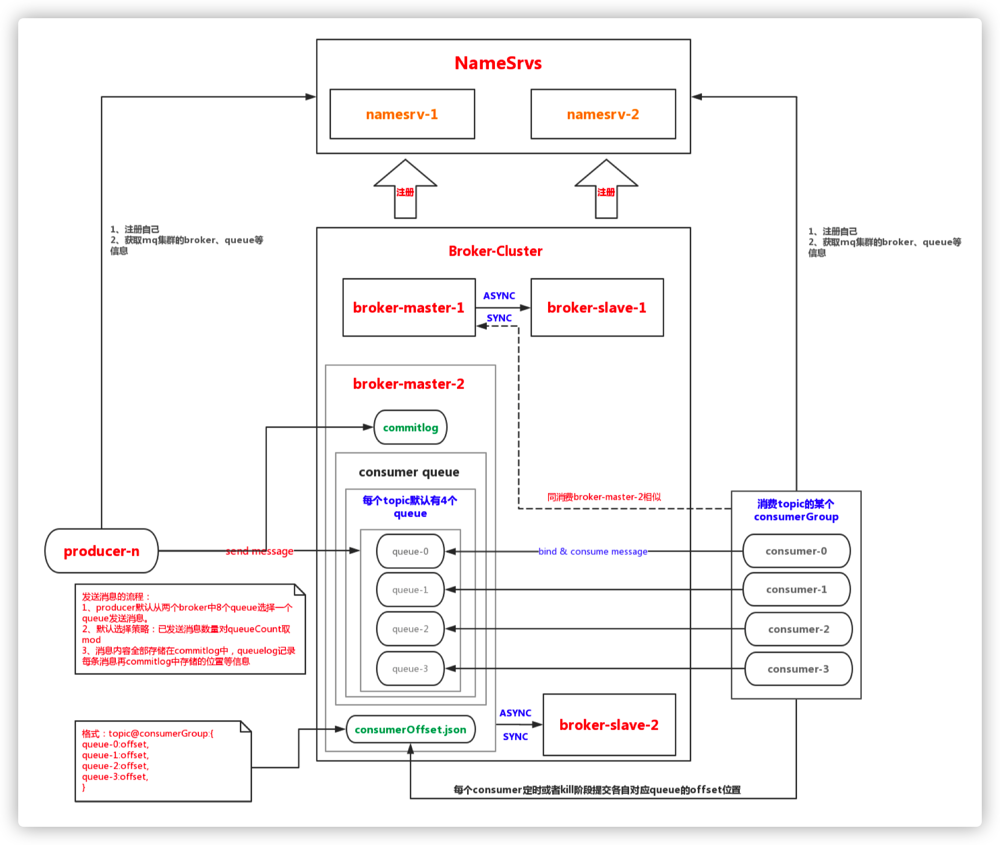

# RocketMQ特性详解&场景介绍

## 1. 基本概念

##### 消息模型

RocketMQ 主要由 Producer、Broker、Consumer 三部分组成，其中 Producer 负责生产消息，Consumer 负责消费消息，Broker 负责存储消息。

##### 消息生产者（producer）

负责生产消息，一般由业务系统负责生产消息。一个消息生产者会把业务应用系统里产生的消息发送到 broker 服务器。RocketMQ 提供多种发送方式，同步发送、异步发送、顺序发送、单向发送。同步和异步方式均需要Broker 返回确认信息，单向发送不需要。

##### 消息消费者（Consumer）

负责消费消息，一般是后台系统负责异步消费。一个消息消费者会从 Broker 服务器拉取消息、并将其提供给应用程序。从用户应用的角度而言提供了两种消费形式：拉取式消费（pull consumer）、推动式消费（push consumer）。

##### 主题（Topic）

表示一类消息的集合，每个主题包含若干条消息，每条消息只能属于一个主题，是 RocketMQ 进行消息订阅的基本单位。

##### 代理服务器（Broker Server）

消息中转角色，负责存储消息、转发消息。代理服务器在 RocketMQ 系统中负责接收从生产者发送来的消息并存储、同时为消费者的拉取请求作准备。代理服务器也存储消息相关的元数据，包括消费者组、消费进度偏移和主题和队列消息等。

##### 名字服务（Name Server）

名称服务充当路由消息的提供者。生产者或消费者能够通过名字服务查找各主题相应的 Broker IP 列表。多个 Namesrv 实例组成集群，但相互独立，没有信息交换。

##### 拉取式消费（Pull Consumer）

Consumer 消费的一种类型，应用通常主动调用 Consumer 的拉消息方法从 Broker 服务器拉消息、主动权由应用控制。一旦获取了批量消息，应用就会启动消费过程。

##### 推动式消费（Push Consumer）

Consumer 消费的一种类型，该模式下 Broker 收到数据后会主动推送给消费端，该消费

模式一般实时性较高。

##### 生产者组（Producer Group） 

同一类 Producer 的集合，这类 Producer 发送同一类消息且发送逻辑一致。如果发送的是事物消息且原始生产者在发送之后崩溃，则 Broker 服务器会联系同一生产者组的其他生产者实例以提交或回溯消费。

##### 消费者组（Consumer Group）

同一类 Consumer 的集合，这类 Consumer 通常消费同一类消息且消费逻辑一致。消费者组使得在消息消费方面，实现负载均衡和容错的目标变得非常容易。要注意的是，消费者组的消费者实例必须订阅完全相同的 Topic。RocketMQ 支持两种消息模式：集群消费（Clustering）和广播消费（Broadcasting）。

#####  集群消费（Clustering）

集群消费模式下，相同 Consumer Group 的每个 Consumer 实例平均分摊消息。

##### 广播消费（Broadcasting）

广播消费模式下，相同 Consumer Group 的每个 Consumer 实例都接收全量的消息。

##### 普通顺序消息（Normal Ordered Message）

普通顺序消费模式下，消费者通过同一个消费队列收到的消息是有顺序的，不同消息队列收到的消息则可能是无顺序的。

##### 严格顺序消息（Strictly Ordered Message）

严格顺序消息模式下，消费者收到的所有消息均是有顺序的。

##### 消息（Message）

消息系统所传输信息的物理载体，生产和消费数据的最小单位，每条消息必须属于一个主题。RocketMQ 中每个消息拥有唯一的 Message ID，且可以携带具有业务标识的 Key。系统提供了通过 Message ID 和 Key 查询消息的功能。

##### 标签（Tag）

为消息设置的标志，用于同一主题下区分不同类型的消息。来自同一业务单元的消息，可以根据不同业务目的在同一主题下设置不同标签。标签能够有效地保持代码的清晰度和连贯性，并优化 RocketMQ 提供的查询系统。消费者可以根据 Tag 实现对不同子主题的不同消费逻辑，实现更好的扩展性。


## 2. RocketMQ整体架构



### 2.1 模块划分

| 名称          | 作用                                         |
| ------------- | -------------------------------------------- |
| broker        | broker模块：c和p端消息存储逻辑               |
| client        | 客户端api：produce、consumer端 接受与发送api |
| common        | 公共组件：常量、基类、数据结构               |
| tools         | 运维tools：命令行工具模块                    |
| store         | 存储模块：消息、索引、commitlog存储          |
| namesrv       | 服务管理模块：服务注册topic等信息存储        |
| remoting      | 远程通讯模块：netty+fastjson                 |
| logappender   | 日志适配模块                                 |
| example       | Demo列子                                     |
| filtersrv     | 消息过滤器模块                               |
| srvutil       | 辅助模块                                     |
| filter        | 过滤模块：消息过滤模块                       |
| distribution  | 部署、运维相关zip包中的代码                  |
| openmessaging | 兼容openmessaging分布式消息模块              |


## 2. RocketMQ特性

### 2.1 Producer端

#### 发送方式

```java
org.apache.rocketmq.client.impl.CommunicationMode

public enum CommunicationMode {
  SYNC,
  ASYNC,
  ONEWAY,
}
```

**Sync**：同步的发送方式，会等待发送结果后才返回

**Async**：异步的发送方式，发送完后，立刻返回。Client 在拿到 Broker 的响应结果后，会 回调指定的 callback. 这个 API 也可以指定 Timeout，不指定也是默认的 3000ms

**Oneway**：比较简单，发出去后，什么都不管直接返回。

#### 发送结果

```java
class：org.apache.rocketmq.client.producer.SendStatus
```

###### SEND_OK

消息发送成功。要注意的是消息发送成功也不意味着它是可靠的。要确保不会丢失任何消息，还应启用同步 Master 服务器或同步刷盘，即 SYNC_MASTER 或 SYNC_FLUSH。

###### FLUSH_DISK_TIMEOUT

消息发送成功但是服务器刷盘超时。此时消息已经进入服务器队列（内存），只有服务器宕机，消息才会丢失。消息存储配置参数中可以设置刷盘方式和同步刷盘时间长度，如果Broker服务器设置了刷盘方式为同步刷盘，即FlushDiskType=SYNC_FLUSH（默认为异步 刷盘方式），当Broker服务器未在同步刷盘时间内（默认为5s）完成刷盘，则将返回该状态——刷盘超时。

###### FLUSH_SLAVE_TIMEOUT

消息发送成功，但是服务器同步到Slave时超时。此时消息已经进入服务器队列，只有服务器宕机，消息才会丢失。如果 Broker 服务器的角色是同步Master，即 SYNC_MASTER（默认是异步 Master 即 ASYNC_MASTER），并且从 Broker 服务器未在同步刷盘时间（默认为5秒）内完成与主服务器的同步，则将返回该状态——数据同步到 Slave 服务器超时。

###### SLAVE_NOT_AVAILABLE

消息发送成功，但是此时 Slave 不可用。如果 Broker 服务器的角色是同步 Master，即 SYNC_MASTER（默认是异步 Master 服务器即 ASYNC_MASTER），但没有配置 slaveBroker 服务器，则将返回该状态——无 Slave 服务器可用。

#### 顺序消息

消息有序指的是可以按照消息的发送顺序来消费(FIFO)。RocketMQ可以严格的保证消息有序，可以分为分区有序或者全局有序。

顺序消费的原理解析，在默认的情况下消息发送会采取Round Robin轮询方式把消息发送到不同的queue(分区队列)；而消费消息的时候从多个queue上拉取消息，这种情况发送和消费是不能保证顺序。但是如果控制发送的顺序消息只依次发送到同一个queue中，消费的时候只从这个queue上依次拉取，则就保证了顺序。当发送和消费参与的queue只有一个，则是全局有序；如果多个queue参与，则为分区有序，即相对每个queue，消息都是有序的。

下面用订单进行分区有序的示例。一个订单的顺序流程是：创建、付款、推送、完成。订单号相同的消息会被先后发送到同一个队列中，消费时，同一个OrderId获取到的肯定是同一个队列。

#### 消费点位

```java
org.apache.rocketmq.client.consumer.listener.ConsumeOrderlyStatus

//消费成功
SUCCESS

//不能跳过消息，等待一下
SUSPEND_CURRENT_QUEUE_A_MOMENT
```

#### 延时消息

定时消息是指消息发到 Broker 后，不能立刻被 Consumer 消费，要到特定的时间点 或者等待特定的时间后才能被消费。

**使用场景**：如电商里，提交了一个订单就可以发送一个延时消息，1h后去检查这个订单的状态，如果还是未付款就取消订单释放库存。

##### 延时机制

```java
/**
 * 延迟级别
 * 当前支持的延迟时间
 * 1s 5s 10s 30s 1m 2m 3m 4m 5m 6m 7m 8m 9m 10m 20m 30m 1h 2h
 * 分别对应级别
 * 1 2 3....................
 */

org.apache.rocketmq.store.config.MessageStoreConfig#messageDelayLevel

private String messageDelayLevel = "1s 5s 10s 30s 1m 2m 3m 4m 5m 6m 7m 8m 9m 10m 20m 30m 1h 2h";

// 设置消息时延
Message message = new Message；
message.setDelayTimeLevel(3);
```

现在RocketMq并不支持任意时间的延时，需要设置几个固定的延时等级，从1s到2h分别对应着等级1到18 消息消费失败会进入延时消息队列，消息发送时间与设置的延时等级和重试次数有关。

#### 批量消息

批量发送消息能显著提高传递小消息的性能。限制是这些批量消息应该有相同的topic，相同的waitStoreMsgOK，而且不能是延时消息。此外，这一批消息的总大小不应超过4MB。rocketmq建议每次批量消息大小大概在1MB。

当消息大小超过4MB时，需要将消息进行分割

#### 过滤消息

大多数情况下，可以通过TAG来选择您想要的消息

```java
DefaultMQPushConsumer consumer = new DefaultMQPushConsumer("CID_EXAMPLE");
consumer.subscribe("TOPIC", "TAGA || TAGB || TAGC");
```

使用Filter功能，需要在启动配置文件当中配置以下选项

```bash
enablePropertyFilter=true
```

消费者将接收包含TAGA或TAGB或TAGC的消息。但是限制是一个消息只能有一个标签，这对于复杂的场景可能不起作用。在这种情况下，可以使用SQL表达式筛选消息。SQL特性可以通过发送消息时的属性来进行计算。在RocketMQ定义的语法下，可以实现一些简单的逻辑。下面是一个例子

```
‐‐‐‐‐‐‐‐‐‐‐‐
| message |
|‐‐‐‐‐‐‐‐‐‐| a > 5 AND b = 'yangguo'
| a = 10 |‐‐‐‐‐‐‐‐‐‐‐‐‐‐‐‐‐‐‐‐> Gotten
| b = 'abc'|
| c = true |
‐‐‐‐‐‐‐‐‐‐‐‐
‐‐‐‐‐‐‐‐‐‐‐‐
| message |
|‐‐‐‐‐‐‐‐‐‐| a > 5 AND b = 'yangguo'
| a = 1 | ‐‐‐‐‐‐‐‐‐‐‐‐‐‐‐‐‐‐‐‐> Missed
| b = 'abc'|
| c = true |
‐‐‐‐‐‐‐‐‐‐‐‐
```

##### 基本语法

```java
/**
 * RocketMQ只定义了一些基本语法来支持这个特性。你也可以很容易地扩展它。
 * 数值比较，比如：>，>=，<，<=，BETWEEN，=；
 * 字符比较，比如：=，<>，IN；
 * IS NULL 或者 IS NOT NULL；
 * 逻辑符号 AND，OR，NOT；
 * 常量支持类型为：
 * 数值，比如：123，3.1415；
 * 字符，比如：'abc'，必须用单引号包裹起来；
 * NULL，特殊的常量
 * 布尔值，TRUE 或 FALSE
 * 只有使用push模式的消费者才能用使用SQL92标准的sql语句，接口如下：
 */
public void subscribe(final String topic, final MessageSelector messageS elector)
```

#### 事务消息

##### 概念

- 事务消息：消息队列 MQ 提供类似 X/Open XA 的分布式事务功能，通过消息队列 MQ 事务消息能达到分布式事务的最终一致。

- 半事务消息：暂不能投递的消息，发送方已经成功地将消息发送到了消息队列MQ 服务端，但是服务端未收到生产者对该消息的二次确认，此时该消息被标记成“暂不能投递”状态，处于该种状态下的消息即半事务消息。

- 消息回查：由于网络闪断、生产者应用重启等原因，导致某条事务消息的二次确认丢失，消息队列 MQ 服务端通过扫描发现某条消息长期处于“半事务消息”时，需要主动向消息生产者询问该消息的最终状态（Commit 或是 Rollback），该询问过程即消息回查。

##### 场景

通过购物车进行下单的流程中，用户入口在购物车系统，交易下单入口在交易系统，两个系统之间的数据需要保持最终一致，这时可以通过事务消息进行处理。交易系统下单之后，发送一条交易下单的消息到消息队列 MQ，购物车系统订阅消息队列 MQ 的交易下单消息，做相应的业务处理，更新购物车数据。

#### 消息状态

```java
org.apache.rocketmq.client.producer.LocalTransactionState

// 提交事务，它允许消费者消费此消息。
LocalTransactionState.CommitTransaction
// 回滚事务，它代表该消息将被删除，不允许被消费
LocalTransactionState.RollbackTransaction
// 中间状态，它代表需要检查消息队列来确定状态
LocalTransactionState.Unknown
```

##### 交互流程


事务消息发送步骤如下：

- 发送方将半事务消息发送至消息队列 MQ 服务端。

- 消息队列 MQ 服务端将消息持久化成功之后，向发送方返回 Ack 确认消息已经发送成功，此时消息为半事务消息。

- 发送方开始执行本地事务逻辑。

- 发送方根据本地事务执行结果向服务端提交二次确认（Commit 或是 Rollback），服务端收到 Commit 状态则将半事务消息标记为可投递，订阅方最终将收到该消息；服务端收到Rollback 状态则删除半事务消息，订阅方将不会接受该消息。

事务消息回查步骤如下：

- 在断网或者是应用重启的特殊情况下，上述步骤 4 提交的二次确认最终未到达服务端，经过固定时间后服务端将对该消息发起消息回查。

- 发送方收到消息回查后，需要检查对应消息的本地事务执行的最终结果。

- 发送方根据检查得到的本地事务的最终状态再次提交二次确认，服务端仍按照步骤 4对半事务消息进行操作。

#### 事务消息限制

- 事务消息不支持延时消息和批量消息。

- 为了避免单个消息被检查太多次而导致半队列消息累积，我们默认将单个消息的检查次 数限制为 15 次，但是用户可以通过 Broker 配置文件的 transactionCheckMax参数来修改 此限制。如果已经检查某条消息超过 N 次的话（ N = transactionCheckMax ） 则 Broker 将丢弃此消息，并在默认情况下同时打印错误日志。用户可以通过重写 AbstractTransactio nCheckListener

- 事务消息将在 Broker 配置文件中的参数 transactionMsgTimeout 这样的特定时间 长度之后被检查。当发送事务消息时，用户还可以通过设置用户属性 CHECK_IMMUNITY_TIME_I N_SECONDS来改变这个限制，该参数优先于 transactionMsgTimeout 参数。

- 事务性消息可能不止一次被检查或消费。

- 提交给用户的目标主题消息可能会失败，目前这依日志的记录而定。它的高可用性通过RocketMQ 本身的高可用性机制来保证，如果希望确保事务消息不丢失、并且事务完整性得到保证，建议使用同步的双重写入机制。

- 事务消息的3生产者 ID 不能与其他类型消息的生产者 ID 共享。与其他类型的消息不同，事务消息允许反向查询、MQ服务器能通过它们的生产者 ID 查询到消费者。

### 2.2 Consumer端

#### 消费模型

consumer有两种消费模型：

```java
// 广播消费，相同Consumer Group的每个Consumer实例都接收全量的消息
org.apache.rocketmq.common.protocol.heartbeat.MessageModel#BROADCASTING

// 集群消费,相同Consumer Group的每个Consumer实例平均分摊消息
org.apache.rocketmq.common.protocol.heartbeat.MessageModel#CLUSTERING
```

#### 消费点位

```java
// 当建立一个新的消费者组时，需要决定是否需要消费已经存在于 Broker 中的历史消息
org.apache.rocketmq.common.consumer.ConsumeFromWhere

// CONSUME_FROM_LAST_OFFSET 将会忽略历史消息，并消费之后生成的任何消息。
// CONSUME_FROM_FIRST_OFFSET 将会消费每个存在于 Broker 中的信息。你也可以使用
// CONSUME_FROM_TIMESTAMP 来消费在指定时间戳后产生的消息。
```

#### 消息重复幂等

RocketMQ无法避免消息重复，所以如果业务对消费重复非常敏感，务必要在业务层 面去重幂等令牌是生产者和消费者两者中的既定协议，在业务中通常是具备唯一业务标识的字符串，如：订单号、流水号等。且一般由生产者端生成并传递给消费者端。
