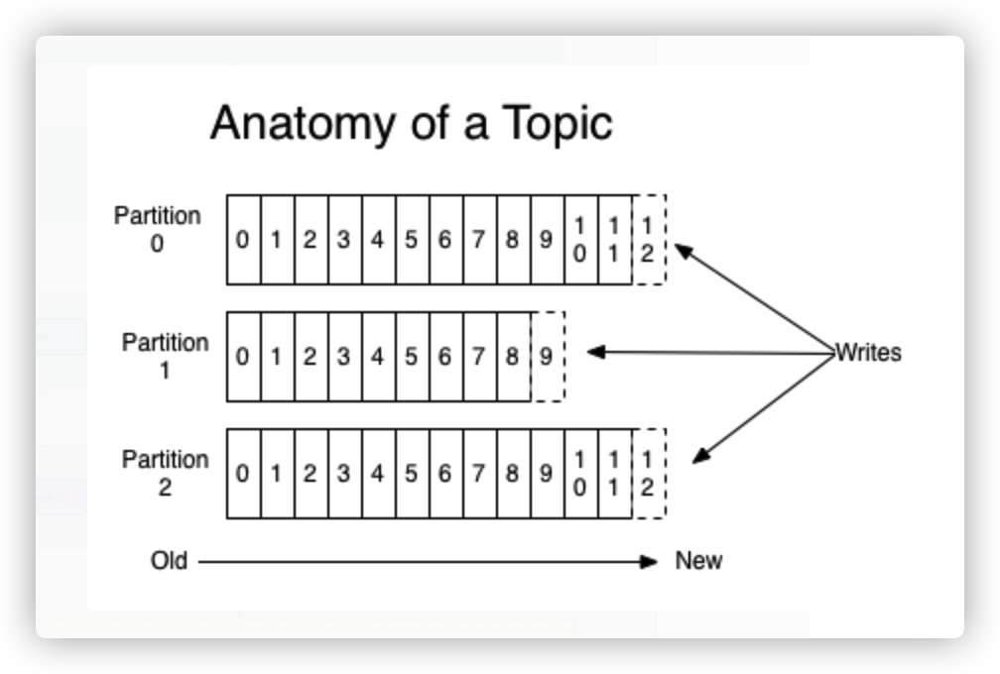
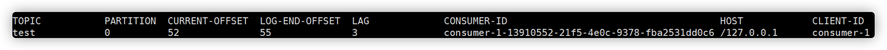
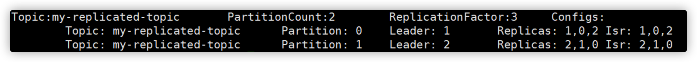
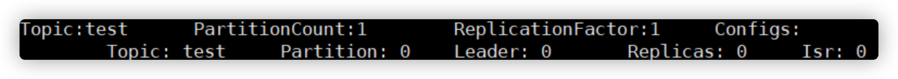
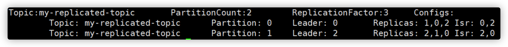
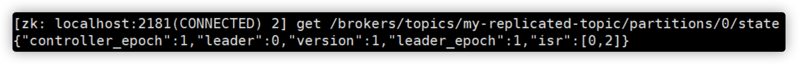

# Kafka集群搭建与使用

Kafka是最初由Linkedin公司开发，是一个分布式、支持分区的（partition）、多副本的（replica），基于zookeeper协调的分布式消息系统，它的最大的特性就是可以实时的处理大量数据以满足各种需求场景：比如基于hadoop的批处理系统、低延迟的实时系统、Storm/Spark流式处理引擎，web/nginx日志、访问日志，消息服务等等，用scala语言编写，Linkedin于2010年贡献给了Apache基金会并成为顶级开源 项目。

## 1. Kafka的使用场景

- 日志收集：一个公司可以用Kafka收集各种服务的log，通过kafka以统一接口服务的方式开放给各种consumer，例如hadoop、Hbase、Solr等。
- 消息系统：解耦和生产者和消费者、缓存消息等。
- 用户活动跟踪：Kafka经常被用来记录web用户或者app用户的各种活动，如浏览网页、搜索、点击等活动，这些活动信息被各个服务器发布到kafka的topic中，然后订阅者通过订阅这些topic来做实时的监控分析，或者装载到hadoop、数据仓库中做离线分析和挖掘。
- 运营指标：Kafka也经常用来记录运营监控数据。包括收集各种分布式应用的数据，生产各种操作的集中反馈，比如报警和报告。


## 2. Kafka基本概念

kafka是一个分布式的，分区的消息(官方称之为commit log)服务。它提供一个消息系统应该具备的功能，但是确有着独特的设计。可以这样来说，Kafka借鉴了JMS规范的思想，但是确并**没有完全遵循JMS规范。**

首先，让我们来看一下基础的消息(Message)相关术语：

| **名称**      | **解释**                                                     |
| ------------- | ------------------------------------------------------------ |
| Broker        | 消息中间件处理节点，一个Kafka节点就是一个broker，一个或者多个Broker可以组成一个Kafka集群 |
| Topic         | Kafka根据topic对消息进行归类，发布到Kafka集群的每条消息都需要指定一个topic |
| Producer      | 消息生产者，向Broker发送消息的客户端                         |
| Consumer      | 消息消费者，从Broker读取消息的客户端                         |
| ConsumerGroup | 每个Consumer属于一个特定的Consumer Group，一条消息可以被多个不同的Consumer Group消费，但是一个Consumer Group中只能有一个Consumer能够消费该消息 |
| Partition     | 物理上的概念，一个topic可以分为多个partition，每个partition内部消息是有序的 |

因此，从一个较高的层面上来看，producer通过网络发送消息到Kafka集群，然后consumer来进行消费，如下图：


服务端(brokers)和客户端(producer、consumer)之间通信通过**TCP协议**来完成。

### 2.1 主题Topic和消息日志Log

让我们首先深入理解Kafka提出一个高层次的抽象概念-Topic。

可以理解**Topic是一个类别的名称**，同类消息发送到同一个Topic下面。对于每一个Topic，下面可以有多个分区(**Partition)**日志文件:



Partition是一个**有序的message序列**，这些message按顺序添加到一个叫做**commit log的文件**中。每个partition中的消息都有一个唯一的编号，称之为offset，用来唯一标示某个分区中的message。 

> **提示**
>
> 每个partition，都对应一个commit log文件。一个partition中的message的offset都是唯一的，但是不同的partition中的message的offset可能是相同的。

### 2.2 理解Topic，Partition和Broker

一个topic，代表逻辑上的一个业务数据集，比如按数据库里不同表的数据操作消息区分放入不同topic，订单相关操作消息放入订单topic，用户相关操作消息放入用户topic，对于大型网站来说，后端数据都是海量的，订单消息很可能是非常巨量的，比如有几百个G甚至达到TB级别，如果把这么多数据都放在一台机器上可定会有容量限制问题，那么就可以在topic内部划分多个partition来分片存储数据，不同的partition可以位于不同的机器上，每台机器上都运行一个Kafka的进程Broker。

kafka集群，在配置的时间范围内，维护所有的由producer生成的消息，而不管这些消息有没有被消费。**例如**日志保留( log retention )时间被设置为2天。kafka会维护最近2天生产的所有消息，而2天前的消息会被丢弃。kafka的性能与保留的数据量的大小没有关系，因此保存大量的数据(日志信息)不会有什么影响。

**每个consumer是基于自己在commit log中的消费进度(offset)来进行工作的**。在kafka中，**消费offset由consumer自己来维护**；一般情况下我们按照顺序逐条消费commit log中的消息，当然我可以通过指定offset来重复消费某些消息，或者跳过某些消息。

这意味kafka中的consumer对集群的影响是非常小的，添加一个或者减少一个consumer，对于集群或者其他consumer来说，都是没有影响的，因为每个consumer维护各自的offset。**所以说kafka集群是无状态的，性能不会因为consumer数量受太多影响。kafka还将很多关键信息记录在zookeeper里，保证自己的无状态，从而在水平扩容时非常方便。**

### 2.3 Topic下数据进行分区存储

- commit log文件会受到所在机器的文件系统大小的限制，分区之后，理论上一个topic可以处理任意数量的数据。

- 为了**提高并行度**。


## 3. 分布式Distribution

log的partitions分布在kafka集群中不同的broker上，每个broker可以请求备份其他broker上partition上的数据。kafka集群支持配置一个partition备份的数量。

针对每个partition，都有一个broker起到“leader”的作用，0个或多个其他的broker作为“follwers”的作用。**leader处理所有的针对这个partition的读写请求，而followers被动复制leader的结果**。如果这个leader失效了，其中的一个follower将会自动的变成新的leader。

#### Producers

生产者将消息发送到topic中去，同时负责选择将message发送到topic的哪一个partition中。通过round-robin做简单的负载均衡。也可以根据消息中的某一个关键字来进行区分。通常第二种方式使用的更多。

#### Consumers

传统的消息传递模式有2种：队列( queue) 和（publish-subscribe）

- queue模式：多个consumer从服务器中读取数据，消息只会到达一个consumer。
- publish-subscribe模式：消息会被广播给所有的consumer。

Kafka基于这2种模式提供了一种consumer的抽象概念：consumer group。

- queue模式：所有的consumer都位于同一个consumer group 下。
- publish-subscribe模式：所有的consumer都有着自己唯一的consumer group。


上图说明：由2个broker组成的kafka集群，总共有4个partition(P0-P3)。这个集群由2个Consumer Group， A有2个consumer instances ，B有四个。

通常一个topic会有几个consumer group，每个consumer group都是一个逻辑上的订阅者（logical subscriber）。每个consumer group由多个consumer instance组成，从而达到可扩展和容灾的功能。

### 3.1 消费顺序

Kafka比传统的消息系统有着更强的**顺序保证**。

**一个partition同一个时刻在一个consumer group中只有一个consumer instance在消费，从而保证顺序**。

**consumer group中的consumer instance的数量不能比一个Topic中的partition的数量多，否则，多出来的consumer消费不到消息**。

Kafka只在partition的范围内保证消息消费的局部顺序性，不能在同一个topic中的多个partition中保证总的消费顺序性。

如果有在总体上保证消费顺序的需求，那么我们可以通过将topic的partition数量设置为1，将consumer group中的consumer instance数量也设置为1。

从较高的层面上来说的话，Kafka提供了以下的保证：

发送到一个Topic中的message会按照发送的顺序添加到commit log中。意思是，如果消息 M1，M2由同一个producer发送，M1比M2发送的早的话，那么在commit log中，M1的offset就会比commit 2的offset小。

一个consumer在commit log中可以按照发送顺序来消费message。

如果一个topic的备份因子设置为N，那么Kafka可以容忍N-1个服务器的失败，而存储在commit log中的消息不会丢失。


## 4. kafka集群搭建与使用

### 4.1 安装前的环境准备

由于Kafka是用Scala语言开发的，运行在JVM上，因此在安装Kafka之前需要先安装JDK。

```bash
yum install java-1.8.0-openjdk* -y
```

kafka依赖zookeeper，所以需要先安装zookeeper

```bash
wget http://mirror.bit.edu.cn/apache/zookeeper/stable/zookeeper-3.4.12.tar.gz
tar -zxvf zookeeper-3.4.12.tar.gz
cd zookeeper-3.4.12
cp conf/zoo_sample.cfg conf/zoo.cfg

# 启动zookeeper
bin/zkServer.sh start
bin/zkCli.sh 
ls /			#查看zk的根目录相关节点
```

#### 下载安装包

下载2.2.0 release版本，并解压：

```bash
wget https://archive.apache.org/dist/kafka/1.1.0/kafka_2.11-1.1.0.tgz
tar -xzf kafka_2.11-1.1.0.tgz
cd kafka_2.11-1.1.0
```

#### 启动服务

现在来启动kafka服务：

启动脚本语法：

```bash
kafka-server-start.sh [-daemon] server.properties
```

可以看到，server.properties的配置路径是一个强制的参数，-daemon表示以后台进程运行，否则ssh客户端退出后，就会停止服务。(注意，在启动kafka时会使用linux主机名关联的ip地址，所以需要把主机名和linux的ip映射配置到本地host里，用vim /etc/hosts)

```bash
bin/kafka-server-start.sh -daemon config/server.properties

# 我们进入zookeeper目录通过zookeeper客户端查看下zookeeper的目录树
bin/zkCli.sh 
ls /		#查看zk的根目录kafka相关节点
ls /brokers/ids	#查看kafka节点
```

##### server.properties核心配置详解

| **Property**        | **Default**     | **Description**                                              |
| ------------------- | --------------- | ------------------------------------------------------------ |
| broker.id           | 0               | 每个broker都可以用一个唯一的非负整数id进行标识；这个id可以作为broker的“名字”，你可以选择任意你喜欢的数字作为id，只要id是唯一的即可。 |
| log.dirs            | /tmp/kafka-logs | kafka存放数据的路径。这个路径并不是唯一的，可以是多个，路径之间只需要使用逗号分隔即可；每当创建新partition时，都会选择在包含最少partitions的路径下进行。 |
| listeners           | 9092            | server接受客户端连接的端口                                   |
| zookeeper.connect   | localhost:2181  | zooKeeper连接字符串的格式为：hostname:port，此处hostname和port分别是ZooKeeper集群中某个节点的host和port；zookeeper如果是集群，连接方式为 hostname1:port1, hostname2:port2, hostname3:port3 |
| log.retention.hours | 168             | 每个日志文件删除之前保存的时间。默认数据保存时间对所有topic都一样。 |
| min.insync.replicas | 1               | 当producer设置acks为-1时，min.insync.replicas指定replicas的最小数目（必须确认每一个repica的写数据都是成功的），如果这个数目没有达到，producer发送消息会产生异常 |
| delete.topic.enable | false           | 是否允许删除主题                                             |

#### 创建主题

现在我们来创建一个名字为“test”的Topic，这个topic只有一个partition，并且备份因子也设置为1：

```bash
bin/kafka-topics.sh --create --zookeeper 192.168.0.60:2181 --replication-factor 1 --partitions 1 --topic test
```

现在我们可以通过以下命令来查看kafka中目前存在的topic

```bash
bin/kafka-topics.sh --list --zookeeper 192.168.0.60:2181
```

除了我们通过手工的方式创建Topic，当producer发布一个消息到某个指定的Topic，这个Topic如果不存在，就自动创建。

###### 删除主题

```bash
bin/kafka-topics.sh --delete --topic test --zookeeper 192.168.0.60:2181
```

#### 发送消息

kafka自带了一个producer命令客户端，可以从本地文件中读取内容，或者我们也可以以命令行中直接输入内容，并将这些内容以消息的形式发送到kafka集群中。在默认情况下，每一个行会被当做成一个独立的消息。

首先我们要运行发布消息的脚本，然后在命令中输入要发送的消息的内容：

```bash
bin/kafka-console-producer.sh --broker-list 192.168.0.60:9092 --topic test 
>this is a msg
>this is a another msg 
```

#### 消费消息

对于consumer，kafka同样也携带了一个命令行客户端，会将获取到内容在命令中进行输出，**默认是消费最新的消息**：

```bash
bin/kafka-console-consumer.sh --bootstrap-server 192.168.0.60:9092  --consumer-property group.id=testGroup --topic test   
```

如果想要消费之前的消息可以通过--from-beginning参数指定，如下命令：

```bash
bin/kafka-console-consumer.sh --bootstrap-server 192.168.0.60:9092 --from-beginning --topic test 
```

如果你是通过不同的终端窗口来运行以上的命令，你将会看到在producer终端输入的内容，很快就会在consumer的终端窗口上显示出来。

以上所有的命令都有一些附加的选项；当我们不携带任何参数运行命令的时候，将会显示出这个命令的详细用法。

#### 其他命令

##### 查看组名

```bash
bin/kafka-consumer-groups.sh --bootstrap-server 192.168.0.60:9092 --list 
```

##### 查看消费者的消费偏移量

```bash
bin/kafka-consumer-groups.sh --bootstrap-server 192.168.0.60:9092 --describe --group testGroup
```



注意看**current-offset** 和 **log-end-offset**还有 **lag** ，分别为当前消费偏移量，结束的偏移量(HW)，落后消费的消息数

##### 消费多主题

```bash
bin/kafka-console-consumer.sh --bootstrap-server 192.168.0.60:9092 --whitelist "test|test-2"
```

##### 单播消费

一条消息只能被某一个消费者消费的模式，类似queue模式，只需让所有消费者在同一个消费组里即可分别在两个客户端执行如下消费命令，然后往主题里发送消息，结果只有一个客户端能收到消息

```bash
bin/kafka-console-consumer.sh --bootstrap-server 192.168.0.60:9092  --consumer-property group.id=testGroup --topic test 
```

##### 多播消费

一条消息能被多个消费者消费的模式，类似publish-subscribe模式费，针对Kafka同一条消息只能被同一个消费组下的某一个消费者消费的特性，要实现多播只要保证这些消费者属于不同的消费组即可。我们再增加一个消费者，该消费者属于testGroup-2消费组，结果两个客户端都能收到消息

```bash
bin/kafka-console-consumer.sh --bootstrap-server 192.168.0.60:9092 --consumer-property group.id=testGroup-2 --topic test 
```

#### kafka集群配置

到目前为止，我们都是在一个单节点上运行broker，这并没有什么意思。对于kafka来说，一个单独的broker意味着kafka集群中只有一个节点。要想增加kafka集群中的节点数量，只需要多启动几个broker实例即可。为了有更好的理解，现在我们在一台机器上同时启动三个broker实例。

首先，我们需要建立好其他2个broker的配置文件：

```bash
cp config/server.properties config/server-1.properties
cp config/server.properties config/server-2.properties
```

配置文件的内容分别如下：

###### config/server-1.properties

```bash
#broker.id属性在kafka集群中必须要是唯一
broker.id=1
#kafka部署的机器ip和提供服务的端口号
listeners=PLAINTEXT://192.168.0.60:9093   
log.dir=/usr/local/data/kafka-logs-1
```

###### config/server-2.properties

```bash
broker.id=2
listeners=PLAINTEXT://192.168.0.60:9094
log.dir=/usr/local/data/kafka-logs-2
```

目前我们已经有一个zookeeper实例和一个broker实例在运行了，现在我们只需要在启动2个broker实例即可：

```bash
bin/kafka-server-start.sh -daemon config/server-1.properties
bin/kafka-server-start.sh -daemon config/server-2.properties
```

现在我们创建一个新的topic，副本数设置为3，分区数设置为2：

```bash
bin/kafka-topics.sh --create --zookeeper 192.168.0.60:2181 --replication-factor 3 --partitions 2 --topic my-replicated-topic
```

##### 查看下topic的情况

```bash
 bin/kafka-topics.sh --describe --zookeeper 192.168.0.60:2181 --topic my-replicated-topic
```



以下是输出内容的解释，第一行是所有分区的概要信息，之后的每一行表示每一个partition的信息。

- leader节点负责给定partition的所有读写请求。
- replicas 表示某个partition在哪几个broker上存在备份。不管这个几点是不是”leader“，甚至这个节点挂了，也会列出。
- isr 是replicas的一个子集，它只列出当前还存活着的，并且**已同步备份**了该partition的节点。

我们可以运行相同的命令查看之前创建的名称为”test“的topic

```bash
bin/kafka-topics.sh --describe --zookeeper 192.168.0.60:2181 --topic test 
```



之前设置了topic的partition数量为1，备份因子为1，因此显示就如上所示了。当然我们也可以通过如下命令**增加topic的分区数量(目前kafka不支持减少分区)**：

```bash
bin/kafka-topics.sh -alter --partitions 3 --zookeeper 127.0.0.1:2181 --topic test
```

现在我们向新建的 my-replicated-topic 中发送一些message，kafka集群可以加上所有kafka节点：

```bash
bin/kafka-console-producer.sh --broker-list 192.168.0.60:9092,192.168.0.60:9093,192.168.0.60:9094 --topic my-replicated-topic
>my test msg 1
>my test msg 2
```

现在开始消费：

```bash
bin/kafka-console-consumer.sh --bootstrap-server 192.168.0.60:9092,192.168.0.60:9093,192.168.0.60:9094 --from-beginning --topic my-replicated-topic
my test msg 1
my test msg 2
```

现在我们来测试我们容错性，因为broker1目前是my-replicated-topic的分区0的leader，所以我们要将其kill

```bash
ps -ef | grep server.properties
kill -9 14776
```

现在再执行命令：

```bash
bin/kafka-topics.sh --describe --zookeeper 192.168.0.60:9092 --topic my-replicated-topic
```



我们可以看到，分区0的leader节点已经变成了broker 0。要注意的是，在Isr中，已经没有了1号节点。leader的选举也是从ISR(in-sync replica)中进行的。

此时，我们依然可以 消费新消息：

```bash
bin/kafka-console-consumer.sh --bootstrap-server 192.168.0.60:9092 --from-beginning --topic my-replicated-topic
my test msg 1
my test msg 2
```

查看主题分区对应的leader信息：



### 4.2 Java客户端访问Kafka

引入maven依赖

```xml
<dependency>
   <groupId>org.apache.kafka</groupId>
   <artifactId>kafka-clients</artifactId>
   <version>1.1.0</version>
</dependency>
```

消息发送端代码

```java
public class MsgProducer {
    public static void main(String[] args) throws InterruptedException, ExecutionException {
        Properties props = new Properties();
        props.put(ProducerConfig.BOOTSTRAP_SERVERS_CONFIG, "192.168.0.60:9092,192.168.0.60:9093,192.168.0.60:9094");
        /*
         发出消息持久化机制参数
        （1）acks=0： 表示producer不需要等待任何broker确认收到消息的回复，就可以继续发送下一条消息。性能最高，但是最容易丢消息。
        （2）acks=1： 至少要等待leader已经成功将数据写入本地log，但是不需要等待所有follower是否成功写入。就可以继续发送下一条消息。这种情况下，如果follower没有成功备份数据，而此时leader
        又挂掉，则消息会丢失。
        （3）acks=-1或all： 这意味着leader需要等待所有备份(min.insync.replicas配置的备份个数)都成功写入日志，这种策略会保证只要有一个备份存活就不会丢失数据。
                            这是最强的数据保证。一般除非是金融级别，或跟钱打交道的场景才会使用这种配置。
        */
        props.put(ProducerConfig.ACKS_CONFIG, "1");
        //发送失败会重试，默认重试间隔100ms，重试能保证消息发送的可靠性，但是也可能造成消息重复发送，比如网络抖动，所以需要在接收者那边做好消息接收的幂等性处理
        props.put(ProducerConfig.RETRIES_CONFIG, 3);
        //重试间隔设置
        props.put(ProducerConfig.RETRY_BACKOFF_MS_CONFIG, 300);
        //设置发送消息的本地缓冲区，如果设置了该缓冲区，消息会先发送到本地缓冲区，可以提高消息发送性能，默认值是33554432，即32MB
        props.put(ProducerConfig.BUFFER_MEMORY_CONFIG, 33554432);
        //kafka本地线程会从缓冲区取数据，批量发送到broker，
        //设置批量发送消息的大小，默认值是16384，即16kb，就是说一个batch满了16kb就发送出去
        props.put(ProducerConfig.BATCH_SIZE_CONFIG, 16384);
        //默认值是0，意思就是消息必须立即被发送，但这样会影响性能
        //一般设置100毫秒左右，就是说这个消息发送完后会进入本地的一个batch，如果100毫秒内，这个batch满了16kb就会随batch一起被发送出去
        //如果100毫秒内，batch没满，那么也必须把消息发送出去，不能让消息的发送延迟时间太长
        props.put(ProducerConfig.LINGER_MS_CONFIG, 100);
        //把发送的key从字符串序列化为字节数组
        props.put(ProducerConfig.KEY_SERIALIZER_CLASS_CONFIG, StringSerializer.class.getName());
        //把发送消息value从字符串序列化为字节数组
        props.put(ProducerConfig.VALUE_SERIALIZER_CLASS_CONFIG, StringSerializer.class.getName());

        Producer<String, String> producer = new KafkaProducer<>(props);

        int msgNum = 5;
        CountDownLatch countDownLatch = new CountDownLatch(msgNum);
        for (int i = 1; i <= msgNum; i++) {
            Order order = new Order(i, 100 + i, 1, 1000.00);
            //指定发送分区
            ProducerRecord<String, String> producerRecord = new ProducerRecord<String, String>("order-topic"
                    , 0, order.getOrderId().toString(), JSON.toJSONString(order));
            //未指定发送分区，具体发送的分区计算公式：hash(key)%partitionNum
            /*ProducerRecord<String, String> producerRecord = new ProducerRecord<String, String>("my-replicated-topic"
                    , order.getOrderId().toString(), JSON.toJSONString(order));*/

            //等待消息发送成功的同步阻塞方法
         /*RecordMetadata metadata = producer.send(producerRecord).get();
         System.out.println("同步方式发送消息结果：" + "topic-" + metadata.topic() + "|partition-"
                 + metadata.partition() + "|offset-" + metadata.offset());*/

            //异步方式发送消息
            producer.send(producerRecord, new Callback() {
                @Override
                public void onCompletion(RecordMetadata metadata, Exception exception) {
                    if (exception != null) {
                        System.err.println("发送消息失败：" + exception.getStackTrace());

                    }
                    if (metadata != null) {
                        System.out.println("异步方式发送消息结果：" + "topic-" + metadata.topic() + "|partition-"
                                + metadata.partition() + "|offset-" + metadata.offset());
                    }
                    countDownLatch.countDown();
                }
            });

            //送积分 TODO

        }

        countDownLatch.await(5, TimeUnit.SECONDS);
        producer.close();
    }
}
```

消息接收端代码

```java
public class MsgConsumer {
    public static void main(String[] args) {
        Properties props = new Properties();
        props.put(ConsumerConfig.BOOTSTRAP_SERVERS_CONFIG, "192.168.0.60:9092,192.168.0.60:9093,192.168.0.60:9094");
        // 消费分组名
        props.put(ConsumerConfig.GROUP_ID_CONFIG, "testGroup");
        // 是否自动提交offset
      /*props.put(ConsumerConfig.ENABLE_AUTO_COMMIT_CONFIG, "true");
      // 自动提交offset的间隔时间
      props.put(ConsumerConfig.AUTO_COMMIT_INTERVAL_MS_CONFIG , "1000");*/
        props.put(ConsumerConfig.ENABLE_AUTO_COMMIT_CONFIG, "false");
      /*
      心跳时间，服务端broker通过心跳确认consumer是否故障，如果发现故障，就会通过心跳下发
      rebalance的指令给其他的consumer通知他们进行rebalance操作，这个时间可以稍微短一点
      */
        props.put(ConsumerConfig.HEARTBEAT_INTERVAL_MS_CONFIG, 1000);
        //服务端broker多久感知不到一个consumer心跳就认为他故障了，默认是10秒
        props.put(ConsumerConfig.SESSION_TIMEOUT_MS_CONFIG, 10 * 1000);
        /*
        如果两次poll操作间隔超过了这个时间，broker就会认为这个consumer处理能力太弱，
        会将其踢出消费组，将分区分配给别的consumer消费
        */
        props.put(ConsumerConfig.MAX_POLL_INTERVAL_MS_CONFIG, 30 * 1000);
        props.put(ConsumerConfig.KEY_DESERIALIZER_CLASS_CONFIG, StringDeserializer.class.getName());
        props.put(ConsumerConfig.VALUE_DESERIALIZER_CLASS_CONFIG, StringDeserializer.class.getName());
        KafkaConsumer<String, String> consumer = new KafkaConsumer<>(props);
        // 消费主题
        String topicName = "order-topic";
        //consumer.subscribe(Arrays.asList(topicName));
        // 消费指定分区
        //consumer.assign(Arrays.asList(new TopicPartition(topicName, 0)));

        //消息回溯消费
        consumer.assign(Arrays.asList(new TopicPartition(topicName, 0)));
        consumer.seekToBeginning(Arrays.asList(new TopicPartition(topicName, 0)));
        //指定offset消费
        //consumer.seek(new TopicPartition(topicName, 0), 10);

        while (true) {
            /*
             * poll() API 是拉取消息的长轮询，主要是判断consumer是否还活着，只要我们持续调用poll()，
             * 消费者就会存活在自己所在的group中，并且持续的消费指定partition的消息。
             * 底层是这么做的：消费者向server持续发送心跳，如果一个时间段（session.
             * timeout.ms）consumer挂掉或是不能发送心跳，这个消费者会被认为是挂掉了，
             * 这个Partition也会被重新分配给其他consumer
             */
            ConsumerRecords<String, String> records = consumer.poll(Integer.MAX_VALUE);
            for (ConsumerRecord<String, String> record : records) {
                System.out.printf("收到消息：offset = %d, key = %s, value = %s%n", record.offset(), record.key(),
                        record.value());
            }

            if (records.count() > 0) {
                // 提交offset
                consumer.commitSync();
            }
        }
    }
}
```

### 4.3 Spring Boot整合Kafka

引入spring boot kafka依赖，详见项目实例：spring-boot-kafka

```xml
<dependency>
    <groupId>org.springframework.kafka</groupId>
    <artifactId>spring-kafka</artifactId>
</dependency>
```

application.yml配置如下：

```yml
server:
  port: 8080

spring:
  kafka:
    bootstrap-servers: 192.168.0.60:9092,192.168.0.60:9093
    producer: # 生产者
      retries: 3 # 设置大于0的值，则客户端会将发送失败的记录重新发送
      batch-size: 16384
      buffer-memory: 33554432
      # 指定消息key和消息体的编解码方式
      key-serializer: org.apache.kafka.common.serialization.StringSerializer
      value-serializer: org.apache.kafka.common.serialization.StringSerializer
    consumer:
      group-id: mygroup
      enable-auto-commit: true
```

发送者代码：

```java
@RestController
public class KafkaController {

    @Autowired
    private KafkaTemplate<String, String> kafkaTemplate;

    @RequestMapping("/send")
    public void send() {
        kafkaTemplate.send("mytopic", 0, "key", "this is a msg");
    }

}
```

消费者代码：

```java
@Component
public class MyConsumer {

    /**
     * @KafkaListener(groupId = "testGroup", topicPartitions = {
     *             @TopicPartition(topic = "topic1", partitions = {"0", "1"}),
     *             @TopicPartition(topic = "topic2", partitions = "0",
     *                     partitionOffsets = @PartitionOffset(partition = "1", initialOffset = "100"))
     *     },concurrency = "6")
     *  //concurrency就是同组下的消费者个数，就是并发消费数，必须小于等于分区总数
     * @param record
     */
    @KafkaListener(topics = "mytopic",groupId = "testGroup")
    public void listen(ConsumerRecord<String, String> record) {
        String value = record.value();
        System.out.println(value);
        System.out.println(record);
    }
}
```